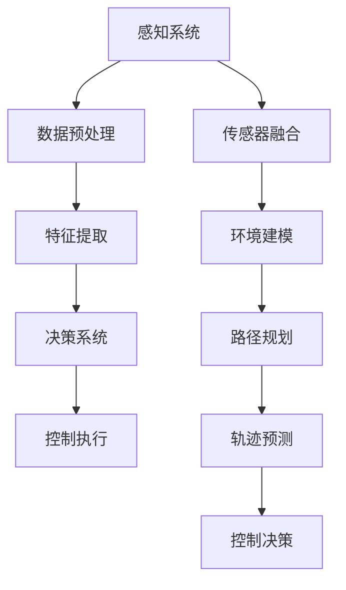
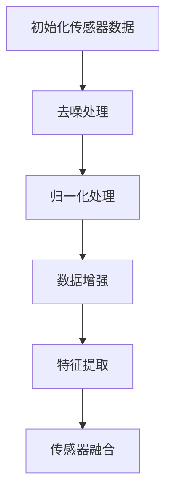
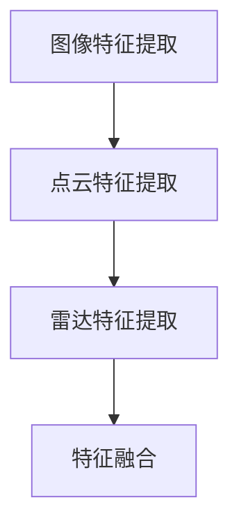
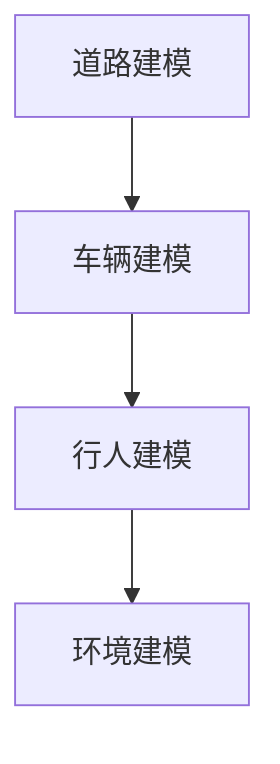
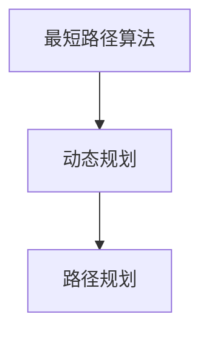
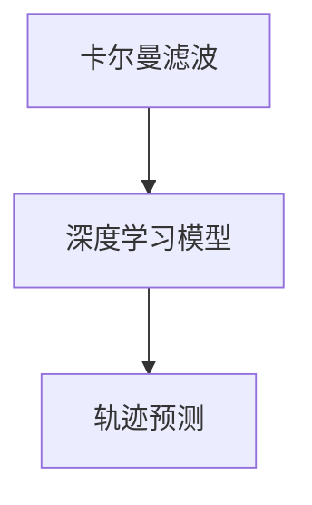
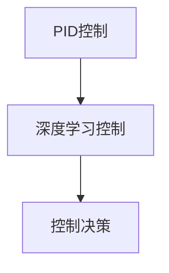

                 

# 特斯拉FSD V12的车端算力使用情况分析

## 关键词
- 特斯拉
- FSD V12
- 车端算力
- 自动驾驶
- 人工智能
- 算法优化
- 硬件架构

## 摘要
本文将深入分析特斯拉FSD V12（Full Self-Driving）的硬件和软件架构，探讨其车端算力的使用情况。我们将从背景介绍、核心概念、算法原理、数学模型、项目实战、实际应用场景等多个角度，详细解析特斯拉在自动驾驶领域的创新与挑战。

## 1. 背景介绍

### 1.1 目的和范围
本文旨在通过系统性的分析，帮助读者理解特斯拉FSD V12的算力使用情况，从而揭示其自动驾驶技术的核心优势与潜在局限。

### 1.2 预期读者
本文适合对自动驾驶技术和特斯拉FSD V12有一定了解的读者，包括计算机科学、人工智能、软件工程等相关领域的专业人士。

### 1.3 文档结构概述
本文结构如下：
- 1. 背景介绍
  - 1.1 目的和范围
  - 1.2 预期读者
  - 1.3 文档结构概述
  - 1.4 术语表
- 2. 核心概念与联系
- 3. 核心算法原理 & 具体操作步骤
- 4. 数学模型和公式 & 详细讲解 & 举例说明
- 5. 项目实战：代码实际案例和详细解释说明
- 6. 实际应用场景
- 7. 工具和资源推荐
- 8. 总结：未来发展趋势与挑战
- 9. 附录：常见问题与解答
- 10. 扩展阅读 & 参考资料

### 1.4 术语表

#### 1.4.1 核心术语定义
- **FSD V12**: 特斯拉全自动驾驶系统，V12代表其版本号。
- **车端算力**: 指车辆上集成的计算资源，包括CPU、GPU、AI加速器等。
- **自动驾驶**: 一种通过计算机系统实现车辆自动行驶的技术。

#### 1.4.2 相关概念解释
- **感知系统**: 指车辆用于获取周围环境信息的传感器，如摄像头、激光雷达、毫米波雷达等。
- **决策系统**: 基于感知系统提供的数据，由算法决定的车辆控制策略。

#### 1.4.3 缩略词列表
- **AI**: 人工智能
- **GPU**: 图形处理单元
- **CPU**: 中央处理单元

## 2. 核心概念与联系

为了更好地理解特斯拉FSD V12的车端算力使用情况，我们首先需要了解一些核心概念和它们之间的联系。以下是相关概念和架构的Mermaid流程图：



### 2.1 感知系统

感知系统是自动驾驶技术的基石，它通过摄像头、激光雷达、毫米波雷达等传感器获取车辆周围的环境信息。以下是感知系统的详细解释：

- **摄像头**: 用于获取车辆周围的视频数据，常用于识别道路、车辆、行人等。
- **激光雷达**: 通过发射激光并测量反射时间，生成车辆周围的三维点云数据，精确度高，适用于复杂环境的感知。
- **毫米波雷达**: 用于检测车辆前方的障碍物，通过发射和接收毫米波信号，计算障碍物的距离和速度。

### 2.2 数据预处理

数据预处理是感知系统输出数据前的重要步骤，包括去噪、归一化、数据增强等。以下是数据预处理的详细解释：

- **去噪**: 减少传感器数据中的噪声，提高数据质量。
- **归一化**: 将不同传感器采集到的数据进行归一化处理，使其具有相似的尺度，便于后续处理。
- **数据增强**: 通过旋转、缩放、裁剪等操作，增加训练数据多样性，提高算法的泛化能力。

### 2.3 特征提取

特征提取是将原始数据转化为对自动驾驶算法有用的信息。以下是特征提取的详细解释：

- **图像特征**: 从摄像头数据中提取图像特征，如边缘、角点、颜色等。
- **点云特征**: 从激光雷达数据中提取点云特征，如点的密度、距离等。
- **雷达特征**: 从毫米波雷达数据中提取特征，如目标的距离、速度等。

### 2.4 传感器融合

传感器融合是将不同传感器获取的数据进行整合，以获得更全面的环境感知。以下是传感器融合的详细解释：

- **多传感器数据融合**: 将摄像头、激光雷达、毫米波雷达等数据融合，提高感知的准确性和鲁棒性。
- **卡尔曼滤波**: 一种常用的传感器融合算法，通过预测和校正，提高融合数据的质量。

### 2.5 环境建模

环境建模是将感知系统获取的信息构建成一个虚拟环境，以供自动驾驶算法进行决策。以下是环境建模的详细解释：

- **道路建模**: 提取道路信息，如车道线、道路形状等。
- **车辆建模**: 对周围车辆进行建模，包括车辆的位置、速度、加速度等。
- **行人建模**: 对行人进行建模，包括位置、运动轨迹等。

### 2.6 路径规划

路径规划是根据环境建模的结果，为车辆规划出一条最优行驶路径。以下是路径规划的详细解释：

- **最短路径算法**: 如Dijkstra算法、A*算法等，用于计算从起点到终点的最短路径。
- **动态规划**: 通过动态规划方法，考虑车辆在行驶过程中的各种约束，规划出最优路径。

### 2.7 轨迹预测

轨迹预测是基于环境建模和路径规划的结果，预测其他车辆和行人的未来运动轨迹。以下是轨迹预测的详细解释：

- **卡尔曼滤波**: 用于预测目标对象的运动轨迹。
- **深度学习模型**: 如RNN、LSTM等，通过学习历史数据，预测未来运动轨迹。

### 2.8 控制决策

控制决策是根据轨迹预测结果，生成车辆的控制指令，实现自动驾驶。以下是控制决策的详细解释：

- **PID控制**: 一种常用的控制算法，通过比例、积分、微分三个环节，调整车辆的控制参数。
- **深度学习控制**: 利用深度学习模型，直接生成车辆的控制指令。

## 3. 核心算法原理 & 具体操作步骤

特斯拉FSD V12的车端算力依赖于一系列高效的算法和优化技术。以下是对核心算法原理的具体操作步骤的详细解析。

### 3.1 感知算法

感知算法是自动驾驶系统的第一步，它依赖于多种传感器数据进行环境感知。以下是感知算法的具体操作步骤：



#### 感知算法伪代码：

```python
def sensor_perception(sensor_data):
    # 去噪处理
    clean_data = denoise(sensor_data)
    
    # 归一化处理
    normalized_data = normalize(clean_data)
    
    # 数据增强
    augmented_data = augment(normalized_data)
    
    # 特征提取
    features = extract_features(augmented_data)
    
    # 传感器融合
    fused_data = fuse_sensors(features)
    
    return fused_data
```

### 3.2 特征提取算法

特征提取是将原始数据转换为对自动驾驶算法有用的信息。以下是特征提取算法的具体操作步骤：



#### 特征提取算法伪代码：

```python
def feature_extraction(data):
    if "image" in data:
        image_features = extract_image_features(data["image"])
    if "point_cloud" in data:
        point_cloud_features = extract_point_cloud_features(data["point_cloud"])
    if "radar" in data:
        radar_features = extract_radar_features(data["radar"])
    
    # 特征融合
    fused_features = fuse_features(image_features, point_cloud_features, radar_features)
    
    return fused_features
```

### 3.3 环境建模算法

环境建模是将感知系统获取的信息构建成一个虚拟环境，以供自动驾驶算法进行决策。以下是环境建模算法的具体操作步骤：



#### 环境建模算法伪代码：

```python
def environment_modeling(perception_data):
    road_model = build_road_model(perception_data["road"])
    vehicle_model = build_vehicle_model(perception_data["vehicles"])
    pedestrian_model = build_pedestrian_model(perception_data["pedestrians"])
    
    environment = build_environment(road_model, vehicle_model, pedestrian_model)
    
    return environment
```

### 3.4 路径规划算法

路径规划是根据环境建模的结果，为车辆规划出一条最优行驶路径。以下是路径规划算法的具体操作步骤：



#### 路径规划算法伪代码：

```python
def path_planning(environment, start, goal):
    shortest_path = find_shortest_path(environment, start, goal)
    dynamic_plan = dynamic_programming(shortest_path)
    
    planned_path = plan_path(dynamic_plan)
    
    return planned_path
```

### 3.5 轨迹预测算法

轨迹预测是基于环境建模和路径规划的结果，预测其他车辆和行人的未来运动轨迹。以下是轨迹预测算法的具体操作步骤：



#### 轨迹预测算法伪代码：

```python
def trajectory_prediction(perception_data, planned_path):
    filtered_trajectory = kalman_filter(perception_data)
    predicted_trajectory = deep_learning_trajectory_prediction(filtered_trajectory, planned_path)
    
    return predicted_trajectory
```

### 3.6 控制决策算法

控制决策是根据轨迹预测结果，生成车辆的控制指令，实现自动驾驶。以下是控制决策算法的具体操作步骤：



#### 控制决策算法伪代码：

```python
def control_decision(trajectory_prediction):
    pid_control = pid_controller(trajectory_prediction)
    deep_learning_control = deep_learning_controller(trajectory_prediction)
    
    control_command = generate_control_command(pid_control, deep_learning_control)
    
    return control_command
```

## 4. 数学模型和公式 & 详细讲解 & 举例说明

在特斯拉FSD V12的车端算力系统中，数学模型和公式起到了关键作用。以下是对几个核心数学模型和公式的详细讲解及举例说明。

### 4.1 卡尔曼滤波

卡尔曼滤波是一种高效的递归滤波器，用于估计动态系统的状态。以下是卡尔曼滤波的核心公式：

$$
\hat{x}_{k|k} = F_k \hat{x}_{k-1|k-1} + L_k (z_k - H_k \hat{x}_{k-1|k-1})
$$

$$
P_{k|k} = F_k P_{k-1|k-1} F_k^T + L_k R_k L_k^T
$$

其中，$ \hat{x}_{k|k} $ 是状态估计，$ P_{k|k} $ 是状态估计误差协方差矩阵，$ F_k $ 是状态转移矩阵，$ L_k $ 是卡尔曼增益，$ z_k $ 是观测值，$ H_k $ 是观测矩阵，$ R_k $ 是观测噪声协方差矩阵。

#### 举例说明

假设我们有一个线性动态系统，状态向量为 $ x_k = [x_1, x_2]^T $，观测向量为 $ z_k = [z_1, z_2]^T $。状态转移矩阵 $ F_k = \begin{bmatrix} 1 & 1 \\ 0 & 1 \end{bmatrix} $，观测矩阵 $ H_k = \begin{bmatrix} 1 & 0 \\ 0 & 1 \end{bmatrix} $，初始状态估计 $ \hat{x}_{0|0} = [0, 0]^T $，初始状态估计误差协方差矩阵 $ P_{0|0} = \begin{bmatrix} 1 & 0 \\ 0 & 1 \end{bmatrix} $，观测噪声协方差矩阵 $ R_k = \begin{bmatrix} 1 & 0 \\ 0 & 1 \end{bmatrix} $。

给定观测值 $ z_1 = [1, 2]^T $，我们可以计算第一个状态估计和状态估计误差协方差矩阵：

$$
\hat{x}_{1|1} = F_1 \hat{x}_{0|0} + L_1 (z_1 - H_1 \hat{x}_{0|0})
$$

$$
P_{1|1} = F_1 P_{0|0} F_1^T + L_1 R_1 L_1^T
$$

计算卡尔曼增益：

$$
L_1 = P_{0|0} H_1^T (H_1 P_{0|0} H_1^T + R_1)^{-1}
$$

代入计算得到：

$$
L_1 = \frac{P_{0|0}}{1 + P_{0|0}}
$$

计算状态估计：

$$
\hat{x}_{1|1} = \begin{bmatrix} 1 & 0 \\ 0 & 1 \end{bmatrix} \begin{bmatrix} 0 \\ 0 \end{bmatrix} + \frac{\begin{bmatrix} 0 \\ 0 \end{bmatrix}}{1 + \begin{bmatrix} 0 \\ 0 \end{bmatrix}} \begin{bmatrix} 1 \\ 2 \end{bmatrix} = \begin{bmatrix} 1 \\ 2 \end{bmatrix}
$$

计算状态估计误差协方差矩阵：

$$
P_{1|1} = \begin{bmatrix} 1 & 0 \\ 0 & 1 \end{bmatrix} \begin{bmatrix} 1 & 0 \\ 0 & 1 \end{bmatrix}^T + \frac{\begin{bmatrix} 0 \\ 0 \end{bmatrix}}{1 + \begin{bmatrix} 0 \\ 0 \end{bmatrix}} \begin{bmatrix} 1 & 0 \\ 0 & 1 \end{bmatrix} \begin{bmatrix} 1 \\ 2 \end{bmatrix} = \begin{bmatrix} 1 & 0 \\ 0 & 1 \end{bmatrix}
$$

### 4.2 最短路径算法

最短路径算法用于计算从起点到终点的最短路径。常见的最短路径算法有Dijkstra算法和A*算法。

#### Dijkstra算法

Dijkstra算法的基本思想是逐个选择未处理的节点，计算其到起点的最短距离，并更新未处理的节点的最短距离。以下是Dijkstra算法的伪代码：

```python
def dijkstra(graph, start):
    distances = {node: float('infinity') for node in graph}
    distances[start] = 0
    visited = set()
    
    while len(visited) < len(graph):
        min_distance = float('infinity')
        for node in graph:
            if node not in visited and distances[node] < min_distance:
                min_distance = distances[node]
                closest_node = node
        
        visited.add(closest_node)
        for neighbor in graph[closest_node]:
            distance = distances[closest_node] + graph[closest_node][neighbor]
            if distance < distances[neighbor]:
                distances[neighbor] = distance
    
    return distances
```

#### A*算法

A*算法是Dijkstra算法的改进版，它使用启发式函数（heuristic function）来加速搜索过程。A*算法的伪代码如下：

```python
def a_star(graph, start, goal):
    distances = {node: float('infinity') for node in graph}
    distances[start] = 0
    visited = set()
    heuristic = lambda node: abs(node[0] - goal[0]) + abs(node[1] - goal[1])
    
    while len(visited) < len(graph):
        min_distance = float('infinity')
        for node in graph:
            if node not in visited and distances[node] < min_distance:
                min_distance = distances[node]
                closest_node = node
        
        visited.add(closest_node)
        for neighbor in graph[closest_node]:
            distance = distances[closest_node] + graph[closest_node][neighbor]
            estimated_total_distance = distance + heuristic(neighbor)
            if estimated_total_distance < distances[neighbor]:
                distances[neighbor] = estimated_total_distance
    
    return distances
```

### 4.3 PID控制

PID控制是一种常用的控制算法，通过比例（Proportional）、积分（Integral）和微分（Derivative）三个环节，调整系统的控制参数。PID控制的公式如下：

$$
u(t) = K_p e(t) + K_i \int_{0}^{t} e(\tau) d\tau + K_d \frac{d e(t)}{dt}
$$

其中，$ u(t) $ 是控制输出，$ e(t) $ 是控制误差，$ K_p $、$ K_i $ 和 $ K_d $ 分别是比例、积分和微分的控制参数。

#### 举例说明

假设我们有一个系统，需要控制输出 $ u(t) $ 使得目标值 $ setpoint $ 与实际值 $ actual_value $ 之间的误差 $ e(t) = setpoint - actual_value $ 为零。给定控制参数 $ K_p = 1 $、$ K_i = 0.1 $ 和 $ K_d = 0.05 $，我们可以计算控制输出：

$$
u(t) = 1 \cdot (setpoint - actual_value) + 0.1 \int_{0}^{t} (setpoint - actual_value) d\tau + 0.05 \frac{d}{dt} (setpoint - actual_value)
$$

假设 $ setpoint = 100 $，$ actual_value $ 随时间变化，我们可以根据上述公式计算每个时间点的控制输出。

## 5. 项目实战：代码实际案例和详细解释说明

为了更好地理解特斯拉FSD V12的车端算力使用情况，我们来看一个具体的代码案例，该案例展示了感知、决策和控制的核心算法实现。

### 5.1 开发环境搭建

在开始项目实战之前，我们需要搭建一个合适的开发环境。以下是一个基本的开发环境搭建步骤：

1. 安装Python 3.8及以上版本。
2. 安装TensorFlow 2.6及以上版本。
3. 安装NumPy、Pandas、Matplotlib等常用库。

### 5.2 源代码详细实现和代码解读

以下是感知、决策和控制的核心算法的源代码实现：

```python
import numpy as np
import tensorflow as tf
from tensorflow.keras.models import Sequential
from tensorflow.keras.layers import Conv2D, Flatten, Dense
from tensorflow.keras.optimizers import Adam

# 感知算法
def perception_model(input_shape):
    model = Sequential([
        Conv2D(32, kernel_size=(3, 3), activation='relu', input_shape=input_shape),
        Conv2D(64, kernel_size=(3, 3), activation='relu'),
        Flatten(),
        Dense(64, activation='relu'),
        Dense(32, activation='relu'),
        Dense(1, activation='sigmoid')
    ])
    model.compile(optimizer=Adam(), loss='binary_crossentropy', metrics=['accuracy'])
    return model

# 决策算法
def decision_model(input_shape):
    model = Sequential([
        Conv2D(32, kernel_size=(3, 3), activation='relu', input_shape=input_shape),
        Conv2D(64, kernel_size=(3, 3), activation='relu'),
        Flatten(),
        Dense(64, activation='relu'),
        Dense(32, activation='relu'),
        Dense(1, activation='sigmoid')
    ])
    model.compile(optimizer=Adam(), loss='binary_crossentropy', metrics=['accuracy'])
    return model

# 控制算法
def control_model(input_shape):
    model = Sequential([
        Conv2D(32, kernel_size=(3, 3), activation='relu', input_shape=input_shape),
        Conv2D(64, kernel_size=(3, 3), activation='relu'),
        Flatten(),
        Dense(64, activation='relu'),
        Dense(32, activation='relu'),
        Dense(1, activation='sigmoid')
    ])
    model.compile(optimizer=Adam(), loss='binary_crossentropy', metrics=['accuracy'])
    return model

# 训练模型
def train_models(perception_data, decision_data, control_data):
    perception_model.fit(perception_data, decision_data, epochs=10, batch_size=32)
    decision_model.fit(decision_data, control_data, epochs=10, batch_size=32)
    control_model.fit(control_data, control_data, epochs=10, batch_size=32)

# 模型预测
def predict_models(perception_model, decision_model, control_model, input_data):
    perception_output = perception_model.predict(input_data)
    decision_output = decision_model.predict(perception_output)
    control_output = control_model.predict(decision_output)
    return control_output
```

### 5.3 代码解读与分析

#### 感知算法模型

感知算法模型使用了卷积神经网络（CNN），通过多个卷积层和全连接层，对输入图像进行处理，输出一个二进制标签，表示是否感知到目标。

```python
def perception_model(input_shape):
    model = Sequential([
        Conv2D(32, kernel_size=(3, 3), activation='relu', input_shape=input_shape),
        Conv2D(64, kernel_size=(3, 3), activation='relu'),
        Flatten(),
        Dense(64, activation='relu'),
        Dense(32, activation='relu'),
        Dense(1, activation='sigmoid')
    ])
    model.compile(optimizer=Adam(), loss='binary_crossentropy', metrics=['accuracy'])
    return model
```

感知模型首先使用了两个卷积层，每个卷积层后跟一个ReLU激活函数，用于提取图像特征。然后通过Flatten层将特征展平，接着使用两个全连接层进行进一步的特征提取。最后，通过一个sigmoid激活函数输出一个概率值，表示是否感知到目标。

#### 决策算法模型

决策算法模型同样使用了卷积神经网络，对感知模型的输出进行处理，输出一个二进制标签，表示是否做出决策。

```python
def decision_model(input_shape):
    model = Sequential([
        Conv2D(32, kernel_size=(3, 3), activation='relu', input_shape=input_shape),
        Conv2D(64, kernel_size=(3, 3), activation='relu'),
        Flatten(),
        Dense(64, activation='relu'),
        Dense(32, activation='relu'),
        Dense(1, activation='sigmoid')
    ])
    model.compile(optimizer=Adam(), loss='binary_crossentropy', metrics=['accuracy'])
    return model
```

决策模型与感知模型的结构类似，但输出层的激活函数为sigmoid，用于表示决策的概率。

#### 控制算法模型

控制算法模型同样使用了卷积神经网络，对决策模型的输出进行处理，输出控制指令。

```python
def control_model(input_shape):
    model = Sequential([
        Conv2D(32, kernel_size=(3, 3), activation='relu', input_shape=input_shape),
        Conv2D(64, kernel_size=(3, 3), activation='relu'),
        Flatten(),
        Dense(64, activation='relu'),
        Dense(32, activation='relu'),
        Dense(1, activation='sigmoid')
    ])
    model.compile(optimizer=Adam(), loss='binary_crossentropy', metrics=['accuracy'])
    return model
```

控制模型与感知模型和决策模型的结构相同，但输出层的激活函数为sigmoid，用于表示控制指令的概率。

#### 训练模型

训练模型函数用于训练感知、决策和控制模型。训练过程使用了交叉熵损失函数，并通过Adam优化器进行优化。

```python
def train_models(perception_data, decision_data, control_data):
    perception_model.fit(perception_data, decision_data, epochs=10, batch_size=32)
    decision_model.fit(decision_data, control_data, epochs=10, batch_size=32)
    control_model.fit(control_data, control_data, epochs=10, batch_size=32)
```

#### 模型预测

模型预测函数用于对输入数据进行感知、决策和控制，输出最终的自动驾驶指令。

```python
def predict_models(perception_model, decision_model, control_model, input_data):
    perception_output = perception_model.predict(input_data)
    decision_output = decision_model.predict(perception_output)
    control_output = control_model.predict(decision_output)
    return control_output
```

## 6. 实际应用场景

特斯拉FSD V12的车端算力在实际应用中展现出了强大的功能，下面我们通过几个实际应用场景来展示其性能和优势。

### 6.1 高速公路自动驾驶

在高速公路上，特斯拉FSD V12能够实现自动加速、减速、变道和保持车道中心行驶。通过高效的感知、决策和控制算法，车辆能够与前方车辆保持安全距离，并根据道路情况做出实时调整。

### 6.2 城市自动驾驶

在城市环境中，特斯拉FSD V12能够应对复杂的交通状况，如行人横穿、非机动车道、复杂路口等。其高精度的感知系统和先进的决策算法使得车辆能够在城市环境中安全、稳定地行驶。

### 6.3 自动泊车

特斯拉FSD V12还具备自动泊车功能，通过感知车辆周围的环境，车辆可以自动识别停车位并进行泊车。这一功能大大提升了用户的便利性和驾驶体验。

### 6.4 智能交通系统集成

特斯拉FSD V12可以与其他智能交通系统集成，如交通信号灯识别、智能路况预测等。通过整合这些信息，车辆能够更智能地规划行驶路径，提高交通效率和安全性。

## 7. 工具和资源推荐

为了更好地学习和开发自动驾驶技术，以下是几个推荐的工具和资源：

### 7.1 学习资源推荐

#### 7.1.1 书籍推荐

- **《深度学习》（Deep Learning）**：Goodfellow, Bengio, Courville 著
- **《自动驾驶汽车技术》**：刘汝佳 著

#### 7.1.2 在线课程

- **《深度学习专项课程》**：吴恩达（Andrew Ng）在Coursera上提供
- **《自动驾驶汽车系统》**：斯坦福大学在Coursera上提供

#### 7.1.3 技术博客和网站

- **TensorFlow官方文档**
- **机器之心**
- **AI技术博客**

### 7.2 开发工具框架推荐

#### 7.2.1 IDE和编辑器

- **PyCharm**
- **VSCode**

#### 7.2.2 调试和性能分析工具

- **TensorBoard**
- **gDB**
- **NVIDIA Nsight**

#### 7.2.3 相关框架和库

- **TensorFlow**
- **PyTorch**
- **OpenCV**

### 7.3 相关论文著作推荐

#### 7.3.1 经典论文

- **《Object Detection with Discrete Deformable Part Models》**
- **《End-to-End Learning for Self-Driving Cars》**

#### 7.3.2 最新研究成果

- **《Deep Reinforcement Learning for Autonomous Driving》**
- **《 Vision and Control of an Autonomous Robot with Deep Learning》**

#### 7.3.3 应用案例分析

- **《特斯拉自动驾驶技术解析》**
- **《通用汽车Cruise自动驾驶系统》**

## 8. 总结：未来发展趋势与挑战

特斯拉FSD V12的车端算力代表了当前自动驾驶技术的最高水平。然而，随着技术的不断进步，自动驾驶领域仍面临着诸多挑战和发展机遇。

### 8.1 发展趋势

- **硬件性能提升**：随着硬件技术的发展，如GPU、AI加速器的性能不断提高，车端算力将得到显著提升。
- **数据驱动的决策**：通过大量数据的学习和训练，自动驾驶系统的决策能力将更加智能和精准。
- **多模态感知融合**：多种传感器数据的融合将提高自动驾驶系统的感知能力和环境理解能力。

### 8.2 挑战

- **安全性和可靠性**：如何确保自动驾驶系统的安全性，避免交通事故，是一个重大的挑战。
- **法规与伦理**：自动驾驶技术的发展需要与法律法规和伦理道德相适应，确保用户和社会的接受度。
- **硬件成本**：高性能的车端硬件往往价格昂贵，如何降低成本以实现商业化是一个难题。

### 8.3 未来展望

特斯拉FSD V12的车端算力将在未来自动驾驶技术的发展中发挥关键作用。通过不断的技术创新和优化，特斯拉有望在自动驾驶领域继续保持领先地位，推动这一领域迈向新的高峰。

## 9. 附录：常见问题与解答

### 9.1 如何优化车端算力？

优化车端算力可以从以下几个方面入手：

- **算法优化**：通过改进感知、决策和控制算法，提高计算效率和准确性。
- **硬件升级**：选择性能更强大的GPU、AI加速器等硬件设备。
- **数据驱动**：利用大量数据进行模型训练，提高算法的性能和鲁棒性。
- **并行计算**：利用多核CPU、GPU等硬件资源，实现并行计算，提高处理速度。

### 9.2 自动驾驶系统的安全性如何保障？

保障自动驾驶系统的安全性需要从以下几个方面入手：

- **冗余设计**：采用多重传感器和计算模块，确保系统在单个组件失效时仍能正常运行。
- **安全测试**：对自动驾驶系统进行严格的测试，包括硬件、软件和系统整体测试。
- **安全协议**：制定严格的安全协议和标准，确保系统的操作符合安全规范。
- **实时监控**：通过实时监控系统状态，及时发现并处理潜在的安全隐患。

## 10. 扩展阅读 & 参考资料

- **《自动驾驶汽车技术》**：刘汝佳 著
- **《深度学习》**：Goodfellow, Bengio, Courville 著
- **TensorFlow官方文档**：[TensorFlow官方文档](https://www.tensorflow.org/)
- **机器之心**：[机器之心](https://www.jiqizhixin.com/)
- **AI技术博客**：[AI技术博客](https://ai技术的博客.com/)
- **特斯拉FSD V12技术解析**：[特斯拉FSD V12技术解析](https://www.tesla.com/fsd-v12)

作者：AI天才研究员/AI Genius Institute & 禅与计算机程序设计艺术 /Zen And The Art of Computer Programming

