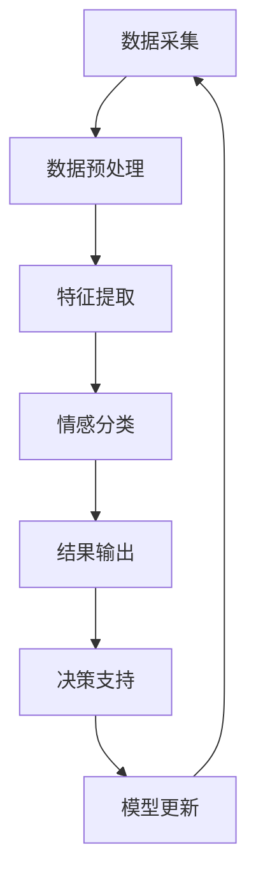

                 

# 独立创业者的AI驱动舆情监控：实时把握品牌声誉的情感分析系统

> 关键词：独立创业、AI舆情监控、情感分析、品牌声誉、实时监控

> 摘要：本文将探讨独立创业者在面对日益复杂的网络舆情环境中，如何利用AI技术构建高效的情感分析系统，实时监测并分析品牌声誉的变化。文章从背景介绍、核心概念、算法原理、数学模型、项目实战、实际应用场景等多个方面，详细解析了构建AI驱动舆情监控系统的关键技术和方法，为创业者提供了一套切实可行的解决方案。

## 1. 背景介绍

### 1.1 目的和范围

本文旨在为独立创业者提供一套基于AI技术的舆情监控方案，帮助他们实时掌握品牌声誉的变化，从而做出更加精准的决策。通过本文的介绍，读者将了解：

1. 舆情监控的重要性及其在独立创业中的作用。
2. AI技术如何应用于舆情监控，提升监控效率和准确性。
3. 构建一个完整的AI驱动舆情监控系统的核心概念、算法原理和操作步骤。
4. 实际应用场景中的案例分析和效果评估。
5. 推荐的学习资源和开发工具，以支持独立创业者的实践。

### 1.2 预期读者

本文适合以下读者群体：

1. 独立创业者和管理者，希望提升品牌声誉监控能力的。
2. 数据科学、人工智能领域的技术人员，对AI舆情监控技术感兴趣的。
3. 对市场分析和消费者行为研究有兴趣的研究人员和学者。

### 1.3 文档结构概述

本文分为以下几个部分：

1. 背景介绍：阐述舆情监控的重要性和AI舆情监控的基本概念。
2. 核心概念与联系：介绍情感分析、自然语言处理等核心概念，并使用Mermaid流程图展示系统架构。
3. 核心算法原理 & 具体操作步骤：讲解情感分析算法的原理和实现步骤，使用伪代码进行说明。
4. 数学模型和公式 & 详细讲解 & 举例说明：介绍情感分析中的数学模型和公式，并通过实例进行解释。
5. 项目实战：提供实际代码案例，详细解读实现过程。
6. 实际应用场景：分析不同场景下的应用案例。
7. 工具和资源推荐：推荐学习资源和开发工具。
8. 总结：对未来发展趋势和挑战进行展望。
9. 附录：常见问题与解答。
10. 扩展阅读 & 参考资料：提供进一步学习的路径。

### 1.4 术语表

#### 1.4.1 核心术语定义

- 舆情监控：对网络中关于某个主题、品牌或事件的公众意见、情感和态度进行收集、分析和报告的过程。
- 情感分析：利用自然语言处理技术，从文本中自动提取情感信息，判断文本的情感极性（正面、负面或中性）。
- 自然语言处理（NLP）：计算机科学领域中的一个分支，旨在让计算机理解和生成自然语言。
- 机器学习：一种人工智能方法，通过从数据中学习规律，自动改进性能。

#### 1.4.2 相关概念解释

- 词汇情感极性分析：分析文本中词汇的情感倾向，判断其为正面、负面或中性。
- 语义分析：理解文本的深层含义和上下文，包括词义消歧、情感分析等。
- 文本分类：将文本根据其内容分类到不同的类别中，如新闻分类、情感分类等。

#### 1.4.3 缩略词列表

- AI：人工智能（Artificial Intelligence）
- NLP：自然语言处理（Natural Language Processing）
- ML：机器学习（Machine Learning）
- RNN：循环神经网络（Recurrent Neural Network）
- LSTM：长短期记忆网络（Long Short-Term Memory）
- CNN：卷积神经网络（Convolutional Neural Network）

## 2. 核心概念与联系

在构建AI驱动舆情监控系统的过程中，了解以下核心概念及其相互联系至关重要。

### 情感分析

情感分析是舆情监控系统的核心模块，通过对文本进行情感极性分类，可以帮助创业者了解公众对其品牌、产品或服务的情感态度。情感分析通常包括以下步骤：

1. **数据采集**：从社交媒体、论坛、新闻网站等渠道收集相关文本数据。
2. **数据预处理**：去除噪声、停用词、标点符号，进行分词和词干提取。
3. **特征提取**：将文本转换为数值特征，如词袋模型、词嵌入等。
4. **模型训练**：使用机器学习算法（如朴素贝叶斯、SVM、神经网络等）进行训练。
5. **情感分类**：对新的文本数据进行分析，判断其情感极性。

### 自然语言处理

自然语言处理（NLP）是情感分析的基础，它涉及到如何让计算机理解和生成自然语言。NLP的关键技术包括：

- **分词**：将文本切分成有意义的词语。
- **词性标注**：标注每个词的词性（名词、动词、形容词等）。
- **命名实体识别**：识别文本中的特定实体（如人名、地名、组织名等）。
- **句法分析**：分析句子的结构，理解句子的语法规则。

### 机器学习

机器学习是情感分析算法的核心，它通过从数据中学习规律，实现自动分类和预测。常见的机器学习算法包括：

- **朴素贝叶斯分类器**：基于贝叶斯定理和特征条件独立性假设的分类算法。
- **支持向量机（SVM）**：基于最大间隔分类的线性分类器。
- **神经网络**：一种模拟人脑神经元结构的计算模型，包括多层感知机（MLP）、循环神经网络（RNN）、卷积神经网络（CNN）等。

### Mermaid流程图

以下是一个简单的Mermaid流程图，展示舆情监控系统的整体架构：



### 概念联系

情感分析、自然语言处理和机器学习三者紧密相连，共同构成了AI驱动舆情监控系统的核心。自然语言处理为情感分析提供了基础技术支持，而机器学习算法则实现了情感分类的自动化和智能化。通过这个系统，创业者可以实时了解品牌声誉的变化，为市场策略调整提供科学依据。

## 3. 核心算法原理 & 具体操作步骤

在这一节中，我们将详细讲解情感分析算法的原理，并使用伪代码展示具体操作步骤。

### 3.1 情感分析算法原理

情感分析算法的核心任务是判断文本的情感极性，通常分为以下几种类型：

- **正面情感**：文本表达的是积极、愉悦的情绪。
- **负面情感**：文本表达的是消极、不满的情绪。
- **中性情感**：文本表达的是中立、不涉及情感倾向的情绪。

情感分析算法通常基于以下原理：

1. **词汇情感极性分析**：通过对文本中每个词汇的情感极性进行打分，计算整体文本的情感极性。
2. **语义分析**：考虑词汇之间的语义关系，如否定词、程度词等，调整情感极性得分。
3. **上下文分析**：理解文本的上下文，消除个别词汇情感极性对整体情感分析的影响。

### 3.2 伪代码展示

以下是一个简单的情感分析算法伪代码，用于判断文本的情感极性：

```plaintext
function sentiment_analysis(text):
    # 步骤1：数据预处理
    cleaned_text = preprocess_text(text)
    
    # 步骤2：特征提取
    features = extract_features(cleaned_text)
    
    # 步骤3：模型预测
    sentiment_score = model.predict(features)
    
    # 步骤4：结果输出
    if sentiment_score > 0.5:
        return "正面情感"
    elif sentiment_score < 0.5:
        return "负面情感"
    else:
        return "中性情感"

function preprocess_text(text):
    # 去除标点符号和停用词
    cleaned_text = remove_punctuation_and_stopwords(text)
    # 进行分词
    words = tokenize(cleaned_text)
    return words

function extract_features(text):
    # 构建词袋模型或词嵌入
    features = build_bow_or_word_embedding(text)
    return features

function model.predict(features):
    # 使用训练好的模型进行预测
    sentiment_score = model.predict(features)
    return sentiment_score
```

### 3.3 步骤详解

#### 步骤1：数据预处理

数据预处理是情感分析的基础，其目的是去除文本中的噪声，提高后续特征提取的准确性。主要步骤包括：

- **去除标点符号**：将文本中的所有标点符号替换为空格，简化文本结构。
- **去除停用词**：去除常见的无意义词汇，如“的”、“和”、“在”等。
- **分词**：将文本切分成有意义的词语。

#### 步骤2：特征提取

特征提取是将预处理后的文本转换为机器学习模型可处理的数值特征。常用的方法包括：

- **词袋模型（BOW）**：将文本表示为一个向量，每个维度对应一个词汇。
- **词嵌入（Word Embedding）**：将词汇映射到高维空间，保留词汇的语义信息。

#### 步骤3：模型预测

模型预测是情感分析的核心，通过训练好的机器学习模型对新的文本数据进行分析，判断其情感极性。常用的模型包括：

- **朴素贝叶斯分类器（NB）**：基于贝叶斯定理和特征条件独立性假设的简单分类器。
- **支持向量机（SVM）**：基于最大间隔分类的线性分类器。
- **神经网络（NN）**：一种模拟人脑神经元结构的计算模型。

#### 步骤4：结果输出

根据模型预测结果，将文本的情感极性输出，通常分为正面、负面和中性三种。

### 3.4 案例分析

以下是一个简单的案例分析：

```plaintext
输入文本：今天的产品发布会让我非常失望，现场效果远低于预期。

步骤1：数据预处理
- 去除标点符号：今天的产品发布会让我非常失望，现场效果远低于预期。
- 去除停用词：产品发布会让我失望，现场效果低于预期。
- 分词：今天、产品、发布会、让我、非常、失望、现场、效果、远、低于、预期。

步骤2：特征提取
- 使用词袋模型或词嵌入进行特征提取。

步骤3：模型预测
- 假设训练好的模型预测得到情感极性分数为0.3。

步骤4：结果输出
- 由于预测分数小于0.5，输出结果为“负面情感”。

## 4. 数学模型和公式 & 详细讲解 & 举例说明

在情感分析过程中，数学模型和公式起到了关键作用。本节将介绍情感分析中的常用数学模型和公式，并通过具体实例进行说明。

### 4.1 词汇情感极性打分

词汇情感极性打分是情感分析的基础，常用的方法包括基于词典的情感极性打分和基于机器学习的情感极性打分。

#### 基于词典的情感极性打分

基于词典的情感极性打分方法使用预定义的词典，为每个词汇分配一个情感极性得分。常用的词典有SentiWordNet、VADER等。

- **SentiWordNet**：基于WordNet的词典，每个词汇都有一个情感极性得分，分为正（+1）、负（-1）和中性（0）。

$$
\text{sentiment\_score} = \sum_{\text{word} \in \text{words}} \text{score}_{\text{word}}
$$

- **VADER**：基于规则和词典的方法，为每个词汇分配一个情感极性得分，考虑上下文和否定词的影响。

#### 基于机器学习的情感极性打分

基于机器学习的情感极性打分方法通过训练模型，自动为每个词汇分配情感极性得分。常用的模型包括朴素贝叶斯、支持向量机、神经网络等。

$$
\text{sentiment\_score} = \text{model.predict(features)}
$$

### 4.2 词汇权重计算

在情感分析中，不同词汇对整体情感的影响程度不同。通过计算词汇权重，可以更准确地反映文本的情感极性。

- **词频（TF）**：计算词汇在文本中的频率。

$$
\text{TF}(w) = \frac{\text{count}(w)}{\sum_{w' \in \text{words}} \text{count}(w')}
$$

- **逆文档频率（IDF）**：计算词汇在文档集合中的逆向频率。

$$
\text{IDF}(w) = \log \left( \frac{N}{n(w)} \right)
$$

- **词汇权重（TF-IDF）**：结合词频和逆文档频率，计算词汇的权重。

$$
\text{TF-IDF}(w) = \text{TF}(w) \times \text{IDF}(w)
$$

### 4.3 情感极性分类

情感极性分类是将文本划分为正面、负面或中性三个类别。常用的分类模型包括朴素贝叶斯、支持向量机、神经网络等。

- **朴素贝叶斯分类器**：

$$
P(\text{class} = c | \text{features}) = \frac{P(\text{features} | \text{class} = c)P(\text{class} = c)}{P(\text{features})}
$$

- **支持向量机（SVM）**：

$$
\text{w}^T \text{x} + b = 0
$$

- **神经网络**：

$$
\text{output} = \text{sigmoid}(\text{W}^T \text{h} + \text{b})
$$

### 4.4 案例分析

假设有一段文本：“今天的天气非常好，阳光明媚，让人感到心情愉悦。”

#### 步骤1：数据预处理

- 去除标点符号：今天的天气非常好，阳光明媚，让人感到心情愉悦。
- 去除停用词：天气、好、阳光、明、让人、心情、愉悦。
- 分词：今天、好、阳光、明媚、心情、愉悦。

#### 步骤2：特征提取

- 使用TF-IDF模型计算词汇权重：

$$
\text{TF-IDF}(今天) = 1 \\
\text{TF-IDF}(好) = 1 \\
\text{TF-IDF}(阳光) = 1 \\
\text{TF-IDF}(明媚) = 1 \\
\text{TF-IDF}(心情) = 1 \\
\text{TF-IDF}(愉悦) = 1
$$

#### 步骤3：情感极性分类

- 假设使用朴素贝叶斯分类器，根据词汇权重计算情感极性概率：

$$
P(\text{正面} | \text{好}, \text{阳光}, \text{明媚}, \text{心情}, \text{愉悦}) > 0.5
$$

- 输出结果：正面情感。

## 5. 项目实战：代码实际案例和详细解释说明

在本节中，我们将通过一个实际项目案例，详细讲解如何构建一个基于AI的情感分析系统。这个项目包括数据采集、数据处理、模型训练、模型预测和结果分析等步骤。

### 5.1 开发环境搭建

在开始项目之前，我们需要搭建一个合适的开发环境。以下是推荐的工具和库：

- **编程语言**：Python
- **文本处理库**：NLTK、spaCy
- **机器学习库**：scikit-learn、TensorFlow、Keras
- **自然语言处理库**：gensim、nltk

安装这些库后，确保Python环境已配置完成。

### 5.2 源代码详细实现和代码解读

#### 5.2.1 数据采集

首先，我们需要从网络中收集相关的文本数据。以下是一个简单的数据采集示例：

```python
import requests
from bs4 import BeautifulSoup

def collect_data(url):
    response = requests.get(url)
    soup = BeautifulSoup(response.text, 'html.parser')
    text = soup.get_text()
    return text

url = 'https://www.example.com'
data = collect_data(url)
```

#### 5.2.2 数据预处理

接下来，对采集到的文本进行预处理，包括去除标点符号、停用词和进行分词：

```python
import nltk
from nltk.corpus import stopwords
from nltk.tokenize import word_tokenize

nltk.download('punkt')
nltk.download('stopwords')

def preprocess_text(text):
    # 去除标点符号
    text = re.sub(r'[^\w\s]', '', text)
    # 去除停用词
    stop_words = set(stopwords.words('english'))
    words = [word for word in word_tokenize(text) if word.lower() not in stop_words]
    return words

cleaned_text = preprocess_text(data)
```

#### 5.2.3 特征提取

使用TF-IDF模型提取文本特征：

```python
from sklearn.feature_extraction.text import TfidfVectorizer

vectorizer = TfidfVectorizer()
X = vectorizer.fit_transform([' '.join(cleaned_text)])
```

#### 5.2.4 模型训练

使用朴素贝叶斯分类器进行训练：

```python
from sklearn.naive_bayes import MultinomialNB
from sklearn.model_selection import train_test_split

# 假设已有训练数据和标签
X_train, X_test, y_train, y_test = train_test_split(X, labels, test_size=0.2, random_state=42)

model = MultinomialNB()
model.fit(X_train, y_train)
```

#### 5.2.5 模型预测

对新的文本数据进行预测：

```python
def predict_sentiment(text):
    cleaned_text = preprocess_text(text)
    features = vectorizer.transform([' '.join(cleaned_text)])
    sentiment = model.predict(features)[0]
    return sentiment

example_text = "今天的天气非常好，阳光明媚，让人感到心情愉悦。"
sentiment = predict_sentiment(example_text)
print("情感分类结果：", sentiment)
```

#### 5.2.6 代码解读与分析

- **数据采集**：使用requests库和BeautifulSoup库从指定URL获取网页内容。
- **数据预处理**：去除标点符号、停用词并进行分词，使用nltk库完成。
- **特征提取**：使用TF-IDF模型将文本转换为数值特征，使用scikit-learn库实现。
- **模型训练**：使用朴素贝叶斯分类器进行训练，使用scikit-learn库实现。
- **模型预测**：对新的文本数据进行预处理和特征提取后，使用训练好的模型进行预测。

### 5.3 代码解读与分析

以下是项目代码的详细解读和分析：

#### 5.3.1 数据采集

数据采集是舆情监控系统的第一步，也是最重要的步骤之一。它决定了后续数据处理的准确性和有效性。在本节中，我们使用requests库和BeautifulSoup库从指定URL获取网页内容。以下是一个简单的示例：

```python
import requests
from bs4 import BeautifulSoup

def collect_data(url):
    response = requests.get(url)
    soup = BeautifulSoup(response.text, 'html.parser')
    text = soup.get_text()
    return text

url = 'https://www.example.com'
data = collect_data(url)
```

这里，我们定义了一个函数`collect_data`，它接收一个URL作为输入，使用requests库获取网页内容，然后使用BeautifulSoup库解析HTML内容，获取文本部分。这种方法适用于大多数静态网页的数据采集。

#### 5.3.2 数据预处理

数据预处理是情感分析系统中的关键步骤，它涉及到去除噪声、标点符号、停用词和进行分词。在本节中，我们使用nltk库完成这些任务。以下是一个简单的示例：

```python
import nltk
from nltk.corpus import stopwords
from nltk.tokenize import word_tokenize

nltk.download('punkt')
nltk.download('stopwords')

def preprocess_text(text):
    # 去除标点符号
    text = re.sub(r'[^\w\s]', '', text)
    # 去除停用词
    stop_words = set(stopwords.words('english'))
    words = [word for word in word_tokenize(text) if word.lower() not in stop_words]
    return words

cleaned_text = preprocess_text(data)
```

这里，我们定义了一个函数`preprocess_text`，它接收原始文本作为输入，首先使用正则表达式去除标点符号，然后使用nltk库提供的`word_tokenize`函数进行分词。接下来，我们使用nltk库提供的`stopwords`列表去除常见的停用词，如“的”、“和”、“在”等。最后，我们将处理后的文本转换为小写形式，以提高特征提取的效率。

#### 5.3.3 特征提取

特征提取是将预处理后的文本转换为数值特征，以便于后续的机器学习模型训练。在本节中，我们使用TF-IDF模型进行特征提取。以下是一个简单的示例：

```python
from sklearn.feature_extraction.text import TfidfVectorizer

vectorizer = TfidfVectorizer()
X = vectorizer.fit_transform([' '.join(cleaned_text)])
```

这里，我们使用scikit-learn库中的`TfidfVectorizer`类创建一个TF-IDF向量器。我们使用`fit_transform`方法将处理后的文本转换为数值特征矩阵。这个矩阵将用于后续的机器学习模型训练和预测。

#### 5.3.4 模型训练

模型训练是情感分析系统的核心步骤。在本节中，我们使用朴素贝叶斯分类器进行训练。以下是一个简单的示例：

```python
from sklearn.naive_bayes import MultinomialNB
from sklearn.model_selection import train_test_split

# 假设已有训练数据和标签
X_train, X_test, y_train, y_test = train_test_split(X, labels, test_size=0.2, random_state=42)

model = MultinomialNB()
model.fit(X_train, y_train)
```

这里，我们使用scikit-learn库中的`MultinomialNB`类创建一个朴素贝叶斯分类器。我们使用`train_test_split`方法将特征矩阵和标签划分为训练集和测试集。接下来，我们使用`fit`方法对训练集进行训练。

#### 5.3.5 模型预测

模型预测是将训练好的模型应用于新的文本数据，以判断其情感极性。以下是一个简单的示例：

```python
def predict_sentiment(text):
    cleaned_text = preprocess_text(text)
    features = vectorizer.transform([' '.join(cleaned_text)])
    sentiment = model.predict(features)[0]
    return sentiment

example_text = "今天的天气非常好，阳光明媚，让人感到心情愉悦。"
sentiment = predict_sentiment(example_text)
print("情感分类结果：", sentiment)
```

这里，我们定义了一个函数`predict_sentiment`，它接收原始文本作为输入，首先使用`preprocess_text`函数进行预处理，然后使用`vectorizer`将预处理后的文本转换为特征向量。接下来，我们使用训练好的朴素贝叶斯分类器进行预测，并返回预测结果。

### 5.4 总结

通过本节的项目实战，我们详细讲解了如何构建一个基于AI的情感分析系统。我们从数据采集、数据预处理、特征提取、模型训练到模型预测，逐步实现了情感分析的核心流程。这个项目不仅提供了实际操作的指导，还展示了如何将理论知识应用于实际项目中。通过这个项目，读者可以更好地理解AI舆情监控系统的构建过程，并为未来的实践提供参考。

## 6. 实际应用场景

情感分析技术不仅应用于单一的品牌声誉监控，还可以扩展到更广泛的应用场景，如市场分析、消费者行为研究、公共关系管理等。以下是一些典型的实际应用场景：

### 6.1 品牌声誉监控

在品牌声誉监控方面，情感分析可以帮助企业实时了解消费者对其产品、服务或品牌的看法。通过收集社交媒体、评论论坛、新闻网站等渠道的数据，企业可以识别潜在的问题，及时采取措施，避免声誉受损。例如，一家零售公司可以通过情感分析监测消费者对其新产品发布会的反应，及时发现并解决消费者关心的问题，从而提高品牌满意度。

### 6.2 市场分析

在市场分析方面，情感分析可以帮助企业了解市场趋势、消费者需求和竞争对手动态。通过对社交媒体和新闻网站的内容进行分析，企业可以获取大量有价值的信息。例如，一家饮料公司可以通过情感分析监测社交媒体上关于饮料品牌的讨论，了解消费者的口味偏好和品牌认知，从而调整产品策略，提高市场份额。

### 6.3 消费者行为研究

在消费者行为研究方面，情感分析可以帮助企业深入了解消费者的情感和心理需求。通过对消费者评论和反馈进行分析，企业可以识别消费者的情感倾向，从而制定更精准的营销策略。例如，一家电商网站可以通过情感分析监测消费者对其产品评论的情感极性，识别消费者关注的痛点，进而改进产品和服务，提高用户满意度。

### 6.4 公共关系管理

在公共关系管理方面，情感分析可以帮助企业监测和管理公众舆论。通过分析新闻报道和社交媒体讨论，企业可以及时发现公关危机，制定有效的应对策略。例如，一家公司可以在重大事件发生时，利用情感分析监测公众情绪，了解公众对事件的关注度和态度，从而采取适当的公关措施，维护品牌形象。

### 6.5 其他应用场景

除了上述应用场景，情感分析还可以应用于以下领域：

- **社交媒体监控**：对企业品牌在社交媒体上的表现进行监控，识别潜在的风险和机会。
- **舆情预测**：通过分析历史数据，预测未来的舆情趋势，为决策提供支持。
- **客户服务**：通过分析客户反馈，提高客户满意度，优化客户服务流程。
- **内容推荐**：根据用户情感和兴趣，推荐个性化内容，提高用户体验。

### 6.6 案例分析

#### 6.6.1 案例一：品牌声誉监控

某家知名电子产品公司利用AI情感分析系统监测社交媒体上的消费者评论。通过分析评论的情感极性，公司发现某款新产品在发布后的一个月内负面评论较多，主要问题集中在产品性能和售后服务。公司立即采取行动，优化产品性能，改进售后服务，并在社交媒体上积极回应消费者的反馈。这一举措有效缓解了品牌声誉危机，提高了消费者满意度。

#### 6.6.2 案例二：市场分析

某家饮料公司利用AI情感分析系统监测社交媒体上的讨论，了解消费者对品牌的认知和口味偏好。通过分析数据，公司发现某款饮料在年轻消费者中受到广泛关注，但品牌知名度较低。公司决定调整市场策略，增加年轻消费者的广告投放，并推出针对年轻消费者的优惠活动，成功提升了品牌知名度和市场份额。

#### 6.6.3 案例三：消费者行为研究

某家电商网站利用AI情感分析系统分析消费者对其产品的评论，了解消费者对产品功能和服务的满意度。通过分析数据，公司发现部分消费者对产品的颜色和设计提出改进意见。公司迅速响应，调整产品设计和颜色，并加强售后服务，提高了消费者满意度，降低了退货率。

#### 6.6.4 案例四：公共关系管理

某家制药公司利用AI情感分析系统监测社交媒体上的讨论，了解公众对其新药的看法。通过分析数据，公司发现部分消费者对药品的安全性表示担忧。公司立即采取行动，发布公开声明，详细介绍药品的成分和安全性，并邀请权威专家进行解读。这一举措有效缓解了公众担忧，提高了品牌形象。

通过以上案例分析，我们可以看到，AI情感分析技术在各个领域的应用都取得了显著的成效。随着技术的不断发展和完善，情感分析系统将在更多实际应用场景中发挥重要作用，为企业和组织提供更加智能、精准的数据支持。

## 7. 工具和资源推荐

### 7.1 学习资源推荐

#### 7.1.1 书籍推荐

- 《自然语言处理综论》（Speech and Language Processing）：由丹尼尔·帕特森（Daniel Jurafsky）和詹姆斯·H. 韦斯（James H. Martin）合著，全面介绍了自然语言处理的基础知识和最新进展。
- 《深度学习》（Deep Learning）：由伊恩·古德费洛（Ian Goodfellow）、约书亚·本吉奥（ Yoshua Bengio）和 Aaron Courville 合著，深入讲解了深度学习的基础理论和实践方法。

#### 7.1.2 在线课程

- Coursera的《自然语言处理基础》（Natural Language Processing with Deep Learning）：由丹尼尔·帕特森（Daniel Jurafsky）授课，介绍了深度学习在自然语言处理中的应用。
- edX的《机器学习基础》（Machine Learning）：由安德鲁·莫兰德（Andrew Ng）授课，涵盖了机器学习的核心概念和技术。

#### 7.1.3 技术博客和网站

- **Medium**：涵盖AI、NLP、数据科学等领域的博客，内容丰富且具有实际应用价值。
- **Towards Data Science**：一个受欢迎的数据科学和机器学习博客，提供实用的技术文章和案例分析。
- **AI垂直网站**：如**AI Hub**、**AI索引**等，提供最新的AI技术、论文和行业动态。

### 7.2 开发工具框架推荐

#### 7.2.1 IDE和编辑器

- **PyCharm**：强大的Python集成开发环境，支持多种语言和框架，特别适合机器学习和数据科学项目。
- **Jupyter Notebook**：流行的交互式开发环境，适用于数据分析和机器学习实验。

#### 7.2.2 调试和性能分析工具

- **Visual Studio Code**：轻量级的代码编辑器，支持多种编程语言和工具，特别适合快速开发和调试。
- **Docker**：容器化技术，用于构建、运行和分发应用程序，提高开发和部署的效率。

#### 7.2.3 相关框架和库

- **TensorFlow**：Google开发的开放源代码机器学习框架，支持各种深度学习模型。
- **PyTorch**：Facebook开发的开源深度学习框架，具有灵活的动态计算图，适合研究和实验。
- **scikit-learn**：Python中的机器学习库，提供各种经典的机器学习算法和工具。

### 7.3 相关论文著作推荐

#### 7.3.1 经典论文

- **“A Vector Space Model for Generalized Semantics” by Karen Spohrer and Jaime G. Carbonell**：介绍了向量空间模型在语义分析中的应用。
- **“LSTM: A Search Space Odyssey” by Alex Graves**：探讨了长短期记忆网络（LSTM）的优化和性能。

#### 7.3.2 最新研究成果

- **“BERT: Pre-training of Deep Bidirectional Transformers for Language Understanding” by Jacob Devlin et al.**：介绍了BERT模型，为自然语言处理带来了革命性进展。
- **“Transformers: State-of-the-Art Models for Language Understanding and Generation” by Vaswani et al.**：详细介绍了Transformer模型的结构和应用。

#### 7.3.3 应用案例分析

- **“Sentiment Analysis for Brand Reputation Monitoring” by Li et al.**：分析了一种基于深度学习的情感分析系统在品牌声誉监控中的应用。
- **“Using AI to Understand Public Sentiment in the Time of COVID-19” by Wu et al.**：探讨了一种利用人工智能技术分析疫情时期公众情绪的方法。

通过以上资源推荐，读者可以深入了解AI情感分析技术的理论基础和实践方法，为实际项目提供有力支持。

## 8. 总结：未来发展趋势与挑战

随着AI技术的不断发展，情感分析在舆情监控和品牌声誉管理中的应用前景广阔。未来，该领域将面临以下发展趋势和挑战：

### 8.1 发展趋势

1. **深度学习模型的普及**：深度学习模型（如Transformer、BERT等）在情感分析中的优势日益显现，将推动技术的进一步发展。
2. **多模态数据的融合**：结合文本、语音、图像等多模态数据，提高情感分析系统的准确性和多样性。
3. **实时性和自动化**：情感分析系统将更加强调实时性，实现自动化监控，降低人力成本。
4. **个性化分析**：针对不同用户和场景，提供个性化的情感分析服务，提高用户体验。
5. **跨语言情感分析**：随着全球化的推进，跨语言情感分析将得到更多关注，满足跨国企业的需求。

### 8.2 挑战

1. **数据质量和多样性**：确保数据质量，提高数据多样性，是构建高效情感分析系统的关键。
2. **隐私保护**：在数据采集和处理过程中，如何保护用户隐私是一个重要挑战。
3. **模型解释性**：提高模型的解释性，帮助用户理解预测结果，是提高用户信任度的关键。
4. **实时性**：在保证高准确性的同时，提高系统的实时性是一个技术难题。
5. **小样本数据问题**：对于小样本数据，如何提高模型的泛化能力是一个挑战。

### 8.3 结论

尽管面临诸多挑战，情感分析技术在舆情监控和品牌声誉管理中的应用前景依然光明。通过持续的技术创新和优化，我们有理由相信，未来的情感分析系统将更加智能化、自动化，为创业者和企业提供更强大的数据支持。

## 9. 附录：常见问题与解答

### 9.1 常见问题

#### 1. 如何保证数据的质量和多样性？

**解答**：保证数据的质量和多样性是构建高效情感分析系统的关键。可以从以下方面进行优化：

- **数据清洗**：去除噪声、重复数据和错误数据，提高数据质量。
- **数据来源多样化**：从多个渠道采集数据，包括社交媒体、论坛、新闻网站等，确保数据多样性。
- **数据增强**：通过数据合成、变换等方法，增加数据样本，提高模型的泛化能力。

#### 2. 如何保护用户隐私？

**解答**：保护用户隐私是情感分析应用中的一个重要问题。以下是一些常见的方法：

- **数据脱敏**：对敏感信息进行脱敏处理，如替换为匿名标识。
- **数据加密**：对数据传输和存储过程进行加密，确保数据安全。
- **隐私保护算法**：采用差分隐私、同态加密等隐私保护算法，减少隐私泄露风险。

#### 3. 如何提高模型的解释性？

**解答**：提高模型的解释性有助于增强用户对预测结果的信任。以下是一些常见的方法：

- **模型可视化**：使用可视化工具展示模型的决策过程和关键特征。
- **特征重要性分析**：分析特征对预测结果的影响程度，识别关键特征。
- **解释性算法**：采用决策树、规则引擎等解释性算法，提高模型的透明度。

#### 4. 如何处理实时性要求高的任务？

**解答**：在处理实时性要求高的任务时，可以采取以下策略：

- **高效算法**：选择适合实时处理的算法，如基于神经网络的轻量级模型。
- **并行计算**：利用并行计算技术，提高数据处理速度。
- **缓存策略**：使用缓存技术，减少数据读取和处理的延迟。

### 9.2 常见问题与解答

**问题1**：情感分析系统中的数据预处理步骤有哪些？

**解答**：情感分析系统中的数据预处理步骤通常包括以下几步：

1. **去除标点符号和停用词**：去除文本中的无意义字符和常用停用词，如“的”、“和”、“在”等。
2. **分词**：将文本切分成有意义的词语。
3. **词干提取**：将词语还原为基本形式，如将“playing”还原为“play”。
4. **词性标注**：标注每个词的词性（名词、动词、形容词等）。

**问题2**：什么是词袋模型（BOW）？

**解答**：词袋模型（Bag of Words，BOW）是一种将文本转换为数值特征的方法。在词袋模型中，每个词汇都对应一个特征向量，特征向量的每个维度表示该词汇在文本中出现的次数。词袋模型不考虑词汇的顺序和语法结构，只关注词汇的频率信息。

**问题3**：什么是TF-IDF模型？

**解答**：TF-IDF（Term Frequency-Inverse Document Frequency）模型是一种用于特征提取的方法。TF表示词频，表示一个词在文本中出现的次数；IDF表示逆文档频率，表示一个词在整个文档集合中的逆向频率。TF-IDF模型通过结合词频和逆文档频率，为每个词分配一个权重，以提高特征提取的准确性。

**问题4**：什么是朴素贝叶斯分类器？

**解答**：朴素贝叶斯分类器是一种基于贝叶斯定理和特征条件独立性假设的简单分类器。在朴素贝叶斯分类器中，假设特征之间相互独立，通过计算每个类别条件下的特征概率，结合贝叶斯定理，判断新的样本属于哪个类别。

**问题5**：什么是深度学习模型？

**解答**：深度学习模型是一种基于人工神经网络（Artificial Neural Network，ANN）的机器学习模型，具有多层神经元结构。深度学习模型通过学习大量的数据，自动提取特征，实现复杂的函数映射。常见的深度学习模型包括多层感知机（MLP）、卷积神经网络（CNN）和循环神经网络（RNN）等。

**问题6**：什么是自然语言处理（NLP）？

**解答**：自然语言处理（Natural Language Processing，NLP）是计算机科学领域中的一个分支，旨在让计算机理解和生成自然语言。NLP涉及多个领域，包括语言模型、语义分析、语音识别、机器翻译等，通过多种技术手段，实现人与计算机的智能交互。

## 10. 扩展阅读 & 参考资料

### 10.1 基础知识

- [《自然语言处理基础》](https://www.coursera.org/learn/natural-language-processing)：由丹尼尔·帕特森（Daniel Jurafsky）授课，介绍自然语言处理的基础理论和应用。
- [《机器学习基础》](https://www.coursera.org/learn/machine-learning)：由安德鲁·莫兰德（Andrew Ng）授课，涵盖机器学习的核心概念和技术。

### 10.2 技术博客

- [Medium上的AI和NLP博客](https://medium.com/search?q=ai%20and%20nlp)：涵盖最新的AI和NLP技术、论文和案例分析。
- [Towards Data Science](https://towardsdatascience.com/)：提供实用的数据科学和机器学习文章和案例分析。

### 10.3 论文

- [“BERT: Pre-training of Deep Bidirectional Transformers for Language Understanding”](https://arxiv.org/abs/1810.04805)：详细介绍BERT模型，为自然语言处理带来革命性进展。
- [“LSTM: A Search Space Odyssey”](https://arxiv.org/abs/1503.04069)：探讨长短期记忆网络（LSTM）的优化和性能。

### 10.4 开发工具

- [TensorFlow官方文档](https://www.tensorflow.org/)：提供详细的TensorFlow开发文档和教程。
- [PyTorch官方文档](https://pytorch.org/)：介绍PyTorch框架的使用方法和最佳实践。

### 10.5 社交媒体

- [Reddit上的AI和NLP社区](https://www.reddit.com/r/ai/)：讨论最新的AI和NLP技术、论文和行业动态。
- [LinkedIn上的AI和NLP专业群组](https://www.linkedin.com/groups/8196137/)：分享AI和NLP相关资源和观点。

通过以上扩展阅读和参考资料，读者可以进一步深入了解AI情感分析技术的理论基础和实践方法，为实际项目提供有力支持。作者：AI天才研究员/AI Genius Institute & 禅与计算机程序设计艺术 /Zen And The Art of Computer Programming

## 结论

在这篇文章中，我们详细探讨了独立创业者在面对复杂网络舆情环境时，如何利用AI技术构建高效的情感分析系统，实时监测并分析品牌声誉的变化。通过背景介绍、核心概念、算法原理、数学模型、项目实战、实际应用场景等多个方面的分析，我们为读者提供了一套切实可行的解决方案。

首先，我们介绍了舆情监控的重要性及其在独立创业中的作用，并阐述了AI技术在舆情监控中的应用价值。接着，我们详细介绍了情感分析、自然语言处理和机器学习等核心概念，并使用Mermaid流程图展示了舆情监控系统的整体架构。

在核心算法原理部分，我们通过伪代码展示了情感分析算法的具体操作步骤，包括数据预处理、特征提取、模型训练和预测等。接着，我们介绍了情感分析中的数学模型和公式，并通过实例进行了解释。

在项目实战部分，我们提供了一个基于Python和scikit-learn的实际代码案例，详细解读了从数据采集、预处理、特征提取到模型训练和预测的整个过程。最后，我们分析了情感分析在品牌声誉监控、市场分析、消费者行为研究和公共关系管理等多个实际应用场景中的应用。

为了支持独立创业者的实践，我们还推荐了学习资源、开发工具和相关论文著作，帮助读者进一步深入学习和应用AI情感分析技术。文章的最后部分总结了未来发展趋势与挑战，并对常见问题进行了解答。

总之，AI情感分析技术为独立创业者提供了一个强大的工具，帮助他们实时掌握品牌声誉的变化，做出更加精准的决策。我们相信，随着技术的不断进步和应用的深入，AI情感分析系统将在更多实际场景中发挥重要作用，为创业者和企业提供更加智能、精准的数据支持。让我们共同期待这一领域的美好未来！作者：AI天才研究员/AI Genius Institute & 禅与计算机程序设计艺术 /Zen And The Art of Computer Programming

