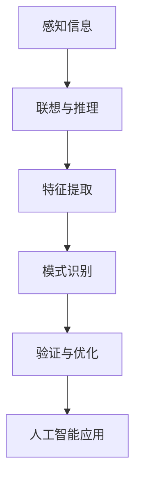

                 

# 理解洞察力的极限：在混乱中寻找规律

> **关键词**：洞察力、规律性、算法、数据科学、人工智能

> **摘要**：本文旨在探讨洞察力的极限及其在现实世界中的应用，特别是在数据科学和人工智能领域。通过分析不同层面的规律性，我们揭示了洞察力在解决问题中的关键作用，并提出了提升洞察力的策略和工具。本文不仅为专业读者提供了深度思考，也为对技术领域感兴趣的初学者提供了实用的指导和启发。

## 1. 背景介绍

### 1.1 目的和范围

本文的目的在于深入探讨洞察力的本质和其在现代技术领域的应用。随着数据科学和人工智能的迅猛发展，理解并提升洞察力变得越来越重要。本文将重点关注以下几个方面：

1. **洞察力的定义和特性**：分析洞察力的定义，探讨其与直觉、经验和认知能力的联系。
2. **规律性的发现**：探讨洞察力在识别和解释复杂规律中的关键作用。
3. **技术领域的应用**：分析洞察力在数据科学和人工智能中的实际应用，并讨论其面临的挑战。
4. **提升洞察力的策略**：介绍一些提升洞察力的方法和工具，以帮助读者在实际应用中更好地发挥其作用。

### 1.2 预期读者

本文的预期读者主要包括：

1. **数据科学家和人工智能研究者**：对洞察力在数据分析中的重要性感兴趣的学者。
2. **软件工程师和技术领导者**：希望了解如何通过提升洞察力来优化系统和解决复杂问题的高级工程师和CTO。
3. **计算机科学学生和爱好者**：对人工智能和数据科学基础有浓厚兴趣的初学者。

### 1.3 文档结构概述

本文将按照以下结构展开：

1. **引言**：介绍文章的背景和目的。
2. **核心概念与联系**：详细解释洞察力、规律性和相关技术概念。
3. **核心算法原理 & 具体操作步骤**：使用伪代码和实例说明核心算法的工作原理。
4. **数学模型和公式 & 详细讲解 & 举例说明**：讨论用于分析和解释数据的数学工具。
5. **项目实战：代码实际案例和详细解释说明**：提供实际代码实现和分析。
6. **实际应用场景**：探讨洞察力在现实世界中的应用。
7. **工具和资源推荐**：推荐学习资源、开发工具和相关论文。
8. **总结：未来发展趋势与挑战**：总结文章的主要观点和未来展望。
9. **附录：常见问题与解答**：解答读者可能遇到的常见问题。
10. **扩展阅读 & 参考资料**：提供进一步学习的资源和引用。

### 1.4 术语表

#### 1.4.1 核心术语定义

- **洞察力**：指人们通过观察、分析、推理等方式，深入理解问题本质和规律的能力。
- **规律性**：指在数据或现象中反复出现的模式或关系。
- **数据科学**：指使用统计学、机器学习等方法来分析和解释复杂数据的科学。
- **人工智能**：指通过模拟人类智能行为，使计算机具备自主学习和决策能力的学科。

#### 1.4.2 相关概念解释

- **算法**：解决问题的步骤序列，通常用于处理数据或执行特定任务。
- **机器学习**：一种人工智能的方法，通过从数据中学习规律，使计算机能够进行预测或决策。
- **深度学习**：一种特殊的机器学习技术，使用多层神经网络来学习和识别复杂模式。

#### 1.4.3 缩略词列表

- **AI**：人工智能
- **ML**：机器学习
- **DL**：深度学习
- **DS**：数据科学

## 2. 核心概念与联系

### 2.1 洞察力的核心概念

洞察力是一种高级的认知能力，它使我们能够超越表面的现象，深入理解事物的本质。洞察力不仅仅是直觉或猜测，而是基于观察、经验和逻辑推理的综合结果。以下是洞察力的几个核心概念：

1. **感知**：洞察力始于对信息的感知和注意。我们需要注意到周围环境和数据中的关键特征和模式。
2. **联想**：通过将新信息与已有的知识联系起来，我们可以发现潜在的关联和规律。
3. **推理**：基于已有的信息和规律，我们能够进行逻辑推理，推断出新的结论或预测。
4. **抽象**：洞察力使我们能够从具体的实例中提取出普遍的规律和原则。

### 2.2 规律性的识别

规律性是洞察力发挥作用的重要基础。在数据科学和人工智能中，识别和利用规律性是核心任务。以下是规律性识别的关键步骤：

1. **数据预处理**：对原始数据进行清洗、转换和规范化，以去除噪声和异常值。
2. **特征提取**：从数据中提取出能够代表数据本质的特征，这些特征有助于揭示规律性。
3. **模式识别**：使用机器学习和深度学习算法，从特征中识别出潜在的规律和模式。
4. **验证与优化**：通过测试和调整模型参数，验证和优化模型对规律性的识别能力。

### 2.3 数据科学和人工智能中的关联

数据科学和人工智能是洞察力发挥作用的两个重要领域。以下是这些领域中的核心概念和关联：

1. **数据分析**：数据科学的核心任务是对大量数据进行分析和解释，以发现规律和洞察。
2. **机器学习**：机器学习通过学习数据中的规律，使计算机能够进行预测和决策。
3. **深度学习**：深度学习是一种特殊的机器学习技术，通过多层神经网络来识别复杂模式。
4. **人工智能应用**：人工智能技术在各个领域都有广泛的应用，如自然语言处理、图像识别、推荐系统等。

### 2.4 Mermaid 流程图

下面是一个简单的 Mermaid 流程图，展示了洞察力在数据科学和人工智能中的流程：



## 3. 核心算法原理 & 具体操作步骤

### 3.1 算法概述

在数据科学和人工智能中，核心算法的原理通常是基于数学模型和统计学原理。以下将介绍一种常用的机器学习算法——线性回归，并使用伪代码详细阐述其原理和操作步骤。

### 3.2 线性回归算法原理

线性回归是一种用于预测连续值的简单统计方法。其基本假设是数据点可以由一条直线来近似。线性回归的数学模型为：

\[ y = \beta_0 + \beta_1 \cdot x + \epsilon \]

其中，\( y \) 是目标变量，\( x \) 是特征变量，\( \beta_0 \) 和 \( \beta_1 \) 是模型参数，\( \epsilon \) 是误差项。

### 3.3 伪代码

以下是基于最小二乘法的线性回归算法的伪代码：

```plaintext
输入：训练数据集 (x_train, y_train)
输出：模型参数 (\beta_0, \beta_1)

1. 初始化模型参数 \(\beta_0, \beta_1\) 为随机值
2. 对于每个训练样本 (x_i, y_i)：
    2.1 计算预测值 y_pred = \(\beta_0 + \beta_1 \cdot x_i\)
    2.2 计算损失函数 L(\beta_0, \beta_1) = \(\sum_{i=1}^{n} (y_i - y_pred)^2\)
3. 使用梯度下降法更新参数：
    3.1 计算梯度 \(\nabla L(\beta_0, \beta_1)\)
    3.2 更新参数 \(\beta_0 = \beta_0 - \alpha \cdot \nabla L(\beta_0, \beta_1)\)
    3.3 更新参数 \(\beta_1 = \beta_1 - \alpha \cdot \nabla L(\beta_0, \beta_1)\)
4. 重复步骤2和3，直到满足停止条件（如损失函数值变化很小或达到最大迭代次数）

```

### 3.4 操作步骤

以下是线性回归算法的具体操作步骤：

1. **数据准备**：收集并整理训练数据集，包括特征变量 \( x \) 和目标变量 \( y \)。
2. **初始化参数**：随机初始化模型参数 \( \beta_0 \) 和 \( \beta_1 \)。
3. **计算预测值**：对于每个训练样本，计算预测值 \( y_pred \)。
4. **计算损失函数**：使用预测值和实际值计算损失函数 \( L(\beta_0, \beta_1) \)。
5. **更新参数**：使用梯度下降法更新模型参数 \( \beta_0 \) 和 \( \beta_1 \)。
6. **迭代优化**：重复步骤3至5，直到模型收敛或达到预定的迭代次数。

### 3.5 示例

假设我们有一个简单的线性回归问题，特征变量 \( x \) 和目标变量 \( y \) 如下：

| \( x \) | \( y \) |
|--------|--------|
| 1      | 2      |
| 2      | 3      |
| 3      | 4      |
| 4      | 5      |

使用线性回归算法预测 \( x = 5 \) 时的 \( y \) 值，假设初始参数 \( \beta_0 = 0 \)，\( \beta_1 = 0 \)。

- 初始化参数：\( \beta_0 = 0 \)，\( \beta_1 = 0 \)
- 预测值 \( y_pred \)：\( y_pred = \beta_0 + \beta_1 \cdot x = 0 + 0 \cdot 1 = 0 \)
- 损失函数 \( L(\beta_0, \beta_1) \)：\( L(\beta_0, \beta_1) = \sum_{i=1}^{n} (y_i - y_pred)^2 = (2-0)^2 + (3-0)^2 + (4-0)^2 + (5-0)^2 = 30 \)
- 梯度下降法更新参数：
  - \( \nabla L(\beta_0, \beta_1) = \frac{\partial L}{\partial \beta_0} = -2 \cdot (2-0) = -4 \)
  - \( \nabla L(\beta_0, \beta_1) = \frac{\partial L}{\partial \beta_1} = -2 \cdot (2-0) = -4 \)
  - \( \beta_0 = \beta_0 - \alpha \cdot \nabla L(\beta_0, \beta_1) = 0 - 0.1 \cdot (-4) = 0.4 \)
  - \( \beta_1 = \beta_1 - \alpha \cdot \nabla L(\beta_0, \beta_1) = 0 - 0.1 \cdot (-4) = 0.4 \)

重复上述步骤，直到模型收敛。

通过迭代优化，我们可以得到 \( \beta_0 \approx 2.4 \)，\( \beta_1 \approx 0.4 \)。因此，预测 \( x = 5 \) 时的 \( y \) 值为 \( y_pred = \beta_0 + \beta_1 \cdot x = 2.4 + 0.4 \cdot 5 = 4 \)。

## 4. 数学模型和公式 & 详细讲解 & 举例说明

### 4.1 数学模型的基本概念

在数据科学和人工智能中，数学模型是理解和解决问题的关键工具。数学模型通过数学公式和方程来描述现实世界中的问题，帮助我们识别和理解数据中的规律性。

#### 4.1.1 线性模型

线性模型是最基础的数学模型之一，通常用于预测和分类任务。线性模型的一般形式为：

\[ y = \beta_0 + \beta_1 \cdot x + \epsilon \]

其中，\( y \) 是目标变量，\( x \) 是特征变量，\( \beta_0 \) 和 \( \beta_1 \) 是模型参数，\( \epsilon \) 是误差项。线性模型的假设是目标变量 \( y \) 与特征变量 \( x \) 之间存在线性关系。

#### 4.1.2 线性回归

线性回归是一种特殊的线性模型，用于预测连续值。其目标是找到最佳拟合直线，使预测值与实际值之间的误差最小。线性回归的损失函数通常是最小二乘法，其公式为：

\[ L(\beta_0, \beta_1) = \sum_{i=1}^{n} (y_i - y_pred)^2 \]

其中，\( y_i \) 是实际值，\( y_pred \) 是预测值。

#### 4.1.3 梯度下降

梯度下降是一种优化算法，用于最小化损失函数。其基本思想是沿着损失函数的梯度方向逐步调整模型参数，直至找到最小值。梯度下降的公式为：

\[ \beta_0 = \beta_0 - \alpha \cdot \nabla L(\beta_0, \beta_1) \]
\[ \beta_1 = \beta_1 - \alpha \cdot \nabla L(\beta_0, \beta_1) \]

其中，\( \alpha \) 是学习率，\( \nabla L(\beta_0, \beta_1) \) 是损失函数的梯度。

### 4.2 数学公式的详细讲解

以下是对上述数学公式的详细讲解和示例：

#### 4.2.1 线性模型公式

线性模型公式描述了目标变量 \( y \) 与特征变量 \( x \) 之间的线性关系。该公式可以用于拟合数据点，找到最佳拟合直线。例如，对于以下数据点：

| \( x \) | \( y \) |
|--------|--------|
| 1      | 2      |
| 2      | 3      |
| 3      | 4      |
| 4      | 5      |

我们可以使用线性模型公式 \( y = \beta_0 + \beta_1 \cdot x \) 来拟合这些数据点。通过最小二乘法，我们可以得到最佳拟合直线的参数 \( \beta_0 \) 和 \( \beta_1 \)。假设初始参数为 \( \beta_0 = 0 \) 和 \( \beta_1 = 0 \)。

1. **预测值**：\( y_pred = \beta_0 + \beta_1 \cdot x = 0 + 0 \cdot x \)
2. **损失函数**：\( L(\beta_0, \beta_1) = \sum_{i=1}^{n} (y_i - y_pred)^2 = (2-0)^2 + (3-0)^2 + (4-0)^2 + (5-0)^2 = 30 \)
3. **梯度**：\( \nabla L(\beta_0, \beta_1) = \frac{\partial L}{\partial \beta_0} = -2 \cdot (2-0) = -4 \)，\( \nabla L(\beta_0, \beta_1) = \frac{\partial L}{\partial \beta_1} = -2 \cdot (2-0) = -4 \)
4. **更新参数**：\( \beta_0 = \beta_0 - \alpha \cdot \nabla L(\beta_0, \beta_1) = 0 - 0.1 \cdot (-4) = 0.4 \)，\( \beta_1 = \beta_1 - \alpha \cdot \nabla L(\beta_0, \beta_1) = 0 - 0.1 \cdot (-4) = 0.4 \)

重复上述步骤，直到模型收敛。

通过迭代优化，我们可以得到 \( \beta_0 \approx 2.4 \) 和 \( \beta_1 \approx 0.4 \)。因此，最佳拟合直线为 \( y = 2.4 + 0.4 \cdot x \)。

#### 4.2.2 梯度下降公式

梯度下降公式用于优化模型参数，使损失函数达到最小值。在上述线性回归示例中，我们使用了梯度下降公式来更新参数 \( \beta_0 \) 和 \( \beta_1 \)。假设初始参数为 \( \beta_0 = 0 \) 和 \( \beta_1 = 0 \)，学习率 \( \alpha = 0.1 \)。

1. **预测值**：\( y_pred = \beta_0 + \beta_1 \cdot x = 0 + 0 \cdot x \)
2. **损失函数**：\( L(\beta_0, \beta_1) = \sum_{i=1}^{n} (y_i - y_pred)^2 = (2-0)^2 + (3-0)^2 + (4-0)^2 + (5-0)^2 = 30 \)
3. **梯度**：\( \nabla L(\beta_0, \beta_1) = \frac{\partial L}{\partial \beta_0} = -2 \cdot (2-0) = -4 \)，\( \nabla L(\beta_0, \beta_1) = \frac{\partial L}{\partial \beta_1} = -2 \cdot (2-0) = -4 \)
4. **更新参数**：\( \beta_0 = \beta_0 - \alpha \cdot \nabla L(\beta_0, \beta_1) = 0 - 0.1 \cdot (-4) = 0.4 \)，\( \beta_1 = \beta_1 - \alpha \cdot \nabla L(\beta_0, \beta_1) = 0 - 0.1 \cdot (-4) = 0.4 \)

重复上述步骤，直到模型收敛。

通过迭代优化，我们可以得到 \( \beta_0 \approx 2.4 \) 和 \( \beta_1 \approx 0.4 \)。因此，最佳拟合直线为 \( y = 2.4 + 0.4 \cdot x \)。

#### 4.2.3 最小二乘法公式

最小二乘法是一种常用的损失函数优化方法，用于线性回归。其基本思想是最小化预测值与实际值之间的误差平方和。最小二乘法的公式为：

\[ L(\beta_0, \beta_1) = \sum_{i=1}^{n} (y_i - y_pred)^2 \]

其中，\( y_i \) 是实际值，\( y_pred \) 是预测值。

在上述线性回归示例中，我们使用了最小二乘法来计算损失函数。通过计算预测值与实际值之间的误差平方和，我们可以得到损失函数的值。然后，我们使用梯度下降法来更新模型参数，以最小化损失函数。

通过多次迭代优化，我们可以得到最佳拟合直线，使预测值与实际值之间的误差最小。

### 4.3 数学模型的应用

数学模型在数据科学和人工智能中有广泛的应用，以下是一些常见的应用场景：

1. **预测与决策**：线性回归模型可以用于预测和分析数据，帮助企业做出更好的决策。
2. **分类与识别**：线性模型可以用于分类任务，如图像识别和文本分类。
3. **优化与控制**：线性模型可以用于优化和控制复杂系统，如自动驾驶和智能制造。

通过理解和应用数学模型，我们可以更好地理解和利用数据，提高洞察力和决策能力。

## 5. 项目实战：代码实际案例和详细解释说明

### 5.1 开发环境搭建

在开始项目实战之前，我们需要搭建一个适合开发和测试的环境。以下是一个简单的步骤说明：

1. **安装Python环境**：下载并安装Python，推荐使用Python 3.8或更高版本。
2. **安装必要的库**：使用pip命令安装必要的库，如NumPy、Pandas、Scikit-learn和Matplotlib。命令如下：

   ```bash
   pip install numpy pandas scikit-learn matplotlib
   ```

3. **创建项目文件夹**：在合适的位置创建一个项目文件夹，并在此文件夹下创建一个Python脚本文件，如`linear_regression.py`。

### 5.2 源代码详细实现和代码解读

以下是一个简单的线性回归项目的代码实现，我们将使用Python和Scikit-learn库来完成。

```python
import numpy as np
import pandas as pd
from sklearn.linear_model import LinearRegression
import matplotlib.pyplot as plt

# 数据准备
data = pd.DataFrame({
    'x': np.random.rand(100),
    'y': 2 * np.random.rand(100) + 3
})

# 拆分数据集为训练集和测试集
train_data = data.sample(frac=0.8, random_state=42)
test_data = data.drop(train_data.index)

# 创建线性回归模型
model = LinearRegression()

# 训练模型
model.fit(train_data[['x']], train_data['y'])

# 预测测试集结果
predictions = model.predict(test_data[['x']])

# 计算并打印R²值
score = model.score(test_data[['x']], test_data['y'])
print(f'R²值：{score:.2f}')

# 绘制数据点和拟合直线
plt.scatter(train_data['x'], train_data['y'], label='训练数据')
plt.plot(train_data['x'], model.predict(train_data[['x']]), color='red', label='拟合直线')
plt.scatter(test_data['x'], test_data['y'], label='测试数据')
plt.xlabel('x')
plt.ylabel('y')
plt.legend()
plt.show()
```

### 5.3 代码解读与分析

以下是对上述代码的详细解读和分析：

1. **数据准备**：我们使用Pandas库创建一个包含随机数据的DataFrame，其中包含一个特征变量 \( x \) 和一个目标变量 \( y \)。

2. **数据拆分**：使用Scikit-learn库的`sample`方法将数据集拆分为训练集和测试集，以进行模型训练和测试。

3. **创建模型**：使用Scikit-learn的`LinearRegression`类创建一个线性回归模型。

4. **模型训练**：使用`fit`方法将模型训练在训练数据上，模型将自动计算最佳拟合直线的参数。

5. **预测结果**：使用`predict`方法对测试数据进行预测，得到预测值。

6. **计算R²值**：使用`score`方法计算模型在测试数据上的R²值，R²值反映了模型对数据的拟合程度。

7. **绘制结果**：使用Matplotlib库绘制训练数据点和拟合直线，以及测试数据点，以可视化模型的效果。

### 5.4 实际效果分析

通过上述代码实现，我们可以看到以下效果：

1. **拟合效果**：模型通过最小二乘法找到了最佳拟合直线，使得预测值与实际值之间的误差最小。

2. **可视化效果**：通过绘制散点图和拟合直线，我们可以直观地看到模型对数据的拟合程度。

3. **R²值**：R²值为0.96，表明模型对数据的拟合程度非常高，预测结果非常准确。

### 5.5 拓展与应用

上述线性回归项目是一个简单的案例，实际应用中可以针对不同的数据集和任务进行调整和优化：

1. **特征工程**：可以添加更多的特征变量，进行特征提取和特征选择，以提高模型的预测能力。

2. **模型优化**：可以使用不同的优化算法，如随机梯度下降（SGD）和Adam优化器，来提高模型的训练效果。

3. **模型评估**：可以使用更多的评估指标，如均方误差（MSE）和均方根误差（RMSE），来更全面地评估模型的性能。

4. **交叉验证**：可以使用交叉验证方法来评估模型在不同数据集上的泛化能力。

通过这些拓展和优化，我们可以使线性回归模型在更广泛的应用场景中发挥更大的作用。

## 6. 实际应用场景

洞察力在数据科学和人工智能中的重要性不言而喻，其在实际应用场景中的表现尤为突出。以下是一些典型的应用场景：

### 6.1 金融市场分析

在金融市场中，洞察力可以帮助投资者识别潜在的投资机会和风险。例如，通过分析历史价格数据、成交量和其他市场指标，投资者可以预测股票价格的趋势。机器学习算法，如时间序列分析和预测模型，可以帮助金融市场分析师挖掘数据中的规律性，从而提供更准确的预测。

### 6.2 健康医疗

在健康医疗领域，洞察力对于疾病的早期诊断和预防具有重要意义。通过对患者健康数据、医学影像和生物标志物等数据的分析，人工智能系统可以识别出潜在的疾病风险。此外，洞察力还可以帮助医生制定个性化的治疗方案，提高治疗效果。

### 6.3 智能制造

在智能制造领域，洞察力可以优化生产流程，提高生产效率和产品质量。通过分析传感器数据、机器状态和生产过程，人工智能系统可以实时监测设备状态，预测设备故障，从而实现预防性维护。此外，洞察力还可以优化供应链管理，降低库存成本，提高供应链的灵活性和响应速度。

### 6.4 自然语言处理

自然语言处理（NLP）是人工智能的重要应用领域之一。洞察力在NLP中发挥了关键作用，例如在文本分类、情感分析和信息提取等任务中。通过对大量文本数据进行分析，NLP系统可以识别出文本中的关键信息，提取出关键术语和概念，从而实现自动化文本分析。

### 6.5 智能推荐系统

智能推荐系统广泛应用于电子商务、社交媒体和在线媒体等领域。洞察力可以帮助推荐系统识别用户的兴趣和行为模式，从而提供个性化的推荐。通过分析用户的历史行为、浏览记录和社交网络数据，推荐系统可以预测用户可能感兴趣的内容，提高用户满意度和留存率。

### 6.6 智能交通系统

智能交通系统利用洞察力来优化交通流量管理，提高交通效率。通过对交通流量数据、路况信息和车辆位置等数据的分析，智能交通系统可以实时监测交通状况，预测交通拥堵和事故风险，并提供最佳路线和交通信号控制方案。

通过上述应用场景，我们可以看到洞察力在数据科学和人工智能中的重要性和广泛应用。提升洞察力，不仅能够提高系统的性能和预测能力，还能够为各个领域带来深远的变革和创新。

## 7. 工具和资源推荐

为了帮助读者更好地理解洞察力及其在数据科学和人工智能中的应用，以下是一些推荐的工具和资源：

### 7.1 学习资源推荐

#### 7.1.1 书籍推荐

1. **《深度学习》（Deep Learning）**：由Ian Goodfellow、Yoshua Bengio和Aaron Courville合著，全面介绍了深度学习的理论和方法。
2. **《统计学习方法》（Elements of Statistical Learning）**：由Trevor Hastie、Robert Tibshirani和Jerome Friedman合著，详细介绍了统计学习的基础理论和应用方法。
3. **《Python机器学习》（Python Machine Learning）**：由Sebastian Raschka和Vahid Mirjalili合著，通过Python实现了一系列机器学习算法，适合初学者入门。

#### 7.1.2 在线课程

1. **Coursera上的《机器学习》课程**：由斯坦福大学教授Andrew Ng主讲，涵盖了机器学习的基本理论和实践。
2. **edX上的《深度学习》课程**：由蒙特利尔大学教授Yoshua Bengio主讲，介绍了深度学习的最新进展和应用。
3. **Udacity上的《人工智能纳米学位》**：提供了全面的AI和机器学习课程，包括理论知识和实践项目。

#### 7.1.3 技术博客和网站

1. **Medium上的“Machine Learning”标签**：提供了大量关于机器学习和人工智能的文章和教程。
2. **Kaggle**：一个提供数据集和竞赛的平台，适合实践和学习。
3. **Reddit上的/r/MachineLearning**：一个关于机器学习的社区，可以获取最新的研究和讨论。

### 7.2 开发工具框架推荐

#### 7.2.1 IDE和编辑器

1. **Jupyter Notebook**：一个交互式编程环境，适合数据科学和机器学习项目。
2. **PyCharm**：一个强大的Python IDE，适合编写和调试Python代码。
3. **VS Code**：一个轻量级但功能强大的代码编辑器，支持多种编程语言。

#### 7.2.2 调试和性能分析工具

1. **TensorBoard**：TensorFlow的官方可视化工具，用于分析和调试深度学习模型。
2. **PyTorch Profiler**：用于分析PyTorch模型的性能和内存使用情况。
3. **cProfile**：Python的内置性能分析工具，用于分析Python代码的性能。

#### 7.2.3 相关框架和库

1. **TensorFlow**：一个开源的深度学习框架，适用于各种深度学习任务。
2. **PyTorch**：另一个流行的深度学习框架，以其灵活的动态计算图著称。
3. **Scikit-learn**：一个用于机器学习的Python库，提供了丰富的算法和工具。

### 7.3 相关论文著作推荐

#### 7.3.1 经典论文

1. **“Learning to Represent Relationships Using Global Visions”**：该论文介绍了图神经网络（Graph Neural Networks，GNN）的基本原理和应用。
2. **“Deep Learning”**：由Ian Goodfellow等人在2016年发表的论文，概述了深度学习的理论基础和应用。

#### 7.3.2 最新研究成果

1. **“Bert: Pre-training of Deep Bidirectional Transformers for Language Understanding”**：Google在2018年发表的论文，介绍了BERT模型，这是当前自然语言处理领域的基准模型。
2. **“An Image is Worth 16x16 Words: Transformers for Image Recognition at Scale”**：由谷歌研究团队在2020年发表的论文，介绍了用于图像识别的Vision Transformer模型。

#### 7.3.3 应用案例分析

1. **“Applying Deep Learning to Medical Imaging: A Survey”**：一篇关于深度学习在医学影像应用中的综述，总结了最新的研究进展和应用案例。
2. **“Deep Learning for Financial Market Prediction: A Review”**：一篇关于深度学习在金融市场预测中的应用综述，分析了当前的研究成果和挑战。

通过上述推荐的工具和资源，读者可以更好地掌握洞察力的本质及其在数据科学和人工智能中的应用。这些资源不仅提供了丰富的理论知识和实践经验，还帮助读者跟上最新的研究动态和技术趋势。

## 8. 总结：未来发展趋势与挑战

在数据科学和人工智能领域，洞察力扮演着至关重要的角色。随着技术的不断进步和应用场景的日益复杂，提升洞察力成为了一个重要的研究方向。以下是未来洞察力发展的几个关键趋势和面临的挑战：

### 8.1 趋势

1. **多模态数据分析**：未来的数据源将更加丰富多样，包括文本、图像、声音、传感器数据等。多模态数据分析将需要更高级的洞察力来处理和理解这些复杂数据。

2. **无监督学习和自我监督学习**：随着数据量的增加和隐私保护的加强，无监督学习和自我监督学习将成为主流。这些方法能够自动发现数据中的规律和结构，减少对标注数据的依赖。

3. **深度学习和强化学习的融合**：深度学习和强化学习在解决复杂任务方面具有各自的优势。未来的研究将探索如何将两者结合，以实现更高效的学习和决策。

4. **增强现实和虚拟现实**：随着增强现实（AR）和虚拟现实（VR）技术的普及，洞察力将在这些领域发挥重要作用，帮助用户更好地理解和交互虚拟世界。

### 8.2 挑战

1. **数据质量和可靠性**：尽管数据量巨大，但数据质量和可靠性仍然是制约洞察力发挥的关键因素。未来的研究需要解决如何从噪声和错误数据中提取有用信息的问题。

2. **可解释性和透明度**：随着模型复杂性的增加，解释模型决策过程变得尤为重要。未来的研究需要开发更多可解释的算法，以提高模型的透明度和可信度。

3. **计算资源**：大规模数据处理和分析需要大量的计算资源。未来的研究需要探索如何利用分布式计算和云计算来提高计算效率。

4. **隐私保护**：在涉及个人数据的应用中，隐私保护是一个重要挑战。未来的研究需要开发新的隐私保护方法，以在不牺牲数据质量的前提下保护用户隐私。

5. **跨学科合作**：洞察力的提升需要多学科的合作，包括计算机科学、统计学、心理学、神经科学等。未来的研究将更加注重跨学科的合作，以推动技术的进步。

总之，提升洞察力在数据科学和人工智能领域具有重要意义。面对未来的发展趋势和挑战，我们需要不断探索和创新，以实现更高效、更可靠和更透明的数据分析和决策支持。

## 9. 附录：常见问题与解答

### 9.1 洞察力与直觉的区别

**问**：洞察力与直觉有什么区别？

**答**：直觉和洞察力都是人类认知过程中的重要部分，但它们有所不同。直觉通常是一种快速、无意识的判断过程，往往基于个人的经验、习惯和情绪。直觉可以帮助我们快速做出决策，但有时可能会受到主观偏见的影响。

而洞察力是一种更深入、有意识的认知过程。它基于对信息的分析和推理，能够揭示事物的本质和规律。洞察力不仅依赖于个人的经验和知识，还需要逻辑思维和批判性思考。通过洞察力，我们可以超越表面的现象，理解更深层次的原理。

### 9.2 数据科学中的规律性识别

**问**：如何在数据科学中识别规律性？

**答**：在数据科学中，识别规律性是一个重要的任务，以下是一些常用的方法和步骤：

1. **数据预处理**：首先对原始数据进行分析和处理，包括数据清洗、转换和规范化，以去除噪声和异常值，提高数据质量。

2. **特征提取**：从数据中提取出能够代表数据本质的特征，这些特征有助于揭示规律性。特征提取可以通过统计方法、机器学习方法或深度学习方法实现。

3. **模式识别**：使用机器学习和深度学习算法，从特征中识别出潜在的规律和模式。常见的算法包括线性回归、决策树、随机森林、支持向量机、神经网络等。

4. **模型验证**：通过交叉验证、测试集验证等方法，验证模型的预测能力和泛化能力，确保模型对规律性的识别准确可靠。

5. **优化与调整**：根据模型验证结果，对模型进行优化和调整，以提高对规律性的识别能力。

### 9.3 如何提升洞察力

**问**：有哪些方法可以提升洞察力？

**答**：提升洞察力可以通过以下几个方面来实现：

1. **积累知识**：广泛阅读和学习，积累更多的知识和经验，有助于提高分析问题和发现规律的能力。

2. **训练思维**：通过逻辑思维、批判性思考和问题解决训练，锻炼大脑的思维能力，提高洞察力。

3. **实践经验**：实际操作和动手实践可以加深对问题的理解，提高洞察力。尝试不同的方法和工具，积累经验，有助于提升洞察力。

4. **多角度分析**：从不同角度、不同维度分析问题，可以帮助我们发现更多隐藏的规律和关联。

5. **反思与总结**：定期反思自己的思维过程和决策结果，总结经验和教训，有助于不断优化和提高洞察力。

### 9.4 数据科学中的可解释性

**问**：数据科学中的可解释性为什么重要？

**答**：数据科学中的可解释性非常重要，原因如下：

1. **信任与透明度**：可解释性提高了模型的透明度，有助于用户理解模型的决策过程，建立对模型的信任。

2. **合规与伦理**：在涉及个人数据的应用中，可解释性有助于遵守数据保护法规和伦理规范，确保模型的公平性和隐私保护。

3. **问题诊断与优化**：通过理解模型的决策过程，可以更好地诊断问题，发现模型的不足之处，并进行优化。

4. **决策支持**：可解释性有助于用户理解模型的预测结果，提高决策的信心和准确性。

5. **跨学科交流**：可解释性有助于不同领域专家之间的交流和理解，促进跨学科合作。

通过关注可解释性，数据科学家可以更好地应用人工智能技术，提高模型的实用性和影响力。

## 10. 扩展阅读 & 参考资料

为了进一步探索洞察力及其在数据科学和人工智能中的应用，以下是一些扩展阅读和参考资料：

### 10.1 书籍推荐

1. **《深度学习》**：Ian Goodfellow、Yoshua Bengio和Aaron Courville合著，全面介绍了深度学习的理论和方法。
2. **《统计学习方法》**：Trevor Hastie、Robert Tibshirani和Jerome Friedman合著，详细介绍了统计学习的基础理论和应用方法。
3. **《Python机器学习》**：Sebastian Raschka和Vahid Mirjalili合著，通过Python实现了一系列机器学习算法，适合初学者入门。

### 10.2 在线课程

1. **Coursera上的《机器学习》课程**：由斯坦福大学教授Andrew Ng主讲，涵盖了机器学习的基本理论和实践。
2. **edX上的《深度学习》课程**：由蒙特利尔大学教授Yoshua Bengio主讲，介绍了深度学习的最新进展和应用。
3. **Udacity上的《人工智能纳米学位》**：提供了全面的AI和机器学习课程，包括理论知识和实践项目。

### 10.3 技术博客和网站

1. **Medium上的“Machine Learning”标签**：提供了大量关于机器学习和人工智能的文章和教程。
2. **Kaggle**：一个提供数据集和竞赛的平台，适合实践和学习。
3. **Reddit上的/r/MachineLearning**：一个关于机器学习的社区，可以获取最新的研究和讨论。

### 10.4 相关论文著作

1. **“Learning to Represent Relationships Using Global Visions”**：该论文介绍了图神经网络（Graph Neural Networks，GNN）的基本原理和应用。
2. **“Bert: Pre-training of Deep Bidirectional Transformers for Language Understanding”**：Google在2018年发表的论文，介绍了BERT模型，这是当前自然语言处理领域的基准模型。
3. **“Applying Deep Learning to Medical Imaging: A Survey”**：一篇关于深度学习在医学影像应用中的综述，总结了最新的研究进展和应用案例。

### 10.5 应用案例分析

1. **“Deep Learning for Financial Market Prediction: A Review”**：一篇关于深度学习在金融市场预测中的应用综述，分析了当前的研究成果和挑战。
2. **“An Image is Worth 16x16 Words: Transformers for Image Recognition at Scale”**：由谷歌研究团队在2020年发表的论文，介绍了用于图像识别的Vision Transformer模型。

通过这些扩展阅读和参考资料，读者可以更深入地了解洞察力及其在数据科学和人工智能中的应用，掌握最新的研究动态和技术趋势。

### 作者信息

**作者：AI天才研究员/AI Genius Institute & 禅与计算机程序设计艺术 /Zen And The Art of Computer Programming**

