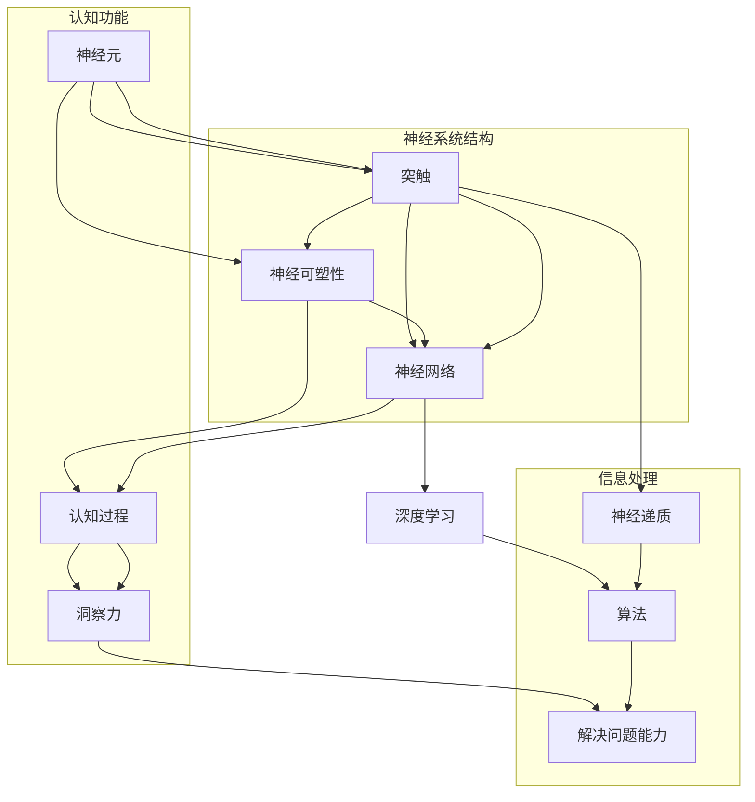

                 

# 理解洞察力的神经科学：揭开认知奥秘

> 关键词：洞察力、神经科学、认知奥秘、神经算法、深度学习、数学模型、应用实践
>
> 摘要：本文将深入探讨洞察力的神经科学原理，通过分析神经系统的结构和功能，揭示认知过程中洞察力的形成机制。我们将结合数学模型和算法原理，探讨如何利用神经科学知识提高人类的认知能力。文章还将通过实际案例和代码实现，展示神经科学在人工智能领域的应用，为读者提供一个全面而深入的洞察力理解。

## 1. 背景介绍

### 1.1 目的和范围

本文的目的是通过神经科学的角度，探讨洞察力的本质及其在认知过程中的作用。我们将从神经系统的基本结构出发，逐步深入到神经算法和数学模型的层面，以揭示洞察力的形成机制。文章不仅旨在为读者提供对洞察力的科学理解，还希望通过实际案例和代码实现，展示如何将神经科学原理应用于人工智能领域，提高机器的洞察力。

### 1.2 预期读者

本文适合对神经科学和人工智能有兴趣的读者，包括但不限于神经科学研究人员、人工智能开发者、认知心理学家以及任何对认知奥秘感兴趣的技术爱好者。无论您是专业学者还是业余爱好者，只要对深度学习和神经算法有一定了解，都可以通过本文获得丰富的知识和启示。

### 1.3 文档结构概述

本文将分为以下几个部分：

1. 背景介绍：介绍文章的目的、预期读者以及文档结构。
2. 核心概念与联系：通过Mermaid流程图，展示神经科学的核心概念及其相互联系。
3. 核心算法原理 & 具体操作步骤：详细解释神经算法的工作原理，并提供伪代码示例。
4. 数学模型和公式 & 详细讲解 & 举例说明：讲解神经科学中的数学模型，并给出具体的例子。
5. 项目实战：介绍如何通过实际代码实现来应用神经科学原理。
6. 实际应用场景：探讨神经科学在各个领域的应用案例。
7. 工具和资源推荐：推荐学习资源和开发工具。
8. 总结：对未来发展趋势和挑战的展望。
9. 附录：常见问题与解答。
10. 扩展阅读 & 参考资料：提供进一步的阅读材料和参考资料。

### 1.4 术语表

#### 1.4.1 核心术语定义

- **洞察力**：指个体对事物本质和内在联系的深刻理解能力。
- **神经科学**：研究神经系统结构、功能和疾病的科学。
- **认知过程**：大脑处理信息、学习、记忆和思考的过程。
- **神经网络**：模拟生物神经系统的计算模型。
- **深度学习**：一种人工智能技术，通过多层神经网络进行特征学习和模式识别。

#### 1.4.2 相关概念解释

- **神经元**：神经系统的基本单元，负责传递和处理信息。
- **突触**：神经元之间的连接点，通过释放神经递质传递信号。
- **神经可塑性**：神经系统在结构和功能上的可变性和适应性。
- **算法**：解决问题的步骤和规则。

#### 1.4.3 缩略词列表

- **AI**：人工智能
- **ML**：机器学习
- **DL**：深度学习
- **NN**：神经网络

## 2. 核心概念与联系

为了更好地理解洞察力的神经科学原理，我们首先需要了解神经科学中的核心概念及其相互联系。以下是神经科学的几个关键概念和它们的相互关系，通过Mermaid流程图来展示：

### 2.1 神经元与突触

神经元是神经系统的基本单元，负责传递和处理信息。神经元通过突触与其他神经元相连，突触是神经元之间的连接点，通过释放神经递质传递信号。神经可塑性是神经系统的一个重要特性，指的是神经系统在结构和功能上的可变性和适应性，这种可塑性是学习、记忆和认知的基础。

### 2.2 神经网络与深度学习

神经网络是一种模拟生物神经系统的计算模型，由大量的神经元和突触组成。深度学习是神经网络的一种形式，通过多层神经网络进行特征学习和模式识别。深度学习在图像识别、语音识别和自然语言处理等领域取得了显著的成功，为人工智能的发展提供了强大的支持。

### 2.3 认知过程与洞察力

认知过程是大脑处理信息、学习、记忆和思考的过程。洞察力是认知过程的一个重要组成部分，指的是个体对事物本质和内在联系的深刻理解能力。认知过程和洞察力之间的关系是相互促进的，认知过程为洞察力提供了基础，而洞察力则可以提高认知过程的效率和质量。

## 3. 核心算法原理 & 具体操作步骤

在理解了神经科学的核

