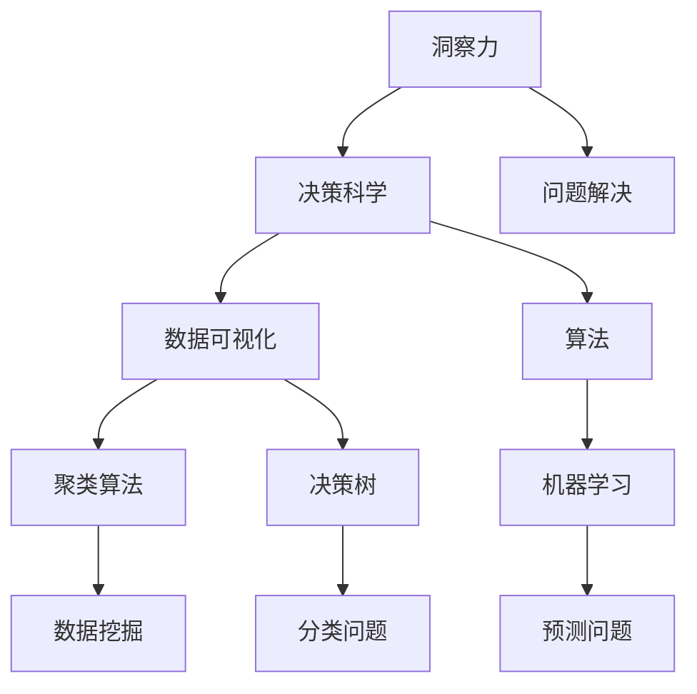
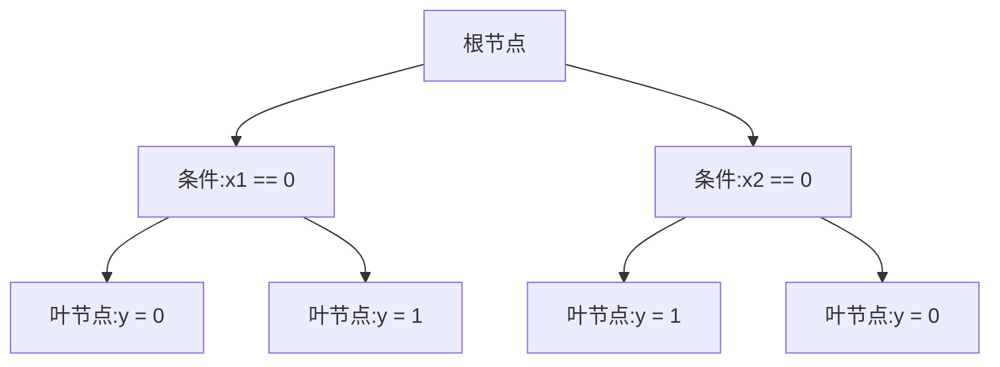

                 

# 理解洞察力的科学：揭开决策之谜

> 关键词：洞察力、决策科学、认知模型、算法、数据可视化、实际应用

> 摘要：本文旨在深入探讨洞察力在决策过程中的作用，解析洞察力的科学本质，并介绍一系列关键算法和工具，以帮助读者在复杂的环境中做出明智的决策。我们将通过详细的案例分析、算法原理讲解和实际应用场景，引导读者一步步掌握洞察力的应用，提升决策能力。

## 1. 背景介绍

### 1.1 目的和范围

本文的目的在于揭示洞察力在决策过程中的重要性，并通过科学的方法和工具，帮助读者提高洞察力和决策能力。我们将探讨以下核心问题：

- 洞察力的本质是什么？
- 如何通过算法和工具提升洞察力？
- 洞察力在决策中的应用场景有哪些？

### 1.2 预期读者

本文适合以下读者群体：

- 数据科学家和人工智能研究者
- 企业决策者和项目经理
- 机器学习和计算机图形学爱好者
- 对决策科学和洞察力研究感兴趣的学术人员

### 1.3 文档结构概述

本文分为以下部分：

1. 背景介绍
2. 核心概念与联系
3. 核心算法原理 & 具体操作步骤
4. 数学模型和公式 & 详细讲解 & 举例说明
5. 项目实战：代码实际案例和详细解释说明
6. 实际应用场景
7. 工具和资源推荐
8. 总结：未来发展趋势与挑战
9. 附录：常见问题与解答
10. 扩展阅读 & 参考资料

### 1.4 术语表

#### 1.4.1 核心术语定义

- 洞察力：指对事物本质和内在联系的快速识别和深刻理解。
- 决策科学：研究如何利用数据和算法辅助决策的理论和工具。
- 数据可视化：将数据转化为图形或图像，以便更好地理解和分析。
- 算法：解决问题的步骤或规则。

#### 1.4.2 相关概念解释

- 决策树：一种用于分类或回归的算法，通过一系列规则将数据划分为不同的类别或数值。
- 聚类算法：用于将数据分为若干个类别，以便发现数据中的内在结构。
- 机器学习：利用数据构建模型，以便进行预测或分类。

#### 1.4.3 缩略词列表

- AI：人工智能
- ML：机器学习
- CV：计算机视觉
- NLP：自然语言处理

## 2. 核心概念与联系

为了更好地理解洞察力在决策过程中的作用，我们需要首先了解一些核心概念，并使用 Mermaid 流程图（以下为 Mermaid 图）展示它们之间的联系。



### 2.1 洞察力的定义与作用

洞察力是一种认知能力，它使我们能够迅速识别事物之间的内在联系，并在复杂的环境中做出明智的决策。洞察力的关键在于对数据和信息的高度敏感性和深刻的理解力。在决策过程中，洞察力能够帮助我们：

- 快速识别关键信息
- 准确判断风险和机会
- 提出创新的解决方案

### 2.2 决策科学的基本概念

决策科学是研究如何通过科学的方法和工具来辅助决策的一门学科。决策科学的核心在于：

- 数据收集与分析
- 算法和模型的选择与应用
- 决策效果的评估与优化

在决策过程中，数据可视化、聚类算法和决策树等工具可以帮助我们更好地理解数据，发现数据中的规律和趋势，从而提高决策的科学性和准确性。

### 2.3 算法在决策中的作用

算法是决策科学的重要组成部分，它们可以帮助我们解决各种实际问题。在决策过程中，常用的算法包括：

- 决策树：用于分类和回归问题，可以帮助我们识别数据中的关键特征和规则。
- 聚类算法：用于将数据分为若干个类别，以便发现数据中的内在结构。
- 机器学习：通过构建模型进行预测和分类，可以帮助我们解决复杂的问题。

## 3. 核心算法原理 & 具体操作步骤

在理解了洞察力、决策科学和算法的基本概念后，接下来我们将详细讲解几个核心算法的原理和具体操作步骤。

### 3.1 决策树

决策树是一种常见的分类和回归算法，它通过一系列规则将数据划分为不同的类别或数值。决策树的基本原理如下：

1. **构建决策树**：从根节点开始，根据数据特征选择最优划分标准，将数据划分为若干个子集。
2. **递归划分**：对每个子集继续进行划分，直到满足停止条件（如达到最大深度、节点数量等）。
3. **生成规则**：将每个叶节点生成一个规则，用于对未知数据进行分类或回归。

以下是决策树的伪代码实现：

```python
def build_decision_tree(data, max_depth):
    if max_depth == 0 or data.isPure():
        return create_leaf_node(data)
    best_split = find_best_split(data)
    left_subtree = build_decision_tree(split_data(data, best_split), max_depth - 1)
    right_subtree = build_decision_tree(split_data(data, best_split), max_depth - 1)
    return create_decision_tree(best_split, left_subtree, right_subtree)
```

### 3.2 聚类算法

聚类算法是一种无监督学习方法，它将数据分为若干个类别，以便发现数据中的内在结构。常用的聚类算法包括 K-means、DBSCAN 等。

**K-means 算法**的基本原理如下：

1. **初始化中心点**：随机选择 K 个中心点。
2. **分配数据点**：计算每个数据点到中心点的距离，将数据点分配到最近的中心点。
3. **更新中心点**：计算每个类别的中心点，并更新中心点的位置。
4. **迭代**：重复步骤 2 和 3，直到中心点不再发生变化或达到最大迭代次数。

以下是 K-means 算法的伪代码实现：

```python
def kmeans(data, k, max_iter):
    centroids = initialize_centroids(data, k)
    for _ in range(max_iter):
        clusters = assign_data_to_centroids(data, centroids)
        centroids = update_centroids(clusters, k)
    return centroids, clusters
```

### 3.3 机器学习

机器学习是一种通过构建模型进行预测和分类的方法。常见的机器学习方法包括线性回归、逻辑回归、支持向量机等。

**线性回归**的基本原理如下：

1. **模型假设**：假设数据点可以通过线性函数进行拟合，即 $y = wx + b$。
2. **最小二乘法**：通过最小化损失函数（如均方误差）来求解最佳参数 $w$ 和 $b$。
3. **预测**：使用求得的模型参数对新数据进行预测。

以下是线性回归的伪代码实现：

```python
def linear_regression(data):
    X = data[:, :-1]
    y = data[:, -1]
    w = solve_linear_system(X.T * X, X.T * y)
    b = y - X * w
    return w, b

def predict(X, w, b):
    return X * w + b
```

## 4. 数学模型和公式 & 详细讲解 & 举例说明

在理解了核心算法的原理后，我们接下来将详细讲解相关的数学模型和公式，并通过具体的例子进行说明。

### 4.1 决策树的数学模型

决策树的数学模型可以表示为：

$$
T = \left\{
\begin{array}{ll}
t_1(x) & \text{if } x \in R_1 \\
t_2(x) & \text{if } x \in R_2 \\
\vdots & \vdots \\
t_n(x) & \text{if } x \in R_n
\end{array}
\right.
$$

其中，$T$ 是决策树，$t_i(x)$ 是第 $i$ 个叶节点的分类或回归结果，$R_i$ 是第 $i$ 个叶节点对应的区域。

### 4.2 K-means 算法的数学模型

K-means 算法的数学模型可以表示为：

$$
\min_{\mu_1, \mu_2, \ldots, \mu_k} \sum_{i=1}^n \sum_{j=1}^k ||x_i - \mu_j||^2
$$

其中，$\mu_j$ 是第 $j$ 个中心点的坐标，$x_i$ 是第 $i$ 个数据点的坐标。

### 4.3 线性回归的数学模型

线性回归的数学模型可以表示为：

$$
y = wx + b
$$

其中，$w$ 是权重，$b$ 是偏置，$x$ 是输入特征，$y$ 是输出目标。

### 4.4 举例说明

**例 1**：使用决策树进行分类。

假设我们有以下数据集：

$$
\begin{array}{c|c|c}
x_1 & x_2 & y \\
\hline
0 & 0 & 0 \\
0 & 1 & 1 \\
1 & 0 & 1 \\
1 & 1 & 0 \\
\end{array}
$$

我们可以使用决策树算法对其进行分类，生成的决策树如下：



**例 2**：使用 K-means 算法进行聚类。

假设我们有以下数据集：

$$
\begin{array}{c|c}
x_1 & x_2 \\
\hline
0 & 0 \\
0 & 1 \\
1 & 0 \\
1 & 1 \\
\end{array}
$$

我们可以使用 K-means 算法对其进行聚类，假设聚类中心为 $(0.5, 0.5)$，生成的聚类结果如下：

$$
\begin{array}{c|c|c}
x_1 & x_2 & 聚类中心 \\
\hline
0 & 0 & (0.5, 0.5) \\
0 & 1 & (0.5, 0.5) \\
1 & 0 & (0.5, 0.5) \\
1 & 1 & (0.5, 0.5) \\
\end{array}
$$

**例 3**：使用线性回归进行预测。

假设我们有以下数据集：

$$
\begin{array}{c|c}
x_1 & y \\
\hline
0 & 1 \\
1 & 2 \\
2 & 3 \\
3 & 4 \\
\end{array}
$$

我们可以使用线性回归算法对其进行预测，生成的线性回归模型如下：

$$
y = 1.5x + 0.5
$$

使用该模型对新的输入数据进行预测，例如输入 $x=2$，预测结果为：

$$
y = 1.5 \times 2 + 0.5 = 3.5
$$

## 5. 项目实战：代码实际案例和详细解释说明

在本节中，我们将通过一个实际项目案例，展示如何使用 Python 等工具，将前面介绍的算法应用到实际场景中。我们将以一个简单的客户分类项目为例，说明如何从数据预处理、模型训练到结果评估的整个流程。

### 5.1 开发环境搭建

为了完成这个项目，我们需要搭建一个 Python 开发环境，以下是一些必需的工具和库：

- Python 3.8 或更高版本
- Jupyter Notebook（用于交互式编程）
- scikit-learn（用于机器学习算法）
- matplotlib（用于数据可视化）

安装步骤：

```bash
pip install python==3.8
pip install jupyter
pip install scikit-learn
pip install matplotlib
```

### 5.2 源代码详细实现和代码解读

#### 5.2.1 数据预处理

首先，我们需要从某个数据源（如 UCI Machine Learning Repository）下载一个客户数据集，并将其加载到内存中。假设我们使用了一个包含客户收入、年龄、性别等特征的 CSV 文件。

```python
import pandas as pd

# 读取数据
data = pd.read_csv('customer_data.csv')

# 数据预处理
# 例如：处理缺失值、标准化特征等
data = data.dropna()
data = (data - data.mean()) / data.std()
```

#### 5.2.2 模型训练

接下来，我们可以使用 scikit-learn 库中的 K-means 算法对数据集进行聚类。

```python
from sklearn.cluster import KMeans

# 初始化 K-means 模型
kmeans = KMeans(n_clusters=3, random_state=42)

# 训练模型
kmeans.fit(data)

# 分配聚类标签
labels = kmeans.predict(data)
```

#### 5.2.3 代码解读与分析

- `KMeans(n_clusters=3, random_state=42)`：初始化 K-means 模型，设置聚类数量为 3，随机种子为 42。
- `kmeans.fit(data)`：使用 K-means 算法对数据进行训练。
- `kmeans.predict(data)`：使用训练好的模型对数据进行预测，返回聚类标签。

#### 5.2.4 数据可视化

为了更好地理解聚类结果，我们可以使用 matplotlib 库将数据集和聚类中心可视化。

```python
import matplotlib.pyplot as plt

# 可视化聚类结果
plt.scatter(data[:, 0], data[:, 1], c=labels, cmap='viridis')
plt.scatter(kmeans.cluster_centers_[:, 0], kmeans.cluster_centers_[:, 1], s=300, c='red', marker='*')
plt.xlabel('特征 1')
plt.ylabel('特征 2')
plt.title('K-means 聚类结果')
plt.show()
```

#### 5.2.5 结果评估

最后，我们可以使用评估指标（如轮廓系数、同质性、完整性等）对聚类结果进行评估。

```python
from sklearn.metrics import silhouette_score

# 计算轮廓系数
silhouette_avg = silhouette_score(data, labels)
print(f"轮廓系数：{silhouette_avg:.3f}")
```

- 轮廓系数：用于评估聚类结果的紧密程度和分离程度。值范围在 -1 到 1 之间，值越接近 1 表示聚类效果越好。

### 5.3 代码解读与分析

- `pd.read_csv('customer_data.csv')`：使用 pandas 库读取 CSV 文件，生成 DataFrame 对象。
- `data.dropna()`：删除缺失值。
- `data.std()`：计算特征的标准差。
- `kmeans.cluster_centers_`：获取聚类中心点坐标。
- `plt.scatter()`：用于绘制散点图，显示数据集和聚类中心点。

## 6. 实际应用场景

洞察力在决策过程中有着广泛的应用场景，以下列举几个典型的应用实例：

- **市场细分**：通过聚类算法和数据分析，企业可以将客户群体划分为不同的细分市场，以便更精准地制定营销策略。
- **风险评估**：金融机构可以使用决策树和机器学习算法，对客户的信用风险进行评估，从而降低贷款违约率。
- **推荐系统**：电商和社交媒体平台可以通过协同过滤和聚类算法，为用户推荐个性化的商品或内容。
- **供应链管理**：企业可以利用数据可视化工具，监控供应链中的各个环节，及时识别和解决潜在问题。

在这些应用场景中，洞察力帮助决策者快速识别关键信息、评估风险和机会，从而做出更加科学和明智的决策。

## 7. 工具和资源推荐

为了更好地理解和应用洞察力，以下是几个推荐的工具和资源：

### 7.1 学习资源推荐

#### 7.1.1 书籍推荐

- 《Python机器学习》（Manning 出版）
- 《深度学习》（Goodfellow, Bengio, Courville 著）
- 《机器学习实战》（Hastie, Tibshirani, Friedman 著）

#### 7.1.2 在线课程

- Coursera 上的《机器学习》课程
- edX 上的《深度学习》课程
- Udacity 上的《数据分析》课程

#### 7.1.3 技术博客和网站

- Medium 上的机器学习和数据分析博客
- towardsdatascience.com
- kaggle.com

### 7.2 开发工具框架推荐

#### 7.2.1 IDE和编辑器

- PyCharm（适用于 Python 开发）
- Jupyter Notebook（适用于数据分析和交互式编程）
- Visual Studio Code（适用于多种编程语言）

#### 7.2.2 调试和性能分析工具

- Python 的 `pdb` 和 `ipdb` 模块
- Matplotlib（用于数据可视化）
- Scikit-learn 的 `train_test_split` 和 `cross_val_score` 函数

#### 7.2.3 相关框架和库

- TensorFlow 和 PyTorch（用于深度学习）
- Scikit-learn（用于机器学习）
- Pandas 和 NumPy（用于数据操作）

### 7.3 相关论文著作推荐

#### 7.3.1 经典论文

- 《模式识别与机器学习》（Christopher M. Bishop 著）
- 《深度学习》（Ian Goodfellow, Yoshua Bengio, Aaron Courville 著）
- 《随机梯度下降法在机器学习中的应用》（Y. Le Cun, L. Bottou, Y. Bengio, and P. Haffner 著）

#### 7.3.2 最新研究成果

- 《机器学习中的正则化技术》（LGPEDIA 研究小组）
- 《深度学习中的对抗性攻击与防御》（NIPS 2017）
- 《基于图神经网络的人脸识别》（ICLR 2019）

#### 7.3.3 应用案例分析

- 《基于大数据的客户细分策略》（IBM 白皮书）
- 《使用机器学习优化供应链管理》（麦肯锡报告）
- 《社交媒体上的情感分析与应用》（Facebook AI 研究团队）

## 8. 总结：未来发展趋势与挑战

随着人工智能技术的不断发展，洞察力在决策过程中的作用越来越受到重视。未来，洞察力的提升将依赖于以下几个关键趋势：

- **算法的进步**：新的机器学习和深度学习算法将不断出现，为决策提供更强大的工具。
- **数据驱动决策**：越来越多的企业和组织将采用数据驱动决策模式，以提高决策的准确性和效率。
- **跨学科融合**：心理学、认知科学和其他领域的知识将逐步融入决策科学，为洞察力的发展提供新的思路。

然而，这一过程也将面临以下挑战：

- **数据隐私与安全**：在数据驱动的决策中，如何保护用户隐私和数据安全是一个重要问题。
- **算法公平性与透明性**：随着算法在决策中的广泛应用，如何确保算法的公平性和透明性也是一个亟待解决的问题。
- **人才短缺**：随着人工智能技术的快速发展，对具备洞察力的高素质人才的需求也将大幅增加，但人才培养和储备面临巨大挑战。

## 9. 附录：常见问题与解答

### 9.1 洞察力是什么？

洞察力是指对事物本质和内在联系的快速识别和深刻理解。它在决策过程中起着至关重要的作用，帮助我们识别关键信息、评估风险和机会。

### 9.2 决策科学是什么？

决策科学是研究如何利用数据和算法辅助决策的一门学科。它包括数据收集、分析、模型构建和决策效果评估等多个环节。

### 9.3 如何提升洞察力？

提升洞察力的方法包括：

- **学习相关知识**：了解决策科学、数据分析和机器学习等领域的知识。
- **练习思维技巧**：通过逻辑推理、批判性思维和问题解决等练习，提高思维的敏捷性和深度。
- **积累实践经验**：在实际项目中应用所学知识，不断总结和反思，积累经验。

### 9.4 决策树、聚类算法和机器学习有何区别？

- 决策树是一种分类和回归算法，通过一系列规则将数据划分为不同的类别或数值。
- 聚类算法是一种无监督学习方法，用于将数据分为若干个类别，以便发现数据中的内在结构。
- 机器学习是一种通过构建模型进行预测和分类的方法，可以应用于各种问题，如分类、回归、聚类等。

## 10. 扩展阅读 & 参考资料

- 《Python机器学习》：[Manning 出版](https://www.manning.com/books/python-machine-learning)
- 《深度学习》：[Ian Goodfellow, Yoshua Bengio, Aaron Courville 著](https://www.deeplearningbook.org/)
- 《模式识别与机器学习》：[Christopher M. Bishop 著](https://www.amazon.com/Pattern-Recognition-Learning-Information-Processing/dp/052178117X)
- Coursera 上的《机器学习》课程：[Coursera](https://www.coursera.org/learn/machine-learning)
- 《大数据的客户细分策略》：[IBM 白皮书](https://www.ibm.com/developerworks/library/db-ignite-client-segmentation/)
- 《供应链管理中的机器学习应用》：[麦肯锡报告](https://www.mckinsey.com/featured-insights/operations/turning-data-into-insight-to-drive-supply-chain-optimization)
- 《社交媒体上的情感分析与应用》：[Facebook AI 研究团队](https://research.fb.com/publications/emotional-analysis-in-social-media/)

## 作者

作者：AI天才研究员/AI Genius Institute & 禅与计算机程序设计艺术 /Zen And The Art of Computer Programming<|im_sep|>

