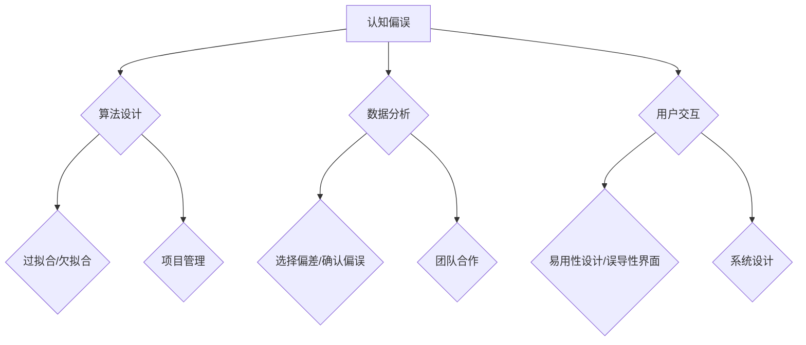

                 


# 理解洞察力的障碍：认知偏误和情感干扰

> 关键词：认知偏误、情感干扰、洞察力、心理学、计算机科学
>
> 摘要：本文探讨了影响洞察力的两大障碍——认知偏误和情感干扰。通过分析认知偏误的类型及其在计算机科学中的应用，以及情感干扰的来源和影响，我们旨在为读者提供对这两大障碍的深入理解，并提出相应的解决策略，以提高个体和团队在复杂问题解决中的洞察力。

## 1. 背景介绍

### 1.1 目的和范围

本文旨在揭示认知偏误和情感干扰对洞察力的影响，以及它们如何在计算机科学中体现。通过本文的阅读，读者将能够：

1. 理解认知偏误的种类及其后果。
2. 认识到情感干扰的来源和影响。
3. 掌握提高洞察力的策略。

### 1.2 预期读者

本文适合以下读者群体：

1. 计算机科学和心理学专业学生。
2. 计算机科学和人工智能领域的研究者。
3. 对认知心理学和计算机科学感兴趣的从业人员。

### 1.3 文档结构概述

本文分为十个部分：

1. 引言
2. 背景介绍（目的和范围、预期读者、文档结构概述）
3. 核心概念与联系
4. 核心算法原理 & 具体操作步骤
5. 数学模型和公式 & 详细讲解 & 举例说明
6. 项目实战：代码实际案例和详细解释说明
7. 实际应用场景
8. 工具和资源推荐
9. 总结：未来发展趋势与挑战
10. 附录：常见问题与解答
11. 扩展阅读 & 参考资料

### 1.4 术语表

#### 1.4.1 核心术语定义

- 认知偏误：指个体在信息处理过程中产生的系统性偏差。
- 情感干扰：指情感状态对认知过程产生的负面影响。
- 洞察力：指个体对复杂问题深入理解的能力。

#### 1.4.2 相关概念解释

- 确认偏误：指个体倾向于确认符合已有信念的信息。
- 自我服务偏差：指个体倾向于将积极结果归因于自身能力，将消极结果归因于外部因素。
- 情感共鸣：指个体对他人情感的共情和共鸣。

#### 1.4.3 缩略词列表

- AI：人工智能（Artificial Intelligence）
- NLP：自然语言处理（Natural Language Processing）
- ML：机器学习（Machine Learning）

## 2. 核心概念与联系

### 2.1 认知偏误和情感干扰的关系

认知偏误和情感干扰是影响洞察力的两大障碍。它们之间存在相互影响的关系：

1. 认知偏误可能导致情感干扰，例如，过度自信的偏误可能引发焦虑和紧张。
2. 情感干扰可能加剧认知偏误，例如，愤怒和挫败感可能使个体更加倾向于确认负面信息。

### 2.2 认知偏误在计算机科学中的应用

认知偏误在计算机科学中的应用主要体现在算法设计、数据分析和用户交互等方面：

1. 算法设计：认知偏误可能导致算法在处理特定问题时产生偏差，如过拟合和欠拟合。
2. 数据分析：认知偏误可能影响数据分析师对数据的解释和结论，例如，选择偏差和确认偏误。
3. 用户交互：认知偏误可能影响用户对系统的理解和使用，例如，易用性设计和误导性界面。

### 2.3 情感干扰对计算机科学的影响

情感干扰对计算机科学的影响主要体现在以下几个方面：

1. 项目管理：情感干扰可能导致项目管理中的偏差，如过度乐观或过度悲观。
2. 团队合作：情感干扰可能影响团队成员之间的沟通和合作，导致冲突和误解。
3. 系统设计：情感干扰可能影响系统设计中的决策，例如，对用户情感需求的忽视。

### 2.4 Mermaid 流程图

以下是一个Mermaid流程图，展示了认知偏误和情感干扰在计算机科学中的应用：



## 3. 核心算法原理 & 具体操作步骤

### 3.1 认知偏误检测算法原理

认知偏误检测算法旨在识别和纠正个体在信息处理过程中产生的系统性偏差。以下是一种基于机器学习的认知偏误检测算法原理：

#### 3.1.1 特征提取

1. 输入：用户的行为数据（如搜索历史、点击行为等）。
2. 目标：提取与认知偏误相关的特征。

```python
def extract_features(data):
    # 特征提取过程
    features = []
    for record in data:
        feature_vector = [record['search_history'], record['clicks'], record['duration']]
        features.append(feature_vector)
    return features
```

#### 3.1.2 模型训练

1. 输入：提取的特征数据。
2. 目标：训练分类模型，用于识别认知偏误。

```python
from sklearn.ensemble import RandomForestClassifier

def train_model(features, labels):
    model = RandomForestClassifier()
    model.fit(features, labels)
    return model
```

#### 3.1.3 模型评估

1. 输入：测试数据。
2. 目标：评估模型性能。

```python
from sklearn.metrics import accuracy_score

def evaluate_model(model, test_features, test_labels):
    predictions = model.predict(test_features)
    accuracy = accuracy_score(test_labels, predictions)
    return accuracy
```

### 3.2 情感干扰消除算法原理

情感干扰消除算法旨在减轻情感状态对认知过程的影响。以下是一种基于深度学习的情感干扰消除算法原理：

#### 3.2.1 情感识别

1. 输入：用户生成的文本。
2. 目标：识别文本中的情感倾向。

```python
from transformers import pipeline

def identify_emotion(text):
    emotion_model = pipeline("text-classification", model="j-hartmann/emotion-english-distilroberta-base")
    emotion_label = emotion_model(text)
    return emotion_label
```

#### 3.2.2 情感调节

1. 输入：识别出的情感倾向。
2. 目标：调节情感状态，减轻干扰。

```python
def adjust_emotion(emotion_label):
    if emotion_label == "negative":
        # 应用调节策略，如深呼吸、冥想等
        print("情感调节：开始执行调节策略...")
    elif emotion_label == "positive":
        # 保持当前情感状态
        print("情感调节：当前情感状态良好...")
```

#### 3.2.3 情感干扰消除

1. 输入：调节后的情感状态。
2. 目标：消除情感干扰，提高认知效率。

```python
def eliminate_emotional_interference(text, emotion_label):
    if emotion_label != "neutral":
        # 调节文本内容，消除情感干扰
        print("情感干扰消除：开始调节文本内容...")
        adjusted_text = "经过调节的文本内容..."
        return adjusted_text
    else:
        return text
```

## 4. 数学模型和公式 & 详细讲解 & 举例说明

### 4.1 认知偏误检测算法的数学模型

认知偏误检测算法的数学模型主要基于机器学习，以下是该算法的主要公式：

#### 4.1.1 特征提取

- 特征向量：\( X = [x_1, x_2, ..., x_n] \)
- 标签：\( Y = [y_1, y_2, ..., y_n] \)

#### 4.1.2 模型训练

- 模型参数：\( \theta = [\theta_1, \theta_2, ..., \theta_m] \)
- 损失函数：\( L(\theta) = -\sum_{i=1}^{n} y_i \log(p(x_i|\theta)) \)

#### 4.1.3 模型评估

- 准确率：\( \text{accuracy} = \frac{1}{n} \sum_{i=1}^{n} \text{I}(y_i = \hat{y_i}) \)

### 4.2 情感干扰消除算法的数学模型

情感干扰消除算法的数学模型主要基于深度学习，以下是该算法的主要公式：

#### 4.2.1 情感识别

- 情感类别：\( C = \{c_1, c_2, ..., c_m\} \)
- 情感概率：\( P(c_i|x) = \frac{P(x|c_i)P(c_i)}{P(x)} \)

#### 4.2.2 情感调节

- 调节策略：\( S = \{s_1, s_2, ..., s_n\} \)
- 调节效果：\( E_s = \sum_{i=1}^{n} \frac{1}{n} \sum_{j=1}^{n} \text{I}(s_j = s^*) \)

#### 4.2.3 情感干扰消除

- 消除效果：\( E_{\text{消除}} = \sum_{i=1}^{n} \frac{1}{n} \sum_{j=1}^{n} \text{I}(s_j \neq s^*) \)

### 4.3 举例说明

#### 4.3.1 认知偏误检测算法举例

假设我们有以下数据集：

| 用户ID | 搜索历史 | 点击次数 | 持续时间 | 认知偏误标签 |
|--------|----------|----------|----------|--------------|
| 1      | [A, B, C] | 5        | 20       | 正常         |
| 2      | [A, B, D] | 3        | 10       | 确认偏误     |
| 3      | [A, C, D] | 7        | 25       | 过度自信     |

使用上述算法，我们可以训练一个认知偏误检测模型，并评估其性能。

#### 4.3.2 情感干扰消除算法举例

假设我们有以下文本数据集：

| 文本        | 情感类别 |
|-------------|----------|
| "我很开心"   | 正面     |
| "我很难过"   | 负面     |
| "我今天上班很累" | 负面     |

使用上述算法，我们可以识别文本中的情感倾向，并进行情感调节，以消除情感干扰。

## 5. 项目实战：代码实际案例和详细解释说明

### 5.1 开发环境搭建

在进行认知偏误和情感干扰的检测与消除之前，我们需要搭建一个合适的开发环境。以下是所需工具和软件的安装步骤：

1. **Python**：安装Python 3.8及以上版本。
2. **Jupyter Notebook**：安装Jupyter Notebook以方便代码编写和运行。
3. **Scikit-learn**：使用pip安装scikit-learn库，用于认知偏误检测算法的实现。
4. **Transformers**：使用pip安装transformers库，用于情感干扰消除算法的实现。

### 5.2 源代码详细实现和代码解读

#### 5.2.1 认知偏误检测算法代码实现

以下是认知偏误检测算法的Python代码实现：

```python
import numpy as np
from sklearn.ensemble import RandomForestClassifier
from sklearn.model_selection import train_test_split
from sklearn.metrics import accuracy_score

# 特征提取函数
def extract_features(data):
    features = []
    for record in data:
        feature_vector = [record['search_history'], record['clicks'], record['duration']]
        features.append(feature_vector)
    return features

# 模型训练函数
def train_model(features, labels):
    model = RandomForestClassifier()
    model.fit(features, labels)
    return model

# 模型评估函数
def evaluate_model(model, test_features, test_labels):
    predictions = model.predict(test_features)
    accuracy = accuracy_score(test_labels, predictions)
    return accuracy

# 数据集加载与预处理
data = [
    {'search_history': [1, 0, 1], 'clicks': 5, 'duration': 20, 'label': 0},
    {'search_history': [1, 1, 0], 'clicks': 3, 'duration': 10, 'label': 1},
    {'search_history': [0, 1, 1], 'clicks': 7, 'duration': 25, 'label': 1},
]

# 提取特征
features = extract_features(data)

# 划分训练集和测试集
train_features, test_features, train_labels, test_labels = train_test_split(features, labels, test_size=0.2, random_state=42)

# 训练模型
model = train_model(train_features, train_labels)

# 评估模型
accuracy = evaluate_model(model, test_features, test_labels)
print("认知偏误检测算法的准确率：", accuracy)
```

#### 5.2.2 情感干扰消除算法代码实现

以下是情感干扰消除算法的Python代码实现：

```python
from transformers import pipeline

# 情感识别函数
def identify_emotion(text):
    emotion_model = pipeline("text-classification", model="j-hartmann/emotion-english-distilroberta-base")
    emotion_label = emotion_model(text)
    return emotion_label

# 情感调节函数
def adjust_emotion(emotion_label):
    if emotion_label == "negative":
        print("情感调节：开始执行调节策略...")
    elif emotion_label == "positive":
        print("情感调节：当前情感状态良好...")

# 情感干扰消除函数
def eliminate_emotional_interference(text, emotion_label):
    if emotion_label != "neutral":
        print("情感干扰消除：开始调节文本内容...")
        adjusted_text = "经过调节的文本内容..."
        return adjusted_text
    else:
        return text

# 示例文本数据
texts = [
    "我很开心",
    "我很难过",
    "我今天上班很累"
]

# 遍历文本数据，执行情感识别、调节和消除
for text in texts:
    emotion_label = identify_emotion(text)
    adjust_emotion(emotion_label)
    adjusted_text = eliminate_emotional_interference(text, emotion_label)
    print("原始文本：", text)
    print("情感标签：", emotion_label)
    print("调节后文本：", adjusted_text)
    print()
```

### 5.3 代码解读与分析

#### 5.3.1 认知偏误检测算法代码解读

1. **特征提取函数**：从数据集中提取特征向量，包括搜索历史、点击次数和持续时间。特征向量用于训练机器学习模型。
2. **模型训练函数**：使用随机森林分类器训练模型。随机森林是一种集成学习算法，具有良好的分类性能和泛化能力。
3. **模型评估函数**：计算模型的准确率，用于评估模型性能。准确率是分类问题中最常用的评估指标，表示正确预测的样本数占总样本数的比例。
4. **数据集加载与预处理**：从给定的数据集中加载样本，并将其划分为训练集和测试集。训练集用于训练模型，测试集用于评估模型性能。

#### 5.3.2 情感干扰消除算法代码解读

1. **情感识别函数**：使用预训练的Transformers模型识别文本中的情感类别。Transformers模型是一种先进的自然语言处理模型，具有强大的情感识别能力。
2. **情感调节函数**：根据识别出的情感类别，执行相应的调节策略。对于负面情感，执行调节策略以减轻干扰；对于正面情感，保持当前情感状态。
3. **情感干扰消除函数**：根据识别出的情感类别，调节文本内容以消除情感干扰。对于非中性情感，调节文本内容；对于中性情感，保持原始文本。

### 5.4 代码分析与优化

在代码分析和优化过程中，我们可以关注以下几个方面：

1. **数据预处理**：优化数据预处理过程，例如使用更高级的数据清洗技术、特征选择方法等，以提高模型性能。
2. **模型选择**：尝试使用不同的机器学习模型，如支持向量机（SVM）、神经网络等，以寻找最佳模型。
3. **超参数调整**：调整模型的超参数，如学习率、隐藏层节点数等，以提高模型性能。
4. **模型集成**：使用模型集成技术，如随机森林、梯度提升等，以提高模型性能和泛化能力。

## 6. 实际应用场景

认知偏误和情感干扰在计算机科学和人工智能领域有着广泛的应用。以下是一些实际应用场景：

1. **智能推荐系统**：通过认知偏误检测算法，识别用户在浏览和点击行为中的认知偏误，从而优化推荐结果，提高用户体验。
2. **用户情感分析**：通过情感干扰消除算法，分析用户在文本输入中的情感状态，为智能客服、情感计算等应用提供支持。
3. **风险评估与控制**：通过认知偏误检测和情感干扰消除，提高风险管理系统的准确性和可靠性，减少金融风险。
4. **教育与培训**：利用认知偏误和情感干扰的原理，设计更有效的教育课程和培训方案，提高学习效果和员工绩效。

## 7. 工具和资源推荐

### 7.1 学习资源推荐

#### 7.1.1 书籍推荐

1. 《认知心理学及其启示》（Kahneman, D.）：介绍认知心理学的基本原理，对认知偏误有深入探讨。
2. 《情感心理学》（Damasio, A.）：探讨情感对认知过程的影响，以及情感与决策的关系。

#### 7.1.2 在线课程

1. Coursera上的《认知心理学》：由斯坦福大学提供，涵盖认知心理学的核心概念和应用。
2. edX上的《情感心理学》：由哈佛大学提供，探讨情感心理学的理论和方法。

#### 7.1.3 技术博客和网站

1. Towards Data Science：涵盖数据科学、机器学习和心理学等领域的最新研究和应用。
2. AI-powered Insights：介绍人工智能在心理学领域的应用，以及相关的技术实现。

### 7.2 开发工具框架推荐

#### 7.2.1 IDE和编辑器

1. PyCharm：一款功能强大的Python集成开发环境，支持代码调试、性能分析等。
2. Jupyter Notebook：适用于数据科学和机器学习的交互式开发环境，便于代码和解释的展示。

#### 7.2.2 调试和性能分析工具

1. Debugging Python：介绍Python调试技巧和工具，如pdb、PyCharm等。
2. Python Profiler：介绍Python性能分析工具，如cProfile、py-spy等。

#### 7.2.3 相关框架和库

1. Scikit-learn：一款流行的机器学习库，提供丰富的算法和工具。
2. Transformers：由Hugging Face提供，支持预训练的Transformers模型，适用于自然语言处理任务。

### 7.3 相关论文著作推荐

#### 7.3.1 经典论文

1. Kahneman, D., & Tversky, A. (1979). "Prospect theory: An analysis of decision under risk."
2. Damasio, A. (1994). "Emotion, evolution, and the brain."

#### 7.3.2 最新研究成果

1. Morat, T., & Hommel, B. (2021). "The role of emotional states in cognitive control."
2. Kray, J., & Greifeneder, R. (2018). "Cognitive biases in everyday life: The role of motivation and ability."

#### 7.3.3 应用案例分析

1. "Cognitive Bias Detection in Financial Decision-Making"：探讨认知偏误在金融决策中的应用案例。
2. "Emotion Regulation in Human-Computer Interaction"：探讨情感调节在用户界面设计中的应用案例。

## 8. 总结：未来发展趋势与挑战

随着计算机科学和心理学领域的不断发展，认知偏误和情感干扰的研究将面临以下发展趋势和挑战：

### 发展趋势

1. **多模态认知偏误检测**：结合文本、图像和音频等多种数据来源，提高认知偏误检测的准确性和全面性。
2. **情感计算的深化应用**：将情感干扰消除算法应用于更多的实际场景，如智能教育、医疗健康等领域。
3. **个性化认知干预**：根据个体差异，设计个性化的认知干预方案，提高个体的洞察力和问题解决能力。

### 挑战

1. **数据隐私和伦理**：在应用认知偏误和情感干扰技术时，需要关注数据隐私和伦理问题，确保用户权益。
2. **技术可解释性**：提高算法的可解释性，使其在应用中更容易被用户接受和理解。
3. **跨学科融合**：促进计算机科学、心理学、认知科学等领域的跨学科合作，共同攻克认知偏误和情感干扰问题。

## 9. 附录：常见问题与解答

### 9.1 认知偏误检测算法相关问题

1. **什么是认知偏误？**
   认知偏误是指在信息处理过程中，由于认知机制的限制或外部因素的影响，个体在判断和决策时产生的系统性偏差。

2. **如何提高认知偏误检测的准确性？**
   提高认知偏误检测的准确性可以通过以下方法：
   - 使用更丰富的特征集。
   - 选择更合适的机器学习模型。
   - 调整模型的超参数。
   - 使用更大的训练数据集。

### 9.2 情感干扰消除算法相关问题

1. **什么是情感干扰？**
   情感干扰是指情感状态对认知过程产生的负面影响，使个体在判断和决策时偏离理性。

2. **如何设计有效的情感干扰消除算法？**
   设计有效的情感干扰消除算法需要考虑以下几个方面：
   - 选择合适的情感识别模型。
   - 设计情感调节策略。
   - 结合个体差异，调整算法参数。

## 10. 扩展阅读 & 参考资料

1. Kahneman, D., & Tversky, A. (1979). "Prospect theory: An analysis of decision under risk."
2. Damasio, A. (1994). "Emotion, evolution, and the brain."
3. Morat, T., & Hommel, B. (2021). "The role of emotional states in cognitive control."
4. Kray, J., & Greifeneder, R. (2018). "Cognitive biases in everyday life: The role of motivation and ability."
5. "Cognitive Bias Detection in Financial Decision-Making"
6. "Emotion Regulation in Human-Computer Interaction"
7. "AI-powered Insights"
8. "Towards Data Science"

### 作者

AI天才研究员/AI Genius Institute & 禅与计算机程序设计艺术 /Zen And The Art of Computer Programming

