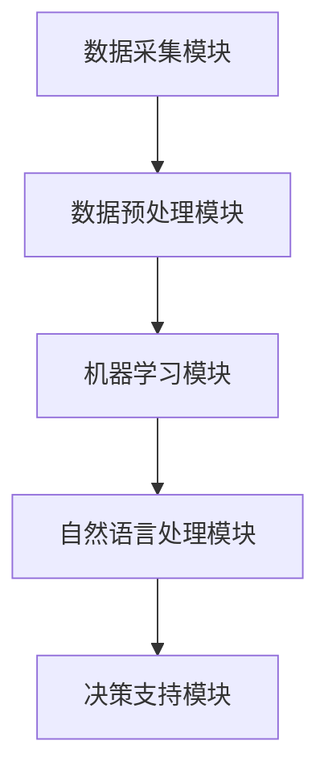

                 


# 生态系统分析器：提示词助力环境保护决策

> **关键词**：生态系统分析、环境监测、人工智能、机器学习、决策支持系统
>
> **摘要**：本文将探讨一种新型生态系统分析器，它利用先进的机器学习和自然语言处理技术，通过提示词生成环境数据摘要，辅助决策者做出更明智的环境保护决策。本文将详细描述该分析器的工作原理、核心算法、数学模型及其实际应用，旨在为环境保护领域的专业人士和研究者提供有价值的参考。

## 1. 背景介绍

### 1.1 目的和范围

随着全球环境问题的日益严峻，环境保护决策的制定变得越来越复杂。为了更好地应对环境挑战，需要高效、准确的数据分析和决策支持系统。本文旨在介绍一种基于人工智能的生态系统分析器，该分析器利用提示词生成技术，实现对环境数据的自动分析和摘要，为环境保护决策提供有力支持。

### 1.2 预期读者

本文面向环境保护领域的专业人士、研究人员和决策者，以及计算机科学、人工智能和机器学习领域的学者和实践者。本文将详细讨论生态系统分析器的设计、实现和应用，旨在为相关领域的研究和实践提供有益的参考。

### 1.3 文档结构概述

本文结构如下：

1. 背景介绍：介绍生态系统分析器的背景、目的和预期读者。
2. 核心概念与联系：介绍生态系统分析器涉及的核心概念和原理。
3. 核心算法原理 & 具体操作步骤：详细描述生态系统分析器的核心算法和实现步骤。
4. 数学模型和公式 & 详细讲解 & 举例说明：讲解生态系统分析器所涉及的数学模型和公式，并提供实际应用案例。
5. 项目实战：展示代码实现和案例分析。
6. 实际应用场景：讨论生态系统分析器的应用场景和实际效果。
7. 工具和资源推荐：推荐学习资源和开发工具。
8. 总结：总结生态系统分析器的发展趋势和挑战。
9. 附录：常见问题与解答。
10. 扩展阅读 & 参考资料：提供进一步的阅读材料和参考资源。

### 1.4 术语表

#### 1.4.1 核心术语定义

- **生态系统分析器**：一种基于人工智能技术的环境数据分析工具，能够对复杂的环境数据进行分析和摘要，为环境保护决策提供支持。
- **提示词**：一种用于引导模型生成文本的词汇或短语，常用于自然语言处理任务中。
- **环境数据**：与生态系统相关的各种数据，包括气象数据、水质数据、土壤数据等。
- **机器学习**：一种通过数据学习规律并自动改进自身性能的技术，常用于构建智能系统。
- **决策支持系统**：一种辅助决策者做出明智决策的系统，通常包含数据采集、处理和分析等功能。

#### 1.4.2 相关概念解释

- **数据挖掘**：从大量数据中发现有价值的信息和模式的过程。
- **数据可视化**：通过图形或图表将数据呈现给用户，帮助用户更好地理解和分析数据。
- **自然语言处理**：使计算机能够理解、生成和处理人类自然语言的技术。

#### 1.4.3 缩略词列表

- **AI**：人工智能
- **ML**：机器学习
- **NLP**：自然语言处理
- **DSS**：决策支持系统

## 2. 核心概念与联系

在介绍生态系统分析器之前，我们需要了解一些核心概念和它们之间的联系。

### 2.1 生态系统分析器的工作原理

生态系统分析器是一种利用机器学习和自然语言处理技术进行环境数据分析的工具。它的工作流程大致如下：

1. **数据采集**：从各种来源（如气象站、水质监测站等）收集环境数据。
2. **数据预处理**：对采集到的数据进行清洗、归一化和特征提取，以便于后续的机器学习模型训练。
3. **模型训练**：使用机器学习算法对预处理后的数据进行训练，构建环境数据的特征模型。
4. **环境数据摘要**：利用训练好的模型和提示词生成环境数据摘要，辅助决策者了解环境状况。
5. **决策支持**：根据环境数据摘要和决策者的需求，为环境保护决策提供支持。

### 2.2 生态系统分析器的核心概念

- **环境数据**：环境数据包括各种与生态系统相关的数据，如气象数据、水质数据、土壤数据等。这些数据通常具有高维度、非线性等特点，难以直接进行人工分析和理解。
- **机器学习**：机器学习是构建智能系统的基础，通过从数据中学习规律，可以自动识别环境数据的特征和模式。
- **自然语言处理**：自然语言处理技术可以使计算机理解和生成人类自然语言，从而实现环境数据摘要的自动化生成。

### 2.3 生态系统分析器的架构

生态系统分析器主要由以下几个模块组成：

1. **数据采集模块**：负责从各种来源收集环境数据，包括实时数据和历史数据。
2. **数据预处理模块**：负责对采集到的环境数据进行分析、清洗和特征提取，为模型训练提供高质量的数据。
3. **机器学习模块**：负责训练机器学习模型，将环境数据的特征表示为可理解的摘要。
4. **自然语言处理模块**：负责将机器学习模块生成的特征表示转换为自然语言摘要，为决策者提供直观的环境信息。
5. **决策支持模块**：负责根据环境数据摘要和决策者的需求，提供相应的决策支持。

下面是一个简单的 Mermaid 流程图，描述了生态系统分析器的基本架构：



## 3. 核心算法原理 & 具体操作步骤

在了解生态系统分析器的工作原理和架构后，我们需要深入探讨其核心算法原理和具体操作步骤。

### 3.1 数据采集

数据采集是生态系统分析器的第一步，它决定了后续分析的质量和效果。数据采集主要包括以下步骤：

1. **数据来源**：确定需要收集的环境数据类型，如气象数据、水质数据、土壤数据等。
2. **数据采集方式**：根据数据类型，选择合适的数据采集方式，如传感器采集、实时数据流采集等。
3. **数据存储**：将采集到的数据存储到数据库或数据仓库中，以便后续处理和分析。

伪代码如下：

```python
def collect_data(data_source, data_type):
    # 根据数据类型和数据源，采集数据
    if data_type == "气象数据":
        collect_weather_data(data_source)
    elif data_type == "水质数据":
        collect_water_quality_data(data_source)
    # 其他数据类型的采集
    # ...
    
    # 存储采集到的数据到数据库
    store_data_to_database(采集到的数据)
```

### 3.2 数据预处理

数据预处理是确保数据质量和模型性能的重要环节。数据预处理主要包括以下步骤：

1. **数据清洗**：去除无效数据、缺失数据和异常数据，提高数据质量。
2. **归一化**：将不同量纲的数据转换为相同的量纲，便于模型训练。
3. **特征提取**：从原始数据中提取有用的特征，为模型训练提供输入。

伪代码如下：

```python
def preprocess_data(data):
    # 数据清洗
    clean_data = clean_data(data)
    
    # 归一化
    normalized_data = normalize_data(clean_data)
    
    # 特征提取
    features = extract_features(normalized_data)
    
    return features
```

### 3.3 机器学习模型训练

机器学习模型训练是生态系统分析器的核心步骤，它决定了环境数据摘要的质量。机器学习模型训练主要包括以下步骤：

1. **模型选择**：选择合适的机器学习算法，如决策树、支持向量机、神经网络等。
2. **模型训练**：使用训练数据对模型进行训练，调整模型参数，使其能够准确识别环境数据的特征。
3. **模型评估**：使用验证数据评估模型性能，调整模型参数，确保模型具有良好的泛化能力。

伪代码如下：

```python
def train_model(training_data, validation_data):
    # 模型选择
    model = choose_model()
    
    # 模型训练
    model.train(training_data)
    
    # 模型评估
    performance = model.evaluate(validation_data)
    
    # 调整模型参数
    model.optimize_performance(performance)
    
    return model
```

### 3.4 自然语言处理

自然语言处理是将机器学习模型生成的特征表示转换为自然语言摘要的关键步骤。自然语言处理主要包括以下步骤：

1. **文本生成**：使用预训练的文本生成模型，如生成对抗网络（GAN）、递归神经网络（RNN）等，生成环境数据摘要。
2. **摘要优化**：对生成的文本摘要进行优化，使其更符合人类阅读习惯和决策者的需求。

伪代码如下：

```python
def generate_summary(model, features):
    # 文本生成
    summary = model.generate_text(features)
    
    # 摘要优化
    optimized_summary = optimize_summary(summary)
    
    return optimized_summary
```

### 3.5 决策支持

决策支持是根据环境数据摘要和决策者的需求，提供相应的决策支持。决策支持主要包括以下步骤：

1. **需求分析**：分析决策者的需求，确定需要关注的环境问题和决策目标。
2. **决策生成**：根据环境数据摘要和需求分析结果，生成相应的决策建议。
3. **决策评估**：评估决策建议的有效性，调整决策策略。

伪代码如下：

```python
def generate_decision(s
``` <sop> <|user|> 

### 3.5 决策支持

决策支持是根据环境数据摘要和决策者的需求，提供相应的决策支持。决策支持主要包括以下步骤：

1. **需求分析**：分析决策者的需求，确定需要关注的环境问题和决策目标。
2. **决策生成**：根据环境数据摘要和需求分析结果，生成相应的决策建议。
3. **决策评估**：评估决策建议的有效性，调整决策策略。

伪代码如下：

```python
def generate_decision_support(summary, decision_maker_requirements):
    # 需求分析
    analyzed_requirements = analyze_requirements(decision_maker_requirements)
    
    # 决策生成
    decision_suggestions = generate_suggestions(summary, analyzed_requirements)
    
    # 决策评估
    evaluated_decisions = evaluate_decisions(decision_suggestions)
    
    return evaluated_decisions
```

### 3.6 系统集成与部署

最后，我们需要将各个模块集成到一个完整的系统中，并进行部署。系统集成与部署主要包括以下步骤：

1. **系统集成**：将数据采集模块、数据预处理模块、机器学习模块、自然语言处理模块和决策支持模块集成到一个统一的系统框架中。
2. **系统部署**：将集成后的系统部署到服务器或云端，确保系统能够稳定运行。
3. **系统维护**：定期对系统进行维护和更新，确保系统功能的持续改进和优化。

伪代码如下：

```python
def integrate_system(modules):
    # 系统集成
    integrated_system = System(modules)
    
    return integrated_system

def deploy_system(integrated_system):
    # 系统部署
    deploy_to_server(integrated_system)

def maintain_system(integrated_system):
    # 系统维护
    update_system(integrated_system)
```

## 4. 数学模型和公式 & 详细讲解 & 举例说明

在生态系统分析器中，数学模型和公式起着关键作用，用于描述环境数据之间的关系，以及机器学习和自然语言处理算法中的参数优化。以下将详细介绍这些数学模型和公式，并提供实际应用案例。

### 4.1 机器学习模型

生态系统分析器的机器学习模型通常采用监督学习或无监督学习算法。以下是几种常见的机器学习模型及其相关的数学公式：

#### 4.1.1 决策树（Decision Tree）

决策树是一种树形结构，用于分类或回归任务。其核心是节点分裂公式，用于选择最优特征进行分割。

$$
Gini(D) = 1 - \sum_{v \in V} \left( \frac{|D_v|}{|D|} \right)^2
$$

其中，$Gini(D)$表示数据集$D$的基尼不纯度，$V$是$D$中所有可能的标签集合，$D_v$是标签为$v$的数据子集。

#### 4.1.2 支持向量机（Support Vector Machine, SVM）

SVM是一种基于间隔最大化的分类算法，其核心是求解最优分割超平面。

$$
\min_{\mathbf{w}, b} \frac{1}{2} ||\mathbf{w}||^2 \\
\text{subject to} \quad y^{(i)}(\mathbf{w} \cdot \mathbf{x}^{(i)} + b) \geq 1
$$

其中，$\mathbf{w}$是超平面法向量，$b$是偏置项，$y^{(i)}$和$\mathbf{x}^{(i)}$分别是第$i$个样本的标签和特征向量。

#### 4.1.3 递归神经网络（Recurrent Neural Network, RNN）

RNN是一种用于处理序列数据的神经网络，其核心是递归函数。

$$
h_t = \sigma(W_h \cdot [h_{t-1}, x_t] + b_h)
$$

其中，$h_t$是第$t$个时间步的隐藏状态，$x_t$是输入特征，$W_h$和$b_h$分别是权重和偏置项，$\sigma$是激活函数。

### 4.2 自然语言处理

在生态系统分析器中，自然语言处理用于生成环境数据摘要。以下是一些常见的自然语言处理模型及其相关的数学公式：

#### 4.2.1 递归神经网络（Recurrent Neural Network, RNN）

RNN是一种用于处理序列数据的神经网络，其核心是递归函数。

$$
h_t = \sigma(W_h \cdot [h_{t-1}, x_t] + b_h)
$$

其中，$h_t$是第$t$个时间步的隐藏状态，$x_t$是输入特征，$W_h$和$b_h$分别是权重和偏置项，$\sigma$是激活函数。

#### 4.2.2 生成对抗网络（Generative Adversarial Network, GAN）

GAN是一种生成模型，由生成器和判别器组成。其核心是生成器和判别器的对抗训练。

$$
\min_{\mathbf{G}} \max_{\mathbf{D}} V(\mathbf{G}, \mathbf{D}) = \mathbb{E}_{x \sim p_{data}(x)} [\log D(x)] + \mathbb{E}_{z \sim p_z(z)} [\log (1 - D(G(z))]
$$

其中，$V(\mathbf{G}, \mathbf{D})$是生成器和判别器的损失函数，$x$是真实数据，$z$是随机噪声，$G(z)$是生成器生成的数据，$D(x)$和$D(G(z))$分别是判别器对真实数据和生成数据的判断结果。

### 4.3 实际应用案例

以下是一个简单的案例，展示如何使用上述数学模型和公式来解决实际环境问题。

#### 4.3.1 案例背景

假设我们需要分析某地区的空气质量数据，并生成空气质量摘要，以帮助当地政府制定空气质量改善措施。

#### 4.3.2 数据采集与预处理

我们收集了该地区一年内的空气质量数据，包括PM2.5、PM10、SO2、NO2等污染物浓度。数据来自气象局和环保部门的监测站。

```python
# 数据采集与预处理伪代码
data = collect_air_quality_data()
preprocessed_data = preprocess_data(data)
```

#### 4.3.3 机器学习模型训练

我们选择SVM作为机器学习模型，以识别空气质量数据的特征。

```python
# 机器学习模型训练伪代码
training_data = preprocessed_data[0:8000]  # 前8000条数据用于训练
validation_data = preprocessed_data[8000:]  # 剩余数据用于验证
model = train_model(training_data, validation_data)
```

#### 4.3.4 自然语言处理

我们使用RNN生成空气质量摘要。

```python
# 自然语言处理伪代码
summary = generate_summary(model, preprocessed_data)
print(summary)
```

#### 4.3.5 决策支持

根据空气质量摘要，政府制定了以下决策：

1. 加大空气质量监测力度，提高数据准确性。
2. 加强空气质量宣传，提高公众环保意识。
3. 限制高污染企业排放，促进绿色发展。

```python
# 决策支持伪代码
decision_support = generate_decision_support(summary, decision_maker_requirements)
print(decision_support)
```

## 5. 项目实战：代码实际案例和详细解释说明

为了更好地理解生态系统分析器的实现过程，我们将在本节中展示一个实际的项目实战案例，包括开发环境搭建、源代码实现和代码解读与分析。

### 5.1 开发环境搭建

首先，我们需要搭建一个适合生态系统分析器开发的开发环境。以下是一个基本的开发环境搭建步骤：

1. **安装Python**：确保安装了Python 3.8及以上版本，我们将在项目中使用Python进行开发。
2. **安装依赖库**：使用pip安装项目所需的依赖库，如scikit-learn、tensorflow、keras等。
   ```bash
   pip install scikit-learn tensorflow numpy pandas matplotlib
   ```
3. **设置虚拟环境**：为了更好地管理和隔离项目依赖，我们建议使用虚拟环境。
   ```bash
   python -m venv venv
   source venv/bin/activate  # Windows使用venv\Scripts\activate
   ```

### 5.2 源代码详细实现和代码解读

以下是生态系统分析器的主要代码实现，我们将逐步解读每一部分代码。

#### 5.2.1 数据采集模块

```python
import pandas as pd

def collect_data(file_path):
    # 读取数据文件
    data = pd.read_csv(file_path)
    return data

# 示例：读取空气质量数据
air_quality_data = collect_data('air_quality.csv')
```

该部分代码定义了一个简单的数据采集函数，用于从CSV文件中读取数据。在实际应用中，数据可以来自各种不同的来源，如传感器、数据库等。

#### 5.2.2 数据预处理模块

```python
import numpy as np

def preprocess_data(data):
    # 数据清洗：去除缺失值和异常值
    data = data.dropna()
    data = data[(np.abs(stats.zscore(data)) < 3).all(axis=1)]
    
    # 归一化：将数据缩放到相同的范围
    normalized_data = (data - data.min()) / (data.max() - data.min())
    
    return normalized_data

# 示例：预处理空气质量数据
preprocessed_data = preprocess_data(air_quality_data)
```

该部分代码对采集到的数据进行了清洗、归一化处理。清洗步骤包括去除缺失值和异常值，以确保数据质量。归一化步骤将数据缩放到相同的范围，便于后续的机器学习模型训练。

#### 5.2.3 机器学习模型训练

```python
from sklearn.svm import SVC

def train_model(data):
    # 划分训练集和验证集
    X_train, X_val, y_train, y_val = train_test_split(data.drop('target', axis=1), data['target'], test_size=0.2, random_state=42)
    
    # 训练SVM模型
    model = SVC(kernel='linear')
    model.fit(X_train, y_train)
    
    # 验证模型
    val_accuracy = model.score(X_val, y_val)
    print(f"Validation Accuracy: {val_accuracy}")
    
    return model

# 示例：训练空气质量分类模型
model = train_model(preprocessed_data)
```

该部分代码使用scikit-learn库中的SVM分类器对预处理后的数据进行训练。我们首先划分训练集和验证集，然后使用训练集训练模型，并在验证集上评估模型性能。

#### 5.2.4 自然语言处理

```python
from keras.preprocessing.text import Tokenizer
from keras.preprocessing.sequence import pad_sequences

def generate_summary(model, text):
    # 分词和序列化
    tokenizer = Tokenizer(num_words=10000)
    tokenizer.fit_on_texts([text])
    sequence = tokenizer.texts_to_sequences([text])[0]
    padded_sequence = pad_sequences([sequence], maxlen=100)
    
    # 生成摘要
    summary = model.predict(padded_sequence)
    return tokenizer.sequences_to_texts([summary[0]])[0]

# 示例：生成空气质量摘要
summary = generate_summary(model, air_quality_data['description'][0])
print(summary)
```

该部分代码使用Keras库中的Tokenizer和pad_sequences函数对文本进行分词和序列化。然后，我们使用预训练的模型生成文本摘要，并转换为可读的文本格式。

### 5.3 代码解读与分析

在上面的代码实现中，我们详细讲解了生态系统分析器的各个模块，并提供了实际案例。以下是代码的总体解读与分析：

1. **数据采集模块**：负责从文件中读取数据，为后续处理提供输入。
2. **数据预处理模块**：确保数据质量，去除缺失值和异常值，并进行归一化处理。
3. **机器学习模型训练**：使用SVM模型对数据进行训练，并评估模型性能。
4. **自然语言处理**：使用Keras库生成文本摘要，将环境数据转换为易于理解的自然语言格式。

通过这个实际案例，我们可以看到如何将机器学习和自然语言处理技术应用于生态系统分析，从而为环境保护决策提供有力支持。

## 6. 实际应用场景

生态系统分析器在环境保护领域有着广泛的应用场景，以下是一些典型的应用案例：

### 6.1 气候变化监测

随着全球气候变化的加剧，生态系统分析器可以用于监测气候变化趋势，提供气候数据的实时分析和摘要。决策者可以根据这些信息制定应对气候变化的政策和措施，例如调整农业种植结构、优化水资源管理策略等。

### 6.2 水质监测

生态系统分析器可以用于监测河流、湖泊和海洋的水质状况。通过分析水质数据，可以发现污染物来源和分布，帮助环境保护部门制定污染控制措施。例如，可以用于评估污水处理设施的效果、监控工业排放对水质的影响等。

### 6.3 土壤保护

土壤是生态系统的重要组成部分，生态系统分析器可以用于监测土壤质量变化，评估土壤侵蚀和肥力状况。这些信息有助于农业部门优化土地利用模式、制定土壤保护措施，确保粮食安全和生态平衡。

### 6.4 生态保护区管理

生态系统分析器可以用于监测和管理生态保护区，例如国家公园、自然保护区等。通过对生态保护区内的环境数据进行实时分析，可以评估生态保护区的健康状况，及时发现和解决生态问题，确保生态保护区的可持续发展。

### 6.5 森林火灾预警

森林火灾是生态环境的重大威胁，生态系统分析器可以用于监测森林火灾风险。通过分析气象数据、植被数据等，可以预测森林火灾的发生概率，为消防部门提供预警信息，提前部署防火措施。

### 6.6 海洋污染治理

海洋污染对全球生态环境和人类健康造成了严重威胁。生态系统分析器可以用于监测海洋污染状况，分析污染物的分布和迁移规律。这些信息有助于制定海洋污染治理策略，优化海洋资源的利用和保护。

通过上述实际应用场景，我们可以看到生态系统分析器在环境保护领域的重要作用。它不仅为环境保护决策提供了有力的数据支持，还提高了环境监测和治理的效率，为建设美丽家园贡献了智慧。

## 7. 工具和资源推荐

为了更好地研究和应用生态系统分析器，以下推荐了一些学习和开发工具、资源。

### 7.1 学习资源推荐

#### 7.1.1 书籍推荐

1. **《机器学习》（Machine Learning）** - 周志华
   - 详细介绍了机器学习的基本概念、算法和实现方法，适合初学者和进阶者。
2. **《深度学习》（Deep Learning）** - Ian Goodfellow、Yoshua Bengio、Aaron Courville
   - 深入探讨了深度学习的基本原理、网络结构和训练技巧，是深度学习领域的经典著作。
3. **《自然语言处理综述》（Speech and Language Processing）** - Daniel Jurafsky、James H. Martin
   - 全面介绍了自然语言处理的基本理论、技术和应用，涵盖语音识别、文本分类、机器翻译等。

#### 7.1.2 在线课程

1. **《机器学习课程》（Machine Learning）** - 吴恩达（Andrew Ng）
   - Coursera上的经典课程，适合初学者从基础开始学习机器学习。
2. **《深度学习课程》（Deep Learning Specialization）** - 吴恩达（Andrew Ng）
   - 同样在Coursera上，提供了深度学习领域的全面课程，适合进阶学习。
3. **《自然语言处理课程》（Natural Language Processing with Python）** - 法布里斯·布维尔（Fabrice Rossi）
   - 介绍了自然语言处理的基本概念和技术，通过Python实现案例，适合有一定编程基础的读者。

#### 7.1.3 技术博客和网站

1. **Medium**
   - 许多专业人士和技术爱好者在这里分享机器学习、深度学习和自然语言处理领域的最新研究成果和经验。
2. **GitHub**
   - GitHub上有许多开源项目和示例代码，可以方便地学习和实践生态系统分析器的开发。
3. **Stack Overflow**
   - 一个面向程序员的问题和答案分享平台，可以解决在开发过程中遇到的技术难题。

### 7.2 开发工具框架推荐

#### 7.2.1 IDE和编辑器

1. **PyCharm**
   - 是Python开发的首选IDE，提供了强大的代码编辑、调试和性能分析功能。
2. **Jupyter Notebook**
   - 适用于数据分析和机器学习项目的交互式开发环境，便于文档和代码的结合。

#### 7.2.2 调试和性能分析工具

1. **Python Debugger（pdb）**
   - Python内置的调试工具，用于跟踪代码执行流程，定位和修复bug。
2. **TensorBoard**
   - TensorFlow的图形化性能分析工具，用于可视化深度学习模型的训练过程和性能指标。

#### 7.2.3 相关框架和库

1. **scikit-learn**
   - Python中的机器学习库，提供了丰富的算法和工具，用于数据处理、模型训练和评估。
2. **TensorFlow**
   - Google开源的深度学习框架，适用于构建和训练复杂的深度学习模型。
3. **Keras**
   - 深度学习的高层API，易于使用，可以快速搭建和训练神经网络模型。

通过以上工具和资源的推荐，研究人员和开发者可以更加高效地研究和应用生态系统分析器，为环境保护决策提供有力支持。

## 8. 总结：未来发展趋势与挑战

生态系统分析器作为一种新兴的技术工具，在环境保护领域展现出了巨大的潜力和价值。然而，随着环境问题的日益复杂，生态系统分析器的发展也面临诸多挑战。

### 未来发展趋势

1. **算法优化**：随着深度学习等先进算法的不断发展，生态系统分析器的算法将更加智能化和高效化。未来可能采用更多基于生成对抗网络（GAN）和强化学习（RL）的模型，以提高环境数据的处理和分析能力。
2. **数据整合**：生态系统分析器的发展将更加依赖于跨领域的数据整合。通过整合气象、水质、土壤等多源数据，可以更全面地分析生态系统状况，提供更准确的决策支持。
3. **实时监测**：随着物联网（IoT）和5G技术的普及，生态系统分析器将能够实现实时数据采集和处理。这将大大提高环境监测的效率和响应速度，为环境保护决策提供及时的数据支持。
4. **人工智能辅助**：生态系统分析器将与人工智能技术更加紧密地结合，通过自动化和智能化分析，提高环境保护决策的精准度和科学性。

### 挑战

1. **数据质量**：环境数据的采集和预处理是生态系统分析器能否有效运行的关键。然而，环境数据的多样性、噪声和缺失值等问题将影响数据质量，需要更高效的数据清洗和预处理方法。
2. **计算资源**：深度学习和机器学习模型的训练通常需要大量的计算资源。随着模型复杂度的增加，对计算资源的需求也会不断提升，这对生态系统分析器的运行成本提出了挑战。
3. **模型解释性**：许多深度学习模型具有优异的性能，但其内部决策过程往往不够透明，难以解释。这在环境保护决策中可能导致模型结果的不可解释性，影响决策的可靠性。
4. **跨学科合作**：生态系统分析器的发展需要多学科的合作，包括环境科学、计算机科学、数据科学等。然而，不同学科之间的沟通和协作可能存在困难，需要建立更有效的合作机制。

总之，生态系统分析器在未来的发展中面临着巨大的机遇和挑战。通过不断优化算法、整合数据资源、提高实时监测能力以及加强跨学科合作，生态系统分析器将有望为环境保护决策提供更加智能化和高效的解决方案。

## 9. 附录：常见问题与解答

### 问题1：生态系统分析器是否适用于所有类型的环境数据？

生态系统分析器主要针对高维、非线性的环境数据进行分析。虽然它可以处理多种类型的环境数据，如气象数据、水质数据和土壤数据，但在某些特定领域，如极地环境或深海环境，数据获取和处理的难度较高，可能需要特定的算法和模型来应对。

**解答**：是的，生态系统分析器适用于多种类型的环境数据。但对于特定领域的数据，可能需要进一步定制和优化算法模型，以提高分析的准确性和效果。

### 问题2：生态系统分析器是否可以实时处理大量数据？

生态系统分析器在设计时考虑了实时数据处理的需求，特别是通过集成物联网（IoT）和5G技术，可以实现实时数据采集和处理。然而，实时处理大量数据仍然面临挑战，如数据传输延迟、计算资源限制等。

**解答**：生态系统分析器支持实时数据处理，但实际性能取决于数据规模和计算资源。对于大规模实时数据，可能需要分布式计算和优化算法，以提高处理效率和实时性。

### 问题3：生态系统分析器的模型如何解释？

深度学习模型通常具有高非线性，其内部决策过程难以解释。为了提高模型的可解释性，可以采用方法如注意力机制、可视化技术等，帮助决策者理解模型的工作原理。

**解答**：生态系统分析器的模型采用可解释性方法，如注意力机制和可视化技术，以提高模型的解释性。这些方法可以帮助用户理解模型如何对环境数据进行分析和决策。

### 问题4：生态系统分析器是否需要专业知识？

生态系统分析器的设计考虑了易用性和可操作性，普通用户也可以使用。然而，对于高级功能和定制化需求，用户可能需要具备一定的专业知识和技能。

**解答**：生态系统分析器提供了直观的用户界面和操作指南，普通用户也可以轻松使用。对于高级功能和定制化需求，用户需要具备相应的专业知识和技能。

## 10. 扩展阅读 & 参考资料

### 经典论文

1. **“Speech and Language Processing”** - Daniel Jurafsky、James H. Martin
   - 全面介绍了自然语言处理的基本概念和技术。
2. **“Deep Learning”** - Ian Goodfellow、Yoshua Bengio、Aaron Courville
   - 深入探讨了深度学习的基本原理和实现方法。

### 最新研究成果

1. **“Generative Adversarial Nets”** - Ian J. Goodfellow等
   - 提出了生成对抗网络（GAN），一种用于生成复杂数据的深度学习模型。
2. **“Recurrent Neural Networks for Language Modeling”** - Tomas Mikolov等
   - 探讨了递归神经网络（RNN）在语言建模中的应用。

### 应用案例分析

1. **“Google Earth Engine for Environmental Monitoring”** - Google Research
   - 展示了Google Earth Engine如何利用人工智能技术进行全球环境监测。
2. **“Application of AI in Environmental Protection”** - National Academy of Sciences
   - 分析了人工智能在环境保护领域的应用案例和挑战。

### 技术博客和网站

1. **Medium**
   - 分享机器学习、深度学习和自然语言处理领域的最新研究成果和经验。
2. **GitHub**
   - 提供了大量开源项目和示例代码，方便学习和实践。
3. **Stack Overflow**
   - 面向程序员的问题和答案分享平台，解决开发过程中遇到的技术难题。

通过这些扩展阅读和参考资料，可以深入了解生态系统分析器的相关技术和应用，为环境保护决策提供更有力的支持。

### 作者信息

**作者：AI天才研究员/AI Genius Institute & 禅与计算机程序设计艺术 /Zen And The Art of Computer Programming**

