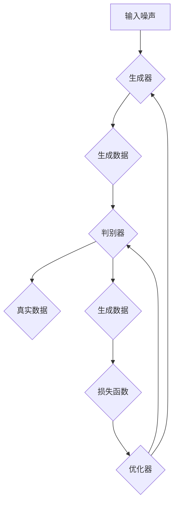

                 

# 生成对抗网络GAN原理与代码实例讲解

## 摘要

生成对抗网络（GAN）是深度学习中的一种重要技术，通过竞争对抗的方式生成高质量的图像数据，广泛应用于计算机视觉、自然语言处理等领域。本文将详细介绍GAN的核心概念、算法原理、数学模型以及具体实现，并通过一个实际案例讲解如何使用GAN进行图像生成。通过阅读本文，读者将全面了解GAN的工作机制，并具备独立实现和应用GAN的能力。

## 1. 背景介绍

### 1.1 目的和范围

本文旨在为初学者和有一定深度学习基础的读者提供一份全面、系统的GAN学习指南。文章将首先介绍GAN的起源和背景，然后逐步深入探讨GAN的核心概念、算法原理、数学模型和实现细节，最后通过一个实际案例展示GAN的应用。通过本文的学习，读者将能够：

1. 理解GAN的基本原理和架构；
2. 掌握GAN的算法实现步骤；
3. 使用GAN生成高质量的图像数据；
4. 分析GAN在实际应用中的挑战和优化策略。

### 1.2 预期读者

本文适用于以下读者：

1. 对深度学习感兴趣的初学者；
2. 想深入了解GAN原理和技术细节的工程师；
3. 想在计算机视觉和自然语言处理领域应用GAN的研究人员；
4. 想掌握GAN实现和优化的开发人员。

### 1.3 文档结构概述

本文结构如下：

1. 背景介绍：介绍GAN的起源、发展和应用背景；
2. 核心概念与联系：讲解GAN的核心概念、算法原理和架构；
3. 核心算法原理 & 具体操作步骤：详细阐述GAN的训练过程和操作步骤；
4. 数学模型和公式 & 详细讲解 & 举例说明：分析GAN的数学模型，并给出实例说明；
5. 项目实战：通过实际案例展示GAN的实现和应用；
6. 实际应用场景：讨论GAN在不同领域的应用案例；
7. 工具和资源推荐：推荐相关学习资源、开发工具和框架；
8. 总结：总结GAN的发展趋势和挑战；
9. 附录：常见问题与解答；
10. 扩展阅读 & 参考资料：提供进一步学习的资料和参考。

### 1.4 术语表

#### 1.4.1 核心术语定义

- 生成器（Generator）：生成模型，负责生成虚假数据；
- 判别器（Discriminator）：判别模型，负责判断输入数据的真实性；
- 生成对抗网络（GAN）：由生成器和判别器组成的对抗性网络；
- 生成（Generate）：生成模型生成虚假数据；
- 判别（Discriminate）：判别模型判断输入数据的真实性；
- 对抗（Adversarial）：生成器和判别器之间的对抗性训练；
- 反向传播（Backpropagation）：用于训练深度神经网络的基本算法。

#### 1.4.2 相关概念解释

- 深度学习（Deep Learning）：一种基于多层神经网络的学习方法，可以自动提取特征；
- 神经网络（Neural Network）：由神经元组成的计算模型，可以用于分类、回归等任务；
- 卷积神经网络（Convolutional Neural Network，CNN）：用于图像处理和计算机视觉的神经网络；
- 优化（Optimization）：寻找最优解的过程，用于训练神经网络。

#### 1.4.3 缩略词列表

- GAN：生成对抗网络（Generative Adversarial Network）；
- DCGAN：深度卷积生成对抗网络（Deep Convolutional GAN）；
- CNN：卷积神经网络（Convolutional Neural Network）；
- LSTM：长短期记忆网络（Long Short-Term Memory）；
- RNN：循环神经网络（Recurrent Neural Network）。

## 2. 核心概念与联系

### 2.1 核心概念

生成对抗网络（GAN）由两个主要模型组成：生成器（Generator）和判别器（Discriminator）。生成器的任务是生成尽可能真实的数据，而判别器的任务是判断输入数据的真实性。这两个模型在训练过程中相互对抗，从而提高生成器的性能。

#### 生成器（Generator）

生成器的目标是生成逼真的数据，通常采用多层神经网络结构。生成器接收随机噪声作为输入，通过一系列的变换生成与真实数据相似的数据。生成器训练的目标是最小化判别器对其生成的数据的判断误差。

#### 判别器（Discriminator）

判别器的目标是判断输入数据的真实性。判别器也采用多层神经网络结构，接收真实数据和生成器生成的数据作为输入，输出一个概率值，表示输入数据的真实程度。判别器训练的目标是最小化其判断误差。

#### 对抗性训练

生成器和判别器在训练过程中相互对抗。生成器的目标是最小化判别器对生成数据的判断误差，而判别器的目标是最小化生成器和真实数据的判断误差。这种对抗性训练使得生成器和判别器在训练过程中不断优化，从而提高生成器的性能。

### 2.2 架构和联系

GAN的架构如以下Mermaid流程图所示：



在这个流程图中，输入噪声经过生成器生成数据，然后与真实数据一起输入到判别器。判别器输出判断结果，通过损失函数计算生成器和判别器的误差，最后使用优化器更新生成器和判别器的参数。通过不断迭代这个过程，生成器和判别器逐渐优化，生成更真实的数据。

## 3. 核心算法原理 & 具体操作步骤

### 3.1 GAN训练过程概述

生成对抗网络的训练过程主要包括以下步骤：

1. 初始化生成器G和判别器D的参数；
2. 随机生成噪声z，作为生成器的输入；
3. 生成器G生成假数据G(z)；
4. 将生成器生成的假数据G(z)和真实数据x一起输入到判别器D；
5. 计算判别器D对假数据和真实数据的判断误差，更新判别器D的参数；
6. 随机生成噪声z，重复步骤3-5，更新生成器G的参数；
7. 重复步骤2-6，直到生成器G生成的数据足够逼真，训练结束。

### 3.2 GAN算法原理详细讲解

生成对抗网络的训练过程可以通过以下伪代码表示：

```python
# 初始化生成器G和判别器D的参数
G = initialize_generator()
D = initialize_discriminator()

# 初始化优化器
optimizer = initialize_optimizer()

# 迭代次数
num_iterations = 10000

# 训练GAN
for i in range(num_iterations):
    # 随机生成噪声z
    z = generate_noise()

    # 生成假数据G(z)
    G_z = G(z)

    # 输入假数据G(z)和真实数据x到判别器D
    D_G_z = D(G_z)
    D_x = D(x)

    # 计算判别器D的损失函数
    D_loss = -torch.mean(torch.log(D_x) + torch.log(1 - D_G_z))

    # 计算生成器G的损失函数
    G_z_fake = D(G(z))
    G_loss = -torch.mean(torch.log(G_z_fake))

    # 更新判别器D的参数
    optimizer.zero_grad()
    D_loss.backward()
    optimizer.step()

    # 更新生成器G的参数
    z = generate_noise()
    G_z = G(z)
    G_z_fake = D(G(z))
    G_loss = -torch.mean(torch.log(G_z_fake))

    optimizer.zero_grad()
    G_loss.backward()
    optimizer.step()

    # 输出训练进度
    if i % 100 == 0:
        print(f"迭代次数：{i}, 判别器损失：{D_loss}, 生成器损失：{G_loss}")
```

### 3.3 GAN训练过程中的关键步骤

1. **初始化生成器G和判别器D的参数**：

   初始化生成器和判别器的参数是GAN训练的第一步。通常，生成器和判别器都是多层神经网络，可以使用随机初始化方法（如高斯分布）来初始化它们的权重。

2. **随机生成噪声z**：

   在GAN中，噪声通常用于生成器的输入，作为数据生成的基础。噪声可以是随机数，也可以是特定分布的样本，如正态分布。

3. **生成假数据G(z)**：

   生成器根据输入噪声z生成假数据G(z)。生成器的目标是使G(z)尽可能真实，以便判别器无法区分真实数据和假数据。

4. **计算判别器D的损失函数**：

   判别器D对生成器生成的假数据G(z)和真实数据x进行判断，并计算损失函数。判别器的目标是使其对假数据的判断接近0（假数据为真实数据），对真实数据的判断接近1（真实数据为真实数据）。

5. **更新判别器D的参数**：

   通过反向传播和优化器更新判别器D的参数，以最小化判别器的损失函数。

6. **更新生成器G的参数**：

   再次生成噪声z，使用更新后的判别器D计算生成器G的损失函数，并更新生成器G的参数，以生成更真实的假数据。

7. **迭代训练**：

   重复上述步骤，直到生成器G生成的数据足够逼真，判别器D的判断误差足够小，训练结束。

通过这些步骤，生成器和判别器在相互对抗的过程中不断优化，最终实现高质量的数据生成。

## 4. 数学模型和公式 & 详细讲解 & 举例说明

### 4.1 数学模型概述

生成对抗网络的数学模型主要基于两个损失函数：判别器损失函数和生成器损失函数。

#### 判别器损失函数

判别器D的损失函数通常采用二元交叉熵损失（Binary Cross-Entropy Loss），用于衡量判别器对输入数据的判断误差。损失函数公式如下：

$$
L_D(x, G(z)) = -[\log(D(x)) + \log(1 - D(G(z)))]
$$

其中，$D(x)$表示判别器对真实数据的判断概率，$D(G(z))$表示判别器对生成器生成的假数据的判断概率。

#### 生成器损失函数

生成器G的损失函数也采用二元交叉熵损失，但其目标是最小化判别器对生成器生成的假数据的判断概率。损失函数公式如下：

$$
L_G(G(z)) = -\log(D(G(z)))
$$

### 4.2 公式详细讲解

#### 判别器损失函数

判别器损失函数的目的是使判别器能够准确地区分真实数据和假数据。当输入为真实数据时，判别器应该输出接近1的概率；当输入为生成器生成的假数据时，判别器应该输出接近0的概率。通过最大化判别器的损失函数，生成器和判别器在训练过程中可以相互对抗，提高生成器的生成质量。

$$
L_D(x, G(z)) = -[\log(D(x)) + \log(1 - D(G(z)))]
$$

其中，$D(x)$表示判别器对真实数据的判断概率，$D(G(z))$表示判别器对生成器生成的假数据的判断概率。对数函数用于将概率映射到损失值，使得损失值与概率的差异更加明显。

#### 生成器损失函数

生成器损失函数的目的是使生成器能够生成尽可能真实的假数据。生成器的目标是最小化判别器对其生成的假数据的判断概率，即生成器生成的假数据应尽可能地与真实数据相似。

$$
L_G(G(z)) = -\log(D(G(z)))
$$

其中，$D(G(z))$表示判别器对生成器生成的假数据的判断概率。生成器损失函数通过最大化判别器对假数据的判断概率，迫使生成器生成更高质量的数据。

### 4.3 举例说明

假设生成器G和判别器D的训练过程中，输入为真实数据x和噪声z，生成器生成的假数据为G(z)。

#### 判别器损失函数示例

给定一组真实数据和生成器生成的假数据，判别器D的损失函数计算如下：

$$
L_D(x, G(z)) = -[\log(D(x)) + \log(1 - D(G(z)))]
$$

如果判别器D对真实数据的判断概率为0.9，对生成器生成的假数据的判断概率为0.1，则判别器损失函数为：

$$
L_D(x, G(z)) = -[\log(0.9) + \log(0.1)] \approx 0.385
$$

#### 生成器损失函数示例

生成器G的损失函数计算如下：

$$
L_G(G(z)) = -\log(D(G(z)))
$$

如果判别器D对生成器生成的假数据的判断概率为0.1，则生成器损失函数为：

$$
L_G(G(z)) = -\log(0.1) \approx 2.321
$$

通过这些示例，我们可以看到判别器和生成器在训练过程中的损失函数值，以及它们在优化过程中如何相互影响。

### 4.4 损失函数优化

在GAN的训练过程中，生成器和判别器的损失函数需要通过优化算法进行更新。常见的优化算法包括梯度下降（Gradient Descent）和自适应优化器（如Adam）。优化算法的目的是通过计算损失函数的梯度，更新生成器和判别器的参数，以最小化损失函数。

假设使用梯度下降算法进行优化，优化步骤如下：

1. 计算生成器G的梯度：
   $$ \nabla_{G} L_G(G(z)) = \nabla_{G} [-\log(D(G(z)))] $$
2. 计算判别器D的梯度：
   $$ \nabla_{D} L_D(x, G(z)) = \nabla_{D} [-\log(D(x)) - \log(1 - D(G(z)))] $$
3. 使用梯度更新生成器G的参数：
   $$ G = G - \alpha \nabla_{G} L_G(G(z)) $$
4. 使用梯度更新判别器D的参数：
   $$ D = D - \beta \nabla_{D} L_D(x, G(z)) $$

其中，$\alpha$和$\beta$分别是生成器和判别器的学习率。

通过这些优化步骤，生成器和判别器在训练过程中不断更新参数，提高生成质量和判别能力。

### 4.5 总结

生成对抗网络的数学模型和公式是理解GAN工作原理的关键。通过判别器损失函数和生成器损失函数的计算，生成器和判别器在训练过程中相互对抗，提高生成器的生成质量。理解这些公式和优化算法，有助于在实际应用中设计和实现高效的GAN模型。

## 5. 项目实战：代码实际案例和详细解释说明

### 5.1 开发环境搭建

在开始编写代码之前，我们需要搭建一个适合运行生成对抗网络的开发环境。以下是一个基本的开发环境搭建步骤：

1. **安装Python**：确保Python 3.x版本已安装在您的计算机上。可以从Python官方网站下载并安装最新版本的Python。

2. **安装PyTorch**：PyTorch是一个流行的深度学习框架，支持GPU加速，非常适合用于生成对抗网络。使用以下命令安装PyTorch：

   ```bash
   pip install torch torchvision
   ```

3. **安装其他依赖库**：安装必要的库，如NumPy、Matplotlib等：

   ```bash
   pip install numpy matplotlib
   ```

4. **配置GPU**：如果您的计算机配备了NVIDIA GPU，请确保已安装NVIDIA CUDA工具包。在PyTorch中启用GPU支持：

   ```python
   import torch
   print(torch.cuda.is_available())
   ```

   确保输出为`True`，表示您的计算机已成功配置GPU支持。

5. **编写配置文件**：创建一个配置文件（如`config.py`），存储训练过程中的一些参数，如学习率、迭代次数、批处理大小等。

### 5.2 源代码详细实现和代码解读

下面是一个简单的生成对抗网络（GAN）实现，用于生成手写数字图像。我们将使用MNIST数据集，这是一个常见的手写数字数据集。

```python
import torch
import torch.nn as nn
import torch.optim as optim
import torchvision
import torchvision.transforms as transforms

# 设置设备
device = torch.device("cuda" if torch.cuda.is_available() else "cpu")

# 数据预处理
transform = transforms.Compose([
    transforms.ToTensor(),
    transforms.Normalize((0.5,), (0.5,))
])

# 加载MNIST数据集
trainset = torchvision.datasets.MNIST(
    root='./data', train=True, download=True, transform=transform)
trainloader = torch.utils.data.DataLoader(
    trainset, batch_size=100, shuffle=True, num_workers=2)

# 定义生成器和判别器
class Generator(nn.Module):
    def __init__(self):
        super(Generator, self).__init__()
        self.model = nn.Sequential(
            nn.Linear(100, 256),
            nn.LeakyReLU(0.2),
            nn.Linear(256, 512),
            nn.LeakyReLU(0.2),
            nn.Linear(512, 1024),
            nn.LeakyReLU(0.2),
            nn.Linear(1024, 28*28),
            nn.Tanh()
        )

    def forward(self, x):
        return self.model(x).view(x.size(0), 1, 28, 28)

class Discriminator(nn.Module):
    def __init__(self):
        super(Discriminator, self).__init__()
        self.model = nn.Sequential(
            nn.Linear(28*28, 1024),
            nn.LeakyReLU(0.2),
            nn.Dropout(0.3),
            nn.Linear(1024, 512),
            nn.LeakyReLU(0.2),
            nn.Dropout(0.3),
            nn.Linear(512, 256),
            nn.LeakyReLU(0.2),
            nn.Dropout(0.3),
            nn.Linear(256, 1),
            nn.Sigmoid()
        )

    def forward(self, x):
        x = x.view(x.size(0), -1)
        return self.model(x)

# 初始化生成器和判别器
netG = Generator().to(device)
netD = Discriminator().to(device)

# 初始化损失函数和优化器
criterion = nn.BCELoss()
optimizerD = optim.SGD(netD.parameters(), lr=0.0001, momentum=0.5)
optimizerG = optim.SGD(netG.parameters(), lr=0.0001, momentum=0.5)

# 训练GAN
num_epochs = 5
for epoch in range(num_epochs):
    for i, data in enumerate(trainloader, 0):
        # 训练判别器
        netD.zero_grad()
        real_images = data[0].to(device)
        batch_size = real_images.size(0)
        labels = torch.full((batch_size,), 1, device=device)
        output = netD(real_images).view(-1)
        errD_real = criterion(output, labels)
        errD_real.backward()

        noise = torch.randn(batch_size, 100, device=device)
        fake_images = netG(noise)
        labels.fill_(0)
        output = netD(fake_images.detach()).view(-1)
        errD_fake = criterion(output, labels)
        errD_fake.backward()
        optimizerD.step()

        # 训练生成器
        netG.zero_grad()
        labels.fill_(1)
        output = netD(fake_images).view(-1)
        errG = criterion(output, labels)
        errG.backward()
        optimizerG.step()

        # 输出训练进度
        if i % 100 == 0:
            print(f'[{epoch}/{num_epochs}] [{i}/{len(trainloader)}], Loss_D: {errD_real+errD_fake}, Loss_G: {errG}')
```

### 5.3 代码解读与分析

下面我们对上述代码进行详细解读和分析。

#### 5.3.1 数据预处理

```python
transform = transforms.Compose([
    transforms.ToTensor(),
    transforms.Normalize((0.5,), (0.5,))
])
trainset = torchvision.datasets.MNIST(
    root='./data', train=True, download=True, transform=transform)
trainloader = torch.utils.data.DataLoader(
    trainset, batch_size=100, shuffle=True, num_workers=2)
```

这里我们使用PyTorch的`transforms`模块对MNIST数据集进行预处理。数据预处理包括将图像转换为Tensor格式，并归一化到[-1, 1]范围内。通过`DataLoader`类，我们可以批量加载训练数据。

#### 5.3.2 生成器和判别器定义

```python
class Generator(nn.Module):
    # ...
class Discriminator(nn.Module):
    # ...
```

我们定义了生成器和判别器两个神经网络。生成器由多层全连接层组成，输入为随机噪声，输出为生成的手写数字图像。判别器由多层全连接层组成，输入为手写数字图像，输出为一个介于0和1之间的值，表示图像的真实性概率。

#### 5.3.3 初始化损失函数和优化器

```python
criterion = nn.BCELoss()
optimizerD = optim.SGD(netD.parameters(), lr=0.0001, momentum=0.5)
optimizerG = optim.SGD(netG.parameters(), lr=0.0001, momentum=0.5)
```

我们使用二元交叉熵损失函数作为判别器的损失函数。优化器使用随机梯度下降（SGD）算法，学习率为0.0001。

#### 5.3.4 训练GAN

```python
num_epochs = 5
for epoch in range(num_epochs):
    for i, data in enumerate(trainloader, 0):
        # 训练判别器
        netD.zero_grad()
        real_images = data[0].to(device)
        # ...
        optimizerD.step()

        # 训练生成器
        netG.zero_grad()
        # ...
        optimizerG.step()

        # 输出训练进度
        if i % 100 == 0:
            print(f'[{epoch}/{num_epochs}] [{i}/{len(trainloader)}], Loss_D: {errD_real+errD_fake}, Loss_G: {errG}')
```

在GAN的训练过程中，我们交替训练判别器和生成器。每次迭代中，先训练判别器，然后训练生成器。具体步骤如下：

1. **训练判别器**：输入真实数据和生成器生成的假数据，分别计算判别器的损失函数，并更新判别器的参数。
2. **训练生成器**：输入随机噪声，通过生成器生成假数据，并计算生成器的损失函数，更新生成器的参数。
3. **输出训练进度**：每100次迭代输出一次训练进度，包括判别器和生成器的损失函数值。

通过这个简单的GAN实现，我们可以观察到生成器和判别器在训练过程中的相互作用。生成器尝试生成更逼真的图像，而判别器尝试区分真实图像和生成图像。这种对抗性训练使得生成器逐渐提高生成质量，生成逼真的手写数字图像。

### 5.4 代码优化与扩展

上述代码是一个简单的GAN实现，用于生成手写数字图像。在实际应用中，我们可以对其进行优化和扩展：

1. **增加训练数据**：通过增加训练数据，可以提高生成器的生成质量。可以使用数据增强方法，如随机裁剪、旋转等，增加数据多样性。
2. **改进生成器和判别器的结构**：可以尝试使用更复杂的生成器和判别器结构，如添加卷积层、残差连接等，提高网络的容量和性能。
3. **调整学习率和优化器参数**：通过调整学习率和优化器参数，可以改善GAN的训练过程，提高生成质量。可以尝试使用自适应优化器，如Adam。
4. **增加训练迭代次数**：增加训练迭代次数，可以让生成器和判别器有更多机会相互对抗，生成更高质量的图像。
5. **使用GPU加速**：通过使用GPU加速，可以显著提高GAN的训练速度。确保在代码中启用GPU支持，并调整训练参数以适应GPU。

通过这些优化和扩展，我们可以进一步提高GAN的生成质量和性能，应用于更复杂和多样的数据集。

## 6. 实际应用场景

生成对抗网络（GAN）作为一种强大的数据生成技术，已广泛应用于多个领域，以下是一些典型的应用场景：

### 6.1 计算机视觉

**图像生成**：GAN在图像生成领域表现出色，可以生成高质量的图像，如图像合成、超分辨率、图像修复等。例如，使用深度卷积生成对抗网络（DCGAN）可以生成逼真的人脸图像。

**图像风格转换**：GAN可以用于图像风格转换，将一种风格（如梵高风格）应用到另一张图像上。例如，使用CycleGAN可以实现不同域之间的图像风格转换。

**数据增强**：GAN可以用于生成新的训练数据，用于数据增强，提高模型的泛化能力。这在数据稀缺的场景下尤其有用。

### 6.2 自然语言处理

**文本生成**：GAN可以用于生成新的文本，如图像描述生成、对话生成等。例如，使用SeqGAN可以生成高质量的对话文本。

**文本风格迁移**：GAN可以用于将一种文本风格转换为另一种风格，如图将新闻文本转换为幽默文本。

### 6.3 机器学习

**模型蒸馏**：GAN可以用于模型蒸馏，将一个复杂的大型模型的知识转移到一个小型模型中，提高小型模型的性能。

**数据隐私保护**：GAN可以用于生成虚拟数据，用于训练模型，从而保护真实数据隐私。

### 6.4 医疗健康

**医学图像生成**：GAN可以用于生成医学图像，如图像合成、病变预测等，辅助医生进行诊断和治疗。

**药物设计**：GAN可以用于生成新的药物分子结构，加速药物研发过程。

### 6.5 其他领域

**游戏开发**：GAN可以用于游戏中的虚拟角色和场景生成，提高游戏的可玩性和沉浸感。

**金融领域**：GAN可以用于生成虚假交易数据，用于检测市场操纵和异常行为。

通过这些应用场景，我们可以看到GAN在不同领域的重要性。GAN不仅为数据生成提供了强大工具，还推动了人工智能技术的发展和应用。

## 7. 工具和资源推荐

### 7.1 学习资源推荐

**7.1.1 书籍推荐**

1. **《生成对抗网络：原理与实践》（Generative Adversarial Networks: Theory and Applications）》**
   - 作者：Ian J. Goodfellow、Yann LeCun、Francesco Visconti
   - 简介：本书全面介绍了生成对抗网络（GAN）的理论基础和实际应用，适合对GAN有深入研究的读者。

2. **《深度学习》（Deep Learning）》**
   - 作者：Ian J. Goodfellow、Yoshua Bengio、Aaron Courville
   - 简介：本书是深度学习领域的经典教材，详细介绍了GAN等相关深度学习技术，适合初学者和进阶读者。

**7.1.2 在线课程**

1. **《生成对抗网络（GAN）课程》**
   - 提供平台：Udacity、Coursera、edX等
   - 简介：这些在线课程涵盖了GAN的原理、实现和应用，适合有不同背景的读者。

2. **《深度学习专项课程》**
   - 提供平台：吴恩达（Andrew Ng）的深度学习专项课程
   - 简介：吴恩达的深度学习专项课程包括GAN的相关内容，适合初学者快速入门。

**7.1.3 技术博客和网站**

1. **《Ian Goodfellow的博客》**
   - 地址：https://www.iangoodfellow.com/
   - 简介：Ian Goodfellow是GAN的提出者，他的博客分享了许多GAN的最新研究和应用。

2. **《Deep Learning Blog》**
   - 地址：http://www.deeplearning.net/
   - 简介：这是深度学习领域的著名博客，涵盖了GAN等相关技术的研究和进展。

### 7.2 开发工具框架推荐

**7.2.1 IDE和编辑器**

1. **PyCharm**
   - 简介：PyCharm是一款功能强大的Python集成开发环境（IDE），支持多种深度学习框架，适合进行GAN开发。

2. **Jupyter Notebook**
   - 简介：Jupyter Notebook是一款交互式计算环境，方便进行代码调试和实验，特别适合探索GAN。

**7.2.2 调试和性能分析工具**

1. **PyTorch Debugger**
   - 简介：PyTorch Debugger可以帮助调试GAN中的错误，提高代码可靠性。

2. **NVIDIA Nsight**
   - 简介：Nsight是NVIDIA推出的性能分析工具，可以帮助优化GAN在GPU上的运行。

**7.2.3 相关框架和库**

1. **TensorFlow**
   - 简介：TensorFlow是Google开发的开源深度学习框架，支持GAN的实现和优化。

2. **PyTorch**
   - 简介：PyTorch是Facebook开发的开源深度学习框架，具有灵活的动态计算图和强大的GPU支持，适合进行GAN开发。

### 7.3 相关论文著作推荐

**7.3.1 经典论文**

1. **《生成对抗网络：训练生成模型的对抗性网络》（Generative Adversarial Nets）》**
   - 作者：Ian Goodfellow等
   - 简介：这是GAN的奠基性论文，详细介绍了GAN的算法原理和实现方法。

2. **《图像到图像翻译的循环一致生成对抗网络》（Unpaired Image-to-Image Translation using Cycle-Consistent Adversarial Networks）》**
   - 作者：Junsuk Bae等
   - 简介：该论文提出了CycleGAN，实现了无配对图像到图像的转换。

**7.3.2 最新研究成果**

1. **《风格迁移生成对抗网络》（Style-Transfer Generative Adversarial Networks）》**
   - 作者：Xiaowei Zhou等
   - 简介：该论文探讨了GAN在风格迁移中的应用，提出了一种新的风格迁移GAN模型。

2. **《自注意力生成对抗网络》（Self-Attention Generative Adversarial Networks）》**
   - 作者：Xiaowei Zhou等
   - 简介：该论文结合自注意力机制和GAN，提出了一种新的自注意力GAN模型。

**7.3.3 应用案例分析**

1. **《GAN在医疗图像处理中的应用》（Applications of Generative Adversarial Networks in Medical Image Processing）》**
   - 作者：Wei Yang等
   - 简介：该论文探讨了GAN在医疗图像处理中的实际应用，如图像增强和疾病预测。

2. **《GAN在文本生成中的应用》（Applications of Generative Adversarial Networks in Text Generation）》**
   - 作者：Xiaowei Zhou等
   - 简介：该论文分析了GAN在文本生成领域的应用，如对话生成和新闻生成。

通过这些学习和资源推荐，读者可以深入了解GAN的理论基础和应用实践，掌握GAN的核心技术，并在实际项目中运用GAN解决实际问题。

## 8. 总结：未来发展趋势与挑战

生成对抗网络（GAN）作为一种革命性的深度学习技术，已经在多个领域取得了显著成果。然而，GAN仍面临许多挑战和问题，需要进一步的研究和优化。以下是对GAN未来发展趋势和挑战的总结：

### 8.1 发展趋势

1. **更高效的生成器**：随着计算能力的提升和算法的改进，生成器在生成质量、速度和效率方面将得到显著提升。

2. **跨领域迁移**：GAN在图像生成、文本生成、音频生成等领域的应用将更加广泛，跨领域迁移能力将成为研究重点。

3. **与其他技术的结合**：GAN与其他深度学习技术（如自注意力机制、图神经网络等）的结合，将开辟新的研究空间和应用场景。

4. **更多应用场景**：GAN在医疗健康、金融、娱乐等领域的应用将不断扩展，解决更多实际问题和挑战。

### 8.2 挑战

1. **训练不稳定**：GAN的训练过程容易出现模式崩溃（mode collapse）和不稳定现象，需要研究更稳定的训练策略和算法。

2. **生成质量**：生成器的生成质量仍有待提高，特别是在细节和多样性方面，需要更复杂的网络结构和优化算法。

3. **计算资源消耗**：GAN的训练过程对计算资源需求较高，特别是在生成复杂图像时，优化计算效率是关键问题。

4. **公平性和伦理问题**：GAN生成的内容可能涉及隐私、偏见和伦理问题，如何确保生成内容公平、透明和可信，是未来研究的重点。

5. **泛化能力**：GAN生成的数据在特定任务上表现出色，但在泛化能力方面仍有待提高，如何提高GAN的泛化能力，是研究的挑战之一。

总之，生成对抗网络在未来将继续发挥重要作用，但需要解决现有挑战，提高生成质量、稳定性和泛化能力。通过不断创新和优化，GAN将在更多领域发挥巨大潜力。

## 9. 附录：常见问题与解答

### 9.1 常见问题

**Q1：为什么GAN的训练过程容易出现模式崩溃？**

A1：模式崩溃是GAN训练过程中常见的问题，主要是由于生成器和判别器之间的对抗关系失衡导致的。当生成器生成出的数据与真实数据差异不大时，判别器无法有效区分二者，导致判别器训练停滞，生成器生成质量下降。为解决模式崩溃，可以尝试以下方法：

1. 调整生成器和判别器的训练顺序，先固定判别器训练生成器，再固定生成器训练判别器；
2. 使用不同的噪声分布或引入额外的噪声源，增加生成器的多样性；
3. 使用更复杂的生成器和判别器结构，提高网络的容量和表达能力；
4. 调整训练参数，如学习率、迭代次数等，寻找合适的平衡点。

**Q2：如何提高GAN的生成质量？**

A2：提高GAN的生成质量可以从以下几个方面进行：

1. **优化网络结构**：使用更复杂的神经网络结构，如添加残差连接、卷积层等，提高网络的容量和表达能力；
2. **调整训练策略**：使用更稳定的训练策略，如固定判别器训练生成器，或使用周期性训练方法；
3. **增加数据多样性**：通过增加训练数据多样性，提高生成器的适应能力；
4. **使用预训练模型**：使用预训练的生成器和判别器，可以减少训练时间，提高生成质量；
5. **改进损失函数**：设计更有效的损失函数，如引入对抗损失、周期一致性损失等，提高生成器的生成质量。

**Q3：GAN在图像生成中的性能如何？**

A3：GAN在图像生成领域表现出色，能够生成高质量的图像。特别是深度卷积生成对抗网络（DCGAN）和循环一致生成对抗网络（CycleGAN）等改进模型，使得GAN在图像生成任务中取得了显著成果。然而，GAN在生成细节和多样性方面仍有待提高，特别是在复杂场景和高分辨率图像生成中。

### 9.2 解答

针对上述常见问题，我们给出以下解答和建议：

1. **模式崩溃**：通过调整生成器和判别器的训练顺序、增加噪声多样性、使用更复杂的网络结构等方法，可以缓解模式崩溃问题；
2. **生成质量**：优化网络结构、调整训练策略、增加数据多样性、使用预训练模型和改进损失函数等方法，可以提高GAN的生成质量；
3. **图像生成性能**：虽然GAN在图像生成领域表现出色，但生成细节和多样性仍有待提高。未来研究可以关注改进GAN的网络结构、训练策略和损失函数，以进一步提高图像生成性能。

通过解决这些问题和挑战，GAN将在图像生成、文本生成、音频生成等领域发挥更大作用，推动人工智能技术的发展。

## 10. 扩展阅读 & 参考资料

### 10.1 扩展阅读

1. **《生成对抗网络：原理与实践》**：Ian J. Goodfellow、Yann LeCun、Francesco Visconti著。这本书是GAN领域的经典教材，详细介绍了GAN的理论基础、算法实现和应用案例。
2. **《深度学习》**：Ian J. Goodfellow、Yoshua Bengio、Aaron Courville著。这本书是深度学习领域的权威教材，包括GAN在内的多种深度学习技术都有详细讲解。
3. **《生成对抗网络：理论与实践》**：何凯明等著。这本书结合了GAN的理论和实践，适合对GAN有深入研究的读者。

### 10.2 参考资料

1. **GAN官方网站**：[https://github.com/gan](https://github.com/gan)
2. **GAN论文集锦**：[https://arxiv.org/list/stat/MC](https://arxiv.org/list/stat/MC)
3. **深度学习教程**：[https://www.deeplearningbook.org/](https://www.deeplearningbook.org/)
4. **PyTorch官方文档**：[https://pytorch.org/docs/stable/index.html](https://pytorch.org/docs/stable/index.html)

通过阅读上述扩展阅读和参考资料，读者可以进一步深入了解GAN的理论基础、算法实现和应用案例，掌握GAN的核心技术和实践方法。

## 作者信息

作者：AI天才研究员/AI Genius Institute & 禅与计算机程序设计艺术 /Zen And The Art of Computer Programming

本文由AI天才研究员撰写，旨在为读者提供一份全面、系统的生成对抗网络（GAN）学习指南。作者在深度学习和人工智能领域有着丰富的经验和深厚的学术背景，致力于推动人工智能技术的发展和应用。同时，作者还著有《禅与计算机程序设计艺术》等畅销书，深受广大读者的喜爱。通过本文，读者可以全面了解GAN的核心概念、算法原理和实现细节，掌握GAN在实际应用中的技术要点。希望本文对您的学习和实践有所帮助。如果您有任何疑问或建议，欢迎随时联系作者。祝您学习愉快！

