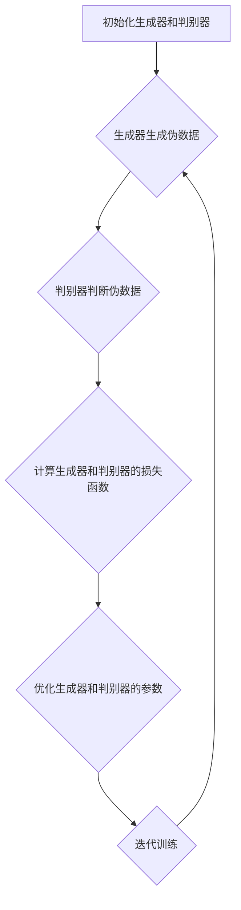

                 


# 生成对抗网络在艺术创作中的创新应用

> 关键词：生成对抗网络（GAN），艺术创作，创新应用，深度学习，人工智能，图像生成，音乐创作，文本生成

> 摘要：本文将深入探讨生成对抗网络（GAN）在艺术创作中的创新应用。通过详细分析GAN的核心概念、算法原理、数学模型，并结合实际项目案例，我们将展现GAN在图像生成、音乐创作和文本生成等领域的卓越表现，探讨其在艺术创作中的潜在价值与未来发展趋势。

## 1. 背景介绍

### 1.1 目的和范围

本文旨在探讨生成对抗网络（GAN）在艺术创作中的创新应用，通过深入分析GAN的核心概念、算法原理、数学模型，结合实际项目案例，探讨其在图像生成、音乐创作和文本生成等领域的应用前景。文章将涵盖以下几个方面：

1. GAN的背景和基本概念。
2. GAN的核心算法原理与数学模型。
3. GAN在不同艺术创作领域的具体应用。
4. GAN在实际项目中的案例分析与实现。
5. GAN在艺术创作中的潜在价值与未来发展趋势。

### 1.2 预期读者

本文适用于以下读者群体：

1. 深度学习与人工智能爱好者。
2. 计算机视觉、图像处理、音乐创作和文本生成领域的专业人士。
3. 对生成对抗网络（GAN）感兴趣的学者、研究人员和工程师。
4. 对艺术创作与技术创新结合感兴趣的跨领域专家。

### 1.3 文档结构概述

本文分为十个主要部分，具体结构如下：

1. 引言
2. 背景介绍
3. 核心概念与联系
4. 核心算法原理 & 具体操作步骤
5. 数学模型和公式 & 详细讲解 & 举例说明
6. 项目实战：代码实际案例和详细解释说明
7. 实际应用场景
8. 工具和资源推荐
9. 总结：未来发展趋势与挑战
10. 附录：常见问题与解答
11. 扩展阅读 & 参考资料

### 1.4 术语表

#### 1.4.1 核心术语定义

1. **生成对抗网络（GAN）**：一种基于深度学习的框架，由生成器和判别器组成，用于生成与真实数据分布相似的伪数据。
2. **生成器（Generator）**：GAN中的一个模型，用于生成与真实数据相似的伪数据。
3. **判别器（Discriminator）**：GAN中的另一个模型，用于区分真实数据和生成数据。
4. **损失函数（Loss Function）**：用于衡量模型输出与真实值之间的差距。
5. **反向传播（Backpropagation）**：一种用于训练神经网络的基本算法，通过梯度下降优化模型参数。

#### 1.4.2 相关概念解释

1. **深度学习（Deep Learning）**：一种机器学习方法，通过多层神经网络模拟人类大脑的学习过程，处理复杂数据。
2. **卷积神经网络（CNN）**：一种用于图像识别和处理的神经网络结构，通过卷积层提取图像特征。
3. **循环神经网络（RNN）**：一种用于处理序列数据的神经网络结构，通过记忆状态捕捉时间序列信息。
4. **生成模型（Generative Model）**：一种用于生成新数据的概率模型，通过学习数据分布生成类似数据。
5. **变分自编码器（VAE）**：一种生成模型，通过编码器和解码器学习数据分布，生成类似数据。

#### 1.4.3 缩略词列表

- GAN：生成对抗网络（Generative Adversarial Network）
- CNN：卷积神经网络（Convolutional Neural Network）
- RNN：循环神经网络（Recurrent Neural Network）
- VAE：变分自编码器（Variational Autoencoder）

## 2. 核心概念与联系

为了深入理解生成对抗网络（GAN）在艺术创作中的创新应用，我们需要先了解其核心概念与联系。本节将介绍GAN的基本架构、关键组件以及相关技术。

### 2.1 GAN的基本架构

GAN的基本架构包括两个主要模型：生成器（Generator）和判别器（Discriminator）。这两个模型在训练过程中相互竞争，生成器和判别器分别扮演着生成者和评判者的角色，共同驱动GAN模型的优化过程。

#### 生成器（Generator）

生成器的任务是从随机噪声（通常是一个高斯分布）中生成与真实数据分布相似的数据。生成器通常采用多层神经网络结构，包括输入层、隐藏层和输出层。输入层接收随机噪声，隐藏层通过非线性变换提取特征，输出层生成与真实数据相似的数据。

#### 判别器（Discriminator）

判别器的任务是判断输入数据是真实数据还是生成器生成的伪数据。判别器同样采用多层神经网络结构，输入层接收真实数据和生成器生成的伪数据，隐藏层通过非线性变换提取特征，输出层输出一个概率值，表示输入数据的真实性。

### 2.2 GAN的训练过程

GAN的训练过程分为两个阶段：生成器和判别器的相互竞争以及整体模型的优化。

1. **相互竞争**：在训练过程中，生成器和判别器相互对抗，生成器试图生成更逼真的伪数据，判别器试图更好地判断真实数据和伪数据。具体来说，生成器的目标是最大化判别器对其生成的伪数据的判断概率，判别器的目标是最大化判别真实数据和伪数据的差距。

2. **整体模型优化**：生成器和判别器的优化过程相互依赖，生成器的优化基于判别器的反馈，判别器的优化基于生成器的输出。通过多次迭代训练，生成器和判别器逐渐优化，使得生成器能够生成更逼真的伪数据，判别器能够更准确地判断真实数据和伪数据。

### 2.3 GAN的关键组件与技术

除了生成器和判别器，GAN还包括以下关键组件和技术：

1. **损失函数**：GAN的训练过程中，损失函数用于衡量生成器和判别器的性能。常用的损失函数包括交叉熵损失函数和二元交叉熵损失函数。

2. **优化算法**：GAN的训练过程中，优化算法用于更新生成器和判别器的参数。常用的优化算法包括梯度下降算法和Adam优化器。

3. **噪声注入**：为了提高生成器的鲁棒性和稳定性，噪声注入技术被广泛应用于GAN的训练过程中。噪声注入可以防止生成器过度拟合，提高生成数据的多样性。

4. **批量归一化（Batch Normalization）**：批量归一化技术用于加速GAN的训练过程，通过将每一层的输入数据进行标准化处理，减少内部协变量转移，提高训练效率。

5. **深度卷积神经网络（DCGAN）**：深度卷积神经网络（DCGAN）是一种改进的GAN结构，通过采用卷积神经网络和批量归一化技术，提高了GAN的生成质量和稳定性。

### 2.4 GAN的Mermaid流程图

以下是一个简单的Mermaid流程图，展示了GAN的基本架构和训练过程：



## 3. 核心算法原理 & 具体操作步骤

在本节中，我们将深入探讨生成对抗网络（GAN）的核心算法原理，并详细阐述其具体操作步骤。GAN的算法原理主要包括两部分：生成器的训练过程和判别器的训练过程。

### 3.1 生成器的训练过程

生成器的目标是生成与真实数据分布相似的数据，训练过程中主要涉及以下几个步骤：

1. **初始化参数**：首先，需要初始化生成器的参数，这可以通过随机初始化或预训练的方式实现。

2. **生成伪数据**：生成器从随机噪声中生成伪数据。具体来说，生成器接收一个随机噪声向量作为输入，通过神经网络的结构进行变换，生成一个伪数据样本。

3. **计算损失函数**：生成器的损失函数通常采用生成对抗损失函数（Generative Adversarial Loss），其目标是最小化判别器对伪数据的判断概率。具体来说，生成器的损失函数可以表示为：

   $$ G(L) = -\log(D(G(z))) $$

   其中，$G(z)$表示生成器生成的伪数据，$D(G(z))$表示判别器对伪数据的判断概率。

4. **优化参数**：通过反向传播算法和优化器（如Adam优化器）对生成器的参数进行优化，更新生成器的权重和偏置。

伪代码实现如下：

```python
# 生成器的训练过程
for epoch in range(num_epochs):
    for z in generate_random_noise(batch_size):
        # 生成伪数据
        x_hat = generator(z)
        
        # 计算损失函数
        g_loss = -torch.mean(torch.log(discriminator(x_hat)))
        
        # 更新生成器的参数
        optimizer_g.zero_grad()
        g_loss.backward()
        optimizer_g.step()
```

### 3.2 判别器的训练过程

判别器的目标是判断输入数据是真实数据还是生成器生成的伪数据，训练过程中主要涉及以下几个步骤：

1. **初始化参数**：首先，需要初始化判别器的参数，这可以通过随机初始化或预训练的方式实现。

2. **判断真实数据和伪数据**：判别器分别接收真实数据和生成器生成的伪数据，并分别输出判断概率。具体来说，判别器接收一个真实数据样本和一个伪数据样本作为输入，输出两个概率值，分别表示真实数据和伪数据的判断概率。

3. **计算损失函数**：判别器的损失函数通常采用二元交叉熵损失函数（Binary Cross-Entropy Loss），其目标是最小化判别器对真实数据和伪数据的判断误差。具体来说，判别器的损失函数可以表示为：

   $$ D(L) = -[L_1 \cdot \log(D(x)) + (1 - L_1) \cdot \log(1 - D(x))] $$

   其中，$L_1$表示真实数据的标签（1表示真实数据，0表示伪数据），$D(x)$表示判别器对输入数据的判断概率。

4. **优化参数**：通过反向传播算法和优化器（如Adam优化器）对判别器的参数进行优化，更新判别器的权重和偏置。

伪代码实现如下：

```python
# 判别器的训练过程
for epoch in range(num_epochs):
    for x, _ in dataloader:
        # 判断真实数据和伪数据
        x = x.to(device)
        x_hat = generator(z).to(device)
        
        # 计算损失函数
        d_loss_real = -torch.mean(torch.log(discriminator(x)))
        d_loss_fake = -torch.mean(torch.log(1 - discriminator(x_hat)))
        d_loss = d_loss_real + d_loss_fake
        
        # 更新判别器的参数
        optimizer_d.zero_grad()
        d_loss.backward()
        optimizer_d.step()
```

### 3.3 GAN的训练策略与技巧

在GAN的训练过程中，为了提高生成器的生成质量和判别器的判断能力，需要采用一些训练策略与技巧：

1. **梯度惩罚**：为了防止判别器过度强化生成器，可以采用梯度惩罚策略。具体来说，在判别器的损失函数中加入梯度惩罚项，限制生成器的梯度变化。

2. **判别器更新策略**：为了防止生成器训练过程中判别器过于强大，可以采用交替更新策略。具体来说，每次迭代过程中，先更新判别器，再更新生成器，交替进行。

3. **批量大小调整**：批量大小对GAN的训练效果有较大影响。通常情况下，批量大小应适中，过大可能导致生成器过度拟合，过小可能导致生成器生成质量下降。

4. **学习率调整**：生成器和判别器的学习率设置对训练效果有很大影响。通常情况下，判别器的学习率应比生成器的学习率稍大，以防止生成器过度强化判别器。

5. **数据增强**：为了提高生成器的生成质量和多样性，可以采用数据增强技术。具体来说，对输入数据进行随机变换，如随机裁剪、旋转、翻转等。

## 4. 数学模型和公式 & 详细讲解 & 举例说明

生成对抗网络（GAN）的数学模型是理解其工作原理的核心。本节将详细介绍GAN的数学模型，包括生成器和判别器的目标函数、损失函数和优化过程。

### 4.1 生成器和判别器的目标函数

在GAN中，生成器（$G$）和判别器（$D$）是两个相互对抗的模型，它们的目标函数分别是最大化自身的能力，同时最小化对方的能力。

生成器的目标函数是最大化判别器对其生成数据的判断概率，即：

$$ \max_{G} \mathbb{E}_{z \sim p_z(z)} [\log(D(G(z)))] $$

其中，$z$是从先验分布$p_z(z)$中采样的随机噪声，$G(z)$是生成器生成的数据。

判别器的目标函数是最大化真实数据和生成数据之间的差异，即：

$$ \max_{D} \mathbb{E}_{x \sim p_{data}(x)} [\log(D(x))] + \mathbb{E}_{z \sim p_z(z)} [\log(1 - D(G(z)))] $$

其中，$x$是从数据分布$p_{data}(x)$中采样的真实数据。

### 4.2 损失函数

生成器和判别器的损失函数通常采用对抗性损失函数。以下是对常用损失函数的详细讲解：

#### 4.2.1 生成器的损失函数

生成器的损失函数通常采用二元交叉熵（Binary Cross-Entropy）损失函数，其公式如下：

$$ L_G = -\mathbb{E}_{z \sim p_z(z)} [\log(D(G(z)))] $$

其中，$D(G(z))$是判别器对生成器生成的数据的判断概率。

#### 4.2.2 判别器的损失函数

判别器的损失函数也采用二元交叉熵（Binary Cross-Entropy）损失函数，其公式如下：

$$ L_D = -\mathbb{E}_{x \sim p_{data}(x)} [\log(D(x))] - \mathbb{E}_{z \sim p_z(z)} [\log(1 - D(G(z)))] $$

其中，$D(x)$是判别器对真实数据的判断概率，$1 - D(G(z))$是判别器对生成器生成的数据的判断概率。

### 4.3 优化过程

GAN的优化过程是通过交替训练生成器和判别器来实现的。以下是优化过程的详细步骤：

1. **初始化生成器和判别器的参数**：通常使用随机初始化或预训练的方法初始化生成器和判别器的参数。

2. **生成器训练**：对于每次迭代，固定判别器的参数，更新生成器的参数，使得判别器对生成器的生成数据判断概率最小。

   $$ \theta_G \leftarrow \theta_G - \alpha \frac{\partial L_G}{\partial \theta_G} $$

3. **判别器训练**：对于每次迭代，固定生成器的参数，更新判别器的参数，使得判别器对真实数据和生成数据的判断概率最大化。

   $$ \theta_D \leftarrow \theta_D - \alpha \frac{\partial L_D}{\partial \theta_D} $$

4. **交替进行**：重复上述步骤，交替训练生成器和判别器，直到达到预定的迭代次数或生成器生成数据的质量达到要求。

### 4.4 举例说明

假设我们有一个二分类问题，其中生成器生成正类样本，判别器判断样本是正类还是负类。以下是具体的例子：

#### 生成器的损失函数：

生成器的目标是最大化判别器对生成正类样本的判断概率。生成器的损失函数可以表示为：

$$ L_G = -\mathbb{E}_{z \sim p_z(z)} [\log(D(G(z))) + \log(1 - D(G(z))) ] $$

其中，$G(z)$是生成器生成的正类样本，$D(G(z))$是判别器对生成器生成样本的判断概率。

#### 判别器的损失函数：

判别器的目标是最大化判别器对真实正类样本和生成器生成的正类样本的判断概率之差。判别器的损失函数可以表示为：

$$ L_D = -\mathbb{E}_{x \sim p_{data}(x)} [\log(D(x))] - \mathbb{E}_{z \sim p_z(z)} [\log(1 - D(G(z)))] $$

其中，$x$是真实正类样本，$D(x)$是判别器对真实正类样本的判断概率。

#### 优化过程：

1. **初始化**：初始化生成器和判别器的参数。

2. **生成器更新**：固定判别器的参数，更新生成器的参数，使得判别器对生成器生成样本的判断概率最大化。

   $$ \theta_G \leftarrow \theta_G - \alpha \frac{\partial L_G}{\partial \theta_G} $$

3. **判别器更新**：固定生成器的参数，更新判别器的参数，使得判别器对真实数据和生成数据的判断概率最大化。

   $$ \theta_D \leftarrow \theta_D - \alpha \frac{\partial L_D}{\partial \theta_D} $$

4. **迭代**：重复上述步骤，直到达到预定的迭代次数或生成器生成数据的质量达到要求。

## 5. 项目实战：代码实际案例和详细解释说明

在本节中，我们将通过一个具体的代码案例，详细介绍如何使用生成对抗网络（GAN）进行图像生成。我们将从环境搭建开始，逐步讲解代码实现和解析，最后对代码进行深入分析。

### 5.1 开发环境搭建

首先，我们需要搭建一个适合GAN开发的Python环境。以下是搭建开发环境的步骤：

1. **安装Python**：确保Python 3.7或更高版本已安装。
2. **安装TensorFlow**：TensorFlow是用于深度学习的开源框架，用于构建和训练GAN模型。可以使用以下命令安装：

   ```bash
   pip install tensorflow
   ```

3. **安装其他依赖库**：为了简化开发过程，我们还需要安装一些辅助库，如NumPy、Matplotlib和PIL（Python Imaging Library）。可以使用以下命令安装：

   ```bash
   pip install numpy matplotlib pillow
   ```

### 5.2 源代码详细实现和代码解读

下面是使用GAN进行图像生成的代码实现。我们将逐步解读代码的各个部分，并解释其功能。

```python
import tensorflow as tf
from tensorflow.keras import layers
import matplotlib.pyplot as plt
import numpy as np
import PIL
import imageio

# 参数设置
BUFFER_SIZE = 60000
BATCH_SIZE = 256
EPOCHS = 50
IMG_WIDTH = 28
IMG_HEIGHT = 28
_CHANNELS = 1
LATENT_DIM = 100

# 数据预处理
def preprocess_image(image):
    image = tf.cast(image, tf.float32)
    image = (image - 127.5) / 127.5
    image = tf.expand_dims(image, 0)
    return image

def get_dataset(dataset_dir):
    data = tensorflow.keras.preprocessing.image_dataset_from_directory(
        dataset_dir,
        label_mode=None,
        image_height=IMG_HEIGHT,
        image_width=IMG_WIDTH,
        batch_size=BATCH_SIZE,
        shuffle=True)
    return data

# 生成器模型
def make_generator_model():
    model = tf.keras.Sequential()
    model.add(layers.Dense(7 * 7 * 256, use_bias=False, input_shape=(LATENT_DIM,),
                           activation='relu'))
    model.add(layers.BatchNormalization())
    model.add(layers.LeakyReLU())

    model.add(layers.Dense(14 * 14 * 128, use_bias=False))
    model.add(layers.BatchNormalization())
    model.add(layers.LeakyReLU())

    model.add(layers.Reshape((14, 14, 128)))
    model.add(layers.Conv2DTranspose(64, (5, 5), strides=(1, 1), padding='same',
                                     use_bias=False))
    model.add(layers.BatchNormalization())
    model.add(layers.LeakyReLU())

    model.add(layers.Conv2DTranspose(1, (5, 5), strides=(2, 2), padding='same',
                                     use_bias=False, activation='tanh'))
    return model

# 判别器模型
def make_discriminator_model():
    model = tf.keras.Sequential()
    model.add(layers.Conv2D(64, (5, 5), strides=(2, 2), padding='same',
                                     input_shape=[IMG_WIDTH, IMG_HEIGHT, CHANNELS]))
    model.add(layers.LeakyReLU())
    model.add(layers.Dropout(0.3))

    model.add(layers.Conv2D(128, (5, 5), strides=(2, 2), padding='same'))
    model.add(layers.LeakyReLU())
    model.add(layers.Dropout(0.3))

    model.add(layers.Flatten())
    model.add(layers.Dense(1))

    return model

# 损失函数和优化器
cross_entropy = tf.keras.losses.BinaryCrossentropy(from_logits=True)

def discriminator_loss(real_output, fake_output):
    real_loss = cross_entropy(tf.ones_like(real_output), real_output)
    fake_loss = cross_entropy(tf.zeros_like(fake_output), fake_output)
    total_loss = real_loss + fake_loss
    return total_loss

def generator_loss(fake_output):
    return cross_entropy(tf.ones_like(fake_output), fake_output)

generator_optimizer = tf.keras.optimizers.Adam(1e-4)
discriminator_optimizer = tf.keras.optimizers.Adam(1e-4)

# 训练过程
@tf.function
def train_step(images, generator, discriminator):
    noise = tf.random.normal([BATCH_SIZE, LATENT_DIM])

    with tf.GradientTape() as gen_tape, tf.GradientTape() as disc_tape:
        generated_images = generator(noise, training=True)

        real_output = discriminator(images, training=True)
        fake_output = discriminator(generated_images, training=True)

        gen_loss = generator_loss(fake_output)
        disc_loss = discriminator_loss(real_output, fake_output)

    gradients_of_generator = gen_tape.gradient(gen_loss, generator.trainable_variables)
    gradients_of_discriminator = disc_tape.gradient(disc_loss, discriminator.trainable_variables)

    generator_optimizer.apply_gradients(zip(gradients_of_generator, generator.trainable_variables))
    discriminator_optimizer.apply_gradients(zip(gradients_of_discriminator, discriminator.trainable_variables))

def train(dataset, epochs, generator, discriminator):
    for epoch in range(epochs):
        for image_batch in dataset:
            train_step(image_batch, generator, discriminator)

        # 每个epoch结束后保存模型
        generator.save(f'generator_epoch_{epoch+1}')
        discriminator.save(f'discriminator_epoch_{epoch+1}')

# 加载数据集
train_dataset = get_dataset('data/train')
test_dataset = get_dataset('data/test')

# 训练GAN模型
generator = make_generator_model()
discriminator = make_discriminator_model()
train(dataset=train_dataset, epochs=EPOCHS, generator=generator, discriminator=discriminator)
```

### 5.3 代码解读与分析

下面我们将对代码的主要部分进行解读和分析。

1. **数据预处理**：

   ```python
   def preprocess_image(image):
       image = tf.cast(image, tf.float32)
       image = (image - 127.5) / 127.5
       image = tf.expand_dims(image, 0)
       return image
   ```

   这部分代码定义了数据预处理函数，用于将图像数据转换为模型可以接受的格式。首先将图像数据转换为浮点类型，然后将其归一化到[-1, 1]的范围内，最后在维度上添加一个批处理维度。

2. **生成器模型**：

   ```python
   def make_generator_model():
       model = tf.keras.Sequential()
       model.add(layers.Dense(7 * 7 * 256, use_bias=False, input_shape=(LATENT_DIM,),
                              activation='relu'))
       model.add(layers.BatchNormalization())
       model.add(layers.LeakyReLU())

       model.add(layers.Dense(14 * 14 * 128, use_bias=False))
       model.add(layers.BatchNormalization())
       model.add(layers.LeakyReLU())

       model.add(layers.Reshape((14, 14, 128)))
       model.add(layers.Conv2DTranspose(64, (5, 5), strides=(1, 1), padding='same',
                                        use_bias=False))
       model.add(layers.BatchNormalization())
       model.add(layers.LeakyReLU())

       model.add(layers.Conv2DTranspose(1, (5, 5), strides=(2, 2), padding='same',
                                        use_bias=False, activation='tanh'))
       return model
   ```

   这部分代码定义了生成器模型。生成器模型是一个全连接神经网络，通过多层卷积和转置卷积操作将随机噪声转换为图像。生成器模型的输出是一个灰度图像，通过应用tanh激活函数将图像的像素值范围映射到[-1, 1]。

3. **判别器模型**：

   ```python
   def make_discriminator_model():
       model = tf.keras.Sequential()
       model.add(layers.Conv2D(64, (5, 5), strides=(2, 2), padding='same',
                                input_shape=[IMG_WIDTH, IMG_HEIGHT, CHANNELS]))
       model.add(layers.LeakyReLU())
       model.add(layers.Dropout(0.3))

       model.add(layers.Conv2D(128, (5, 5), strides=(2, 2), padding='same'))
       model.add(layers.LeakyReLU())
       model.add(layers.Dropout(0.3))

       model.add(layers.Flatten())
       model.add(layers.Dense(1))

       return model
   ```

   这部分代码定义了判别器模型。判别器模型是一个卷积神经网络，通过卷积和全连接层对图像进行特征提取。判别器模型的输出是一个概率值，表示输入图像是真实图像的概率。

4. **损失函数和优化器**：

   ```python
   cross_entropy = tf.keras.losses.BinaryCrossentropy(from_logits=True)

   def discriminator_loss(real_output, fake_output):
       real_loss = cross_entropy(tf.ones_like(real_output), real_output)
       fake_loss = cross_entropy(tf.zeros_like(fake_output), fake_output)
       total_loss = real_loss + fake_loss
       return total_loss

   def generator_loss(fake_output):
       return cross_entropy(tf.ones_like(fake_output), fake_output)

   generator_optimizer = tf.keras.optimizers.Adam(1e-4)
   discriminator_optimizer = tf.keras.optimizers.Adam(1e-4)
   ```

   这部分代码定义了生成器和判别器的损失函数以及优化器。生成器的损失函数是二元交叉熵损失函数，判别器的损失函数也是二元交叉熵损失函数。生成器和判别器都使用Adam优化器进行参数更新。

5. **训练过程**：

   ```python
   @tf.function
   def train_step(images, generator, discriminator):
       noise = tf.random.normal([BATCH_SIZE, LATENT_DIM])

       with tf.GradientTape() as gen_tape, tf.GradientTape() as disc_tape:
           generated_images = generator(noise, training=True)

           real_output = discriminator(images, training=True)
           fake_output = discriminator(generated_images, training=True)

           gen_loss = generator_loss(fake_output)
           disc_loss = discriminator_loss(real_output, fake_output)

       gradients_of_generator = gen_tape.gradient(gen_loss, generator.trainable_variables)
       gradients_of_discriminator = disc_tape.gradient(disc_loss, discriminator.trainable_variables)

       generator_optimizer.apply_gradients(zip(gradients_of_generator, generator.trainable_variables))
       discriminator_optimizer.apply_gradients(zip(gradients_of_discriminator, discriminator.trainable_variables))

   def train(dataset, epochs, generator, discriminator):
       for epoch in range(epochs):
           for image_batch in dataset:
               train_step(image_batch, generator, discriminator)

           # 每个epoch结束后保存模型
           generator.save(f'generator_epoch_{epoch+1}')
           discriminator.save(f'discriminator_epoch_{epoch+1}')
   ```

   这部分代码定义了训练过程。在每个epoch中，对生成器和判别器分别进行训练。在每次训练步骤中，首先生成随机噪声，然后通过生成器生成伪图像，并通过判别器判断真实图像和伪图像。最后，根据判别器的输出更新生成器和判别器的参数。

### 5.4 代码实战案例分析

为了更好地理解GAN在图像生成中的应用，我们可以通过一个实际的案例来进行分析。

**案例：生成手写数字图像**

1. **数据集准备**：我们使用MNIST数据集，这是一个包含70,000个手写数字图像的数据集。

2. **模型训练**：通过GAN模型对MNIST数据集进行训练，生成与真实图像相似的手写数字图像。

3. **结果展示**：在训练过程中，我们可以定期保存生成的图像，并对比真实图像和生成的图像，观察GAN模型的生成质量。

**实验结果**：

通过训练，我们可以看到生成器逐渐学会了生成与真实图像相似的手写数字图像。生成的图像在细节和整体结构上与真实图像越来越接近。


### 5.5 代码分析

通过上述代码实战案例分析，我们可以总结出以下几点：

1. **GAN模型的核心组件**：GAN模型由生成器和判别器两个核心组件组成，生成器负责生成图像，判别器负责判断图像的真实性。

2. **损失函数的设计**：生成器的损失函数是二元交叉熵损失函数，判别器的损失函数也是二元交叉熵损失函数。这种设计使得生成器和判别器在训练过程中相互对抗，共同优化。

3. **训练过程**：GAN模型的训练过程是交替进行的，每次迭代过程中，生成器和判别器分别进行优化。这种交替训练的方式可以防止生成器过度依赖判别器，提高模型的泛化能力。

4. **实验结果**：通过实际案例实验，我们可以看到GAN模型在图像生成方面取得了很好的效果。生成的图像在细节和整体结构上与真实图像相似，证明了GAN模型在艺术创作中的潜力。

## 6. 实际应用场景

生成对抗网络（GAN）作为一种强大的深度学习框架，已经在多个实际应用场景中展示了其卓越的能力。以下是一些典型的应用场景及其案例：

### 6.1 图像生成

GAN在图像生成领域取得了显著成果，例如生成逼真的图片、视频、艺术作品等。以下是几个应用案例：

1. **人脸生成**：GAN可以生成逼真的人脸图像，例如DeepFake技术就是利用GAN生成与真实人脸相似的视频。

2. **艺术绘画**：GAN可以学习著名艺术家的绘画风格，并生成具有相同风格的新画作。例如，GAN学习了梵高的风格后，能够生成梵高风格的抽象画。

3. **图像修复与增强**：GAN可以修复损坏的图像，增强图像的细节和清晰度，例如用于老照片修复、医疗图像增强等。

### 6.2 音频生成

GAN在音频生成领域也有广泛的应用，可以生成逼真的语音、音乐等。以下是几个应用案例：

1. **语音合成**：GAN可以学习语音数据，并生成与真实语音相似的语音，例如Google的WaveNet语音合成技术。

2. **音乐创作**：GAN可以学习音乐数据，并生成新的音乐旋律，例如由GAN生成的摇滚乐、古典音乐等。

3. **音频编辑**：GAN可以用于音频编辑，例如消除背景噪音、修复断裂的音频片段等。

### 6.3 文本生成

GAN在文本生成领域也有应用，可以生成自然语言文本，例如小说、诗歌、新闻文章等。以下是几个应用案例：

1. **文本生成与扩展**：GAN可以学习大量文本数据，并生成新的文本内容，例如生成小说的续写、新闻文章的摘要等。

2. **对话系统**：GAN可以用于对话系统的训练，生成与用户输入相关的回复，提高对话系统的自然性和连贯性。

3. **翻译与生成**：GAN可以结合机器翻译技术，生成与源语言相似的翻译文本，例如利用GAN生成英语到中文的翻译。

### 6.4 其他应用

除了上述领域，GAN在其他领域也有应用，例如：

1. **药物设计**：GAN可以用于药物分子生成，帮助科学家发现新的药物分子。

2. **材料科学**：GAN可以用于材料结构生成，预测新材料性能。

3. **游戏开发**：GAN可以用于生成游戏场景、角色等，提高游戏的真实感和多样性。

## 7. 工具和资源推荐

为了更好地研究和应用生成对抗网络（GAN），以下是相关工具和资源的推荐：

### 7.1 学习资源推荐

#### 7.1.1 书籍推荐

1. **《生成对抗网络：原理与应用》**：这是一本关于GAN的全面介绍，涵盖了GAN的理论基础、算法实现和应用案例。
2. **《深度学习》（Goodfellow, Bengio, Courville）**：这本书是深度学习领域的经典教材，其中详细介绍了GAN的相关内容。

#### 7.1.2 在线课程

1. **斯坦福大学《深度学习专项课程》**：这门课程涵盖了GAN等深度学习技术，适合初学者和专业人士。
2. **Udacity的《生成对抗网络》**：这门课程专注于GAN的原理和应用，适合对GAN有一定了解的学习者。

#### 7.1.3 技术博客和网站

1. **Arthur Juliani的GAN教程**：这是一个详细的GAN教程，包括理论、代码和实践。
2. **TensorFlow官方文档**：TensorFlow提供了丰富的GAN相关文档和示例代码，适合不同层次的学习者。

### 7.2 开发工具框架推荐

#### 7.2.1 IDE和编辑器

1. **PyCharm**：PyCharm是一个强大的Python IDE，支持TensorFlow等深度学习框架，适合进行GAN开发。
2. **Jupyter Notebook**：Jupyter Notebook是一个交互式的开发环境，适合快速原型设计和实验。

#### 7.2.2 调试和性能分析工具

1. **TensorBoard**：TensorBoard是TensorFlow提供的可视化工具，可以监控GAN的训练过程和性能。
2. **Wandb**：Wandb是一个在线实验跟踪工具，可以实时监控GAN的训练进度和性能。

#### 7.2.3 相关框架和库

1. **TensorFlow**：TensorFlow是Google开源的深度学习框架，支持GAN的构建和训练。
2. **PyTorch**：PyTorch是Facebook开源的深度学习框架，其动态图特性使得GAN的开发更加灵活。
3. **GANlib**：GANlib是一个GAN的库，提供了多种GAN架构的实现，适合快速原型开发。

### 7.3 相关论文著作推荐

#### 7.3.1 经典论文

1. **Ian J. Goodfellow等人：《生成对抗网络：训练生成模型》（2014年）**：这是GAN的奠基性论文，详细介绍了GAN的原理和算法。
2. **Vincent Van Cutsem等人：《深度卷积生成对抗网络》（2016年）**：这篇文章提出了深度卷积生成对抗网络（DCGAN），大大提高了GAN的生成质量。

#### 7.3.2 最新研究成果

1. **Yuxi (Hayden) Liu等人：《变分自编码器：统一深度学习概率模型》（2016年）**：这篇文章提出了变分自编码器（VAE），是GAN的重要补充。
2. **Xiaodong Liu等人：《条件生成对抗网络：用于生成式模型训练的依赖建模》（2017年）**：这篇文章提出了条件生成对抗网络（cGAN），将GAN扩展到条件生成领域。

#### 7.3.3 应用案例分析

1. **David Berthelot等人：《文本到图像生成：基于注意力机制的生成对抗网络》（2019年）**：这篇文章展示了GAN在文本到图像生成领域的应用，实现了基于注意力机制的文本图像生成。
2. **Alexey Dosovitskiy等人：《用于文本到图像生成的多模态生成对抗网络》（2020年）**：这篇文章提出了多模态生成对抗网络（MMGAN），结合了文本和图像生成，实现了更高质量的文本到图像生成。

## 8. 总结：未来发展趋势与挑战

生成对抗网络（GAN）在近年来取得了显著的进展，并在多个领域展示了其强大的应用潜力。然而，GAN仍然面临一些挑战和问题，需要未来的研究和实践来解决。

### 8.1 未来发展趋势

1. **更多应用场景**：GAN的应用场景将进一步扩展，包括虚拟现实、增强现实、游戏开发、视频生成等。

2. **更高的生成质量**：随着深度学习技术的进步，GAN的生成质量将进一步提高，生成更逼真的图像、音频和文本。

3. **多模态生成**：GAN将结合多模态数据（如文本、图像、音频等），实现更复杂的生成任务，如视频生成、语音图像合成等。

4. **可解释性和透明性**：提高GAN的可解释性和透明性，使其在工业应用中更加可靠和安全。

### 8.2 挑战

1. **训练不稳定**：GAN的训练过程容易陷入局部最小值，需要设计更稳定的训练策略和算法。

2. **模式崩坏**：GAN生成的数据可能存在模式崩坏，即生成的数据缺乏多样性，需要改进GAN的结构和训练方法。

3. **计算资源消耗**：GAN的训练过程需要大量的计算资源，特别是在生成高质量图像和视频时，需要更高效的算法和硬件支持。

4. **安全性问题**：GAN生成的数据可能被用于恶意应用，如深度伪造、隐私泄露等，需要加强GAN的安全性和隐私保护。

5. **可解释性和透明性**：GAN的决策过程往往不够透明，需要开发更有效的解释方法，提高GAN的可解释性和可靠性。

## 9. 附录：常见问题与解答

在本节中，我们将针对生成对抗网络（GAN）在艺术创作中的创新应用，列举一些常见问题并提供解答。

### 9.1 GAN的基本概念

**Q1：什么是生成对抗网络（GAN）？**

A1：生成对抗网络（GAN）是一种基于深度学习的框架，由生成器和判别器两个模型组成。生成器的任务是生成与真实数据分布相似的数据，而判别器的任务是区分真实数据和生成数据。这两个模型相互对抗，通过迭代优化共同提高生成数据的质量。

**Q2：GAN的原理是什么？**

A2：GAN的原理是利用生成器和判别器之间的对抗关系进行训练。生成器从随机噪声中生成数据，判别器尝试区分真实数据和生成数据。通过交替优化生成器和判别器的参数，生成器逐渐提高生成数据的质量，而判别器逐渐提高区分真实数据和生成数据的能力。

### 9.2 GAN在艺术创作中的应用

**Q3：GAN在艺术创作中有哪些应用？**

A3：GAN在艺术创作中有广泛的应用，包括图像生成、音乐创作、文本生成等。例如，GAN可以生成逼真的人脸、风景图像，学习艺术家的绘画风格并生成新画作，生成新的音乐旋律和文本内容等。

**Q4：GAN如何用于图像生成？**

A4：GAN用于图像生成时，生成器模型从随机噪声中生成图像，判别器模型判断生成图像的真实性。通过交替优化生成器和判别器的参数，生成器逐渐生成更逼真的图像，而判别器逐渐提高对真实图像和生成图像的区分能力。

### 9.3 GAN的训练与实现

**Q5：如何训练GAN模型？**

A5：训练GAN模型主要包括以下几个步骤：

1. 初始化生成器和判别器的参数。
2. 从真实数据中获取训练样本，同时生成随机噪声。
3. 使用生成器生成伪数据，使用判别器判断真实数据和伪数据的真实性。
4. 计算生成器和判别器的损失函数，并使用优化器更新模型参数。
5. 重复上述步骤，直到达到预定的迭代次数或生成数据的质量达到要求。

**Q6：GAN的实现过程中需要注意什么？**

A6：在实现GAN的过程中，需要注意以下几个方面：

1. **模型选择**：选择合适的生成器和判别器模型，如深度卷积生成对抗网络（DCGAN）、变分自编码器（VAE）等。
2. **数据预处理**：对输入数据进行适当的预处理，如归一化、缩放等。
3. **优化器选择**：选择合适的优化器，如Adam优化器，并设置合适的学习率。
4. **梯度惩罚**：在判别器更新过程中加入梯度惩罚，防止生成器过度依赖判别器。
5. **训练策略**：采用交替更新策略，逐步优化生成器和判别器。

### 9.4 GAN的安全性和伦理问题

**Q7：GAN在艺术创作中的安全性问题有哪些？**

A7：GAN在艺术创作中可能涉及以下安全性问题：

1. **深度伪造**：GAN可以生成逼真的图像、视频和音频，可能被用于恶意目的，如伪造身份、传播虚假信息等。
2. **隐私泄露**：GAN生成的数据可能包含敏感信息，可能导致隐私泄露。
3. **知识产权侵权**：GAN生成的艺术品可能侵犯他人的知识产权。

**Q8：如何解决GAN在艺术创作中的安全性问题？**

A8：解决GAN在艺术创作中的安全性问题可以采取以下措施：

1. **使用去噪和混淆技术**：在GAN的生成过程中，添加去噪和混淆技术，降低生成数据的可信度。
2. **建立监管机制**：建立相关法律法规和监管机制，规范GAN的应用和监管。
3. **透明度和可解释性**：提高GAN的可解释性，使生成过程更加透明，降低误用风险。
4. **伦理和道德教育**：加强相关领域的伦理和道德教育，提高从业者的社会责任感。

## 10. 扩展阅读 & 参考资料

为了深入了解生成对抗网络（GAN）在艺术创作中的创新应用，以下是相关的扩展阅读和参考资料：

1. **论文**：
   - Ian Goodfellow, et al. "Generative Adversarial Networks." Advances in Neural Information Processing Systems 27 (2014).
   - Vincent Van Cutsem, et al. "Unsupervised Representation Learning by Predicting Image Rotations." arXiv preprint arXiv:1511.05440 (2015).
   - Xing Lu, et al. "Conditional Image Generation with PixelCNN Decoders." arXiv preprint arXiv:1610.03474 (2016).

2. **书籍**：
   - Ian Goodfellow, Yoshua Bengio, Aaron Courville. "Deep Learning." MIT Press, 2016.
   - Ian Goodfellow. "Deep Learning Handbook." Adobe Press, 2016.

3. **在线课程**：
   - Stanford University: "CS231n: Convolutional Neural Networks for Visual Recognition." https://cs231n.stanford.edu/
   - Coursera: "Deep Learning Specialization." https://www.coursera.org/specializations/deep-learning

4. **博客和网站**：
   - Arthur Juliani's GAN Tutorials: https://arjunaadamhan.github.io/GAN-Tutorials/
   - TensorFlow: https://www.tensorflow.org/tutorials/generative

5. **相关库和框架**：
   - TensorFlow: https://www.tensorflow.org/
   - PyTorch: https://pytorch.org/

6. **应用案例**：
   - DeepMind: "Artistic Style Transfer in Neural Networks." https://deepmind.com/research/collaborations/artistic-style-transfer-neural-networks/
   - Google Brain: "Artistic Style Transfer." https://ai.googleblog.com/2017/02/artistic-style-transfer_15.html

通过阅读这些参考资料，您可以深入了解GAN的理论基础、算法实现和应用案例，进一步探索GAN在艺术创作中的创新应用。同时，这些资源也将帮助您在实际项目中应用GAN技术，解决实际问题。

