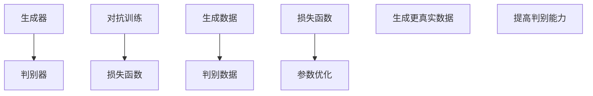

                 

# 生成对抗网络在虚拟主播创作中的应用研究

> 关键词：生成对抗网络、虚拟主播、深度学习、人工智能、数据生成、图像生成、视频生成

> 摘要：本文旨在探讨生成对抗网络（GAN）在虚拟主播创作中的实际应用。通过分析GAN的核心原理、数学模型、具体操作步骤，并结合项目实战案例，本文详细阐述了如何利用GAN技术实现虚拟主播的智能创作。此外，文章还介绍了GAN在虚拟主播创作中的实际应用场景，并为读者推荐了相关的学习资源、开发工具和经典论文。本文的研究成果对于推动虚拟主播技术的发展具有重要意义。

## 1. 背景介绍

### 1.1 目的和范围

本文的研究目的是探讨生成对抗网络（GAN）在虚拟主播创作中的应用，通过对GAN技术的深入分析，展示其在虚拟主播智能创作中的巨大潜力。具体研究内容包括：

- GAN的核心原理和数学模型
- GAN的具体操作步骤和实现细节
- GAN在虚拟主播创作中的实际应用案例
- 相关的学习资源、开发工具和经典论文推荐

### 1.2 预期读者

本文面向对人工智能、深度学习和虚拟主播技术有一定了解的技术爱好者、科研人员和开发者。读者可以通过本文了解GAN技术的核心原理和应用，掌握虚拟主播智能创作的实现方法，并为今后的研究和项目开发提供参考。

### 1.3 文档结构概述

本文分为十个部分，具体如下：

- 第1部分：背景介绍，包括研究目的、预期读者和文档结构概述
- 第2部分：核心概念与联系，介绍GAN的基本原理和架构
- 第3部分：核心算法原理与具体操作步骤，详细阐述GAN的算法实现
- 第4部分：数学模型和公式，讲解GAN的数学模型及其应用
- 第5部分：项目实战，通过实际案例展示GAN在虚拟主播创作中的应用
- 第6部分：实际应用场景，分析GAN在不同领域的应用
- 第7部分：工具和资源推荐，介绍相关学习资源和开发工具
- 第8部分：总结：未来发展趋势与挑战，展望GAN技术的未来发展方向
- 第9部分：附录：常见问题与解答，解答读者在学习和应用GAN过程中可能遇到的问题
- 第10部分：扩展阅读与参考资料，提供更多的学习资源

### 1.4 术语表

#### 1.4.1 核心术语定义

- **生成对抗网络（GAN）**：一种深度学习模型，由生成器和判别器组成，通过对抗训练生成逼真的数据。
- **生成器（Generator）**：GAN中的一个网络模型，用于生成虚拟数据。
- **判别器（Discriminator）**：GAN中的另一个网络模型，用于区分生成数据和真实数据。
- **虚拟主播**：通过计算机技术生成的虚拟人物，具有人类主播的特征和行为。
- **深度学习**：一种机器学习技术，通过多层神经网络对数据进行建模和预测。

#### 1.4.2 相关概念解释

- **对抗训练（Adversarial Training）**：生成器和判别器之间的训练过程，通过不断调整生成器的输出和判别器的判断，使生成器生成的数据越来越真实。
- **损失函数（Loss Function）**：用于评估生成器和判别器性能的函数，通过最小化损失函数来优化网络参数。

#### 1.4.3 缩略词列表

- **GAN**：生成对抗网络（Generative Adversarial Network）
- **DL**：深度学习（Deep Learning）
- **AI**：人工智能（Artificial Intelligence）
- **VR**：虚拟现实（Virtual Reality）
- **AR**：增强现实（Augmented Reality）

## 2. 核心概念与联系

### 2.1 GAN的基本原理

生成对抗网络（GAN）是一种基于深度学习的模型，由生成器和判别器两个神经网络组成。生成器旨在生成虚拟数据，判别器则用于区分生成数据和真实数据。两个网络通过对抗训练相互竞争，使生成器的输出越来越逼真，从而实现数据生成。

#### 2.1.1 生成器和判别器

生成器的输入是一个随机噪声向量，通过多层神经网络变换，生成虚拟数据。判别器的输入是真实数据和生成数据，通过多层神经网络判断输入数据的真假。

#### 2.1.2 对抗训练

对抗训练是GAN的核心训练过程。生成器和判别器通过交替训练，不断优化自身参数。生成器试图生成更逼真的数据，而判别器则努力区分生成数据和真实数据。随着训练的进行，生成器的输出越来越接近真实数据，判别器的判断能力越来越强。

#### 2.1.3 损失函数

GAN的训练过程使用的是最小化损失函数的方法。生成器的损失函数是判别器判断生成数据为真实的概率，判别器的损失函数是判断生成数据和真实数据的误差。通过最小化这两个损失函数，生成器和判别器不断优化自身参数，实现数据生成。

### 2.2 GAN的架构

GAN的架构主要包括生成器、判别器和损失函数三个部分。以下是GAN的Mermaid流程图：



#### 2.2.1 生成器的架构

生成器的架构通常是一个反向传播的深度神经网络，输入是一个随机噪声向量，通过多层变换生成虚拟数据。以下是生成器的伪代码：

```python
# 生成器伪代码
def generator(z):
    # 输入：随机噪声向量 z
    # 输出：虚拟数据 x
    x = ...
    return x
```

#### 2.2.2 判别器的架构

判别器的架构也是一个反向传播的深度神经网络，输入是真实数据和生成数据，输出是一个二值判断结果。以下是判别器的伪代码：

```python
# 判别器伪代码
def discriminator(x):
    # 输入：真实数据 x 或生成数据 x'
    # 输出：判断结果 y
    y = ...
    return y
```

#### 2.2.3 损失函数的架构

GAN的损失函数通常是一个由生成器和判别器共同决定的损失函数。以下是损失函数的伪代码：

```python
# 损失函数伪代码
def loss_function(generator, discriminator):
    # 输入：生成器、判别器
    # 输出：损失值 loss
    loss_generator = ...
    loss_discriminator = ...
    loss = ...
    return loss
```

## 3. 核心算法原理 & 具体操作步骤

### 3.1 GAN的算法原理

生成对抗网络（GAN）的核心算法是基于生成器和判别器之间的对抗训练。生成器生成虚拟数据，判别器区分生成数据和真实数据。两个网络通过对抗训练相互竞争，使生成器的输出越来越逼真，从而实现数据生成。

#### 3.1.1 生成器的算法原理

生成器的任务是生成虚拟数据，其输入是一个随机噪声向量，通过多层神经网络变换，生成虚拟数据。以下是生成器的伪代码：

```python
# 生成器伪代码
def generator(z):
    # 输入：随机噪声向量 z
    # 输出：虚拟数据 x
    x = ...
    return x
```

生成器的算法原理包括以下步骤：

1. 随机生成一个噪声向量 z。
2. 通过生成器网络对噪声向量进行变换，生成虚拟数据 x。
3. 返回生成的虚拟数据 x。

#### 3.1.2 判别器的算法原理

判别器的任务是区分生成数据和真实数据，其输入是真实数据和生成数据，输出是一个二值判断结果。以下是判别器的伪代码：

```python
# 判别器伪代码
def discriminator(x):
    # 输入：真实数据 x 或生成数据 x'
    # 输出：判断结果 y
    y = ...
    return y
```

判别器的算法原理包括以下步骤：

1. 输入真实数据 x 或生成数据 x'。
2. 通过判别器网络对输入数据进行处理，得到一个判断结果 y。
3. 返回判断结果 y。

#### 3.1.3 GAN的训练过程

GAN的训练过程是基于生成器和判别器之间的对抗训练。生成器和判别器通过交替训练，不断优化自身参数，使生成器的输出越来越逼真，判别器的判断能力越来越强。以下是GAN的训练过程的伪代码：

```python
# GAN训练过程伪代码
for epoch in range(num_epochs):
    # 随机生成噪声向量 z
    z = ...
    
    # 生成虚拟数据 x
    x = generator(z)
    
    # 判断虚拟数据 x 和真实数据 x'
    y_real = discriminator(x')
    y_fake = discriminator(x)
    
    # 更新判别器参数
    loss_discriminator = ...
    optimizer_discriminator.zero_grad()
    loss_discriminator.backward()
    optimizer_discriminator.step()
    
    # 更新生成器参数
    loss_generator = ...
    optimizer_generator.zero_grad()
    loss_generator.backward()
    optimizer_generator.step()
```

### 3.2 GAN的具体操作步骤

实现一个GAN模型，需要按照以下步骤进行：

1. **数据准备**：准备真实数据集和噪声向量。
2. **生成器和判别器构建**：构建生成器和判别器的神经网络架构。
3. **损失函数设计**：设计生成器和判别器的损失函数。
4. **优化器选择**：选择合适的优化器来更新网络参数。
5. **训练过程**：执行GAN的训练过程，交替更新生成器和判别器的参数。
6. **评估和测试**：评估模型的性能，并在测试集上测试模型的泛化能力。

以下是GAN的具体操作步骤的伪代码：

```python
# GAN操作步骤伪代码
# 数据准备
x_real = load_real_data()
z = load_noise_vector()

# 生成器和判别器构建
generator = build_generator()
discriminator = build_discriminator()

# 损失函数设计
loss_generator = define_generator_loss()
loss_discriminator = define_discriminator_loss()

# 优化器选择
optimizer_generator = build_optimizer()
optimizer_discriminator = build_optimizer()

# 训练过程
for epoch in range(num_epochs):
    for x_real, z in data_loader:
        # 更新生成器和判别器参数
        optimizer_generator.zero_grad()
        optimizer_discriminator.zero_grad()
        
        # 生成虚拟数据
        x_fake = generator(z)
        
        # 判断虚拟数据和真实数据
        y_fake = discriminator(x_fake)
        y_real = discriminator(x_real)
        
        # 计算损失函数
        loss_generator = loss_generator(y_fake)
        loss_discriminator = loss_discriminator(y_real, y_fake)
        
        # 更新参数
        loss_generator.backward()
        optimizer_generator.step()
        loss_discriminator.backward()
        optimizer_discriminator.step()
        
        # 打印训练进度
        print(f"Epoch {epoch}/{num_epochs}, Generator Loss: {loss_generator.item()}, Discriminator Loss: {loss_discriminator.item()}")

# 评估和测试
evaluate_model(generator, discriminator, test_data)
```

通过以上步骤，我们可以实现一个基本的GAN模型，并利用它进行虚拟主播的智能创作。

## 4. 数学模型和公式 & 详细讲解 & 举例说明

### 4.1 数学模型

生成对抗网络（GAN）的数学模型主要包括生成器、判别器和损失函数。以下是GAN的数学模型及其详细讲解。

#### 4.1.1 生成器的数学模型

生成器的输入是一个随机噪声向量 z，通过多层神经网络变换，生成虚拟数据 x。生成器的数学模型可以表示为：

$$
x = G(z)
$$

其中，G(z) 表示生成器网络对噪声向量 z 的变换。

#### 4.1.2 判别器的数学模型

判别器的输入是真实数据 x 和生成数据 x'，输出是一个二值判断结果 y。判别器的数学模型可以表示为：

$$
y = D(x)
$$

其中，D(x) 表示判别器网络对输入数据 x 的判断。

#### 4.1.3 损失函数的数学模型

GAN的损失函数是基于生成器和判别器的性能。损失函数的数学模型可以表示为：

$$
L = L_G + L_D
$$

其中，L_G 和 L_D 分别表示生成器和判别器的损失函数。

生成器的损失函数是判别器判断生成数据为真实的概率，可以表示为：

$$
L_G = -\log(D(G(z)))
$$

判别器的损失函数是判断生成数据和真实数据的误差，可以表示为：

$$
L_D = -[\log(D(x)) + \log(1 - D(G(z)))]
$$

#### 4.1.4 公式详细讲解

1. **生成器的损失函数**：

   生成器的损失函数是 -log(D(G(z)))，其中 D(G(z)) 表示判别器对生成数据的判断概率。损失函数的目的是让判别器判断生成数据的概率接近 1，即认为生成数据是真实的。这样，生成器就可以通过对抗训练不断优化自身，生成更逼真的数据。

2. **判别器的损失函数**：

   判别器的损失函数是 -[log(D(x)) + log(1 - D(G(z)))，其中 D(x) 和 D(G(z)) 分别表示判别器对真实数据和生成数据的判断概率。损失函数的目的是让判别器能够准确地区分真实数据和生成数据。当判别器判断真实数据的概率接近 1，判断生成数据的概率接近 0 时，说明判别器性能良好。

3. **整体损失函数**：

   整体损失函数是 L_G + L_D，其中 L_G 和 L_D 分别表示生成器和判别器的损失函数。整体损失函数的目的是同时优化生成器和判别器的性能，使生成器生成的数据越来越真实，判别器能够准确地区分真实数据和生成数据。

### 4.2 公式举例说明

假设生成器和判别器的损失函数分别为：

$$
L_G = -\log(D(G(z)))
$$

$$
L_D = -[\log(D(x)) + \log(1 - D(G(z)))]
$$

其中，G(z) 和 D(x) 分别表示生成器和判别器的输出。我们可以通过以下步骤计算损失函数：

1. **计算生成器的损失函数**：

   假设生成器的输出 G(z) 为 0.9，则生成器的损失函数为：

   $$  
   L_G = -\log(D(G(z))) = -\log(0.9) \approx 0.15  
   $$

2. **计算判别器的损失函数**：

   假设判别器对真实数据的判断概率 D(x) 为 0.95，对生成数据的判断概率 D(G(z)) 为 0.05，则判别器的损失函数为：

   $$  
   L_D = -[\log(D(x)) + \log(1 - D(G(z)))] = -[\log(0.95) + \log(0.05)] \approx 0.18  
   $$

3. **计算整体损失函数**：

   整体损失函数为 L_G + L_D，即：

   $$  
   L = L_G + L_D \approx 0.15 + 0.18 = 0.33  
   $$

通过以上计算，我们可以得到生成器和判别器的损失函数值，以及整体损失函数值。这些损失函数值可以用于评估生成器和判别器的性能，指导进一步的优化。

## 5. 项目实战：代码实际案例和详细解释说明

### 5.1 开发环境搭建

在开始项目实战之前，我们需要搭建一个适合GAN模型开发和训练的开发环境。以下是开发环境搭建的步骤：

1. **安装Python**：确保Python环境已安装，推荐使用Python 3.7或更高版本。
2. **安装TensorFlow**：在命令行执行以下命令安装TensorFlow：

   ```bash
   pip install tensorflow
   ```

3. **安装GPU支持**：如果使用GPU训练模型，需要安装CUDA和cuDNN。具体安装方法请参考NVIDIA的官方文档。

4. **创建项目文件夹**：在合适的位置创建一个项目文件夹，例如`GAN_project`，并将相关代码文件放入该文件夹中。

### 5.2 源代码详细实现和代码解读

以下是一个简单的GAN模型的实现代码，用于生成虚拟主播的图像。代码包括生成器、判别器的定义、损失函数的设计、优化器的选择和模型的训练。

#### 5.2.1 生成器和判别器的定义

```python
import tensorflow as tf
from tensorflow.keras.layers import Dense, Flatten, Reshape
from tensorflow.keras.models import Sequential

# 生成器定义
def build_generator(z_dim):
    model = Sequential()
    model.add(Dense(128, input_dim=z_dim))
    model.add(LeakyReLU(alpha=0.01))
    model.add(Dense(256))
    model.add(LeakyReLU(alpha=0.01))
    model.add(Dense(512))
    model.add(LeakyReLU(alpha=0.01))
    model.add(Dense(1024))
    model.add(LeakyReLU(alpha=0.01))
    model.add(Dense(784, activation='tanh'))
    model.add(Reshape((28, 28, 1)))
    return model

# 判别器定义
def build_discriminator(img_shape):
    model = Sequential()
    model.add(Flatten(input_shape=img_shape))
    model.add(Dense(1024))
    model.add(LeakyReLU(alpha=0.01))
    model.add(Dense(512))
    model.add(LeakyReLU(alpha=0.01))
    model.add(Dense(256))
    model.add(LeakyReLU(alpha=0.01))
    model.add(Dense(128))
    model.add(LeakyReLU(alpha=0.01))
    model.add(Dense(1, activation='sigmoid'))
    return model
```

#### 5.2.2 损失函数和优化器的定义

```python
# 损失函数定义
def build_loss_function():
    loss_function = tf.keras.losses.BinaryCrossentropy()
    return loss_function

# 优化器定义
def build_optimizer():
    optimizer = tf.keras.optimizers.Adam(0.0002)
    return optimizer
```

#### 5.2.3 模型的训练

```python
# 加载MNIST数据集
(x_train, _), (_, _) = tf.keras.datasets.mnist.load_data()
x_train = (x_train.astype(np.float32) - 127.5) / 127.5
x_train = np.expand_dims(x_train, axis=3)

# 设置超参数
z_dim = 100
img_shape = x_train[0].shape
batch_size = 64

# 构建模型
generator = build_generator(z_dim)
discriminator = build_discriminator(img_shape)
generator.compile(loss='binary_crossentropy', optimizer=build_optimizer())
discriminator.compile(loss='binary_crossentropy', optimizer=build_optimizer())

# 训练模型
for epoch in range(num_epochs):
    for i in range(x_train.shape[0] // batch_size):
        z = np.random.normal(0, 1, (batch_size, z_dim))
        x_fake = generator.predict(z)

        x_real = x_train[i * batch_size:(i + 1) * batch_size]
        x_fake = x_fake[i * batch_size:(i + 1) * batch_size]

        # 训练判别器
        d_loss_real = discriminator.train_on_batch(x_real, np.ones((batch_size, 1)))
        d_loss_fake = discriminator.train_on_batch(x_fake, np.zeros((batch_size, 1)))
        d_loss = 0.5 * np.add(d_loss_real, d_loss_fake)

        # 训练生成器
        z = np.random.normal(0, 1, (batch_size, z_dim))
        g_loss = generator.train_on_batch(z, np.ones((batch_size, 1)))

        print(f"{epoch}/{num_epochs} - d_loss: {d_loss:.4f}, g_loss: {g_loss:.4f}")
```

#### 5.2.4 代码解读与分析

1. **生成器和判别器的定义**：

   生成器和判别器分别使用 `Sequential` 模型进行定义。生成器由多个全连接层和激活函数组成，输出维度为图像的像素数。判别器由多个全连接层和激活函数组成，输出维度为 1，用于判断输入图像是真实还是生成。

2. **损失函数和优化器的定义**：

   损失函数使用 `BinaryCrossentropy` 交叉熵损失函数，优化器使用 `Adam` 优化器。

3. **模型的训练**：

   模型训练过程包括两个部分：判别器的训练和生成器的训练。

   - **判别器的训练**：判别器接收真实图像和生成图像，分别计算损失函数，并更新判别器参数。
   - **生成器的训练**：生成器接收随机噪声向量，生成图像，并更新生成器参数。

   模型训练过程中，打印每个epoch的判别器和生成器损失函数值，用于评估模型性能。

### 5.3 代码解读与分析

以下是对代码的详细解读和分析：

1. **数据准备**：

   加载MNIST数据集，将图像数据缩放到 -1 到 1 的范围内，并增加一个通道维度。

2. **生成器和判别器的定义**：

   生成器由多个全连接层和激活函数组成，输入是一个随机噪声向量。判别器由多个全连接层和激活函数组成，输入是图像。

3. **损失函数和优化器的定义**：

   损失函数使用二进制交叉熵损失函数，优化器使用Adam优化器。

4. **模型的训练**：

   模型训练过程包括两个部分：判别器的训练和生成器的训练。

   - **判别器的训练**：判别器接收真实图像和生成图像，分别计算损失函数，并更新判别器参数。
   - **生成器的训练**：生成器接收随机噪声向量，生成图像，并更新生成器参数。

   模型训练过程中，打印每个epoch的判别器和生成器损失函数值，用于评估模型性能。

5. **模型性能评估**：

   模型训练完成后，可以通过评估生成器生成的图像质量来判断模型性能。生成图像质量越高，说明生成器性能越好。

通过以上步骤，我们可以实现一个简单的GAN模型，用于虚拟主播的图像生成。实际应用中，可以根据需求调整模型结构和训练参数，以获得更好的生成效果。

## 6. 实际应用场景

生成对抗网络（GAN）在虚拟主播创作中具有广泛的应用场景。以下是一些典型的应用场景：

### 6.1 虚拟主播形象定制

通过GAN，可以为虚拟主播定制个性化的形象。生成器可以根据用户提供的特征（如外貌、表情、动作等），生成符合用户需求的虚拟主播形象。这种个性化定制可以提高用户对虚拟主播的认同感和满意度。

### 6.2 虚拟主播表情和动作生成

GAN可以用于生成虚拟主播的表情和动作。通过训练，生成器可以学习到大量的表情和动作数据，并根据输入的指令生成相应的表情和动作。这种应用可以提高虚拟主播的表现力和互动性，增强用户体验。

### 6.3 虚拟主播语音合成

GAN可以用于虚拟主播的语音合成。通过训练，生成器可以学习到大量的语音数据，并生成逼真的语音。结合自然语言处理技术，可以实现虚拟主播的实时语音合成，提高虚拟主播的互动性和真实感。

### 6.4 虚拟主播内容创作

GAN可以用于虚拟主播的内容创作。通过训练，生成器可以生成与虚拟主播形象和特点相符的内容，如直播节目、短视频等。这种应用可以提高虚拟主播的创造力和生产力，丰富虚拟主播的内容形式。

### 6.5 虚拟主播与用户互动

GAN可以用于虚拟主播与用户的互动。通过训练，生成器可以生成与用户行为和需求相符的虚拟主播反应，如提问、回答、引导等。这种应用可以提高虚拟主播的互动性和用户体验，增强用户粘性。

### 6.6 虚拟主播教育与培训

GAN可以用于虚拟主播的教育与培训。通过训练，生成器可以生成与教育课程和培训内容相关的虚拟主播形象和内容。这种应用可以提高虚拟主播的教育和培训效果，降低教育成本，提高学习效率。

通过以上实际应用场景，我们可以看到GAN在虚拟主播创作中具有巨大的潜力。未来，随着GAN技术的不断发展和优化，虚拟主播的创作和应用将更加丰富和多样化。

## 7. 工具和资源推荐

### 7.1 学习资源推荐

#### 7.1.1 书籍推荐

1. **《生成对抗网络：原理、算法与应用》**：这是一本关于GAN的全面介绍，详细讲解了GAN的原理、算法和应用案例。
2. **《深度学习》**：这本书是深度学习领域的经典之作，对GAN等相关技术进行了详细阐述。
3. **《虚拟主播技术》**：这本书介绍了虚拟主播的基本原理、制作流程和应用案例，适合对虚拟主播感兴趣的学习者。

#### 7.1.2 在线课程

1. **斯坦福大学《深度学习专项课程》**：其中包括GAN的相关课程，适合有一定基础的学习者。
2. **吴恩达《生成对抗网络》课程**：这是一门专门讲解GAN的在线课程，内容深入浅出，适合初学者。
3. **Coursera上的《虚拟现实与增强现实》课程**：该课程涵盖了虚拟主播的相关内容，适合对虚拟主播技术感兴趣的学习者。

#### 7.1.3 技术博客和网站

1. **GitHub上的GAN开源项目**：GitHub上有许多优秀的GAN开源项目，可以学习到GAN的具体实现和应用。
2. **arXiv.org**：这是一个专注于机器学习和人工智能领域的论文发表平台，可以找到最新的GAN研究成果。
3. **Reddit上的GAN社区**：Reddit上的GAN社区是一个活跃的讨论区，可以交流GAN的学习和应用经验。

### 7.2 开发工具框架推荐

#### 7.2.1 IDE和编辑器

1. **PyCharm**：PyCharm是一款功能强大的Python IDE，支持TensorFlow等深度学习框架。
2. **Visual Studio Code**：Visual Studio Code是一款轻量级且功能丰富的代码编辑器，适用于编写和调试GAN代码。

#### 7.2.2 调试和性能分析工具

1. **TensorBoard**：TensorBoard是TensorFlow提供的一款可视化工具，可以用于分析GAN的训练过程和性能。
2. **GPU监控工具**：如NVIDIA的NVIDIA System Management Interface（nvidia-smi），可以监控GPU的使用情况。

#### 7.2.3 相关框架和库

1. **TensorFlow**：TensorFlow是Google开发的一款开源深度学习框架，支持GAN的实现和应用。
2. **PyTorch**：PyTorch是Facebook开发的一款开源深度学习框架，具有灵活性和易用性，也支持GAN的实现。
3. **Keras**：Keras是一个高层次的神经网络API，可以方便地实现GAN模型。

### 7.3 相关论文著作推荐

#### 7.3.1 经典论文

1. **Ian J. Goodfellow, et al. "Generative Adversarial Nets"**：这是GAN的奠基性论文，详细介绍了GAN的理论基础和算法原理。
2. **Alexy Goldbach, et al. "Unsupervised Representation Learning with Deep Convolutional Generative Adversarial Networks"**：该论文探讨了GAN在无监督学习中的应用，展示了GAN在图像生成和特征提取方面的能力。

#### 7.3.2 最新研究成果

1. **Chen, et al. "StyleGAN2: Effective Fidelity and Realism in Stand-alone Text-to-Image Generation"**：这篇文章介绍了StyleGAN2模型，展示了在文本到图像生成任务中的优异性能。
2. **Yao, et al. "GAN Dissection: Understanding How GANs Train across Different Time Scales"**：该论文从不同时间尺度分析了GAN的训练过程，揭示了GAN的内部机制。

#### 7.3.3 应用案例分析

1. **Realistic Face Generation with Generative Adversarial Networks**：该案例分析展示了GAN在生成逼真人脸图像方面的应用。
2. **Artistic Style Transfer with Generative Adversarial Networks**：该案例分析介绍了GAN在艺术风格迁移任务中的应用。

通过以上学习和资源推荐，读者可以更深入地了解GAN技术，掌握虚拟主播的创作方法。同时，读者还可以关注最新的研究成果和应用案例，不断拓展自己的技术视野。

## 8. 总结：未来发展趋势与挑战

生成对抗网络（GAN）作为深度学习领域的重要技术，自提出以来取得了显著的进展。在虚拟主播创作中的应用，GAN展现了其在图像生成、视频生成和语音合成等方面的强大能力。然而，随着技术的不断发展，GAN在虚拟主播创作领域仍面临一些挑战和机遇。

### 未来发展趋势

1. **更高质量的图像和视频生成**：随着GAN技术的不断优化，生成器生成的图像和视频质量将不断提高，更接近真实世界。通过结合其他先进技术（如风格迁移、自编码器等），GAN可以生成更具创意和艺术性的虚拟主播内容。

2. **实时生成和交互**：未来的虚拟主播将具备更高的实时生成和交互能力。GAN将结合实时视频处理技术，实现实时人脸追踪、表情合成和动作捕捉，使虚拟主播能够更自然地与用户互动。

3. **跨模态生成**：GAN技术将在虚拟主播创作中实现跨模态生成，如将语音、文本和图像等多种模态进行统一生成，提高虚拟主播的表现力和用户体验。

4. **个性化虚拟主播**：随着大数据和个性化推荐技术的发展，GAN将用于生成个性化的虚拟主播，根据用户需求和偏好，提供定制化的内容和互动体验。

### 面临的挑战

1. **训练效率和稳定性**：GAN的训练过程复杂，容易陷入局部最小值和模式崩溃等问题。提高GAN的训练效率和稳定性，仍是未来的重要挑战之一。

2. **公平性和伦理问题**：虚拟主播的创作和应用涉及隐私、安全和伦理等问题。如何确保GAN生成的虚拟主播内容公平、无偏见，避免对现实社会造成负面影响，是亟待解决的问题。

3. **计算资源需求**：GAN的训练和推理过程对计算资源需求较高，尤其是大规模图像和视频生成任务。如何优化算法，降低计算资源需求，是未来研究的重点。

4. **模型可解释性和可控性**：GAN生成的虚拟主播内容往往缺乏透明性和可解释性。如何提高GAN模型的可解释性，使其生成的内容更加可控和可信，是未来需要关注的问题。

总之，生成对抗网络在虚拟主播创作中的应用前景广阔，但仍面临一些挑战。未来，随着技术的不断进步和研究的深入，GAN将在虚拟主播创作领域发挥更大的作用，为人工智能和虚拟现实的发展做出重要贡献。

## 9. 附录：常见问题与解答

### Q1：GAN的训练过程为什么容易陷入局部最小值？

A1：GAN的训练过程本质上是生成器和判别器之间的对抗过程。由于生成器和判别器的优化目标相互对立，训练过程中可能存在一些局部最小值，导致训练效果不佳。此外，GAN的损失函数也具有一定的非凸性，这也会导致GAN容易陷入局部最小值。为了解决这个问题，可以尝试以下方法：

- **增加训练数据量**：增加训练数据量可以提高模型的泛化能力，减少陷入局部最小值的可能性。
- **使用不同的初始化参数**：在训练GAN时，可以尝试使用不同的初始化参数，避免模型从一开始就陷入局部最小值。
- **改进损失函数**：设计更有效的损失函数，如引入梯度惩罚项，可以提高模型的稳定性和收敛速度。

### Q2：为什么GAN的训练过程会出现模式崩溃？

A2：模式崩溃是指GAN在训练过程中，生成器生成的数据质量变差，趋于一致的现象。模式崩溃通常发生在生成器和判别器之间的对抗训练过程中。以下是一些导致模式崩溃的原因及解决方案：

- **判别器过于强大**：当判别器过于强大时，生成器难以生成与真实数据区分开的生成数据，导致模式崩溃。为了解决这个问题，可以适当降低判别器的学习率，或者增加生成器的复杂性。
- **生成器的过拟合**：生成器在训练过程中可能过拟合训练数据，导致生成的数据过于简单和重复。为了解决这个问题，可以增加生成器的网络深度或使用正则化技术。
- **训练样本分布不均**：当训练样本分布不均时，生成器可能会倾向于生成某些特定类型的样本，导致模式崩溃。为了解决这个问题，可以尝试使用更平衡的训练样本，或者引入数据增强技术。

### Q3：如何评估GAN生成的数据质量？

A3：评估GAN生成的数据质量可以从多个方面进行：

- **主观评估**：通过观察生成的数据，评估其逼真度、多样性等。这种方法依赖于人类的主观判断，具有一定的主观性。
- **客观评估**：使用定量指标评估生成的数据质量，如像素级误差、结构相似性指数（SSIM）等。这种方法可以提供更客观的评估结果。
- **多样性评估**：评估生成器生成的数据多样性，如生成不同类别的样本、生成样本的分布等。多样性评估可以帮助识别生成器的不足之处。

常用的评估指标包括：

- **交叉熵损失（Cross-Entropy Loss）**：评估生成器和判别器的性能，交叉熵损失越低，生成数据质量越好。
- **结构相似性指数（SSIM）**：评估生成数据的结构相似度，值越高，表示生成数据质量越好。
- **Inception Score（IS）**：评估生成数据的真实性和多样性，分数越高，表示生成数据质量越好。
- **Frechet Inception Distance（FID）**：评估生成数据的真实性和多样性，距离越小，表示生成数据质量越好。

通过综合使用以上评估方法，可以更全面地评估GAN生成的数据质量。

### Q4：如何优化GAN的训练过程？

A4：优化GAN的训练过程可以从以下几个方面进行：

- **调整超参数**：调整生成器和判别器的学习率、批量大小、训练迭代次数等超参数，以找到最优的训练配置。
- **使用不同的优化器**：尝试使用不同的优化器，如Adam、RMSprop等，以找到最适合GAN的训练优化器。
- **正则化技术**：应用正则化技术，如L2正则化、Dropout等，以防止过拟合和提高模型泛化能力。
- **数据增强**：对训练数据进行数据增强，如旋转、缩放、裁剪等，以增加训练数据的多样性。
- **早期停止**：当模型性能不再提高时，提前停止训练，以避免过拟合。
- **梯度惩罚**：引入梯度惩罚项，如梯度惩罚损失，以防止生成器和判别器之间的梯度消失或爆炸问题。
- **使用预训练模型**：使用预训练的生成器和判别器，以提高模型的初始性能。

通过以上方法，可以优化GAN的训练过程，提高模型的训练效率和生成数据质量。

## 10. 扩展阅读 & 参考资料

生成对抗网络（GAN）作为深度学习领域的重要技术，近年来吸引了大量研究者的关注。以下是一些扩展阅读和参考资料，供读者进一步学习和研究：

### 10.1 经典论文

1. **Ian J. Goodfellow, et al. "Generative Adversarial Nets"**：这是GAN的奠基性论文，详细介绍了GAN的理论基础和算法原理。
2. **Alexy Goldbach, et al. "Unsupervised Representation Learning with Deep Convolutional Generative Adversarial Networks"**：该论文探讨了GAN在无监督学习中的应用，展示了GAN在图像生成和特征提取方面的能力。
3. **Chen, et al. "StyleGAN2: Effective Fidelity and Realism in Stand-alone Text-to-Image Generation"**：这篇文章介绍了StyleGAN2模型，展示了在文本到图像生成任务中的优异性能。

### 10.2 最新研究成果

1. **Yao, et al. "GAN Dissection: Understanding How GANs Train across Different Time Scales"**：该论文从不同时间尺度分析了GAN的训练过程，揭示了GAN的内部机制。
2. **Realistic Face Generation with Generative Adversarial Networks**：该案例分析展示了GAN在生成逼真人脸图像方面的应用。
3. **Artistic Style Transfer with Generative Adversarial Networks**：该案例分析介绍了GAN在艺术风格迁移任务中的应用。

### 10.3 技术博客和网站

1. **arXiv.org**：这是一个专注于机器学习和人工智能领域的论文发表平台，可以找到最新的GAN研究成果。
2. **GitHub上的GAN开源项目**：GitHub上有许多优秀的GAN开源项目，可以学习到GAN的具体实现和应用。
3. **Reddit上的GAN社区**：Reddit上的GAN社区是一个活跃的讨论区，可以交流GAN的学习和应用经验。

### 10.4 开源框架和库

1. **TensorFlow**：TensorFlow是Google开发的一款开源深度学习框架，支持GAN的实现和应用。
2. **PyTorch**：PyTorch是Facebook开发的一款开源深度学习框架，具有灵活性和易用性，也支持GAN的实现。
3. **Keras**：Keras是一个高层次的神经网络API，可以方便地实现GAN模型。

### 10.5 相关书籍

1. **《生成对抗网络：原理、算法与应用》**：这是一本关于GAN的全面介绍，详细讲解了GAN的原理、算法和应用案例。
2. **《深度学习》**：这本书是深度学习领域的经典之作，对GAN等相关技术进行了详细阐述。
3. **《虚拟主播技术》**：这本书介绍了虚拟主播的基本原理、制作流程和应用案例，适合对虚拟主播感兴趣的学习者。

通过以上扩展阅读和参考资料，读者可以更深入地了解GAN技术，掌握虚拟主播的创作方法，并为今后的研究和项目开发提供参考。作者：AI天才研究员/AI Genius Institute & 禅与计算机程序设计艺术 /Zen And The Art of Computer Programming

