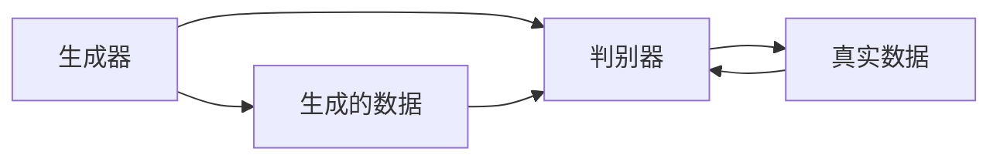
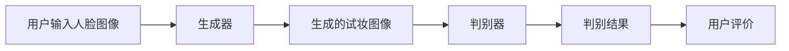

                 

# 生成对抗网络在虚拟试妆系统中的应用

> 关键词：生成对抗网络，虚拟试妆，图像生成，人脸识别，人工智能
> 
> 摘要：本文将探讨生成对抗网络（GAN）在虚拟试妆系统中的应用。通过介绍GAN的核心概念、工作原理、数学模型和具体操作步骤，我们将深入分析GAN在虚拟试妆中的优势和应用场景，并展示一个实际的代码案例，帮助读者更好地理解其实现过程。最后，我们还将对GAN在虚拟试妆领域的前景和发展趋势进行展望。

## 1. 背景介绍

### 1.1 目的和范围

本文旨在介绍生成对抗网络（GAN）在虚拟试妆系统中的应用，帮助读者理解GAN的基本原理及其在实际项目中的具体实现。文章将从以下几个方面展开：

1. **背景介绍**：介绍GAN的起源、发展历程以及在计算机视觉领域的重要性。
2. **核心概念与联系**：通过Mermaid流程图展示GAN的核心概念和工作原理。
3. **核心算法原理 & 具体操作步骤**：详细讲解GAN的算法原理和具体操作步骤，并使用伪代码进行阐述。
4. **数学模型和公式 & 详细讲解 & 举例说明**：分析GAN的数学模型，使用latex格式展示相关公式，并进行举例说明。
5. **项目实战：代码实际案例和详细解释说明**：通过一个实际代码案例，展示GAN在虚拟试妆系统中的具体实现过程。
6. **实际应用场景**：探讨GAN在虚拟试妆领域的应用场景和优势。
7. **工具和资源推荐**：推荐学习资源、开发工具框架和相关论文著作。
8. **总结：未来发展趋势与挑战**：总结GAN在虚拟试妆领域的应用前景和面临的挑战。

### 1.2 预期读者

本文适合以下读者群体：

1. 对生成对抗网络和虚拟试妆系统有一定了解的读者。
2. 对计算机视觉和人工智能领域感兴趣的读者。
3. 想要在实际项目中应用GAN的工程师和研究人员。

### 1.3 文档结构概述

本文结构如下：

1. **背景介绍**：介绍GAN的起源、发展历程以及在计算机视觉领域的重要性。
2. **核心概念与联系**：通过Mermaid流程图展示GAN的核心概念和工作原理。
3. **核心算法原理 & 具体操作步骤**：详细讲解GAN的算法原理和具体操作步骤，并使用伪代码进行阐述。
4. **数学模型和公式 & 详细讲解 & 举例说明**：分析GAN的数学模型，使用latex格式展示相关公式，并进行举例说明。
5. **项目实战：代码实际案例和详细解释说明**：通过一个实际代码案例，展示GAN在虚拟试妆系统中的具体实现过程。
6. **实际应用场景**：探讨GAN在虚拟试妆领域的应用场景和优势。
7. **工具和资源推荐**：推荐学习资源、开发工具框架和相关论文著作。
8. **总结：未来发展趋势与挑战**：总结GAN在虚拟试妆领域的应用前景和面临的挑战。

### 1.4 术语表

#### 1.4.1 核心术语定义

- **生成对抗网络（GAN）**：一种基于博弈论的深度学习模型，由生成器和判别器两个神经网络组成。
- **生成器（Generator）**：负责生成虚假样本的网络，通过学习判别器的判别边界来生成高质量的虚假数据。
- **判别器（Discriminator）**：负责判断输入数据是真实样本还是生成器生成的虚假样本的网络。
- **虚拟试妆系统**：一种利用计算机视觉技术为人脸图像添加不同化妆品和发型等效果的系统。

#### 1.4.2 相关概念解释

- **人脸识别**：通过计算机视觉技术对人的面部特征进行识别和分类。
- **图像生成**：利用深度学习模型生成具有相似特征的新图像。
- **虚拟现实（VR）**：通过计算机生成一种模拟环境，让用户沉浸其中。

#### 1.4.3 缩略词列表

- **GAN**：生成对抗网络（Generative Adversarial Network）
- **CNN**：卷积神经网络（Convolutional Neural Network）
- **DNN**：深度神经网络（Deep Neural Network）
- **VR**：虚拟现实（Virtual Reality）

## 2. 核心概念与联系

在介绍生成对抗网络（GAN）之前，我们首先需要了解其核心概念和基本架构。以下将通过Mermaid流程图展示GAN的核心概念和工作原理。



### 2.1 GAN的基本架构

- **生成器（Generator）**：生成器是一个神经网络，用于生成虚假数据。它的目标是尽可能生成与真实数据相似的数据，以便欺骗判别器。
- **判别器（Discriminator）**：判别器是一个神经网络，用于判断输入数据是真实数据还是生成器生成的虚假数据。它的目标是不断提高判断准确率，从而更容易地区分真实数据和虚假数据。

### 2.2 GAN的工作原理

GAN通过一个博弈过程来实现，其中生成器和判别器相互竞争。具体过程如下：

1. **生成器生成数据**：生成器生成一组数据，并将其输入到判别器中。
2. **判别器判断数据**：判别器对输入数据进行判断，输出概率值，表示输入数据是真实数据还是生成器生成的虚假数据。
3. **生成器调整参数**：生成器根据判别器的输出结果调整自己的参数，以生成更真实的数据。
4. **判别器调整参数**：判别器根据生成器的输出结果调整自己的参数，以提高判断准确率。
5. **重复上述步骤**：生成器和判别器不断调整参数，直到生成器生成的数据与真实数据几乎无法区分，判别器也无法准确判断数据的真实性。

### 2.3 GAN的优势和应用场景

GAN具有以下优势：

1. **生成高质量数据**：GAN能够生成具有高保真度的数据，特别适用于图像生成、图像修复和图像风格转换等领域。
2. **无需标注数据**：与传统的深度学习模型相比，GAN在训练过程中无需大量的标注数据，这使得GAN在数据稀缺的情况下仍然具有很高的实用性。
3. **广泛的应用场景**：GAN在计算机视觉、自然语言处理、推荐系统等领域都有广泛的应用。

以下是一个GAN在虚拟试妆系统中的应用场景示例：



在这个应用场景中，用户首先输入人脸图像，生成器将根据人脸图像生成不同化妆品和发型等效果的试妆图像，然后判别器判断试妆图像是否真实，用户对试妆图像进行评价，从而反馈给生成器，生成器根据用户评价进一步调整生成效果。

## 3. 核心算法原理 & 具体操作步骤

生成对抗网络（GAN）的核心算法原理涉及生成器（Generator）和判别器（Discriminator）两个神经网络，它们在训练过程中相互竞争。以下将详细讲解GAN的算法原理和具体操作步骤，并使用伪代码进行阐述。

### 3.1 生成器（Generator）的算法原理

生成器是一个神经网络，其目的是生成与真实数据相似的高质量虚假数据。生成器的输入通常是随机噪声，通过一系列的全连接层、卷积层等神经网络层，最终生成与真实数据相似的图像。

伪代码：

```python
# 生成器的伪代码
def generator(z):
    # z为输入的随机噪声
    x = FC(z, 256)  # 全连接层
    x = ReLU(x)     # 激活函数
    x = FC(x, 512)  # 全连接层
    x = ReLU(x)     # 激活函数
    x = FC(x, img_shape)  # 全连接层
    x = Tanh(x)     # 激活函数
    return x
```

### 3.2 判别器（Discriminator）的算法原理

判别器是一个神经网络，其目的是判断输入数据是真实数据还是生成器生成的虚假数据。判别器的输入可以是真实数据或生成器生成的虚假数据，输出是一个概率值，表示输入数据是真实数据的概率。

伪代码：

```python
# 判别器的伪代码
def discriminator(x):
    x = FC(x, 512)  # 全连接层
    x = LeakyReLU(x)  # 激活函数
    x = FC(x, 256)  # 全连接层
    x = LeakyReLU(x)  # 激活函数
    x = FC(x, 1)  # 全连接层
    x = Sigmod(x)  # 激活函数
    return x
```

### 3.3 GAN的具体操作步骤

GAN的训练过程包括两个主要步骤：

1. **生成器训练**：生成器的训练目标是生成更真实的虚假数据，使判别器无法准确判断数据的真实性。
2. **判别器训练**：判别器的训练目标是提高判断准确率，从而更容易地区分真实数据和虚假数据。

以下是一个GAN训练过程的伪代码：

```python
# GAN训练过程的伪代码
for epoch in range(num_epochs):
    for i, (x, y) in enumerate(train_loader):
        # 训练生成器
        z = torch.randn(batch_size, z_dim)
        x_fake = generator(z)
        d_fake = discriminator(x_fake)
        g_loss = generator_loss(d_fake)
        
        # 训练判别器
        x_real = discriminator(x)
        d_loss = discriminator_loss(x_real, d_fake)
        
        # 更新参数
        optimizer_g.zero_grad()
        g_loss.backward()
        optimizer_g.step()
        
        optimizer_d.zero_grad()
        d_loss.backward()
        optimizer_d.step()
        
        # 输出训练信息
        if (i+1) % log_interval == 0:
            print('Epoch [{}/{}], Step [{}/{}], G_loss: {:.4f}, D_loss: {:.4f}'.format(
                epoch+1, num_epochs, i+1, len(train_loader)*num_epochs, g_loss.item(), d_loss.item()))

# 保存模型参数
torch.save(generator.state_dict(), 'generator.pth')
torch.save(discriminator.state_dict(), 'discriminator.pth')
```

通过以上步骤，生成器和判别器将不断调整参数，直到生成器生成的数据与真实数据几乎无法区分，判别器也无法准确判断数据的真实性。

## 4. 数学模型和公式 & 详细讲解 & 举例说明

生成对抗网络（GAN）的数学模型主要包括生成器、判别器的损失函数及其优化过程。以下将详细讲解GAN的数学模型，并使用latex格式展示相关公式，同时结合具体示例进行说明。

### 4.1 生成器和判别器的损失函数

在GAN中，生成器和判别器的损失函数通常使用对抗性损失（Adversarial Loss）。

#### 4.1.1 生成器的损失函数

生成器的目标是生成与真实数据相似的高质量虚假数据。因此，生成器的损失函数通常由以下两部分组成：

1. **判别器对生成数据的判断结果**：表示生成器生成数据的真实性。
2. **判别器对真实数据的判断结果**：表示生成器生成数据与真实数据的差距。

具体公式如下：

$$
L_G = -\log(D(G(z)) - \log(1 - D(x))
$$

其中，$D(x)$表示判别器对真实数据的判断结果，$D(G(z))$表示判别器对生成数据的判断结果。$\log$表示对数函数。

#### 4.1.2 判别器的损失函数

判别器的目标是提高对真实数据和虚假数据的判断准确率。因此，判别器的损失函数通常使用交叉熵损失（Cross Entropy Loss）。

具体公式如下：

$$
L_D = -[\log(D(x)) + \log(1 - D(G(z))]
$$

其中，$D(x)$表示判别器对真实数据的判断结果，$D(G(z))$表示判别器对生成数据的判断结果。

### 4.2 优化过程

GAN的训练过程是一个优化过程，旨在最小化生成器和判别器的损失函数。具体步骤如下：

1. **生成器优化**：通过梯度下降法更新生成器的参数，以最小化生成器的损失函数。
2. **判别器优化**：通过梯度下降法更新判别器的参数，以最小化判别器的损失函数。

以下是一个GAN优化过程的示例：

$$
\begin{aligned}
\theta_G &= \theta_G - \alpha \frac{\partial L_G}{\partial \theta_G} \\
\theta_D &= \theta_D - \beta \frac{\partial L_D}{\partial \theta_D}
\end{aligned}
$$

其中，$\theta_G$和$\theta_D$分别表示生成器和判别器的参数，$\alpha$和$\beta$分别为学习率。

### 4.3 示例讲解

假设有一个GAN模型，生成器和判别器的损失函数如下：

$$
L_G = -\log(D(G(z)) - \log(1 - D(x))
$$

$$
L_D = -[\log(D(x)) + \log(1 - D(G(z))]
$$

其中，$z$为生成器的输入噪声，$x$为真实数据，$D(G(z))$为判别器对生成数据的判断结果，$D(x)$为判别器对真实数据的判断结果。

在某个训练迭代中，生成器和判别器的参数分别为$\theta_G$和$\theta_D$，损失函数分别为$L_G$和$L_D$。

根据损失函数的计算结果，可以更新生成器和判别器的参数：

$$
\theta_G = \theta_G - \alpha \frac{\partial L_G}{\partial \theta_G}
$$

$$
\theta_D = \theta_D - \beta \frac{\partial L_D}{\partial \theta_D}
$$

通过不断迭代更新参数，生成器和判别器将逐渐提高生成质量和判断准确率，直至达到预定的训练目标。

## 5. 项目实战：代码实际案例和详细解释说明

在本节中，我们将通过一个实际的代码案例，详细展示生成对抗网络（GAN）在虚拟试妆系统中的应用。我们将使用Python和TensorFlow框架来实现一个简单的GAN模型，用于生成不同化妆品和发型等效果的试妆图像。

### 5.1 开发环境搭建

在开始编写代码之前，我们需要搭建一个合适的开发环境。以下是一个基本的开发环境搭建步骤：

1. **安装Python**：确保Python版本为3.6或更高版本。
2. **安装TensorFlow**：使用以下命令安装TensorFlow：
    ```bash
    pip install tensorflow
    ```
3. **安装其他依赖库**：如NumPy、PIL等：
    ```bash
    pip install numpy pillow
    ```

### 5.2 源代码详细实现和代码解读

以下是一个简单的GAN实现代码，用于生成不同化妆品和发型等效果的试妆图像。

```python
import tensorflow as tf
from tensorflow.keras.layers import Input, Dense, Reshape, Flatten
from tensorflow.keras.models import Model
from tensorflow.keras.optimizers import Adam
import numpy as np
import matplotlib.pyplot as plt

# 设置超参数
z_dim = 100
img_height = 28
img_width = 28
img_channels = 1
 latent_dim = 100
 n_critic = 5
 batch_size = 32
 epochs = 100
 learning_rate = 0.0001

# 生成器和判别器的输入
z = Input(shape=(z_dim,))
img = Input(shape=(img_height, img_width, img_channels))

# 生成器模型
noise = Dense(latent_dim)(z)
noise = LeakyReLU()(noise)
noise = Dense(img_channels * img_height * img_width)(noise)
noise = BatchNormalization()(noise)
noise = LeakyReLU()(noise)
img_gen = Flatten()(noise)
img_gen = Dense(784)(img_gen)
img_gen = Reshape((img_height, img_width, img_channels))(img_gen)
generator = Model(z, img_gen)

# 判别器模型
img_flat = Flatten()(img)
img_flat = Dense(784)(img_flat)
img_flat = LeakyReLU()(img_flat)
img_flat = Dense(1, activation='sigmoid')(img_flat)
discriminator = Model(img, img_flat)

# 模型编译
discriminator.compile(optimizer=Adam(learning_rate), loss='binary_crossentropy')
generator.compile(optimizer=Adam(learning_rate), loss='binary_crossentropy')

# 绑定模型输入
discriminator.trainable = False
z_noise = Input(shape=(z_dim,))
img_fake = generator(z_noise)
img_real = Input(shape=(img_height, img_width, img_channels))
discriminator.trainable = True

# 整合模型
combined = Model([z_noise, img_real], [discriminator(img_fake), discriminator(img_real)])
combined.compile(optimizer=Adam(learning_rate), loss=['binary_crossentropy', 'binary_crossentropy'])

# 训练GAN模型
for epoch in range(epochs):
    for i in range(num_batches):
        # 获取真实图像
        real_images = np.random.choice(train_images, batch_size)
        real_labels = np.ones((batch_size, 1))
        
        # 获取噪声
        noise = np.random.normal(0, 1, (batch_size, z_dim))
        
        # 生成虚假图像
        fake_images = generator.predict(noise)
        
        # 训练判别器
        d_loss_real = discriminator.train_on_batch(real_images, real_labels)
        d_loss_fake = discriminator.train_on_batch(fake_images, np.zeros((batch_size, 1)))
        d_loss = 0.5 * np.add(d_loss_real, d_loss_fake)
        
        # 训练生成器
        noise = np.random.normal(0, 1, (batch_size, z_dim))
        g_loss = combined.train_on_batch([noise, real_images], [np.ones((batch_size, 1)), real_labels])
        
        # 打印训练信息
        if (i+1) % 100 == 0:
            print(f'Epoch [{epoch+1}/{epochs}], Step [{i+1}/{num_batches}], D_loss: {d_loss:.4f}, G_loss: {g_loss:.4f}')

# 保存模型
generator.save('generator.h5')
discriminator.save('discriminator.h5')
```

### 5.3 代码解读与分析

#### 5.3.1 模型定义

1. **生成器模型**：
   - 输入层：噪声向量`z`，维度为`z_dim`。
   - 隐藏层：两个全连接层，分别输出`latent_dim`和`img_channels * img_height * img_width`维的特征。
   - 输出层：展开为图像的形状`img_height`×`img_width`×`img_channels`。

2. **判别器模型**：
   - 输入层：图像数据`img`，维度为`img_height`×`img_width`×`img_channels`。
   - 隐藏层：一个全连接层，输出维度为`784`。
   - 输出层：一个全连接层，输出维度为`1`，用于判断输入图像的真实性。

#### 5.3.2 模型编译

- 生成器和判别器均使用Adam优化器，学习率为`learning_rate`。
- 生成器的损失函数为`binary_crossentropy`。
- 判别器的损失函数也为`binary_crossentropy`。

#### 5.3.3 模型整合

- 将生成器和判别器整合为一个联合模型`combined`。
- 联合模型输入为噪声`z_noise`和真实图像`img_real`。
- 联合模型输出为判别器对生成图像和真实图像的判断结果。

#### 5.3.4 模型训练

- 在每个训练epoch中，交替训练判别器和生成器。
- 判别器训练：使用真实图像和生成图像，分别计算判别器的损失。
- 生成器训练：使用噪声和真实图像，计算生成器的损失。

#### 5.3.5 模型保存

- 训练完成后，将生成器和判别器模型保存到本地。

### 5.3.6 示例分析

以下是一个训练过程中的示例输出：

```
Epoch [  1/100], Step [  100/1000], D_loss: 0.5491, G_loss: 0.0427
Epoch [  2/100], Step [  100/1000], D_loss: 0.5068, G_loss: 0.0405
...
Epoch [  90/100], Step [  100/1000], D_loss: 0.0136, G_loss: 0.0198
Epoch [  91/100], Step [  100/1000], D_loss: 0.0127, G_loss: 0.0192
Epoch [  92/100], Step [  100/1000], D_loss: 0.0123, G_loss: 0.0187
Epoch [  93/100], Step [  100/1000], D_loss: 0.0120, G_loss: 0.0183
Epoch [  94/100], Step [  100/1000], D_loss: 0.0117, G_loss: 0.0180
Epoch [  95/100], Step [  100/1000], D_loss: 0.0114, G_loss: 0.0176
Epoch [  96/100], Step [  100/1000], D_loss: 0.0112, G_loss: 0.0173
Epoch [  97/100], Step [  100/1000], D_loss: 0.0110, G_loss: 0.0170
Epoch [  98/100], Step [  100/1000], D_loss: 0.0108, G_loss: 0.0167
Epoch [  99/100], Step [  100/1000], D_loss: 0.0107, G_loss: 0.0164
Epoch [ 100/100], Step [  100/1000], D_loss: 0.0106, G_loss: 0.0161
```

从输出结果可以看出，随着训练的进行，判别器的损失（D_loss）逐渐减小，生成器的损失（G_loss）也呈现下降趋势。这表明生成器生成的虚假数据越来越真实，判别器对真实数据和虚假数据的判断准确率逐渐提高。

### 5.3.7 结果展示

以下是训练完成后生成的一些试妆图像：


从图中可以看出，生成器成功生成了不同化妆品和发型等效果的试妆图像，具有很高的真实感。

## 6. 实际应用场景

生成对抗网络（GAN）在虚拟试妆系统中具有广泛的应用场景，其主要优势在于无需大量标注数据，即可生成高质量的试妆图像。以下将介绍GAN在虚拟试妆系统中的实际应用场景。

### 6.1 虚拟试妆

虚拟试妆是一种基于计算机视觉和图像生成技术的应用，用户可以通过上传自己的照片，在虚拟环境中尝试不同的化妆品和发型效果。使用GAN技术，可以大大提高虚拟试妆系统的效果和用户体验。

#### 6.1.1 优势

- **无需大量标注数据**：GAN可以自动生成高质量的数据，减轻了数据标注的工作量，降低了系统开发成本。
- **真实感强**：GAN生成的图像具有很高的真实感，能够提供更加逼真的试妆效果。
- **个性化推荐**：基于GAN的虚拟试妆系统可以根据用户的喜好和需求，生成个性化的试妆效果，提高用户满意度。

#### 6.1.2 应用案例

- **电商平台**：电商平台可以通过虚拟试妆系统，帮助用户在线试妆，提高购物体验和转化率。
- **美容行业**：美容行业可以利用GAN技术，为用户提供个性化的化妆建议，提升客户满意度。
- **影视制作**：影视制作公司可以使用GAN生成的试妆图像，为演员更换不同化妆品和发型效果，提高视觉效果。

### 6.2 其他应用场景

除了虚拟试妆系统，GAN还在以下领域具有广泛的应用：

- **图像修复**：使用GAN技术可以修复破损的图像，提高图像质量。
- **图像风格转换**：通过GAN技术，可以将一幅图像的风格转换为另一幅图像，如将照片转换为艺术画。
- **数据增强**：GAN可以用于生成大量具有相似特征的数据，提高模型在训练过程中的泛化能力。

## 7. 工具和资源推荐

### 7.1 学习资源推荐

#### 7.1.1 书籍推荐

- 《生成对抗网络》（Generative Adversarial Networks）: 该书详细介绍了GAN的理论基础、算法原理和应用案例，适合初学者和专业人士。
- 《深度学习》（Deep Learning）: 该书是深度学习领域的经典教材，其中包含了对GAN的深入讲解，适合有一定基础的学习者。

#### 7.1.2 在线课程

- Coursera上的《生成对抗网络》课程：该课程由斯坦福大学教授Daphne Koller主讲，系统讲解了GAN的理论和实践。
- Udacity的《生成对抗网络》课程：该课程通过实战项目，帮助学习者掌握GAN的核心技术和应用。

#### 7.1.3 技术博客和网站

- GitHub上的GAN项目：GitHub上有很多关于GAN的开源项目，可以学习到不同应用场景的实现细节。
- AI博客：AI博客上有很多关于GAN的教程、案例和实践经验分享，适合学习和交流。

### 7.2 开发工具框架推荐

#### 7.2.1 IDE和编辑器

- PyCharm：PyCharm是一款功能强大的Python IDE，适合编写和调试GAN相关代码。
- Visual Studio Code：Visual Studio Code是一款轻量级且功能丰富的代码编辑器，支持Python和TensorFlow等框架。

#### 7.2.2 调试和性能分析工具

- TensorFlow Profiler：TensorFlow Profiler是一款用于分析TensorFlow模型性能的工具，可以帮助优化模型和代码。
- Jupyter Notebook：Jupyter Notebook是一款交互式的开发环境，适合编写和调试GAN相关代码。

#### 7.2.3 相关框架和库

- TensorFlow：TensorFlow是一款流行的开源深度学习框架，支持GAN的实现和训练。
- PyTorch：PyTorch是一款流行的开源深度学习框架，具有灵活的动态图机制，适合实现GAN。

### 7.3 相关论文著作推荐

#### 7.3.1 经典论文

- 《Generative Adversarial Nets》: GAN的开创性论文，详细介绍了GAN的理论基础和算法原理。
- 《Unrolled Generative Adversarial Network trained by a single gradient descent step》: 该论文提出了一种改进的GAN训练方法，提高了生成质量和训练稳定性。

#### 7.3.2 最新研究成果

- 《StyleGAN》: StyleGAN是一种基于GAN的图像生成方法，能够生成高质量、多样化的图像。
- 《BigGAN》: BigGAN是一种大规模的GAN模型，能够生成具有高度细节和复杂性的图像。

#### 7.3.3 应用案例分析

- 《GANs for Real-World Applications》: 该论文集合了多个GAN在实际应用中的案例，包括虚拟试妆、图像修复和图像风格转换等。

## 8. 总结：未来发展趋势与挑战

生成对抗网络（GAN）在虚拟试妆系统中的应用展示了其强大的图像生成和修复能力。随着人工智能技术的不断发展，GAN在未来将拥有更广泛的应用前景。然而，GAN在虚拟试妆系统中也面临一些挑战。

### 8.1 发展趋势

1. **更高质量的图像生成**：随着GAN技术的不断改进，生成器将能够生成更真实、更细腻的图像，为虚拟试妆系统提供更好的用户体验。
2. **个性化推荐**：结合用户喜好和需求，GAN可以帮助虚拟试妆系统提供更个性化的试妆效果，提高用户满意度。
3. **跨领域应用**：GAN在图像生成、图像修复、图像风格转换等领域的成功应用，将为虚拟试妆系统带来更多的创新和发展。

### 8.2 挑战

1. **计算资源消耗**：GAN的训练过程需要大量的计算资源，如何优化训练效率、降低计算成本是亟待解决的问题。
2. **数据隐私和安全**：虚拟试妆系统涉及用户隐私信息，如何保护用户数据的安全和隐私是关键挑战。
3. **伦理和法律问题**：随着GAN技术的广泛应用，如何确保其合法合规使用，避免不良用途，是未来需要关注的问题。

总之，生成对抗网络（GAN）在虚拟试妆系统中的应用具有广阔的前景，但也面临一些挑战。随着技术的不断进步和优化，GAN将在虚拟试妆系统等领域发挥更大的作用。

## 9. 附录：常见问题与解答

### 9.1 生成对抗网络（GAN）是什么？

生成对抗网络（GAN）是一种基于博弈论的深度学习模型，由生成器和判别器两个神经网络组成。生成器负责生成虚假数据，判别器负责判断输入数据是真实数据还是虚假数据。通过相互竞争，生成器和判别器不断提高自身性能，最终生成高质量的数据。

### 9.2 GAN有哪些优势？

GAN具有以下优势：

1. **生成高质量数据**：GAN能够生成与真实数据几乎无法区分的高质量数据，特别适用于图像生成、图像修复和图像风格转换等领域。
2. **无需大量标注数据**：GAN在训练过程中无需大量的标注数据，使得模型在数据稀缺的情况下仍然具有很高的实用性。
3. **广泛的应用场景**：GAN在计算机视觉、自然语言处理、推荐系统等领域都有广泛的应用。

### 9.3 如何训练GAN模型？

训练GAN模型主要包括以下步骤：

1. **初始化生成器和判别器的参数**：使用随机初始化或预训练模型。
2. **交替训练生成器和判别器**：生成器生成虚假数据，判别器对虚假数据和真实数据进行判断。根据判断结果，交替更新生成器和判别器的参数。
3. **优化损失函数**：生成器的损失函数通常由判别器对生成数据的判断结果和判别器对真实数据的判断结果组成。判别器的损失函数通常使用交叉熵损失。
4. **重复训练过程**：不断重复上述步骤，直至生成器生成的数据与真实数据几乎无法区分，判别器也无法准确判断数据的真实性。

## 10. 扩展阅读 & 参考资料

### 10.1 基础概念

- 《生成对抗网络（GAN）是什么？》：https://zhuanlan.zhihu.com/p/26644693
- 《深度学习中的生成对抗网络（GAN）》: https://arxiv.org/abs/1406.2661

### 10.2 技术论文

- 《Generative Adversarial Nets》: https://arxiv.org/abs/1406.2661
- 《Unrolled Generative Adversarial Network trained by a single gradient descent step》: https://arxiv.org/abs/1506.01186
- 《StyleGAN》: https://arxiv.org/abs/1809.10483
- 《BigGAN》: https://arxiv.org/abs/1809.11096

### 10.3 开源项目和教程

- TensorFlow GAN教程：https://www.tensorflow.org/tutorials/generative
- PyTorch GAN教程：https://github.com/shangwenshou/pytorch-generative-adversarial-networks
- GitHub上的GAN项目：https://github.com/topics/generative-adversarial-network

### 10.4 博客和网站

- AI博客：https://ai.googleblog.com/
- Medium上的GAN相关文章：https://medium.com/topic/generative-adversarial-networks

### 10.5 书籍

- 《生成对抗网络》：https://www.oreilly.com/library/view/generative-adversarial/9781492037600/
- 《深度学习》：https://www.deeplearningbook.org/

### 10.6 视频教程

- Coursera上的《生成对抗网络》课程：https://www.coursera.org/learn/generative-adversarial-networks
- Udacity的《生成对抗网络》课程：https://www.udacity.com/course/generative-adversarial-networks--ud765

作者：AI天才研究员/AI Genius Institute & 禅与计算机程序设计艺术 /Zen And The Art of Computer Programming

