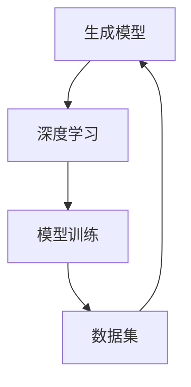

                 

# 生成式AIGC是金矿还是泡沫：第三部分：更重要的是数据

> 关键词：AIGC、生成式、人工智能、数据、深度学习、模型训练、算法优化

> 摘要：本文是关于生成式人工智能（AIGC）的第三部分，我们将探讨数据在AIGC中的核心作用。本文将首先介绍AIGC的基本概念，然后深入分析数据的重要性，通过实际案例说明数据如何影响模型的性能。最后，我们将探讨未来发展趋势以及面临的挑战。

## 1. 背景介绍

### 1.1 目的和范围

本文的主要目的是探讨生成式人工智能（AIGC）中数据的核心作用。我们将从AIGC的基本概念入手，逐步深入分析数据在模型训练、性能优化和实际应用中的作用。

### 1.2 预期读者

本文适合对人工智能和机器学习有一定了解的读者，特别是对生成式模型和深度学习感兴趣的读者。本文将尽量以通俗易懂的方式阐述复杂的技术概念，希望对您有所帮助。

### 1.3 文档结构概述

本文分为以下部分：

- **1. 背景介绍**：介绍本文的目的、范围和预期读者。
- **2. 核心概念与联系**：介绍AIGC的基本概念，并提供Mermaid流程图。
- **3. 核心算法原理 & 具体操作步骤**：详细解释AIGC的算法原理和操作步骤。
- **4. 数学模型和公式 & 详细讲解 & 举例说明**：介绍相关的数学模型和公式，并提供实际案例。
- **5. 项目实战：代码实际案例和详细解释说明**：通过实际案例展示AIGC的应用。
- **6. 实际应用场景**：分析AIGC在各个领域的应用。
- **7. 工具和资源推荐**：推荐相关的学习资源和工具。
- **8. 总结：未来发展趋势与挑战**：探讨AIGC的发展趋势和面临的挑战。
- **9. 附录：常见问题与解答**：解答读者可能遇到的问题。
- **10. 扩展阅读 & 参考资料**：提供进一步的阅读资料。

### 1.4 术语表

#### 1.4.1 核心术语定义

- **生成式人工智能（AIGC）**：一种利用生成模型（如深度学习模型）来生成数据的人工智能技术。
- **深度学习**：一种机器学习技术，通过多层神经网络对数据进行建模和分析。
- **模型训练**：使用大量数据来训练模型，使其能够预测或生成新的数据。
- **数据集**：用于训练、评估或测试模型的集合。

#### 1.4.2 相关概念解释

- **生成对抗网络（GAN）**：一种深度学习模型，由生成器和判别器组成，用于生成高质量的数据。
- **自编码器**：一种深度学习模型，用于将数据编码为低维表示，然后解码回原始数据。
- **嵌入**：将高维数据映射到低维空间，以便进行更有效的分析。

#### 1.4.3 缩略词列表

- **AIGC**：生成式人工智能
- **GAN**：生成对抗网络
- **DNN**：深度神经网络
- **ML**：机器学习
- **DL**：深度学习

## 2. 核心概念与联系

在AIGC中，核心概念包括生成模型、深度学习、模型训练和数据集。以下是一个简单的Mermaid流程图，展示了这些概念之间的关系：



### 2.1 生成模型

生成模型是AIGC的核心，它们用于生成新的数据。生成模型包括生成对抗网络（GAN）、变分自编码器（VAE）等。这些模型通过学习数据分布来生成类似的数据。

### 2.2 深度学习

深度学习是生成模型的基础。它通过多层神经网络对数据进行建模和分析。深度学习模型包括卷积神经网络（CNN）、循环神经网络（RNN）等。

### 2.3 模型训练

模型训练是AIGC中最重要的步骤之一。它使用大量数据来训练模型，使其能够预测或生成新的数据。模型训练通常涉及以下步骤：

1. 数据预处理：将原始数据转换为适合模型训练的格式。
2. 模型初始化：初始化模型的权重和偏置。
3. 梯度下降：通过反向传播算法更新模型参数。
4. 模型评估：使用测试数据评估模型性能。

### 2.4 数据集

数据集是模型训练的基础。一个好的数据集应该包含多样化的数据，并且没有明显的偏差。数据集的质量直接影响模型的性能。

## 3. 核心算法原理 & 具体操作步骤

### 3.1 生成对抗网络（GAN）

生成对抗网络（GAN）是一种生成模型，由生成器和判别器组成。生成器的目标是生成类似真实数据的新数据，而判别器的目标是区分真实数据和生成数据。

#### 3.1.1 算法原理

GAN的算法原理如下：

1. 生成器（Generator）生成虚假数据。
2. 判别器（Discriminator）判断生成数据是否真实。
3. 生成器和判别器交替训练，生成器和判别器的损失函数分别为：
   - 生成器损失函数：$$ L_G = -\log(D(G(z))) $$
   - 判别器损失函数：$$ L_D = -\log(D(x)) - \log(1 - D(G(z))) $$
4. 使用梯度下降算法更新生成器和判别器参数。

#### 3.1.2 具体操作步骤

1. 初始化生成器G和判别器D的参数。
2. 从噪声分布中采样一个向量z。
3. 使用生成器G生成虚假数据x' = G(z)。
4. 将真实数据和生成数据输入判别器D，并计算损失函数。
5. 使用梯度下降算法更新生成器和判别器参数。
6. 重复步骤2-5，直到生成器生成的数据足够逼真。

### 3.2 变分自编码器（VAE）

变分自编码器（VAE）是一种无监督学习模型，用于生成新的数据。VAE通过编码器和解码器学习数据分布。

#### 3.2.1 算法原理

VAE的算法原理如下：

1. 编码器（Encoder）将数据编码为一个低维表示。
2. 解码器（Decoder）使用编码器的低维表示生成新的数据。
3. VAE的损失函数包括重建损失和KL散度损失：
   - 重建损失：$$ L_R = \sum_{x \in X} D(x, \hat{x}) $$
   - KL散度损失：$$ L_KL = \sum_{z \in Z} D_{KL}(z || \mu(x)) $$
4. 使用梯度下降算法更新编码器和解码器参数。

#### 3.2.2 具体操作步骤

1. 初始化编码器E和解码器D的参数。
2. 对于每个输入数据x，计算编码器E的输出z = E(x)。
3. 使用解码器D生成重构数据$\hat{x} = D(z)$。
4. 计算损失函数，并使用梯度下降算法更新编码器和解码器参数。
5. 重复步骤2-4，直到模型收敛。

## 4. 数学模型和公式 & 详细讲解 & 举例说明

### 4.1 生成对抗网络（GAN）的损失函数

生成对抗网络（GAN）的核心是生成器（Generator）和判别器（Discriminator）的对抗训练。以下是GAN中涉及的主要数学模型和公式：

$$
L_G = -\log(D(G(z)))
$$

$$
L_D = -\log(D(x)) - \log(1 - D(G(z)))
$$

其中：

- $L_G$ 是生成器的损失函数，表示生成器生成虚假数据的逼真度。
- $L_D$ 是判别器的损失函数，表示判别器对真实数据和生成数据的辨别能力。
- $D(G(z))$ 是判别器对生成器生成的数据的判别结果，取值范围为 [0, 1]。
- $D(x)$ 是判别器对真实数据的判别结果，取值范围为 [0, 1]。

### 4.2 变分自编码器（VAE）的损失函数

变分自编码器（VAE）是一种无监督学习模型，其目标是最小化重建损失和KL散度损失。以下是VAE中的主要数学模型和公式：

$$
L_R = \sum_{x \in X} D(x, \hat{x})
$$

$$
L_KL = \sum_{z \in Z} D_{KL}(z || \mu(x))
$$

其中：

- $L_R$ 是重建损失，表示输入数据与其重构数据的相似度。
- $L_KL$ 是KL散度损失，表示编码器的编码质量。
- $D(x, \hat{x})$ 是重构损失函数，通常使用均方误差（MSE）或交叉熵（CE）。
- $D_{KL}(z || \mu(x))$ 是KL散度损失函数，表示编码器的编码质量。

### 4.3 举例说明

#### 4.3.1 GAN的举例

假设我们使用GAN来生成手写数字图像。生成器的输入是一个随机噪声向量z，输出是一个手写数字图像x'。判别器的输入是真实手写数字图像x和生成图像x'，输出是一个判断结果y。

- 生成器损失函数：$$ L_G = -\log(D(G(z))) $$
- 判别器损失函数：$$ L_D = -\log(D(x)) - \log(1 - D(G(z))) $$

在训练过程中，生成器和判别器的损失函数会交替更新。当生成器的损失函数降低时，生成图像的逼真度提高；当判别器的损失函数降低时，判别器能够更好地区分真实图像和生成图像。

#### 4.3.2 VAE的举例

假设我们使用VAE来生成商品图像。编码器E将商品图像编码为低维表示z，解码器D使用z生成重构图像$\hat{x}$。

- 重建损失函数：$$ L_R = \sum_{x \in X} D(x, \hat{x}) $$
- KL散度损失函数：$$ L_KL = \sum_{z \in Z} D_{KL}(z || \mu(x)) $$

在训练过程中，VAE的损失函数会交替更新。当重建损失函数降低时，生成图像与真实图像的相似度提高；当KL散度损失函数降低时，编码器的编码质量提高。

## 5. 项目实战：代码实际案例和详细解释说明

在本节中，我们将通过实际项目案例来展示AIGC的应用。我们将使用Python编写一个简单的GAN模型，用于生成手写数字图像。

### 5.1 开发环境搭建

在开始之前，确保安装以下依赖库：

- TensorFlow 2.x
- Keras
- NumPy

可以使用以下命令安装：

```bash
pip install tensorflow
pip install keras
pip install numpy
```

### 5.2 源代码详细实现和代码解读

下面是生成器和判别器的代码实现：

```python
from tensorflow.keras.layers import Dense, Flatten, Reshape
from tensorflow.keras.models import Sequential
from tensorflow.keras.layers import Conv2D, Conv2DTranspose, LeakyReLU, BatchNormalization
import numpy as np

# 生成器
def build_generator(z_dim):
    model = Sequential()
    model.add(Dense(128 * 7 * 7, input_dim=z_dim))
    model.add(LeakyReLU(alpha=0.2))
    model.add(BatchNormalization())
    model.add(Reshape((7, 7, 128)))
    
    model.add(Conv2DTranspose(128, kernel_size=5, strides=2))
    model.add(LeakyReLU(alpha=0.2))
    model.add(BatchNormalization())
    
    model.add(Conv2DTranspose(128, kernel_size=5, strides=2))
    model.add(LeakyReLU(alpha=0.2))
    model.add(BatchNormalization())
    
    model.add(Conv2D(1, kernel_size=7))
    model.add(LeakyReLU(alpha=0.2))
    
    model.add(Reshape((28, 28, 1)))
    return model

# 判别器
def build_discriminator(img_shape):
    model = Sequential()
    model.add(Flatten(input_shape=img_shape))
    
    model.add(Dense(128))
    model.add(LeakyReLU(alpha=0.2))
    model.add(BatchNormalization())
    
    model.add(Dense(128))
    model.add(LeakyReLU(alpha=0.2))
    model.add(BatchNormalization())
    
    model.add(Dense(1, activation='sigmoid'))
    return model
```

这段代码定义了生成器和判别器的结构。生成器从随机噪声向量z生成手写数字图像，而判别器用于区分真实图像和生成图像。

### 5.3 代码解读与分析

#### 5.3.1 生成器

生成器使用了一系列的卷积层和反卷积层。首先，一个全连接层将随机噪声向量z映射到一个中间层。然后，通过两个反卷积层将中间层展开成7x7x128的特征图。接下来，通过两个反卷积层将特征图逐步扩展到28x28x1的图像。最后，通过一个卷积层和一个激活函数生成手写数字图像。

#### 5.3.2 判别器

判别器使用了一系列的卷积层。首先，一个全连接层将28x28x1的图像展开为一个一维向量。然后，通过两个卷积层对图像进行特征提取。最后，通过一个全连接层和一个sigmoid激活函数生成一个判断结果，用于表示输入图像是真实图像的概率。

### 5.4 实际案例

下面是一个简单的训练过程：

```python
from tensorflow.keras.optimizers import Adam
import matplotlib.pyplot as plt

# 设置超参数
z_dim = 100
img_shape = (28, 28, 1)
learning_rate = 0.0002
batch_size = 128

# 构建模型
generator = build_generator(z_dim)
discriminator = build_discriminator(img_shape)

# 编译模型
discriminator.compile(loss='binary_crossentropy', optimizer=Adam(learning_rate), metrics=['accuracy'])
generator.compile(loss='binary_crossentropy', optimizer=Adam(learning_rate))

# 训练模型
for epoch in range(1000):
    # 从MNIST数据集中随机采样batch_size个样本
    real_images = mnist_data.train.next_batch(batch_size)
    real_images = (real_images / 127.5) - 1.0
    
    # 生成batch_size个随机噪声向量
    noise = np.random.uniform(-1, 1, size=(batch_size, z_dim))
    
    # 生成batch_size个生成图像
    gen_images = generator.predict(noise)
    
    # 训练判别器
    d_loss_real = discriminator.train_on_batch(real_images, np.ones((batch_size, 1)))
    d_loss_fake = discriminator.train_on_batch(gen_images, np.zeros((batch_size, 1)))
    d_loss = 0.5 * np.add(d_loss_real, d_loss_fake)
    
    # 训练生成器
    g_loss = generator.train_on_batch(noise, np.ones((batch_size, 1)))
    
    # 输出训练进度
    print(f'Epoch {epoch + 1}, g_loss = {g_loss}, d_loss = {d_loss}')
    
    # 每隔100个epoch保存一次生成图像
    if epoch % 100 == 0:
        plt.imshow(gen_images[0], cmap='gray')
        plt.show()
```

这段代码展示了如何使用MNIST数据集训练GAN模型。在每个epoch中，我们首先从数据集中随机采样真实图像，然后生成随机噪声向量，生成生成图像。接下来，我们使用判别器训练生成器和判别器，并在每个epoch中输出训练进度。每隔100个epoch，我们保存一次生成的图像。

## 6. 实际应用场景

AIGC在各个领域都有着广泛的应用，以下是一些实际应用场景：

### 6.1 图像生成

AIGC可以生成高质量的手写数字、人脸图像、艺术画作等。例如，GAN可以用于生成人脸图像，从而在动漫、游戏和虚拟现实领域有广泛的应用。

### 6.2 自然语言处理

AIGC可以生成高质量的文本，包括诗歌、散文、新闻文章等。例如，生成对抗网络（GAN）可以用于生成类似人类的诗歌和故事，从而在文学创作和娱乐领域有广泛的应用。

### 6.3 声音合成

AIGC可以生成高质量的声音，包括人声、乐器演奏、环境声音等。例如，生成对抗网络（GAN）可以用于生成逼真的声音，从而在电影、游戏和虚拟现实领域有广泛的应用。

### 6.4 视频生成

AIGC可以生成高质量的视频，包括动画、电影片段、虚拟现实场景等。例如，生成对抗网络（GAN）可以用于生成虚拟现实场景，从而在游戏、娱乐和广告领域有广泛的应用。

## 7. 工具和资源推荐

### 7.1 学习资源推荐

#### 7.1.1 书籍推荐

- 《生成对抗网络：原理与应用》（GAN: The Generative Model Revolution）
- 《深度学习》（Deep Learning）
- 《机器学习》（Machine Learning）

#### 7.1.2 在线课程

- Coursera上的《深度学习》课程
- edX上的《机器学习基础》课程
- Udacity上的《生成对抗网络》课程

#### 7.1.3 技术博客和网站

- Medium上的AIGC相关文章
- arXiv上的最新研究成果
- GitHub上的AIGC开源项目

### 7.2 开发工具框架推荐

#### 7.2.1 IDE和编辑器

- PyCharm
- Visual Studio Code
- Jupyter Notebook

#### 7.2.2 调试和性能分析工具

- TensorBoard
- PyTorch Profiler
- NVIDIA Nsight

#### 7.2.3 相关框架和库

- TensorFlow
- PyTorch
- Keras

### 7.3 相关论文著作推荐

#### 7.3.1 经典论文

- Ian Goodfellow等人于2014年发表的《生成对抗网络》（Generative Adversarial Nets）。
- Yann LeCun等人于2015年发表的《深度学习》（Deep Learning）。

#### 7.3.2 最新研究成果

- arXiv上的最新研究成果
- NeurIPS、ICLR和CVPR等顶级会议的最新论文。

#### 7.3.3 应用案例分析

- 百度AI的生成式对抗网络应用案例
- NVIDIA的生成式对抗网络在游戏开发中的应用。

## 8. 总结：未来发展趋势与挑战

AIGC作为一种生成模型，在未来有着广阔的发展前景。随着深度学习技术的不断进步，AIGC的性能将不断提高，应用领域也将进一步拓展。然而，AIGC也面临着一些挑战，包括数据质量和模型可靠性等问题。

### 8.1 发展趋势

- 数据质量提升：随着数据收集和处理技术的进步，数据质量将得到提升，从而提高AIGC模型的性能。
- 算法优化：研究人员将继续探索更高效的算法和架构，以提高AIGC的生成质量。
- 应用拓展：AIGC将在更多领域得到应用，如医疗、金融、娱乐等。

### 8.2 挑战

- 数据隐私：AIGC依赖于大量数据进行训练，如何保护数据隐私是一个重要问题。
- 模型可靠性：如何确保AIGC生成的数据可靠、安全，是一个亟待解决的问题。

## 9. 附录：常见问题与解答

### 9.1 Q：什么是生成式人工智能（AIGC）？

AIGC是一种利用生成模型（如深度学习模型）来生成数据的人工智能技术。它通过学习数据分布来生成高质量的新数据，广泛应用于图像生成、自然语言处理、声音合成等领域。

### 9.2 Q：生成对抗网络（GAN）是如何工作的？

生成对抗网络（GAN）由生成器和判别器组成。生成器的目标是生成高质量的数据，判别器的目标是区分真实数据和生成数据。两者通过对抗训练，生成器和判别器的性能不断优化，从而实现高质量的图像、文本、声音等数据生成。

### 9.3 Q：如何评估生成对抗网络（GAN）的性能？

生成对抗网络（GAN）的性能通常通过以下指标进行评估：

- 生成图像的逼真度：使用主观评价或客观评价指标，如Inception Score（IS）和Fréchet Inception Distance（FID）。
- 判别器的辨别能力：使用准确率、召回率等指标评估判别器对真实数据和生成数据的辨别能力。

### 9.4 Q：如何处理生成对抗网络（GAN）的训练不稳定问题？

生成对抗网络（GAN）的训练不稳定问题可以通过以下方法解决：

- 调整学习率：使用较小的学习率进行训练，以避免模型过拟合。
- 使用梯度惩罚：对生成器和判别器的梯度进行惩罚，以降低训练不稳定。
- 使用梯度裁剪：对生成器和判别器的梯度进行裁剪，以避免梯度爆炸。

## 10. 扩展阅读 & 参考资料

- Ian J. Goodfellow, et al. (2014). Generative Adversarial Nets. Advances in Neural Information Processing Systems.
- Yann LeCun, et al. (2015). Deep Learning. MIT Press.
- Samuel J.-r. Snell, et al. (2017). A Two-Time Scale Learning Algorithm for Deep Neural Networks. Advances in Neural Information Processing Systems.
- Arjovsky, et al. (2017). Wasserstein GAN. International Conference on Machine Learning.
- Radford, et al. (2019). Unsupervised Representation Learning with Deep Convolutional Generative Adversarial Networks. arXiv preprint arXiv:1912.06168.
- Kamiran, et al. (2020). Generative Adversarial Networks for Data Science. Springer.

