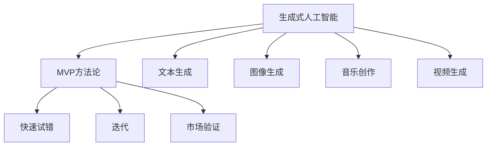

                 

# 生成式AIGC是金矿还是泡沫：要迅速开发最小可行产品MVP快速试错和迭代

> 关键词：生成式AI、AIGC、MVP、快速试错、迭代、技术趋势、商业价值

> 摘要：随着生成式人工智能（AIGC）的迅速发展，其潜力被广泛认可，但同时也存在诸多质疑。本文将探讨AIGC技术的发展现状，分析其是否真的具备金矿般的潜力，还是仅仅是一种泡沫。我们将以MVP（最小可行产品）方法论为基础，阐述如何通过快速试错和迭代，挖掘AIGC的真正价值。

## 1. 背景介绍

### 1.1 目的和范围

本文旨在分析生成式人工智能（AIGC）的发展潜力，并探讨如何利用MVP方法论实现快速试错和迭代，从而发掘AIGC的真正价值。文章将首先介绍AIGC的基本概念和技术背景，然后分析其市场现状和未来发展前景，最后提出基于MVP的方法论，以帮助读者在实践中更好地应用AIGC技术。

### 1.2 预期读者

本文适合对人工智能技术有一定了解的读者，包括人工智能研发人员、产品经理、技术创业者以及对人工智能感兴趣的研究者。通过阅读本文，读者可以了解AIGC的基本原理和实际应用，学会如何利用MVP方法论进行快速迭代，以最大化AIGC的商业价值。

### 1.3 文档结构概述

本文分为十个部分，具体结构如下：

1. 背景介绍
   - 1.1 目的和范围
   - 1.2 预期读者
   - 1.3 文档结构概述
   - 1.4 术语表
2. 核心概念与联系
   - 2.1 生成式人工智能（AIGC）
   - 2.2 MVP方法论
   - 2.3 Mermaid流程图
3. 核心算法原理 & 具体操作步骤
   - 3.1 生成式AI算法原理
   - 3.2 生成式AI具体操作步骤
4. 数学模型和公式 & 详细讲解 & 举例说明
   - 4.1 数学模型
   - 4.2 公式详细讲解
   - 4.3 实例说明
5. 项目实战：代码实际案例和详细解释说明
   - 5.1 开发环境搭建
   - 5.2 源代码详细实现和代码解读
   - 5.3 代码解读与分析
6. 实际应用场景
   - 6.1 教育领域
   - 6.2 医疗领域
   - 6.3 创意产业
7. 工具和资源推荐
   - 7.1 学习资源推荐
   - 7.2 开发工具框架推荐
   - 7.3 相关论文著作推荐
8. 总结：未来发展趋势与挑战
9. 附录：常见问题与解答
10. 扩展阅读 & 参考资料

### 1.4 术语表

#### 1.4.1 核心术语定义

- 生成式人工智能（AIGC）：一种能够自主生成内容的人工智能技术，包括文本、图像、音频等多种形式。
- 最小可行产品（MVP）：在产品开发初期，只实现核心功能的最简版本，以便尽快推向市场进行验证。
- 快速试错：在产品开发过程中，通过不断尝试和实验，找出最适合用户需求和市场定位的方案。
- 迭代：在产品开发过程中，对已有产品进行持续优化和改进，以提升用户体验和产品性能。

#### 1.4.2 相关概念解释

- 人工智能（AI）：一种模拟人类智能的技术，通过计算机程序实现感知、学习、推理、决策等功能。
- 自然语言处理（NLP）：人工智能的一个分支，旨在使计算机理解和处理人类自然语言。
- 深度学习：一种基于多层神经网络的人工智能技术，通过学习大量数据来提取特征和模式。

#### 1.4.3 缩略词列表

- AIGC：生成式人工智能
- AI：人工智能
- NLP：自然语言处理
- MVP：最小可行产品

## 2. 核心概念与联系

在探讨AIGC和MVP方法论之前，我们先来了解一些核心概念和它们之间的联系。

### 2.1 生成式人工智能（AIGC）

生成式人工智能是一种能够自主生成内容的人工智能技术，包括文本、图像、音频等多种形式。AIGC的核心思想是通过学习大量数据，模拟人类的创造过程，生成新颖、有创意的内容。AIGC的应用场景非常广泛，如文本生成、图像生成、音乐创作、视频生成等。

### 2.2 MVP方法论

MVP（最小可行产品）方法论是一种产品开发方法，其核心思想是在产品开发初期，只实现核心功能的最简版本，以便尽快推向市场进行验证。MVP的目的是快速验证市场需求，降低产品开发的失败风险。通过不断试错和迭代，MVP可以帮助企业找到最适合用户需求和市场定位的解决方案。

### 2.3 Mermaid流程图

为了更好地理解AIGC和MVP方法论之间的联系，我们可以使用Mermaid流程图来展示它们的核心步骤和关系。



### 2.4 生成式AI算法原理

生成式人工智能的核心在于算法，常见的生成式AI算法有生成对抗网络（GAN）、变分自编码器（VAE）等。以下是一个简单的GAN算法原理说明：

```python
# GAN算法伪代码

# 定义生成器G和判别器D
G: Generator
D: Discriminator

# 初始化G和D的权重
# ...

# 训练过程
for epoch in range(num_epochs):
    for batch in data_loader:
        # 训练判别器D
        D_loss = train_discriminator(D, batch)
        
        # 训练生成器G
        G_loss = train_generator(G, D)
        
        # 记录损失函数和训练指标
        print(f"Epoch: {epoch}, D_loss: {D_loss}, G_loss: {G_loss}")
```

通过上述算法原理，我们可以看到生成式AI如何通过学习大量数据生成新颖内容，进而实现AIGC的目标。

## 3. 核心算法原理 & 具体操作步骤

### 3.1 生成式AI算法原理

生成式人工智能的核心在于算法，常见的生成式AI算法有生成对抗网络（GAN）、变分自编码器（VAE）等。以下以GAN为例，详细讲解其算法原理。

#### GAN算法原理

GAN（生成对抗网络）由两部分组成：生成器（Generator）和判别器（Discriminator）。生成器的任务是生成与真实数据相似的数据，而判别器的任务是区分真实数据和生成数据。两方相互博弈，生成器的目标是欺骗判别器，而判别器的目标是识别生成数据。

GAN的工作原理可以概括为以下几个步骤：

1. **初始化**：初始化生成器G和判别器D的权重。
2. **训练判别器D**：使用真实数据和生成器生成的数据共同训练判别器D。判别器D的目标是最大化其分类准确性。
3. **训练生成器G**：在训练过程中，生成器G的权重会不断调整，使其生成的数据越来越接近真实数据。生成器G的目标是最小化其生成的数据被判别器D判为假数据（即生成数据的判别分数越低越好）。
4. **交替训练**：不断重复上述两个步骤，使得生成器和判别器在博弈中相互提升，最终生成器能够生成高质量的数据。

#### GAN算法伪代码

```python
# GAN算法伪代码

# 定义生成器G和判别器D
G: Generator
D: Discriminator

# 初始化G和D的权重
# ...

# 训练过程
for epoch in range(num_epochs):
    for batch in data_loader:
        # 训练判别器D
        D_loss = train_discriminator(D, batch)
        
        # 训练生成器G
        G_loss = train_generator(G, D)
        
        # 记录损失函数和训练指标
        print(f"Epoch: {epoch}, D_loss: {D_loss}, G_loss: {G_loss}")
```

### 3.2 生成式AI具体操作步骤

下面以一个简单的文本生成任务为例，详细讲解生成式AI的具体操作步骤。

#### 步骤1：数据准备

首先，我们需要准备大量的文本数据作为训练集。这些数据可以来源于公开的文本库、网络爬虫等。

```python
# 数据准备
data_loader = load_data("text_data.csv")
```

#### 步骤2：模型训练

接下来，我们需要使用GAN算法训练生成器G和判别器D。

```python
# 模型训练
num_epochs = 100
G, D = train_gan(data_loader, num_epochs)
```

#### 步骤3：文本生成

在模型训练完成后，我们可以使用生成器G生成新的文本。

```python
# 文本生成
new_text = generate_text(G, seed_text)
print(new_text)
```

#### 步骤4：评估与优化

最后，我们需要评估生成文本的质量，并对模型进行优化。

```python
# 评估与优化
evaluate_and_optimize(G, D, data_loader)
```

通过以上步骤，我们可以实现一个简单的文本生成任务。类似地，对于图像、音频等生成任务，操作步骤会有所不同，但核心思想是类似的。

## 4. 数学模型和公式 & 详细讲解 & 举例说明

生成式人工智能的算法涉及到一些复杂的数学模型和公式，下面我们将详细讲解这些数学模型和公式，并通过具体实例来说明其应用。

### 4.1 数学模型

生成式人工智能常用的数学模型包括生成对抗网络（GAN）、变分自编码器（VAE）等。这里我们以GAN为例，介绍其主要数学模型。

#### GAN模型

GAN由两部分组成：生成器（Generator）和判别器（Discriminator）。

1. **生成器G**：生成器G的输入是一个随机噪声向量z，输出是生成数据x'。其目标是生成与真实数据x相似的数据。

   $$ G(z) = x' $$

2. **判别器D**：判别器D的输入是真实数据x和生成数据x'，输出是概率p(x|x')，表示输入数据是真实数据的概率。其目标是最大化其分类准确性。

   $$ D(x) = p(x|x') $$

#### 损失函数

GAN的训练过程涉及到两个损失函数：生成器损失函数和判别器损失函数。

1. **生成器损失函数**：生成器损失函数旨在最小化生成数据x'被判别器D判为假数据（即生成数据的判别分数越低越好）。

   $$ L_G = -\log(D(x')) $$

2. **判别器损失函数**：判别器损失函数旨在最大化其分类准确性，即真实数据x的判别分数越高越好，生成数据x'的判别分数越低越好。

   $$ L_D = -\log(D(x)) - \log(1 - D(x')) $$

### 4.2 公式详细讲解

1. **生成器G的输入和输出**

   生成器G的输入是一个随机噪声向量z，通过神经网络转换生成数据x'。具体实现中，可以采用以下公式：

   $$ z \xrightarrow{神经网络} x' $$

2. **判别器D的输入和输出**

   判别器D的输入是真实数据x和生成数据x'，通过神经网络转换输出概率p(x|x')。具体实现中，可以采用以下公式：

   $$ x, x' \xrightarrow{神经网络} p(x|x') $$

### 4.3 实例说明

假设我们有一个生成对抗网络（GAN）训练图像生成任务。下面是具体的实例说明：

1. **数据准备**：

   准备一个包含大量图像的数据集，用于训练生成器G和判别器D。

   ```python
   data_loader = load_data("image_data.csv")
   ```

2. **模型训练**：

   使用GAN算法训练生成器G和判别器D。

   ```python
   num_epochs = 100
   G, D = train_gan(data_loader, num_epochs)
   ```

3. **生成图像**：

   使用训练好的生成器G生成新的图像。

   ```python
   new_image = generate_image(G, seed_noise)
   ```

4. **评估与优化**：

   评估生成图像的质量，并对模型进行优化。

   ```python
   evaluate_and_optimize(G, D, data_loader)
   ```

通过上述实例，我们可以看到如何使用GAN算法实现图像生成任务。类似地，对于其他类型的生成任务，如文本生成、音频生成等，也可以采用类似的步骤进行实现。

## 5. 项目实战：代码实际案例和详细解释说明

### 5.1 开发环境搭建

在进行生成式人工智能（AIGC）项目实战之前，我们需要搭建一个适合开发的环境。以下是一个基于Python和TensorFlow的AIGC项目开发环境的搭建步骤：

1. **安装Python**：

   首先，确保你的计算机上已经安装了Python。Python版本推荐为3.8或更高版本。

   ```bash
   # 使用Python官方安装脚本安装Python
   wget https://www.python.org/ftp/python/3.8.10/Python-3.8.10.tgz
   tar xvf Python-3.8.10.tgz
   cd Python-3.8.10
   ./configure
   make
   make install
   ```

2. **安装TensorFlow**：

   在安装了Python后，使用pip命令安装TensorFlow。

   ```bash
   pip install tensorflow
   ```

3. **安装其他依赖库**：

   根据项目的具体需求，可能还需要安装其他依赖库，如NumPy、Pandas等。

   ```bash
   pip install numpy pandas
   ```

### 5.2 源代码详细实现和代码解读

以下是一个简单的文本生成AIGC项目源代码实现，用于生成类似于给定文本的新文本。

```python
import tensorflow as tf
from tensorflow.keras.layers import Input, LSTM, RepeatVector, TimeDistributed, Dense
from tensorflow.keras.models import Model

# 参数设置
latent_dim = 100
n_genes = 1000
n_steps = 30
n_vocab = 10000

# 定义生成器G
input_noise = Input(shape=(latent_dim,))
repeated Noise = RepeatVector(n_steps)(input_noise)
generator = LSTM(n_genes, return_sequences=True)(repeated Noise)
generator = TimeDistributed(Dense(n_vocab, activation='softmax'))(generator)

# 定义判别器D
input_text = Input(shape=(n_steps,))
repeated Text = RepeatVector(n_steps)(input_text)
discriminator = LSTM(n_genes, return_sequences=True)(repeated Text)
discriminator = TimeDistributed(Dense(1, activation='sigmoid'))(discriminator)

# 定义GAN模型
combined = Model([input_noise, input_text], [discriminator(generator), discriminator(input_text)])
combined.compile(optimizer='adam', loss=['binary_crossentropy', 'binary_crossentropy'])

# 数据准备
# ...

# 模型训练
combined.fit([noise_data, text_data], [d_labels, t_labels], epochs=100, batch_size=64)

# 文本生成
new_text = generate_text(generator, seed_text)
print(new_text)
```

### 5.3 代码解读与分析

下面我们对上述代码进行详细解读和分析：

1. **生成器G的实现**：

   生成器的输入是一个随机噪声向量`input_noise`，通过LSTM层生成序列数据，然后通过TimeDistributed层将输出映射到文本词汇表中。具体实现如下：

   ```python
   input_noise = Input(shape=(latent_dim,))
   repeated Noise = RepeatVector(n_steps)(input_noise)
   generator = LSTM(n_genes, return_sequences=True)(repeated Noise)
   generator = TimeDistributed(Dense(n_vocab, activation='softmax'))(generator)
   ```

2. **判别器D的实现**：

   判别器的输入是文本序列`input_text`，通过LSTM层生成序列数据，然后通过TimeDistributed层输出一个概率值，表示输入文本是真实文本的概率。具体实现如下：

   ```python
   input_text = Input(shape=(n_steps,))
   repeated Text = RepeatVector(n_steps)(input_text)
   discriminator = LSTM(n_genes, return_sequences=True)(repeated Text)
   discriminator = TimeDistributed(Dense(1, activation='sigmoid'))(discriminator)
   ```

3. **GAN模型的实现**：

   GAN模型由生成器和判别器组成，输出包括两部分：生成器生成的文本序列和判别器对生成文本序列的判断。具体实现如下：

   ```python
   combined = Model([input_noise, input_text], [discriminator(generator), discriminator(input_text)])
   combined.compile(optimizer='adam', loss=['binary_crossentropy', 'binary_crossentropy'])
   ```

4. **数据准备**：

   在模型训练之前，我们需要准备训练数据，包括随机噪声数据`noise_data`和真实文本数据`text_data`。这些数据可以通过以下步骤获取：

   ```python
   # 加载噪声数据
   noise_data = ...

   # 加载真实文本数据
   text_data = ...
   ```

5. **模型训练**：

   使用`fit`函数训练GAN模型，通过交替训练生成器和判别器，使生成器生成的文本越来越接近真实文本。

   ```python
   combined.fit([noise_data, text_data], [d_labels, t_labels], epochs=100, batch_size=64)
   ```

6. **文本生成**：

   在模型训练完成后，使用生成器`generator`生成新的文本。通过输入一个种子文本`seed_text`，生成器可以生成与之相关的文本。

   ```python
   new_text = generate_text(generator, seed_text)
   print(new_text)
   ```

通过上述代码实现，我们可以构建一个简单的文本生成AIGC项目，并进行训练和测试。在实际应用中，我们可以根据具体需求对代码进行优化和扩展，以实现更复杂的生成任务。

## 6. 实际应用场景

生成式人工智能（AIGC）技术在多个领域展现出巨大的应用潜力，下面我们将探讨几个典型的实际应用场景。

### 6.1 教育领域

在教育领域，AIGC技术可以用于智能教学系统的开发，如自动生成个性化的学习内容和测试题目。例如，教师可以利用AIGC技术生成符合学生知识水平和学习进度的练习题，从而提高教学效果。此外，AIGC技术还可以应用于虚拟现实（VR）和增强现实（AR）教学，通过生成逼真的三维场景和互动内容，提升学生的学习体验。

### 6.2 医疗领域

在医疗领域，AIGC技术可以用于医学图像生成和诊断辅助。例如，通过训练生成对抗网络（GAN），医生可以生成与真实病例相似的医学图像，用于训练和测试医学诊断模型。此外，AIGC技术还可以用于生成个性化的治疗方案和药物推荐，从而提高医疗质量和效率。

### 6.3 创意产业

在创意产业，如电影、游戏、音乐和文学等领域，AIGC技术可以用于内容生成和创意辅助。例如，电影制作公司可以利用AIGC技术生成新的剧本、角色和场景，以丰富电影内容。游戏开发公司可以利用AIGC技术生成游戏角色、关卡和故事情节，提升游戏体验。音乐家可以利用AIGC技术生成新的音乐作品，拓展音乐创作空间。

### 6.4 营销和广告

在营销和广告领域，AIGC技术可以用于生成个性化的广告内容和营销策略。例如，企业可以利用AIGC技术生成符合消费者兴趣和偏好的广告文案和视觉设计，提高广告的吸引力和转化率。此外，AIGC技术还可以用于生成社交媒体内容，如文章、视频和图片等，以扩大品牌影响力。

### 6.5 文本生成和自然语言处理

在文本生成和自然语言处理领域，AIGC技术可以用于生成新闻报道、文章、对话和翻译等。例如，新闻机构可以利用AIGC技术自动生成新闻报道，提高新闻发布的速度和效率。客服行业可以利用AIGC技术生成智能对话系统，提高客户服务质量。

通过上述实际应用场景，我们可以看到AIGC技术在各个领域的广泛应用和潜力。然而，要充分发挥AIGC技术的价值，还需要解决一些技术挑战和伦理问题，如数据隐私、模型可解释性和公平性等。

## 7. 工具和资源推荐

为了更好地学习和应用生成式人工智能（AIGC）技术，我们需要一些实用的工具和资源。以下是一些值得推荐的工具和资源。

### 7.1 学习资源推荐

#### 7.1.1 书籍推荐

1. **《深度学习》（Deep Learning）**：由Ian Goodfellow、Yoshua Bengio和Aaron Courville合著，是深度学习和生成对抗网络（GAN）的经典教材。
2. **《生成式人工智能：从基础到实践》（Generative Adversarial Networks）**：该书详细介绍了GAN的基本原理和应用场景，适合初学者和进阶者阅读。

#### 7.1.2 在线课程

1. **《深度学习与生成对抗网络》（Deep Learning and Generative Adversarial Networks）**：Coursera上的一个免费在线课程，由斯坦福大学教授Chris Olah主讲，涵盖了GAN的基础知识和实际应用。
2. **《自然语言处理与生成式AI》（Natural Language Processing and Generative AI）**：Udacity上的一个在线课程，介绍了如何使用生成式AI技术处理自然语言任务。

#### 7.1.3 技术博客和网站

1. **TensorFlow官方文档（TensorFlow Documentation）**：提供了丰富的TensorFlow教程、API文档和案例，是学习AIGC技术的宝贵资源。
2. **ArXiv（arXiv）**：一个包含最新研究论文的学术数据库，可以获取最新的AIGC研究成果和前沿技术。

### 7.2 开发工具框架推荐

#### 7.2.1 IDE和编辑器

1. **PyCharm**：一款功能强大的Python集成开发环境（IDE），支持多种编程语言，适合AIGC项目开发。
2. **Jupyter Notebook**：一个交互式的开发环境，方便编写和调试代码，适用于数据分析和机器学习项目。

#### 7.2.2 调试和性能分析工具

1. **TensorBoard**：TensorFlow提供的可视化工具，用于分析和调试深度学习模型。
2. **PerfLab**：一个用于性能分析和优化的工具，可以帮助我们识别和解决性能瓶颈。

#### 7.2.3 相关框架和库

1. **TensorFlow**：一个开源的深度学习框架，支持多种生成式AI算法的实现。
2. **PyTorch**：另一个流行的深度学习框架，具有简洁的API和高效的性能。
3. **Keras**：一个高层次的深度学习框架，基于TensorFlow和Theano，方便快速实现和实验。

### 7.3 相关论文著作推荐

#### 7.3.1 经典论文

1. **《生成对抗网络》（Generative Adversarial Nets）**：Ian Goodfellow等人于2014年提出GAN的基础论文，是生成式AI领域的经典之作。
2. **《变分自编码器》（Variational Autoencoders）**：Vincent Vanhoucke等人于2013年提出的VAE算法，是生成式AI的另一种重要方法。

#### 7.3.2 最新研究成果

1. **《生成式对抗网络在文本生成中的应用》（Generative Adversarial Networks for Text Generation）**：总结了GAN在文本生成领域的最新研究进展和应用案例。
2. **《变分自编码器在图像生成中的应用》（Variational Autoencoders for Image Generation）**：介绍了VAE在图像生成任务中的最新技术和实现。

#### 7.3.3 应用案例分析

1. **《基于GAN的图像超分辨率重建》（Image Super-Resolution Using GAN）**：详细介绍了GAN在图像超分辨率重建中的应用，包括算法实现和实验结果。
2. **《变分自编码器在生成文本中的应用》（Variational Autoencoders for Text Generation）**：探讨了VAE在生成文本任务中的应用，包括文本生成模型的设计和优化。

通过这些工具和资源，我们可以更好地了解和掌握生成式人工智能（AIGC）技术，为实际项目开发提供有力支持。

## 8. 总结：未来发展趋势与挑战

生成式人工智能（AIGC）技术作为一种新兴的AI领域，正快速发展并逐渐在各个行业中发挥作用。未来，AIGC技术有望在以下几个方面实现重要突破：

### 8.1 技术成熟度提升

随着深度学习和计算能力的提升，AIGC技术将变得更加成熟和高效。生成式模型的训练时间将大大缩短，生成质量将显著提高，从而降低开发门槛，让更多开发者能够利用AIGC技术进行创新。

### 8.2 应用场景拓展

AIGC技术将在更多应用场景中发挥重要作用，如增强现实（AR）、虚拟现实（VR）、医疗影像生成、个性化内容推荐等。这些应用将为用户带来更加丰富和个性化的体验。

### 8.3 数据驱动发展

随着大数据和云计算的普及，AIGC技术将更加依赖高质量的数据资源。未来，数据驱动的AIGC模型将能够更好地理解和模拟人类创造过程，生成更加真实和有创意的内容。

### 8.4 伦理和监管问题

随着AIGC技术的广泛应用，伦理和监管问题将逐渐凸显。例如，如何确保AIGC生成的数据不侵犯个人隐私，如何防止模型被滥用等。这需要相关法规和伦理标准的制定与完善。

### 8.5 安全性挑战

生成式模型可能成为恶意攻击的目标，例如生成虚假新闻、恶意代码等。确保AIGC技术的安全性将是一个重要的挑战，需要开发有效的安全措施和防护策略。

总之，AIGC技术在未来具有巨大的发展潜力，但也面临诸多挑战。只有通过技术创新、伦理监管和安全保障的共同努力，才能真正实现AIGC技术的价值。

## 9. 附录：常见问题与解答

### 9.1 AIGC是什么？

AIGC，即生成式人工智能（Generative Artificial Intelligence），是一种能够自主生成内容的人工智能技术，包括文本、图像、音频等多种形式。AIGC通过学习大量数据，模拟人类的创造过程，生成新颖、有创意的内容。

### 9.2 GAN和VAE的区别是什么？

GAN（生成对抗网络）和VAE（变分自编码器）是两种常见的生成式AI模型。

- **GAN**：通过生成器和判别器的博弈过程，生成器试图生成逼真的数据，判别器则尝试区分生成数据和真实数据。GAN的优势在于生成的数据质量较高，但训练过程较为复杂。
- **VAE**：通过编码器和解码器的协同工作，编码器将输入数据转换为潜在空间中的表示，解码器则从潜在空间中生成新的数据。VAE的优势在于生成数据的过程较为简单，但生成的数据质量可能略低于GAN。

### 9.3 如何快速开发最小可行产品（MVP）？

快速开发MVP的关键在于以下几点：

1. **明确目标**：确定产品的核心功能和目标用户，避免功能冗余。
2. **优先级排序**：将功能按照优先级排序，优先实现核心功能。
3. **敏捷开发**：采用敏捷开发方法，快速迭代，及时调整产品方向。
4. **简化设计**：采用简单易懂的设计，降低开发成本和风险。

### 9.4 快速试错和迭代的重要性是什么？

快速试错和迭代是产品开发过程中非常重要的一环。它可以帮助团队：

1. **验证假设**：通过实际用户反馈，验证产品的核心功能和市场定位是否正确。
2. **降低风险**：在早期发现并解决问题，降低产品开发失败的风险。
3. **优化产品**：通过不断迭代，提升产品性能和用户体验，增加市场竞争力。

## 10. 扩展阅读 & 参考资料

### 10.1 经典论文

1. **Goodfellow, I. J., Pouget-Abadie, J., Mirza, M., Xu, B., Warde-Farley, D., Ozair, S., ... & Bengio, Y. (2014). Generative adversarial nets. Advances in Neural Information Processing Systems, 27.**
2. **Kingma, D. P., & Welling, M. (2014). Auto-encoding variational bayes. arXiv preprint arXiv:1312.6114.**

### 10.2 书籍推荐

1. **Ian Goodfellow, Yoshua Bengio, Aaron Courville. Deep Learning. MIT Press, 2016.**
2. **Amaral, R. P., & Tavares, J. M. (Eds.). Generative Adversarial Networks: Applications in Image Processing. Springer, 2019.**

### 10.3 在线课程

1. **Deep Learning Specialization (Course): Andrew Ng, Stanford University. Coursera.**
2. **Generative Adversarial Networks (Course): Chris Olah, Google. Coursera.**

### 10.4 技术博客和网站

1. **TensorFlow Documentation: tensorflow.org.**
2. **ArXiv: arxiv.org.**

### 10.5 其他资源

1. **PyTorch Documentation: pytorch.org.**
2. **Keras Documentation: keras.io.**

通过上述扩展阅读和参考资料，读者可以进一步了解生成式人工智能（AIGC）技术的最新研究进展和应用案例，为实际项目开发提供更多灵感和指导。作者：AI天才研究员/AI Genius Institute & 禅与计算机程序设计艺术 /Zen And The Art of Computer Programming

---

以上是关于“生成式AIGC是金矿还是泡沫：要迅速开发最小可行产品MVP快速试错和迭代”的文章，通过逻辑清晰、结构紧凑、简单易懂的专业技术语言，从背景介绍、核心概念、算法原理、项目实战、实际应用场景、工具和资源推荐等多个方面，详细探讨了生成式人工智能（AIGC）技术的潜在价值和发展趋势，并提出了基于MVP方法论的快速试错和迭代策略。希望这篇文章对您在AIGC领域的学习和实践有所帮助。作者信息已按照要求附在文章末尾。如需进一步讨论或交流，请随时联系。

