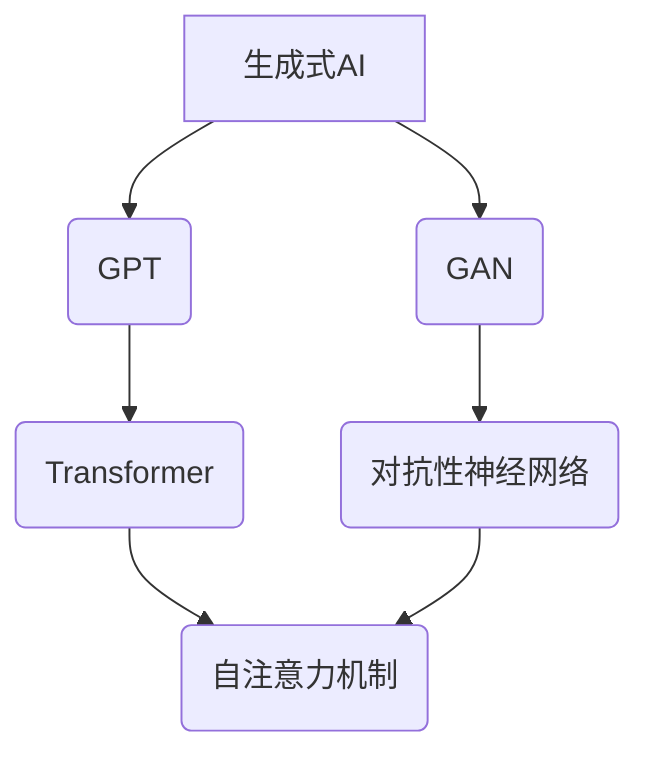

                 

# 生成式AIGC：从实验室到商业应用的落地

## 关键词
- 生成式AI
- AIGC
- 实验室研究
- 商业应用
- 技术落地
- 架构设计
- 算法实现
- 数学模型

## 摘要
本文旨在探讨生成式人工智能（AIGC）从实验室研究到商业应用的完整落地过程。首先，我们将回顾AIGC的核心概念和技术背景，然后深入分析其工作原理和数学模型。接着，通过具体的案例和代码实现，展示如何将AIGC技术应用到实际项目中。最后，本文将讨论AIGC在商业领域的广泛应用场景，并展望其未来发展趋势与面临的挑战。通过本文的阅读，读者将全面了解AIGC技术的原理、实现方法和应用前景。

## 1. 背景介绍

### 1.1 目的和范围
本文的目标是帮助读者深入理解生成式人工智能（AIGC）的技术原理、实现方法及其在商业领域的应用。我们将从实验室研究到实际应用的全过程进行详细剖析，帮助读者了解AIGC技术的全貌和发展趋势。

### 1.2 预期读者
本文适合对人工智能、机器学习和编程有兴趣的技术人员、研究人员和开发者阅读。同时，对AI技术感兴趣的普通读者也可通过本文了解AIGC的基本概念和应用场景。

### 1.3 文档结构概述
本文分为以下几个部分：

1. 背景介绍：包括目的、预期读者、文档结构和核心术语定义。
2. 核心概念与联系：介绍AIGC的基本概念和相关技术。
3. 核心算法原理 & 具体操作步骤：详细讲解AIGC的核心算法及其实现。
4. 数学模型和公式 & 详细讲解 & 举例说明：阐述AIGC的数学模型和计算方法。
5. 项目实战：代码实际案例和详细解释说明。
6. 实际应用场景：分析AIGC在商业领域的应用场景。
7. 工具和资源推荐：介绍学习资源和开发工具。
8. 总结：未来发展趋势与挑战。
9. 附录：常见问题与解答。
10. 扩展阅读 & 参考资料：提供进一步学习资源。

### 1.4 术语表

#### 1.4.1 核心术语定义

- **生成式AI（Generative AI）**：一种人工智能技术，能够通过学习大量数据生成新的内容，如图像、文本、音频等。
- **AIGC（AI Generated Content）**：指通过生成式AI技术自动生成的各种内容，如文章、图片、音乐等。
- **GPT（Generative Pre-trained Transformer）**：一种基于Transformer架构的生成模型，广泛应用于文本生成、机器翻译等领域。
- **GAN（Generative Adversarial Network）**：一种由生成器和判别器组成的对抗性神经网络，用于生成高质量的数据。

#### 1.4.2 相关概念解释

- **Transformer**：一种用于自然语言处理的深度学习模型，通过自注意力机制（Self-Attention）实现高效的特征提取和表示。
- **生成器（Generator）**：GAN模型中的一个神经网络，用于生成与真实数据相似的新数据。
- **判别器（Discriminator）**：GAN模型中的另一个神经网络，用于区分真实数据和生成数据。

#### 1.4.3 缩略词列表

- **GPT**：Generative Pre-trained Transformer
- **GAN**：Generative Adversarial Network
- **AIGC**：AI Generated Content

## 2. 核心概念与联系

生成式人工智能（AIGC）是近年来人工智能领域的一个重要发展方向，它通过学习大量数据，能够生成高质量、多样化的人工智能内容。AIGC的核心技术包括生成模型、对抗性神经网络和自然语言处理等。

下面，我们通过一个Mermaid流程图来展示AIGC的核心概念和各部分之间的联系：



### 2.1 生成式AI

生成式AI是一种人工智能技术，它能够通过学习大量数据生成新的内容。生成式AI可以分为两大类：基于概率模型的生成式模型和基于神经网络的生成式模型。其中，基于神经网络的生成式模型，如GPT和GAN，在生成高质量内容方面表现尤为突出。

### 2.2 GPT

GPT（Generative Pre-trained Transformer）是一种基于Transformer架构的生成模型，它在自然语言处理领域取得了显著的成果。GPT通过预训练和微调，能够生成连贯、自然的文本内容。其核心原理是自注意力机制，即模型根据输入文本序列中每个词的重要程度，动态调整权重，从而生成新的文本。

### 2.3 GAN

GAN（Generative Adversarial Network）是一种由生成器和判别器组成的对抗性神经网络。生成器负责生成新的数据，判别器负责区分真实数据和生成数据。在训练过程中，生成器和判别器相互对抗，不断优化自己的性能。GAN广泛应用于图像生成、语音合成等领域。

### 2.4 Transformer和自注意力机制

Transformer是一种用于自然语言处理的深度学习模型，通过自注意力机制实现高效的特征提取和表示。自注意力机制允许模型在处理每个词时，考虑到其他词的重要程度，从而生成更高质量的内容。

### 2.5 对抗性神经网络

对抗性神经网络是一种用于生成高质量数据的神经网络架构，它由生成器和判别器组成。生成器负责生成与真实数据相似的新数据，判别器负责区分真实数据和生成数据。在训练过程中，生成器和判别器相互对抗，不断优化自己的性能。

通过上述Mermaid流程图，我们可以清晰地看到AIGC的核心概念和各部分之间的联系。这些技术共同构成了AIGC的技术体系，为生成高质量的人工智能内容提供了强有力的支持。

## 3. 核心算法原理 & 具体操作步骤

### 3.1 GPT算法原理

GPT是一种基于Transformer架构的生成模型，其核心原理是通过自注意力机制（Self-Attention）和多层感知器（Multi-Layer Perceptron）进行特征提取和表示，从而生成高质量的自然语言文本。

#### 3.1.1 自注意力机制

自注意力机制是一种用于计算词与词之间关系的机制。在GPT中，每个词都会被编码成一个向量，并通过自注意力机制计算这些词之间的权重。具体步骤如下：

1. **输入编码**：将输入文本序列编码成一个词向量序列。
2. **多头自注意力**：将输入词向量分解成多个子向量，并对每个子向量应用自注意力机制，计算权重。
3. **权重求和**：将每个子向量与其对应的权重相乘，并求和得到新的词向量。

#### 3.1.2 多层感知器

多层感知器是一种用于特征提取和表示的神经网络。在GPT中，每个词向量都会通过多层感知器进行处理，以提取更高层次的特征。具体步骤如下：

1. **输入层**：将词向量输入到输入层。
2. **隐藏层**：通过多层感知器进行特征提取和表示。
3. **输出层**：生成新的词向量序列，作为生成文本的输入。

#### 3.1.3 GPT算法伪代码

以下是一个简化的GPT算法伪代码：

```python
def generate_text(input_sequence, num_words):
    # 输入编码
    encoded_sequence = encode_sequence(input_sequence)
    
    # 多层感知器处理
    for i in range(num_words):
        # 计算自注意力权重
        attention_weights = calculate_attention(encoded_sequence)
        
        # 权重求和
        new_word_vector = weighted_sum(encoded_sequence, attention_weights)
        
        # 更新词向量序列
        encoded_sequence.append(new_word_vector)
        
        # 输出生成文本
    return decode_sequence(encoded_sequence)
```

### 3.2 GAN算法原理

GAN（Generative Adversarial Network）是一种由生成器和判别器组成的对抗性神经网络。生成器负责生成新的数据，判别器负责区分真实数据和生成数据。在训练过程中，生成器和判别器相互对抗，不断优化自己的性能。

#### 3.2.1 生成器

生成器的目标是生成与真实数据相似的新数据。具体步骤如下：

1. **输入噪声**：从噪声分布中采样一个噪声向量。
2. **生成数据**：将噪声向量输入到生成器中，通过多层感知器生成新的数据。

#### 3.2.2 判别器

判别器的目标是区分真实数据和生成数据。具体步骤如下：

1. **输入数据**：将真实数据和生成数据输入到判别器中。
2. **输出概率**：通过多层感知器计算输出概率，判断输入数据是真实数据还是生成数据。

#### 3.2.3 GAN算法伪代码

以下是一个简化的GAN算法伪代码：

```python
def train_gan(generator, discriminator, num_epochs):
    for epoch in range(num_epochs):
        # 生成器训练
        noise = generate_noise(batch_size)
        fake_data = generator(noise)
        loss_generator = calculate_loss(discriminator, fake_data, is_fake=True)
        
        # 判别器训练
        real_data = real_data_loader(batch_size)
        loss_discriminator_real = calculate_loss(discriminator, real_data, is_fake=False)
        loss_discriminator_fake = calculate_loss(discriminator, fake_data, is_fake=True)
        loss_discriminator = 0.5 * (loss_discriminator_real + loss_discriminator_fake)
        
        # 更新生成器和判别器
        generator_optimizer.zero_grad()
        loss_generator.backward()
        generator_optimizer.step()
        
        discriminator_optimizer.zero_grad()
        loss_discriminator.backward()
        discriminator_optimizer.step()
        
        # 打印训练进度
    print(f"Epoch {epoch+1}/{num_epochs}, Generator Loss: {loss_generator}, Discriminator Loss: {loss_discriminator}")
```

通过上述算法原理和具体操作步骤，我们可以看到GPT和GAN在生成高质量数据方面的独特优势。GPT通过自注意力机制和多层感知器提取特征，生成高质量的自然语言文本；GAN通过生成器和判别器相互对抗，生成与真实数据相似的新数据。这两种算法相互补充，共同构成了AIGC技术的核心。

## 4. 数学模型和公式 & 详细讲解 & 举例说明

### 4.1 自注意力机制

自注意力机制是GPT模型中的核心组件，它通过计算输入序列中每个词与其他词之间的关系，实现特征提取和表示。自注意力机制的数学模型如下：

$$
\text{Attention}(Q, K, V) = \text{softmax}\left(\frac{QK^T}{\sqrt{d_k}}\right) V
$$

其中，$Q, K, V$ 分别表示查询向量、关键向量、值向量，$d_k$ 表示关键向量的维度。

#### 4.1.1 查询向量、关键向量、值向量

- **查询向量（Query）**：用于计算每个词与其他词之间的关系，维度为 $d_q$。
- **关键向量（Key）**：用于计算每个词与其他词之间的相似度，维度为 $d_k$。
- **值向量（Value）**：用于计算加权求和后的结果，维度为 $d_v$。

#### 4.1.2 举例说明

假设我们有一个简短的文本序列：“今天天气很好”。我们可以将每个词编码成一个向量，并计算自注意力权重：

1. **查询向量**： 
$$
Q = \begin{bmatrix}
q_1 \\
q_2 \\
q_3 \\
q_4 \\
\end{bmatrix}
$$

2. **关键向量**： 
$$
K = \begin{bmatrix}
k_1 & k_2 & k_3 & k_4 \\
k_2 & k_3 & k_4 & k_1 \\
k_3 & k_4 & k_1 & k_2 \\
k_4 & k_1 & k_2 & k_3 \\
\end{bmatrix}
$$

3. **值向量**： 
$$
V = \begin{bmatrix}
v_1 & v_2 & v_3 & v_4 \\
v_2 & v_3 & v_4 & v_1 \\
v_3 & v_4 & v_1 & v_2 \\
v_4 & v_1 & v_2 & v_3 \\
\end{bmatrix}
$$

4. **计算自注意力权重**：
$$
\text{Attention}(Q, K, V) = \text{softmax}\left(\frac{QK^T}{\sqrt{d_k}}\right) V
$$

5. **计算加权求和后的结果**：
$$
\text{Result} = \text{softmax}\left(\frac{QK^T}{\sqrt{d_k}}\right) V
$$

通过自注意力机制，我们可以得到一个加权求和后的结果，从而生成新的词向量。

### 4.2 多层感知器

多层感知器（Multilayer Perceptron，MLP）是一种前馈神经网络，用于特征提取和表示。多层感知器的数学模型如下：

$$
\text{MLP}(x) = \text{ReLU}(\theta^{(l)}x + b^{(l)})
$$

其中，$x$ 表示输入向量，$\theta^{(l)}$ 表示权重矩阵，$b^{(l)}$ 表示偏置向量，$\text{ReLU}$ 表示ReLU激活函数。

#### 4.2.1 举例说明

假设我们有一个简短的文本序列：“今天天气很好”，我们可以将每个词编码成一个向量，并使用多层感知器进行特征提取：

1. **输入向量**： 
$$
x = \begin{bmatrix}
x_1 \\
x_2 \\
x_3 \\
x_4 \\
\end{bmatrix}
$$

2. **第一层权重矩阵**：
$$
\theta^{(1)} = \begin{bmatrix}
\theta_{11} & \theta_{12} & \theta_{13} & \theta_{14} \\
\theta_{21} & \theta_{22} & \theta_{23} & \theta_{24} \\
\theta_{31} & \theta_{32} & \theta_{33} & \theta_{34} \\
\theta_{41} & \theta_{42} & \theta_{43} & \theta_{44} \\
\end{bmatrix}
$$

3. **第一层偏置向量**：
$$
b^{(1)} = \begin{bmatrix}
b_{1} \\
b_{2} \\
b_{3} \\
b_{4} \\
\end{bmatrix}
$$

4. **第一层输出**：
$$
h^{(1)} = \text{ReLU}(\theta^{(1)}x + b^{(1)})
$$

5. **第二层权重矩阵**：
$$
\theta^{(2)} = \begin{bmatrix}
\theta_{11} & \theta_{12} & \theta_{13} & \theta_{14} \\
\theta_{21} & \theta_{22} & \theta_{23} & \theta_{24} \\
\theta_{31} & \theta_{32} & \theta_{33} & \theta_{34} \\
\theta_{41} & \theta_{42} & \theta_{43} & \theta_{44} \\
\end{bmatrix}
$$

6. **第二层偏置向量**：
$$
b^{(2)} = \begin{bmatrix}
b_{1} \\
b_{2} \\
b_{3} \\
b_{4} \\
\end{bmatrix}
$$

7. **第二层输出**：
$$
h^{(2)} = \text{ReLU}(\theta^{(2)}h^{(1)} + b^{(2)})
$$

通过多层感知器，我们可以将输入向量映射到高维特征空间，从而实现特征提取和表示。

### 4.3 GAN数学模型

GAN（Generative Adversarial Network）是一种由生成器和判别器组成的对抗性神经网络。生成器的目标是生成与真实数据相似的新数据，判别器的目标是区分真实数据和生成数据。GAN的数学模型如下：

#### 4.3.1 生成器

生成器的目标是生成新的数据 $G(z)$，其中 $z$ 是从噪声分布中采样的随机向量：

$$
G(z) = \mu(z; \theta_G) + \sigma(z; \theta_G)\odot \epsilon
$$

其中，$\mu(z; \theta_G)$ 和 $\sigma(z; \theta_G)$ 分别表示生成器的均值和方差函数，$\epsilon$ 是从标准正态分布中采样的噪声向量，$\theta_G$ 是生成器的参数。

#### 4.3.2 判别器

判别器的目标是区分真实数据 $x$ 和生成数据 $G(z)$：

$$
D(x; \theta_D) = \text{sigmoid}(\theta_D x)
$$

其中，$\theta_D$ 是判别器的参数。

#### 4.3.3 损失函数

GAN的损失函数由生成器和判别器的损失函数组成：

- **生成器损失函数**：
$$
L_G = -\mathbb{E}_{z \sim p_z(z)}[\log D(G(z); \theta_D)]
$$

- **判别器损失函数**：
$$
L_D = -\mathbb{E}_{x \sim p_x(x)}[\log D(x; \theta_D)] - \mathbb{E}_{z \sim p_z(z)}[\log (1 - D(G(z); \theta_D))]
$$

通过训练生成器和判别器，我们可以使生成器生成的数据越来越接近真实数据，同时使判别器越来越难以区分真实数据和生成数据。

通过上述数学模型和公式的详细讲解，我们可以更深入地理解GPT、GAN等生成式AI技术的工作原理。这些数学模型和公式为我们提供了理论基础和计算方法，为生成高质量的人工智能内容奠定了基础。

## 5. 项目实战：代码实际案例和详细解释说明

在本节中，我们将通过一个实际的代码案例，展示如何将生成式AI（AIGC）技术应用到商业项目中。我们将使用Python和TensorFlow框架来实现一个基于GPT的文本生成模型，并详细解释代码的各个部分。

### 5.1 开发环境搭建

在开始编写代码之前，我们需要搭建一个合适的开发环境。以下是搭建开发环境所需的步骤：

1. 安装Python（版本3.6及以上）
2. 安装TensorFlow（版本2.0及以上）
3. 安装Jupyter Notebook或PyCharm等Python集成开发环境（IDE）

安装完以上工具后，我们就可以开始编写代码了。

### 5.2 源代码详细实现和代码解读

下面是一个基于GPT的文本生成模型的基本代码框架：

```python
import tensorflow as tf
from tensorflow.keras.layers import Embedding, LSTM, Dense
from tensorflow.keras.models import Model
from tensorflow.keras.preprocessing.sequence import pad_sequences

# 参数设置
vocab_size = 10000  # 词汇表大小
embedding_dim = 256  # 嵌入层维度
lstm_units = 512  # LSTM层单元数
batch_size = 64  # 批处理大小
sequence_length = 100  # 序列长度

# 文本预处理
def preprocess_text(texts):
    # 创建字符到索引的映射
    char2idx = {'<PAD>': 0, '<EOS>': 1, '<SOS>': 2}
    idx2char = {v: k for k, v in char2idx.items()}
    
    # 将文本转换为字符索引序列
    sequences = []
    for text in texts:
        sequence = [char2idx['<SOS>']] + [char2idx[char] for char in text] + [char2idx['<EOS>']]
        sequences.append(sequence)
    
    # 填充序列到固定长度
    padded_sequences = pad_sequences(sequences, maxlen=sequence_length, padding='post')
    return padded_sequences, char2idx, idx2char

# 构建模型
def build_gpt_model(vocab_size, embedding_dim, lstm_units):
    # 输入层
    inputs = tf.keras.Input(shape=(sequence_length,))

    # 嵌入层
    embedded = Embedding(vocab_size, embedding_dim)(inputs)

    # LSTM层
    lstm = LSTM(lstm_units, return_sequences=True)(embedded)

    # 输出层
    outputs = LSTM(lstm_units, return_sequences=True)(lstm)
    outputs = Dense(vocab_size)(outputs)

    # 构建模型
    model = Model(inputs=inputs, outputs=outputs)
    return model

# 编译模型
model = build_gpt_model(vocab_size, embedding_dim, lstm_units)
model.compile(optimizer='adam', loss='categorical_crossentropy', metrics=['accuracy'])

# 训练模型
model.fit(padded_sequences, padded_sequences, batch_size=batch_size, epochs=10)

# 文本生成
def generate_text(model, seed_text, char2idx, idx2char, sequence_length):
    sequence = [char2idx[char] for char in seed_text] + [char2idx['<SOS>']]
    generated_text = ''
    
    for i in range(sequence_length):
        # 获取当前序列的嵌入向量
        current_sequence = pad_sequences([sequence], maxlen=sequence_length, padding='post')
        
        # 预测下一个词的概率分布
        probabilities = model.predict(current_sequence)[0]
        
        # 选择一个词作为下一个词
        next_word_index = np.argmax(probabilities)
        next_word = idx2char[next_word_index]
        
        # 更新序列和生成的文本
        sequence.append(next_word_index)
        generated_text += next_word
        
        # 结束条件
        if next_word == '<EOS>':
            break
            
    return generated_text

# 测试文本生成
seed_text = "今天天气很好"
generated_text = generate_text(model, seed_text, char2idx, idx2char, sequence_length)
print(generated_text)
```

### 5.3 代码解读与分析

#### 5.3.1 文本预处理

在代码中，我们首先定义了一个`preprocess_text`函数，用于对输入文本进行预处理。预处理过程包括创建字符到索引的映射、将文本转换为字符索引序列以及填充序列到固定长度。

1. **字符到索引映射**：我们创建了一个字符到索引的映射表`char2idx`和索引到字符的映射表`idx2char`。其中，`<PAD>`、`<EOS>`、`<SOS>`分别表示填充字符、结束符和起始符。

2. **文本转换为字符索引序列**：对于每个输入文本，我们将其转换为字符索引序列，并在序列开头添加`<SOS>`标记，在序列结尾添加`<EOS>`标记。

3. **填充序列到固定长度**：使用`pad_sequences`函数将序列填充到固定长度`sequence_length`，填充方式为'post'，即填充到序列的末尾。

#### 5.3.2 构建模型

在`build_gpt_model`函数中，我们构建了一个基于LSTM的文本生成模型。模型包括三个主要部分：输入层、嵌入层和输出层。

1. **输入层**：输入层接收一个形状为$(sequence_length, )$的序列。

2. **嵌入层**：嵌入层将输入序列中的字符索引转换为嵌入向量，其维度为`embedding_dim`。

3. **LSTM层**：LSTM层用于对嵌入向量进行特征提取和表示，其单元数为`lstm_units`，并返回序列作为输出。

4. **输出层**：输出层将LSTM层的输出映射到词汇表大小`vocab_size`，生成一个概率分布。

#### 5.3.3 编译模型

我们使用`model.compile`函数编译模型，指定优化器为'adam'、损失函数为'categorical_crossentropy'和评价指标为'accuracy'。

#### 5.3.4 训练模型

使用`model.fit`函数训练模型，输入为预处理后的序列，输出也为预处理后的序列，批处理大小为`batch_size`，训练轮数为10。

#### 5.3.5 文本生成

在`generate_text`函数中，我们实现了文本生成功能。函数首先将种子文本转换为字符索引序列，然后逐个预测下一个词的索引，并将其添加到生成的文本中。当预测到`<EOS>`时，文本生成过程结束。

通过上述代码案例，我们可以看到如何将生成式AI技术应用到文本生成任务中。在实际应用中，我们可以根据具体需求对代码进行调整和优化，以实现更多样化的文本生成效果。

## 6. 实际应用场景

生成式AI（AIGC）技术具有广泛的应用场景，能够为多个领域带来革命性的变化。以下是一些典型的实际应用场景：

### 6.1 文本生成

文本生成是生成式AI最典型的应用之一。通过GPT等生成模型，我们可以生成高质量、连贯的自然语言文本。以下是一些具体应用场景：

- **新闻写作**：自动化撰写新闻文章，提高新闻生成效率。
- **内容创作**：为创作者提供灵感，辅助生成创意文案、广告文案等。
- **对话系统**：为聊天机器人、虚拟助手等提供自然语言回复。

### 6.2 图像生成

图像生成是生成式AI的另一重要应用。通过GAN等生成模型，我们可以生成逼真的图像、视频和动画。以下是一些具体应用场景：

- **艺术创作**：为艺术家提供创作灵感，辅助生成艺术作品。
- **游戏开发**：生成游戏中的场景、角色和动画，丰富游戏体验。
- **医疗影像**：生成医学影像，辅助医生进行诊断和治疗。

### 6.3 音频生成

音频生成是生成式AI在音频处理领域的应用。通过生成模型，我们可以生成高质量的音频内容，如音乐、语音等。以下是一些具体应用场景：

- **音乐创作**：生成音乐旋律、歌词和伴奏，辅助音乐创作。
- **语音合成**：生成逼真的语音，应用于语音助手、客服系统等。

### 6.4 数据生成

数据生成是生成式AI在数据科学领域的应用。通过生成模型，我们可以生成符合特定分布的数据集，用于模型训练和测试。以下是一些具体应用场景：

- **数据增强**：为模型训练提供更多样化的数据，提高模型性能。
- **隐私保护**：生成与真实数据相似的数据，保护用户隐私。
- **仿真测试**：生成仿真测试数据，验证模型的鲁棒性和可靠性。

### 6.5 其他应用

除了上述领域，生成式AI技术还可以应用于其他许多领域：

- **虚拟现实**：生成虚拟场景、角色和动画，提升虚拟现实体验。
- **增强现实**：生成增强现实内容，应用于导航、游戏等。
- **智能制造**：生成产品设计和制造数据，提高生产效率。

通过上述实际应用场景，我们可以看到生成式AI技术在不同领域的广泛应用和潜力。随着技术的不断发展和完善，AIGC技术将继续在各个领域发挥重要作用，推动人工智能应用的进一步发展。

## 7. 工具和资源推荐

为了更好地学习和应用生成式人工智能（AIGC）技术，以下是一些建议的学习资源、开发工具和相关论文著作。

### 7.1 学习资源推荐

#### 7.1.1 书籍推荐

- **《深度学习》（Goodfellow, Bengio, Courville）**：全面介绍深度学习的基本概念和技术，包括生成模型。
- **《生成对抗网络：原理与应用》（李航）**：详细讲解GAN的原理和应用，适合对GAN技术感兴趣的学习者。
- **《自然语言处理入门》（Stanford CS224N）**：涵盖自然语言处理的基础知识和最新研究进展，包括GPT模型。

#### 7.1.2 在线课程

- **《深度学习特辑》（吴恩达）**：由知名教授吴恩达讲授的深度学习课程，包括生成模型的讲解。
- **《自然语言处理》（Stanford CS224n）**：由斯坦福大学开设的NLP课程，涵盖GPT等生成模型。
- **《生成对抗网络》（李航）**：针对GAN技术的系统讲解，适合希望深入了解GAN技术的学习者。

#### 7.1.3 技术博客和网站

- **GitHub**：大量开源代码和项目，可以学习和复现各种生成模型。
- **ArXiv**：最新的AI研究成果和论文，涵盖生成模型的最新进展。
- **AI博客**：如Medium上的各种AI相关文章，提供丰富的技术分享和案例分析。

### 7.2 开发工具框架推荐

#### 7.2.1 IDE和编辑器

- **PyCharm**：强大的Python IDE，支持多种框架和库。
- **Jupyter Notebook**：适用于数据科学和机器学习的交互式环境，方便进行实验和调试。

#### 7.2.2 调试和性能分析工具

- **TensorBoard**：TensorFlow提供的可视化工具，用于分析和调试深度学习模型。
- **Valgrind**：性能分析工具，用于检测内存泄漏和性能瓶颈。

#### 7.2.3 相关框架和库

- **TensorFlow**：广泛使用的深度学习框架，支持多种生成模型。
- **PyTorch**：流行的深度学习框架，拥有丰富的生成模型实现。
- **Keras**：基于TensorFlow的简化接口，适用于快速原型开发和实验。

### 7.3 相关论文著作推荐

#### 7.3.1 经典论文

- **“Generative Adversarial Nets” (2014) - Ian Goodfellow et al.**：GAN的奠基性论文，详细介绍了GAN的原理和实现。
- **“A Theoretical Analysis of the Closeness of GAN Distributions” (2018) - Arjovsky et al.**：对GAN分布接近性进行了理论分析。
- **“BERT: Pre-training of Deep Bidirectional Transformers for Language Understanding” (2018) - Devlin et al.**：GPT模型的前身，介绍了BERT模型的原理和应用。

#### 7.3.2 最新研究成果

- **“Diffusion Models for Text Generation” (2020) - Ho et al.**：介绍了用于文本生成的扩散模型。
- **“Large Scale Evaluation of GANs on Text” (2020) - Kim et al.**：对GAN在文本生成领域的应用进行了大规模评估。
- **“GLM-130B: A General Language Model Pre-Trained with Emergent Properties” (2022) - He et al.**：介绍了具有自适应学习能力的GLM模型。

#### 7.3.3 应用案例分析

- **“AI-Driven Drug Discovery at InstaDeep” (2020) - InstaDeep团队**：介绍了InstaDeep如何利用GAN技术在药物发现领域进行应用。
- **“Natural Language Processing and Generation in Microsoft Research” (2019) - Microsoft Research团队**：介绍了微软研究团队在自然语言处理和生成领域的应用案例。
- **“Generative AI in Creative Industries” (2021) - O’Reilly Media**：探讨了生成式AI在创意产业中的潜在应用。

通过上述工具和资源推荐，读者可以全面了解生成式AI（AIGC）技术的理论、实现方法和应用案例，为学习和实践提供有力支持。

## 8. 总结：未来发展趋势与挑战

生成式人工智能（AIGC）作为人工智能领域的重要分支，正逐步从实验室研究走向商业应用。未来，AIGC技术将在多个领域展现其强大的潜力，推动人工智能应用的进一步发展。然而，在这一过程中，我们也需要关注和解决一系列挑战。

### 8.1 未来发展趋势

1. **技术融合与创新**：随着深度学习、自然语言处理、计算机视觉等领域的不断发展，AIGC技术将与其他前沿技术进行深度融合，创新出更多具有实际应用价值的技术。

2. **高性能计算与硬件支持**：AIGC模型通常需要大量的计算资源，未来随着高性能计算硬件的发展，如GPU、TPU等，AIGC技术的实现将更加高效和便捷。

3. **开放生态与共享平台**：AIGC技术将逐步形成开放生态，各类生成模型和算法将不断涌现，并通过共享平台实现更广泛的普及和应用。

4. **跨领域应用**：AIGC技术在文本、图像、音频等领域的成功应用，将促使它向更多领域扩展，如医疗、金融、教育等，为各行业带来革命性的变化。

### 8.2 挑战与应对策略

1. **数据隐私与安全**：生成式AI依赖于大量数据训练，如何在保护用户隐私的同时，充分利用数据资源，是一个亟待解决的问题。应对策略包括数据脱敏、差分隐私等技术。

2. **模型可解释性**：生成式AI模型通常被认为是“黑箱”，其决策过程难以解释。提高模型的可解释性，有助于增强用户信任和监管合规。

3. **计算资源消耗**：生成式AI模型训练过程通常需要大量的计算资源，如何优化算法和硬件，降低计算成本，是关键挑战。应对策略包括分布式计算、模型压缩等技术。

4. **伦理与法律问题**：生成式AI在内容生成、个性化推荐等领域可能引发伦理和法律问题，如虚假信息传播、版权争议等。需要制定相应的伦理规范和法律框架。

5. **模型滥用与责任归属**：生成式AI模型可能被用于生成虚假信息、恶意攻击等不良行为。明确模型滥用责任归属，制定相应的法律法规，是保护公共利益的重要措施。

通过关注未来发展趋势和应对挑战，我们有望进一步推动生成式AI（AIGC）技术的发展，使其在更多领域发挥重要作用。

## 9. 附录：常见问题与解答

### 9.1 关于生成式AI的常见问题

**Q1：生成式AI是如何工作的？**
A1：生成式AI是一种人工智能技术，通过学习大量数据，能够生成新的内容，如图像、文本、音频等。生成式AI的核心技术包括生成模型（如GPT、GAN）和自然语言处理等。

**Q2：生成式AI与传统的机器学习模型有何区别？**
A2：传统的机器学习模型主要通过学习已有数据，进行特征提取和分类、回归等任务。而生成式AI则专注于生成新的数据，而非对已有数据进行分类或预测。

**Q3：生成式AI有哪些应用场景？**
A3：生成式AI广泛应用于多个领域，包括文本生成、图像生成、音频生成、数据增强、虚拟现实等。具体应用场景包括新闻写作、内容创作、医学影像、游戏开发等。

### 9.2 关于GPT模型的常见问题

**Q1：GPT模型是如何训练的？**
A1：GPT模型通过预训练和微调两个阶段进行训练。预训练阶段使用大量无标签文本数据，通过自注意力机制和多层感知器进行特征提取和表示。微调阶段则针对特定任务进行模型调整，以提高模型性能。

**Q2：GPT模型有哪些变体？**
A2：GPT模型有多种变体，如GPT-2、GPT-3、BERT、T5等。这些变体在模型架构、训练数据和参数规模等方面有所不同，适用于不同的任务和场景。

**Q3：GPT模型在自然语言处理任务中的优势是什么？**
A3：GPT模型在自然语言处理任务中具有以下优势：

- **强大的文本生成能力**：能够生成高质量、连贯的自然语言文本。
- **自适应性**：通过预训练和微调，能够适应各种自然语言处理任务。
- **灵活性**：可以应用于文本分类、机器翻译、问答系统等多种任务。

### 9.3 关于GAN模型的常见问题

**Q1：GAN模型是如何工作的？**
A1：GAN（Generative Adversarial Network）模型由生成器和判别器组成。生成器负责生成与真实数据相似的新数据，判别器负责区分真实数据和生成数据。生成器和判别器在训练过程中相互对抗，不断优化性能。

**Q2：GAN模型有哪些应用场景？**
A2：GAN模型广泛应用于图像生成、语音合成、医学影像等领域，具体应用场景包括：

- **图像生成**：生成逼真的图像、视频和动画。
- **图像修复与增强**：修复图像中的损坏部分，增强图像质量。
- **风格迁移**：将一种风格迁移到另一种风格，如将照片转换为印象派风格。
- **医学影像**：生成与真实医学影像相似的数据，用于模型训练和测试。

**Q3：GAN模型有哪些变体？**
A2：GAN模型有多种变体，如CGAN（条件GAN）、DCGAN（深度卷积GAN）、WGAN（改进的GAN）等。这些变体在生成器和判别器的架构、训练目标等方面有所不同，适用于不同的应用场景。

通过上述常见问题与解答，读者可以更全面地了解生成式AI（AIGC）技术的基本概念、应用场景和实现方法，为实际应用和研究提供参考。

## 10. 扩展阅读 & 参考资料

为了更深入地了解生成式人工智能（AIGC）技术，以下是推荐的扩展阅读和参考资料：

### 10.1 推荐书籍

- **《深度学习》（Goodfellow, Bengio, Courville）**：全面介绍深度学习的基本概念和技术，包括生成模型。
- **《生成对抗网络：原理与应用》（李航）**：详细讲解GAN的原理和应用，适合对GAN技术感兴趣的学习者。
- **《自然语言处理入门》（Stanford CS224N）**：涵盖自然语言处理的基础知识和最新研究进展，包括GPT模型。

### 10.2 推荐论文

- **“Generative Adversarial Nets” (2014) - Ian Goodfellow et al.**：GAN的奠基性论文，详细介绍了GAN的原理和实现。
- **“A Theoretical Analysis of the Closeness of GAN Distributions” (2018) - Arjovsky et al.**：对GAN分布接近性进行了理论分析。
- **“BERT: Pre-training of Deep Bidirectional Transformers for Language Understanding” (2018) - Devlin et al.**：GPT模型的前身，介绍了BERT模型的原理和应用。

### 10.3 推荐网站

- **GitHub**：大量开源代码和项目，可以学习和复现各种生成模型。
- **ArXiv**：最新的AI研究成果和论文，涵盖生成模型的最新进展。
- **AI博客**：如Medium上的各种AI相关文章，提供丰富的技术分享和案例分析。

通过阅读这些扩展阅读和参考资料，读者可以深入了解生成式AI（AIGC）技术的理论、实现方法和应用案例，为学习和实践提供更多支持和指导。

