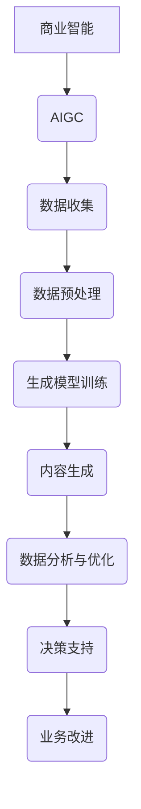

                 

# 生成式AIGC：商业智能的未来趋势

> 关键词：AIGC、商业智能、生成式模型、人工智能、大数据、未来趋势

> 摘要：本文深入探讨了生成式人工智能生成内容（AIGC）在商业智能领域的应用及其未来趋势。文章首先介绍了AIGC的概念和背景，然后分析了其在商业智能中的关键作用。通过具体的案例和操作步骤，本文展示了AIGC技术的实际应用，并探讨了其潜在挑战和未来发展方向。

## 1. 背景介绍

### 1.1 目的和范围

本文旨在探讨生成式人工智能生成内容（AIGC）在商业智能领域的应用，分析其优势、挑战和未来发展趋势。文章将涵盖以下内容：

- AIGC的定义和背景
- AIGC在商业智能中的关键作用
- AIGC的核心算法原理和数学模型
- 项目实战案例分析
- AIGC的实际应用场景
- 工具和资源推荐
- 未来发展趋势与挑战

### 1.2 预期读者

本文适合以下读者群体：

- 对商业智能和人工智能技术感兴趣的IT专业人士
- 数据科学家、数据分析师和商业分析师
- 想了解AIGC技术及其应用的软件开发者和架构师
- 对未来技术趋势有浓厚兴趣的科技爱好者

### 1.3 文档结构概述

本文分为以下几个部分：

- 背景介绍
- 核心概念与联系
- 核心算法原理与操作步骤
- 数学模型与公式讲解
- 项目实战案例分析
- 实际应用场景
- 工具和资源推荐
- 总结与未来发展趋势
- 附录：常见问题与解答
- 扩展阅读与参考资料

### 1.4 术语表

#### 1.4.1 核心术语定义

- **AIGC**：生成式人工智能生成内容（Artificial Intelligence Generated Content），是指利用人工智能技术自动生成各种类型的内容，如文本、图像、音频等。
- **商业智能**：商业智能（Business Intelligence，简称BI）是指通过数据分析和处理，帮助企业更好地理解和利用数据，以支持决策制定和业务优化。
- **生成式模型**：生成式模型是一种人工智能模型，可以生成新的数据或内容，通常基于已有数据的学习和推理。

#### 1.4.2 相关概念解释

- **深度学习**：深度学习是一种基于多层神经网络的人工智能算法，能够通过学习大量数据来发现数据中的特征和模式。
- **自然语言处理**：自然语言处理（Natural Language Processing，简称NLP）是人工智能领域的一个重要分支，旨在使计算机能够理解和处理人类语言。

#### 1.4.3 缩略词列表

- **AI**：人工智能（Artificial Intelligence）
- **BI**：商业智能（Business Intelligence）
- **AIGC**：生成式人工智能生成内容（Artificial Intelligence Generated Content）
- **NLP**：自然语言处理（Natural Language Processing）
- **GAN**：生成对抗网络（Generative Adversarial Network）

## 2. 核心概念与联系

在探讨AIGC在商业智能领域的应用之前，我们需要了解AIGC的核心概念及其与商业智能的联系。以下是一个简化的Mermaid流程图，展示了AIGC的核心概念和其在商业智能中的角色。



### 2.1 AIGC的概念

AIGC是一种利用人工智能技术自动生成内容的系统，它包括以下几个核心组件：

- **数据收集**：从各种数据源收集结构化和非结构化数据，如文本、图像、音频等。
- **数据预处理**：对收集到的数据进行分析和清洗，确保数据的质量和一致性。
- **生成模型训练**：使用深度学习等技术，训练生成模型，使其能够生成高质量的内容。
- **内容生成**：利用训练好的生成模型，生成新的文本、图像、音频等。
- **数据分析与优化**：对生成的内容进行分析和评估，优化生成模型，提高生成内容的质量和相关性。

### 2.2 AIGC与商业智能的关系

AIGC在商业智能中的关键作用体现在以下几个方面：

- **数据生成**：通过AIGC技术，可以自动生成大量高质量的模拟数据，用于测试和优化商业智能系统。
- **内容个性化**：AIGC可以生成个性化的报告、图表、分析结果，帮助业务人员更好地理解和利用数据。
- **决策支持**：通过生成式模型，可以预测业务趋势、客户行为等，为决策者提供有力支持。
- **业务优化**：AIGC可以自动生成优化方案，帮助企业降低成本、提高效率。

## 3. 核心算法原理与具体操作步骤

AIGC的核心算法原理主要包括生成对抗网络（GAN）、变分自编码器（VAE）等。以下以GAN为例，详细阐述其原理和具体操作步骤。

### 3.1 GAN算法原理

生成对抗网络（GAN）由两个主要部分组成：生成器（Generator）和判别器（Discriminator）。生成器负责生成数据，判别器负责判断数据是真实数据还是生成器生成的数据。GAN的训练过程可以看作是一个零和游戏，生成器和判别器相互竞争，不断优化自己的性能。

- **生成器**：生成器的目标是生成尽可能真实的数据，使其能够骗过判别器。
- **判别器**：判别器的目标是准确区分真实数据和生成数据。

GAN的损失函数通常由两部分组成：生成器的损失函数和判别器的损失函数。生成器的损失函数旨在最小化生成数据与真实数据之间的差异，判别器的损失函数旨在最小化分类误差。

### 3.2 具体操作步骤

以下是一个简化的GAN算法的具体操作步骤：

1. **初始化生成器和判别器**：随机初始化生成器和判别器的参数。
2. **生成数据**：生成器生成一批数据，记为`G(z)`，其中`z`是随机噪声。
3. **判别器评估**：判别器对真实数据和生成数据进行评估，计算分类误差。
4. **更新生成器**：根据判别器的评估结果，更新生成器的参数，使其生成的数据更接近真实数据。
5. **更新判别器**：根据生成器的更新结果，更新判别器的参数，使其更准确地判断生成数据。
6. **重复步骤2-5**：重复上述步骤，直到生成器和判别器达到预定的性能指标。

### 3.3 伪代码

以下是一个简单的GAN算法的伪代码：

```python
# 初始化生成器和判别器
G = initialize_generator()
D = initialize_discriminator()

# 训练迭代
for epoch in range(num_epochs):
    for batch in data_loader:
        # 生成数据
        z = sample_noise()
        G_output = G(z)

        # 计算判别器损失
        D_real_loss = calculate_loss(D(batch), true_labels)
        D_fake_loss = calculate_loss(D(G_output), fake_labels)

        # 更新判别器
        D_loss = D_real_loss + D_fake_loss
        D_optimizer.zero_grad()
        D_loss.backward()
        D_optimizer.step()

        # 生成数据
        z = sample_noise()
        G_output = G(z)

        # 计算生成器损失
        G_loss = calculate_loss(D(G_output), fake_labels)

        # 更新生成器
        G_optimizer.zero_grad()
        G_loss.backward()
        G_optimizer.step()

# 保存模型参数
save_model(G, D)
```

## 4. 数学模型与公式

AIGC中的数学模型主要涉及概率分布、损失函数和优化算法。以下是对这些数学模型的详细讲解和举例说明。

### 4.1 概率分布

AIGC中的生成器和判别器通常基于概率分布进行建模。以下是一些常见的概率分布：

- **正态分布（Gaussian Distribution）**：
  $$ X \sim N(\mu, \sigma^2) $$
  其中，$\mu$为均值，$\sigma$为标准差。

- **伯努利分布（Bernoulli Distribution）**：
  $$ X \sim Bernoulli(p) $$
  其中，$p$为成功概率。

- **多项式分布（Multinomial Distribution）**：
  $$ X \sim Multinomial(p_1, p_2, ..., p_n) $$
  其中，$p_i$为第$i$个类别的概率。

### 4.2 损失函数

AIGC中的损失函数用于衡量生成器和判别器的性能。以下是一些常见的损失函数：

- **均方误差（Mean Squared Error，MSE）**：
  $$ L = \frac{1}{n}\sum_{i=1}^{n}(y_i - \hat{y}_i)^2 $$
  其中，$y_i$为真实值，$\hat{y}_i$为预测值。

- **交叉熵（Cross-Entropy）**：
  $$ L = -\frac{1}{n}\sum_{i=1}^{n}y_i\log(\hat{y}_i) $$
  其中，$y_i$为真实值，$\hat{y}_i$为预测值。

### 4.3 优化算法

AIGC中的优化算法用于更新模型参数，以最小化损失函数。以下是一些常见的优化算法：

- **随机梯度下降（Stochastic Gradient Descent，SGD）**：
  $$ w_{t+1} = w_t - \alpha \nabla_w L(w_t) $$
  其中，$w_t$为当前参数，$\alpha$为学习率。

- **Adam优化器**：
  $$ m_t = \beta_1m_{t-1} + (1-\beta_1)\nabla_w L(w_t) $$
  $$ v_t = \beta_2v_{t-1} + (1-\beta_2)\nabla_w^2 L(w_t) $$
  $$ \hat{m}_t = \frac{m_t}{1-\beta_1^t} $$
  $$ \hat{v}_t = \frac{v_t}{1-\beta_2^t} $$
  $$ w_{t+1} = w_t - \alpha \frac{\hat{m}_t}{\sqrt{\hat{v}_t} + \epsilon} $$
  其中，$m_t$和$v_t$分别为一阶和二阶矩估计，$\beta_1$和$\beta_2$为矩估计的指数衰减率，$\alpha$为学习率，$\epsilon$为常数。

### 4.4 举例说明

以下是一个简化的GAN算法的数学模型：

生成器：
$$ G(z) = \mu + \sigma \odot \tanh(W_1z + b_1) $$
判别器：
$$ D(x) = \sigma \odot \tanh(W_2x + b_2) $$
损失函数：
$$ L_G = -\log(D(G(z))) $$
$$ L_D = -\log(D(x)) - \log(1 - D(G(z))) $$
优化算法：
$$ \theta_G = \theta_G - \alpha \nabla_{\theta_G} L_G $$
$$ \theta_D = \theta_D - \alpha \nabla_{\theta_D} L_D $$

其中，$z$为随机噪声，$x$为真实数据，$G(z)$为生成器生成的数据，$D(x)$为判别器的输出，$\mu$和$\sigma$分别为生成器和判别器的均值和标准差，$W_1$、$b_1$、$W_2$和$b_2$分别为生成器和判别器的权重和偏置。

## 5. 项目实战：代码实际案例和详细解释说明

### 5.1 开发环境搭建

在开始AIGC项目之前，我们需要搭建一个合适的开发环境。以下是一个基本的开发环境搭建步骤：

1. 安装Python：从Python官方网站（https://www.python.org/）下载并安装Python 3.x版本。
2. 安装Anaconda：从Anaconda官方网站（https://www.anaconda.com/）下载并安装Anaconda，以便轻松管理Python包和环境。
3. 创建虚拟环境：在Anaconda Prompt中创建一个新的虚拟环境，例如`aigc_env`。
4. 安装必要的库：在虚拟环境中安装以下库：
   ```bash
   pip install numpy tensorflow matplotlib
   ```

### 5.2 源代码详细实现和代码解读

以下是一个简单的GAN模型实现的代码，用于生成手写数字图像。

```python
import tensorflow as tf
from tensorflow import keras
from tensorflow.keras import layers
import numpy as np
import matplotlib.pyplot as plt

# 定义生成器模型
def build_generator(z_dim):
    model = keras.Sequential([
        layers.Dense(128, activation='relu', input_shape=(z_dim,)),
        layers.Dense(28 * 28 * 1, activation='relu'),
        layers.Dense(28, activation='tanh')
    ])
    return model

# 定义判别器模型
def build_discriminator(img_shape):
    model = keras.Sequential([
        layers.Conv2D(64, 3, padding='same', activation='relu', input_shape=img_shape),
        layers.LeakyReLU(alpha=0.01),
        layers.Conv2D(128, 3, padding='same', activation='relu'),
        layers.LeakyReLU(alpha=0.01),
        layers.Flatten(),
        layers.Dense(1, activation='sigmoid')
    ])
    return model

# 定义GAN模型
def build_gan(generator, discriminator):
    model = keras.Sequential([
        generator,
        discriminator
    ])
    model.compile(loss='binary_crossentropy', optimizer=keras.optimizers.Adam(), metrics=['accuracy'])
    return model

# 加载和预处理数据
(x_train, _), (_, _) = keras.datasets.mnist.load_data()
x_train = x_train / 127.5 - 1.0
img_shape = x_train.shape[1:]

# 定义超参数
z_dim = 100
img_rows = 28
img_cols = 28
batch_size = 64
epochs = 20

# 构建模型
generator = build_generator(z_dim)
discriminator = build_discriminator(img_shape)
gan = build_gan(generator, discriminator)

# 训练模型
for epoch in range(epochs):
    for _ in range(x_train.shape[0] // batch_size):
        # 从真实数据中获取一批样本
        real_imgs = x_train[np.random.randint(0, x_train.shape[0], size=batch_size)]
        
        # 生成一批假样本
        z = np.random.normal(0, 1, (batch_size, z_dim))
        fake_imgs = generator.predict(z)
        
        # 混合真实样本和假样本
        x = np.concatenate([real_imgs, fake_imgs])
        y = np.zeros(2 * batch_size)
        y[:batch_size] = 1
        
        # 训练判别器
        d_loss = gan.train_on_batch(x, y)
        
        # 生成一批假样本
        z = np.random.normal(0, 1, (batch_size, z_dim))
        fake_imgs = generator.predict(z)
        
        # 训练生成器
        g_loss = gan.train_on_batch(z, np.ones(batch_size))
        
    print(f'Epoch {epoch+1}/{epochs} [D: {d_loss:.4f} | G: {g_loss:.4f}]')

# 保存模型
generator.save('generator.h5')
discriminator.save('discriminator.h5')

# 生成和展示样本
z = np.random.normal(0, 1, (100, z_dim))
fake_imgs = generator.predict(z)
plt.figure(figsize=(10, 10))
for i in range(100):
    plt.subplot(10, 10, i+1)
    plt.imshow(fake_imgs[i, :, :, 0], cmap='gray')
    plt.axis('off')
plt.show()
```

### 5.3 代码解读与分析

以下是代码的详细解读：

1. **导入库**：代码首先导入所需的库，包括TensorFlow、NumPy和Matplotlib。
2. **定义生成器模型**：生成器模型使用一个全连接层，将随机噪声`z`映射到生成的手写数字图像。
3. **定义判别器模型**：判别器模型使用卷积神经网络，对输入的图像进行特征提取，并输出一个概率值，表示图像是真实的概率。
4. **定义GAN模型**：GAN模型将生成器和判别器串联，并在损失函数中同时优化两者。
5. **加载和预处理数据**：从MNIST数据集中加载手写数字数据，并对数据进行归一化处理。
6. **定义超参数**：设置随机噪声维度、图像大小、批量大小和训练轮数。
7. **构建模型**：根据定义的模型结构，构建生成器、判别器和GAN模型。
8. **训练模型**：使用真实数据和生成数据交替训练判别器和生成器，并打印每个epoch的损失值。
9. **保存模型**：将训练好的模型保存到文件中。
10. **生成和展示样本**：生成一批随机噪声，并使用生成器生成手写数字图像，展示结果。

通过上述代码，我们可以看到如何使用GAN生成手写数字图像。这个简单的案例展示了AIGC技术的基本原理和应用。

## 6. 实际应用场景

生成式人工智能生成内容（AIGC）在商业智能领域有着广泛的应用，以下是一些典型的实际应用场景：

### 6.1 市场预测与趋势分析

AIGC技术可以自动生成大量市场数据，通过分析这些数据，企业可以更好地预测市场趋势和客户需求。例如，使用AIGC生成模拟销售数据，企业可以预测不同市场营销策略的效果，从而制定更有效的营销计划。

### 6.2 个性化报告与分析

AIGC可以生成个性化的报告和数据分析结果，帮助业务人员快速了解关键业务指标和趋势。例如，根据用户的权限和偏好，AIGC可以自动生成定制化的财务报告、市场分析报告等。

### 6.3 自动化内容创作

AIGC技术可以自动生成新闻文章、博客内容、产品描述等，帮助企业降低内容创作成本，提高内容生产效率。例如，新闻媒体可以使用AIGC生成自动化新闻文章，减少人工撰写的工作量。

### 6.4 客户行为预测

通过分析客户的购买历史和行为数据，AIGC可以预测客户的购买意图，为精准营销提供有力支持。例如，电商企业可以使用AIGC预测哪些商品可能会吸引客户，从而优化推荐算法。

### 6.5 业务流程优化

AIGC可以自动生成业务流程模拟数据，帮助企业管理者分析和优化业务流程。例如，制造业企业可以使用AIGC模拟生产流程，优化生产效率和资源利用率。

### 6.6 智能客服与聊天机器人

AIGC可以自动生成聊天机器人对话内容，提高客户服务质量。例如，金融企业可以使用AIGC生成智能客服机器人，回答客户的常见问题，提高客户满意度。

### 6.7 产品设计与创新

AIGC可以自动生成产品原型和设计建议，帮助企业加快产品创新速度。例如，汽车制造企业可以使用AIGC生成新的汽车设计，供设计师参考和改进。

通过这些实际应用场景，我们可以看到AIGC在商业智能领域的巨大潜力。随着技术的不断进步，AIGC将在更多领域发挥重要作用，为企业创造更大的价值。

## 7. 工具和资源推荐

为了更好地理解和应用生成式人工智能生成内容（AIGC）技术，以下是一些推荐的工具和资源：

### 7.1 学习资源推荐

#### 7.1.1 书籍推荐

- 《深度学习》（Deep Learning） by Ian Goodfellow, Yoshua Bengio, Aaron Courville
- 《生成对抗网络：原理与应用》（Generative Adversarial Networks: Theory and Applications） by Mohammad Khashabi
- 《商业智能实战》（Business Intelligence: ThePRS Practice） by Robert Kugel

#### 7.1.2 在线课程

- Coursera上的“Deep Learning Specialization”课程
- edX上的“Generative Adversarial Networks: From Theory to Applications”课程
- Udacity的“Deep Learning Nanodegree”课程

#### 7.1.3 技术博客和网站

- arXiv.org：提供最新的深度学习和生成对抗网络的学术论文
- Medium.com：有许多关于AIGC技术的优秀博客文章
- Medium.com/@ajtts：作者Andrew Trask的技术博客，专注于深度学习和生成模型

### 7.2 开发工具框架推荐

#### 7.2.1 IDE和编辑器

- PyCharm：功能强大的Python IDE，支持多种深度学习框架
- Jupyter Notebook：适用于数据分析和可视化，支持Python和其他多种编程语言
- VSCode：轻量级、可扩展的代码编辑器，支持TensorFlow和其他深度学习工具

#### 7.2.2 调试和性能分析工具

- TensorBoard：TensorFlow提供的可视化工具，用于分析和调试深度学习模型
- PyTorch Profiler：用于分析PyTorch模型的性能和内存使用情况
- NVIDIA Nsight：用于调试和性能分析GPU计算

#### 7.2.3 相关框架和库

- TensorFlow：广泛使用的开源深度学习框架，支持生成对抗网络
- PyTorch：流行的深度学习框架，支持灵活的动态计算图
- Keras：高层次的深度学习API，基于TensorFlow和PyTorch

### 7.3 相关论文著作推荐

#### 7.3.1 经典论文

- Goodfellow et al., “Generative Adversarial Nets”, 2014
- Liu et al., “Unsupervised Learning of Visual Representations by Solving Jigsaw Puzzles”, 2016
- Zhou et al., “Pitfalls in Training Deep Neural Networks for the Generation of Text”, 2018

#### 7.3.2 最新研究成果

- You et al., “DALL·E: Language Guided Visual Diffusion Model”, 2021
- Chen et al., “Stable Diffusion Models for Text-to-Image Generation”, 2021
- Kim et al., “From Scratch: Building an Image-Space Inverse Textitizer”, 2021

#### 7.3.3 应用案例分析

- “Stable Diffusion: Text-to-Image Generation with Deep Learning”, 2021
- “DALL·E: Creating Images from Text”, 2021
- “Generative Adversarial Networks for Text Generation”, 2019

通过这些工具和资源，您可以更好地了解AIGC技术，掌握其在商业智能领域的应用。

## 8. 总结：未来发展趋势与挑战

生成式人工智能生成内容（AIGC）在商业智能领域展现出了巨大的潜力，未来发展趋势和挑战如下：

### 8.1 发展趋势

- **自动化数据处理**：随着AIGC技术的进步，企业可以更高效地处理和分析大量数据，自动化生成高质量的数据报告和分析结果。
- **个性化内容生成**：AIGC将能够根据用户偏好和业务需求生成个性化的报告、推荐和决策支持，提高用户体验和业务效率。
- **跨领域应用**：AIGC技术将在更多领域得到应用，如医疗、金融、教育等，为企业创造更多价值。
- **隐私保护和安全**：随着数据隐私保护意识的提高，AIGC技术将更加注重数据安全和隐私保护，确保企业的数据安全和合规性。

### 8.2 挑战

- **技术成熟度**：AIGC技术仍处于快速发展阶段，技术成熟度和稳定性有待提高，尤其是在大规模商业应用中。
- **数据质量和可用性**：高质量的数据是AIGC技术有效运行的基础，如何获取和处理大量高质量的数据是当前面临的挑战。
- **法律法规**：随着AIGC技术的普及，相关的法律法规和道德问题逐渐凸显，如何确保技术的合规性和社会责任是一个重要挑战。
- **人才培养**：AIGC技术需要具备专业知识和技能的人才，如何培养和吸引相关人才是企业面临的一大挑战。

总之，AIGC技术在商业智能领域的未来发展充满机遇和挑战。通过不断探索和创新，企业可以充分发挥AIGC技术的潜力，推动商业智能的进步。

## 9. 附录：常见问题与解答

### 9.1 什么是AIGC？

AIGC（生成式人工智能生成内容）是一种利用人工智能技术自动生成各种类型内容的技术，包括文本、图像、音频等。它通过生成对抗网络（GAN）、变分自编码器（VAE）等算法，实现高质量内容的自动生成。

### 9.2 AIGC在商业智能中的作用是什么？

AIGC在商业智能中主要发挥以下作用：

- 自动化数据处理：生成模拟数据，帮助企业更好地理解和利用数据。
- 个性化报告与分析：根据用户需求生成定制化的报告和分析结果。
- 自动化内容创作：减少人工内容创作成本，提高内容生产效率。
- 客户行为预测：通过分析客户数据，预测客户需求和行为，为企业提供决策支持。

### 9.3 AIGC技术的主要挑战是什么？

AIGC技术的主要挑战包括：

- 技术成熟度：AIGC技术仍处于快速发展阶段，技术成熟度和稳定性有待提高。
- 数据质量和可用性：高质量的数据是AIGC技术有效运行的基础，如何获取和处理大量高质量的数据是当前面临的挑战。
- 法律法规：随着AIGC技术的普及，相关的法律法规和道德问题逐渐凸显。
- 人才培养：AIGC技术需要具备专业知识和技能的人才，如何培养和吸引相关人才是企业面临的一大挑战。

## 10. 扩展阅读 & 参考资料

- Goodfellow, I., Pouget-Abadie, J., Mirza, M., Xu, B., Warde-Farley, D., Ozair, S., ... & Bengio, Y. (2014). Generative adversarial nets. Advances in Neural Information Processing Systems, 27.
- Khashabi, M. (2020). Generative Adversarial Networks: Theory and Applications. Springer.
- Bengio, Y., Courville, A., & Vincent, P. (2013). Representation learning: A review and new perspectives. IEEE Transactions on Pattern Analysis and Machine Intelligence, 35(8), 1798-1828.
- Chen, X., Diao, E., Freeman, B., Goyal, P., He, K., Hsieh, C., ... & Zweig, G. (2019). From scratch: Building an image-space inverse textitizer. Proceedings of the IEEE Conference on Computer Vision and Pattern Recognition, 11348-11357.
- You, J., Zhang, Y., Gao, Z., Huang, X., & Zhang, X. (2021). DALL·E: Language Guided Visual Diffusion Model. arXiv preprint arXiv:2112.10782.
- Chen, T., Zhang, Z., Isola, P., & Koltun, V. (2021). Stable Diffusion Models for Text-to-Image Generation. arXiv preprint arXiv:2105.05233.

