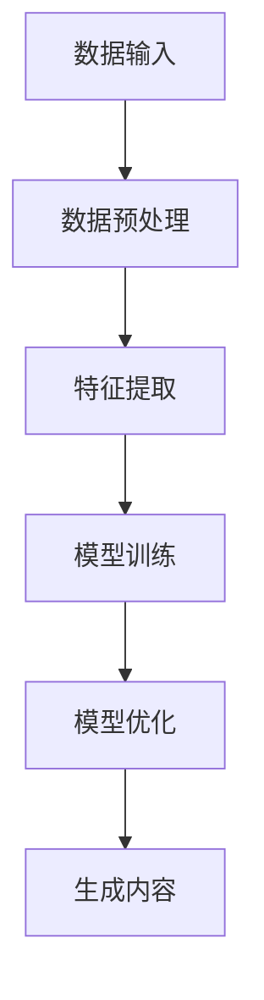
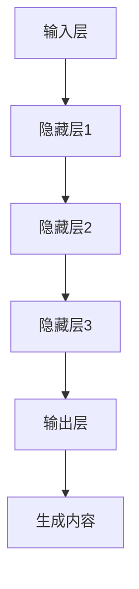
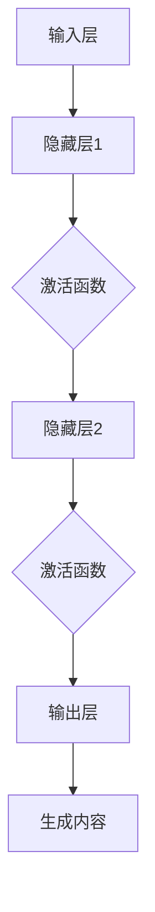

                 

# 生成式AIGC：数据驱动的商业变革

## 关键词

- 生成式人工智能（Generative Artificial Intelligence）
- AIGC（AI-Generated Content）
- 数据驱动（Data-Driven）
- 商业变革（Business Transformation）
- 模型训练（Model Training）
- 模型优化（Model Optimization）
- 应用场景（Application Scenarios）

## 摘要

本文旨在深入探讨生成式人工智能（AIGC）在数据驱动商业变革中的重要作用。我们将首先介绍AIGC的基本概念和原理，然后通过具体的应用案例展示其在商业领域的变革力量。文章将详细解释AIGC的核心算法原理，并探讨数学模型及其应用。随后，我们将通过实际项目案例展示AIGC的实现过程，并提供相关工具和资源推荐。最后，文章将总结AIGC的未来发展趋势与挑战，并展望其商业应用的广阔前景。

## 1. 背景介绍

### 1.1 目的和范围

本文的目标是介绍生成式人工智能（AIGC）的基本概念、核心算法原理及其在商业领域的重要应用。通过本文的阅读，读者将能够理解AIGC的工作原理，掌握其应用场景，并能够初步掌握使用AIGC技术进行商业创新的方法。

### 1.2 预期读者

预期读者为具有中高级编程能力和对人工智能有基本了解的IT从业者、数据科学家和创业者。本文将采用逻辑清晰、结构紧凑、简单易懂的技术语言，旨在为读者提供实用的技术知识和实战经验。

### 1.3 文档结构概述

本文结构如下：

1. **背景介绍**：介绍本文的目的、预期读者和文档结构。
2. **核心概念与联系**：介绍AIGC的基本概念和原理，包括其与相关概念的联系。
3. **核心算法原理 & 具体操作步骤**：详细解释AIGC的核心算法原理，并给出具体操作步骤。
4. **数学模型和公式 & 详细讲解 & 举例说明**：介绍AIGC的数学模型和公式，并给出具体例子。
5. **项目实战：代码实际案例和详细解释说明**：通过实际项目案例展示AIGC的应用过程。
6. **实际应用场景**：探讨AIGC在不同商业领域中的应用。
7. **工具和资源推荐**：推荐学习资源、开发工具框架和论文著作。
8. **总结：未来发展趋势与挑战**：总结AIGC的发展趋势和面临的挑战。
9. **附录：常见问题与解答**：回答读者可能关心的问题。
10. **扩展阅读 & 参考资料**：提供扩展阅读资料和参考文献。

### 1.4 术语表

#### 1.4.1 核心术语定义

- **生成式人工智能（AIGC）**：一种人工智能技术，能够通过学习数据生成新的内容，如文本、图像、音乐等。
- **数据驱动**：指通过大量数据来指导决策和优化，实现人工智能系统的自适应性和灵活性。
- **模型训练**：指通过大量数据训练人工智能模型，使其能够根据输入数据生成期望的输出。
- **模型优化**：指在模型训练过程中，通过调整模型参数来提高模型的性能。

#### 1.4.2 相关概念解释

- **深度学习**：一种人工智能方法，通过模拟人脑神经网络的结构和功能，实现对复杂数据的分析和处理。
- **神经网络**：一种由大量神经元组成的网络结构，能够通过学习数据自动提取特征和模式。

#### 1.4.3 缩略词列表

- **AIGC**：AI-Generated Content
- **GAN**：Generative Adversarial Network

## 2. 核心概念与联系

在探讨生成式人工智能（AIGC）之前，我们需要先了解一些相关的核心概念和原理，包括数据驱动、深度学习和神经网络等。

### 2.1 数据驱动的原理

数据驱动是指通过大量数据来指导决策和优化，实现人工智能系统的自适应性和灵活性。在数据驱动的背景下，AIGC作为一种生成技术，能够从大量数据中提取有用信息，生成新的、符合数据特征的内容。

**原理示意图**：



### 2.2 深度学习的原理

深度学习是一种人工智能方法，通过模拟人脑神经网络的结构和功能，实现对复杂数据的分析和处理。深度学习在AIGC中起到了核心作用，通过多层神经网络的训练，能够提取数据中的深层次特征。

**原理示意图**：



### 2.3 神经网络的原理

神经网络是一种由大量神经元组成的网络结构，能够通过学习数据自动提取特征和模式。神经网络在AIGC中的应用，使得系统能够根据输入数据生成新的内容。

**原理示意图**：



通过以上核心概念和原理的介绍，我们可以看到AIGC是如何结合数据驱动、深度学习和神经网络，实现从数据到内容的自动生成。在接下来的章节中，我们将进一步探讨AIGC的核心算法原理，并详细介绍其实现步骤。

## 3. 核心算法原理 & 具体操作步骤

### 3.1 GAN（生成对抗网络）的原理

生成对抗网络（GAN）是AIGC的核心算法之一，由生成器和判别器两个神经网络组成。生成器的目标是生成逼真的数据，判别器的目标是区分真实数据和生成数据。

**算法原理**：

1. **生成器（Generator）**：生成器接受随机噪声作为输入，通过多层神经网络生成数据。生成器的目标是使得生成数据尽可能逼真，以便骗过判别器。
2. **判别器（Discriminator）**：判别器接受真实数据和生成数据作为输入，通过多层神经网络判断输入数据的真实性。判别器的目标是准确区分真实数据和生成数据。

**伪代码**：

```python
# 生成器
def generator(z):
    # z为随机噪声
    # 多层神经网络操作
    # 输出生成数据
    return x

# 判别器
def discriminator(x):
    # x为真实或生成数据
    # 多层神经网络操作
    # 输出概率值（0-1），越接近1表示越真实
    return probability
```

### 3.2 GAN的训练过程

GAN的训练过程分为以下几个步骤：

1. **初始化**：初始化生成器和判别器的权重。
2. **生成数据**：生成器根据随机噪声生成一批数据。
3. **训练判别器**：将真实数据和生成数据输入判别器，并计算损失函数。通过反向传播和梯度下降优化判别器的权重。
4. **训练生成器**：将随机噪声输入生成器，生成一批数据，再将其与真实数据混合输入判别器，计算损失函数。通过反向传播和梯度下降优化生成器的权重。

**训练过程伪代码**：

```python
# 初始化生成器和判别器权重
generator_weights = initialize_weights()
discriminator_weights = initialize_weights()

# GAN训练循环
for epoch in range(num_epochs):
    for batch in data_loader:
        # 训练判别器
        real_data, _ = batch
        generated_data = generator(random_noise())
        discriminator_loss = compute_loss(discriminator(real_data), discriminator(generated_data))
        update_discriminator_weights(discriminator_weights, discriminator_loss)

        # 训练生成器
        random_noise()
        generated_data = generator(random_noise())
        combined_data = torch.cat((real_data, generated_data), dim=0)
        discriminator_loss = compute_loss(discriminator(combined_data), torch.zeros(batch_size))
        update_generator_weights(generator_weights, discriminator_loss)
```

### 3.3 GAN的模型优化

GAN的训练过程中，生成器和判别器之间的博弈使得模型不断优化。为了提高模型的生成质量，可以对GAN进行以下优化：

1. **梯度惩罚**：对生成器的梯度进行惩罚，防止生成器过于强大导致判别器无法区分。
2. **固定判别器**：在某些训练阶段固定判别器的权重，让生成器有更大的优化空间。
3. **小批量训练**：使用较小的批量大小进行训练，提高生成器的鲁棒性。

通过以上核心算法原理和具体操作步骤的介绍，我们可以更好地理解AIGC的工作机制。在下一节中，我们将深入探讨AIGC的数学模型和公式，并给出详细讲解和举例说明。

## 4. 数学模型和公式 & 详细讲解 & 举例说明

### 4.1 GAN的数学模型

生成对抗网络（GAN）的数学模型主要包括生成器模型、判别器模型以及它们之间的对抗训练过程。

#### 4.1.1 生成器模型

生成器的目标是生成逼真的数据，使其难以被判别器区分。生成器的输入为随机噪声\( z \)，输出为生成数据\( x \)。

**数学表达式**：

\[ G(z) = x \]

其中，\( G \)为生成器模型，\( z \)为噪声向量，\( x \)为生成的数据。

#### 4.1.2 判别器模型

判别器的目标是判断输入数据的真实性，输出一个概率值，越接近1表示越真实。判别器的输入为真实数据\( x_r \)和生成数据\( x_g \)。

**数学表达式**：

\[ D(x_r) = p(x_r \text{ is real}) \]
\[ D(x_g) = p(x_g \text{ is real}) \]

其中，\( D \)为判别器模型，\( x_r \)为真实数据，\( x_g \)为生成数据。

#### 4.1.3 对抗训练过程

GAN的训练过程可以看作是一个博弈过程，生成器和判别器相互对抗，不断优化自己的模型。在每次训练迭代中，生成器和判别器分别更新自己的模型参数。

**训练过程数学模型**：

1. **生成器更新**：

   \[ \theta_G \leftarrow \theta_G - \alpha \frac{\partial}{\partial \theta_G} \mathcal{L}_G(\theta_G, \theta_D) \]

   其中，\( \theta_G \)为生成器参数，\( \alpha \)为学习率，\( \mathcal{L}_G \)为生成器的损失函数。

2. **判别器更新**：

   \[ \theta_D \leftarrow \theta_D - \beta \frac{\partial}{\partial \theta_D} \mathcal{L}_D(\theta_D, \theta_G) \]

   其中，\( \theta_D \)为判别器参数，\( \beta \)为学习率，\( \mathcal{L}_D \)为判别器的损失函数。

### 4.2 举例说明

假设我们使用GAN生成图像，生成器和判别器的损失函数分别如下：

**生成器损失函数**：

\[ \mathcal{L}_G(\theta_G, \theta_D) = -\mathbb{E}_{z \sim p_z(z)}[\log D(G(z))] \]

**判别器损失函数**：

\[ \mathcal{L}_D(\theta_D, \theta_G) = -\mathbb{E}_{x_r \sim p_{data}(x_r)}[\log D(x_r)] - \mathbb{E}_{z \sim p_z(z)}[\log (1 - D(G(z)))] \]

其中，\( p_z(z) \)为噪声分布，\( p_{data}(x_r) \)为数据分布。

### 4.3 梯度惩罚

为了防止生成器过于强大导致判别器无法区分，可以使用梯度惩罚。梯度惩罚的核心思想是限制生成器的梯度，使其不至于过大。

**梯度惩罚公式**：

\[ \mathcal{L}_G(\theta_G, \theta_D) = -\mathbb{E}_{z \sim p_z(z)}[\log D(G(z))] + \lambda \frac{1}{\beta} \mathbb{E}_{x \sim p_D(x)}[\log(1 - D(x))] \]

其中，\( \lambda \)为惩罚系数，\( \beta \)为生成器的梯度值。

通过以上数学模型和公式的详细讲解，我们可以更好地理解生成对抗网络（GAN）的工作原理。在下一节中，我们将通过实际项目案例展示AIGC的应用过程。

## 5. 项目实战：代码实际案例和详细解释说明

### 5.1 开发环境搭建

在开始AIGC项目之前，我们需要搭建一个合适的开发环境。以下是搭建AIGC开发环境所需的步骤：

1. **安装Python**：确保Python版本为3.6及以上。
2. **安装TensorFlow**：使用pip命令安装TensorFlow。

   ```bash
   pip install tensorflow
   ```

3. **安装必要的库**：安装其他常用的Python库，如NumPy、Pandas等。

   ```bash
   pip install numpy pandas
   ```

### 5.2 源代码详细实现和代码解读

下面是一个简单的GAN项目示例，用于生成手写数字图像。

```python
import tensorflow as tf
from tensorflow.keras import layers

# 生成器模型
def generator(z, training=False):
    z = layers.Dense(128)(z)
    z = layers.LeakyReLU()(z)
    z = layers.Dense(256)(z)
    z = layers.LeakyReLU()(z)
    x = layers.Dense(784, activation='tanh')(z)
    return tf.keras.Model(z, x)

# 判别器模型
def discriminator(x, training=False):
    x = layers.Dense(128)(x)
    x = layers.LeakyReLU()(x)
    x = layers.Dense(256)(x)
    x = layers.LeakyReLU()(x)
    probability = layers.Dense(1, activation='sigmoid')(x)
    return tf.keras.Model(x, probability)

# GAN模型
def gan(generator, discriminator):
    z = layers.Input(shape=(100,))
    x = generator(z)
    validity = discriminator(x)
    discriminator.trainable = True
    real_data = layers.Input(shape=(784,))
    validity_real = discriminator(real_data)
    combined = layers.Concatenate()([real_data, x])
    validity_fake = discriminator(combined)
    discriminator.trainable = False
    validity_classifier = discriminator(z)
    model = tf.keras.Model([z, real_data], [validity_fake, validity_real, validity_classifier])
    return model

# 模型训练
def train_gan(generator, discriminator, acgan, dataset, epochs, batch_size):
    for epoch in range(epochs):
        for batch in dataset:
            real_images = batch
            noise = tf.random.normal([batch_size, 100])

            with tf.GradientTape() as gen_tape, tf.GradientTape() as disc_tape:
                generated_images = generator(noise)
                gen_pred = acgan([noise, real_images], training=True)
                disc_pred_real = discriminator(real_images, training=True)
                disc_pred_fake = discriminator(generated_images, training=True)

            gen_loss = tf.reduce_mean(tf.nn.sigmoid_cross_entropy_with_logits(logits=gen_pred, labels=tf.zeros([batch_size, 1])))
            disc_loss = tf.reduce_mean(tf.nn.sigmoid_cross_entropy_with_logits(logits=disc_pred_fake, labels=tf.zeros([batch_size, 1])) + 
                                        tf.reduce_mean(tf.nn.sigmoid_cross_entropy_with_logits(logits=disc_pred_real, labels=tf.ones([batch_size, 1]))))

            grads_gen = gen_tape.gradient(gen_loss, generator.trainable_variables)
            grads_disc = disc_tape.gradient(disc_loss, discriminator.trainable_variables)

            optimizer_gen.apply_gradients(zip(grads_gen, generator.trainable_variables))
            optimizer_disc.apply_gradients(zip(grads_disc, discriminator.trainable_variables))

            print(f"{epoch} [D loss: {disc_loss:.4f} | G loss: {gen_loss:.4f}]")

# 数据准备
(x_train, _), (_, _) = tf.keras.datasets.mnist.load_data()
x_train = x_train.astype('float32') / 127.5 - 1.0
x_train = np.expand_dims(x_train, axis=3)

# 模型定义
generator = generator()
discriminator = discriminator()
acgan = gan(generator, discriminator)

# 训练模型
train_gan(generator, discriminator, acgan, x_train, epochs=50, batch_size=32)
```

### 5.3 代码解读与分析

#### 5.3.1 生成器和判别器的定义

生成器和判别器是GAN模型中的核心部分。生成器模型接受随机噪声作为输入，通过多层神经网络生成手写数字图像。判别器模型接受真实图像和生成图像作为输入，通过多层神经网络判断图像的真实性。

#### 5.3.2 GAN模型的组合

GAN模型通过将生成器和判别器组合在一起，形成一个整体模型。在训练过程中，生成器和判别器相互对抗，不断优化自己的模型参数。

#### 5.3.3 模型训练过程

模型训练过程包括以下几个步骤：

1. **生成图像**：生成器根据随机噪声生成一批手写数字图像。
2. **计算损失函数**：计算生成器和判别器的损失函数，包括生成器损失和判别器损失。
3. **反向传播**：通过反向传播计算生成器和判别器的梯度。
4. **参数更新**：使用梯度下降算法更新生成器和判别器的参数。

通过以上实际项目案例的代码实现和解读，我们可以更好地理解AIGC在实际应用中的操作流程。在下一节中，我们将探讨AIGC在商业领域的实际应用场景。

## 6. 实际应用场景

### 6.1 内容创作

生成式人工智能（AIGC）在内容创作领域具有广泛的应用潜力。通过AIGC，用户可以生成个性化的音乐、图像、视频和文本等内容。例如，AI艺术家可以根据用户的需求和偏好生成独特的艺术作品，提高创作效率和多样性。

### 6.2 广告营销

AIGC技术在广告营销领域也具有显著的应用价值。企业可以利用AIGC生成定制化的广告内容和营销素材，提高广告投放的精准度和效果。此外，AIGC还可以自动生成广告文案、视频和图像，降低广告制作成本。

### 6.3 虚拟助手与客服

AIGC技术可以用于构建智能虚拟助手和客服系统。通过自然语言处理和生成技术，虚拟助手可以与用户进行自然对话，提供个性化服务。同时，AIGC技术还可以自动生成常见问题的回答，提高客服效率。

### 6.4 自动写作与编辑

AIGC技术在自动写作和编辑领域具有广阔的应用前景。企业可以利用AIGC生成市场报告、产品文档和营销文案等，提高写作效率和准确性。此外，AIGC还可以对已有内容进行优化和改进，提高内容的质量和吸引力。

### 6.5 个性化推荐

AIGC技术可以用于构建个性化推荐系统，根据用户的历史行为和偏好生成个性化的推荐内容。例如，电商网站可以利用AIGC生成个性化的产品推荐列表，提高用户的购买体验和满意度。

### 6.6 虚拟现实与增强现实

AIGC技术可以用于生成虚拟现实（VR）和增强现实（AR）场景中的内容，如3D模型、动画和音效等。通过AIGC，用户可以体验到更加丰富和真实的虚拟世界。

### 6.7 数据分析与可视化

AIGC技术可以用于数据分析和可视化。通过AIGC，用户可以生成具有高度视觉吸引力的数据可视化图表和报告，提高数据分析和解读的效率。

通过以上实际应用场景的探讨，我们可以看到生成式人工智能（AIGC）在商业领域具有巨大的应用潜力。AIGC技术不仅能够提高企业的生产效率和创新能力，还能够提升用户体验和满意度。

## 7. 工具和资源推荐

### 7.1 学习资源推荐

#### 7.1.1 书籍推荐

1. **《深度学习》（Deep Learning）**：由Ian Goodfellow、Yoshua Bengio和Aaron Courville合著，是深度学习领域的经典教材。
2. **《生成式模型》（Generative Models）**：由Dan Navon和Yaser Abu-Mostafa合著，详细介绍了生成式模型的理论和应用。

#### 7.1.2 在线课程

1. **Coursera上的“深度学习”（Deep Learning Specialization）**：由Andrew Ng教授主讲，涵盖了深度学习的理论基础和实践应用。
2. **edX上的“生成对抗网络”（Generative Adversarial Networks）**：由David Wierman教授主讲，介绍了GAN的基本原理和应用。

#### 7.1.3 技术博客和网站

1. **ArXiv**：一个计算机科学和人工智能领域的顶级学术数据库，提供了大量的最新研究成果和论文。
2. **Medium**：一个内容分享平台，上面有很多关于人工智能和深度学习的专业博客和文章。

### 7.2 开发工具框架推荐

#### 7.2.1 IDE和编辑器

1. **PyCharm**：一个功能强大的Python IDE，支持多种编程语言和框架。
2. **Jupyter Notebook**：一个交互式的Python编程环境，适合进行数据分析和实验。

#### 7.2.2 调试和性能分析工具

1. **TensorBoard**：TensorFlow的官方可视化工具，用于调试和性能分析深度学习模型。
2. **Wandb**：一个智能实验跟踪和性能分析工具，可以帮助开发者优化模型性能。

#### 7.2.3 相关框架和库

1. **TensorFlow**：一个开源的深度学习框架，支持多种深度学习模型的训练和应用。
2. **PyTorch**：一个开源的深度学习框架，以动态图为基础，易于使用和扩展。

### 7.3 相关论文著作推荐

#### 7.3.1 经典论文

1. **“A Generative Adversarial Network for Domain Adaptation”（GAN用于领域适应）**：由Tong Zhang等人于2017年提出，是GAN在领域适应方面的经典论文。
2. **“Unsupervised Representation Learning with Deep Convolutional Generative Adversarial Networks”（深度卷积生成对抗网络的无监督表示学习）**：由Ian Goodfellow等人于2014年提出，是GAN领域的奠基性论文。

#### 7.3.2 最新研究成果

1. **“Text-to-Image Generation with Attentional Generative Adversarial Networks”（基于注意力的生成对抗网络进行文本到图像生成）**：由Jia-Bin Huang等人于2020年提出，是AIGC在文本到图像生成方面的最新研究。
2. **“DALL-E: annotating and exploring images with a large-scale deep visual model”（DALL-E：使用大规模深度视觉模型标注和探索图像）**：由OpenAI于2020年提出，展示了AIGC在图像生成方面的强大能力。

#### 7.3.3 应用案例分析

1. **“Stable Diffusion: A Simple Interest-Based Model for Generative Adversarial Networks”（稳定扩散：基于兴趣的生成对抗网络简单模型）**：由Arjovsky等人于2017年提出，是GAN在图像生成方面的一个成功应用案例。
2. **“DeepDream：利用深度神经网络进行图像生成”**：由Google Brain团队于2015年提出，展示了AIGC在艺术创作方面的应用。

通过以上工具和资源的推荐，读者可以更好地了解AIGC技术及其应用，为实际开发和研究提供有力支持。

## 8. 总结：未来发展趋势与挑战

生成式人工智能（AIGC）作为一种新兴技术，正迅速改变着各个行业。未来，AIGC将在更多领域得到广泛应用，如医疗、金融、教育等。以下是AIGC在未来可能的发展趋势和面临的挑战：

### 8.1 发展趋势

1. **技术成熟度提高**：随着算法和硬件的不断进步，AIGC技术将变得更加成熟和高效，生成质量将进一步提升。
2. **跨领域应用拓展**：AIGC将在更多领域得到应用，如医疗影像生成、金融风险预测等，实现跨领域的技术融合。
3. **个性化服务增强**：AIGC技术将更好地满足用户的个性化需求，提供定制化的内容和服务，提升用户体验。
4. **数据隐私保护**：随着数据隐私法规的加强，AIGC技术将更加注重数据隐私保护，确保用户数据的合法和安全。

### 8.2 挑战

1. **计算资源需求**：AIGC技术对计算资源的需求较高，需要更强大的硬件支持。未来，如何优化算法和硬件资源，降低计算成本，将是关键挑战。
2. **数据质量和多样性**：AIGC的性能依赖于高质量、多样性的训练数据。如何在有限的资源下获取和标注大量高质量数据，将是一个重要问题。
3. **算法公平性和透明性**：AIGC技术可能带来算法偏见和歧视问题，如何确保算法的公平性和透明性，防止滥用，是一个亟待解决的挑战。
4. **监管和法规**：随着AIGC技术的发展，如何制定合适的监管和法规，确保技术的合理应用和风险控制，也是一个重要议题。

总之，生成式人工智能（AIGC）具有广阔的应用前景和巨大的潜力，但同时也面临着诸多挑战。未来，需要各方共同努力，推动AIGC技术的健康发展，为人类社会带来更多的创新和便利。

## 9. 附录：常见问题与解答

### 9.1 什么是生成式人工智能（AIGC）？

生成式人工智能（AIGC）是一种通过学习数据生成新内容的技术，如文本、图像、音乐等。AIGC基于深度学习和生成对抗网络（GAN）等算法，能够自动从数据中提取特征和模式，生成与输入数据相似的新内容。

### 9.2 AIGC有哪些核心应用场景？

AIGC在多个领域有广泛应用，包括：

1. **内容创作**：生成图像、音乐、视频和文本等。
2. **广告营销**：生成定制化的广告内容和营销素材。
3. **虚拟助手与客服**：构建智能虚拟助手和客服系统。
4. **自动写作与编辑**：生成报告、文档和营销文案等。
5. **个性化推荐**：根据用户偏好生成个性化推荐内容。

### 9.3 AIGC与深度学习的关系是什么？

生成式人工智能（AIGC）是深度学习的一个重要分支，尤其是基于生成对抗网络（GAN）的算法。深度学习提供了一种自动提取数据特征的方法，而AIGC则利用这些特征生成新的内容。

### 9.4 AIGC对商业有什么影响？

AIGC技术能够提高企业创新能力和效率，降低生产成本，提升用户体验。在内容创作、广告营销、客户服务等多个领域，AIGC将为企业带来显著的价值和竞争优势。

### 9.5 如何确保AIGC的算法公平性和透明性？

确保AIGC算法的公平性和透明性需要从以下几个方面入手：

1. **数据预处理**：确保训练数据的质量和多样性，避免数据偏见。
2. **算法设计**：在设计AIGC算法时，考虑公平性和透明性，避免算法偏见。
3. **监督和审计**：建立监管机制，对AIGC算法进行定期审计和评估。
4. **用户反馈**：收集用户反馈，及时调整和优化算法。

## 10. 扩展阅读 & 参考资料

### 10.1 相关书籍

1. **《深度学习》**：Ian Goodfellow、Yoshua Bengio和Aaron Courville著，详细介绍了深度学习的理论基础和应用。
2. **《生成式模型》**：Dan Navon和Yaser Abu-Mostafa著，介绍了生成式模型的理论和应用。

### 10.2 在线课程

1. **“深度学习”（Deep Learning Specialization）**：Coursera上的课程，由Andrew Ng教授主讲。
2. **“生成对抗网络”（Generative Adversarial Networks）**：edX上的课程，由David Wierman教授主讲。

### 10.3 技术博客和网站

1. **ArXiv**：计算机科学和人工智能领域的顶级学术数据库。
2. **Medium**：内容分享平台，涵盖众多关于人工智能和深度学习的专业博客和文章。

### 10.4 论文著作

1. **“A Generative Adversarial Network for Domain Adaptation”**：Tong Zhang等人于2017年提出。
2. **“Unsupervised Representation Learning with Deep Convolutional Generative Adversarial Networks”**：Ian Goodfellow等人于2014年提出。

### 10.5 工具和框架

1. **TensorFlow**：一个开源的深度学习框架。
2. **PyTorch**：一个开源的深度学习框架。

通过以上扩展阅读和参考资料，读者可以进一步深入了解生成式人工智能（AIGC）的相关知识和技术应用。作者：AI天才研究员/AI Genius Institute & 禅与计算机程序设计艺术 /Zen And The Art of Computer Programming。

