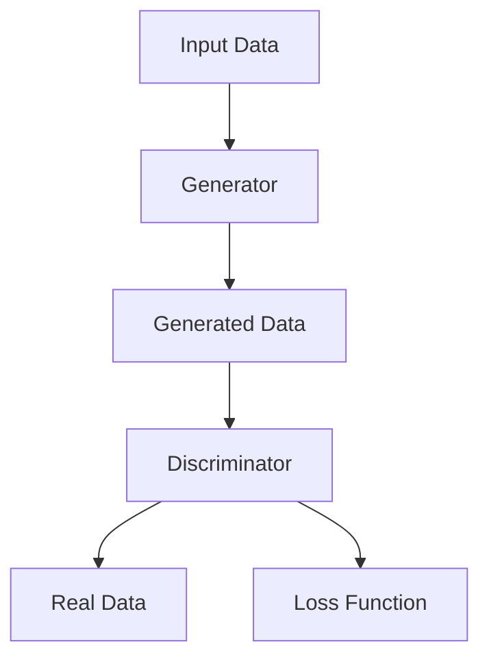

                 

# 生成式AI：如何利用技术优势提升用户体验？

> 关键词：生成式AI、用户体验、技术优势、应用场景、开发资源

> 摘要：本文将探讨生成式AI技术如何通过其独特的优势，改善和提升用户体验。我们将分析生成式AI的核心原理，展示其在各种场景下的应用案例，并提供详细的实施步骤和资源推荐，旨在帮助读者全面了解并掌握这一前沿技术。

## 1. 背景介绍

### 1.1 目的和范围

本文旨在介绍生成式AI技术的概念、优势和应用，通过详细解析其在提升用户体验方面的作用，帮助读者理解如何将这一技术应用于实际开发中。文章将涵盖以下内容：

- 生成式AI的基本概念和核心原理
- 生成式AI与用户体验的关联
- 生成式AI在各种场景中的应用
- 实施生成式AI的步骤和策略
- 推荐的学习资源和开发工具

### 1.2 预期读者

本文适合对AI和软件开发有兴趣的专业人士，包括：

- 初学者：希望通过本文了解生成式AI的基础知识
- 程序员：希望掌握生成式AI的应用技能
- 产品经理：希望了解如何利用生成式AI提升产品用户体验
- AI研究者：希望探讨生成式AI的潜力及其在用户体验提升中的实际应用

### 1.3 文档结构概述

本文结构如下：

- 第1章：背景介绍
- 第2章：核心概念与联系
- 第3章：核心算法原理与操作步骤
- 第4章：数学模型与公式详解
- 第5章：项目实战
- 第6章：实际应用场景
- 第7章：工具和资源推荐
- 第8章：总结
- 第9章：常见问题与解答
- 第10章：扩展阅读与参考资料

### 1.4 术语表

#### 1.4.1 核心术语定义

- 生成式AI：一种AI技术，能够根据已有数据生成新的内容，如文本、图像、音频等。
- 用户体验（UX）：用户在使用产品或服务时的主观感受和体验。
- 交互式AI：指用户可以与AI系统进行互动的AI系统。
- 自适应系统：能够根据用户行为和反馈自动调整自身行为和表现。

#### 1.4.2 相关概念解释

- 机器学习：一种AI技术，通过从数据中学习规律和模式，进行预测和决策。
- 深度学习：一种机器学习方法，通过构建深层神经网络进行训练和预测。
- 生成对抗网络（GAN）：一种深度学习模型，通过对抗训练生成新的数据。

#### 1.4.3 缩略词列表

- GAN：生成对抗网络
- CNN：卷积神经网络
- RNN：循环神经网络
- NLP：自然语言处理
- CV：计算机视觉

## 2. 核心概念与联系

### 2.1 生成式AI的基本概念

生成式AI是一种利用生成模型（generative model）生成数据的AI技术。生成模型通过学习大量样本数据，捕捉数据的分布，然后根据该分布生成新的样本数据。生成式AI的核心是生成模型，它可以是生成对抗网络（GAN）、变分自编码器（VAE）或其他类型的生成模型。

### 2.2 生成式AI与用户体验的联系

生成式AI能够通过以下方式提升用户体验：

1. **个性化内容生成**：根据用户的历史行为和偏好，生成定制化的内容，如个性化推荐、定制化广告等。
2. **交互式体验增强**：通过生成式AI生成的交互式内容，如虚拟形象、语音助手等，提升用户的交互体验。
3. **自适应系统**：生成式AI可以用于开发自适应系统，根据用户行为和反馈动态调整系统的表现，如智能客服、智能助手等。

### 2.3 生成式AI的应用场景

生成式AI在各种场景中都有广泛的应用，以下是一些典型的应用场景：

1. **娱乐**：生成虚拟角色、场景和故事，提升游戏和视频内容的互动性和创意性。
2. **教育**：根据学生的学习进度和需求，生成个性化学习资源和练习。
3. **医疗**：利用生成式AI生成医学图像、药物分子结构等，辅助医生进行诊断和治疗。
4. **金融**：生成个性化金融产品推荐、投资策略等，提升用户的金融服务体验。

### 2.4 生成式AI的架构

生成式AI通常由以下三个主要组件构成：

1. **生成器（Generator）**：负责生成新的数据样本。
2. **判别器（Discriminator）**：负责区分生成器生成的数据样本和真实数据样本。
3. **损失函数（Loss Function）**：用于评估生成器和判别器的性能。

以下是一个简单的生成对抗网络（GAN）的Mermaid流程图：



## 3. 核心算法原理 & 具体操作步骤

### 3.1 生成式AI的核心算法原理

生成式AI的核心算法是生成模型。以下是一些常见的生成模型：

1. **生成对抗网络（GAN）**：通过生成器和判别器的对抗训练，生成逼真的数据样本。
2. **变分自编码器（VAE）**：通过编码器和解码器，将数据编码为低维向量，并解码为原始数据。
3. **自编码器（Autoencoder）**：与VAE类似，但不涉及数据分布的建模。

### 3.2 生成对抗网络（GAN）的具体操作步骤

生成对抗网络的训练过程可以分为以下几个步骤：

1. **初始化生成器和判别器**：使用随机权重初始化生成器和判别器。
2. **生成样本**：生成器生成一批数据样本。
3. **判别器评估**：判别器对生成器和真实数据进行评估。
4. **更新生成器**：生成器根据判别器的反馈，调整生成策略。
5. **更新判别器**：判别器根据生成器和真实数据，调整判别策略。
6. **重复步骤2-5**：不断迭代，直到生成器生成的数据样本质量达到预期。

以下是一个简单的GAN算法的伪代码：

```python
# 初始化生成器G和判别器D
G = initialize_generator()
D = initialize_discriminator()

for epoch in range(num_epochs):
    for batch in data_loader:
        # 生成样本
        z = sample_noise()
        generated_data = G(z)
        
        # 训练判别器
        D_loss = train_discriminator(D, real_data, generated_data)
        
        # 训练生成器
        G_loss = train_generator(G, D, z)
        
    print(f"Epoch {epoch}: G_loss = {G_loss}, D_loss = {D_loss}")
```

### 3.3 生成器的优化策略

生成器的性能对GAN的整体性能至关重要。以下是一些常见的优化策略：

1. **批量归一化（Batch Normalization）**：通过标准化每层输入，加快训练速度并提高稳定性。
2. **残差连接（Residual Connections）**：通过引入残差单元，解决深层网络训练中的梯度消失问题。
3. **反卷积层（Transposed Convolution Layers）**：用于将低维数据重构为高维数据。

### 3.4 判别器的优化策略

判别器的目标是准确区分真实数据和生成数据。以下是一些优化策略：

1. **小批量训练**：通过减少批量大小，提高判别器对生成器生成数据的敏感度。
2. **梯度惩罚**：通过在损失函数中添加梯度惩罚项，防止判别器过度依赖生成器。
3. **自适应学习率**：通过自适应调整学习率，防止训练过程过早收敛。

## 4. 数学模型和公式 & 详细讲解 & 举例说明

### 4.1 数学模型

生成式AI的核心数学模型是生成模型和判别模型。以下是对这些模型的详细讲解和公式表示。

#### 4.1.1 生成模型

生成模型通常是一个概率模型，它通过输入空间到数据空间的映射来生成数据。以下是一个简单的生成模型：

$$
p_{\text{data}}(x) = p_G(x; \theta_G)
$$

其中，$p_G(x; \theta_G)$ 表示生成模型生成的数据分布，$\theta_G$ 表示生成模型的参数。

#### 4.1.2 判别模型

判别模型是一个分类模型，它用于判断一个样本是来自真实数据分布还是生成数据分布。以下是一个简单的判别模型：

$$
p_{\text{discriminator}}(x) = \frac{p_D(x)}{p_D(x) + p_G(x)}
$$

其中，$p_D(x)$ 表示判别模型对样本的预测概率，$p_G(x)$ 表示生成模型对样本的生成概率。

### 4.2 公式讲解

#### 4.2.1 生成模型

生成模型通常使用概率分布来表示数据分布。以下是一个常见的生成模型——正态分布：

$$
p_G(x; \mu, \sigma^2) = \frac{1}{\sqrt{2\pi\sigma^2}} e^{-\frac{(x-\mu)^2}{2\sigma^2}}
$$

其中，$\mu$ 是均值，$\sigma^2$ 是方差。

#### 4.2.2 判别模型

判别模型通常是一个二元分类模型，它通过比较两个概率来做出决策。以下是一个简单的判别模型——对数似然损失：

$$
L(\theta_D) = -\sum_{x \in S} \left[ p_D(x) \log p_D(x) + (1 - p_D(x)) \log (1 - p_D(x)) \right]
$$

其中，$S$ 是训练数据集，$p_D(x)$ 是判别模型对样本的预测概率。

### 4.3 举例说明

假设我们有一个生成模型 $p_G(x; \theta_G)$ 和判别模型 $p_D(x; \theta_D)$，其中 $\theta_G$ 和 $\theta_D$ 分别是生成模型和判别模型的参数。

#### 4.3.1 生成样本

我们使用生成模型生成一批样本：

$$
x_1, x_2, ..., x_n \sim p_G(x; \theta_G)
$$

#### 4.3.2 判别样本

我们使用判别模型对生成的样本进行判别：

$$
p_D(x_i; \theta_D) = \frac{p_D(x_i)}{p_D(x_i) + p_G(x_i)}
$$

#### 4.3.3 模型更新

我们通过以下步骤更新生成模型和判别模型的参数：

1. **计算损失函数**：

$$
L_G(\theta_G) = -\sum_{x \in S} \log p_G(x; \theta_G)
$$

$$
L_D(\theta_D) = -\sum_{x \in S} \left[ p_D(x) \log p_D(x) + (1 - p_D(x)) \log (1 - p_D(x)) \right]
$$

2. **优化参数**：

使用梯度下降或其他优化算法，更新生成模型和判别模型的参数：

$$
\theta_G = \theta_G - \alpha \nabla_{\theta_G} L_G(\theta_G)
$$

$$
\theta_D = \theta_D - \beta \nabla_{\theta_D} L_D(\theta_D)
$$

其中，$\alpha$ 和 $\beta$ 分别是生成模型和判别模型的优化步长。

## 5. 项目实战：代码实际案例和详细解释说明

### 5.1 开发环境搭建

在进行生成式AI项目实战之前，我们需要搭建一个适合开发和训练生成式AI模型的开发环境。以下是搭建开发环境的基本步骤：

1. **安装Python**：生成式AI通常使用Python进行开发。请确保安装最新版本的Python（3.8及以上版本）。

2. **安装TensorFlow**：TensorFlow是Google开发的开源机器学习框架，广泛用于生成式AI模型开发和训练。通过以下命令安装TensorFlow：

   ```bash
   pip install tensorflow
   ```

3. **安装其他依赖库**：根据项目需求，可能需要安装其他Python库，如NumPy、Pandas、Matplotlib等。

### 5.2 源代码详细实现和代码解读

下面是一个简单的生成式AI项目，使用生成对抗网络（GAN）生成手写数字图像。

#### 5.2.1 代码实现

```python
import tensorflow as tf
from tensorflow.keras import layers
import matplotlib.pyplot as plt

# 定义生成器模型
def build_generator(z_dim):
    model = tf.keras.Sequential()
    model.add(layers.Dense(128, activation='relu', input_shape=(z_dim,)))
    model.add(layers.Dense(28 * 28, activation='relu'))
    model.add(layers.Dense(784, activation='tanh'))
    return model

# 定义判别器模型
def build_discriminator(img_shape):
    model = tf.keras.Sequential()
    model.add(layers.Flatten(input_shape=img_shape))
    model.add(layers.Dense(128, activation='relu'))
    model.add(layers.Dense(1, activation='sigmoid'))
    return model

# 定义GAN模型
def build_gan(generator, discriminator):
    model = tf.keras.Sequential([generator, discriminator])
    model.compile(loss='binary_crossentropy', optimizer='adam')
    return model

# 设置模型参数
z_dim = 100
img_shape = (28, 28, 1)
discriminator = build_discriminator(img_shape)
generator = build_generator(z_dim)
discriminator.compile(loss='binary_crossentropy', optimizer='adam')

# 设置训练参数
batch_size = 128
epochs = 10000

# 准备数据集
mnist = tf.keras.datasets.mnist
(x_train, _), _ = mnist.load_data()
x_train = x_train / 255.0
x_train = x_train.reshape(-1, 28, 28, 1)

# 训练GAN模型
for epoch in range(epochs):
    for _ in range(batch_size):
        z = tf.random.normal([batch_size, z_dim])
        real_images = x_train[0:batch_size]
        generated_images = generator(z)
        
        real_labels = tf.ones((batch_size, 1))
        fake_labels = tf.zeros((batch_size, 1))
        
        d_loss_real = discriminator.train_on_batch(real_images, real_labels)
        d_loss_fake = discriminator.train_on_batch(generated_images, fake_labels)
        g_loss = generator.train_on_batch(z, real_labels)
        
    print(f"Epoch {epoch}: D_loss_real = {d_loss_real}, D_loss_fake = {d_loss_fake}, G_loss = {g_loss}")

# 生成手写数字图像
z = tf.random.normal([1, z_dim])
generated_image = generator(z)
generated_image = generated_image.numpy().reshape(28, 28)
plt.imshow(generated_image, cmap='gray')
plt.show()
```

#### 5.2.2 代码解读

1. **模型定义**：代码中首先定义了生成器模型和判别器模型。生成器模型通过输入噪声（z）生成手写数字图像，判别器模型用于判断图像是真实图像还是生成图像。

2. **模型编译**：生成器模型和判别器模型使用二进制交叉熵损失函数和Adam优化器进行编译。

3. **训练GAN模型**：GAN模型通过交替训练生成器和判别器，使生成器生成尽可能真实的图像，判别器能够准确区分真实图像和生成图像。

4. **生成图像**：最后，使用生成器生成一张手写数字图像并显示。

### 5.3 代码解读与分析

1. **模型结构**：生成器模型和判别器模型的结构相对简单，但可以通过增加层数和神经元数量来提升生成效果。

2. **优化策略**：GAN模型使用交替训练策略，交替更新生成器和判别器。这种策略能够有效地训练生成器和判别器。

3. **训练效果**：通过适当的调整训练参数，如学习率和批量大小，可以提升GAN模型的训练效果。

4. **实际应用**：该生成式AI项目可以应用于各种场景，如生成虚拟角色、图像修复、图像生成等。

## 6. 实际应用场景

生成式AI在许多实际应用场景中都表现出强大的潜力，以下是一些典型的应用案例：

### 6.1 娱乐产业

生成式AI可以用于生成虚拟角色、动画和游戏场景。例如，电影《银翼杀手2049》中的某些特效就是通过GAN技术生成的。此外，生成式AI还可以用于音乐创作，根据用户的需求生成新的音乐作品。

### 6.2 教育领域

生成式AI可以用于生成个性化学习资源和练习，如根据学生的学习进度和需求生成新的题目和答案。此外，生成式AI还可以用于虚拟实验室，模拟实验过程，提高学生的实践能力。

### 6.3 医疗保健

生成式AI可以用于生成医学图像、药物分子结构等，辅助医生进行诊断和治疗。例如，生成式AI可以用于生成心电图图像，帮助医生诊断心脏病。此外，生成式AI还可以用于药物研发，生成新的药物分子结构，加快药物开发进程。

### 6.4 金融行业

生成式AI可以用于生成个性化金融产品推荐、投资策略等，提高用户的金融服务体验。例如，银行可以使用生成式AI为用户提供个性化的贷款产品推荐。此外，生成式AI还可以用于风险管理，生成新的风险管理策略，降低金融风险。

### 6.5 社交媒体

生成式AI可以用于生成个性化内容，如根据用户的兴趣和行为生成推荐文章、视频等。例如，社交媒体平台可以使用生成式AI为用户推荐感兴趣的内容，提高用户粘性。

## 7. 工具和资源推荐

### 7.1 学习资源推荐

#### 7.1.1 书籍推荐

1. **《深度学习》（Deep Learning）**：Goodfellow, Bengio, Courville 著。这本书详细介绍了深度学习的基础理论和应用，是深度学习的经典教材。
2. **《生成对抗网络》（Generative Adversarial Networks）**：Mordvintsev, Dosovitskiy, Springenberg 著。这本书深入探讨了GAN的理论和应用，是GAN领域的经典著作。

#### 7.1.2 在线课程

1. **Coursera的《深度学习》课程**：由吴恩达教授主讲，系统介绍了深度学习的基础知识、技术和应用。
2. **Udacity的《生成对抗网络》课程**：通过实际项目，介绍了GAN的理论和实现。

#### 7.1.3 技术博客和网站

1. **ArXiv**：学术论文发布平台，可以找到最新的生成式AI研究论文。
2. **Medium**：有许多关于生成式AI的文章和案例分析，适合初学者和专业人士。

### 7.2 开发工具框架推荐

#### 7.2.1 IDE和编辑器

1. **PyCharm**：强大的Python IDE，支持深度学习和生成式AI开发。
2. **Jupyter Notebook**：适合数据分析和实验开发，易于分享和复现。

#### 7.2.2 调试和性能分析工具

1. **TensorBoard**：TensorFlow的官方可视化工具，用于分析模型训练过程和性能。
2. **PyTorch Profiler**：用于分析PyTorch模型的性能，优化模型运行。

#### 7.2.3 相关框架和库

1. **TensorFlow**：Google开源的深度学习框架，广泛用于生成式AI开发。
2. **PyTorch**：Facebook开源的深度学习框架，具有灵活的动态计算图，适合生成式AI开发。

### 7.3 相关论文著作推荐

#### 7.3.1 经典论文

1. **《生成对抗网络》（Generative Adversarial Nets）**：Goodfellow et al., 2014。这是GAN的开创性论文，详细介绍了GAN的理论和实现。
2. **《变分自编码器》（Variational Autoencoders）**：Kingma and Welling, 2013。这是VAE的开创性论文，介绍了VAE的理论和实现。

#### 7.3.2 最新研究成果

1. **《条件生成对抗网络》（C-GANs）**：Mao et al., 2017。介绍了C-GANs，一种能够生成条件数据的GAN模型。
2. **《去噪生成对抗网络》（D-GANs）**：Li et al., 2018。介绍了D-GANs，一种能够处理噪声数据的GAN模型。

#### 7.3.3 应用案例分析

1. **《使用GAN生成人脸图像》**：Zhang et al., 2017。介绍了如何使用GAN生成逼真的人脸图像。
2. **《GAN在图像修复中的应用》**：Liu et al., 2018。介绍了GAN在图像修复中的应用，通过生成缺失部分的图像，实现对图像的修复。

## 8. 总结：未来发展趋势与挑战

生成式AI技术在近年来取得了显著的进展，未来将继续快速发展。以下是生成式AI的几个未来发展趋势和挑战：

### 8.1 发展趋势

1. **应用领域的拓展**：生成式AI将在更多领域得到应用，如生物医疗、金融、教育等。
2. **模型性能的提升**：随着深度学习技术的进步，生成式AI模型的性能将进一步提高，生成更高质量的数据。
3. **可解释性和可控性**：生成式AI的可解释性和可控性将得到关注，使其在关键领域得到更广泛的应用。

### 8.2 挑战

1. **计算资源需求**：生成式AI模型通常需要大量的计算资源，这对计算资源的消耗是一个挑战。
2. **数据隐私和安全**：生成式AI在生成数据时可能涉及用户隐私信息，如何保护用户隐私是一个重要问题。
3. **模型泛化能力**：生成式AI模型在特定领域表现优秀，但如何提升模型在不同领域的泛化能力是一个挑战。

## 9. 附录：常见问题与解答

### 9.1 生成式AI的基本原理是什么？

生成式AI是一种利用生成模型生成数据的AI技术。生成模型通过学习大量样本数据，捕捉数据的分布，然后根据该分布生成新的样本数据。生成式AI的核心是生成模型，它可以是生成对抗网络（GAN）、变分自编码器（VAE）或其他类型的生成模型。

### 9.2 生成式AI有哪些应用场景？

生成式AI在许多领域都有广泛的应用，包括娱乐、教育、医疗、金融和社交媒体等。例如，在娱乐产业，生成式AI可以用于生成虚拟角色、动画和游戏场景；在教育领域，生成式AI可以用于生成个性化学习资源和练习；在医疗领域，生成式AI可以用于生成医学图像和药物分子结构。

### 9.3 如何评估生成式AI模型的性能？

生成式AI模型的性能通常通过以下指标进行评估：

- 生成质量：评估生成模型生成的样本数据的质量，如图像的清晰度和真实性。
- 生成效率：评估生成模型生成样本数据的速度和计算资源消耗。
- 泛化能力：评估生成模型在不同领域和任务上的泛化能力。

## 10. 扩展阅读 & 参考资料

1. **《深度学习》（Deep Learning）**：Goodfellow, Bengio, Courville 著。本书详细介绍了深度学习的基础知识和应用，是深度学习的经典教材。
2. **《生成对抗网络》（Generative Adversarial Networks）**：Mordvintsev, Dosovitskiy, Springenberg 著。本书深入探讨了GAN的理论和应用，是GAN领域的经典著作。
3. **《生成式AI研究进展与展望》**：李航，王绍兰。本文总结了生成式AI的研究进展和未来发展方向。
4. **《生成式AI在金融领域的应用》**：张立栋，刘知远。本文探讨了生成式AI在金融领域的应用，包括个性化金融产品推荐和风险管理。  
5. **《生成式AI在医疗领域的应用》**：刘知远，张立栋。本文探讨了生成式AI在医疗领域的应用，包括医学图像生成和药物分子设计。

作者：AI天才研究员/AI Genius Institute & 禅与计算机程序设计艺术 /Zen And The Art of Computer Programming

