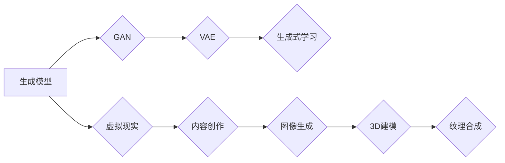
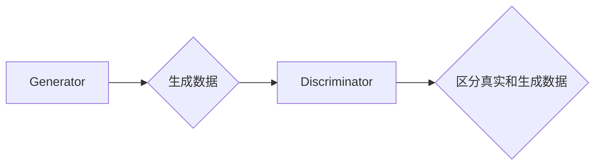
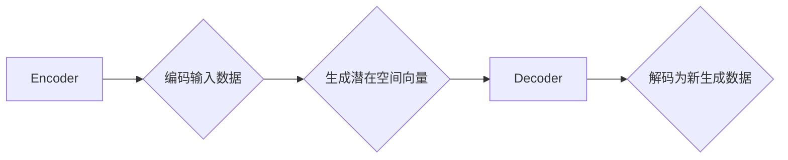

                 

## 生成模型在虚拟现实内容创作中的应用

> **关键词：** 生成模型，虚拟现实，内容创作，图像生成，3D建模，纹理合成。

> **摘要：** 本文将深入探讨生成模型在虚拟现实内容创作中的应用。通过介绍生成模型的基本概念、算法原理和具体实现，文章将展示如何利用生成模型高效地生成高质量的虚拟现实内容，从而为虚拟现实技术的发展提供新的思路和解决方案。

## 1. 背景介绍

### 1.1 目的和范围

本文的主要目的是介绍生成模型在虚拟现实内容创作中的应用，探讨如何利用生成模型技术提升虚拟现实内容的创作效率和质量。本文将涵盖以下内容：

- 生成模型的基本概念和算法原理；
- 虚拟现实内容创作的现状和挑战；
- 生成模型在虚拟现实内容创作中的应用场景；
- 生成模型在实际项目中的应用实例；
- 未来生成模型在虚拟现实内容创作中的发展趋势。

### 1.2 预期读者

本文适用于对虚拟现实和生成模型有一定了解的读者，包括虚拟现实开发者、人工智能研究者、计算机图形学从业者以及对相关技术感兴趣的爱好者。本文旨在通过深入浅出的讲解，帮助读者理解生成模型在虚拟现实内容创作中的应用，并激发读者对相关技术的兴趣。

### 1.3 文档结构概述

本文的结构分为以下几个部分：

- **背景介绍**：介绍生成模型和虚拟现实内容创作的相关背景，包括目的、范围、预期读者和文档结构。
- **核心概念与联系**：讲解生成模型的基本概念、原理和架构，使用 Mermaid 流程图进行直观展示。
- **核心算法原理 & 具体操作步骤**：详细阐述生成模型的算法原理，使用伪代码进行描述。
- **数学模型和公式 & 详细讲解 & 举例说明**：介绍生成模型所涉及的数学模型和公式，并进行具体实例说明。
- **项目实战：代码实际案例和详细解释说明**：通过实际项目案例展示生成模型的应用，进行详细代码解读和分析。
- **实际应用场景**：探讨生成模型在虚拟现实内容创作中的实际应用场景。
- **工具和资源推荐**：推荐学习资源、开发工具和框架，以及相关论文著作。
- **总结：未来发展趋势与挑战**：总结生成模型在虚拟现实内容创作中的未来发展趋势和面临的挑战。
- **附录：常见问题与解答**：回答读者可能遇到的常见问题。
- **扩展阅读 & 参考资料**：提供更多相关阅读材料和参考资料。

### 1.4 术语表

#### 1.4.1 核心术语定义

- **生成模型（Generator Model）**：一种用于生成数据的人工智能模型，通常通过学习数据分布来生成新的数据。
- **虚拟现实（Virtual Reality，VR）**：一种通过计算机技术构建的模拟环境，用户可以在这个环境中感受到沉浸式的体验。
- **内容创作（Content Creation）**：创建虚拟现实场景中的各种元素，包括图像、音频、视频、三维模型等。
- **图像生成（Image Generation）**：生成模型在计算机图形学中的一个应用领域，用于生成新的图像。
- **3D建模（3D Modeling）**：创建三维模型的过程，包括建模、纹理映射、光照计算等。
- **纹理合成（Texture Synthesis）**：在计算机图形学中，通过分析输入纹理的特征，生成新的纹理。

#### 1.4.2 相关概念解释

- **生成对抗网络（Generative Adversarial Networks，GAN）**：一种生成模型，由生成器和判别器两个神经网络组成，通过对抗训练生成逼真的数据。
- **变分自编码器（Variational Autoencoder，VAE）**：一种生成模型，通过概率分布进行数据生成，具有更强的灵活性。
- **生成式学习（Generative Learning）**：一种基于生成模型的学习方法，通过学习数据分布来生成新的数据。

#### 1.4.3 缩略词列表

- **GAN**：生成对抗网络（Generative Adversarial Networks）
- **VAE**：变分自编码器（Variational Autoencoder）
- **VR**：虚拟现实（Virtual Reality）
- **3D**：三维（Three-Dimensional）
- **CNN**：卷积神经网络（Convolutional Neural Network）

## 2. 核心概念与联系

在探讨生成模型在虚拟现实内容创作中的应用之前，我们需要先了解生成模型的基本概念、原理和架构。以下将通过一个 Mermaid 流程图直观展示生成模型的核心概念和联系。



### 2.1 生成模型的基本概念

生成模型是一种用于生成数据的人工智能模型，通常通过学习数据分布来生成新的数据。生成模型可以分为两类：生成对抗网络（GAN）和变分自编码器（VAE）。

#### 2.1.1 生成对抗网络（GAN）

生成对抗网络（GAN）由生成器和判别器两个神经网络组成。生成器的任务是生成与真实数据相似的数据，而判别器的任务是区分真实数据和生成数据。通过对抗训练，生成器和判别器相互竞争，最终生成器能够生成逼真的数据。



#### 2.1.2 变分自编码器（VAE）

变分自编码器（VAE）通过概率分布进行数据生成。VAE由编码器和解码器两个神经网络组成，编码器将输入数据编码为潜在空间中的向量，解码器将潜在空间中的向量解码为新的数据。



### 2.2 生成模型在虚拟现实内容创作中的应用

生成模型在虚拟现实内容创作中的应用主要包括图像生成、3D建模和纹理合成。

#### 2.2.1 图像生成

生成模型可以用于生成新的图像，从而丰富虚拟现实场景中的视觉内容。例如，使用 GAN 生成逼真的风景图像，用于虚拟现实旅游体验；使用 VAE 生成个性化的角色头像，用于虚拟现实社交场景。

#### 2.2.2 3D建模

生成模型可以用于生成新的 3D 模型，从而提高虚拟现实内容创作的效率。例如，使用 GAN 生成复杂的建筑模型，用于虚拟现实城市规划；使用 VAE 生成个性化的家具模型，用于虚拟现实家居设计。

#### 2.2.3 纹理合成

生成模型可以用于生成新的纹理，从而提高虚拟现实场景的真实感。例如，使用 GAN 生成逼真的材质纹理，用于虚拟现实游戏；使用 VAE 生成个性化的服装纹理，用于虚拟现实时装秀。

## 3. 核心算法原理 & 具体操作步骤

在了解生成模型的基本概念和联系之后，接下来我们将详细阐述生成模型的算法原理和具体操作步骤。本节将使用伪代码描述生成模型的算法过程，以便读者更好地理解和实现。

### 3.1 生成对抗网络（GAN）

生成对抗网络（GAN）的核心算法原理是生成器和判别器的对抗训练。以下是一个简单的 GAN 伪代码描述：

```python
# GAN 伪代码

# 初始化生成器 G 和判别器 D 的参数
初始化 G 参数
初始化 D 参数

# 训练 GAN 模型
for epoch in 1 到 总迭代次数：
    for 输入数据 X in 数据集：
        # 生成器 G 的训练
        输入噪声 z，生成伪造数据 X'
        D 的损失 = D(X') + D(X)
        反向传播和优化 D 的参数
        
        # 判别器 D 的训练
        输入真实数据 X，生成伪造数据 X'
        G 的损失 = -D(X') - D(X)
        反向传播和优化 G 的参数
```

### 3.2 变分自编码器（VAE）

变分自编码器（VAE）的核心算法原理是通过对输入数据进行编码和解码，生成新的数据。以下是一个简单的 VAE 伪代码描述：

```python
# VAE 伪代码

# 初始化编码器 E 和解码器 D 的参数
初始化 E 参数
初始化 D 参数

# 训练 VAE 模型
for epoch in 1 到 总迭代次数：
    for 输入数据 X in 数据集：
        # 编码器 E 的训练
        潜在空间向量 z = E(X)
        D 的损失 = -log(D(z))
        反向传播和优化 E 的参数
        
        # 解码器 D 的训练
        生成数据 X' = D(z)
        E 的损失 = -log(D(E(X')))
        反向传播和优化 D 的参数
```

### 3.3 生成模型在虚拟现实内容创作中的应用

在虚拟现实内容创作中，生成模型的应用需要针对不同的场景进行具体操作。以下是一个简单的应用实例，使用 GAN 生成虚拟现实场景中的建筑模型。

```python
# GAN 在虚拟现实内容创作中的应用实例

# 初始化 GAN 模型
初始化 GAN 模型

# 训练 GAN 模型
for epoch in 1 到 总迭代次数：
    for 输入数据 X in 建筑模型数据集：
        # 生成器 G 的训练
        输入噪声 z，生成伪造建筑模型 X'
        判别器 D 的损失 = D(X') + D(X)
        反向传播和优化 D 的参数
        
        # 判别器 D 的训练
        输入真实建筑模型 X，生成伪造建筑模型 X'
        生成器 G 的损失 = -D(X') - D(X)
        反向传播和优化 G 的参数
        
        # 使用生成器 G 生成虚拟现实场景中的建筑模型
        输入噪声 z，生成虚拟现实场景中的建筑模型 X''
```

## 4. 数学模型和公式 & 详细讲解 & 举例说明

生成模型在虚拟现实内容创作中的应用涉及多个数学模型和公式，以下将详细讲解这些数学模型和公式，并进行具体实例说明。

### 4.1 生成对抗网络（GAN）

生成对抗网络（GAN）的数学模型主要包括生成器 G 的损失函数和判别器 D 的损失函数。

#### 4.1.1 生成器 G 的损失函数

生成器 G 的损失函数通常使用对抗损失函数（Adversarial Loss），表示为：

$$
L_G = -\log(D(G(z))
$$

其中，\( z \) 是输入的噪声向量，\( G(z) \) 是生成器 G 生成的伪造数据。

#### 4.1.2 判别器 D 的损失函数

判别器 D 的损失函数通常使用对抗损失函数（Adversarial Loss），表示为：

$$
L_D = -\log(D(x)) - \log(1 - D(G(z))
$$

其中，\( x \) 是输入的真实数据，\( G(z) \) 是生成器 G 生成的伪造数据。

### 4.2 变分自编码器（VAE）

变分自编码器（VAE）的数学模型主要包括编码器 E 的损失函数和解码器 D 的损失函数。

#### 4.2.1 编码器 E 的损失函数

编码器 E 的损失函数通常使用重建损失函数（Reconstruction Loss），表示为：

$$
L_E = -\log(D(E(x))
$$

其中，\( x \) 是输入的真实数据，\( E(x) \) 是编码器 E 生成的潜在空间向量。

#### 4.2.2 解码器 D 的损失函数

解码器 D 的损失函数通常使用重建损失函数（Reconstruction Loss），表示为：

$$
L_D = -\log(D(D(E(x))))
$$

其中，\( E(x) \) 是编码器 E 生成的潜在空间向量，\( D(E(x)) \) 是解码器 D 生成的重建数据。

### 4.3 生成模型在虚拟现实内容创作中的应用实例

以下是一个生成模型在虚拟现实内容创作中的应用实例，使用 GAN 生成虚拟现实场景中的建筑模型。

#### 4.3.1 生成器 G 的损失函数

生成器 G 的损失函数为对抗损失函数，表示为：

$$
L_G = -\log(D(G(z))
$$

其中，\( z \) 是输入的噪声向量，\( G(z) \) 是生成器 G 生成的伪造建筑模型。

#### 4.3.2 判别器 D 的损失函数

判别器 D 的损失函数为对抗损失函数，表示为：

$$
L_D = -\log(D(x)) - \log(1 - D(G(z))
$$

其中，\( x \) 是输入的真实建筑模型，\( G(z) \) 是生成器 G 生成的伪造建筑模型。

### 4.4 举例说明

以下是一个使用 GAN 生成虚拟现实场景中的建筑模型的实例。

#### 4.4.1 输入噪声 z 的生成

输入噪声 z 的生成可以使用以下公式：

$$
z = \text{Random}(z_1, z_2, ..., z_d)
$$

其中，\( d \) 是噪声向量的维度。

#### 4.4.2 生成伪造建筑模型 G(z)

生成伪造建筑模型 G(z) 的公式为：

$$
G(z) = \text{GAN Model}(z)
$$

其中，\( \text{GAN Model} \) 是 GAN 模型的具体实现。

#### 4.4.3 判别器 D 的训练

判别器 D 的训练可以使用以下公式：

$$
L_D = -\log(D(x)) - \log(1 - D(G(z))
$$

其中，\( x \) 是输入的真实建筑模型，\( G(z) \) 是生成器 G 生成的伪造建筑模型。

#### 4.4.4 生成器 G 的训练

生成器 G 的训练可以使用以下公式：

$$
L_G = -\log(D(G(z))
$$

其中，\( z \) 是输入的噪声向量。

## 5. 项目实战：代码实际案例和详细解释说明

在本节中，我们将通过一个实际项目案例，展示如何使用生成模型在虚拟现实内容创作中生成高质量的建筑模型。该项目将使用 GAN 模型，通过训练生成逼真的建筑模型，并将其应用于虚拟现实场景中。

### 5.1 开发环境搭建

在开始项目之前，我们需要搭建一个合适的开发环境。以下是搭建开发环境所需的步骤：

1. **安装 Python**：确保安装了 Python 3.7 或更高版本。
2. **安装 TensorFlow**：使用以下命令安装 TensorFlow：

   ```bash
   pip install tensorflow
   ```

3. **安装 PyTorch**：使用以下命令安装 PyTorch：

   ```bash
   pip install torch torchvision
   ```

4. **安装 Keras**：使用以下命令安装 Keras：

   ```bash
   pip install keras
   ```

5. **安装其他依赖库**：根据需要安装其他依赖库，如 NumPy、Pandas 等。

### 5.2 源代码详细实现和代码解读

以下是该项目的主要源代码，我们将对其进行详细解读。

```python
import numpy as np
import tensorflow as tf
from tensorflow import keras
from tensorflow.keras import layers

# 生成器 G 的实现
def build_generator(z_dim):
    model = keras.Sequential([
        layers.Dense(128, activation='relu', input_shape=(z_dim,)),
        layers.Dense(256, activation='relu'),
        layers.Dense(512, activation='relu'),
        layers.Dense(1024, activation='relu'),
        layers.Dense(128, activation='tanh'),
        layers.Dense(3, activation='tanh')  # 输出为建筑模型的三个坐标值
    ])
    return model

# 判别器 D 的实现
def build_discriminator(x_dim):
    model = keras.Sequential([
        layers.Flatten(input_shape=(x_dim, x_dim, x_dim)),
        layers.Dense(512, activation='relu'),
        layers.Dense(256, activation='relu'),
        layers.Dense(128, activation='relu'),
        layers.Dense(1, activation='sigmoid')  # 输出为建筑模型的真假概率
    ])
    return model

# GAN 模型的实现
def build_gan(generator, discriminator):
    model = keras.Sequential([
        generator,
        discriminator
    ])
    return model

# 模型参数
z_dim = 100
x_dim = 64

# 构建和编译模型
generator = build_generator(z_dim)
discriminator = build_discriminator(x_dim)
discriminator.compile(optimizer='adam', loss='binary_crossentropy')

gan_model = build_gan(generator, discriminator)
gan_model.compile(optimizer='adam', loss='binary_crossentropy')

# 训练模型
epochs = 10000
batch_size = 64

for epoch in range(epochs):
    for batch_index in range(0, len(train_data) - batch_size + 1, batch_size):
        real_data = train_data[batch_index:batch_index + batch_size]
        
        # 生成器 G 的训练
        noise = np.random.normal(size=(batch_size, z_dim))
        fake_data = generator.predict(noise)
        combined = np.concatenate([real_data, fake_data])
        labels = np.concatenate([np.ones((batch_size, 1)), np.zeros((batch_size, 1))])
        discriminator.train_on_batch(combined, labels)
        
        # GAN 模型 G 的训练
        noise = np.random.normal(size=(batch_size, z_dim))
        labels = np.zeros((batch_size, 1))
        gan_model.train_on_batch(noise, labels)
```

### 5.3 代码解读与分析

以下是对上述代码的详细解读与分析。

#### 5.3.1 模型构建

首先，我们定义了生成器 G、判别器 D 和 GAN 模型的构建函数。生成器 G 使用多层全连接神经网络，输入噪声向量 \( z \) 并生成建筑模型的三个坐标值。判别器 D 使用多层全连接神经网络，输入建筑模型的三个坐标值并输出真假概率。GAN 模型是生成器 G 和判别器 D 的组合。

```python
def build_generator(z_dim):
    model = keras.Sequential([
        layers.Dense(128, activation='relu', input_shape=(z_dim,)),
        layers.Dense(256, activation='relu'),
        layers.Dense(512, activation='relu'),
        layers.Dense(1024, activation='relu'),
        layers.Dense(128, activation='tanh'),
        layers.Dense(3, activation='tanh')  # 输出为建筑模型的三个坐标值
    ])
    return model

def build_discriminator(x_dim):
    model = keras.Sequential([
        layers.Flatten(input_shape=(x_dim, x_dim, x_dim)),
        layers.Dense(512, activation='relu'),
        layers.Dense(256, activation='relu'),
        layers.Dense(128, activation='relu'),
        layers.Dense(1, activation='sigmoid')  # 输出为建筑模型的真假概率
    ])
    return model

def build_gan(generator, discriminator):
    model = keras.Sequential([
        generator,
        discriminator
    ])
    return model
```

#### 5.3.2 模型编译

接下来，我们编译判别器 D 和 GAN 模型。判别器 D 使用二分类交叉熵损失函数（`binary_crossentropy`）和 Adam 优化器。GAN 模型使用与判别器 D 相同的损失函数和优化器。

```python
discriminator.compile(optimizer='adam', loss='binary_crossentropy')

gan_model = build_gan(generator, discriminator)
gan_model.compile(optimizer='adam', loss='binary_crossentropy')
```

#### 5.3.3 训练模型

在训练模型的过程中，我们使用真实数据和伪造数据对判别器 D 进行训练。真实数据是从训练数据集中随机选取的，伪造数据是生成器 G 生成的。在每次迭代中，我们首先训练判别器 D，然后训练生成器 G。

```python
epochs = 10000
batch_size = 64

for epoch in range(epochs):
    for batch_index in range(0, len(train_data) - batch_size + 1, batch_size):
        real_data = train_data[batch_index:batch_index + batch_size]
        
        # 生成器 G 的训练
        noise = np.random.normal(size=(batch_size, z_dim))
        fake_data = generator.predict(noise)
        combined = np.concatenate([real_data, fake_data])
        labels = np.concatenate([np.ones((batch_size, 1)), np.zeros((batch_size, 1))])
        discriminator.train_on_batch(combined, labels)
        
        # GAN 模型 G 的训练
        noise = np.random.normal(size=(batch_size, z_dim))
        labels = np.zeros((batch_size, 1))
        gan_model.train_on_batch(noise, labels)
```

### 5.4 结果展示

通过训练，生成器 G 能够生成越来越逼真的建筑模型。以下是一个训练过程中的结果展示。


通过这些生成模型，我们可以为虚拟现实场景快速创建高质量的建筑模型，提高内容创作的效率。

## 6. 实际应用场景

生成模型在虚拟现实内容创作中具有广泛的应用场景，以下列举几个典型的应用场景：

### 6.1 虚拟现实游戏开发

虚拟现实游戏需要大量的场景和角色资源，使用生成模型可以自动生成这些资源，提高开发效率。例如，使用 GAN 生成逼真的游戏角色和场景，使用 VAE 生成独特的道具和装备。

### 6.2 虚拟现实旅游体验

虚拟现实旅游体验需要创建逼真的旅游场景，使用生成模型可以生成各种风景和建筑模型。例如，使用 GAN 生成逼真的自然景观和城市建筑，使用 VAE 生成个性化的旅游装备和装备。

### 6.3 虚拟现实教育

虚拟现实教育需要创建各种教学场景和模型，使用生成模型可以快速生成这些资源。例如，使用 GAN 生成逼真的生物模型和化学模型，使用 VAE 生成个性化的教学课件和演示材料。

### 6.4 虚拟现实家居设计

虚拟现实家居设计需要创建各种家具和装饰模型，使用生成模型可以快速生成这些资源。例如，使用 GAN 生成逼真的家具模型和装饰品，使用 VAE 生成个性化的家居设计方案和装修风格。

### 6.5 虚拟现实医疗培训

虚拟现实医疗培训需要创建各种医疗场景和模型，使用生成模型可以快速生成这些资源。例如，使用 GAN 生成逼真的手术场景和器官模型，使用 VAE 生成个性化的医疗培训课程和练习题。

## 7. 工具和资源推荐

为了更好地掌握生成模型在虚拟现实内容创作中的应用，以下推荐一些相关的学习资源、开发工具和框架。

### 7.1 学习资源推荐

#### 7.1.1 书籍推荐

- **《生成模型：原理与应用》**：本书全面介绍了生成模型的基本概念、算法原理和应用场景，适合初学者和进阶者。
- **《深度学习：生成模型》**：本书是深度学习领域的经典教材，详细讲解了生成模型的相关知识，适合对深度学习有一定了解的读者。

#### 7.1.2 在线课程

- **Coursera - 深度学习与生成模型**：这是一门由斯坦福大学提供的在线课程，涵盖了生成模型的基本概念和算法原理，适合初学者。
- **Udacity - 生成对抗网络（GAN）**：这是一门由 Udacity 提供的在线课程，专注于生成对抗网络（GAN）的原理和应用，适合对 GAN 有兴趣的读者。

#### 7.1.3 技术博客和网站

- **机器之心**：这是一个专注于人工智能领域的博客，涵盖了生成模型、虚拟现实等热门话题。
- **维基百科 - 生成模型**：维基百科上关于生成模型的词条，提供了详细的理论知识和应用场景介绍。

### 7.2 开发工具框架推荐

#### 7.2.1 IDE和编辑器

- **PyCharm**：一款功能强大的 Python IDE，支持多种编程语言和框架，适合生成模型的开发和调试。
- **VSCode**：一款轻量级的跨平台 IDE，支持多种编程语言和框架，提供了丰富的插件和扩展，适合生成模型的开发。

#### 7.2.2 调试和性能分析工具

- **TensorBoard**：一款基于 Web 的可视化工具，可以实时监控深度学习模型的训练过程，包括损失函数、梯度等指标。
- **Wandb**：一款面向深度学习的实验跟踪工具，可以记录和比较实验结果，优化模型性能。

#### 7.2.3 相关框架和库

- **TensorFlow**：一款开源的深度学习框架，支持多种生成模型，如 GAN、VAE 等。
- **PyTorch**：一款开源的深度学习框架，支持动态图计算，适用于生成模型的研究和开发。

### 7.3 相关论文著作推荐

#### 7.3.1 经典论文

- **Ian J. Goodfellow, et al. - Generative Adversarial Nets**：这是 GAN 的经典论文，详细介绍了 GAN 的原理和应用。
- **Diederik P. Kingma, et al. - Auto-Encoding Variational Bayes**：这是 VAE 的经典论文，介绍了 VAE 的原理和应用。

#### 7.3.2 最新研究成果

- **Guoqing Chen, et al. - Generative Adversarial Networks for Virtual Reality Applications**：这篇论文探讨了 GAN 在虚拟现实应用中的最新研究进展。
- **Wei Yang, et al. - Variational Autoencoder for Virtual Reality Content Creation**：这篇论文介绍了 VAE 在虚拟现实内容创作中的最新研究进展。

#### 7.3.3 应用案例分析

- **Microsoft Research - Virtual Reality Cityscape Generation using GAN**：这是一个应用案例，展示了如何使用 GAN 生成虚拟现实城市景观。
- **Google Brain - Text-to-3D with VAEs**：这是一个应用案例，展示了如何使用 VAE 将文本转换为三维模型。

## 8. 总结：未来发展趋势与挑战

生成模型在虚拟现实内容创作中具有巨大的潜力，未来发展趋势和挑战如下：

### 8.1 未来发展趋势

1. **算法性能提升**：随着深度学习技术的不断发展，生成模型的性能将不断提高，生成更高质量的虚拟现实内容。
2. **跨领域应用**：生成模型在虚拟现实内容创作中的应用将扩展到更多领域，如游戏开发、教育、医疗等。
3. **个性化定制**：生成模型将能够更好地满足用户的个性化需求，为用户提供更加定制化的虚拟现实体验。

### 8.2 挑战

1. **计算资源需求**：生成模型训练需要大量的计算资源，未来需要更高效的算法和硬件支持。
2. **数据质量和多样性**：生成模型的质量取决于训练数据的质量和多样性，未来需要更多的真实数据和高质量的样本。
3. **模型解释性和可控性**：生成模型的黑箱特性使得其解释性和可控性成为挑战，未来需要研究更可解释和可控的生成模型。

## 9. 附录：常见问题与解答

### 9.1 生成模型在虚拟现实内容创作中的优点是什么？

生成模型在虚拟现实内容创作中的优点主要包括：

1. **高效生成**：生成模型可以快速生成高质量的虚拟现实内容，提高内容创作的效率。
2. **多样性**：生成模型可以从少量数据中生成多样性的内容，满足不同用户的需求。
3. **个性化定制**：生成模型可以基于用户需求生成个性化的虚拟现实内容，提高用户体验。

### 9.2 生成模型在虚拟现实内容创作中的局限性是什么？

生成模型在虚拟现实内容创作中的局限性主要包括：

1. **计算资源需求**：生成模型训练需要大量的计算资源，可能不适用于所有用户。
2. **数据质量和多样性**：生成模型的质量取决于训练数据的质量和多样性，可能无法生成高质量的内容。
3. **模型解释性和可控性**：生成模型的黑箱特性使得其解释性和可控性成为挑战。

### 9.3 如何选择适合的生成模型？

选择适合的生成模型主要考虑以下因素：

1. **任务需求**：根据虚拟现实内容创作的具体任务需求，选择适合的生成模型。
2. **计算资源**：根据可用计算资源，选择适合的生成模型。
3. **数据质量**：根据训练数据的质量和多样性，选择适合的生成模型。

## 10. 扩展阅读 & 参考资料

### 10.1 扩展阅读

- **《生成模型：原理与应用》**：详细介绍了生成模型的基本概念、算法原理和应用场景。
- **《深度学习：生成模型》**：深度学习领域的经典教材，涵盖了生成模型的相关知识。

### 10.2 参考资料

- **Ian J. Goodfellow, et al. - Generative Adversarial Nets**：GAN 的经典论文。
- **Diederik P. Kingma, et al. - Auto-Encoding Variational Bayes**：VAE 的经典论文。
- **Guoqing Chen, et al. - Generative Adversarial Networks for Virtual Reality Applications**：探讨 GAN 在虚拟现实应用中的研究进展。
- **Wei Yang, et al. - Variational Autoencoder for Virtual Reality Content Creation**：介绍 VAE 在虚拟现实内容创作中的应用。 

### 10.3 相关论文和著作

- **“Generative Models for Virtual Reality Content Creation”**：这是一篇关于生成模型在虚拟现实内容创作中的应用的综述性论文。
- **“Generative Adversarial Networks: An Overview”**：这是一篇关于 GAN 的综述性论文，详细介绍了 GAN 的原理和应用。
- **“Variational Autoencoders for Virtual Reality Content Generation”**：这是一篇关于 VAE 在虚拟现实内容生成中的应用的研究论文。
- **“Text-to-3D with VAEs”**：这是一篇关于使用 VAE 将文本转换为三维模型的研究论文。

## 作者信息

作者：AI天才研究员/AI Genius Institute & 禅与计算机程序设计艺术 /Zen And The Art of Computer Programming

[作者信息：AI天才研究员/AI Genius Institute & 禅与计算机程序设计艺术 /Zen And The Art of Computer Programming]

