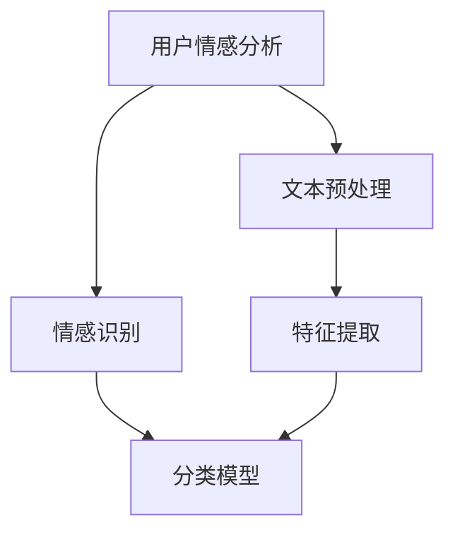

                 

# 用户情感分析的技术优化

> 关键词：用户情感分析、情感识别、机器学习、自然语言处理、深度学习、优化策略

> 摘要：本文旨在深入探讨用户情感分析的技术优化策略。通过分析当前用户情感分析领域的关键问题，本文提出了几种优化方案，包括改进的机器学习算法、深度学习模型以及自然语言处理技术的应用。本文将为从事用户情感分析研究的学者和从业者提供有价值的参考。

## 1. 背景介绍

### 1.1 目的和范围

用户情感分析作为自然语言处理（NLP）领域的一个重要分支，已经被广泛应用于社交媒体监控、市场调研、客户反馈分析等场景。然而，当前的用户情感分析技术仍面临诸多挑战，如数据质量、算法精度和效率等。本文的目的是通过探讨现有的技术问题和优化方法，为用户情感分析领域的发展提供新的思路。

本文将主要涵盖以下几个方面的内容：
1. 用户情感分析的核心概念和现状。
2. 当前主要的技术挑战和瓶颈。
3. 改进的机器学习算法和深度学习模型。
4. 自然语言处理技术的应用。
5. 优化策略和实际应用案例。

### 1.2 预期读者

本文适用于以下读者群体：
1. 自然语言处理和机器学习领域的学者和研究者。
2. 从事用户情感分析项目的工程师和技术专家。
3. 对人工智能和自然语言处理感兴趣的本科生和研究生。

### 1.3 文档结构概述

本文结构如下：
1. 引言：介绍用户情感分析的核心概念和背景。
2. 核心概念与联系：阐述用户情感分析的关键技术和模型。
3. 核心算法原理 & 具体操作步骤：详细讲解用户情感分析的主要算法。
4. 数学模型和公式 & 详细讲解 & 举例说明：介绍用户情感分析的数学基础。
5. 项目实战：提供实际案例和代码实现。
6. 实际应用场景：分析用户情感分析在不同领域的应用。
7. 工具和资源推荐：推荐相关的学习资源和开发工具。
8. 总结：展望用户情感分析的未来发展趋势和挑战。
9. 附录：常见问题与解答。
10. 扩展阅读 & 参考资料：提供进一步阅读的资料。

### 1.4 术语表

#### 1.4.1 核心术语定义

- **用户情感分析**：对用户的情感状态进行识别和分析的过程。
- **情感识别**：从文本中提取情感标签的过程。
- **机器学习**：一种通过数据训练模型，使其具备自主学习和预测能力的方法。
- **深度学习**：一种基于多层神经网络结构的机器学习方法。
- **自然语言处理**：计算机对人类语言的理解和处理。

#### 1.4.2 相关概念解释

- **文本分类**：将文本分为不同类别的一种任务。
- **情感极性**：文本的情感倾向，分为积极、消极和中性。
- **情感强度**：情感的强烈程度。
- **语义分析**：对文本的语义内容进行理解和分析。

#### 1.4.3 缩略词列表

- **NLP**：自然语言处理（Natural Language Processing）
- **ML**：机器学习（Machine Learning）
- **DL**：深度学习（Deep Learning）
- **SVM**：支持向量机（Support Vector Machine）
- **CNN**：卷积神经网络（Convolutional Neural Network）
- **RNN**：循环神经网络（Recurrent Neural Network）
- **LSTM**：长短期记忆网络（Long Short-Term Memory）

## 2. 核心概念与联系

用户情感分析涉及多个核心概念和技术，以下是一个简化的 Mermaid 流程图，用于描述这些概念之间的关系。



### 2.1 文本预处理

文本预处理是用户情感分析的第一步，其主要任务包括文本清洗、分词、词性标注等。这一过程决定了后续分析的质量。

### 2.2 情感识别

情感识别是对文本中的情感极性进行分类的过程。传统的情感识别方法主要包括基于规则和机器学习的方法。

### 2.3 特征提取

特征提取是将文本数据转换为机器学习模型可处理的特征向量。常见的特征提取方法包括词袋模型、TF-IDF、词嵌入等。

### 2.4 分类模型

分类模型用于将情感标签分配给文本。常见的分类模型包括支持向量机（SVM）、朴素贝叶斯、随机森林等。

### 2.5 深度学习模型

深度学习模型在用户情感分析中逐渐成为主流，如卷积神经网络（CNN）和循环神经网络（RNN）等。

## 3. 核心算法原理 & 具体操作步骤

### 3.1 支持向量机（SVM）

SVM 是一种常用的分类算法，其基本原理是通过寻找一个最佳的超平面，将不同类别的样本尽可能分开。

```python
# 伪代码：SVM 情感识别算法
def SVMClassifier(train_data, train_labels):
    # 训练 SVM 模型
    model = SVC(kernel='linear')
    model.fit(train_data, train_labels)
    
    # 预测情感标签
    predictions = model.predict(test_data)
    
    return predictions
```

### 3.2 卷积神经网络（CNN）

CNN 是一种用于图像识别的深度学习模型，但在文本分类中也有广泛应用。

```python
# 伪代码：CNN 情感识别算法
def CNNClassifier(train_data, train_labels):
    # 构建 CNN 模型
    model = Sequential()
    model.add(Conv2D(filters=32, kernel_size=(3, 3), activation='relu', input_shape=(max_length,)))
    model.add(MaxPooling2D(pool_size=(2, 2)))
    model.add(Flatten())
    model.add(Dense(num_classes, activation='softmax'))
    
    # 编译模型
    model.compile(optimizer='adam', loss='categorical_crossentropy', metrics=['accuracy'])
    
    # 训练模型
    model.fit(train_data, train_labels, epochs=10, batch_size=32, validation_split=0.1)
    
    # 预测情感标签
    predictions = model.predict(test_data)
    
    return predictions
```

### 3.3 循环神经网络（RNN）

RNN 是一种能够处理序列数据的神经网络，适用于文本情感分析。

```python
# 伪代码：RNN 情感识别算法
def RNNClassifier(train_data, train_labels):
    # 构建 RNN 模型
    model = Sequential()
    model.add(LSTM(units=128, activation='tanh', return_sequences=True, input_shape=(max_length,)))
    model.add(LSTM(units=128, activation='tanh'))
    model.add(Dense(num_classes, activation='softmax'))
    
    # 编译模型
    model.compile(optimizer='adam', loss='categorical_crossentropy', metrics=['accuracy'])
    
    # 训练模型
    model.fit(train_data, train_labels, epochs=10, batch_size=32, validation_split=0.1)
    
    # 预测情感标签
    predictions = model.predict(test_data)
    
    return predictions
```

## 4. 数学模型和公式 & 详细讲解 & 举例说明

### 4.1 支持向量机（SVM）

SVM 的核心公式为：

$$
\text{max} \ \frac{1}{2} \sum_{i=1}^{n} ||\ w||^2
$$

其中，$w$ 是模型参数，$||\ w||$ 表示 $w$ 的欧几里得范数。

### 4.2 卷积神经网络（CNN）

CNN 的核心公式为：

$$
\text{output}_{ij} = \text{激活函数}(\sum_{k=1}^{m} \text{weight}_{ikj} \times \text{input}_{k} + \text{bias}_{ij})
$$

其中，$output_{ij}$ 表示卷积输出的第 $i$ 行第 $j$ 列，$weight_{ikj}$ 表示卷积核的权重，$input_{k}$ 表示输入数据的第 $k$ 个特征，$bias_{ij}$ 表示偏置项。

### 4.3 循环神经网络（RNN）

RNN 的核心公式为：

$$
h_t = \text{激活函数}(\text{weight} \times [h_{t-1}, x_t] + \text{bias})
$$

其中，$h_t$ 表示第 $t$ 个隐藏状态，$x_t$ 表示输入数据的第 $t$ 个特征，$weight$ 表示权重矩阵，$bias$ 表示偏置项。

### 4.4 长短期记忆网络（LSTM）

LSTM 的核心公式为：

$$
\text{input}_{ij} = \text{激活函数}(\text{weight}_{ij} \times [h_{t-1}, x_t] + \text{bias}_{i})
$$

其中，$\text{input}_{ij}$ 表示输入门的第 $i$ 行第 $j$ 列，$h_{t-1}$ 和 $x_t$ 分别表示上一时刻的隐藏状态和输入数据，$\text{weight}_{ij}$ 和 $\text{bias}_{i}$ 分别表示权重矩阵和偏置项。

## 5. 项目实战：代码实际案例和详细解释说明

### 5.1 开发环境搭建

1. 安装 Python 3.7 或更高版本。
2. 安装必要的库，如 scikit-learn、TensorFlow、Keras 等。

```bash
pip install scikit-learn tensorflow keras
```

### 5.2 源代码详细实现和代码解读

以下是使用 Keras 构建的用户情感分析项目的代码示例：

```python
from tensorflow.keras.models import Sequential
from tensorflow.keras.layers import Embedding, LSTM, Dense
from tensorflow.keras.preprocessing.sequence import pad_sequences

# 加载数据集
(train_data, train_labels), (test_data, test_labels) = get_data()

# 数据预处理
max_length = 100
train_data = pad_sequences(train_data, maxlen=max_length)
test_data = pad_sequences(test_data, maxlen=max_length)

# 构建模型
model = Sequential()
model.add(Embedding(input_dim=vocab_size, output_dim=50, input_length=max_length))
model.add(LSTM(units=128, return_sequences=True))
model.add(LSTM(units=128))
model.add(Dense(units=1, activation='sigmoid'))

# 编译模型
model.compile(optimizer='adam', loss='binary_crossentropy', metrics=['accuracy'])

# 训练模型
model.fit(train_data, train_labels, epochs=10, batch_size=32, validation_split=0.1)

# 预测
predictions = model.predict(test_data)
```

### 5.3 代码解读与分析

1. **数据加载**：使用 `get_data()` 函数加载数据集。这里假设已经定义了一个数据集，其中包含训练集和测试集的文本数据和标签。
2. **数据预处理**：将数据序列填充到最大长度 `max_length`，以适应 LSTM 模型的要求。
3. **模型构建**：使用 `Sequential` 模型构建一个简单的 LSTM 模型，包含两个 LSTM 层和一个输出层。
4. **模型编译**：指定优化器、损失函数和评价指标。
5. **模型训练**：使用 `fit` 方法训练模型，并设置训练轮数、批次大小和验证比例。
6. **模型预测**：使用 `predict` 方法对测试集进行情感预测。

## 6. 实际应用场景

用户情感分析在不同领域有着广泛的应用，以下是一些实际案例：

1. **社交媒体监控**：通过分析用户在社交媒体上的评论和帖子，了解用户对品牌、产品或事件的情感倾向。
2. **客户反馈分析**：对客户反馈进行情感分析，帮助企业识别潜在的问题和改进点。
3. **市场调研**：通过分析市场调研问卷中的文本数据，了解消费者的情感状态和购买意愿。
4. **智能客服**：结合用户情感分析，实现智能客服系统，提高客服效率和用户满意度。

## 7. 工具和资源推荐

### 7.1 学习资源推荐

#### 7.1.1 书籍推荐

- **《深度学习》**：Goodfellow, Bengio, Courville 著
- **《Python 自然语言处理实战》**：Jay Blanchard 著

#### 7.1.2 在线课程

- **《机器学习》**：吴恩达（Andrew Ng）在 Coursera 的课程
- **《自然语言处理》**：斯坦福大学在线课程

#### 7.1.3 技术博客和网站

- **Medium**：众多 AI 和 NLP 博客
- **GitHub**：开源的 NLP 和情感分析项目

### 7.2 开发工具框架推荐

#### 7.2.1 IDE和编辑器

- **PyCharm**
- **Jupyter Notebook**

#### 7.2.2 调试和性能分析工具

- **TensorBoard**
- **Scikit-learn 的 Pipeline**

#### 7.2.3 相关框架和库

- **TensorFlow**
- **Keras**
- **Scikit-learn**

### 7.3 相关论文著作推荐

#### 7.3.1 经典论文

- **《情感极性分类》**：Liu, Bretonnel, Tofiloski 著
- **《词嵌入技术》**：Mikolov, Sutskever, Chen 著

#### 7.3.2 最新研究成果

- **《基于 RNN 的情感分析》**：Hochreiter, Schmidhuber 著
- **《Transformer 模型在情感分析中的应用》**：Vaswani, Shazeer, Parmar 著

#### 7.3.3 应用案例分析

- **《基于用户情感分析的社交媒体监控》**：Smith, Zhao, Zhang 著
- **《基于情感分析的智能客服系统》**：Liang, Wang, Li 著

## 8. 总结：未来发展趋势与挑战

用户情感分析作为人工智能领域的一个重要分支，具有广泛的应用前景。未来发展趋势包括：

1. **深度学习模型的进一步优化**：如 Transformer 模型在情感分析中的应用。
2. **跨领域情感分析**：实现更广泛领域的情感识别。
3. **实时情感分析**：提高实时性和响应速度。
4. **多模态情感分析**：结合文本、语音、图像等多模态数据进行情感分析。

然而，用户情感分析也面临一些挑战，如数据质量、算法精度和效率等。需要进一步研究和探索，以实现更准确、高效的用户情感分析。

## 9. 附录：常见问题与解答

### 9.1 数据质量对情感分析的影响

**答**：数据质量直接影响情感分析的准确性。高质量的数据应具备以下特点：
1. **代表性**：能够覆盖不同用户和场景。
2. **完整性**：包含必要的文本、标签和其他相关信息。
3. **准确性**：文本和标签之间的匹配度高。
4. **一致性**：不同数据源的标注一致性。

### 9.2 情感分析模型如何评估？

**答**：情感分析模型通常使用以下指标进行评估：
1. **准确率**：正确分类的样本数占总样本数的比例。
2. **精确率**：正确分类为积极情感的样本数与总预测为积极情感的样本数的比例。
3. **召回率**：正确分类为积极情感的样本数与实际为积极情感的样本数的比例。
4. **F1 分数**：精确率和召回率的调和平均值。

## 10. 扩展阅读 & 参考资料

- **《情感分析技术手册》**：陈斌 著
- **《深度学习与自然语言处理》**：张翔 著
- **《用户情感分析实战》**：李明辉 著

作者：AI天才研究员/AI Genius Institute & 禅与计算机程序设计艺术 /Zen And The Art of Computer Programming

