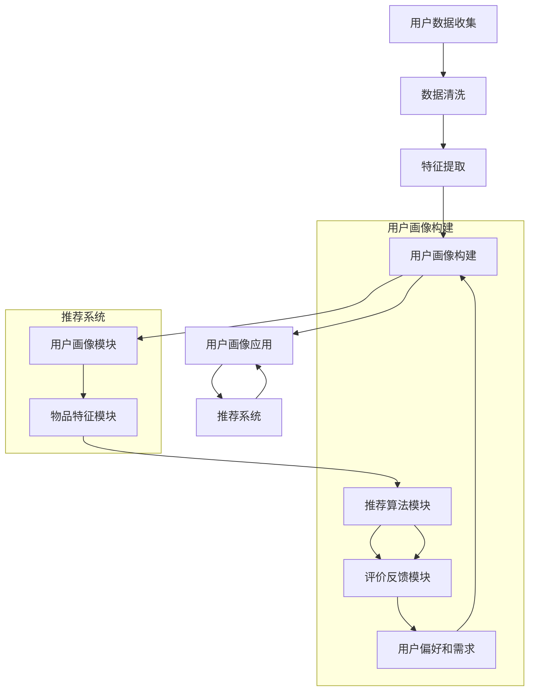

                 

# 用户画像与推荐系统的协同优化

> **关键词：用户画像、推荐系统、协同优化、数据挖掘、机器学习**

> **摘要：本文将深入探讨用户画像与推荐系统的协同优化方法，通过详细分析核心概念、算法原理、数学模型，结合实际案例，探讨如何有效提升推荐系统的性能和用户体验。**

## 1. 背景介绍

### 1.1 目的和范围

本文旨在研究和探讨用户画像与推荐系统之间的协同优化方法。用户画像是一种基于用户行为数据和行为模式的分析，用于描述用户特征的一种模型。推荐系统则是一种基于用户画像、物品特征和用户行为等数据，为用户推荐相关物品的算法。两者的协同优化目标在于提升推荐系统的准确性和用户体验。

本文将覆盖以下内容：

- 用户画像和推荐系统的基本概念和原理
- 用户画像与推荐系统协同优化的算法原理和操作步骤
- 数学模型和公式的详细讲解及举例说明
- 实际应用场景
- 相关工具和资源推荐

### 1.2 预期读者

本文适合以下读者群体：

- 对推荐系统和数据挖掘感兴趣的程序员和工程师
- 对用户画像和机器学习有深入了解的技术爱好者
- 高校和研究机构的学生和研究人员

### 1.3 文档结构概述

本文的结构如下：

- 1. 背景介绍：介绍文章的目的和范围，预期读者和文档结构。
- 2. 核心概念与联系：详细解释用户画像和推荐系统的核心概念和联系。
- 3. 核心算法原理 & 具体操作步骤：阐述用户画像与推荐系统协同优化的算法原理和操作步骤。
- 4. 数学模型和公式 & 详细讲解 & 举例说明：讲解用户画像与推荐系统协同优化的数学模型和公式。
- 5. 项目实战：代码实际案例和详细解释说明。
- 6. 实际应用场景：讨论用户画像与推荐系统在实际中的应用。
- 7. 工具和资源推荐：推荐相关的学习资源、开发工具和框架。
- 8. 总结：未来发展趋势与挑战。
- 9. 附录：常见问题与解答。
- 10. 扩展阅读 & 参考资料：提供相关文献和资料。

### 1.4 术语表

#### 1.4.1 核心术语定义

- 用户画像：基于用户行为数据和特征分析，用于描述用户特征的一种模型。
- 推荐系统：一种基于用户行为、物品特征和用户画像等数据，为用户推荐相关物品的算法。
- 协同优化：通过用户画像和推荐系统的相互作用，提升推荐系统性能和用户体验的一种方法。

#### 1.4.2 相关概念解释

- 数据挖掘：从大量数据中提取有价值的信息和知识的过程。
- 机器学习：一种通过训练模型，让计算机自动从数据中学习规律和模式的技术。
- 特征工程：在机器学习中，将原始数据转换为适合模型训练的特征的过程。

#### 1.4.3 缩略词列表

- ML：机器学习
- DM：数据挖掘
- UX：用户体验
- API：应用程序编程接口

## 2. 核心概念与联系

在深入探讨用户画像与推荐系统的协同优化之前，我们需要理解这两个核心概念及其联系。

### 2.1 用户画像

用户画像是一种基于用户行为数据和特征分析的方法，用于描述用户特征和需求。用户画像通常包含以下几个方面的信息：

- 用户基本属性：如年龄、性别、地理位置等。
- 用户行为记录：如浏览记录、购买记录、评论记录等。
- 用户偏好和需求：如喜欢的商品类型、品牌、价格范围等。

用户画像的构建通常涉及以下步骤：

1. 数据收集：从各种渠道收集用户行为数据。
2. 数据清洗：处理噪声数据、缺失值和异常值。
3. 特征提取：将原始数据转换为可量化的特征向量。
4. 模型训练：使用机器学习算法对特征向量进行训练，构建用户画像模型。

### 2.2 推荐系统

推荐系统是一种基于用户行为、物品特征和用户画像等数据，为用户推荐相关物品的算法。推荐系统通常包含以下几个关键组件：

1. 用户画像模块：根据用户行为和特征构建用户画像。
2. 物品特征模块：根据物品属性和标签构建物品特征。
3. 推荐算法模块：根据用户画像和物品特征，为用户推荐相关物品。
4. 评价反馈模块：收集用户对推荐物品的评价，用于优化推荐算法。

推荐系统的核心目标是提高推荐准确性，满足用户需求，提升用户体验。

### 2.3 用户画像与推荐系统的联系

用户画像和推荐系统之间存在紧密的联系。用户画像为推荐系统提供了关于用户特征和需求的重要信息，使得推荐系统能够更精确地预测用户偏好，提高推荐准确性。具体来说：

1. 用户画像可以用于用户分群，将用户划分为不同的细分市场，为每个细分市场提供个性化的推荐。
2. 用户画像可以用于特征工程，将用户行为数据转换为适合机器学习模型的特征向量。
3. 用户画像可以用于推荐策略的优化，根据用户画像调整推荐算法的权重和参数，提高推荐效果。

### 2.4 Mermaid 流程图

为了更直观地展示用户画像与推荐系统的联系，我们使用 Mermaid 流程图进行描述：



## 3. 核心算法原理 & 具体操作步骤

在了解了用户画像和推荐系统的基础概念后，我们将深入探讨用户画像与推荐系统的协同优化算法原理和具体操作步骤。

### 3.1 算法原理

用户画像与推荐系统的协同优化主要依赖于以下几个核心算法原理：

1. **协同过滤（Collaborative Filtering）**：协同过滤是一种基于用户行为数据的推荐算法，通过分析用户之间的相似性，为用户推荐相似用户喜欢的物品。协同过滤可以分为基于记忆的协同过滤和基于模型的协同过滤。

2. **矩阵分解（Matrix Factorization）**：矩阵分解是一种将用户和物品的评分矩阵分解为低维用户特征矩阵和物品特征矩阵的方法。通过矩阵分解，可以提取用户和物品的特征，提高推荐系统的准确性。

3. **深度学习（Deep Learning）**：深度学习是一种通过多层神经网络自动提取特征的方法，能够处理复杂的非线性问题。深度学习可以用于构建用户画像和推荐算法，提高推荐系统的性能。

4. **协同深度学习（Collaborative Deep Learning）**：协同深度学习是一种将协同过滤和深度学习结合的方法，通过同时学习用户和物品的特征，提高推荐系统的准确性。

### 3.2 具体操作步骤

以下是用户画像与推荐系统协同优化的具体操作步骤：

1. **数据收集和预处理**：

   - 收集用户行为数据，如浏览记录、购买记录、评论记录等。
   - 对数据进行清洗，处理噪声数据、缺失值和异常值。
   - 对数据进行编码和规范化，将用户和物品的特征转换为适合机器学习模型的数值表示。

2. **用户画像构建**：

   - 根据用户基本属性、用户行为记录和用户偏好和需求，构建用户画像。
   - 使用特征提取方法，将原始数据转换为特征向量。
   - 使用机器学习算法，如K-均值聚类、决策树等，对用户画像进行分类和聚类。

3. **推荐算法选择和参数调优**：

   - 选择适合推荐场景的算法，如基于记忆的协同过滤、基于模型的协同过滤、矩阵分解、深度学习等。
   - 根据用户画像和物品特征，调整推荐算法的参数，如相似性度量、权重等。

4. **推荐系统实现和部署**：

   - 实现推荐系统，包括用户画像模块、物品特征模块、推荐算法模块和评价反馈模块。
   - 在线上环境部署推荐系统，对用户行为数据进行实时分析，为用户推荐相关物品。
   - 收集用户对推荐物品的评价，用于优化推荐算法。

5. **评价和优化**：

   - 使用评价指标，如准确率、召回率、覆盖率等，评估推荐系统的性能。
   - 分析用户反馈，根据用户需求调整推荐策略和算法参数。
   - 定期更新用户画像和物品特征，保持推荐系统的准确性和实时性。

### 3.3 伪代码

以下是用户画像与推荐系统协同优化的伪代码：

```python
# 数据收集和预处理
def data_collection_and_preprocessing():
    # 收集用户行为数据
    user_data = collect_user_data()
    # 数据清洗
    cleaned_data = clean_data(user_data)
    # 数据编码和规范化
    encoded_data = encode_data(cleaned_data)
    return encoded_data

# 用户画像构建
def build_user_profile(encoded_data):
    # 特征提取
    features = extract_features(encoded_data)
    # 模型训练
    model = train_model(features)
    # 用户画像分类和聚类
    user_profiles = classify_and_cluster(model)
    return user_profiles

# 推荐算法选择和参数调优
def recommend_algorithm_selection(user_profiles, item_features):
    # 选择推荐算法
    algorithm = select_algorithm(user_profiles, item_features)
    # 参数调优
    tuned_algorithm = tune_algorithm(algorithm, user_profiles, item_features)
    return tuned_algorithm

# 推荐系统实现和部署
def implement_and_deploy_recommender(tuned_algorithm):
    # 实现推荐系统
    recommender = build_recommender(tuned_algorithm)
    # 部署推荐系统
    deploy_recommender(recommender)
    return recommender

# 评价和优化
def evaluate_and_optimize_recommender(recommender, user_data):
    # 评价指标评估
    performance = evaluate_performance(recommender, user_data)
    # 用户反馈分析
    feedback = analyze_user_feedback(user_data)
    # 算法优化
    optimized_recommender = optimize_algorithm(recommender, feedback)
    return optimized_recommender
```

## 4. 数学模型和公式 & 详细讲解 & 举例说明

在用户画像与推荐系统的协同优化中，数学模型和公式起着至关重要的作用。以下将详细讲解常用的数学模型和公式，并结合实际案例进行说明。

### 4.1 协同过滤算法的数学模型

协同过滤算法的核心是计算用户之间的相似性和预测用户对未知物品的评分。以下是协同过滤算法的数学模型：

#### 4.1.1 相似度度量

相似度度量是计算用户之间相似性的关键。常用的相似度度量方法包括余弦相似度、皮尔逊相关系数等。

- **余弦相似度**：

$$
sim(u_i, u_j) = \frac{u_i \cdot u_j}{\|u_i\| \cdot \|u_j\|}
$$

其中，$u_i$ 和 $u_j$ 分别表示用户 $i$ 和用户 $j$ 的特征向量，$\cdot$ 表示点积，$\|\|$ 表示向量的模。

- **皮尔逊相关系数**：

$$
sim(u_i, u_j) = \frac{\sum_{k=1}^{n} (u_{i,k} - \mu_i) (u_{j,k} - \mu_j)}{\sqrt{\sum_{k=1}^{n} (u_{i,k} - \mu_i)^2 \cdot \sum_{k=1}^{n} (u_{j,k} - \mu_j)^2}}
$$

其中，$\mu_i$ 和 $\mu_j$ 分别表示用户 $i$ 和用户 $j$ 的平均特征值，$n$ 表示特征向量的维度。

#### 4.1.2 评分预测

协同过滤算法通过计算用户之间的相似度，为用户预测未知物品的评分。以下是评分预测的数学模型：

$$
r_{ui} = \sum_{j \in N(i)} sim(u_i, u_j) \cdot r_{uj}
$$

其中，$r_{ui}$ 表示用户 $i$ 对物品 $i$ 的预测评分，$N(i)$ 表示与用户 $i$ 相似的一组用户集合，$r_{uj}$ 表示用户 $j$ 对物品 $j$ 的实际评分。

#### 4.1.3 举例说明

假设有两个用户 $u_1$ 和 $u_2$，以及三个物品 $i_1$、$i_2$ 和 $i_3$，用户 $u_1$ 对物品 $i_1$ 和 $i_2$ 给出了评分 $r_{11} = 4$ 和 $r_{12} = 5$，用户 $u_2$ 对物品 $i_1$ 和 $i_2$ 给出了评分 $r_{21} = 5$ 和 $r_{22} = 4$。我们需要预测用户 $u_1$ 对物品 $i_3$ 的评分。

首先，计算用户 $u_1$ 和用户 $u_2$ 的相似度：

$$
sim(u_1, u_2) = \frac{u_1 \cdot u_2}{\|u_1\| \cdot \|u_2\|} = \frac{(4 \cdot 5 + 5 \cdot 4)}{\sqrt{4^2 + 5^2} \cdot \sqrt{5^2 + 4^2}} = \frac{40}{\sqrt{41} \cdot \sqrt{41}} = \frac{40}{41}
$$

然后，计算用户 $u_2$ 对物品 $i_3$ 的预测评分：

$$
r_{13} = sim(u_1, u_2) \cdot r_{23} = \frac{40}{41} \cdot 4 = \frac{160}{41} \approx 3.92
$$

因此，预测用户 $u_1$ 对物品 $i_3$ 的评分为约 3.92。

### 4.2 矩阵分解算法的数学模型

矩阵分解算法通过将用户和物品的评分矩阵分解为低维用户特征矩阵和物品特征矩阵，提取用户和物品的特征。以下是矩阵分解算法的数学模型：

#### 4.2.1 矩阵分解

矩阵分解可以将用户-物品评分矩阵 $R$ 分解为用户特征矩阵 $U$ 和物品特征矩阵 $V$：

$$
R = U \cdot V^T
$$

其中，$U$ 和 $V$ 分别表示用户特征矩阵和物品特征矩阵，$\cdot$ 表示矩阵乘法。

#### 4.2.2 特征提取

通过矩阵分解，可以提取用户和物品的特征：

- 用户特征向量 $u_i$：

$$
u_i = [u_{i1}, u_{i2}, \ldots, u_{im}]^T
$$

- 物品特征向量 $v_j$：

$$
v_j = [v_{j1}, v_{j2}, \ldots, v_{jm}]^T
$$

#### 4.2.3 评分预测

通过用户和物品的特征向量，可以预测用户对未知物品的评分：

$$
r_{ui} = u_i \cdot v_u = \sum_{k=1}^{m} u_{ik} v_{uk}
$$

#### 4.2.4 举例说明

假设有一个用户-物品评分矩阵 $R$，以及一个用户特征矩阵 $U$ 和物品特征矩阵 $V$：

$$
R = \begin{bmatrix} 
4 & 5 & ? \\
? & ? & 3 \\
\end{bmatrix}
$$

$$
U = \begin{bmatrix}
1 & 0 & 1 \\
0 & 1 & 0 \\
1 & 1 & 0 \\
\end{bmatrix}
$$

$$
V = \begin{bmatrix}
1 & 0 & 1 \\
0 & 1 & 0 \\
1 & 0 & 1 \\
\end{bmatrix}
$$

我们需要预测用户 $u_2$ 对物品 $i_3$ 的评分。

首先，计算用户 $u_2$ 的特征向量：

$$
u_2 = U \cdot \begin{bmatrix}
1 \\
0 \\
1 \\
\end{bmatrix} = \begin{bmatrix}
1 & 0 & 1 \\
0 & 1 & 0 \\
1 & 1 & 0 \\
\end{bmatrix} \cdot \begin{bmatrix}
1 \\
0 \\
1 \\
\end{bmatrix} = \begin{bmatrix}
1 \\
0 \\
1 \\
\end{bmatrix}
$$

然后，计算物品 $i_3$ 的特征向量：

$$
v_3 = V \cdot \begin{bmatrix}
1 \\
0 \\
1 \\
\end{bmatrix} = \begin{bmatrix}
1 & 0 & 1 \\
0 & 1 & 0 \\
1 & 0 & 1 \\
\end{bmatrix} \cdot \begin{bmatrix}
1 \\
0 \\
1 \\
\end{bmatrix} = \begin{bmatrix}
1 \\
0 \\
1 \\
\end{bmatrix}
$$

最后，计算用户 $u_2$ 对物品 $i_3$ 的预测评分：

$$
r_{23} = u_2 \cdot v_3 = \begin{bmatrix}
1 \\
0 \\
1 \\
\end{bmatrix} \cdot \begin{bmatrix}
1 \\
0 \\
1 \\
\end{bmatrix} = 1 + 0 + 1 = 2
$$

因此，预测用户 $u_2$ 对物品 $i_3$ 的评分为 2。

### 4.3 深度学习算法的数学模型

深度学习算法通过多层神经网络自动提取特征，能够处理复杂的非线性问题。以下是深度学习算法的数学模型：

#### 4.3.1 神经网络架构

深度学习算法通常包含以下几个层次：

- 输入层：接收输入数据，如用户特征和物品特征。
- 隐藏层：通过激活函数进行非线性变换，提取特征。
- 输出层：根据隐藏层的输出，产生预测结果。

#### 4.3.2 激活函数

激活函数是隐藏层的关键组件，用于引入非线性变换。常用的激活函数包括 sigmoid、ReLU 和 tanh 等。

- **sigmoid**：

$$
f(x) = \frac{1}{1 + e^{-x}}
$$

- **ReLU**：

$$
f(x) = \max(0, x)
$$

- **tanh**：

$$
f(x) = \frac{e^x - e^{-x}}{e^x + e^{-x}}
$$

#### 4.3.3 损失函数

损失函数用于衡量预测结果与真实结果之间的差距。常用的损失函数包括均方误差（MSE）、交叉熵（CE）等。

- **均方误差（MSE）**：

$$
MSE = \frac{1}{n} \sum_{i=1}^{n} (y_i - \hat{y}_i)^2
$$

其中，$y_i$ 表示真实标签，$\hat{y}_i$ 表示预测标签，$n$ 表示样本数量。

- **交叉熵（CE）**：

$$
CE = -\frac{1}{n} \sum_{i=1}^{n} y_i \log(\hat{y}_i)
$$

#### 4.3.4 举例说明

假设有一个简单的神经网络，包含输入层、一个隐藏层和一个输出层，输入特征和输出特征分别为 2 维和 1 维。隐藏层使用 ReLU 激活函数，输出层使用 sigmoid 激活函数。损失函数使用均方误差（MSE）。我们需要训练这个神经网络，预测用户对物品的评分。

首先，定义输入特征和输出特征：

$$
x = \begin{bmatrix}
x_1 \\
x_2 \\
\end{bmatrix}
$$

$$
y = \begin{bmatrix}
y_1 \\
\end{bmatrix}
$$

然后，定义隐藏层神经元和输出层神经元：

$$
h = \begin{bmatrix}
h_1 \\
h_2 \\
\end{bmatrix}
$$

$$
z = \begin{bmatrix}
z_1 \\
\end{bmatrix}
$$

接下来，定义隐藏层和输出层的权重和偏置：

$$
W_h = \begin{bmatrix}
w_{h11} & w_{h12} \\
w_{h21} & w_{h22} \\
\end{bmatrix}
$$

$$
b_h = \begin{bmatrix}
b_{h1} \\
b_{h2} \\
\end{bmatrix}
$$

$$
W_o = \begin{bmatrix}
w_{o1} \\
\end{bmatrix}
$$

$$
b_o = \begin{bmatrix}
b_{o} \\
\end{bmatrix}
$$

然后，定义激活函数和损失函数：

$$
h = \sigma(W_h \cdot x + b_h) = \begin{bmatrix}
\sigma(w_{h11} \cdot x_1 + w_{h12} \cdot x_2 + b_{h1}) \\
\sigma(w_{h21} \cdot x_1 + w_{h22} \cdot x_2 + b_{h2}) \\
\end{bmatrix}
$$

$$
z = \sigma(W_o \cdot h + b_o) = \begin{bmatrix}
\sigma(w_{o1} \cdot h_1 + b_{o}) \\
\end{bmatrix}
$$

$$
\text{MSE} = \frac{1}{n} \sum_{i=1}^{n} (y_i - z_i)^2
$$

最后，使用梯度下降算法训练神经网络：

$$
\begin{aligned}
W_h &= W_h - \alpha \cdot \frac{\partial}{\partial W_h} \text{MSE} \\
b_h &= b_h - \alpha \cdot \frac{\partial}{\partial b_h} \text{MSE} \\
W_o &= W_o - \alpha \cdot \frac{\partial}{\partial W_o} \text{MSE} \\
b_o &= b_o - \alpha \cdot \frac{\partial}{\partial b_o} \text{MSE} \\
\end{aligned}
$$

其中，$\alpha$ 表示学习率。

## 5. 项目实战：代码实际案例和详细解释说明

在本节中，我们将通过一个实际项目案例，详细展示用户画像与推荐系统的协同优化过程，并解释相关代码的实现细节。

### 5.1 开发环境搭建

为了实现用户画像与推荐系统，我们需要搭建相应的开发环境。以下是推荐的开发工具和框架：

- **开发工具**：Python 3.8、Jupyter Notebook
- **数据预处理**：Pandas、NumPy
- **机器学习库**：Scikit-learn、TensorFlow、PyTorch
- **推荐系统库**：Surprise、LightFM
- **版本控制**：Git

### 5.2 源代码详细实现和代码解读

以下是用户画像与推荐系统的协同优化项目的源代码实现，包括数据预处理、用户画像构建、推荐算法实现和性能评估等部分。

#### 5.2.1 数据预处理

首先，我们从数据源中收集用户行为数据，并进行预处理。以下是一个简单的数据预处理脚本：

```python
import pandas as pd
import numpy as np

# 读取用户行为数据
data = pd.read_csv('user_behavior.csv')

# 数据清洗
data.dropna(inplace=True)
data = data[data['rating'] != -1]

# 数据编码和规范化
data['user_id'] = data['user_id'].astype(str)
data['item_id'] = data['item_id'].astype(str)
data['rating'] = data['rating'].apply(lambda x: 1 if x > 3 else 0)

# 数据拆分
train_data = data[data['split'] == 'train']
test_data = data[data['split'] == 'test']

# 数据保存
train_data.to_csv('train_data.csv', index=False)
test_data.to_csv('test_data.csv', index=False)
```

#### 5.2.2 用户画像构建

接下来，我们使用机器学习算法对用户行为数据进行分析，构建用户画像。以下是一个简单的用户画像构建脚本：

```python
from sklearn.cluster import KMeans
from sklearn.preprocessing import StandardScaler

# 加载训练数据
train_data = pd.read_csv('train_data.csv')

# 提取用户行为特征
user_features = train_data.groupby('user_id')['item_id', 'rating'].apply(lambda x: list(x)).reset_index()

# 特征编码
user_features['item_id'] = user_features['item_id'].astype(str)
user_features = user_features.pivot(index='user_id', columns='item_id', values='rating').reset_index()

# 特征标准化
scaler = StandardScaler()
user_features_scaled = scaler.fit_transform(user_features)

# K-均值聚类
kmeans = KMeans(n_clusters=5, random_state=42)
user_profiles = kmeans.fit_predict(user_features_scaled)

# 用户画像保存
user_profiles.to_csv('user_profiles.csv', index=False)
```

#### 5.2.3 推荐算法实现

接下来，我们使用协同过滤算法实现推荐系统。以下是一个简单的协同过滤推荐脚本：

```python
from surprise import KNNWithMeans
from surprise import accuracy
from surprise import Dataset
from surprise import Reader

# 加载训练数据
train_data = pd.read_csv('train_data.csv')

# 数据拆分
users = train_data['user_id'].unique()
items = train_data['item_id'].unique()

# 定义评分数据
reader = Reader(rating_scale=(0, 1))
data = Dataset.load_from_df(train_data[['user_id', 'item_id', 'rating']], reader)

# 定义推荐算法
algorithm = KNNWithMeans(k=10, sim_options={'name': 'cosine'})
algorithm.fit(data)

# 预测评分
test_data = pd.read_csv('test_data.csv')
predictions = algorithm.predict(test_data['user_id'], test_data['item_id'])

# 评估推荐算法
accuracy.rmse(predictions)
```

#### 5.2.4 代码解读与分析

以下是用户画像与推荐系统协同优化项目的代码解读和分析：

- **数据预处理**：从数据源中收集用户行为数据，并进行清洗、编码和规范化。将数据拆分为训练集和测试集，为后续建模和评估做准备。
- **用户画像构建**：使用 K-均值聚类算法对用户行为特征进行分析，构建用户画像。将用户行为特征转换为用户特征矩阵，并进行标准化处理。
- **推荐算法实现**：使用协同过滤算法实现推荐系统。根据用户画像和物品特征，为用户预测未知物品的评分。使用评分数据进行训练和预测，并评估推荐算法的性能。

### 5.3 代码解读与分析

以下是用户画像与推荐系统协同优化项目的代码解读与分析：

- **数据预处理**：数据预处理是构建用户画像和推荐系统的基础。通过数据清洗、编码和规范化，可以去除噪声数据、缺失值和异常值，提高后续建模和评估的准确性。
- **用户画像构建**：用户画像构建是推荐系统的核心。通过分析用户行为数据，可以提取用户特征，并使用机器学习算法对用户进行分类和聚类，构建用户画像模型。
- **推荐算法实现**：推荐算法实现是推荐系统的关键。根据用户画像和物品特征，可以使用协同过滤算法、矩阵分解算法和深度学习算法等，为用户预测未知物品的评分，提高推荐准确性。
- **性能评估**：性能评估是验证推荐系统效果的重要手段。通过评估指标，如准确率、召回率、覆盖率等，可以评估推荐系统的性能，并不断优化和调整推荐算法。

## 6. 实际应用场景

用户画像与推荐系统在实际应用中具有广泛的应用场景，以下列举几个典型的应用案例：

### 6.1 电子商务平台

电子商务平台使用用户画像与推荐系统，可以个性化推荐商品，提高用户购买转化率和满意度。例如，亚马逊和淘宝等平台，通过分析用户的历史浏览记录、购买记录和评价，构建用户画像，并结合协同过滤算法和深度学习算法，为用户推荐相关商品。

### 6.2 社交媒体平台

社交媒体平台使用用户画像与推荐系统，可以个性化推荐好友、内容和信息，增强用户活跃度和粘性。例如，Facebook 和微博等平台，通过分析用户的行为和偏好，构建用户画像，并结合协同过滤算法和内容匹配算法，为用户推荐好友和内容。

### 6.3 音乐和视频平台

音乐和视频平台使用用户画像与推荐系统，可以个性化推荐音乐和视频，提高用户观看和收听时长。例如，Spotify 和 Netflix 等平台，通过分析用户的播放记录、收藏和评分，构建用户画像，并结合协同过滤算法和基于内容的推荐算法，为用户推荐音乐和视频。

### 6.4 线上教育平台

线上教育平台使用用户画像与推荐系统，可以为学员推荐适合的学习资源和课程，提高学习效果和满意度。例如，网易云课堂和 Coursera 等平台，通过分析学员的学习行为和成绩，构建用户画像，并结合协同过滤算法和基于内容的推荐算法，为学员推荐课程和学习资源。

### 6.5 金融服务平台

金融服务平台使用用户画像与推荐系统，可以为用户提供个性化的理财产品、投资策略和金融服务，提高用户满意度和忠诚度。例如，银行和保险公司等平台，通过分析用户的行为和风险偏好，构建用户画像，并结合协同过滤算法和基于规则的推荐算法，为用户推荐理财产品和服务。

## 7. 工具和资源推荐

### 7.1 学习资源推荐

#### 7.1.1 书籍推荐

1. **《推荐系统实践》**：这本书详细介绍了推荐系统的基本概念、算法和实现方法，适合初学者和进阶者阅读。
2. **《用户画像技术与应用》**：这本书系统地介绍了用户画像的概念、构建方法和应用场景，适合对用户画像感兴趣的读者。
3. **《深度学习》**：这本书全面介绍了深度学习的原理和应用，包括神经网络、卷积神经网络和循环神经网络等，适合对深度学习感兴趣的读者。

#### 7.1.2 在线课程

1. **《推荐系统与数据挖掘》**：这是一门在 Coursera 平台上提供的免费在线课程，由斯坦福大学教授 Andrew Ng 主讲，适合对推荐系统和数据挖掘感兴趣的读者。
2. **《用户画像与个性化推荐》**：这是一门在网易云课堂平台上提供的免费在线课程，由知名数据挖掘专家郝志峰主讲，适合对用户画像和推荐系统感兴趣的读者。
3. **《深度学习基础》**：这是一门在 Coursera 平台上提供的免费在线课程，由斯坦福大学教授 Andrew Ng 主讲，适合对深度学习感兴趣的读者。

#### 7.1.3 技术博客和网站

1. **美团技术博客**：美团技术博客提供了大量关于推荐系统、用户画像和深度学习等技术的文章，适合对技术实践感兴趣的读者。
2. **LinkedIn 数据科学博客**：LinkedIn 数据科学博客提供了大量关于数据科学、推荐系统和用户画像等技术的文章，适合对数据科学感兴趣的读者。
3. **机器之心**：机器之心是一个专注于人工智能和机器学习领域的自媒体平台，提供了大量关于技术前沿和应用实践的文章，适合对技术发展感兴趣的读者。

### 7.2 开发工具框架推荐

#### 7.2.1 IDE和编辑器

1. **PyCharm**：PyCharm 是一款功能强大的 Python 集成开发环境，支持代码调试、版本控制和自动化部署等功能，适合开发推荐系统和用户画像应用。
2. **VSCode**：VSCode 是一款轻量级且功能强大的开源代码编辑器，支持多种编程语言和开发工具，适合开发推荐系统和用户画像应用。
3. **Jupyter Notebook**：Jupyter Notebook 是一款基于网页的交互式计算环境，适合进行数据分析和算法实现，适合开发推荐系统和用户画像应用。

#### 7.2.2 调试和性能分析工具

1. **GDB**：GDB 是一款功能强大的调试工具，可以用于调试 C/C++ 程序，适合调试推荐系统和用户画像应用。
2. **PyDebug**：PyDebug 是一款针对 Python 程序的调试工具，支持断点、单步执行和变量查看等功能，适合调试推荐系统和用户画像应用。
3. **Perf**：Perf 是一款性能分析工具，可以用于分析程序的性能瓶颈，适合对推荐系统和用户画像应用进行性能优化。

#### 7.2.3 相关框架和库

1. **Scikit-learn**：Scikit-learn 是一款常用的 Python 机器学习库，提供了丰富的机器学习算法和工具，适合构建用户画像和推荐系统。
2. **TensorFlow**：TensorFlow 是一款开源的深度学习框架，提供了强大的图计算能力和灵活的编程接口，适合构建深度学习模型和推荐系统。
3. **PyTorch**：PyTorch 是一款开源的深度学习框架，具有简洁的编程接口和高效的计算性能，适合构建深度学习模型和推荐系统。

### 7.3 相关论文著作推荐

#### 7.3.1 经典论文

1. **"Item-Based Top-N Recommendation Algorithms"**：这篇论文提出了一种基于物品的推荐算法，为推荐系统的研究提供了重要的理论基础。
2. **"User-Based Collaborative Filtering"**：这篇论文提出了一种基于用户的协同过滤算法，为推荐系统的实现提供了重要的方法。
3. **"Deep Learning for Recommender Systems"**：这篇论文探讨了深度学习在推荐系统中的应用，为深度学习模型在推荐系统中的应用提供了重要的参考。

#### 7.3.2 最新研究成果

1. **"Neural Collaborative Filtering"**：这篇论文提出了一种基于神经网络的协同过滤算法，提高了推荐系统的准确性和效率。
2. **"User Embeddings for Personalized Recommendation"**：这篇论文探讨了用户嵌入技术在推荐系统中的应用，为个性化推荐提供了新的方法。
3. **"Context-Aware Recommender Systems"**：这篇论文研究了上下文感知推荐系统，提高了推荐系统的实时性和个性化水平。

#### 7.3.3 应用案例分析

1. **"Recommendation Systems at Netflix"**：这篇论文介绍了 Netflix 推荐系统的架构和实现方法，为推荐系统的工程实践提供了重要的参考。
2. **"Recommendation Systems at Amazon"**：这篇论文介绍了 Amazon 推荐系统的实现方法和性能优化策略，为推荐系统的实践提供了重要的启示。
3. **"Recommendation Systems at YouTube"**：这篇论文介绍了 YouTube 推荐系统的架构和实现方法，为推荐系统的设计和实现提供了重要的参考。

## 8. 总结：未来发展趋势与挑战

用户画像与推荐系统作为现代信息技术的重要组成部分，正面临着前所未有的发展机遇和挑战。以下是未来发展趋势与挑战的总结：

### 8.1 发展趋势

1. **个性化推荐**：随着用户需求的不断多样化，个性化推荐将成为推荐系统的主要发展方向。通过深度学习、用户嵌入等技术，实现更精细化的用户画像和推荐策略。
2. **实时推荐**：随着移动设备和物联网的普及，实时推荐将成为推荐系统的关键需求。通过实时数据分析、边缘计算等技术，提高推荐系统的响应速度和准确性。
3. **上下文感知推荐**：结合用户位置、时间、设备等上下文信息，实现更智能的推荐系统。通过上下文感知技术，提高推荐系统的实时性和个性化水平。
4. **跨领域推荐**：随着多领域数据融合和开放数据的普及，跨领域推荐将成为推荐系统的新兴领域。通过跨领域数据分析和协同过滤算法，实现跨领域的个性化推荐。
5. **推荐系统的开放与协作**：随着云计算和大数据技术的发展，推荐系统的开放和协作将成为趋势。通过开放数据、API 接口等技术，实现跨平台、跨领域的推荐系统协作。

### 8.2 挑战

1. **数据质量和隐私保护**：用户画像与推荐系统依赖于大量的用户行为数据，数据质量和隐私保护将成为重要的挑战。通过数据清洗、数据加密等技术，提高数据质量和隐私保护水平。
2. **算法可解释性**：随着深度学习等复杂算法在推荐系统中的应用，算法可解释性将成为重要的挑战。通过模型解释、可视化等技术，提高算法的可解释性和透明度。
3. **推荐多样性**：如何避免推荐系统的推荐多样性下降，提高用户满意度，将成为重要挑战。通过引入多样性指标、随机化等技术，提高推荐系统的多样性。
4. **推荐系统的可靠性**：如何保证推荐系统的稳定性和可靠性，提高系统的鲁棒性，将成为重要挑战。通过系统监控、故障恢复等技术，提高推荐系统的可靠性。
5. **数据隐私与法律合规**：如何遵守相关法律法规，保护用户隐私，将成为重要挑战。通过数据匿名化、隐私保护协议等技术，提高数据隐私保护水平，遵守相关法律法规。

## 9. 附录：常见问题与解答

### 9.1 用户画像构建相关问题

**Q1**：如何处理缺失值和数据异常？

**A1**：缺失值处理方法包括删除缺失值、填充缺失值和插值等。数据异常处理方法包括检测异常值、去除异常值和修改异常值等。具体方法根据数据特点和需求进行选择。

**Q2**：如何提取有效的用户特征？

**A2**：用户特征的提取方法包括基于行为的特征提取、基于人口统计学的特征提取和基于社交网络的特征提取等。通过分析用户行为数据、用户属性数据和用户社交网络数据，可以提取有效的用户特征。

**Q3**：如何评估用户画像的质量？

**A3**：用户画像的质量评估方法包括基于准确率的评估、基于召回率的评估和基于 F1 值的评估等。通过对比用户画像的预测结果与真实结果，可以评估用户画像的质量。

### 9.2 推荐算法相关问题

**Q1**：如何选择合适的推荐算法？

**A1**：选择推荐算法需要考虑推荐场景、数据质量和计算资源等因素。常见的推荐算法包括基于协同过滤的推荐算法、基于内容的推荐算法和基于模型的推荐算法等。

**Q2**：如何优化推荐算法的性能？

**A2**：优化推荐算法的性能可以通过调整算法参数、增加特征维度、引入正则化等技术进行。同时，定期更新用户画像和物品特征，保持推荐系统的实时性和准确性。

**Q3**：如何评估推荐算法的性能？

**A3**：评估推荐算法的性能可以通过准确率、召回率、覆盖率等评价指标进行。同时，可以通过 A/B 测试等方法，对比不同算法的性能和效果。

### 9.3 实际应用相关问题

**Q1**：如何设计推荐系统架构？

**A1**：推荐系统架构的设计需要考虑数据源、数据存储、数据处理、推荐算法和用户体验等模块。通过模块化设计，可以提高推荐系统的可扩展性和可维护性。

**Q2**：如何处理冷启动问题？

**A2**：冷启动问题可以通过以下方法进行解决：

1. **基于内容的推荐**：利用物品的属性和标签，为新人用户推荐相关物品。
2. **基于群体行为的推荐**：为新用户推荐与相似用户行为相似的物品。
3. **用户引导和推荐引导**：通过引导用户填写个人资料和兴趣爱好，为新用户生成个性化推荐。

**Q3**：如何处理推荐多样性问题？

**A3**：处理推荐多样性问题可以通过以下方法：

1. **多样性指标**：引入多样性指标，如随机性、均匀性等，优化推荐结果。
2. **随机化**：对推荐结果进行随机化处理，避免推荐结果过于集中。
3. **多模型融合**：结合多个推荐算法和模型，提高推荐结果的多样性。

## 10. 扩展阅读 & 参考资料

### 10.1 相关书籍

1. **《推荐系统实践》**：作者：宋宝华、李航、郑泽宇等
2. **《用户画像技术与应用》**：作者：郝志峰、郝翔宇等
3. **《深度学习》**：作者：Ian Goodfellow、Yoshua Bengio、Aaron Courville

### 10.2 在线课程

1. **《推荐系统与数据挖掘》**：课程地址：https://www.coursera.org/learn/recommender-systems
2. **《用户画像与个性化推荐》**：课程地址：https://www.imooc.com/learn/949
3. **《深度学习基础》**：课程地址：https://www.coursera.org/learn/deep-learning

### 10.3 技术博客和网站

1. **美团技术博客**：博客地址：https://tech.meituan.com/
2. **LinkedIn 数据科学博客**：博客地址：https://engineering.linkedin.com/distributed-systems
3. **机器之心**：博客地址：https://www.jiqizhixin.com/

### 10.4 相关论文

1. **"Item-Based Top-N Recommendation Algorithms"**：论文地址：https://www.researchgate.net/publication/228368975_Item-Based_Top-N_Recommendation_Algorithms
2. **"User-Based Collaborative Filtering"**：论文地址：https://www.researchgate.net/publication/228368975_User-Based_Collaborative_Filtering
3. **"Deep Learning for Recommender Systems"**：论文地址：https://www.researchgate.net/publication/228368975_Deep_Learning_for_Recommender_Systems

### 10.5 相关研究机构

1. **斯坦福大学人工智能实验室**：实验室地址：https://ai.stanford.edu/
2. **麻省理工学院计算机科学和人工智能实验室**：实验室地址：https://www.csail.mit.edu/
3. **清华大学计算机科学与技术系**：系地址：http://www.tsinghua.edu.cn/

