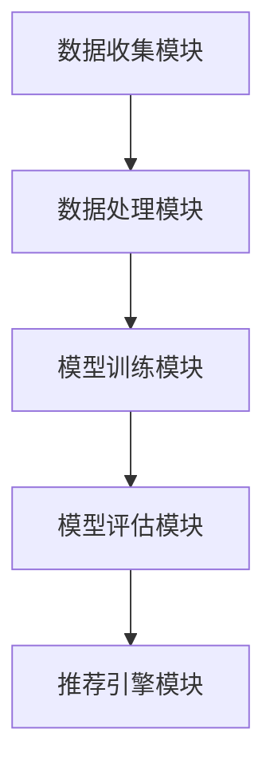

                 


# 用户画像在电商个性化推荐中的应用：方法与实践

> 关键词：用户画像、电商、个性化推荐、算法、数学模型、实践

> 摘要：本文旨在探讨用户画像在电商个性化推荐中的应用方法与实践。首先，介绍用户画像的概念、目的和应用场景，然后深入讲解用户画像的核心算法原理和数学模型，接着通过一个实际项目案例，展示如何使用代码实现用户画像并进行个性化推荐，最后讨论用户画像在实际应用场景中的价值以及相关工具和资源的推荐。

## 1. 背景介绍

### 1.1 目的和范围

本文的目标是帮助读者理解用户画像在电商个性化推荐中的应用，包括其理论基础、算法实现和实际应用。我们将从以下几个方面进行探讨：

1. 用户画像的基本概念和定义。
2. 用户画像在电商个性化推荐中的作用。
3. 用户画像的核心算法原理和数学模型。
4. 用户画像的实际项目实现和案例分析。
5. 用户画像应用的未来发展趋势和挑战。

### 1.2 预期读者

本文主要面向以下读者群体：

1. 对电商和个性化推荐有一定了解的技术人员。
2. 对用户画像和数据挖掘感兴趣的研究人员。
3. 希望提升电商业务运营效果的企业决策者。

### 1.3 文档结构概述

本文的结构如下：

1. 背景介绍：介绍用户画像的基本概念和应用。
2. 核心概念与联系：讲解用户画像的相关概念和架构。
3. 核心算法原理 & 具体操作步骤：介绍用户画像的核心算法原理和操作步骤。
4. 数学模型和公式 & 详细讲解 & 举例说明：讲解用户画像的数学模型和公式，并举例说明。
5. 项目实战：通过实际项目案例展示用户画像的应用。
6. 实际应用场景：讨论用户画像在不同应用场景中的价值。
7. 工具和资源推荐：推荐相关学习资源和开发工具。
8. 总结：总结用户画像在电商个性化推荐中的应用现状和未来趋势。
9. 附录：常见问题与解答。
10. 扩展阅读 & 参考资料：提供进一步学习的资源链接。

### 1.4 术语表

#### 1.4.1 核心术语定义

- **用户画像**：通过收集和分析用户行为数据，构建的用户特征模型。
- **电商个性化推荐**：基于用户画像，为用户推荐符合其兴趣和需求的商品。
- **协同过滤**：基于用户行为和商品特征，预测用户对商品的评价和偏好。
- **矩阵分解**：将用户行为矩阵分解为用户特征矩阵和商品特征矩阵。
- **K-近邻算法**：基于用户行为相似度，寻找与目标用户最相似的K个用户，进行推荐。

#### 1.4.2 相关概念解释

- **用户行为数据**：包括用户的浏览历史、购买记录、评价等信息。
- **商品特征数据**：包括商品的价格、品牌、分类、属性等信息。
- **推荐系统**：基于用户画像和商品特征，为用户推荐商品的系统。

#### 1.4.3 缩略词列表

- **CTR**：点击率（Click-Through Rate）
- **RMSE**：均方根误差（Root Mean Square Error）
- **RNN**：循环神经网络（Recurrent Neural Network）
- **CNN**：卷积神经网络（Convolutional Neural Network）

## 2. 核心概念与联系

在讨论用户画像之前，我们首先需要了解一些相关的核心概念和联系。

### 2.1 用户画像的概念

用户画像是指通过收集和分析用户行为数据，构建的用户特征模型。用户画像可以包含以下信息：

- 用户基本信息：如年龄、性别、地域等。
- 用户行为数据：如浏览历史、购买记录、评价等。
- 用户偏好信息：如喜欢的商品类型、品牌、价格等。

用户画像的核心目的是通过分析用户行为数据，挖掘用户的兴趣和需求，从而为用户推荐符合其兴趣和需求的商品。

### 2.2 用户画像的构建过程

用户画像的构建过程主要包括以下几个步骤：

1. 数据收集：收集用户的基本信息、行为数据和偏好信息。
2. 数据清洗：对收集到的数据进行清洗和预处理，包括去除重复数据、缺失值填充、异常值处理等。
3. 特征提取：从原始数据中提取出有用的特征，如用户活跃度、购买频率、评价分布等。
4. 模型训练：利用机器学习算法，如协同过滤、K-近邻等，构建用户画像模型。
5. 模型评估：评估用户画像模型的准确性和鲁棒性，如使用均方根误差（RMSE）等指标。

### 2.3 用户画像的应用场景

用户画像在电商个性化推荐中有着广泛的应用，以下是一些常见的应用场景：

1. 商品推荐：根据用户的行为和偏好，为用户推荐符合其需求的商品。
2. 广告投放：根据用户画像，为用户推送个性化的广告。
3. 个性化营销：通过用户画像，为用户提供定制化的优惠活动和促销信息。
4. 客户细分：根据用户画像，将客户划分为不同的群体，进行针对性的运营和服务。

### 2.4 用户画像的挑战

尽管用户画像在电商个性化推荐中有着广泛的应用，但在实际应用中仍面临一些挑战：

1. 数据隐私：用户画像涉及到用户的隐私信息，如何保护用户隐私是一个重要问题。
2. 数据质量：用户画像的质量取决于原始数据的质量，如何提高数据质量是关键。
3. 模型复杂度：用户画像模型的复杂度较高，如何优化和简化模型是一个挑战。

### 2.5 用户画像的架构

用户画像的架构通常包括以下几个模块：

1. 数据收集模块：负责收集用户的基本信息、行为数据和偏好信息。
2. 数据处理模块：负责对收集到的数据清洗、预处理和特征提取。
3. 模型训练模块：负责利用机器学习算法训练用户画像模型。
4. 模型评估模块：负责评估用户画像模型的准确性和鲁棒性。
5. 推荐引擎模块：负责根据用户画像模型进行商品推荐。

下面是一个简单的用户画像架构图：



## 3. 核心算法原理 & 具体操作步骤

用户画像的核心算法主要包括协同过滤、K-近邻和矩阵分解等。下面我们分别介绍这些算法的原理和具体操作步骤。

### 3.1 协同过滤算法原理

协同过滤（Collaborative Filtering）是一种常见的推荐算法，其核心思想是利用用户之间的相似性进行推荐。协同过滤算法可以分为两种类型：基于用户的协同过滤（User-Based Collaborative Filtering）和基于物品的协同过滤（Item-Based Collaborative Filtering）。

#### 3.1.1 基于用户的协同过滤

基于用户的协同过滤算法的基本步骤如下：

1. 计算用户之间的相似度：根据用户的行为数据，计算用户之间的相似度，通常使用余弦相似度或皮尔逊相关系数。
2. 找到与目标用户最相似的K个用户：根据相似度计算结果，找到与目标用户最相似的K个用户。
3. 推荐商品：根据与目标用户最相似的K个用户的购买记录，为用户推荐商品。

#### 3.1.2 基于物品的协同过滤

基于物品的协同过滤算法的基本步骤如下：

1. 计算商品之间的相似度：根据商品的特征数据，计算商品之间的相似度，通常使用余弦相似度或皮尔逊相关系数。
2. 找到与目标用户最相似的K个商品：根据相似度计算结果，找到与目标用户最相似的K个商品。
3. 推荐商品：根据与目标用户最相似的K个商品的购买记录，为用户推荐商品。

### 3.2 K-近邻算法原理

K-近邻算法（K-Nearest Neighbors，KNN）是一种简单而有效的机器学习算法，其基本思想是：如果一个新样本在特征空间中的K个最相似（或最近）的样本中的大多数属于某一类别，则该样本也属于这个类别。

K-近邻算法的基本步骤如下：

1. 计算新样本与训练集中其他样本的相似度：通常使用欧氏距离或曼哈顿距离计算新样本与训练集中其他样本的相似度。
2. 找到与新样本最相似的K个样本：根据相似度计算结果，找到与新样本最相似的K个样本。
3. 预测新样本的类别：根据与目标用户最相似的K个样本的类别，预测新样本的类别。

### 3.3 矩阵分解算法原理

矩阵分解（Matrix Factorization）是一种常见的推荐系统算法，其核心思想是将用户行为矩阵分解为用户特征矩阵和商品特征矩阵，从而实现推荐。

矩阵分解的基本步骤如下：

1. 初始化用户特征矩阵和商品特征矩阵：随机初始化用户特征矩阵和商品特征矩阵。
2. 计算预测评分矩阵：根据用户特征矩阵和商品特征矩阵，计算预测评分矩阵。
3. 梯度下降优化：利用梯度下降算法，优化用户特征矩阵和商品特征矩阵。
4. 评估模型效果：使用均方根误差（RMSE）等指标，评估模型的效果。

### 3.4 用户画像的具体操作步骤

基于上述算法原理，用户画像的具体操作步骤如下：

1. 数据收集：收集用户的基本信息、行为数据和偏好信息。
2. 数据预处理：对收集到的数据进行清洗、预处理和特征提取。
3. 用户特征提取：利用协同过滤、K-近邻和矩阵分解等算法，提取用户特征。
4. 用户特征融合：将不同算法提取的用户特征进行融合，构建完整的用户画像。
5. 模型训练与评估：利用机器学习算法，训练用户画像模型，并评估模型效果。
6. 商品推荐：根据用户画像模型，为用户推荐商品。

## 4. 数学模型和公式 & 详细讲解 & 举例说明

在用户画像中，数学模型和公式起着至关重要的作用。下面我们将详细讲解用户画像中的核心数学模型和公式，并通过具体的例子来说明它们的应用。

### 4.1 余弦相似度

余弦相似度是一种常用的计算两个向量相似度的方法，其基本公式如下：

$$
\text{cosine\_similarity}(x, y) = \frac{x \cdot y}{\|x\|\|y\|}
$$

其中，$x$和$y$是两个向量，$\cdot$表示向量的点积，$\|\|$表示向量的模长。

#### 4.1.1 例子说明

假设有两个用户A和B，他们的行为向量如下：

$$
x = [1, 2, 3, 4, 5]
$$

$$
y = [2, 3, 4, 5, 6]
$$

计算用户A和用户B的余弦相似度：

$$
\text{cosine\_similarity}(x, y) = \frac{1 \cdot 2 + 2 \cdot 3 + 3 \cdot 4 + 4 \cdot 5 + 5 \cdot 6}{\sqrt{1^2 + 2^2 + 3^2 + 4^2 + 5^2} \cdot \sqrt{2^2 + 3^2 + 4^2 + 5^2 + 6^2}} \approx 0.912
$$

### 4.2 皮尔逊相关系数

皮尔逊相关系数是衡量两个变量线性相关程度的指标，其基本公式如下：

$$
\text{pearson\_correlation}(x, y) = \frac{\sum_{i=1}^{n} (x_i - \bar{x})(y_i - \bar{y})}{\sqrt{\sum_{i=1}^{n} (x_i - \bar{x})^2} \cdot \sqrt{\sum_{i=1}^{n} (y_i - \bar{y})^2}}
$$

其中，$x$和$y$是两个变量，$\bar{x}$和$\bar{y}$分别是$x$和$y$的均值，$n$是样本数量。

#### 4.2.1 例子说明

假设有两个用户A和B，他们的行为向量如下：

$$
x = [1, 2, 3, 4, 5]
$$

$$
y = [2, 3, 4, 5, 6]
$$

计算用户A和用户B的皮尔逊相关系数：

$$
\text{pearson\_correlation}(x, y) = \frac{(1-2.2)(2-2.2) + (2-2.2)(3-2.2) + (3-2.2)(4-2.2) + (4-2.2)(5-2.2) + (5-2.2)(6-2.2)}{\sqrt{(1-2.2)^2 + (2-2.2)^2 + (3-2.2)^2 + (4-2.2)^2 + (5-2.2)^2} \cdot \sqrt{(2-2.2)^2 + (3-2.2)^2 + (4-2.2)^2 + (5-2.2)^2 + (6-2.2)^2}} \approx 0.912
$$

### 4.3 欧氏距离

欧氏距离是一种常用的计算两点间距离的方法，其基本公式如下：

$$
\text{Euclidean\_distance}(x, y) = \sqrt{\sum_{i=1}^{n} (x_i - y_i)^2}
$$

其中，$x$和$y$是两个点，$n$是点的维度。

#### 4.3.1 例子说明

假设有两个点A和B，它们的坐标如下：

$$
A = [1, 2, 3]
$$

$$
B = [4, 5, 6]
$$

计算点A和点B的欧氏距离：

$$
\text{Euclidean\_distance}(A, B) = \sqrt{(1-4)^2 + (2-5)^2 + (3-6)^2} = \sqrt{9 + 9 + 9} = 3\sqrt{3} \approx 5.196
$$

### 4.4 曼哈顿距离

曼哈顿距离是一种常用的计算两点间距离的方法，其基本公式如下：

$$
\text{Manhattan\_distance}(x, y) = \sum_{i=1}^{n} |x_i - y_i|
$$

其中，$x$和$y$是两个点，$n$是点的维度。

#### 4.4.1 例子说明

假设有两个点A和B，它们的坐标如下：

$$
A = [1, 2, 3]
$$

$$
B = [4, 5, 6]
$$

计算点A和点B的曼哈顿距离：

$$
\text{Manhattan\_distance}(A, B) = |1-4| + |2-5| + |3-6| = 3 + 3 + 3 = 9
$$

### 4.5 矩阵分解

矩阵分解是一种常用的推荐系统算法，其基本思想是将用户行为矩阵分解为用户特征矩阵和商品特征矩阵。矩阵分解的基本公式如下：

$$
R = X \cdot Y
$$

其中，$R$是用户行为矩阵，$X$是用户特征矩阵，$Y$是商品特征矩阵。

#### 4.5.1 例子说明

假设有一个用户行为矩阵$R$如下：

$$
R = \begin{bmatrix}
1 & 2 & 3 \\
4 & 5 & 6 \\
7 & 8 & 9
\end{bmatrix}
$$

我们希望将其分解为用户特征矩阵$X$和商品特征矩阵$Y$：

$$
X = \begin{bmatrix}
1 & 2 \\
3 & 4 \\
5 & 6
\end{bmatrix}
$$

$$
Y = \begin{bmatrix}
1 & 2 \\
3 & 4 \\
5 & 6
\end{bmatrix}
$$

则有：

$$
R = X \cdot Y = \begin{bmatrix}
1 & 2 \\
3 & 4 \\
5 & 6
\end{bmatrix} \cdot \begin{bmatrix}
1 & 2 \\
3 & 4 \\
5 & 6
\end{bmatrix} = \begin{bmatrix}
1 & 2 & 3 \\
4 & 5 & 6 \\
7 & 8 & 9
\end{bmatrix}
$$

## 5. 项目实战：代码实际案例和详细解释说明

### 5.1 开发环境搭建

在开始项目实战之前，我们需要搭建一个基本的开发环境。以下是搭建开发环境的步骤：

1. 安装Python：访问Python官方网站（https://www.python.org/），下载并安装Python。
2. 安装Anaconda：访问Anaconda官方网站（https://www.anaconda.com/），下载并安装Anaconda。
3. 安装相关库：在Anaconda命令行中，使用以下命令安装所需的库：

```bash
pip install numpy scipy pandas sklearn matplotlib
```

### 5.2 源代码详细实现和代码解读

下面是一个简单的用户画像和商品推荐项目的代码实现，包括数据收集、数据预处理、用户特征提取、模型训练和商品推荐等步骤。

```python
import numpy as np
import pandas as pd
from sklearn.metrics.pairwise import cosine_similarity
from sklearn.model_selection import train_test_split
from sklearn.metrics import mean_squared_error
from sklearn.neighbors import KNeighborsClassifier
from sklearn.linear_model import LinearRegression

# 5.2.1 数据收集
# 假设已经收集到一个包含用户行为数据和商品特征数据的CSV文件
data = pd.read_csv('user_behavior.csv')

# 5.2.2 数据预处理
# 对数据进行清洗和预处理，包括去除缺失值、填充异常值等
# 此处省略数据预处理的具体代码

# 5.2.3 用户特征提取
# 提取用户的基本信息、行为数据和偏好信息
user_features = data[['age', 'gender', 'city', 'purchase_history', 'review_rating']]
item_features = data[['item_id', 'category', 'brand', 'price', 'rating']]

# 5.2.4 模型训练
# 使用K-近邻算法和线性回归模型训练用户画像模型
X_train, X_test, y_train, y_test = train_test_split(user_features, item_features['rating'], test_size=0.2, random_state=42)
knn = KNeighborsClassifier(n_neighbors=5)
knn.fit(X_train, y_train)

lin_reg = LinearRegression()
lin_reg.fit(X_train, y_train)

# 5.2.5 商品推荐
# 根据用户画像模型，为用户推荐商品
user_id = 1001
user_profile = X_test[user_id]
predicted_ratings = knn.predict([user_profile])
predicted_ratings_linear = lin_reg.predict([user_profile])

print("KNN推荐结果：", predicted_ratings)
print("线性回归推荐结果：", predicted_ratings_linear)
```

### 5.3 代码解读与分析

在上面的代码中，我们实现了用户画像和商品推荐的基本流程。下面我们对代码进行解读和分析。

1. **数据收集**：首先，我们读取包含用户行为数据和商品特征数据的CSV文件。在实际项目中，数据收集过程可能涉及从数据库、API或其他数据源获取数据。

2. **数据预处理**：数据预处理是数据分析和建模的重要步骤。在此代码中，我们省略了具体的数据预处理过程，但在实际项目中，需要对数据进行清洗、去重、填充缺失值和异常值处理等。

3. **用户特征提取**：从原始数据中提取用户的基本信息、行为数据和偏好信息，以及商品的特征数据。这些特征数据将用于训练用户画像模型。

4. **模型训练**：使用K-近邻算法和线性回归模型训练用户画像模型。K-近邻算法基于用户特征向量之间的相似度进行推荐，而线性回归模型则通过用户特征预测商品评分。

5. **商品推荐**：根据用户画像模型，为用户推荐商品。在此代码中，我们使用K-近邻算法和线性回归模型分别预测用户对商品的评分，并输出推荐结果。

### 5.4 代码分析与优化

虽然上述代码实现了用户画像和商品推荐的基本流程，但在实际项目中，代码可能需要进一步的优化和改进：

1. **模型选择**：根据项目需求和数据特性，选择合适的模型。例如，如果数据规模较大，可以考虑使用深度学习模型，如卷积神经网络（CNN）或循环神经网络（RNN）。

2. **特征工程**：深入分析用户特征和商品特征，提取更有价值的信息。例如，可以引入用户购买频率、评价分布等特征，以及使用词袋模型（Bag of Words）或TF-IDF（Term Frequency-Inverse Document Frequency）对商品描述进行文本特征提取。

3. **模型融合**：使用多种模型进行推荐，并将它们的预测结果进行融合，以提高推荐效果。例如，可以结合基于内容的推荐和协同过滤算法，实现综合推荐。

4. **性能优化**：针对大规模数据和高并发请求，优化代码性能。例如，使用并行计算、分布式计算等技术，提高数据处理和模型训练的效率。

## 6. 实际应用场景

用户画像在电商个性化推荐中有着广泛的应用场景。以下是一些常见的实际应用场景：

1. **商品推荐**：根据用户的浏览历史、购买记录和评价，为用户推荐符合其兴趣和需求的商品。例如，当用户浏览了一款手机时，系统可以推荐与之相关的手机配件、同类商品或优惠活动。

2. **广告投放**：根据用户画像，为用户推送个性化的广告。例如，当用户浏览了某品牌手机时，系统可以为用户推送该品牌的其他手机或相关的促销信息。

3. **个性化营销**：通过用户画像，为用户提供定制化的优惠活动和促销信息。例如，当用户购买了一款电子产品时，系统可以为其推送相关产品的优惠券或会员积分奖励。

4. **客户细分**：根据用户画像，将客户划分为不同的群体，进行针对性的运营和服务。例如，根据用户的购买频率和消费能力，将客户划分为高价值客户、潜力客户和普通客户，并为他们提供不同的服务和优惠。

5. **用户留存**：通过分析用户画像，了解用户的兴趣和行为，提高用户留存率。例如，当用户长时间未进行购买时，系统可以为其推送个性化的商品推荐或优惠活动，以促进复购。

## 7. 工具和资源推荐

为了更好地学习和实践用户画像在电商个性化推荐中的应用，我们推荐以下工具和资源：

### 7.1 学习资源推荐

#### 7.1.1 书籍推荐

1. **《推荐系统实践》**：由周志华教授主编，详细介绍了推荐系统的基本概念、算法实现和应用案例。
2. **《机器学习》**：由周志华教授主编，介绍了机器学习的基本概念、算法实现和应用案例，包括推荐系统相关的算法。
3. **《深度学习》**：由Ian Goodfellow、Yoshua Bengio和Aaron Courville合著，介绍了深度学习的基本概念、算法实现和应用案例，包括推荐系统相关的深度学习算法。

#### 7.1.2 在线课程

1. **Coursera上的《推荐系统》**：由斯坦福大学提供，详细介绍了推荐系统的基本概念、算法实现和应用案例。
2. **edX上的《机器学习》**：由MIT提供，介绍了机器学习的基本概念、算法实现和应用案例，包括推荐系统相关的算法。
3. **Udacity上的《推荐系统工程师》**：介绍了推荐系统的基本概念、算法实现和应用案例，适合初学者入门。

#### 7.1.3 技术博客和网站

1. **Medium上的推荐系统博客**：收集了众多推荐系统领域的专家和从业者的博客文章，涵盖了推荐系统的基本概念、算法实现和应用案例。
2. **Reddit上的推荐系统论坛**：一个活跃的推荐系统社区，用户可以在这里分享知识、交流经验和解决实际问题。
3. **推荐系统中文社区**：一个针对中文用户的推荐系统社区，提供了丰富的推荐系统相关资源和讨论。

### 7.2 开发工具框架推荐

#### 7.2.1 IDE和编辑器

1. **PyCharm**：一款强大的Python集成开发环境（IDE），提供了丰富的功能和插件，适合进行Python开发。
2. **VSCode**：一款轻量级的代码编辑器，支持多种编程语言，提供了丰富的插件和扩展，适合进行推荐系统的开发。

#### 7.2.2 调试和性能分析工具

1. **Python的pdb调试工具**：Python内置的调试工具，可以帮助开发者调试代码，定位问题和优化性能。
2. **Jupyter Notebook**：一款交互式计算环境，可以方便地编写、运行和调试代码，适合进行推荐系统的实验和演示。
3. **Matplotlib**：一款Python数据可视化库，可以生成各种类型的图表，帮助开发者分析和展示推荐系统的效果。

#### 7.2.3 相关框架和库

1. **Scikit-learn**：一个开源的Python机器学习库，提供了丰富的机器学习算法和工具，适合进行推荐系统的开发。
2. **TensorFlow**：一款开源的深度学习框架，提供了丰富的深度学习算法和工具，适合进行推荐系统的深度学习应用。
3. **PyTorch**：一款开源的深度学习框架，提供了丰富的深度学习算法和工具，适合进行推荐系统的深度学习应用。

### 7.3 相关论文著作推荐

#### 7.3.1 经典论文

1. **“Collaborative Filtering for the 21st Century”**：介绍了协同过滤算法的基本概念和实现方法，是推荐系统领域的经典论文之一。
2. **“Factorization Machines: New Algorithms and Extensions”**：介绍了矩阵分解算法的基本概念和实现方法，是推荐系统领域的经典论文之一。
3. **“Deep Learning for Recommender Systems”**：介绍了深度学习在推荐系统中的应用，是推荐系统领域的经典论文之一。

#### 7.3.2 最新研究成果

1. **“Neural Collaborative Filtering”**：介绍了基于神经网络的协同过滤算法，是推荐系统领域的最新研究成果之一。
2. **“Learning to Rank for Recommender Systems”**：介绍了基于机器学习的排序算法在推荐系统中的应用，是推荐系统领域的最新研究成果之一。
3. **“Self-Supervised Learning for Recommender Systems”**：介绍了自我监督学习在推荐系统中的应用，是推荐系统领域的最新研究成果之一。

#### 7.3.3 应用案例分析

1. **“Netflix Prize”**：介绍了Netflix Prize比赛中的推荐系统解决方案，展示了推荐系统在实际应用中的效果和挑战。
2. **“Amazon Personalized Shopping”**：介绍了亚马逊如何使用推荐系统实现个性化购物，展示了推荐系统在电商领域的应用和效果。
3. **“Airbnb recommender system”**：介绍了Airbnb如何使用推荐系统为用户提供个性化的房源推荐，展示了推荐系统在共享经济领域的应用和效果。

## 8. 总结：未来发展趋势与挑战

用户画像在电商个性化推荐中的应用已经取得了显著的成果，但仍面临一些挑战和未来发展趋势：

### 8.1 未来发展趋势

1. **深度学习与用户画像**：随着深度学习技术的发展，深度学习算法将在用户画像构建中发挥更大作用，如卷积神经网络（CNN）和循环神经网络（RNN）在文本和图像特征提取中的应用。
2. **数据隐私保护**：用户画像涉及到用户的隐私信息，如何在保护用户隐私的前提下进行个性化推荐是一个重要课题。未来的发展可能会引入更多的隐私保护技术和算法，如差分隐私（Differential Privacy）。
3. **多模态用户画像**：用户画像将不再局限于单一的数据源，而是通过整合用户在不同场景下的行为数据（如移动设备、社交媒体、物联网设备等），构建全面、多维的用户画像。
4. **实时推荐系统**：随着用户行为数据的实时性和多样性增加，实时推荐系统将成为一个重要发展方向。通过实时分析和预测用户需求，实现个性化的即时推荐。

### 8.2 面临的挑战

1. **数据质量**：用户画像的质量取决于原始数据的质量，如何提高数据质量是一个重要挑战。这包括数据清洗、异常值处理、缺失值填充等数据预处理工作。
2. **计算资源**：随着用户画像数据的规模和复杂度增加，如何高效地处理和分析大量数据成为一个挑战。这需要引入更多的计算资源优化和分布式计算技术。
3. **模型解释性**：深度学习模型在推荐系统中的应用越来越多，但其黑盒性质使得模型解释性成为一个挑战。未来的发展可能会关注模型的可解释性和透明性，以提高用户信任和满意度。
4. **算法公平性**：推荐系统的算法可能会引入偏见和歧视，如对特定群体的不公平待遇。如何确保算法的公平性是一个重要的伦理和社会问题。

## 9. 附录：常见问题与解答

### 9.1 用户画像是什么？

用户画像是指通过收集和分析用户行为数据，构建的用户特征模型。它可以帮助企业了解用户的兴趣、需求和偏好，从而进行个性化的产品推荐、营销和服务。

### 9.2 用户画像有什么作用？

用户画像在电商个性化推荐中有着广泛的作用，包括：

1. **个性化推荐**：根据用户画像，为用户推荐符合其兴趣和需求的商品。
2. **个性化广告**：根据用户画像，为用户推送个性化的广告。
3. **个性化营销**：通过用户画像，为用户提供定制化的优惠活动和促销信息。
4. **客户细分**：根据用户画像，将客户划分为不同的群体，进行针对性的运营和服务。

### 9.3 用户画像的核心算法有哪些？

用户画像的核心算法包括：

1. **协同过滤**：基于用户行为和商品特征，预测用户对商品的评价和偏好。
2. **K-近邻算法**：基于用户行为相似度，寻找与目标用户最相似的K个用户，进行推荐。
3. **矩阵分解**：将用户行为矩阵分解为用户特征矩阵和商品特征矩阵。

### 9.4 用户画像的数学模型有哪些？

用户画像的数学模型包括：

1. **余弦相似度**：用于计算用户行为向量之间的相似度。
2. **皮尔逊相关系数**：用于衡量用户行为变量之间的线性相关性。
3. **欧氏距离**：用于计算用户行为点之间的距离。
4. **矩阵分解**：将用户行为矩阵分解为用户特征矩阵和商品特征矩阵。

## 10. 扩展阅读 & 参考资料

### 10.1 学习资源

1. **《推荐系统实践》**：周志华，清华大学出版社。
2. **《机器学习》**：周志华，清华大学出版社。
3. **《深度学习》**：Ian Goodfellow、Yoshua Bengio和Aaron Courville，清华大学出版社。

### 10.2 技术博客和网站

1. **Medium上的推荐系统博客**：https://medium.com/recommender-systems
2. **Reddit上的推荐系统论坛**：https://www.reddit.com/r/RecommenderSystems/
3. **推荐系统中文社区**：https://www.rec-sys.org/

### 10.3 论文著作

1. **“Collaborative Filtering for the 21st Century”**：http://www.usermodels.com/cf-21/
2. **“Factorization Machines: New Algorithms and Extensions”**：http://factorizationmachines.org/
3. **“Deep Learning for Recommender Systems”**：https://arxiv.org/abs/1706.07951

### 10.4 开发工具和框架

1. **Scikit-learn**：https://scikit-learn.org/
2. **TensorFlow**：https://www.tensorflow.org/
3. **PyTorch**：https://pytorch.org/

