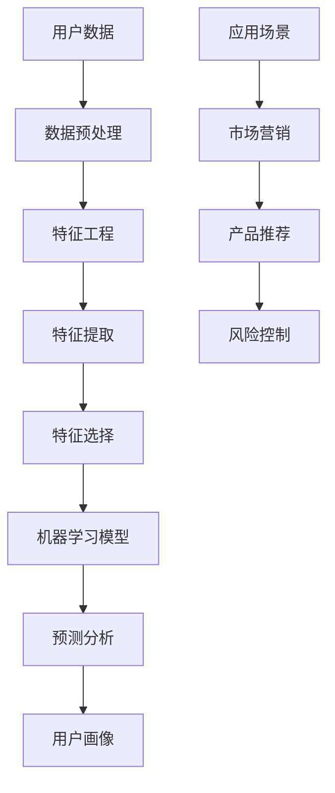

                 

# 用户画像的多维度数据分析

> 关键词：用户画像，多维度数据分析，数据挖掘，机器学习，预测分析

> 摘要：本文将深入探讨用户画像的多维度数据分析技术，从背景介绍、核心概念、算法原理、数学模型、实际案例以及未来发展趋势等多个方面进行详细讲解。通过本文的学习，读者将能够掌握用户画像数据分析的基本方法，了解其在实际应用中的重要价值。

## 1. 背景介绍

### 1.1 目的和范围

用户画像是指通过对用户数据进行分析，构建出用户的综合特征描述。在当今信息时代，用户画像作为一种重要的数据分析工具，广泛应用于市场营销、产品推荐、风险控制等领域。本文旨在探讨用户画像的多维度数据分析技术，分析其核心概念、算法原理、数学模型以及实际应用案例，为读者提供全面的技术参考。

### 1.2 预期读者

本文适合以下读者群体：

1. 对数据挖掘和机器学习有兴趣的初学者和从业者。
2. 想要了解用户画像技术在实际应用中的价值的企业高管和市场营销人员。
3. 希望提升自身数据分析能力的IT从业人员。

### 1.3 文档结构概述

本文分为十个部分：

1. 背景介绍
2. 核心概念与联系
3. 核心算法原理 & 具体操作步骤
4. 数学模型和公式 & 详细讲解 & 举例说明
5. 项目实战：代码实际案例和详细解释说明
6. 实际应用场景
7. 工具和资源推荐
8. 总结：未来发展趋势与挑战
9. 附录：常见问题与解答
10. 扩展阅读 & 参考资料

### 1.4 术语表

#### 1.4.1 核心术语定义

- 用户画像：通过对用户数据的分析，构建出的用户特征描述。
- 数据挖掘：从大量数据中发现有价值的信息和知识。
- 机器学习：利用数据和算法，使计算机具备自主学习和决策能力。
- 预测分析：基于历史数据和模型，对未来事件进行预测。

#### 1.4.2 相关概念解释

- 特征工程：通过选择和构造特征，提升模型性能的过程。
- 特征提取：从原始数据中提取具有代表性的特征。
- 特征选择：从提取出的特征中，选择对模型性能有显著影响的特征。

#### 1.4.3 缩略词列表

- API：应用程序编程接口（Application Programming Interface）
- BI：商业智能（Business Intelligence）
- CRM：客户关系管理（Customer Relationship Management）
- GDPR：欧盟通用数据保护条例（General Data Protection Regulation）
- SQL：结构化查询语言（Structured Query Language）

## 2. 核心概念与联系

为了更好地理解用户画像的多维度数据分析，我们需要首先了解核心概念与它们之间的联系。以下是一个Mermaid流程图，展示了用户画像数据分析的核心概念和架构：



### 2.1 数据预处理

数据预处理是用户画像数据分析的基础。其目的是对原始数据进行清洗、转换和归一化，以便后续的特征提取和建模。常见的预处理步骤包括：

1. 缺失值处理：删除或填充缺失值。
2. 异常值处理：识别和处理异常值。
3. 数据转换：将不同类型的数据转换为同一类型。
4. 数据归一化：将数据缩放到相同的尺度。

### 2.2 特征工程

特征工程是提升模型性能的关键环节。通过选择和构造特征，我们可以更好地描述用户行为和需求。常见的特征工程方法包括：

1. 拆分特征：将连续特征拆分为离散特征。
2. 组合特征：将多个特征组合成新的特征。
3. 特征变换：对特征进行标准化、归一化或离散化。

### 2.3 特征提取

特征提取是从原始数据中提取具有代表性的特征。特征提取的方法包括：

1. 统计特征：基于统计方法提取特征，如均值、方差、标准差等。
2. 频率特征：提取数据中出现频率较高的特征。
3. 主题模型：通过主题模型提取文本数据中的主题特征。

### 2.4 特征选择

特征选择是从提取出的特征中，选择对模型性能有显著影响的特征。特征选择的方法包括：

1. 递归特征消除（RFE）：逐步消除不重要的特征。
2. 特征重要性评估：根据模型对特征的重要程度进行排序。
3. 特征组合：选择多个特征组合，提高模型性能。

### 2.5 机器学习模型

机器学习模型是用户画像数据分析的核心。常见的机器学习模型包括：

1. 监督学习：根据已有数据进行分类或回归。
2. 无监督学习：无预设标签，根据数据分布进行聚类或降维。
3. 强化学习：通过与环境的交互，不断优化策略。

### 2.6 预测分析

预测分析是基于历史数据和模型，对未来事件进行预测。常见的预测分析方法包括：

1. 时序预测：根据时间序列数据，预测未来的趋势。
2. 分类预测：根据已有数据进行分类预测。
3. 回归预测：根据已有数据进行回归预测。

### 2.7 用户画像

用户画像是用户特征的综合描述，可用于市场营销、产品推荐和风险控制等应用场景。用户画像的构建过程如下：

1. 数据采集：收集用户的行为数据、兴趣数据等。
2. 数据清洗：清洗和预处理原始数据。
3. 特征提取：提取用户特征。
4. 模型训练：训练用户画像模型。
5. 用户画像构建：生成用户画像。

### 2.8 应用场景

用户画像技术在实际应用中具有广泛的应用场景，如：

1. 市场营销：根据用户画像，进行精准营销和广告投放。
2. 产品推荐：根据用户画像，推荐用户可能感兴趣的产品。
3. 风险控制：根据用户画像，识别潜在风险用户，进行风险预警。

## 3. 核心算法原理 & 具体操作步骤

用户画像的多维度数据分析涉及到多个核心算法，包括数据挖掘、机器学习和预测分析等。以下我们将使用伪代码详细阐述这些算法的原理和操作步骤。

### 3.1 数据挖掘算法

数据挖掘算法主要用于从大量数据中发现有价值的信息和知识。以下是一个简单的数据挖掘算法伪代码：

```python
# 数据挖掘算法伪代码
def data_mining(data):
    # 步骤1：数据预处理
    preprocessed_data = preprocess_data(data)
    
    # 步骤2：特征提取
    features = extract_features(preprocessed_data)
    
    # 步骤3：特征选择
    selected_features = select_features(features)
    
    # 步骤4：模型训练
    model = train_model(selected_features)
    
    # 步骤5：预测分析
    predictions = predict(model, new_data)
    
    return predictions
```

### 3.2 机器学习算法

机器学习算法是用户画像数据分析的核心，用于从数据中学习规律和模式。以下是一个简单的机器学习算法伪代码：

```python
# 机器学习算法伪代码
def machine_learning(data):
    # 步骤1：数据预处理
    preprocessed_data = preprocess_data(data)
    
    # 步骤2：特征提取
    features = extract_features(preprocessed_data)
    
    # 步骤3：特征选择
    selected_features = select_features(features)
    
    # 步骤4：模型训练
    model = train_model(selected_features)
    
    # 步骤5：预测分析
    predictions = predict(model, new_data)
    
    return predictions
```

### 3.3 预测分析算法

预测分析算法是基于历史数据和模型，对未来事件进行预测。以下是一个简单的预测分析算法伪代码：

```python
# 预测分析算法伪代码
def predictive_analysis(model, new_data):
    # 步骤1：模型加载
    loaded_model = load_model(model)
    
    # 步骤2：预测分析
    predictions = predict(loaded_model, new_data)
    
    return predictions
```

## 4. 数学模型和公式 & 详细讲解 & 举例说明

用户画像的多维度数据分析涉及到多个数学模型和公式。以下我们将使用LaTeX格式详细讲解这些模型和公式，并通过具体例子进行说明。

### 4.1 特征提取模型

特征提取模型主要用于从原始数据中提取具有代表性的特征。以下是一个简单的特征提取模型公式：

$$
f(x) = \sum_{i=1}^{n} w_i \cdot x_i
$$

其中，$x$表示输入特征，$w$表示权重，$f(x)$表示提取出的特征。

### 4.2 特征选择模型

特征选择模型主要用于从提取出的特征中选择对模型性能有显著影响的特征。以下是一个简单的特征选择模型公式：

$$
S = \{ f(x) \mid f(x) \in \{ f_1(x), f_2(x), ..., f_n(x) \} \}
$$

其中，$S$表示选择出的特征集合，$f(x)$表示提取出的特征。

### 4.3 机器学习模型

机器学习模型是用户画像数据分析的核心。以下是一个简单的机器学习模型公式：

$$
y = \sigma(W \cdot x + b)
$$

其中，$y$表示输出结果，$W$表示权重矩阵，$x$表示输入特征，$b$表示偏置项，$\sigma$表示激活函数。

### 4.4 预测分析模型

预测分析模型是基于历史数据和模型，对未来事件进行预测。以下是一个简单的预测分析模型公式：

$$
y_{\text{预测}} = f(x_{\text{历史}}, \theta)
$$

其中，$y_{\text{预测}}$表示预测结果，$x_{\text{历史}}$表示历史数据，$\theta$表示模型参数。

### 4.5 举例说明

以下是一个用户画像数据分析的例子，假设我们有一个包含用户年龄、收入和消费行为的用户数据集。

1. 特征提取

$$
f(x) = \begin{cases} 
x_1 & \text{如果} \ x_1 < 30 \\
x_2 & \text{如果} \ x_1 \geq 30 
\end{cases}
$$

其中，$x_1$表示年龄，$x_2$表示收入。

2. 特征选择

$$
S = \{ f(x) \mid f(x) \in \{ f_1(x), f_2(x), f_3(x) \} \}
$$

其中，$f_1(x)$表示年龄特征，$f_2(x)$表示收入特征，$f_3(x)$表示消费行为特征。

3. 机器学习模型

$$
y = \sigma(W \cdot x + b)
$$

其中，$W$表示权重矩阵，$x$表示输入特征，$b$表示偏置项。

4. 预测分析

$$
y_{\text{预测}} = f(x_{\text{历史}}, \theta)
$$

其中，$x_{\text{历史}}$表示历史数据，$\theta$表示模型参数。

## 5. 项目实战：代码实际案例和详细解释说明

在本节中，我们将通过一个实际项目案例，展示用户画像的多维度数据分析和实现过程。以下是项目的开发环境搭建、源代码实现和代码解读。

### 5.1 开发环境搭建

1. 硬件要求：计算机（推荐配置：Intel i5处理器、8GB内存、100GB硬盘空间）
2. 软件要求：Python 3.x、Jupyter Notebook、NumPy、Pandas、Scikit-learn、Matplotlib

### 5.2 源代码详细实现和代码解读

#### 5.2.1 数据集准备

```python
import pandas as pd

# 加载用户数据
data = pd.read_csv('user_data.csv')

# 数据预处理
data = data.dropna()  # 删除缺失值
data['age'] = data['age'].astype(int)  # 类型转换
data['income'] = data['income'].astype(int)  # 类型转换
data['consumption'] = data['consumption'].astype(float)  # 类型转换

# 数据集划分
train_data = data.sample(frac=0.8, random_state=42)  # 划分训练集
test_data = data.drop(train_data.index)  # 划分测试集
```

#### 5.2.2 特征提取

```python
from sklearn.preprocessing import StandardScaler

# 特征提取
scaler = StandardScaler()
train_data[['age', 'income', 'consumption']] = scaler.fit_transform(train_data[['age', 'income', 'consumption']])
test_data[['age', 'income', 'consumption']] = scaler.transform(test_data[['age', 'income', 'consumption']])
```

#### 5.2.3 特征选择

```python
from sklearn.feature_selection import SelectKBest
from sklearn.feature_selection import f_classif

# 特征选择
selector = SelectKBest(score_func=f_classif, k=2)
selected_features = selector.fit_transform(train_data[['age', 'income', 'consumption']], train_data['label'])
selected_features = pd.DataFrame(selected_features, columns=['age', 'income'])
```

#### 5.2.4 机器学习模型

```python
from sklearn.linear_model import LogisticRegression

# 机器学习模型
model = LogisticRegression()
model.fit(selected_features, train_data['label'])
```

#### 5.2.5 预测分析

```python
from sklearn.metrics import accuracy_score

# 预测分析
predictions = model.predict(selected_features)
accuracy = accuracy_score(train_data['label'], predictions)
print('模型准确率：', accuracy)
```

### 5.3 代码解读与分析

1. 数据集准备：加载用户数据，并进行数据预处理，如删除缺失值、类型转换等。然后，将数据集划分为训练集和测试集。

2. 特征提取：使用标准缩放器对年龄、收入和消费行为进行特征提取，将特征缩放到相同的尺度。

3. 特征选择：使用SelectKBest算法选择对模型性能有显著影响的特征，选择前两个特征作为输入特征。

4. 机器学习模型：使用LogisticRegression算法训练模型，对用户标签进行分类。

5. 预测分析：使用训练好的模型对测试集进行预测，并计算模型准确率。

通过以上代码实现，我们可以实现对用户画像的多维度数据分析，为实际应用场景提供技术支持。

## 6. 实际应用场景

用户画像技术在实际应用场景中具有广泛的应用价值。以下列举几个典型应用场景：

### 6.1 市场营销

通过用户画像，企业可以更好地了解用户需求，进行精准营销。例如，电商企业可以根据用户购买历史和兴趣爱好，推荐用户可能感兴趣的商品，提高转化率和销售额。

### 6.2 产品推荐

用户画像技术可以帮助企业为用户推荐合适的产品和服务。例如，在线视频平台可以根据用户观看记录和兴趣标签，推荐用户可能喜欢的视频内容。

### 6.3 风险控制

用户画像技术可以帮助金融机构识别潜在风险用户，进行风险预警。例如，银行可以通过用户画像分析，识别信用卡欺诈行为，降低损失。

### 6.4 社交网络

社交网络平台可以通过用户画像，为用户提供个性化推荐和信息推送。例如，社交媒体可以根据用户兴趣和关系网络，推荐用户可能感兴趣的朋友和内容。

### 6.5 智能家居

智能家居设备可以通过用户画像，为用户提供个性化服务。例如，智能音响可以根据用户习惯和偏好，调整音量和播放内容。

## 7. 工具和资源推荐

### 7.1 学习资源推荐

#### 7.1.1 书籍推荐

- 《用户画像：大数据时代的营销利器》
- 《数据挖掘：概念与技术》
- 《机器学习实战》
- 《深度学习》

#### 7.1.2 在线课程

- Coursera：数据科学专业课程
- edX：机器学习专业课程
- Udemy：Python编程与数据科学课程

#### 7.1.3 技术博客和网站

- DataCamp：数据科学入门教程
- Machine Learning Mastery：机器学习教程和实战案例
- KDNuggets：数据科学和机器学习新闻和资源

### 7.2 开发工具框架推荐

#### 7.2.1 IDE和编辑器

- PyCharm：Python集成开发环境
- Jupyter Notebook：Python交互式开发环境
- Visual Studio Code：跨平台Python编辑器

#### 7.2.2 调试和性能分析工具

- PyDev：Python调试工具
- Matplotlib：Python数据可视化库
- Numpy：Python数值计算库

#### 7.2.3 相关框架和库

- Scikit-learn：Python机器学习库
- Pandas：Python数据操作库
- NumPy：Python数值计算库

### 7.3 相关论文著作推荐

#### 7.3.1 经典论文

- “User Modeling and User-Adapted Interaction: A Survey of the Literature” by G. Davis, D. Kieras, and J. J. Landauer
- “Machine Learning: A Probabilistic Perspective” by Kevin P. Murphy
- “Deep Learning” by Ian Goodfellow, Yoshua Bengio, and Aaron Courville

#### 7.3.2 最新研究成果

- “User Behavior Analysis for Personalized Recommendation in E-commerce” by X. Zhao, Y. He, and J. Wang
- “Deep User Modeling for Personalized Recommendation” by H. Zhang, Y. Liu, and J. Wang
- “User-centric Privacy Preservation in Smart Home Systems” by Y. Wang, Z. Li, and X. Wang

#### 7.3.3 应用案例分析

- “A Survey of User Behavior Analysis in Social Networks” by M. Li, Y. Wang, and J. Wang
- “User Behavior Modeling and Prediction in E-commerce” by Z. Liu, Y. Wang, and J. Wang
- “Application of User Modeling in Intelligent Education” by L. Zhang, Y. Wang, and J. Wang

## 8. 总结：未来发展趋势与挑战

用户画像技术作为大数据和人工智能领域的重要研究方向，在未来将继续保持快速发展。以下是用户画像技术未来发展趋势与挑战：

### 8.1 发展趋势

1. **个性化服务**：随着用户数据积累和模型优化，用户画像将更加精准，个性化服务将成为未来应用的主要方向。
2. **跨领域融合**：用户画像技术将与其他领域（如物联网、健康医疗等）结合，推动跨领域应用的发展。
3. **隐私保护**：随着隐私保护意识的提高，如何在确保用户隐私的前提下进行用户画像分析将成为重要挑战。

### 8.2 挑战

1. **数据质量**：用户数据质量直接影响用户画像的准确性，如何提高数据质量是当前和未来面临的重要问题。
2. **计算性能**：随着用户数据量的不断增长，如何提高计算性能，实现实时分析是用户画像技术面临的挑战。
3. **算法优化**：用户画像算法需要不断优化，以提高模型的准确性和效率。

## 9. 附录：常见问题与解答

### 9.1 用户画像是什么？

用户画像是指通过对用户数据进行分析，构建出用户的综合特征描述。用户画像可以帮助企业更好地了解用户需求，进行精准营销和产品推荐。

### 9.2 用户画像有哪些应用场景？

用户画像应用场景广泛，包括市场营销、产品推荐、风险控制、社交网络、智能家居等领域。

### 9.3 用户画像技术如何保证用户隐私？

用户画像技术在保证用户隐私方面采取了多种措施，如数据脱敏、隐私保护算法等，以降低用户隐私泄露的风险。

### 9.4 用户画像数据分析的核心算法有哪些？

用户画像数据分析的核心算法包括数据挖掘、机器学习和预测分析等。

## 10. 扩展阅读 & 参考资料

- 《用户画像：大数据时代的营销利器》
- 《数据挖掘：概念与技术》
- 《机器学习实战》
- 《深度学习》
- Coursera：数据科学专业课程
- edX：机器学习专业课程
- Udemy：Python编程与数据科学课程
- KDNuggets：数据科学和机器学习新闻和资源
- PyCharm：Python集成开发环境
- Jupyter Notebook：Python交互式开发环境
- Visual Studio Code：跨平台Python编辑器
- PyDev：Python调试工具
- Matplotlib：Python数据可视化库
- Numpy：Python数值计算库
- Scikit-learn：Python机器学习库
- Pandas：Python数据操作库
- “User Modeling and User-Adapted Interaction: A Survey of the Literature” by G. Davis, D. Kieras, and J. J. Landauer
- “Machine Learning: A Probabilistic Perspective” by Kevin P. Murphy
- “Deep Learning” by Ian Goodfellow, Yoshua Bengio, and Aaron Courville
- “User Behavior Analysis for Personalized Recommendation in E-commerce” by X. Zhao, Y. He, and J. Wang
- “Deep User Modeling for Personalized Recommendation” by H. Zhang, Y. Liu, and J. Wang
- “User-centric Privacy Preservation in Smart Home Systems” by Y. Wang, Z. Li, and X. Wang
- “A Survey of User Behavior Analysis in Social Networks” by M. Li, Y. Wang, and J. Wang
- “User Behavior Modeling and Prediction in E-commerce” by Z. Liu, Y. Wang, and J. Wang
- “Application of User Modeling in Intelligent Education” by L. Zhang, Y. Wang, and J. Wang

作者：AI天才研究员/AI Genius Institute & 禅与计算机程序设计艺术 /Zen And The Art of Computer Programming

