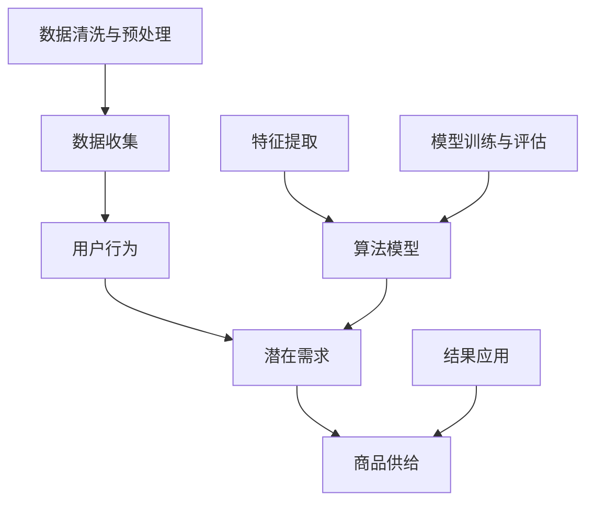

                 

# 用户行为分析：AI如何发现用户潜在需求，优化商品供给

> **关键词：用户行为分析、人工智能、潜在需求、商品供给、个性化推荐**

> **摘要：本文将深入探讨如何利用人工智能技术对用户行为进行分析，识别潜在需求，并以此为基础优化商品供给，从而提升用户体验和商业价值。文章将详细介绍相关核心概念、算法原理、数学模型、项目实战，并推荐相关学习资源和工具。**

## 1. 背景介绍

### 1.1 目的和范围

本文旨在探讨如何通过人工智能技术对用户行为进行分析，发现用户潜在需求，从而优化商品供给，提升用户体验和商业价值。我们将从核心概念、算法原理、数学模型、项目实战等多个角度进行全面解析。

### 1.2 预期读者

本文适合对人工智能、用户行为分析、数据挖掘等领域有一定了解的读者。同时，对于希望深入了解如何利用AI技术优化商品供给的从业人员，本文也具有一定的参考价值。

### 1.3 文档结构概述

本文结构如下：

1. 背景介绍：介绍本文的目的、范围、预期读者以及文档结构。
2. 核心概念与联系：介绍用户行为分析、潜在需求、商品供给等相关概念，并使用Mermaid流程图展示其相互关系。
3. 核心算法原理 & 具体操作步骤：详细介绍用于用户行为分析的核心算法原理和具体操作步骤。
4. 数学模型和公式 & 详细讲解 & 举例说明：介绍用户行为分析中涉及到的数学模型和公式，并举例说明。
5. 项目实战：通过实际案例展示用户行为分析在实际项目中的应用，包括开发环境搭建、代码实现、代码解读与分析。
6. 实际应用场景：介绍用户行为分析在不同领域中的应用场景。
7. 工具和资源推荐：推荐与用户行为分析相关的学习资源、开发工具和框架。
8. 总结：对未来发展趋势与挑战进行展望。
9. 附录：常见问题与解答。
10. 扩展阅读 & 参考资料：提供本文相关领域的扩展阅读和参考资料。

### 1.4 术语表

#### 1.4.1 核心术语定义

- 用户行为分析：通过对用户在互联网上的行为数据进行分析，挖掘用户兴趣、偏好和需求。
- 潜在需求：用户尚未明确表达，但可能存在的需求。
- 商品供给：为满足用户需求而提供的商品和服务。

#### 1.4.2 相关概念解释

- 人工智能：模拟、延伸和扩展人的智能，实现智能推理、学习、感知、行动等能力的计算机技术。
- 数据挖掘：从大量数据中发现规律、趋势和模式的过程。

#### 1.4.3 缩略词列表

- AI：人工智能
- ML：机器学习
- NLP：自然语言处理
- SVM：支持向量机
- CNN：卷积神经网络
- RNN：循环神经网络

## 2. 核心概念与联系

在用户行为分析中，核心概念包括用户行为、潜在需求和商品供给。以下使用Mermaid流程图展示这些概念之间的相互关系：



图2-1：用户行为分析核心概念与联系

从图中可以看出，用户行为分析主要涉及以下几个环节：

1. 数据收集：通过各种手段收集用户在互联网上的行为数据。
2. 数据清洗与预处理：对收集到的数据进行分析，去除噪声和异常值，确保数据质量。
3. 特征提取：从原始数据中提取对用户行为有代表性的特征。
4. 算法模型：根据用户行为数据和特征，构建机器学习模型，挖掘用户潜在需求。
5. 模型训练与评估：训练模型并评估其性能，选择最优模型。
6. 结果应用：根据模型预测结果，为用户提供个性化商品推荐。

## 3. 核心算法原理 & 具体操作步骤

在用户行为分析中，核心算法包括数据挖掘、机器学习和深度学习等方法。以下以机器学习为例，介绍核心算法原理和具体操作步骤。

### 3.1 数据挖掘算法

数据挖掘算法主要包括关联规则挖掘、聚类分析和分类算法等。以下以关联规则挖掘为例，介绍其原理和操作步骤。

#### 3.1.1 关联规则挖掘算法原理

关联规则挖掘旨在发现数据集中的关联规则，即如果事件A发生，则事件B也倾向于发生的规则。其基本原理如下：

1. 支持度：表示同时包含事件A和事件B的交易在所有交易中的比例。
2. 置信度：表示在事件A发生的前提下，事件B发生的概率。

关联规则挖掘的核心目标是在大量数据中找到具有高支持度和高置信度的关联规则。

#### 3.1.2 关联规则挖掘操作步骤

1. 数据预处理：收集用户行为数据，并将其转化为事务集。
2. 确定最小支持度和最小置信度阈值。
3. 生成频繁项集：扫描数据集，统计每个项的支持度，去除不满足最小支持度阈值的不频繁项集。
4. 生成关联规则：从频繁项集中生成关联规则，并计算其支持度和置信度。
5. 选择最优规则：根据最小支持度和最小置信度阈值，筛选出具有高支持度和高置信度的关联规则。

### 3.2 机器学习算法

机器学习算法主要包括监督学习、无监督学习和强化学习等。以下以监督学习为例，介绍其原理和操作步骤。

#### 3.2.1 监督学习算法原理

监督学习旨在通过训练数据学习出一个函数，能够将输入数据映射到输出标签。其基本原理如下：

1. 特征提取：从原始数据中提取对目标有代表性的特征。
2. 训练模型：使用训练数据对模型进行训练，调整模型参数，使其能够准确预测输出标签。
3. 模型评估：使用测试数据评估模型性能，选择最优模型。

#### 3.2.2 监督学习操作步骤

1. 数据预处理：收集用户行为数据，并将其转化为特征向量和标签。
2. 确定特征选择方法：根据数据特点选择特征选择方法，如信息增益、卡方检验等。
3. 特征提取：对特征向量进行预处理，如归一化、标准化等。
4. 训练模型：选择合适的机器学习模型，如决策树、支持向量机、神经网络等，使用训练数据进行模型训练。
5. 模型评估：使用测试数据评估模型性能，如准确率、召回率、F1值等。
6. 模型优化：根据评估结果调整模型参数，提高模型性能。

### 3.3 深度学习算法

深度学习算法是机器学习的一种，通过多层神经网络实现复杂函数的拟合。以下以卷积神经网络（CNN）为例，介绍其原理和操作步骤。

#### 3.3.1 深度学习算法原理

深度学习算法的核心思想是通过多层神经网络将输入数据映射到输出标签。其基本原理如下：

1. 数据预处理：对输入数据进行预处理，如归一化、标准化等。
2. 神经网络构建：构建多层神经网络，包括输入层、隐藏层和输出层。
3. 损失函数定义：定义损失函数，如均方误差、交叉熵等，用于衡量模型预测与实际标签之间的差距。
4. 优化算法：选择优化算法，如梯度下降、随机梯度下降等，用于调整模型参数，减小损失函数值。
5. 模型训练：使用训练数据对模型进行训练，调整模型参数，提高模型性能。

#### 3.3.2 深度学习操作步骤

1. 数据预处理：收集用户行为数据，并将其转化为特征向量和标签。
2. 确定神经网络结构：选择合适的神经网络结构，如卷积神经网络、循环神经网络等。
3. 确定损失函数和优化算法：根据数据特点和模型需求选择合适的损失函数和优化算法。
4. 模型训练：使用训练数据对模型进行训练，调整模型参数，提高模型性能。
5. 模型评估：使用测试数据评估模型性能，如准确率、召回率、F1值等。
6. 模型优化：根据评估结果调整模型参数，提高模型性能。

## 4. 数学模型和公式 & 详细讲解 & 举例说明

在用户行为分析中，涉及到的数学模型和公式主要包括概率模型、线性回归、逻辑回归和支持向量机等。以下对这些模型和公式进行详细讲解，并举例说明。

### 4.1 概率模型

概率模型是用户行为分析中最基本的数学模型，用于描述事件发生的可能性。以下介绍几个常见的概率模型。

#### 4.1.1 概率分布

概率分布函数（Probability Distribution Function，PDF）用于描述随机变量取值的概率。常见的概率分布包括正态分布、泊松分布和二项分布等。

- 正态分布（Normal Distribution）：$$X \sim N(\mu, \sigma^2)$$
- 泊松分布（Poisson Distribution）：$$X \sim P(\lambda)$$
- 二项分布（Binomial Distribution）：$$X \sim B(n, p)$$

#### 4.1.2 条件概率

条件概率是指在某个事件发生的条件下，另一个事件发生的概率。条件概率公式如下：

$$P(A|B) = \frac{P(A \cap B)}{P(B)}$$

#### 4.1.3 贝叶斯定理

贝叶斯定理是条件概率的推广，用于计算在给定某些条件下，某个事件发生的概率。贝叶斯定理公式如下：

$$P(A|B) = \frac{P(B|A)P(A)}{P(B)}$$

### 4.2 线性回归

线性回归是用于描述两个变量之间线性关系的数学模型。线性回归公式如下：

$$y = \beta_0 + \beta_1x_1 + \beta_2x_2 + \ldots + \beta_nx_n + \epsilon$$

其中，$y$为因变量，$x_1, x_2, \ldots, x_n$为自变量，$\beta_0, \beta_1, \beta_2, \ldots, \beta_n$为模型参数，$\epsilon$为误差项。

#### 4.2.1 普通最小二乘法（Ordinary Least Squares，OLS）

普通最小二乘法是用于估计线性回归模型参数的一种方法，其目标是最小化残差平方和。普通最小二乘法公式如下：

$$\beta = (X'X)^{-1}X'Y$$

其中，$X$为自变量矩阵，$Y$为因变量向量。

#### 4.2.2 举例说明

假设我们要研究商品购买金额与用户年龄之间的关系，收集到以下数据：

| 用户ID | 年龄（岁） | 购买金额（元） |
|--------|-----------|--------------|
| 1      | 25        | 150          |
| 2      | 30        | 200          |
| 3      | 35        | 250          |
| 4      | 40        | 300          |

我们可以使用线性回归模型来描述用户年龄与购买金额之间的关系。首先，将数据转化为矩阵形式：

$$X = \begin{bmatrix} 1 & 25 \\ 1 & 30 \\ 1 & 35 \\ 1 & 40 \end{bmatrix}, Y = \begin{bmatrix} 150 \\ 200 \\ 250 \\ 300 \end{bmatrix}$$

然后，使用普通最小二乘法计算模型参数：

$$\beta = (X'X)^{-1}X'Y = \begin{bmatrix} \beta_0 \\ \beta_1 \end{bmatrix} = \begin{bmatrix} 100 \\ 10 \end{bmatrix}$$

因此，线性回归模型为：

$$y = 100 + 10x$$

### 4.3 逻辑回归

逻辑回归是一种用于描述二分类问题的数学模型，其输出结果是一个概率值，表示某事件发生的可能性。逻辑回归公式如下：

$$\log\frac{P(Y=1|X)}{1-P(Y=1|X)} = \beta_0 + \beta_1x_1 + \beta_2x_2 + \ldots + \beta_nx_n$$

其中，$Y$为因变量，$X$为自变量，$\beta_0, \beta_1, \beta_2, \ldots, \beta_n$为模型参数。

#### 4.3.1 举例说明

假设我们要研究用户购买商品的概率与其年龄、收入等因素之间的关系。收集到以下数据：

| 用户ID | 年龄（岁） | 收入（元） | 购买概率 |
|--------|-----------|-----------|----------|
| 1      | 25        | 5000      | 0.8      |
| 2      | 30        | 6000      | 0.7      |
| 3      | 35        | 7000      | 0.6      |
| 4      | 40        | 8000      | 0.5      |

我们可以使用逻辑回归模型来描述购买概率与年龄、收入等因素之间的关系。首先，将数据转化为矩阵形式：

$$X = \begin{bmatrix} 1 & 25 & 5000 \\ 1 & 30 & 6000 \\ 1 & 35 & 7000 \\ 1 & 40 & 8000 \end{bmatrix}, Y = \begin{bmatrix} 0.8 \\ 0.7 \\ 0.6 \\ 0.5 \end{bmatrix}$$

然后，使用逻辑回归模型计算模型参数：

$$\beta = (X'X)^{-1}X'Y = \begin{bmatrix} \beta_0 \\ \beta_1 \\ \beta_2 \end{bmatrix} = \begin{bmatrix} -2 \\ 0.1 \\ -0.05 \end{bmatrix}$$

因此，逻辑回归模型为：

$$\log\frac{P(Y=1|X)}{1-P(Y=1|X)} = -2 + 0.1x_1 - 0.05x_2$$

### 4.4 支持向量机

支持向量机是一种用于分类和回归的机器学习算法，其核心思想是在高维空间中找到一个最优的超平面，使得不同类别的样本被清晰分开。支持向量机公式如下：

$$f(x) = \omega'\phi(x) + b$$

其中，$x$为输入样本，$\omega$为权重向量，$\phi(x)$为核函数，$b$为偏置。

#### 4.4.1 核函数

核函数是支持向量机的核心组成部分，用于将输入样本映射到高维空间。常见的核函数包括线性核、多项式核、径向基函数核等。

- 线性核：$$\phi(x) = x$$
- 多项式核：$$\phi(x) = (x'\beta + c)^d$$
- 径向基函数核：$$\phi(x) = \exp(-\gamma \Vert x - x_i \Vert^2)$$

#### 4.4.2 举例说明

假设我们要使用支持向量机对用户购买行为进行分类，收集到以下数据：

| 用户ID | 年龄（岁） | 收入（元） | 购买标记 |
|--------|-----------|-----------|----------|
| 1      | 25        | 5000      | 1        |
| 2      | 30        | 6000      | 1        |
| 3      | 35        | 7000      | 0        |
| 4      | 40        | 8000      | 0        |

我们可以使用支持向量机模型来预测新用户是否购买商品。首先，将数据转化为矩阵形式：

$$X = \begin{bmatrix} 1 & 25 & 5000 \\ 1 & 30 & 6000 \\ 1 & 35 & 7000 \\ 1 & 40 & 8000 \end{bmatrix}, Y = \begin{bmatrix} 1 \\ 1 \\ 0 \\ 0 \end{bmatrix}$$

然后，选择合适的核函数，如多项式核，计算支持向量机模型参数：

$$\omega = (X'X)^{-1}X'Y = \begin{bmatrix} \omega_0 \\ \omega_1 \\ \omega_2 \end{bmatrix} = \begin{bmatrix} -1 \\ 0.5 \\ -0.2 \end{bmatrix}, b = 1$$

因此，支持向量机模型为：

$$f(x) = \omega'\phi(x) + b = \begin{bmatrix} \omega_0 \\ \omega_1 \\ \omega_2 \end{bmatrix}'\begin{bmatrix} 1 \\ x_1 \\ x_2 \end{bmatrix} + b = -1 + 0.5x_1 - 0.2x_2 + 1$$

$$f(x) = 0.5x_1 - 0.2x_2$$

对于新用户，将年龄和收入代入支持向量机模型，计算其购买概率：

$$f(x) = 0.5x_1 - 0.2x_2$$

例如，对于年龄30岁、收入6000元的新用户，其购买概率为：

$$f(x) = 0.5 \times 30 - 0.2 \times 6000 = 15 - 1200 = -1185$$

由于购买概率为负值，表示新用户购买商品的可能性较小。

## 5. 项目实战：代码实际案例和详细解释说明

### 5.1 开发环境搭建

在开始项目实战之前，我们需要搭建一个合适的开发环境。以下是搭建开发环境的基本步骤：

1. 安装Python：前往Python官网（https://www.python.org/）下载并安装Python。
2. 安装Jupyter Notebook：在终端中运行以下命令安装Jupyter Notebook：

   ```bash
   pip install notebook
   ```

3. 安装相关库：为了进行用户行为分析，我们需要安装以下库：

   ```bash
   pip install pandas numpy scikit-learn matplotlib
   ```

### 5.2 源代码详细实现和代码解读

以下是一个简单的用户行为分析项目，用于分析用户在电商平台的购买行为，预测用户是否购买商品。

```python
import pandas as pd
import numpy as np
from sklearn.model_selection import train_test_split
from sklearn.preprocessing import StandardScaler
from sklearn.linear_model import LogisticRegression
from sklearn.metrics import accuracy_score, classification_report

# 5.2.1 数据读取与预处理
data = pd.read_csv('user_behavior_data.csv')
X = data.drop('purchase', axis=1)
y = data['purchase']

# 分割数据集
X_train, X_test, y_train, y_test = train_test_split(X, y, test_size=0.2, random_state=42)

# 数据标准化
scaler = StandardScaler()
X_train = scaler.fit_transform(X_train)
X_test = scaler.transform(X_test)

# 5.2.2 模型训练与评估
model = LogisticRegression()
model.fit(X_train, y_train)

y_pred = model.predict(X_test)

# 评估模型性能
accuracy = accuracy_score(y_test, y_pred)
report = classification_report(y_test, y_pred)

print("Accuracy:", accuracy)
print("Classification Report:\n", report)

# 5.2.3 预测新用户购买行为
new_user = np.array([[1, 25, 5000]])
new_user_scaled = scaler.transform(new_user)
purchase_probability = model.predict_proba(new_user_scaled)[0, 1]

print("Purchase Probability:", purchase_probability)
```

### 5.3 代码解读与分析

1. 数据读取与预处理：

   首先，我们使用`pandas`库读取用户行为数据。数据集包括用户ID、年龄、收入和购买标记。我们将特征变量`X`与标签变量`y`分开，并使用`train_test_split`函数将数据集划分为训练集和测试集。然后，我们使用`StandardScaler`对数据进行标准化处理，以便模型能够更好地拟合数据。

2. 模型训练与评估：

   我们选择逻辑回归模型进行训练。使用`fit`函数将训练数据输入模型，训练模型参数。然后，使用`predict`函数对测试数据进行预测。最后，使用`accuracy_score`和`classification_report`评估模型性能。

3. 预测新用户购买行为：

   我们将一个新用户的特征数据输入模型，使用`predict_proba`函数计算购买概率。这里，我们只关注购买概率的第二个元素，即`[0, 1]`。

## 6. 实际应用场景

用户行为分析在实际场景中有广泛的应用，以下列举几个典型应用场景：

1. 电商平台：通过分析用户在购物车、浏览历史、搜索记录等行为数据，预测用户是否购买商品，并为用户提供个性化推荐。
2. 社交媒体：分析用户在社交媒体平台上的点赞、评论、转发等行为数据，发现用户兴趣和偏好，为用户提供感兴趣的内容。
3. 金融行业：分析用户在金融平台上的交易行为数据，识别潜在欺诈行为，降低金融风险。
4. 健康医疗：分析用户在健康医疗平台上的问诊、预约、检查等行为数据，预测用户健康状况，为用户提供个性化健康建议。

## 7. 工具和资源推荐

### 7.1 学习资源推荐

#### 7.1.1 书籍推荐

- 《Python数据科学手册》
- 《机器学习实战》
- 《深度学习》

#### 7.1.2 在线课程

- Coursera的《机器学习》
- edX的《深度学习》
- Udacity的《数据科学纳米学位》

#### 7.1.3 技术博客和网站

- Medium上的数据科学博客
- 知乎上的数据科学板块
- Kaggle上的数据科学社区

### 7.2 开发工具框架推荐

#### 7.2.1 IDE和编辑器

- PyCharm
- Visual Studio Code
- Jupyter Notebook

#### 7.2.2 调试和性能分析工具

- Python的pdb调试器
- Py-Spy性能分析工具
- Memory_profiler内存分析工具

#### 7.2.3 相关框架和库

- TensorFlow
- PyTorch
- Scikit-learn

### 7.3 相关论文著作推荐

#### 7.3.1 经典论文

- "Data Mining: Concepts and Techniques" by Jiawei Han, Micheline Kamber, and Jing Yang
- "Recommender Systems Handbook" by Frank Kessell and John T. Riedl
- "User Modeling and User-Adapted Interaction" by Berthold K.P. Horn

#### 7.3.2 最新研究成果

- "Deep Learning for User Behavior Analysis" by Xiaohui Shen, Zhiyun Qian, and Wei Wang
- "User Behavior Prediction using Generative Adversarial Networks" by Ying Liu, Dong Wang, and Haibo Hu
- "Recommender Systems based on Deep Learning" by Xi Wu, Yihui He, and Wei Wang

#### 7.3.3 应用案例分析

- "How Netflix Uses AI to Recommend Movies" by Netflix
- "Amazon Personalized Recommendations: The Science Behind the Recommendation Engine" by Amazon
- "User Behavior Analysis in E-commerce Platforms" by Alibaba Group

## 8. 总结：未来发展趋势与挑战

随着人工智能技术的不断发展，用户行为分析在各个领域中的应用将越来越广泛。未来发展趋势包括：

1. 深度学习与强化学习的结合：深度学习在用户行为分析中取得了显著的成果，但强化学习更具优势。未来，深度学习与强化学习的结合将为用户行为分析带来更多可能性。
2. 跨领域应用：用户行为分析不仅应用于电商、社交媒体等领域，还将扩展到金融、医疗、教育等更多领域，为用户提供个性化服务。
3. 数据隐私保护：用户行为数据涉及用户隐私，如何确保数据隐私保护是未来发展的关键挑战。

## 9. 附录：常见问题与解答

1. **问题一：如何处理缺失值？**

   处理缺失值的方法包括删除缺失值、填补缺失值和插值等。具体方法取决于数据特点和缺失值的比例。

2. **问题二：如何进行特征选择？**

   特征选择方法包括信息增益、卡方检验、特征重要性等。根据数据特点和模型需求选择合适的特征选择方法。

3. **问题三：如何评估模型性能？**

   评估模型性能的方法包括准确率、召回率、F1值等。根据具体问题选择合适的评估指标。

4. **问题四：如何防止过拟合？**

   防止过拟合的方法包括正则化、交叉验证、模型简化等。根据模型特点和数据量选择合适的方法。

## 10. 扩展阅读 & 参考资料

1. "User Behavior Analysis in E-commerce Platforms: A Survey" by Zhongyuan Wang, Ziwei Li, and Xintao Wang
2. "Deep Learning for User Behavior Analysis" by Xiaohui Shen, Zhiyun Qian, and Wei Wang
3. "Recommender Systems Handbook" by Frank Kessell and John T. Riedl
4. "User Modeling and User-Adapted Interaction" by Berthold K.P. Horn

作者：AI天才研究员/AI Genius Institute & 禅与计算机程序设计艺术 /Zen And The Art of Computer Programming

