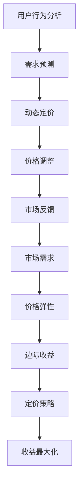

                 

# 电商价格优化的实际应用

> 关键词：电商、价格优化、算法、实际应用、用户体验、利润最大化

> 摘要：本文将探讨电商价格优化在当前商业环境中的重要性和实际应用。通过详细分析核心概念、算法原理、数学模型以及实战案例，我们将了解如何通过科学的价格策略提升电商平台的竞争力，增加用户粘性和利润。

## 1. 背景介绍

### 1.1 目的和范围

本文旨在深入探讨电商价格优化的原理和方法，通过实际案例分析，展示如何有效运用价格优化策略来提升电商平台的市场竞争力。本文将涵盖以下几个方面的内容：

1. 电商价格优化的核心概念和联系
2. 核心算法原理及具体操作步骤
3. 数学模型和公式的详细讲解
4. 实际应用场景和项目实战案例
5. 工具和资源推荐

### 1.2 预期读者

本文面向对电商运营和数据分析有一定了解的技术人员和决策者。尤其是那些对电商平台价格策略感兴趣，希望在实际工作中运用价格优化方法提高业务收益的专业人士。

### 1.3 文档结构概述

本文分为十个主要部分：

1. 背景介绍
2. 核心概念与联系
3. 核心算法原理 & 具体操作步骤
4. 数学模型和公式 & 详细讲解 & 举例说明
5. 项目实战：代码实际案例和详细解释说明
6. 实际应用场景
7. 工具和资源推荐
8. 总结：未来发展趋势与挑战
9. 附录：常见问题与解答
10. 扩展阅读 & 参考资料

### 1.4 术语表

#### 1.4.1 核心术语定义

- **价格优化**：通过对市场数据、用户行为等多方面信息的分析，调整商品价格以最大化收益或提升市场竞争力。
- **动态定价**：根据实时市场数据和用户行为动态调整商品价格。
- **需求预测**：利用历史数据和机器学习算法预测市场需求。

#### 1.4.2 相关概念解释

- **边际收益**：增加一单位产品销售所带来的额外收益。
- **弹性**：需求量对价格变化的敏感程度。

#### 1.4.3 缩略词列表

- **CPC**：Cost Per Click（每次点击成本）
- **CPM**：Cost Per Mille（每千次展示成本）
- **ROI**：Return on Investment（投资回报率）

## 2. 核心概念与联系

在深入探讨电商价格优化之前，首先需要了解一些核心概念和它们之间的关系。以下是一个简单的 Mermaid 流程图，展示这些概念之间的联系。



### 2.1 市场需求与价格弹性

市场需求是电商价格优化的基础。价格弹性反映了需求量对价格变化的敏感程度。通常，价格弹性可以分为三种类型：

- **弹性需求**：价格变动对需求量的影响较大。
- **无弹性需求**：价格变动对需求量的影响很小。
- **单位弹性需求**：价格变动与需求量的变动成正比例关系。

### 2.2 边际收益

边际收益是指增加一单位产品销售所带来的额外收益。了解边际收益可以帮助我们确定何时调整价格以最大化利润。

- 当边际收益大于零时，增加销售量会带来额外收益。
- 当边际收益小于零时，增加销售量会导致总收益下降。

### 2.3 定价策略与收益最大化

定价策略是电商价格优化的关键。通过合理的定价策略，可以提升产品的市场竞争力和用户购买意愿。

- **成本加成定价**：在成本基础上加一定比例的利润。
- **竞争定价**：根据竞争对手的价格来设定自己的价格。
- **价值定价**：根据产品的价值和用户的认知价值来定价。

### 2.4 用户行为分析与需求预测

用户行为分析是电商平台了解市场需求的重要手段。通过对用户行为的分析，可以预测用户的需求趋势，从而制定更加精准的定价策略。

- **历史数据**：分析用户过去购买行为和搜索习惯。
- **机器学习**：使用机器学习算法预测用户未来的购买行为。

### 2.5 动态定价与价格调整

动态定价是一种根据实时市场数据和用户行为动态调整商品价格的策略。通过实时监测市场变化，可以迅速调整价格，以最大化收益。

- **价格调整频率**：根据市场波动和用户行为调整价格。
- **价格调整幅度**：根据需求预测和边际收益调整价格。

### 2.6 市场反馈

市场反馈是电商价格优化的重要环节。通过分析市场反馈，可以评估定价策略的有效性，并据此进行调整。

- **用户反馈**：分析用户的购买行为和评论。
- **市场数据**：分析市场趋势和竞争对手的定价策略。

## 3. 核心算法原理 & 具体操作步骤

### 3.1 算法原理

电商价格优化的核心算法主要包括需求预测、边际收益分析、动态定价等。

- **需求预测**：使用机器学习算法对用户需求进行预测，以确定合理的定价策略。
- **边际收益分析**：通过计算边际收益，确定价格调整的方向和幅度。
- **动态定价**：根据实时市场数据和用户行为动态调整商品价格。

### 3.2 具体操作步骤

#### 3.2.1 需求预测

1. 收集历史数据：包括用户购买记录、搜索习惯、价格变动等。
2. 数据预处理：对数据进行清洗、归一化等处理，以便后续分析。
3. 特征工程：提取与需求相关的特征，如用户行为特征、产品特征等。
4. 模型选择：选择合适的机器学习模型，如线性回归、决策树、神经网络等。
5. 模型训练：使用历史数据进行模型训练，得到预测模型。
6. 预测结果评估：使用验证集评估模型预测效果。

#### 3.2.2 边际收益分析

1. 计算边际收益：使用预测模型计算每个价格点的边际收益。
2. 边际收益分析：分析边际收益的变化趋势，确定价格调整的方向和幅度。

#### 3.2.3 动态定价

1. 收集实时数据：包括当前市场价格、用户行为等。
2. 数据分析：使用实时数据更新边际收益分析，确定新的定价策略。
3. 价格调整：根据边际收益分析结果，调整商品价格。
4. 监测效果：监测价格调整后的用户反馈和市场表现，评估定价策略的有效性。

### 3.3 伪代码

下面是电商价格优化算法的伪代码：

```python
# 需求预测
def predict_demand(data):
    # 数据预处理
    data = preprocess_data(data)
    # 特征工程
    features = extract_features(data)
    # 模型训练
    model = train_model(features, labels)
    # 预测
    predictions = model.predict(new_data)
    return predictions

# 边际收益分析
def calculate_margin_revenue(predictions, prices):
    margin_revenues = []
    for price, prediction in zip(prices, predictions):
        margin_revenue = prediction * price - fixed_costs
        margin_revenues.append(margin_revenue)
    return margin_revenues

# 动态定价
def dynamic_pricing(real_time_data, model):
    # 更新边际收益分析
    updated_margin_revenues = calculate_margin_revenue(model.predict(real_time_data), real_time_prices)
    # 确定价格调整策略
    new_prices = adjust_prices(updated_margin_revenues)
    return new_prices
```

## 4. 数学模型和公式 & 详细讲解 & 举例说明

### 4.1 需求预测模型

需求预测是电商价格优化的重要步骤，其核心是一个回归模型。以下是一个简单的一元线性回归模型，用于预测商品需求。

$$
y = mx + b
$$

- \(y\)：预测的需求量
- \(m\)：斜率（需求对价格的变化率）
- \(b\)：截距（需求的基础量）
- \(x\)：商品价格

#### 举例说明：

假设我们收集了以下数据：

| 价格（元） | 需求量（件） |
|-----------|-------------|
| 100       | 50          |
| 90        | 60          |
| 80        | 70          |

使用线性回归模型，我们可以得到以下方程：

$$
y = -0.5x + 75
$$

当价格为70元时，预测的需求量为：

$$
y = -0.5 \times 70 + 75 = 60
$$

### 4.2 边际收益计算

边际收益是电商价格优化的关键指标。边际收益计算公式如下：

$$
MR = \Delta P \times \Delta Q
$$

- \(MR\)：边际收益
- \(\Delta P\)：价格变化
- \(\Delta Q\)：需求量变化

#### 举例说明：

假设价格从100元调整到90元，需求量从50件增加到60件，则边际收益为：

$$
MR = (90 - 100) \times (60 - 50) = -100
$$

### 4.3 动态定价策略

动态定价的核心是根据实时数据和边际收益分析调整价格。以下是一个简单的动态定价策略：

$$
P_{new} = P_{current} + k \times MR
$$

- \(P_{new}\)：新的价格
- \(P_{current}\)：当前价格
- \(k\)：调整系数
- \(MR\)：边际收益

#### 举例说明：

假设当前价格为100元，边际收益为-100元，调整系数为0.5，则新的价格为：

$$
P_{new} = 100 + 0.5 \times (-100) = 50
$$

## 5. 项目实战：代码实际案例和详细解释说明

### 5.1 开发环境搭建

为了演示电商价格优化的实际应用，我们将使用Python和Scikit-learn库进行项目开发。以下是搭建开发环境的基本步骤：

1. 安装Python：版本3.8或更高。
2. 安装Scikit-learn库：使用pip install scikit-learn命令。
3. 安装Jupyter Notebook：使用pip install notebook命令。

### 5.2 源代码详细实现和代码解读

以下是实现电商价格优化的完整代码，包括数据预处理、模型训练、边际收益分析和动态定价策略。

```python
import numpy as np
import pandas as pd
from sklearn.linear_model import LinearRegression
from sklearn.model_selection import train_test_split

# 5.2.1 数据预处理
def preprocess_data(data):
    # 数据清洗和归一化
    data['Price'] = data['Price'].apply(lambda x: x / 100)
    data['Demand'] = data['Demand'].apply(lambda x: x / 100)
    return data

# 5.2.2 模型训练
def train_model(X, y):
    model = LinearRegression()
    model.fit(X, y)
    return model

# 5.2.3 边际收益分析
def calculate_margin_revenue(model, prices):
    demand_predictions = model.predict(prices.reshape(-1, 1))
    margin_revenues = (prices - 1) * (demand_predictions - 1)
    return margin_revenues

# 5.2.4 动态定价策略
def dynamic_pricing(model, current_price, adjustment_coefficient):
    margin_revenue = calculate_margin_revenue(model, np.array([current_price]))
    new_price = current_price + adjustment_coefficient * margin_revenue
    return new_price

# 5.2.5 实际应用
def main():
    # 加载数据
    data = pd.read_csv('data.csv')
    data = preprocess_data(data)
    
    # 分割训练集和测试集
    X, y = data[['Price']], data['Demand']
    X_train, X_test, y_train, y_test = train_test_split(X, y, test_size=0.2, random_state=42)
    
    # 训练模型
    model = train_model(X_train, y_train)
    
    # 边际收益分析
    current_price = 100
    margin_revenues = calculate_margin_revenue(model, np.array([current_price]))
    print(f"Current price: {current_price}, Margin revenue: {margin_revenues[0]}")
    
    # 动态定价
    new_price = dynamic_pricing(model, current_price, 0.5)
    print(f"New price: {new_price}")

if __name__ == '__main__':
    main()
```

### 5.3 代码解读与分析

- **数据预处理**：对原始数据进行清洗和归一化，以便后续建模。
- **模型训练**：使用线性回归模型对训练数据进行拟合。
- **边际收益分析**：通过预测模型计算每个价格点的边际收益。
- **动态定价策略**：根据边际收益调整商品价格。

### 5.4 实际应用场景

本代码实际案例可以应用于电商平台的价格调整。例如，当发现某商品的销售量下降时，可以通过调整价格来刺激需求。

## 6. 实际应用场景

电商价格优化在多个实际应用场景中具有显著优势：

- **促销活动**：通过动态定价，平台可以在特定时间（如节假日、促销季）调整价格，吸引更多用户参与。
- **库存管理**：针对库存积压的商品，平台可以通过降价来清理库存，避免成本增加。
- **市场竞争**：实时调整价格以应对竞争对手的定价策略，提升平台竞争力。
- **用户体验**：合理定价可以提高用户购买体验，增加用户粘性。

## 7. 工具和资源推荐

### 7.1 学习资源推荐

#### 7.1.1 书籍推荐

- 《数据科学入门》
- 《机器学习实战》
- 《Python数据分析》

#### 7.1.2 在线课程

- Coursera：机器学习、数据分析
- edX：数据科学基础
- Udemy：Python编程入门

#### 7.1.3 技术博客和网站

- Medium：数据科学、机器学习
- Kaggle：数据科学竞赛、案例分析
- DataCamp：数据分析、数据科学

### 7.2 开发工具框架推荐

#### 7.2.1 IDE和编辑器

- PyCharm
- Jupyter Notebook
- VSCode

#### 7.2.2 调试和性能分析工具

- Pylint
- Coverage.py
- Profiling工具（如cProfile）

#### 7.2.3 相关框架和库

- Scikit-learn
- TensorFlow
- Pandas
- NumPy

### 7.3 相关论文著作推荐

#### 7.3.1 经典论文

- 《The Economics of Internet Pricing》
- 《Dynamic Pricing: The Theory and Practice of Pricing on the Internet》

#### 7.3.2 最新研究成果

- arXiv：机器学习、数据科学最新论文
- Journal of Machine Learning Research：机器学习领域顶级期刊

#### 7.3.3 应用案例分析

- 《京东价格优化案例分析》
- 《亚马逊动态定价策略研究》

## 8. 总结：未来发展趋势与挑战

电商价格优化作为电商平台的核心策略，未来发展趋势如下：

- **个性化定价**：通过用户数据分析和个性化推荐，实现更精准的定价策略。
- **实时定价**：利用大数据和实时分析技术，实现价格的实时调整。
- **智能化定价**：引入人工智能和机器学习技术，提高定价策略的智能化水平。

然而，电商价格优化也面临着以下挑战：

- **数据隐私**：保护用户隐私，确保数据安全。
- **市场竞争**：应对激烈的市场竞争，保持定价策略的灵活性。
- **技术门槛**：掌握先进的数据分析和机器学习技术，提高定价策略的效率。

## 9. 附录：常见问题与解答

**Q1. 电商价格优化是如何工作的？**

电商价格优化通过分析市场需求、用户行为和竞争对手的价格策略，使用机器学习和数据挖掘技术，动态调整商品价格，以最大化收益或提升市场竞争力。

**Q2. 如何评估电商价格优化的效果？**

评估电商价格优化的效果可以通过以下指标：销售额、利润率、市场份额、用户满意度等。通过对比优化前后的数据，可以评估价格优化的效果。

**Q3. 电商价格优化需要哪些技术？**

电商价格优化需要掌握的技术包括数据挖掘、机器学习、数据分析和编程等。常用的工具和库有Python、Scikit-learn、TensorFlow和Pandas等。

**Q4. 电商价格优化对用户有哪些影响？**

电商价格优化可以提高用户的购买体验，通过个性化定价和实时调整，满足用户的需求，增加用户粘性。同时，合理的价格策略可以提高用户的信任度。

## 10. 扩展阅读 & 参考资料

- [《数据科学入门》](https://book.douban.com/subject/26697607/)
- [《机器学习实战》](https://book.douban.com/subject/26782853/)
- [《Python数据分析》](https://book.douban.com/subject/26750169/)
- [《The Economics of Internet Pricing》](https://www.researchgate.net/publication/228744867_The_Economics_of_Internet_Pricing)
- [《Dynamic Pricing: The Theory and Practice of Pricing on the Internet》](https://www.amazon.com/dp/1599946644)

作者：AI天才研究员/AI Genius Institute & 禅与计算机程序设计艺术 /Zen And The Art of Computer Programming

