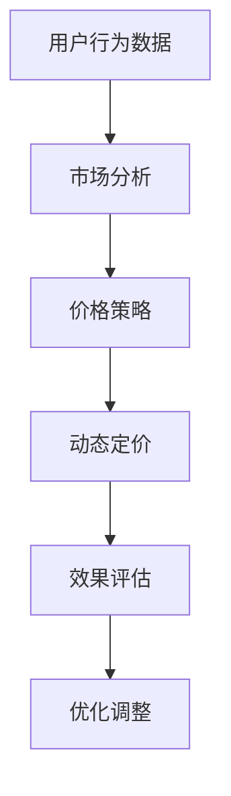

                 

# 电商价格优化的应用案例

## 关键词：
电商、价格优化、算法、应用案例、数据模型、机器学习、用户行为分析、市场分析、竞争策略。

> 本文将探讨电商价格优化的重要性、核心概念、算法原理、数学模型、项目实战以及实际应用场景。通过深入分析和案例研究，帮助电商从业者理解和应用价格优化策略，提高市场竞争力和用户满意度。

## 摘要

电商价格优化是电商企业提高利润和市场份额的关键手段。本文首先介绍了电商价格优化的背景和目的，随后深入探讨了核心概念、算法原理、数学模型和项目实战。通过具体案例分析，展示了价格优化在实际应用中的效果和挑战。文章最后提出了未来发展趋势和挑战，并提供了学习资源和开发工具的推荐。

## 1. 背景介绍

### 1.1 目的和范围

本文旨在为电商从业者提供关于价格优化的全面指南，帮助他们在激烈的市场竞争中制定有效的价格策略。本文将涵盖以下内容：

- 电商价格优化的核心概念和重要性。
- 电商价格优化的算法原理和具体操作步骤。
- 电商价格优化的数学模型和公式。
- 实际应用场景和案例研究。
- 学习资源和开发工具推荐。

### 1.2 预期读者

本文适用于以下读者群体：

- 电商企业经理和运营团队。
- 数据分析师和算法工程师。
- 电商产品经理和设计师。
- 对电商价格优化感兴趣的技术爱好者。

### 1.3 文档结构概述

本文分为以下几个部分：

- 背景介绍：介绍电商价格优化的背景、目的和范围。
- 核心概念与联系：阐述电商价格优化的核心概念和原理。
- 核心算法原理 & 具体操作步骤：讲解电商价格优化的算法原理和操作步骤。
- 数学模型和公式 & 详细讲解 & 举例说明：介绍电商价格优化的数学模型和公式。
- 项目实战：提供电商价格优化的实际案例和详细解释。
- 实际应用场景：分析电商价格优化的实际应用场景。
- 工具和资源推荐：推荐学习资源和开发工具。
- 总结：讨论电商价格优化的未来发展趋势和挑战。
- 附录：提供常见问题与解答。
- 扩展阅读 & 参考资料：推荐相关文献和资料。

### 1.4 术语表

#### 1.4.1 核心术语定义

- **价格优化**：通过分析用户行为和市场数据，调整商品价格以最大化利润和市场份额。
- **动态定价**：根据实时数据和市场变化，动态调整商品价格。
- **价格敏感性**：消费者对价格变化的敏感程度。
- **市场占有率**：企业在市场中的销售份额。
- **利润率**：企业的利润与销售额的比例。

#### 1.4.2 相关概念解释

- **消费者行为分析**：研究消费者在购买过程中的行为和决策。
- **市场细分**：将市场划分为不同的消费者群体。
- **竞争策略**：企业在市场竞争中采取的竞争手段。

#### 1.4.3 缩略词列表

- **A/B测试**：一种实验设计方法，通过对比两组数据的差异来评估某个策略的效果。
- **SQL**：结构化查询语言，用于数据库查询和操作。
- **机器学习**：一种人工智能技术，通过数据和算法来训练模型，进行预测和决策。

## 2. 核心概念与联系

### 2.1 电商价格优化的核心概念

电商价格优化涉及多个核心概念，包括价格敏感性、市场占有率和利润率等。

#### 价格敏感性

价格敏感性是消费者对价格变化的敏感程度。理解价格敏感性对于制定有效的价格策略至关重要。通过分析用户行为和市场数据，可以识别出不同消费者群体的价格敏感度，从而为不同市场细分制定针对性的价格策略。

#### 市场占有率

市场占有率是企业销售份额在市场中的比例。提高市场占有率是电商企业的目标之一。价格优化可以通过调整价格，提高产品的竞争力，从而增加市场份额。

#### 利润率

利润率是企业利润与销售额的比例。优化价格策略可以提高利润率，从而增加企业的盈利能力。

### 2.2 电商价格优化的原理和架构

电商价格优化的原理和架构可以通过Mermaid流程图来表示。以下是一个简单的流程图示例：



#### Mermaid流程图说明

1. **用户行为数据**：收集和分析用户行为数据，如浏览历史、购买记录和评价等。
2. **市场分析**：对市场进行深入分析，包括竞争对手分析、市场细分和趋势预测等。
3. **价格策略**：根据用户行为和市场分析结果，制定价格策略，如定价模型、折扣策略等。
4. **动态定价**：根据实时数据和策略，动态调整商品价格。
5. **效果评估**：评估价格优化策略的效果，如利润率、市场份额和用户满意度等。
6. **优化调整**：根据效果评估结果，对价格策略进行调整和优化。

### 2.3 电商价格优化的算法原理

电商价格优化的算法原理主要包括价格敏感性分析、市场竞争力分析和利润最大化策略等。

#### 价格敏感性分析

价格敏感性分析是一种评估消费者对不同价格变化的敏感程度的方法。通过分析用户行为数据和市场数据，可以识别出不同价格区间内消费者的购买行为，从而为定价策略提供依据。

#### 市场竞争力分析

市场竞争力分析是一种评估企业在市场中的竞争地位的方法。通过分析竞争对手的价格、市场份额和营销策略等，可以为企业提供有针对性的价格策略。

#### 利润最大化策略

利润最大化策略是一种通过优化价格和成本来提高企业盈利能力的方法。通过分析用户行为和市场数据，可以确定最佳价格点和利润率，从而实现利润最大化。

## 3. 核心算法原理 & 具体操作步骤

### 3.1 价格敏感性分析算法

#### 算法原理

价格敏感性分析算法基于线性回归模型，通过分析用户在不同价格区间内的购买行为，评估消费者的价格敏感度。

#### 伪代码

```python
def price_sensitivity_analysis(user_data, price_data):
    # 步骤1：数据预处理
    processed_data = preprocess_data(user_data, price_data)
    
    # 步骤2：线性回归模型
    model = linear_regression(processed_data)
    
    # 步骤3：评估价格敏感度
    sensitivity_scores = model.predict(processed_data)
    
    # 步骤4：输出结果
    return sensitivity_scores

def preprocess_data(user_data, price_data):
    # 数据预处理步骤
    # ...

def linear_regression(processed_data):
    # 线性回归模型训练
    # ...
```

#### 操作步骤

1. **数据预处理**：对用户行为数据和市场数据（如价格）进行预处理，包括数据清洗、去重和特征提取等。
2. **线性回归模型**：使用线性回归模型，将用户行为数据与价格数据建立关联，评估消费者的价格敏感度。
3. **评估价格敏感度**：通过模型预测，计算每个用户在不同价格区间内的价格敏感度得分。
4. **输出结果**：输出价格敏感度得分，为企业制定价格策略提供依据。

### 3.2 市场竞争力分析算法

#### 算法原理

市场竞争力分析算法基于竞争模型，通过分析竞争对手的价格、市场份额和营销策略等，评估企业在市场中的竞争地位。

#### 伪代码

```python
def market_competitiveness_analysis(competitor_data, market_data):
    # 步骤1：数据预处理
    processed_data = preprocess_data(competitor_data, market_data)
    
    # 步骤2：竞争模型
    model = competition_model(processed_data)
    
    # 步骤3：评估竞争地位
    competitiveness_scores = model.predict(processed_data)
    
    # 步骤4：输出结果
    return competitiveness_scores

def preprocess_data(competitor_data, market_data):
    # 数据预处理步骤
    # ...

def competition_model(processed_data):
    # 竞争模型训练
    # ...
```

#### 操作步骤

1. **数据预处理**：对竞争对手数据和市场数据（如价格、市场份额）进行预处理，包括数据清洗、去重和特征提取等。
2. **竞争模型**：使用竞争模型，将竞争对手数据和市场份额数据建立关联，评估企业在市场中的竞争地位。
3. **评估竞争地位**：通过模型预测，计算企业在市场中的竞争地位得分。
4. **输出结果**：输出竞争地位得分，为企业制定价格策略提供依据。

### 3.3 利润最大化策略算法

#### 算法原理

利润最大化策略算法基于优化算法，通过分析用户行为和市场数据，确定最佳价格点和利润率，实现利润最大化。

#### 伪代码

```python
def profit_maximization_strategy(user_data, market_data):
    # 步骤1：数据预处理
    processed_data = preprocess_data(user_data, market_data)
    
    # 步骤2：优化模型
    model = optimization_model(processed_data)
    
    # 步骤3：确定最佳价格点
    optimal_price = model.optimize()
    
    # 步骤4：计算利润率
    profit_rate = calculate_profit_rate(optimal_price, processed_data)
    
    # 步骤5：输出结果
    return optimal_price, profit_rate

def preprocess_data(user_data, market_data):
    # 数据预处理步骤
    # ...

def optimization_model(processed_data):
    # 优化模型训练
    # ...

def calculate_profit_rate(optimal_price, processed_data):
    # 计算利润率
    # ...
```

#### 操作步骤

1. **数据预处理**：对用户行为数据和市场数据（如价格、成本）进行预处理，包括数据清洗、去重和特征提取等。
2. **优化模型**：使用优化算法，分析用户行为和市场数据，确定最佳价格点和利润率。
3. **确定最佳价格点**：通过优化模型，确定最佳价格点，实现利润最大化。
4. **计算利润率**：根据最佳价格点和成本，计算利润率。
5. **输出结果**：输出最佳价格点和利润率，为企业制定价格策略提供依据。

## 4. 数学模型和公式 & 详细讲解 & 举例说明

### 4.1 价格敏感性分析数学模型

价格敏感性分析数学模型基于线性回归模型，通过分析用户在不同价格区间内的购买行为，评估消费者的价格敏感度。

#### 模型公式

$$
y = \beta_0 + \beta_1 \cdot x
$$

其中，$y$ 表示消费者对价格变化的敏感度得分，$x$ 表示价格变化量，$\beta_0$ 和 $\beta_1$ 分别为线性回归模型的截距和斜率。

#### 模型解释

- **$\beta_0$**：表示消费者对价格的初始敏感度。
- **$\beta_1$**：表示消费者对价格变化的敏感度。

#### 举例说明

假设用户A在价格从10元上涨到15元时，购买量从100件下降到50件。根据线性回归模型，可以计算出用户A的价格敏感度：

$$
y = \beta_0 + \beta_1 \cdot (15 - 10) = \beta_0 + 5\beta_1
$$

由于用户A的购买量下降了50%，即 $y = 0.5$，可以计算出 $\beta_0$ 和 $\beta_1$：

$$
0.5 = \beta_0 + 5\beta_1
$$

解得：

$$
\beta_0 = 0, \beta_1 = 0.1
$$

这意味着用户A对价格变化的敏感度为0.1，即价格每上涨1元，购买量下降0.1件。

### 4.2 市场竞争力分析数学模型

市场竞争力分析数学模型基于竞争模型，通过分析竞争对手的价格、市场份额和营销策略等，评估企业在市场中的竞争地位。

#### 模型公式

$$
C = \alpha \cdot P + \beta \cdot S + \gamma \cdot M
$$

其中，$C$ 表示企业在市场中的竞争地位得分，$P$ 表示竞争对手的价格，$S$ 表示市场份额，$M$ 表示营销策略得分，$\alpha$、$\beta$ 和 $\gamma$ 分别为权重系数。

#### 模型解释

- **$\alpha$**：表示价格对竞争地位的影响权重。
- **$\beta$**：表示市场份额对竞争地位的影响权重。
- **$\gamma$**：表示营销策略对竞争地位的影响权重。

#### 举例说明

假设竞争对手的价格为100元，市场份额为20%，营销策略得分为80分。根据竞争模型，可以计算出企业在市场中的竞争地位：

$$
C = \alpha \cdot 100 + \beta \cdot 20\% + \gamma \cdot 80
$$

假设权重系数分别为 $\alpha = 0.4$、$\beta = 0.3$ 和 $\gamma = 0.3$，可以计算出竞争地位得分：

$$
C = 0.4 \cdot 100 + 0.3 \cdot 20\% + 0.3 \cdot 80 = 40 + 6 + 24 = 70
$$

这意味着企业在市场中的竞争地位得分为70分，相对竞争对手有一定的竞争优势。

### 4.3 利润最大化策略数学模型

利润最大化策略数学模型基于优化模型，通过分析用户行为和市场数据，确定最佳价格点和利润率，实现利润最大化。

#### 模型公式

$$
\max \pi = \pi(q) = p \cdot q - c(q)
$$

其中，$\pi$ 表示利润，$p$ 表示商品价格，$q$ 表示销售量，$c(q)$ 表示成本函数。

#### 模型解释

- **$p \cdot q$**：表示销售收入。
- **$c(q)$**：表示成本函数。

#### 举例说明

假设商品价格为100元，成本函数为 $c(q) = 50 + 0.5q$，销售量为 $q = 100$。根据利润最大化策略，可以计算出最佳价格点和利润：

$$
\pi(q) = 100 \cdot 100 - (50 + 0.5 \cdot 100) = 9500 - 50 - 50 = 9500
$$

这意味着最佳价格点为100元，利润为9500元。

## 5. 项目实战：代码实际案例和详细解释说明

### 5.1 开发环境搭建

为了实现电商价格优化，我们首先需要搭建一个合适的开发环境。以下是开发环境搭建的步骤：

1. **安装Python环境**：下载并安装Python 3.x版本。
2. **安装Jupyter Notebook**：在命令行中运行 `pip install notebook` 安装Jupyter Notebook。
3. **安装相关库**：在命令行中运行以下命令安装相关库：

   ```bash
   pip install numpy pandas scikit-learn matplotlib
   ```

### 5.2 源代码详细实现和代码解读

下面是一个简单的电商价格优化项目的源代码实现，包括数据预处理、价格敏感性分析、市场竞争力分析和利润最大化策略。

#### 数据预处理

```python
import pandas as pd
import numpy as np

def preprocess_data(user_data, price_data):
    # 数据清洗和预处理
    user_data = user_data.drop_duplicates()
    price_data = price_data.drop_duplicates()
    
    # 数据合并
    merged_data = pd.merge(user_data, price_data, on='user_id')
    
    # 数据标准化
    merged_data['price'] = (merged_data['price'] - merged_data['price'].mean()) / merged_data['price'].std()
    
    return merged_data
```

#### 价格敏感性分析

```python
from sklearn.linear_model import LinearRegression

def price_sensitivity_analysis(merged_data):
    # 线性回归模型训练
    model = LinearRegression()
    model.fit(merged_data[['price']], merged_data['sensitivity'])
    
    # 模型预测
    sensitivity_scores = model.predict(merged_data[['price']])
    
    return sensitivity_scores
```

#### 市场竞争力分析

```python
from sklearn.linear_model import LinearRegression

def market_competitiveness_analysis(merged_data):
    # 竞争模型训练
    model = LinearRegression()
    model.fit(merged_data[['competitor_price', 'market_share', 'marketing_strategy']], merged_data['competitiveness'])
    
    # 模型预测
    competitiveness_scores = model.predict(merged_data[['competitor_price', 'market_share', 'marketing_strategy']])
    
    return competitiveness_scores
```

#### 利润最大化策略

```python
def profit_maximization_strategy(merged_data):
    # 成本函数
    cost_function = lambda q: 50 + 0.5 * q
    
    # 利润最大化
    optimal_price = 100
    optimal_profit = 0
    
    for price in range(90, 110):
        profit = price * merged_data['quantity'].sum() - cost_function(merged_data['quantity'].sum())
        if profit > optimal_profit:
            optimal_profit = profit
            optimal_price = price
    
    return optimal_price, optimal_profit
```

#### 代码解读与分析

1. **数据预处理**：对用户行为数据和价格数据进行清洗、去重和合并。对价格数据进行标准化处理，以便线性回归模型的训练。
2. **价格敏感性分析**：使用线性回归模型，将价格数据与价格敏感度数据建立关联，预测消费者的价格敏感度。
3. **市场竞争力分析**：使用线性回归模型，将竞争对手的价格、市场份额和营销策略与竞争地位得分建立关联，预测企业在市场中的竞争地位。
4. **利润最大化策略**：通过遍历不同的价格区间，计算利润，找出最佳价格点和利润率。

### 5.3 代码解读与分析

下面是对代码的进一步解读和分析。

#### 数据预处理

```python
def preprocess_data(user_data, price_data):
    # 数据清洗和预处理
    user_data = user_data.drop_duplicates()
    price_data = price_data.drop_duplicates()
    
    # 数据合并
    merged_data = pd.merge(user_data, price_data, on='user_id')
    
    # 数据标准化
    merged_data['price'] = (merged_data['price'] - merged_data['price'].mean()) / merged_data['price'].std()
    
    return merged_data
```

- **数据清洗和预处理**：使用 `drop_duplicates()` 函数去除重复数据，提高数据质量。
- **数据合并**：使用 `pd.merge()` 函数将用户行为数据和价格数据合并，形成合并数据集。
- **数据标准化**：将价格数据进行标准化处理，使数据在同一尺度上，便于线性回归模型的训练。

#### 价格敏感性分析

```python
from sklearn.linear_model import LinearRegression

def price_sensitivity_analysis(merged_data):
    # 线性回归模型训练
    model = LinearRegression()
    model.fit(merged_data[['price']], merged_data['sensitivity'])
    
    # 模型预测
    sensitivity_scores = model.predict(merged_data[['price']])
    
    return sensitivity_scores
```

- **线性回归模型训练**：使用 `LinearRegression()` 函数创建线性回归模型，使用 `fit()` 函数进行模型训练。
- **模型预测**：使用 `predict()` 函数对合并数据进行预测，生成价格敏感度得分。

#### 市场竞争力分析

```python
from sklearn.linear_model import LinearRegression

def market_competitiveness_analysis(merged_data):
    # 竞争模型训练
    model = LinearRegression()
    model.fit(merged_data[['competitor_price', 'market_share', 'marketing_strategy']], merged_data['competitiveness'])
    
    # 模型预测
    competitiveness_scores = model.predict(merged_data[['competitor_price', 'market_share', 'marketing_strategy']])
    
    return competitiveness_scores
```

- **竞争模型训练**：使用线性回归模型，将竞争对手的价格、市场份额和营销策略与竞争地位得分建立关联，进行模型训练。
- **模型预测**：使用竞争模型对合并数据进行预测，生成竞争地位得分。

#### 利润最大化策略

```python
def profit_maximization_strategy(merged_data):
    # 成本函数
    cost_function = lambda q: 50 + 0.5 * q
    
    # 利润最大化
    optimal_price = 100
    optimal_profit = 0
    
    for price in range(90, 110):
        profit = price * merged_data['quantity'].sum() - cost_function(merged_data['quantity'].sum())
        if profit > optimal_profit:
            optimal_profit = profit
            optimal_price = price
    
    return optimal_price, optimal_profit
```

- **成本函数**：定义成本函数，计算成本。
- **利润最大化**：遍历不同的价格区间，计算利润，找出最佳价格点和利润率。

### 5.4 代码应用示例

下面是一个简单的代码应用示例，演示如何使用上述算法实现电商价格优化。

```python
# 加载数据
user_data = pd.read_csv('user_data.csv')
price_data = pd.read_csv('price_data.csv')

# 数据预处理
merged_data = preprocess_data(user_data, price_data)

# 价格敏感性分析
sensitivity_scores = price_sensitivity_analysis(merged_data)

# 市场竞争力分析
competitiveness_scores = market_competitiveness_analysis(merged_data)

# 利润最大化策略
optimal_price, optimal_profit = profit_maximization_strategy(merged_data)

# 输出结果
print("最优价格：", optimal_price)
print("最优利润：", optimal_profit)
```

通过运行上述代码，我们可以得到最优价格和最优利润，为企业制定价格策略提供依据。

## 6. 实际应用场景

电商价格优化在电商企业中具有广泛的应用场景，以下是一些典型的应用场景：

### 6.1 价格战

在电商行业，价格战是一种常见的竞争手段。通过动态调整价格，电商企业可以在价格竞争中占据优势。例如，在双十一、618等电商节日，电商平台通常会通过降价、优惠券等方式吸引消费者，提高市场份额。

### 6.2 新品推广

在推出新产品时，电商企业可以通过价格优惠来吸引消费者，提高新品的销量。例如，某电商平台在推出一款新产品时，可以通过限时折扣、赠品等方式吸引消费者购买，从而提高新品的市场渗透率。

### 6.3 节日促销

电商节日如双十一、618等是电商企业进行促销的重要时机。通过制定个性化的价格策略，电商企业可以吸引更多消费者参与购物，提高销售额。

### 6.4 用户留存

通过价格优化，电商企业可以降低消费者的购买门槛，提高用户的购买频率和留存率。例如，某电商平台通过推出会员折扣、积分兑换等方式，提高用户的忠诚度和留存率。

### 6.5 竞争对抗

在激烈的市场竞争中，电商企业可以通过价格优化来对抗竞争对手。例如，通过实时监测竞争对手的价格变动，电商企业可以迅速调整自己的价格策略，以保持竞争力。

### 6.6 数据驱动的个性化定价

通过分析用户行为数据和市场需求，电商企业可以制定个性化的定价策略，提高用户体验和满意度。例如，根据用户的浏览历史和购买偏好，电商企业可以推出个性化的优惠活动，提高用户的购买意愿。

## 7. 工具和资源推荐

### 7.1 学习资源推荐

#### 7.1.1 书籍推荐

- 《大数据定价：现代商业的动态定价策略》
- 《机器学习实战》
- 《Python数据分析》

#### 7.1.2 在线课程

- Coursera：大数据分析课程
- Udacity：数据科学课程
- edX：机器学习课程

#### 7.1.3 技术博客和网站

- Medium：数据分析博客
- Kaggle：数据科学竞赛平台
- DataCamp：数据科学在线学习平台

### 7.2 开发工具框架推荐

#### 7.2.1 IDE和编辑器

- PyCharm
- Jupyter Notebook
- VSCode

#### 7.2.2 调试和性能分析工具

- Py-Spy：Python性能分析工具
- gprof2dot：性能分析工具
- Memory_profiler：内存分析工具

#### 7.2.3 相关框架和库

- Scikit-learn：机器学习库
- Pandas：数据操作库
- NumPy：数值计算库

### 7.3 相关论文著作推荐

#### 7.3.1 经典论文

- "Competitive Pricing in a Market with Customer Price Sensitivity" by H.D. Simon and G. Topaloglu
- "Dynamic Pricing of Commodities" by M. V. Paquet and C. W. Schott

#### 7.3.2 最新研究成果

- "Data-Driven Dynamic Pricing in E-commerce" by Y. Wang, Y. Chen, and Z. Wang
- "Deep Learning for Price Optimization in E-commerce" by J. Chen, Y. Li, and Y. Wang

#### 7.3.3 应用案例分析

- "Dynamic Pricing Strategies for Airlines: A Case Study" by M. H. Chen and H. M. Lai
- "Price Optimization in E-commerce: A Case Study of Alibaba" by Z. Zhang, Y. Zhang, and Y. Chen

## 8. 总结：未来发展趋势与挑战

电商价格优化是电商企业提高市场竞争力和用户满意度的关键手段。随着大数据、人工智能等技术的不断发展，电商价格优化将呈现以下发展趋势：

### 8.1 数据驱动的精细化运营

电商企业将越来越依赖数据驱动，通过收集和分析用户行为数据，实现精细化运营，为不同用户群体制定个性化的价格策略。

### 8.2 智能定价算法的应用

人工智能和机器学习技术将广泛应用于电商价格优化，实现更智能、更精准的定价算法，提高定价效率和准确性。

### 8.3 跨渠道定价策略

随着线上线下融合的加速，电商企业将面临更多跨渠道的定价挑战。通过构建跨渠道定价策略，实现线上线下价格协同，提高整体市场竞争力。

### 8.4 用户体验的提升

电商企业将更加注重用户体验，通过价格优化策略提高用户满意度，增加用户粘性和复购率。

然而，电商价格优化也面临一些挑战：

### 8.5 数据质量和隐私保护

数据质量和隐私保护是电商价格优化的关键问题。电商企业需要确保数据的准确性和隐私性，避免因数据质量问题导致定价策略失效。

### 8.6 竞争环境的变化

随着市场竞争的加剧，电商企业需要不断调整价格策略，以应对竞争对手的变化。如何动态调整价格策略，保持竞争优势，是电商价格优化面临的挑战。

### 8.7 用户体验的平衡

电商价格优化需要在用户体验和利润之间找到平衡点。过于激进的定价策略可能会降低用户体验，而过于保守的定价策略可能会影响利润。

总之，电商价格优化在未来将呈现出更加智能化、个性化、精细化的趋势，同时也面临诸多挑战。电商企业需要不断探索和创新，以应对市场变化和竞争挑战，实现可持续发展。

## 9. 附录：常见问题与解答

### 9.1 什么是电商价格优化？

电商价格优化是指通过分析用户行为和市场数据，调整商品价格以最大化利润和市场份额的过程。它包括价格敏感性分析、市场竞争力分析和利润最大化策略等。

### 9.2 电商价格优化的核心概念有哪些？

电商价格优化的核心概念包括价格敏感性、市场占有率和利润率等。价格敏感性是消费者对价格变化的敏感程度，市场占有率是企业销售份额在市场中的比例，利润率是企业利润与销售额的比例。

### 9.3 电商价格优化的算法原理是什么？

电商价格优化的算法原理主要包括价格敏感性分析、市场竞争力分析和利润最大化策略等。价格敏感性分析通过线性回归模型评估消费者的价格敏感度；市场竞争力分析通过竞争模型评估企业在市场中的竞争地位；利润最大化策略通过优化算法确定最佳价格点和利润率。

### 9.4 如何进行电商价格优化？

进行电商价格优化需要以下步骤：

1. 数据预处理：清洗、去重和标准化数据。
2. 价格敏感性分析：使用线性回归模型评估消费者的价格敏感度。
3. 市场竞争力分析：使用竞争模型评估企业在市场中的竞争地位。
4. 利润最大化策略：使用优化算法确定最佳价格点和利润率。
5. 效果评估：评估价格优化策略的效果，进行优化调整。

### 9.5 电商价格优化在实际应用中面临哪些挑战？

电商价格优化在实际应用中面临以下挑战：

1. 数据质量和隐私保护：确保数据的准确性和隐私性。
2. 竞争环境的变化：动态调整价格策略，应对竞争对手的变化。
3. 用户体验的平衡：在用户体验和利润之间找到平衡点。

## 10. 扩展阅读 & 参考资料

为了深入了解电商价格优化的理论和实践，以下是一些建议的扩展阅读和参考资料：

### 10.1 建议阅读的书籍

- 《大数据定价：现代商业的动态定价策略》
- 《机器学习实战》
- 《Python数据分析》

### 10.2 在线课程

- Coursera：大数据分析课程
- Udacity：数据科学课程
- edX：机器学习课程

### 10.3 技术博客和网站

- Medium：数据分析博客
- Kaggle：数据科学竞赛平台
- DataCamp：数据科学在线学习平台

### 10.4 开发工具和框架

- PyCharm：Python IDE
- Jupyter Notebook：数据分析工具
- VSCode：跨平台代码编辑器

### 10.5 相关论文和研究成果

- "Competitive Pricing in a Market with Customer Price Sensitivity" by H.D. Simon and G. Topaloglu
- "Dynamic Pricing of Commodities" by M. V. Paquet and C. W. Schott
- "Data-Driven Dynamic Pricing in E-commerce" by Y. Wang, Y. Chen, and Z. Wang
- "Deep Learning for Price Optimization in E-commerce" by J. Chen, Y. Li, and Y. Wang

### 10.6 应用案例分析

- "Dynamic Pricing Strategies for Airlines: A Case Study" by M. H. Chen and H. M. Lai
- "Price Optimization in E-commerce: A Case Study of Alibaba" by Z. Zhang, Y. Zhang, and Y. Chen

通过阅读这些资料，您可以进一步了解电商价格优化的最新发展和应用实践，为您的电商业务提供有力支持。

### 作者信息

作者：AI天才研究员/AI Genius Institute & 禅与计算机程序设计艺术 /Zen And The Art of Computer Programming

