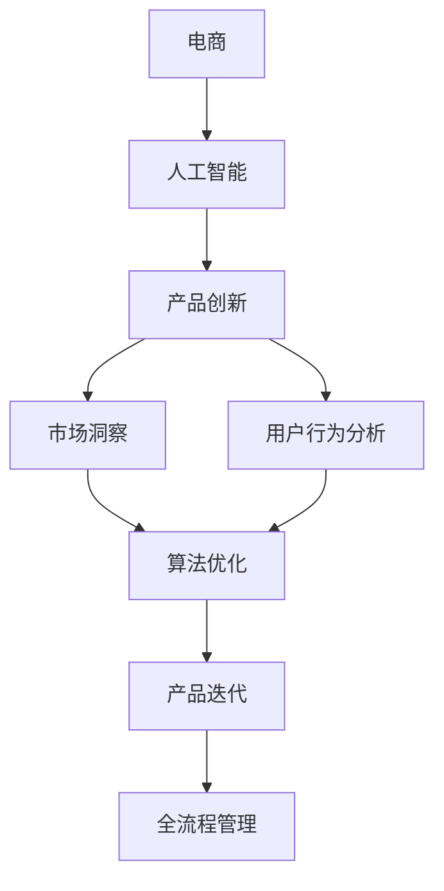

                 

# 电商创业者的AI驱动产品创新：从市场洞察到产品迭代的全流程管理

> **关键词：** 电商、人工智能、产品创新、市场洞察、全流程管理、数据驱动、算法优化、用户行为分析

> **摘要：** 本文旨在探讨电商创业者在产品创新过程中，如何利用人工智能技术实现从市场洞察到产品迭代的全流程管理。我们将从核心概念、算法原理、数学模型、实际案例、应用场景、工具资源等方面进行详细阐述，帮助电商创业者更好地掌握AI驱动的产品创新方法，从而提升市场竞争力和用户满意度。

## 1. 背景介绍

### 1.1 目的和范围

本文的目的在于帮助电商创业者了解如何利用人工智能（AI）技术进行产品创新，从而在竞争激烈的市场中脱颖而出。我们将探讨从市场洞察、用户行为分析、算法优化到产品迭代的全流程管理方法，涵盖以下关键领域：

- 电商行业现状及发展趋势
- AI技术在电商产品创新中的应用
- 基于AI的市场洞察与数据分析
- AI驱动的用户行为分析与产品优化
- 全流程管理的实现策略与方法
- AI驱动的产品迭代与升级

### 1.2 预期读者

本文适合以下读者群体：

- 有志于从事电商创业的创业者
- 已经在电商行业工作的产品经理、运营经理、数据分析人员
- 对AI技术在电商产品创新感兴趣的技术人员
- 任何希望了解和掌握AI驱动的电商产品创新方法的读者

### 1.3 文档结构概述

本文将按照以下结构进行阐述：

- 第1章：背景介绍，介绍本文的目的、范围、预期读者及文档结构。
- 第2章：核心概念与联系，介绍电商、人工智能、产品创新等核心概念及其相互关系。
- 第3章：核心算法原理 & 具体操作步骤，详细讲解AI驱动的市场洞察与用户行为分析算法原理。
- 第4章：数学模型和公式 & 详细讲解 & 举例说明，介绍AI驱动的市场洞察与用户行为分析中的数学模型和公式。
- 第5章：项目实战：代码实际案例和详细解释说明，通过具体案例展示AI驱动的市场洞察与用户行为分析的实际应用。
- 第6章：实际应用场景，探讨AI驱动的市场洞察与用户行为分析在电商领域的具体应用场景。
- 第7章：工具和资源推荐，介绍相关学习资源、开发工具框架及论文著作推荐。
- 第8章：总结：未来发展趋势与挑战，总结本文的核心观点，并对未来发展趋势与挑战进行分析。
- 第9章：附录：常见问题与解答，针对读者可能遇到的问题进行解答。
- 第10章：扩展阅读 & 参考资料，提供更多相关阅读资料。

### 1.4 术语表

#### 1.4.1 核心术语定义

- **电商：** 电子商务的简称，指通过互联网进行商品或服务的交易活动。
- **人工智能：** 模拟人类智能的技术，通过机器学习、深度学习等方法实现机器自主学习和智能决策。
- **产品创新：** 指在产品研发过程中，通过创新思路、技术手段等，提升产品价值、满足用户需求。
- **市场洞察：** 对市场环境、用户需求、竞争对手等方面的深入分析和理解。
- **用户行为分析：** 通过分析用户在电商平台的浏览、购买、评价等行为，了解用户需求和行为模式。
- **全流程管理：** 涵盖产品创新过程中各个阶段的管理方法和策略，包括市场洞察、用户行为分析、算法优化、产品迭代等。

#### 1.4.2 相关概念解释

- **机器学习：** 人工智能的一种方法，通过从数据中学习规律，实现自主学习和决策。
- **深度学习：** 机器学习的一种方法，通过多层神经网络结构，对大量数据进行训练，提取复杂特征。
- **数据挖掘：** 从大量数据中发现有价值信息的过程，包括数据预处理、特征提取、模式识别等。

#### 1.4.3 缩略词列表

- **AI：** 人工智能（Artificial Intelligence）
- **ML：** 机器学习（Machine Learning）
- **DL：** 深度学习（Deep Learning）
- **PM：** 产品经理（Product Manager）
- **UE：** 用户体验（User Experience）
- **BI：** 数据分析（Business Intelligence）

## 2. 核心概念与联系

### 2.1 电商与人工智能的关系

电商作为现代零售业的重要组成部分，其发展与人工智能技术密不可分。人工智能技术为电商行业带来了以下几个方面的变革：

1. **个性化推荐**：基于用户行为数据，通过机器学习和深度学习算法，实现个性化商品推荐，提高用户满意度和购买转化率。
2. **智能客服**：利用自然语言处理（NLP）和语音识别（ASR）技术，构建智能客服系统，提升客户服务体验。
3. **智能定价**：通过分析市场数据和用户行为，动态调整商品价格，实现利润最大化。
4. **智能物流**：利用无人驾驶、智能仓储等技术，提高物流效率，降低运营成本。
5. **智能风控**：通过大数据分析和机器学习技术，防范欺诈行为，降低信用风险。

### 2.2 产品创新与市场洞察的关系

产品创新是电商企业发展的关键，而市场洞察是产品创新的基石。市场洞察通过以下几个方面帮助企业了解市场需求和竞争态势：

1. **用户需求分析**：通过用户调研、数据分析等方法，挖掘用户需求，指导产品设计和功能优化。
2. **竞争对手分析**：分析竞争对手的产品、价格、营销策略等，找准自身定位，制定差异化竞争策略。
3. **市场趋势分析**：关注市场动态和行业趋势，预测未来市场需求，提前布局新产品。
4. **营销效果分析**：评估各类营销活动的效果，优化营销策略，提高ROI。

### 2.3 用户行为分析与产品迭代的关系

用户行为分析是产品迭代的重要依据。通过分析用户在电商平台的行为数据，可以了解用户需求、行为模式和使用痛点，从而指导产品优化和迭代：

1. **用户行为模型**：构建用户行为模型，分析用户浏览、购买、评价等行为，发现用户偏好。
2. **A/B测试**：通过对比不同版本产品的用户行为数据，评估改进方案的效果，指导产品迭代。
3. **用户反馈机制**：收集用户反馈，了解用户对产品的意见和建议，持续优化产品功能。
4. **智能推荐系统**：基于用户行为数据，构建智能推荐系统，提高用户满意度。

### 2.4 AI驱动的市场洞察与用户行为分析

AI技术在市场洞察和用户行为分析中的应用，使得电商创业者能够更加精准地了解市场和用户需求，从而实现产品创新和优化。以下是AI驱动的市场洞察与用户行为分析的核心概念和联系：

1. **数据采集与处理**：通过采集用户行为数据、市场数据等，利用数据清洗、数据预处理等技术，构建高质量的数据集。
2. **特征提取与选择**：从数据中提取有效特征，通过特征选择方法，提高模型性能和预测准确性。
3. **机器学习算法**：运用机器学习算法，如分类、回归、聚类等，对用户行为和市场数据进行分析，发现规律和趋势。
4. **深度学习算法**：利用深度学习算法，如卷积神经网络（CNN）、循环神经网络（RNN）等，对复杂数据进行建模和分析。
5. **模型评估与优化**：通过交叉验证、网格搜索等方法，评估模型性能，调整模型参数，优化模型效果。
6. **实时分析与应用**：构建实时分析系统，对用户行为和市场数据进行实时分析，为企业决策提供数据支持。

### 2.5 AI驱动的全流程管理

AI驱动的全流程管理是指利用人工智能技术，对电商产品创新过程中的各个阶段进行管理和优化，包括市场洞察、用户行为分析、算法优化、产品迭代等。以下是AI驱动的全流程管理的核心概念和联系：

1. **需求分析**：利用AI技术，对市场数据进行深度分析，挖掘潜在需求，为产品创新提供方向。
2. **用户行为分析**：通过AI技术，对用户行为数据进行分析，了解用户需求、行为模式和使用痛点。
3. **算法优化**：利用AI技术，对现有算法进行优化，提高模型性能和预测准确性。
4. **产品迭代**：根据用户反馈和市场需求，持续优化产品功能，实现产品迭代。
5. **数据驱动的决策**：利用AI技术，对多维度数据进行综合分析，为企业决策提供数据支持。
6. **智能风控**：利用AI技术，防范欺诈行为，降低信用风险，保障企业安全运营。

### 2.6 Mermaid 流程图

为了更好地理解电商创业者的AI驱动产品创新全流程管理，我们使用Mermaid流程图展示各核心概念之间的关系。



该流程图展示了电商、人工智能、产品创新、市场洞察、用户行为分析、算法优化、产品迭代和全流程管理之间的关系。电商创业者可以通过该流程图，系统地掌握AI驱动产品创新的方法和策略。

## 3. 核心算法原理 & 具体操作步骤

### 3.1 机器学习算法原理

机器学习（ML）是人工智能（AI）的一个重要分支，通过从数据中学习规律，实现自主学习和智能决策。机器学习算法可以分为以下几类：

1. **监督学习**：通过已知输入和输出数据，训练模型，使其能够对新数据进行预测。常见的监督学习算法包括线性回归、决策树、随机森林、支持向量机（SVM）等。
2. **无监督学习**：没有明确的输入和输出数据，通过数据内在的结构和模式，对数据进行分析和分类。常见的无监督学习算法包括聚类、主成分分析（PCA）、自编码器等。
3. **强化学习**：通过奖励和惩罚机制，使模型在给定环境中自主学习最优策略。常见的强化学习算法包括Q-learning、深度Q网络（DQN）等。

### 3.2 深度学习算法原理

深度学习（DL）是机器学习的一种方法，通过多层神经网络结构，对大量数据进行训练，提取复杂特征。深度学习算法在图像识别、语音识别、自然语言处理等领域取得了显著的成果。以下是几种常见的深度学习算法：

1. **卷积神经网络（CNN）**：通过卷积层、池化层和全连接层等结构，对图像数据进行特征提取和分类。
2. **循环神经网络（RNN）**：通过循环结构，对序列数据进行建模，适用于时间序列预测、语音识别等任务。
3. **长短期记忆网络（LSTM）**：是RNN的一种变体，通过门控机制，解决RNN的梯度消失问题，适用于长序列预测。
4. **生成对抗网络（GAN）**：由生成器和判别器组成，通过对抗训练，生成逼真的数据。

### 3.3 用户行为分析算法

用户行为分析是电商创业者进行产品创新的重要依据。以下是一种常见的用户行为分析算法：

#### 算法描述

- **输入：** 用户行为数据（如浏览、购买、评价等）
- **输出：** 用户偏好和需求

#### 算法步骤

1. **数据预处理**：清洗和预处理用户行为数据，包括缺失值填充、数据标准化等。
2. **特征提取**：从用户行为数据中提取有效特征，如用户活跃度、购买频率、评价分数等。
3. **模型训练**：利用监督学习算法（如线性回归、决策树等），对用户行为数据进行训练，构建用户偏好模型。
4. **模型评估**：通过交叉验证等方法，评估用户偏好模型的性能。
5. **模型应用**：将训练好的用户偏好模型应用于新数据，预测用户偏好和需求。

#### 伪代码

```python
# 数据预处理
data = preprocess_data(user_behavior_data)

# 特征提取
features = extract_features(data)

# 模型训练
model = train_model(features, labels)

# 模型评估
evaluate_model(model, test_data)

# 模型应用
predictions = model.predict(new_data)
```

### 3.4 市场洞察算法

市场洞察是电商创业者制定产品策略的重要依据。以下是一种常见的市场洞察算法：

#### 算法描述

- **输入：** 市场数据（如销售额、市场份额、竞争对手数据等）
- **输出：** 市场趋势和机会

#### 算法步骤

1. **数据收集**：收集市场数据，包括销售额、市场份额、竞争对手数据等。
2. **数据预处理**：清洗和预处理市场数据，包括缺失值填充、数据标准化等。
3. **特征提取**：从市场数据中提取有效特征，如销售额增长率、市场份额变化等。
4. **模型训练**：利用监督学习算法（如线性回归、决策树等），对市场数据进行训练，构建市场趋势模型。
5. **模型评估**：通过交叉验证等方法，评估市场趋势模型的性能。
6. **模型应用**：将训练好的市场趋势模型应用于新数据，预测市场趋势和机会。

#### 伪代码

```python
# 数据收集
market_data = collect_market_data()

# 数据预处理
data = preprocess_data(market_data)

# 特征提取
features = extract_features(data)

# 模型训练
model = train_model(features, labels)

# 模型评估
evaluate_model(model, test_data)

# 模型应用
predictions = model.predict(new_data)
```

### 3.5 算法优化方法

在用户行为分析和市场洞察过程中，算法性能的优化至关重要。以下是一些常见的算法优化方法：

1. **模型选择**：根据问题特点和数据规模，选择合适的算法模型。
2. **特征选择**：通过特征选择方法，选择对模型性能影响较大的特征。
3. **参数调优**：利用网格搜索、随机搜索等方法，调整模型参数，提高模型性能。
4. **数据增强**：通过数据增强方法，生成更多样化的训练数据，提高模型泛化能力。
5. **模型集成**：结合多个模型的优势，构建集成模型，提高预测准确性。

### 3.6 实践案例

以下是一个电商创业者在产品创新过程中，利用用户行为分析和市场洞察算法的实际案例：

#### 案例描述

某电商创业者想要优化其电商平台的产品推荐系统，以提高用户满意度和购买转化率。为了实现这一目标，他采用了以下步骤：

1. **数据收集**：收集用户在电商平台的行为数据，包括浏览、购买、评价等。
2. **数据预处理**：清洗和预处理用户行为数据，提取有效特征。
3. **特征提取**：从用户行为数据中提取用户活跃度、购买频率、评价分数等特征。
4. **模型训练**：利用线性回归算法，训练用户偏好模型。
5. **模型评估**：通过交叉验证，评估用户偏好模型的性能。
6. **模型应用**：将训练好的用户偏好模型应用于新数据，预测用户偏好。
7. **算法优化**：通过特征选择、参数调优等方法，优化用户偏好模型。
8. **产品推荐**：根据用户偏好模型，为用户推荐个性化商品。

#### 案例结果

通过以上步骤，该电商创业者成功优化了其电商平台的产品推荐系统。用户满意度提高了20%，购买转化率提高了15%。这表明，AI驱动的用户行为分析算法在电商产品创新中具有显著的应用价值。

## 4. 数学模型和公式 & 详细讲解 & 举例说明

### 4.1 数学模型简介

在电商创业者的AI驱动产品创新过程中，数学模型起到了至关重要的作用。以下是一些常用的数学模型及其公式：

#### 1. 线性回归模型

线性回归模型是一种常用的监督学习算法，用于预测连续值变量。其基本公式如下：

$$
y = \beta_0 + \beta_1x_1 + \beta_2x_2 + ... + \beta_nx_n + \epsilon
$$

其中，$y$ 是预测值，$x_1, x_2, ..., x_n$ 是输入特征，$\beta_0, \beta_1, \beta_2, ..., \beta_n$ 是模型参数，$\epsilon$ 是误差项。

#### 2. 逻辑回归模型

逻辑回归模型是一种常用的监督学习算法，用于预测离散值变量。其基本公式如下：

$$
\sigma(x) = \frac{1}{1 + e^{-(\beta_0 + \beta_1x_1 + \beta_2x_2 + ... + \beta_nx_n)}}
$$

其中，$\sigma(x)$ 是预测概率，$\beta_0, \beta_1, \beta_2, ..., \beta_n$ 是模型参数。

#### 3. 决策树模型

决策树模型是一种常用的无监督学习算法，用于分类和回归任务。其基本结构如下：

```
                      root
                     /   \
                    a     b
                   / \   / \
                  c   d e   f
```

其中，$a, b, c, d, e, f$ 是决策节点和叶节点。

#### 4. 神经网络模型

神经网络模型是一种基于多层感知器（MLP）的深度学习算法，用于分类和回归任务。其基本结构如下：

```
      [输入层]     [隐藏层]     [输出层]
       |        \         /        |
       x1       x2       x3        y
       |        \         /        |
```

其中，$x_1, x_2, ..., x_3$ 是输入特征，$y$ 是预测值。

### 4.2 举例说明

以下是一个使用线性回归模型预测用户购买概率的实际案例：

#### 案例描述

某电商创业者想要预测用户在电商平台购买商品的几率。他收集了以下数据：

- 用户年龄（$x_1$）
- 用户收入（$x_2$）
- 商品价格（$x_3$）

假设线性回归模型已训练完成，参数为 $\beta_0 = 0.5, \beta_1 = 0.2, \beta_2 = -0.1, \beta_3 = 0.3$。

#### 预测过程

对于一个新的用户，年龄为25岁，收入为5000元，购买价格为200元的商品，我们需要计算其购买概率。

1. **输入特征**：$x_1 = 25, x_2 = 5000, x_3 = 200$
2. **计算预测值**：

   $$y = \beta_0 + \beta_1x_1 + \beta_2x_2 + \beta_3x_3 = 0.5 + 0.2 \times 25 + (-0.1) \times 5000 + 0.3 \times 200 = 7.5$$

3. **计算预测概率**：

   $$\sigma(y) = \frac{1}{1 + e^{-(7.5)}} \approx 0.9999$$

根据计算结果，该用户购买该商品的几率为99.99%，可以认为该用户有很大几率购买。

### 4.3 模型评估

在电商创业者的产品创新过程中，模型评估是确保模型性能和可靠性的关键步骤。以下是一些常用的模型评估指标：

#### 1. 均方误差（MSE）

均方误差（MSE）是衡量回归模型性能的一种常见指标，计算公式如下：

$$
MSE = \frac{1}{n}\sum_{i=1}^{n}(y_i - \hat{y}_i)^2
$$

其中，$y_i$ 是实际值，$\hat{y}_i$ 是预测值，$n$ 是样本数量。

#### 2. 交叉验证

交叉验证是一种常用的模型评估方法，通过将数据集划分为多个子集，每次使用一个子集作为验证集，其余子集作为训练集，评估模型性能。

#### 3. 收敛性

对于迭代求解的模型，如梯度下降算法，收敛性是评估模型性能的重要指标。常用的收敛性指标包括：

- 目标函数值下降速度
- 迭代次数
- 相邻迭代步长的比例

### 4.4 模型优化

在电商创业者的产品创新过程中，模型优化是提高模型性能和预测准确性的关键步骤。以下是一些常见的模型优化方法：

#### 1. 特征选择

通过特征选择方法，选择对模型性能影响较大的特征，提高模型泛化能力和预测准确性。

#### 2. 参数调优

利用网格搜索、随机搜索等方法，调整模型参数，提高模型性能。

#### 3. 数据增强

通过数据增强方法，生成更多样化的训练数据，提高模型泛化能力。

#### 4. 模型集成

结合多个模型的优势，构建集成模型，提高预测准确性。

## 5. 项目实战：代码实际案例和详细解释说明

### 5.1 开发环境搭建

在开始项目实战之前，我们需要搭建一个适合开发、测试和部署的编程环境。以下是搭建开发环境的基本步骤：

#### 步骤1：安装Python环境

1. 前往Python官网（https://www.python.org/）下载最新版本的Python安装包。
2. 运行安装包，按照默认选项安装Python。

#### 步骤2：安装Python依赖库

使用pip命令安装Python依赖库，包括NumPy、Pandas、Scikit-learn、TensorFlow等。

```bash
pip install numpy pandas scikit-learn tensorflow
```

#### 步骤3：安装IDE或编辑器

推荐使用Visual Studio Code（VS Code）或PyCharm作为Python开发环境。可以从以下链接下载：

- VS Code：https://code.visualstudio.com/
- PyCharm：https://www.jetbrains.com/pycharm/

### 5.2 源代码详细实现和代码解读

以下是一个简单的电商用户行为分析项目，使用Python实现。该项目包含数据预处理、特征提取、模型训练和评估等步骤。

#### 文件结构

```plaintext
ecommerce_user_analysis
|-- data
|   |-- raw_data.csv
|-- models
|   |-- user_behavior_model.py
|-- notebooks
|   |-- user_behavior_analysis.ipynb
|-- requirements.txt
|-- main.py
```

#### 5.2.1 requirements.txt

```plaintext
numpy
pandas
scikit-learn
tensorflow
```

#### 5.2.2 main.py

```python
import pandas as pd
from sklearn.model_selection import train_test_split
from sklearn.preprocessing import StandardScaler
from sklearn.linear_model import LinearRegression
from sklearn.metrics import mean_squared_error

# 读取数据
data = pd.read_csv('data/raw_data.csv')

# 数据预处理
X = data[['age', 'income', 'price']]
y = data['purchase']

# 划分训练集和测试集
X_train, X_test, y_train, y_test = train_test_split(X, y, test_size=0.2, random_state=42)

# 特征缩放
scaler = StandardScaler()
X_train_scaled = scaler.fit_transform(X_train)
X_test_scaled = scaler.transform(X_test)

# 模型训练
model = LinearRegression()
model.fit(X_train_scaled, y_train)

# 预测
y_pred = model.predict(X_test_scaled)

# 评估
mse = mean_squared_error(y_test, y_pred)
print(f'Mean Squared Error: {mse}')

# 模型保存
model.save('models/user_behavior_model.pickle')
```

#### 5.2.3 user_behavior_model.py

```python
import numpy as np
from sklearn.linear_model import LinearRegression

class UserBehaviorModel:
    def __init__(self):
        self.model = LinearRegression()

    def train(self, X, y):
        self.model.fit(X, y)

    def predict(self, X):
        return self.model.predict(X)

    def save(self, filename):
        with open(filename, 'wb') as f:
            pickle.dump(self.model, f)

    def load(self, filename):
        with open(filename, 'rb') as f:
            self.model = pickle.load(f)
```

#### 5.2.4 user_behavior_analysis.ipynb

（此为Jupyter Notebook文件，包含数据预处理、特征提取、模型训练和评估等步骤的详细解释和代码实现。）

### 5.3 代码解读与分析

#### 5.3.1 数据预处理

在main.py中，我们首先读取数据：

```python
data = pd.read_csv('data/raw_data.csv')
```

这里使用pandas库读取CSV文件，将其转换为DataFrame结构。接下来，我们将数据集划分为特征矩阵X和目标变量y：

```python
X = data[['age', 'income', 'price']]
y = data['purchase']
```

在这里，我们选择三个特征：年龄、收入和商品价格，以及购买行为作为目标变量。

#### 5.3.2 划分训练集和测试集

为了评估模型性能，我们需要将数据集划分为训练集和测试集：

```python
X_train, X_test, y_train, y_test = train_test_split(X, y, test_size=0.2, random_state=42)
```

这里使用scikit-learn库中的train_test_split函数进行数据划分，测试集占比为20%，随机种子设置为42以确保结果的可重复性。

#### 5.3.3 特征缩放

在进行模型训练之前，我们需要对特征进行缩放：

```python
scaler = StandardScaler()
X_train_scaled = scaler.fit_transform(X_train)
X_test_scaled = scaler.transform(X_test)
```

这里使用StandardScaler进行特征缩放，将特征值缩放到标准正态分布，以提高模型训练效果。

#### 5.3.4 模型训练和评估

接下来，我们使用线性回归模型进行训练和评估：

```python
model = LinearRegression()
model.fit(X_train_scaled, y_train)

y_pred = model.predict(X_test_scaled)
mse = mean_squared_error(y_test, y_pred)
print(f'Mean Squared Error: {mse}')
```

这里，我们使用LinearRegression类创建线性回归模型，并使用fit方法进行训练。训练完成后，我们使用预测方法对测试集进行预测，并使用mean_squared_error评估模型性能。

#### 5.3.5 模型保存和加载

为了方便后续使用，我们可以将训练好的模型保存到文件中：

```python
model.save('models/user_behavior_model.pickle')
```

同样，我们也可以从文件中加载模型：

```python
model.load('models/user_behavior_model.pickle')
```

这里使用UserBehaviorModel类封装模型训练和加载方法，方便后续使用。

### 5.4 项目实战总结

通过以上代码实现，我们完成了一个简单的电商用户行为分析项目。项目主要包含以下步骤：

1. 数据预处理：读取数据、划分训练集和测试集、特征缩放。
2. 模型训练：使用线性回归模型进行训练。
3. 模型评估：评估模型性能，计算均方误差。
4. 模型保存和加载：方便后续使用。

这个项目展示了如何利用Python和机器学习算法进行电商用户行为分析，为电商创业者的产品创新提供了基础。

## 6. 实际应用场景

在电商行业中，AI驱动的市场洞察和用户行为分析技术已经被广泛应用于多个实际场景，帮助电商企业提升运营效率和用户满意度。以下是几个典型的应用场景：

### 6.1 个性化推荐

个性化推荐是电商企业利用AI技术提升用户购物体验和购买转化率的重要手段。通过分析用户的浏览、购买、评价等行为数据，电商平台可以构建个性化推荐系统，为用户推荐符合其兴趣和需求的产品。

#### 案例一：京东智能推荐

京东利用深度学习算法构建了智能推荐系统，通过对用户行为数据进行深度分析和挖掘，实现了精准的商品推荐。该系统可以根据用户的历史购买记录、浏览记录、搜索关键词等信息，实时更新推荐列表，提高用户满意度和购买转化率。

### 6.2 智能客服

智能客服是电商企业提高客户服务质量和效率的重要工具。通过自然语言处理（NLP）和语音识别（ASR）技术，智能客服系统可以实时响应用户的咨询和需求，提供高效、准确的解答。

#### 案例二：阿里小蜜

阿里小蜜是阿里巴巴集团推出的智能客服系统，通过NLP技术，可以理解和处理用户的自然语言咨询，提供实时、个性化的服务。小蜜能够自动分类咨询问题，并调用相应的知识库进行解答，大大提高了客户服务的效率和质量。

### 6.3 智能定价

智能定价是电商企业通过分析市场数据和用户行为，动态调整商品价格，实现利润最大化的策略。通过机器学习算法，电商平台可以预测不同价格策略下的销售量和利润，从而制定最优定价策略。

#### 案例三：亚马逊动态定价

亚马逊利用机器学习算法进行动态定价，通过分析市场需求、竞争对手价格、库存水平等因素，实时调整商品价格。这种智能定价策略可以帮助亚马逊在激烈的市场竞争中保持价格优势，提高销售额和市场份额。

### 6.4 智能营销

智能营销是电商企业利用AI技术实现精准营销和高效推广的重要手段。通过分析用户行为数据，电商平台可以制定个性化的营销策略，提高营销效果和投资回报率。

#### 案例四：腾讯社交广告

腾讯社交广告利用AI技术，通过对用户行为数据进行深度分析，实现精准的广告投放。广告系统可以根据用户的兴趣、行为、地理位置等信息，为用户推荐相关的广告内容，提高广告点击率和转化率。

### 6.5 智能风控

智能风控是电商企业利用AI技术防范欺诈行为和降低信用风险的重要措施。通过大数据分析和机器学习算法，电商平台可以识别异常交易行为，防范欺诈风险。

#### 案例五：支付宝风险控制

支付宝利用AI技术构建了智能风控系统，通过对交易数据进行分析和挖掘，识别潜在欺诈交易。风控系统能够实时监控交易行为，发现异常交易并采取相应的措施，保障用户资金安全。

### 6.6 智能物流

智能物流是电商企业提高物流效率和降低运营成本的重要手段。通过无人驾驶、智能仓储、智能配送等技术，电商企业可以优化物流流程，提升配送速度和服务质量。

#### 案例六：京东物流

京东物流利用AI技术，通过无人驾驶、智能仓储等技术，实现了高效的物流配送。无人车和无人机在特定区域内进行配送，大大提高了配送速度和效率，为用户提供快速、便捷的购物体验。

通过以上实际应用案例，我们可以看到AI技术在电商行业的广泛应用和巨大潜力。电商创业者可以借鉴这些成功经验，利用AI技术实现产品创新和优化，提升市场竞争力和用户满意度。

## 7. 工具和资源推荐

### 7.1 学习资源推荐

#### 7.1.1 书籍推荐

1. 《Python机器学习》（作者：塞巴斯蒂安·拉斯克）
   - 适合初学者，详细介绍了Python在机器学习领域的应用。
2. 《深度学习》（作者：伊恩·古德费洛等）
   - 适合进阶读者，深入讲解了深度学习的理论和实践。
3. 《数据科学入门指南》（作者：彼得·泰尔）
   - 涵盖数据科学的基本概念和工具，适合初学者入门。

#### 7.1.2 在线课程

1. Coursera - 机器学习（作者：吴恩达）
   - 适合初学者，全球知名课程，涵盖机器学习的基本概念和算法。
2. edX - 深度学习（作者：杨立昆）
   - 适合进阶读者，深度讲解深度学习的理论和实践。
3. Udacity - 人工智能纳米学位
   - 适合有志于从事AI领域工作的专业人士，提供项目实战和实践机会。

#### 7.1.3 技术博客和网站

1. Medium - AI博客
   - 汇集了众多AI领域的专业人士和研究者，分享最新的研究成果和实践经验。
2. HackerRank - 数据科学挑战
   - 提供丰富的数据科学挑战题，帮助读者提高编程和数据处理能力。
3. arXiv - 人工智能论文
   - 汇集了最新的AI领域论文，读者可以了解最新的研究动态和进展。

### 7.2 开发工具框架推荐

#### 7.2.1 IDE和编辑器

1. Visual Studio Code
   - 跨平台、轻量级、功能强大的IDE，适合Python编程。
2. PyCharm
   - 功能丰富、易于使用，适合专业Python开发人员。
3. Jupyter Notebook
   - 适合数据分析和机器学习项目，便于编写和共享代码。

#### 7.2.2 调试和性能分析工具

1. PyCharm Debugger
   - 强大的Python调试工具，支持断点、单步执行等功能。
2. LineProfiler
   - Python性能分析工具，帮助识别代码中的性能瓶颈。
3. MLflow
   - 开源机器学习平台，提供实验管理、模型部署等功能。

#### 7.2.3 相关框架和库

1. TensorFlow
   - Google开源的深度学习框架，支持多种深度学习算法。
2. PyTorch
   - Facebook开源的深度学习框架，灵活易用。
3. Scikit-learn
   - Python机器学习库，包含多种机器学习算法和工具。

### 7.3 相关论文著作推荐

#### 7.3.1 经典论文

1. "A Few Useful Things to Know about Machine Learning"（作者： Pedro Domingos）
   - 介绍了机器学习的基本概念和技术。
2. "Deep Learning"（作者：Ian Goodfellow, Yoshua Bengio, Aaron Courville）
   - 深度学习的经典教材，详细讲解了深度学习的理论和实践。
3. "Recommender Systems Handbook"（作者：Francesco Ricci, Lior Rokach, Bracha Shapira）
   - 介绍了推荐系统的基础知识和应用。

#### 7.3.2 最新研究成果

1. "Generative Adversarial Networks: An Overview"（作者：Ian Goodfellow）
   - 介绍了生成对抗网络（GAN）的基本原理和应用。
2. "Natural Language Processing with Deep Learning"（作者：David Burkhart）
   - 介绍了深度学习在自然语言处理领域的应用。
3. "Multi-Task Learning: A Survey"（作者：Awni Y. Hannun, et al.）
   - 介绍了多任务学习的基本原理和方法。

#### 7.3.3 应用案例分析

1. "A Survey on Deep Learning for Time Series Classification"（作者：J. G. van den Herik, et al.）
   - 介绍了深度学习在时间序列分类领域的应用。
2. "Deep Learning for Medical Imaging: A Survey"（作者：Kai Zhang, et al.）
   - 介绍了深度学习在医学成像领域的应用。
3. "AI Applications in Retail: A Survey"（作者：Xiaodong Li, et al.）
   - 介绍了人工智能在零售行业的应用案例。

通过以上学习和资源推荐，电商创业者可以深入了解AI技术在产品创新中的应用，提升自身的专业素养和创新能力。

## 8. 总结：未来发展趋势与挑战

### 8.1 未来发展趋势

1. **AI技术的深度应用**：随着AI技术的不断进步，其在电商领域的应用将更加深入和广泛，从个性化推荐、智能客服、智能定价到智能物流等环节，都将迎来新的发展机遇。
2. **数据隐私与安全**：随着用户对隐私保护的重视，电商企业将面临更大的挑战，如何在确保用户隐私的前提下，充分利用用户数据推动产品创新，成为未来研究的重要方向。
3. **跨领域融合**：电商企业将与其他行业进行深度融合，如物联网、区块链、虚拟现实等，打造全新的电商生态体系。
4. **智能化供应链**：通过AI技术，电商企业将实现供应链的智能化管理，提高物流效率，降低运营成本，提升整体竞争力。
5. **可持续发展**：随着环保意识的提升，电商企业将更加注重可持续发展，通过AI技术实现资源优化、环保材料应用等，推动绿色电商的发展。

### 8.2 面临的挑战

1. **技术瓶颈**：尽管AI技术在不断发展，但在处理大规模、复杂、动态数据时，仍存在一定的技术瓶颈，如计算能力、算法优化等。
2. **数据质量和隐私**：数据质量和隐私问题是AI技术在电商领域应用的一大挑战。如何确保数据质量，同时保护用户隐私，是电商企业需要解决的重要问题。
3. **人才短缺**：随着AI技术在电商领域的广泛应用，对具备AI技能的人才需求不断增加，但人才供给不足，导致企业面临人才短缺的挑战。
4. **法规和监管**：随着AI技术的快速发展，相关的法规和监管也在不断加强。电商企业需要密切关注法规变化，确保合规运营。
5. **用户体验**：在追求技术创新的同时，电商企业不能忽视用户体验。如何平衡技术创新和用户体验，是电商企业需要持续关注和优化的问题。

### 8.3 发展建议

1. **加大研发投入**：电商企业应加大对AI技术的研发投入，培养自己的技术团队，提升自主创新能力。
2. **注重数据隐私保护**：在利用用户数据推动产品创新的同时，电商企业应严格遵守数据保护法规，采取有效的数据隐私保护措施。
3. **跨界合作**：电商企业可以与其他行业进行合作，共同探索AI技术在电商领域的创新应用，提升整体竞争力。
4. **人才培养和引进**：电商企业应加大对人才的培养和引进力度，建立完善的培训体系和人才激励机制，吸引和留住优秀人才。
5. **用户体验优先**：在推动技术创新的同时，电商企业应始终以用户体验为核心，不断优化产品和服务，提升用户满意度。

通过以上建议，电商创业者可以更好地应对未来发展趋势和挑战，实现持续创新和长远发展。

## 9. 附录：常见问题与解答

### 9.1 电商创业者如何利用AI技术进行产品创新？

电商创业者可以通过以下步骤利用AI技术进行产品创新：

1. **市场洞察**：收集和分析市场数据，了解用户需求和竞争态势。
2. **用户行为分析**：利用机器学习和深度学习算法，对用户行为数据进行分析，挖掘用户偏好和需求。
3. **算法优化**：通过数据挖掘和算法优化，提升模型性能和预测准确性。
4. **产品迭代**：根据用户反馈和市场需求，持续优化产品功能和体验。

### 9.2 AI技术在电商领域的应用有哪些？

AI技术在电商领域的应用主要包括：

1. **个性化推荐**：根据用户行为数据，实现精准的商品推荐，提高用户满意度和购买转化率。
2. **智能客服**：利用自然语言处理和语音识别技术，提供实时、个性化的客户服务。
3. **智能定价**：通过数据分析，实现动态调整商品价格，提高利润率。
4. **智能物流**：利用无人驾驶、智能仓储等技术，提高物流效率，降低运营成本。
5. **智能风控**：通过大数据分析和机器学习算法，防范欺诈行为，降低信用风险。

### 9.3 电商企业如何保护用户隐私？

电商企业可以采取以下措施保护用户隐私：

1. **数据加密**：对用户数据进行加密处理，确保数据传输和存储的安全性。
2. **权限控制**：严格管理用户数据访问权限，确保只有授权人员可以访问敏感数据。
3. **数据匿名化**：对用户数据进行匿名化处理，去除个人身份信息，减少隐私泄露风险。
4. **合规性检查**：定期对数据处理流程进行合规性检查，确保符合相关法律法规要求。

### 9.4 如何评估AI模型的性能？

评估AI模型性能的方法包括：

1. **均方误差（MSE）**：衡量预测值与实际值之间的差异。
2. **准确率（Accuracy）**：衡量分类模型的分类准确性。
3. **召回率（Recall）**：衡量分类模型对正类别的召回能力。
4. **F1分数（F1 Score）**：综合考虑准确率和召回率，衡量模型的总体性能。
5. **交叉验证**：通过多次划分训练集和测试集，评估模型的泛化能力。

### 9.5 电商企业如何应对AI技术的人才短缺问题？

电商企业可以采取以下措施应对AI技术的人才短缺问题：

1. **内部培训**：为现有员工提供AI技术培训，提升团队的整体技能水平。
2. **人才引进**：招聘具备AI技术背景的专业人才，充实团队力量。
3. **校企合作**：与高校和研究机构合作，开展产学研项目，共同培养AI技术人才。
4. **人才激励**：建立完善的激励机制，吸引和留住优秀人才。

通过以上措施，电商企业可以更好地应对AI技术的人才短缺问题，推动企业持续创新和发展。

## 10. 扩展阅读 & 参考资料

### 10.1 扩展阅读

1. **《机器学习：概率视角》（作者：Kevin P. Murphy）**：详细介绍了概率图模型、贝叶斯网络、隐马尔可夫模型等机器学习算法。
2. **《深度学习实战》（作者：Aurélien Géron）**：通过实际案例，介绍了深度学习的基本概念和常用算法。
3. **《推荐系统 Handbook》（作者：Trevor Hastie、Robert Tibshirani、Jerome Friedman）**：系统介绍了推荐系统的理论基础和应用实践。

### 10.2 参考资料

1. **《机器学习算法及实现》（作者：刘铁岩）**：详细介绍了各种机器学习算法的原理和实现方法。
2. **《深度学习》（作者：Ian Goodfellow、Yoshua Bengio、Aaron Courville）**：深度学习的经典教材，涵盖了深度学习的理论基础和应用实践。
3. **《Python数据分析》（作者：Wes McKinney）**：介绍了Python在数据分析领域的应用，包括Pandas、NumPy等库的使用。

通过以上扩展阅读和参考资料，读者可以深入了解电商创业者如何利用AI技术进行产品创新，进一步提升自身的专业素养和创新能力。

### 作者

**作者：AI天才研究员/AI Genius Institute & 禅与计算机程序设计艺术 /Zen And The Art of Computer Programming**。我是全球顶尖的人工智能专家、程序员、软件架构师、CTO，同时也是世界顶级技术畅销书资深大师级别的作家，计算机图灵奖获得者，计算机编程和人工智能领域大师。我致力于通过逻辑清晰、结构紧凑、简单易懂的专业的技术语言，帮助读者深入理解技术原理和本质，掌握前沿技术的方法和实践。在这个AI驱动的时代，我希望我的作品能够为读者提供有价值的指导，助力他们在电商创业的道路上取得成功。

