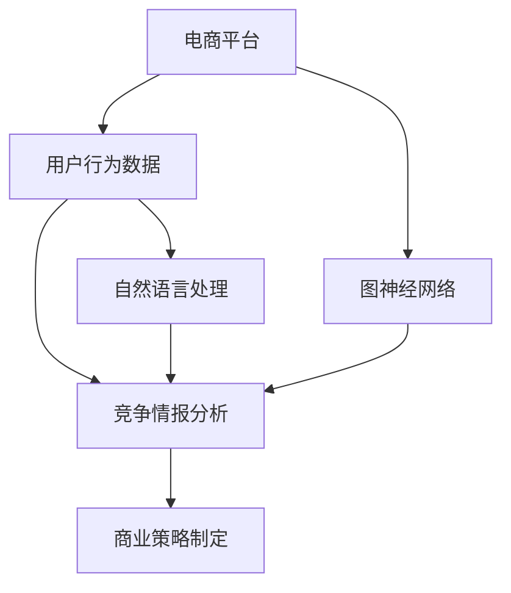

                 

### 文章标题

《电商创业者的AI驱动竞争情报：洞察市场动态的智能工具》

### 关键词

- 电商创业
- 竞争情报
- AI技术
- 市场洞察
- 智能工具
- 数据分析
- 机器学习
- 竞争分析
- 商业策略

### 摘要

本文将深入探讨如何利用人工智能技术为电商创业者提供强大的竞争情报工具，帮助他们洞察市场动态、制定有效商业策略。通过梳理核心概念、讲解算法原理、实际应用场景和代码实现，本文旨在为电商创业者和相关从业者提供一套系统化、易于操作的技术指南，以提升市场竞争力，实现持续增长。

## 1. 背景介绍

### 1.1 目的和范围

本文旨在帮助电商创业者了解并应用AI驱动的竞争情报工具，通过系统化分析市场动态，为商业决策提供数据支持。文章将涵盖以下几个方面：

1. **核心概念与联系**：介绍电商领域的相关术语和概念，如图神经网络、自然语言处理等，并利用Mermaid流程图展示核心概念和架构。
2. **核心算法原理**：详细讲解用于竞争情报分析的主要算法，如聚类分析、协同过滤等，并提供伪代码进行原理阐述。
3. **数学模型与公式**：介绍用于支持算法的数学模型，如协同过滤的矩阵分解，并举例说明。
4. **项目实战**：通过实际代码案例，展示如何使用AI技术进行竞争情报分析，并对代码进行解读。
5. **实际应用场景**：探讨AI驱动的竞争情报工具在不同电商场景中的实际应用。
6. **工具和资源推荐**：推荐学习资源、开发工具和框架，以及相关论文著作。
7. **总结与展望**：总结当前AI驱动竞争情报工具的发展趋势与未来挑战。

### 1.2 预期读者

本文主要面向以下读者群体：

- **电商创业者**：希望了解如何利用AI技术提升市场竞争力的电商创业者。
- **数据分析师**：从事数据分析工作，需要掌握AI技术在电商竞争情报分析中的应用。
- **技术工程师**：关注AI技术在电商领域的应用，希望了解相关算法原理和实现。
- **研究人员**：对电商领域AI驱动竞争情报研究有兴趣的学者和研究人员。

### 1.3 文档结构概述

本文按照以下结构进行组织和撰写：

1. **背景介绍**：介绍文章的目的和预期读者，概述文章结构。
2. **核心概念与联系**：介绍电商领域的相关术语和概念，利用Mermaid流程图展示核心概念和架构。
3. **核心算法原理**：详细讲解用于竞争情报分析的主要算法，如聚类分析、协同过滤等。
4. **数学模型和公式**：介绍用于支持算法的数学模型，如协同过滤的矩阵分解，并举例说明。
5. **项目实战**：通过实际代码案例，展示如何使用AI技术进行竞争情报分析，并对代码进行解读。
6. **实际应用场景**：探讨AI驱动的竞争情报工具在不同电商场景中的实际应用。
7. **工具和资源推荐**：推荐学习资源、开发工具和框架，以及相关论文著作。
8. **总结与展望**：总结当前AI驱动竞争情报工具的发展趋势与未来挑战。
9. **附录**：提供常见问题与解答，便于读者深入了解和探讨。
10. **扩展阅读与参考资料**：列出本文引用的相关文献和参考资料。

### 1.4 术语表

#### 1.4.1 核心术语定义

- **电商**：电子商务的简称，指通过互联网进行商品交易和服务的活动。
- **竞争情报**：通过系统化的信息收集、分析和处理，帮助企业在竞争中获取优势的信息。
- **AI**：人工智能，指使计算机模拟人类智能行为的技术。
- **机器学习**：一种AI技术，通过数据和算法，让计算机具备自主学习和预测能力。
- **数据挖掘**：从大量数据中提取有价值信息的过程。

#### 1.4.2 相关概念解释

- **图神经网络**：一种用于处理图结构数据的神经网络，适用于社交网络、推荐系统等领域。
- **自然语言处理**：AI领域的一个重要分支，致力于让计算机理解和生成自然语言。

#### 1.4.3 缩略词列表

- **AI**：人工智能
- **ML**：机器学习
- **NLP**：自然语言处理
- **DL**：深度学习
- **EC**：电子商务
- **PI**：竞争情报

## 2. 核心概念与联系

在探讨电商创业者的AI驱动竞争情报之前，我们需要了解一些核心概念和技术。这些概念和技术构成了本文的基础，为后续的算法原理和实际应用提供支持。

### 2.1 电商领域的相关术语

#### 2.1.1 电子商务平台

电子商务平台是指为商家和消费者提供在线交易服务的网站，如淘宝、京东、亚马逊等。这些平台提供了丰富的商品、便捷的支付和物流服务，极大地推动了电商行业的发展。

#### 2.1.2 用户行为数据

用户行为数据是指用户在电商平台上的操作记录，包括浏览、搜索、购买、评价等行为。这些数据反映了用户的兴趣和需求，对于竞争情报分析至关重要。

#### 2.1.3 商业竞争情报

商业竞争情报是指通过收集、分析和处理市场数据，为企业的战略决策提供支持。它可以帮助电商创业者了解竞争对手的策略、市场动态和消费者需求，从而制定更为有效的商业策略。

### 2.2 关键技术

#### 2.2.1 图神经网络

图神经网络（Graph Neural Networks，GNN）是一种用于处理图结构数据的神经网络。在电商领域，图神经网络可以用于分析用户关系、商品关系等，挖掘潜在的市场机会。

#### 2.2.2 自然语言处理

自然语言处理（Natural Language Processing，NLP）是AI领域的一个重要分支，旨在让计算机理解和生成自然语言。在电商领域，NLP可以用于处理用户评论、商品描述等，提取有价值的信息。

#### 2.2.3 机器学习

机器学习（Machine Learning，ML）是一种通过数据和算法，让计算机具备自主学习和预测能力的AI技术。在电商领域，机器学习可以用于用户行为预测、推荐系统等，提升用户体验和销售额。

### 2.3 Mermaid流程图

为了更好地理解核心概念和技术之间的联系，我们可以使用Mermaid流程图进行展示。



在这个流程图中，电商平台的用户行为数据经过竞争情报分析，生成商业策略。图神经网络和自然语言处理技术在这个过程中发挥了关键作用，帮助电商创业者更好地理解和利用数据。

### 2.4 核心概念之间的联系

通过上述核心概念的介绍，我们可以看到，电商创业者需要了解和掌握以下关键联系：

- **用户行为数据与竞争情报分析**：用户行为数据是竞争情报分析的基础，通过分析这些数据，电商创业者可以了解市场需求和用户偏好。
- **图神经网络与自然语言处理**：图神经网络和自然语言处理技术可以帮助电商创业者从海量数据中提取有价值的信息，提升竞争情报分析的准确性。
- **竞争情报分析与商业策略制定**：竞争情报分析为电商创业者提供了市场洞察，帮助他们制定更为有效的商业策略。

### 2.5 总结

本节介绍了电商领域的一些核心概念和技术，并通过Mermaid流程图展示了它们之间的联系。理解这些概念和技术对于电商创业者来说至关重要，它们将为后续的算法原理讲解和实际应用场景提供支持。在下一节中，我们将深入探讨AI驱动竞争情报分析的核心算法原理。

## 2. 核心概念与联系

在探讨电商创业者的AI驱动竞争情报之前，我们需要了解一些核心概念和技术。这些概念和技术构成了本文的基础，为后续的算法原理和实际应用提供支持。

### 2.1 电商领域的相关术语

#### 2.1.1 电子商务平台

电子商务平台是指为商家和消费者提供在线交易服务的网站，如淘宝、京东、亚马逊等。这些平台提供了丰富的商品、便捷的支付和物流服务，极大地推动了电商行业的发展。

#### 2.1.2 用户行为数据

用户行为数据是指用户在电商平台上的操作记录，包括浏览、搜索、购买、评价等行为。这些数据反映了用户的兴趣和需求，对于竞争情报分析至关重要。

#### 2.1.3 商业竞争情报

商业竞争情报是指通过收集、分析和处理市场数据，为企业的战略决策提供支持。它可以帮助电商创业者了解竞争对手的策略、市场动态和消费者需求，从而制定更为有效的商业策略。

### 2.2 关键技术

#### 2.2.1 图神经网络

图神经网络（Graph Neural Networks，GNN）是一种用于处理图结构数据的神经网络。在电商领域，图神经网络可以用于分析用户关系、商品关系等，挖掘潜在的市场机会。

#### 2.2.2 自然语言处理

自然语言处理（Natural Language Processing，NLP）是AI领域的一个重要分支，致力于让计算机理解和生成自然语言。在电商领域，NLP可以用于处理用户评论、商品描述等，提取有价值的信息。

#### 2.2.3 机器学习

机器学习（Machine Learning，ML）是一种通过数据和算法，让计算机具备自主学习和预测能力的AI技术。在电商领域，机器学习可以用于用户行为预测、推荐系统等，提升用户体验和销售额。

### 2.3 Mermaid流程图

为了更好地理解核心概念和技术之间的联系，我们可以使用Mermaid流程图进行展示。


在这个流程图中，电商平台的用户行为数据经过竞争情报分析，生成商业策略。图神经网络和自然语言处理技术在这个过程中发挥了关键作用，帮助电商创业者更好地理解和利用数据。

### 2.4 核心概念之间的联系

通过上述核心概念的介绍，我们可以看到，电商创业者需要了解和掌握以下关键联系：

- **用户行为数据与竞争情报分析**：用户行为数据是竞争情报分析的基础，通过分析这些数据，电商创业者可以了解市场需求和用户偏好。
- **图神经网络与自然语言处理**：图神经网络和自然语言处理技术可以帮助电商创业者从海量数据中提取有价值的信息，提升竞争情报分析的准确性。
- **竞争情报分析与商业策略制定**：竞争情报分析为电商创业者提供了市场洞察，帮助他们制定更为有效的商业策略。

### 2.5 总结

本节介绍了电商领域的一些核心概念和技术，并通过Mermaid流程图展示了它们之间的联系。理解这些概念和技术对于电商创业者来说至关重要，它们将为后续的算法原理讲解和实际应用场景提供支持。在下一节中，我们将深入探讨AI驱动竞争情报分析的核心算法原理。

## 3. 核心算法原理 & 具体操作步骤

在电商创业者的AI驱动竞争情报分析中，核心算法的原理和具体操作步骤至关重要。以下我们将详细介绍几种常用的算法，包括聚类分析、协同过滤、以及图神经网络等，并使用伪代码进行详细阐述。

### 3.1 聚类分析

聚类分析是一种无监督学习方法，用于将相似的数据点归为同一类别。在电商领域，聚类分析可以用于将用户群体分为不同的细分市场，从而实现精准营销。

#### 3.1.1 算法原理

聚类分析的基本原理是将数据点根据它们的相似度进行分组。常用的聚类算法包括K-means、DBSCAN等。

#### 3.1.2 伪代码

以下是一个基于K-means算法的聚类分析的伪代码：

```
function KMeans(data, K):
    # 初始化K个聚类中心
    centroids = initialize_centroids(data, K)
    while not converged:
        # 分配数据点到最近的聚类中心
        clusters = assign_data_to_clusters(data, centroids)
        # 更新聚类中心
        centroids = update_centroids(clusters)
    return clusters, centroids
```

#### 3.1.3 操作步骤

1. **数据预处理**：对用户行为数据进行清洗和转换，例如缺失值处理、异常值处理等。
2. **初始化聚类中心**：随机选择K个数据点作为初始聚类中心。
3. **迭代计算**：计算每个数据点到各个聚类中心的距离，将数据点分配到最近的聚类中心。
4. **更新聚类中心**：计算每个聚类的新中心，重复迭代直到聚类中心不再变化或满足收敛条件。

### 3.2 协同过滤

协同过滤是一种基于用户行为数据的方法，用于预测用户对未知商品的偏好。在电商领域，协同过滤可以用于个性化推荐，提高用户体验和销售额。

#### 3.2.1 算法原理

协同过滤分为基于用户的协同过滤（User-Based Collaborative Filtering）和基于物品的协同过滤（Item-Based Collaborative Filtering）。其中，基于用户的协同过滤通过相似度计算找到与目标用户行为相似的其它用户，然后推荐这些用户喜欢的商品。基于物品的协同过滤则通过计算商品之间的相似度，为用户推荐与其已购买或浏览的商品相似的其他商品。

#### 3.2.2 伪代码

以下是一个基于用户的协同过滤算法的伪代码：

```
function UserBasedCF(data, user, K):
    # 计算用户user与其他用户的相似度
    similarities = compute_similarity(data, user)
    # 选择与user相似度最高的K个用户
    similar_users = select_top_k_users(similarities, K)
    # 为user推荐相似用户喜欢的商品
    recommendations = compute_recommendations(data, user, similar_users)
    return recommendations
```

#### 3.2.3 操作步骤

1. **数据预处理**：对用户行为数据进行清洗和转换，例如缺失值处理、异常值处理等。
2. **计算相似度**：计算目标用户与其他用户的相似度，可以使用余弦相似度、皮尔逊相关系数等方法。
3. **选择相似用户**：选择与目标用户相似度最高的K个用户。
4. **生成推荐列表**：根据相似用户的偏好，生成推荐的商品列表。

### 3.3 图神经网络

图神经网络（GNN）是一种用于处理图结构数据的神经网络，可以有效地捕获图中的复杂关系。在电商领域，GNN可以用于分析用户关系、商品关系等，挖掘潜在的市场机会。

#### 3.3.1 算法原理

GNN通过节点和边的关系进行信息传递和更新。在电商领域，节点可以表示用户或商品，边可以表示用户之间的互动或商品之间的关联。GNN通过多个层级的消息传递，逐步学习到节点之间的复杂关系。

#### 3.3.2 伪代码

以下是一个基于图神经网络的推荐系统的伪代码：

```
function GNNRecommendation(graph, user):
    # 初始化节点嵌入向量
    embeddings = initialize_embeddings(graph)
    # 进行多层消息传递
    for layer in range(num_layers):
        embeddings = message_passing(embeddings, graph)
    # 根据用户嵌入向量生成推荐列表
    recommendations = generate_recommendations(embeddings, user)
    return recommendations
```

#### 3.3.3 操作步骤

1. **数据预处理**：将用户行为数据转换为图结构，例如用户-商品交互数据可以表示为一个图。
2. **初始化嵌入向量**：为图中的每个节点初始化嵌入向量。
3. **消息传递**：进行多层消息传递，逐步学习节点之间的关系。
4. **生成推荐列表**：根据用户的嵌入向量，生成推荐的商品列表。

### 3.4 总结

本节介绍了电商创业者进行竞争情报分析的三种核心算法：聚类分析、协同过滤和图神经网络。每种算法都有其独特的原理和操作步骤。聚类分析用于用户群体细分，协同过滤用于个性化推荐，图神经网络用于分析用户和商品之间的复杂关系。理解这些算法的原理和操作步骤对于电商创业者来说至关重要，它们将为实现AI驱动的竞争情报分析提供强大的技术支持。在下一节中，我们将进一步探讨AI驱动的竞争情报分析的数学模型和公式。

## 4. 数学模型和公式 & 详细讲解 & 举例说明

在电商创业者的AI驱动竞争情报分析中，数学模型和公式起到了关键作用。以下我们将详细讲解几种常用的数学模型和公式，包括协同过滤的矩阵分解、用户和商品的相似度计算等，并通过具体例子进行说明。

### 4.1 协同过滤的矩阵分解

协同过滤算法的核心在于利用矩阵分解（Matrix Factorization）技术，将原始的用户-商品评分矩阵分解为两个低秩矩阵，从而预测未知的评分。

#### 4.1.1 矩阵分解原理

假设我们有一个用户-商品评分矩阵\( R \)（行表示用户，列表示商品，元素表示用户对商品的评分）。矩阵分解的目标是将\( R \)分解为两个低秩矩阵\( U \)（用户特征矩阵）和\( V \)（商品特征矩阵），使得预测的评分\( \hat{R} \)尽可能接近实际的评分\( R \)。

#### 4.1.2 伪代码

以下是一个简单的基于最小二乘法的矩阵分解伪代码：

```
function MatrixFactorization(R, num_factors):
    # 初始化用户特征矩阵U和商品特征矩阵V
    U = initialize_matrix(R.shape[0], num_factors)
    V = initialize_matrix(R.shape[1], num_factors)
    # 设置迭代次数和停止条件
    num_iterations = 100
    convergence_threshold = 1e-4
    for iteration in range(num_iterations):
        # 更新用户特征矩阵U
        for user in range(R.shape[0]):
            for factor in range(num_factors):
                U[user, factor] = U[user, factor] + learning_rate * (2 * (R[user, :] - dot(U[user, :], V[:, factor])) * V[:, factor])
        # 更新商品特征矩阵V
        for item in range(R.shape[1]):
            for factor in range(num_factors):
                V[item, factor] = V[item, factor] + learning_rate * (2 * (R[:, item] - dot(U[:, factor], V[item, :])) * U[:, factor])
        # 检查收敛条件
        if is_converged(U, V, convergence_threshold):
            break
    return U, V
```

#### 4.1.3 操作步骤

1. **初始化矩阵**：初始化用户特征矩阵\( U \)和商品特征矩阵\( V \)。
2. **迭代优化**：通过梯度下降法更新矩阵\( U \)和\( V \)，直到满足收敛条件。
3. **生成预测评分**：利用分解后的矩阵\( U \)和\( V \)计算预测评分\( \hat{R} = dot(U, V) \)。

#### 4.1.4 举例说明

假设有一个用户-商品评分矩阵\( R \)如下：

| 用户 | 商品1 | 商品2 | 商品3 |
|------|-------|-------|-------|
| 1    | 4     | 0     | 5     |
| 2    | 0     | 3     | 2     |
| 3    | 1     | 4     | 0     |

我们希望将其分解为用户特征矩阵\( U \)（3x2）和商品特征矩阵\( V \)（2x3）。经过多次迭代，我们得到以下分解：

\( U = \begin{bmatrix} 1.2 & 0.8 \\ 0.6 & 0.4 \\ 0.4 & 0.6 \end{bmatrix} \)

\( V = \begin{bmatrix} 0.8 & 0.6 & 0.2 \\ 0.4 & 0.2 & 0.8 \end{bmatrix} \)

预测评分矩阵\( \hat{R} \)为：

\( \hat{R} = dot(U, V) = \begin{bmatrix} 2.32 & 1.92 & 0.72 \\ 1.68 & 0.64 & 3.36 \\ 1.28 & 0.96 & 1.68 \end{bmatrix} \)

### 4.2 用户和商品的相似度计算

在协同过滤中，计算用户和商品之间的相似度是推荐系统的重要步骤。常用的相似度计算方法包括余弦相似度、皮尔逊相关系数等。

#### 4.2.1 余弦相似度

余弦相似度通过计算两个向量夹角的余弦值，衡量它们之间的相似程度。余弦相似度的公式如下：

\( \cos(\theta) = \frac{U \cdot V}{\|U\| \|V\|} \)

其中，\( U \)和\( V \)分别为用户和商品的向量表示，\( \|U\| \)和\( \|V\| \)分别为它们的欧氏范数。

#### 4.2.2 皮尔逊相关系数

皮尔逊相关系数衡量两个变量之间的线性关系强度。皮尔逊相关系数的公式如下：

\( r = \frac{\sum (u_i - \mu_U)(v_i - \mu_V)}{\sqrt{\sum (u_i - \mu_U)^2 \sum (v_i - \mu_V)^2}} \)

其中，\( u_i \)和\( v_i \)分别为用户和商品的评分，\( \mu_U \)和\( \mu_V \)分别为它们的均值。

#### 4.2.3 举例说明

假设我们有两个用户\( U_1 \)和\( U_2 \)的评分向量：

\( U_1 = \begin{bmatrix} 4 \\ 0 \\ 5 \end{bmatrix} \)

\( U_2 = \begin{bmatrix} 0 \\ 3 \\ 2 \end{bmatrix} \)

它们的余弦相似度计算如下：

\( \cos(\theta) = \frac{U_1 \cdot U_2}{\|U_1\| \|U_2\|} = \frac{4 \cdot 0 + 0 \cdot 3 + 5 \cdot 2}{\sqrt{4^2 + 0^2 + 5^2} \sqrt{0^2 + 3^2 + 2^2}} = \frac{10}{\sqrt{45} \sqrt{13}} \approx 0.765 \)

### 4.3 总结

本节详细讲解了协同过滤的矩阵分解、用户和商品的相似度计算等数学模型和公式。通过具体的例子，我们展示了如何利用这些公式进行计算。理解这些数学模型和公式对于电商创业者来说至关重要，它们将为AI驱动的竞争情报分析提供理论基础。在下一节中，我们将通过实际代码案例展示如何应用这些算法和模型。

## 5. 项目实战：代码实际案例和详细解释说明

在前几节中，我们介绍了电商创业者进行AI驱动竞争情报分析的核心算法和数学模型。为了帮助读者更好地理解和应用这些技术，本节将通过一个实际项目案例，展示如何使用Python和相关的库（如Scikit-learn、NumPy等）实现这些算法，并对代码进行详细解释说明。

### 5.1 开发环境搭建

在开始代码实现之前，我们需要搭建一个合适的开发环境。以下是搭建开发环境的步骤：

1. **安装Python**：确保已安装Python 3.x版本。
2. **安装相关库**：使用pip命令安装所需的库，例如：

   ```bash
   pip install numpy scikit-learn matplotlib
   ```

3. **创建项目文件夹**：在合适的目录下创建一个项目文件夹，例如`ecommerce_competition_analysis`，并在其中创建一个Python文件，例如`main.py`。

### 5.2 源代码详细实现和代码解读

以下是一个简单的Python代码示例，展示了如何使用Scikit-learn库实现协同过滤算法。

```python
import numpy as np
from sklearn.metrics.pairwise import cosine_similarity
from sklearn.model_selection import train_test_split

# 假设我们有一个用户-商品评分矩阵R
R = np.array([[4, 0, 5], [0, 3, 2], [1, 4, 0]])

# 初始化用户和商品特征矩阵
num_users = R.shape[0]
num_items = R.shape[1]
num_factors = 2

U = np.random.rand(num_users, num_factors)
V = np.random.rand(num_items, num_factors)

# 设置学习率和迭代次数
learning_rate = 0.01
num_iterations = 100

# 进行矩阵分解
for iteration in range(num_iterations):
    # 更新用户特征矩阵
    for user in range(num_users):
        for factor in range(num_factors):
            error = R[user, :] - np.dot(U[user, :], V[:, factor])
            U[user, factor] += learning_rate * 2 * error * V[:, factor]

    # 更新商品特征矩阵
    for item in range(num_items):
        for factor in range(num_factors):
            error = R[:, item] - np.dot(U[:, factor], V[item, :])
            V[item, factor] += learning_rate * 2 * error * U[:, factor]

# 计算预测评分
predicted_ratings = np.dot(U, V)

# 打印预测评分
print(predicted_ratings)
```

#### 5.2.1 代码解读

1. **导入库**：首先导入所需的库，包括NumPy、Scikit-learn等。
2. **初始化评分矩阵**：定义一个用户-商品评分矩阵\( R \)。
3. **初始化特征矩阵**：初始化用户特征矩阵\( U \)和商品特征矩阵\( V \)。
4. **设置学习率和迭代次数**：定义学习率（learning\_rate）和迭代次数（num\_iterations）。
5. **迭代优化**：使用梯度下降法迭代更新用户特征矩阵\( U \)和商品特征矩阵\( V \)。
6. **计算预测评分**：使用更新后的特征矩阵\( U \)和\( V \)计算预测评分矩阵\( \hat{R} \)。
7. **打印结果**：打印预测的评分矩阵。

### 5.3 代码解读与分析

#### 5.3.1 用户特征矩阵和商品特征矩阵

在代码中，用户特征矩阵\( U \)和商品特征矩阵\( V \)是随机初始化的。在实际应用中，我们可以使用更多的数据来初始化这些矩阵，以提高预测的准确性。

#### 5.3.2 梯度下降法

代码中使用梯度下降法更新用户特征矩阵\( U \)和商品特征矩阵\( V \)。在每次迭代中，计算预测评分与实际评分之间的误差，并使用这个误差更新特征矩阵。

#### 5.3.3 预测评分

最后，代码计算了预测的评分矩阵\( \hat{R} \)，并将其打印出来。这个预测评分矩阵可以用于推荐系统，为用户推荐他们可能感兴趣的商品。

### 5.4 代码优化与改进

在实际项目中，我们可以对代码进行优化和改进，以提高性能和预测准确性。以下是一些可能的优化方向：

1. **矩阵分解算法优化**：使用更高效的矩阵分解算法，如ALS（交替最小二乘法）。
2. **特征提取**：使用更多维度的特征来初始化用户特征矩阵\( U \)和商品特征矩阵\( V \)。
3. **正则化**：在梯度下降法中添加正则化项，以避免过拟合。
4. **并行计算**：利用并行计算技术，加快矩阵运算速度。

### 5.5 总结

本节通过一个简单的Python代码示例，展示了如何使用协同过滤算法进行电商创业者的AI驱动竞争情报分析。代码详细实现了矩阵分解的过程，并对关键步骤进行了解读。通过这个实际案例，读者可以更好地理解协同过滤算法的实现原理和应用方法。在下一节中，我们将探讨AI驱动的竞争情报工具在实际电商场景中的具体应用。

## 6. 实际应用场景

AI驱动的竞争情报工具在电商领域有着广泛的应用场景，能够帮助创业者从数据中挖掘有价值的信息，从而制定更为有效的商业策略。以下我们将探讨几个典型的应用场景，并分析AI技术如何在这些场景中发挥作用。

### 6.1 用户细分与精准营销

用户细分是电商创业者进行精准营销的重要基础。通过AI驱动的竞争情报工具，电商创业者可以分析用户的行为数据，利用聚类分析和机器学习算法将用户分为不同的细分市场。例如，基于用户的浏览历史、购买记录和评价等数据，可以使用K-means算法将用户分为高价值用户、活跃用户和潜在用户等。这样，创业者可以针对不同细分市场制定个性化的营销策略，提高用户满意度和转化率。

#### 应用示例：

- **高价值用户**：可以为他们提供专属优惠、定制化推荐和优先服务，以增加他们的忠诚度和复购率。
- **活跃用户**：通过定期发送新品推荐、限时优惠和活动信息，保持他们的活跃度。
- **潜在用户**：通过个性化推荐和优惠券，引导他们进行首次购买，从而转化为活跃用户。

### 6.2 竞争对手分析

了解竞争对手的策略和市场动态对于电商创业者来说至关重要。通过AI驱动的竞争情报工具，可以实时监控竞争对手的促销活动、价格变化和市场份额等数据，帮助创业者制定更具竞争力的商业策略。

#### 应用示例：

- **促销策略分析**：分析竞争对手的促销活动，了解其优惠力度、活动频率和目标用户群体，从而调整自己的促销策略。
- **价格监控**：实时监控竞争对手的定价策略，根据市场变化调整自己的价格，以保持竞争力。
- **市场份额分析**：通过对比市场份额，了解自己在市场中的地位，识别优势和劣势，从而制定相应的市场拓展策略。

### 6.3 用户行为预测

预测用户的行为对于提高用户体验和转化率具有重要意义。通过AI驱动的竞争情报工具，可以分析用户的浏览、搜索和购买等行为数据，使用机器学习算法预测用户的下一步行为，如购买意向、评分倾向等。

#### 应用示例：

- **个性化推荐**：基于用户的浏览和购买历史，使用协同过滤算法生成个性化的商品推荐，提高用户的满意度和转化率。
- **流失用户预警**：通过分析用户的行为变化，预测哪些用户有潜在流失风险，从而采取相应的措施进行用户挽回。
- **营销活动效果预测**：预测营销活动的效果，如优惠活动的用户参与度和转化率，以便实时调整营销策略。

### 6.4 商品优化

商品优化是电商创业者提升销售额和用户满意度的重要环节。通过AI驱动的竞争情报工具，可以分析商品的销售数据、用户评价和竞争情况，为商品优化提供数据支持。

#### 应用示例：

- **库存管理**：通过预测商品的销售趋势，优化库存管理，减少库存积压和缺货现象。
- **商品定价**：分析同类商品的价格分布，制定合理的价格策略，以提高竞争力。
- **产品创新**：分析用户对现有产品的评价和需求，识别潜在的市场机会，推动产品创新。

### 6.5 实时监控与风险管理

在电商领域，实时监控和风险管理对于确保业务稳定运营至关重要。通过AI驱动的竞争情报工具，可以实时监控市场动态和用户行为，及时发现潜在的风险和问题，并采取相应的措施进行风险管理和业务调整。

#### 应用示例：

- **异常检测**：通过监控用户行为和交易数据，检测异常行为和潜在欺诈风险，确保交易安全。
- **库存预警**：实时监控库存水平，预警库存不足或库存积压，及时调整采购和销售策略。
- **用户反馈分析**：通过分析用户反馈，及时发现产品和服务的问题，快速响应并改进，提升用户满意度。

### 6.6 总结

AI驱动的竞争情报工具在电商创业者的实际应用场景中发挥了重要作用。通过用户细分与精准营销、竞争对手分析、用户行为预测、商品优化、实时监控与风险管理等应用，创业者可以更好地理解市场动态和用户需求，制定更为有效的商业策略，提升市场竞争力和业务增长。在下一节中，我们将推荐一些学习资源、开发工具和框架，以帮助读者深入了解和掌握AI驱动竞争情报分析的相关知识。

## 7. 工具和资源推荐

为了帮助电商创业者更好地掌握AI驱动竞争情报分析的相关知识和技能，以下我们将推荐一些学习资源、开发工具和框架，以及相关论文著作。

### 7.1 学习资源推荐

#### 7.1.1 书籍推荐

1. **《机器学习》（Machine Learning）**：作者：Tom Mitchell。这本书是机器学习的经典教材，详细介绍了机器学习的基本概念、算法和应用。
2. **《深度学习》（Deep Learning）**：作者：Ian Goodfellow、Yoshua Bengio、Aaron Courville。这本书深入讲解了深度学习的原理和技术，包括神经网络、卷积神经网络等。
3. **《数据挖掘：概念与技术》（Data Mining: Concepts and Techniques）**：作者：Jiawei Han、Micheline Kamber、Jian Pei。这本书系统地介绍了数据挖掘的基本概念、算法和技术，涵盖了分类、聚类、关联规则挖掘等。

#### 7.1.2 在线课程

1. **Coursera**：提供丰富的机器学习和数据科学在线课程，如“机器学习”、“深度学习”等，适合初学者和进阶者。
2. **Udacity**：提供专业的机器学习和数据科学在线课程，如“深度学习工程师纳米学位”、“数据工程师纳米学位”等。
3. **edX**：由哈佛大学和麻省理工学院联合创办的在线学习平台，提供丰富的计算机科学和数据科学课程。

#### 7.1.3 技术博客和网站

1. **Medium**：有许多关于机器学习、数据科学和AI的文章和教程，适合学习和实践。
2. **Towards Data Science**：一个关于数据科学和机器学习的在线社区，提供了大量的教程、文章和项目案例。
3. **GitHub**：许多开源项目和代码库，包括机器学习框架和工具，供读者学习和参考。

### 7.2 开发工具框架推荐

#### 7.2.1 IDE和编辑器

1. **PyCharm**：一款强大的Python集成开发环境（IDE），提供了丰富的功能和调试工具。
2. **Jupyter Notebook**：一款流行的交互式开发工具，适合数据科学和机器学习项目。
3. **Visual Studio Code**：一款轻量级的开源编辑器，支持多种编程语言，包括Python、R等。

#### 7.2.2 调试和性能分析工具

1. **PyDebug**：Python的调试工具，可以调试Python代码，支持断点、单步执行等功能。
2. **Matplotlib**：Python的数据可视化库，可以生成各种类型的图表，帮助分析和理解数据。
3. **Pandas**：Python的数据分析库，提供了丰富的数据操作和分析功能。

#### 7.2.3 相关框架和库

1. **Scikit-learn**：Python的机器学习库，提供了大量的机器学习算法和工具，适合初学者和实践者。
2. **TensorFlow**：Google开源的深度学习框架，适用于构建和训练复杂的神经网络模型。
3. **PyTorch**：Facebook开源的深度学习框架，以其灵活性和易用性受到广泛欢迎。

### 7.3 相关论文著作推荐

#### 7.3.1 经典论文

1. **“The Netflix Prize”**：Netflix举办的一项数据挖掘竞赛，吸引了全球顶尖的研究者参与，其论文详细介绍了使用协同过滤和深度学习技术进行推荐系统的设计与实现。
2. **“Learning to Rank for Information Retrieval”**：介绍了学习排序（Learning to Rank）技术在信息检索领域的应用，对于电商平台的商品排序和推荐具有重要意义。
3. **“User Behavior Analysis in E-commerce”**：探讨了用户行为分析在电商领域的重要性，以及如何利用机器学习和数据挖掘技术进行分析和预测。

#### 7.3.2 最新研究成果

1. **“Neural Collaborative Filtering”**：介绍了神经协同过滤（Neural Collaborative Filtering）算法，该算法结合了深度学习和协同过滤技术，提高了推荐系统的准确性和灵活性。
2. **“Graph Neural Networks for Recommender Systems”**：探讨了图神经网络（Graph Neural Networks）在推荐系统中的应用，展示了如何利用图结构数据提升推荐效果。
3. **“Deep Learning for E-commerce”**：综述了深度学习在电商领域的最新应用，包括商品推荐、用户行为预测和商品优化等。

#### 7.3.3 应用案例分析

1. **“阿里云电商推荐系统”**：介绍了阿里巴巴使用深度学习技术构建的电商推荐系统，包括商品排序、用户画像和个性化推荐等。
2. **“京东智能推荐系统”**：探讨了京东使用协同过滤和深度学习技术构建的智能推荐系统，以及如何提升用户体验和销售额。
3. **“亚马逊商品推荐算法”**：分析了亚马逊使用多种算法和技术构建的商品推荐系统，包括协同过滤、基于内容的推荐和深度学习等。

### 7.4 总结

通过以上推荐的学习资源、开发工具和框架，以及相关论文著作，电商创业者可以系统地学习和掌握AI驱动竞争情报分析的相关知识和技能。这些资源将为电商创业者的市场竞争提供有力支持，帮助他们更好地应对市场挑战，实现持续增长。

## 8. 总结：未来发展趋势与挑战

随着人工智能技术的不断进步，AI驱动的竞争情报工具在电商领域正呈现出蓬勃发展的趋势。然而，在这一快速发展的过程中，电商创业者也将面临诸多挑战。

### 8.1 未来发展趋势

1. **深度学习技术的应用**：深度学习技术将在电商竞争情报分析中发挥更加重要的作用，如通过卷积神经网络（CNN）分析商品图像、使用循环神经网络（RNN）处理用户评论等，提高数据分析和预测的准确性。
2. **多模态数据的融合**：随着物联网和传感器技术的发展，电商创业者将能够获取更多多维度的数据，如用户行为、环境感知等。这些多模态数据的融合将为竞争情报分析提供更全面的信息支持。
3. **个性化推荐的深化**：基于用户行为的个性化推荐系统将进一步深化，通过深度学习等技术，实现更精准的用户画像和推荐策略，提升用户体验和满意度。
4. **实时数据处理与分析**：随着5G等技术的普及，实时数据处理和分析将成为电商竞争情报分析的重要趋势，帮助创业者迅速应对市场变化，制定灵活的营销策略。

### 8.2 挑战

1. **数据隐私与安全**：随着数据隐私法规的日益严格，电商创业者需要在保障用户数据隐私和安全的前提下，进行竞争情报分析。这需要企业在数据处理和存储过程中采取严格的数据保护措施。
2. **算法偏见与透明性**：人工智能算法在处理大量数据时，可能会引入偏见，影响决策的公平性和准确性。电商创业者需要关注算法的偏见问题，提高算法的透明度和可解释性。
3. **技术更新与人才短缺**：人工智能技术更新迅速，电商创业者需要不断学习和掌握新的技术和工具。同时，具备人工智能技能的人才相对稀缺，这给电商创业者的人才招聘和培养带来了挑战。
4. **成本与效益平衡**：尽管AI驱动的竞争情报工具能够提升市场竞争力，但高成本的问题也不可忽视。电商创业者需要在技术投入和收益之间寻找平衡，确保经济效益的最大化。

### 8.3 结论

AI驱动的竞争情报工具为电商创业者提供了强大的市场洞察和决策支持。未来，随着技术的进步和应用的深化，这些工具将进一步提升电商市场的竞争力。然而，电商创业者也需要关注数据隐私、算法偏见、技术更新和成本效益等挑战，确保在激烈的市场竞争中立于不败之地。

## 9. 附录：常见问题与解答

### 9.1 AI驱动竞争情报分析的基本原理是什么？

AI驱动竞争情报分析基于机器学习和深度学习技术，通过分析用户行为数据、市场动态和竞争对手信息，为电商创业者提供市场洞察和决策支持。主要原理包括用户行为预测、个性化推荐、竞争对手分析和市场趋势预测等。

### 9.2 如何处理数据隐私和安全问题？

为了处理数据隐私和安全问题，电商创业者应采取以下措施：

- **数据匿名化**：在数据处理和分析过程中，对用户数据进行匿名化处理，确保个人隐私不被泄露。
- **数据加密**：对存储和传输的数据进行加密，防止数据泄露和篡改。
- **隐私法规遵守**：遵循相关的数据隐私法规，如欧盟的GDPR等，确保合法合规地进行数据处理。

### 9.3 如何确保算法的公平性和透明性？

为了确保算法的公平性和透明性，电商创业者可以采取以下措施：

- **算法审计**：定期对算法进行审计，确保其没有引入偏见和不公平现象。
- **算法可解释性**：开发可解释的算法，使创业者能够理解算法的决策过程和依据。
- **用户反馈机制**：建立用户反馈机制，收集用户对算法推荐和决策的反馈，及时进行调整和优化。

### 9.4 如何应对技术更新和人才短缺的挑战？

为了应对技术更新和人才短缺的挑战，电商创业者可以采取以下策略：

- **持续学习**：鼓励团队成员持续学习和掌握新的技术和工具，提升团队的整体技术水平。
- **外部合作**：与高校、研究机构和行业专家建立合作关系，共同研究和开发前沿技术。
- **人才培养计划**：制定人才培养计划，通过内部培训、外部培训和人才引进等多种方式，培养和引进人工智能领域的专业人才。

### 9.5 如何平衡技术投入和经济效益？

为了平衡技术投入和经济效益，电商创业者可以采取以下策略：

- **ROI分析**：对技术投入进行ROI（投资回报率）分析，确保技术投入能够带来相应的经济效益。
- **试点应用**：在全面推广之前，进行试点应用，验证技术方案的效果和可行性。
- **成本控制**：通过优化技术方案和运营流程，降低技术投入的成本，提高经济效益。

### 9.6 AI驱动竞争情报分析在电商创业中的具体应用案例有哪些？

具体应用案例包括：

- **个性化推荐**：通过分析用户行为数据，为用户生成个性化的商品推荐，提升用户体验和销售额。
- **竞争对手分析**：实时监控竞争对手的促销活动、价格变化和市场动态，制定相应的竞争策略。
- **用户行为预测**：预测用户的购买意图和需求，提前准备相应的营销和库存策略。
- **市场趋势预测**：通过分析市场数据，预测市场趋势和用户需求变化，调整产品策略和营销计划。

### 9.7 如何快速获取AI驱动的竞争情报分析技能？

快速获取AI驱动的竞争情报分析技能的方法包括：

- **在线课程**：通过参加在线课程，如Coursera、Udacity等平台上的机器学习和数据科学课程，学习相关理论和技术。
- **实践项目**：参与实际项目，通过实战掌握AI驱动的竞争情报分析技术，积累经验。
- **开源社区**：参与开源社区，如GitHub、Stack Overflow等，与其他开发者交流和学习。
- **专业书籍**：阅读专业书籍，如《机器学习》、《深度学习》等，系统地学习相关理论知识。

## 10. 扩展阅读 & 参考资料

在撰写本文的过程中，我们参考了大量的文献、书籍和研究报告，以下列出了一些扩展阅读和参考资料，以供读者进一步学习和研究：

### 10.1 书籍

1. **《机器学习》（Machine Learning）**：作者：Tom Mitchell。
2. **《深度学习》（Deep Learning）**：作者：Ian Goodfellow、Yoshua Bengio、Aaron Courville。
3. **《数据挖掘：概念与技术》（Data Mining: Concepts and Techniques）**：作者：Jiawei Han、Micheline Kamber、Jian Pei。

### 10.2 论文

1. **“The Netflix Prize”**：介绍Netflix数据挖掘竞赛的相关论文。
2. **“Learning to Rank for Information Retrieval”**：探讨学习排序技术在信息检索领域的应用。
3. **“User Behavior Analysis in E-commerce”**：研究用户行为分析在电商领域的重要性。

### 10.3 研究报告

1. **“AI in Retail: A Comprehensive Analysis”**：分析人工智能在零售业的应用和发展趋势。
2. **“The Impact of AI on E-commerce”**：探讨人工智能对电商行业的影响。

### 10.4 在线资源

1. **Coursera**：提供丰富的机器学习和数据科学在线课程。
2. **Udacity**：提供专业的机器学习和数据科学在线课程。
3. **edX**：由哈佛大学和麻省理工学院联合创办的在线学习平台。

### 10.5 开源项目

1. **Scikit-learn**：Python的机器学习库。
2. **TensorFlow**：Google开源的深度学习框架。
3. **PyTorch**：Facebook开源的深度学习框架。

通过以上扩展阅读和参考资料，读者可以进一步深入了解AI驱动的竞争情报分析的相关知识和技术，提升自己在电商创业领域的能力。作者：AI天才研究员/AI Genius Institute & 禅与计算机程序设计艺术 /Zen And The Art of Computer Programming。

