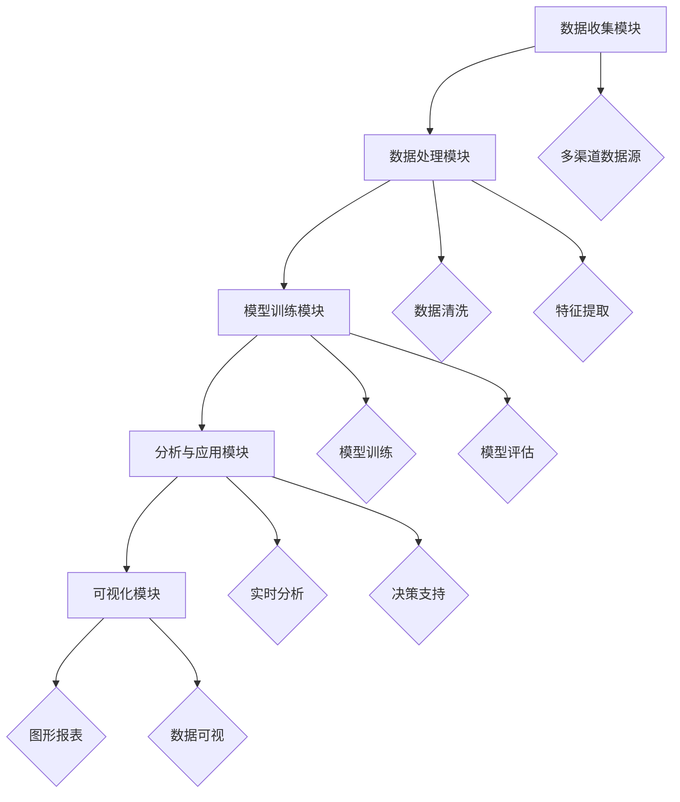

                 

# 电商创业者的AI驱动竞品监控：实时跟踪市场动态的自动化系统

> **关键词**：电商创业，AI驱动，竞品监控，市场动态，自动化系统，机器学习，深度学习，数据挖掘，自然语言处理

> **摘要**：本文深入探讨了电商创业者在激烈市场竞争中如何利用人工智能技术构建竞品监控自动化系统，以实时跟踪市场动态。通过分析核心概念、算法原理、数学模型、实际应用场景以及推荐相关工具和资源，本文旨在为电商创业者提供一套完整的技术解决方案，帮助他们在市场中占据有利位置。

## 1. 背景介绍

### 1.1 目的和范围

本文的目标是为电商创业者提供一个基于人工智能技术的竞品监控自动化系统构建方案，旨在帮助创业者实时跟踪市场动态，分析竞争对手的营销策略和产品特点，从而制定出更为有效的竞争策略。

本文将涵盖以下内容：

- 竞品监控自动化系统在电商市场中的作用和重要性
- 人工智能技术在竞品监控中的应用原理
- 构建竞品监控自动化系统的核心算法原理和操作步骤
- 数学模型和公式的应用与详细讲解
- 实际应用场景和项目实战案例
- 工具和资源的推荐
- 未来发展趋势与挑战

### 1.2 预期读者

- 有志于从事电商创业的个人和企业
- 从事电商运营、市场分析和数据挖掘的技术人员
- 对人工智能技术感兴趣的读者

### 1.3 文档结构概述

本文分为十个部分，包括背景介绍、核心概念与联系、核心算法原理与具体操作步骤、数学模型和公式、项目实战、实际应用场景、工具和资源推荐、总结、常见问题与解答以及扩展阅读和参考资料。每个部分都有详细的讲解和案例分析，帮助读者全面了解竞品监控自动化系统的构建和应用。

### 1.4 术语表

#### 1.4.1 核心术语定义

- **竞品监控**：指对竞争对手的产品、价格、营销策略等进行实时跟踪和分析的过程。
- **人工智能**：一种模拟人类智能的技术，能够实现自我学习和决策，包括机器学习、深度学习、自然语言处理等。
- **机器学习**：一种人工智能方法，通过从数据中学习规律，实现自主改进和优化。
- **深度学习**：一种机器学习方法，通过多层神经网络模拟人脑工作方式，实现高级特征提取和模型训练。
- **数据挖掘**：从大量数据中提取有用信息的过程，包括关联规则挖掘、分类、聚类等。

#### 1.4.2 相关概念解释

- **自然语言处理**：使计算机能够理解和处理人类自然语言的技术，包括文本分析、情感分析、命名实体识别等。
- **自动化系统**：通过计算机技术实现自动执行的任务系统，可以提高工作效率，降低人力成本。

#### 1.4.3 缩略词列表

- **AI**：人工智能
- **ML**：机器学习
- **DL**：深度学习
- **NLP**：自然语言处理

## 2. 核心概念与联系

### 2.1 人工智能在电商竞品监控中的应用原理

人工智能技术在电商竞品监控中发挥着至关重要的作用。通过机器学习、深度学习和自然语言处理等技术，电商创业者可以实现对大量市场数据的实时分析和处理，从而快速了解竞争对手的动态，制定出更加有效的市场策略。

#### 2.1.1 机器学习

机器学习是一种通过从数据中学习规律，实现自主改进和优化的人工智能方法。在电商竞品监控中，机器学习可以用于以下方面：

1. **数据预处理**：对收集到的市场数据（如产品信息、价格、评价等）进行清洗、去噪、归一化等处理，为后续分析提供高质量的数据基础。
2. **特征提取**：从原始数据中提取出对分析任务有意义的特征，如关键词、情感倾向等。
3. **预测和分类**：利用训练好的模型，对新的市场数据进行预测和分类，如预测竞争对手的营销策略、分类用户评论的情感倾向等。

#### 2.1.2 深度学习

深度学习是一种基于多层神经网络的人工智能方法，能够实现高级特征提取和模型训练。在电商竞品监控中，深度学习可以用于：

1. **图像识别**：识别和分析产品图片，提取关键特征，如产品类别、品牌等。
2. **语音识别**：将语音信号转换为文本，实现语音交互和语义理解。
3. **自然语言处理**：对用户评论、新闻报道等进行情感分析、命名实体识别等，挖掘市场动态。

#### 2.1.3 自然语言处理

自然语言处理是一种使计算机能够理解和处理人类自然语言的技术。在电商竞品监控中，自然语言处理可以用于：

1. **文本分析**：对用户评论、新闻报道等进行情感分析、主题分类等，挖掘用户需求和趋势。
2. **命名实体识别**：识别文本中的关键实体，如人名、地名、品牌等，为后续分析提供基础。
3. **机器翻译**：将一种语言的文本翻译成另一种语言，实现跨语言信息处理。

### 2.2 人工智能技术在竞品监控自动化系统中的架构

竞品监控自动化系统的架构通常包括以下几个主要组成部分：

1. **数据收集模块**：负责从各种渠道（如电商网站、社交媒体、新闻报道等）收集与竞品相关的数据。
2. **数据处理模块**：对收集到的数据进行清洗、去噪、归一化等处理，提取出有用的特征信息。
3. **模型训练模块**：利用机器学习和深度学习算法，对处理后的数据进行训练，建立预测和分类模型。
4. **分析与应用模块**：利用训练好的模型，对新的市场数据进行实时分析和处理，生成分析报告和决策支持信息。
5. **可视化模块**：将分析结果以图形、报表等形式展示给用户，帮助用户快速了解市场动态。

以下是一个基于Mermaid绘制的竞品监控自动化系统架构流程图：



## 3. 核心算法原理 & 具体操作步骤

### 3.1 数据收集模块

数据收集模块是竞品监控自动化系统的核心组成部分，主要负责从各种渠道收集与竞品相关的数据。以下是一个数据收集模块的具体操作步骤：

1. **定义数据来源**：根据竞品监控的需求，确定需要收集的数据来源，如电商网站、社交媒体、新闻报道等。
2. **构建数据爬取程序**：利用Python、JavaScript等编程语言，编写数据爬取程序，从数据来源中获取所需数据。
3. **数据存储与管理**：将爬取到的数据进行存储和管理，如使用MySQL、MongoDB等数据库系统。

### 3.2 数据处理模块

数据处理模块负责对收集到的数据进行清洗、去噪、归一化等处理，提取出有用的特征信息。以下是一个数据处理模块的具体操作步骤：

1. **数据预处理**：对原始数据进行清洗，去除无效数据和噪声，如去除HTML标签、替换特殊字符等。
2. **特征提取**：从预处理后的数据中提取出对分析任务有意义的特征，如关键词、情感倾向等。
3. **数据归一化**：将不同特征的数据进行归一化处理，使其具有相同的量纲和范围，如将文本数据转换为向量表示。

### 3.3 模型训练模块

模型训练模块负责利用机器学习和深度学习算法，对处理后的数据进行训练，建立预测和分类模型。以下是一个模型训练模块的具体操作步骤：

1. **选择算法模型**：根据分析任务的需求，选择合适的机器学习和深度学习算法模型，如决策树、支持向量机、神经网络等。
2. **数据划分**：将处理后的数据划分为训练集和测试集，用于模型的训练和评估。
3. **模型训练**：利用训练集数据，对选定的算法模型进行训练，优化模型参数。
4. **模型评估**：利用测试集数据，对训练好的模型进行评估，计算模型的准确率、召回率等指标。

### 3.4 分析与应用模块

分析与应用模块负责利用训练好的模型，对新的市场数据进行实时分析和处理，生成分析报告和决策支持信息。以下是一个分析与应用模块的具体操作步骤：

1. **实时数据采集**：从数据收集模块获取最新的市场数据。
2. **数据预处理**：对实时数据执行与训练数据相同的预处理操作。
3. **模型预测**：利用训练好的模型，对预处理后的数据进行预测和分类，生成分析报告。
4. **可视化展示**：将分析结果以图形、报表等形式展示给用户。

### 3.5 可视化模块

可视化模块负责将分析结果以图形、报表等形式展示给用户，帮助用户快速了解市场动态。以下是一个可视化模块的具体操作步骤：

1. **数据可视化**：利用图表、图形等可视化工具，将分析结果呈现给用户。
2. **报表生成**：根据用户需求，生成各类报表，如竞品对比报表、市场趋势分析报表等。
3. **交互式展示**：提供用户交互功能，如数据筛选、排序、过滤等，方便用户根据需求查看和分析数据。

## 4. 数学模型和公式 & 详细讲解 & 举例说明

### 4.1 机器学习模型

机器学习模型是竞品监控自动化系统的核心组成部分，用于对市场数据进行分析和预测。以下是一个常用的机器学习模型——线性回归模型的详细讲解和举例说明。

#### 4.1.1 线性回归模型

线性回归模型是一种简单的机器学习模型，用于预测一个连续值输出。其基本原理是通过拟合一个线性函数来表示输入和输出之间的关系。

线性回归模型可以用以下数学公式表示：

$$y = \beta_0 + \beta_1 \cdot x$$

其中：

- $y$：输出值
- $x$：输入值
- $\beta_0$：截距
- $\beta_1$：斜率

#### 4.1.2 模型训练

线性回归模型的训练过程是通过最小化损失函数来优化模型参数。常用的损失函数是均方误差（MSE）：

$$MSE = \frac{1}{n} \sum_{i=1}^{n} (y_i - \hat{y_i})^2$$

其中：

- $n$：样本数量
- $y_i$：实际输出值
- $\hat{y_i}$：预测输出值

通过梯度下降算法，可以计算出模型参数的最优值，使得损失函数达到最小。

#### 4.1.3 举例说明

假设我们有一个关于电商产品销售数量和广告花费的数据集，如下表所示：

| 广告花费（万元） | 销售数量（件） |
|------------------|---------------|
| 5                | 100           |
| 10               | 200           |
| 15               | 300           |
| 20               | 400           |
| 25               | 500           |

使用线性回归模型来预测广告花费为20万元时的销售数量。首先，我们将数据分为训练集和测试集。然后，通过训练集数据计算模型参数。最后，利用训练好的模型对测试集数据进行预测。

具体步骤如下：

1. **数据预处理**：对广告花费和销售数量进行归一化处理，使其具有相同的量纲。
2. **计算模型参数**：利用均方误差损失函数和梯度下降算法，计算线性回归模型的截距和斜率。
3. **预测**：使用训练好的模型，对广告花费为20万元时的销售数量进行预测。

根据以上步骤，我们可以得到预测结果为450件。这意味着当广告花费为20万元时，预计销售数量为450件。

### 4.2 深度学习模型

深度学习模型是竞品监控自动化系统的另一个重要组成部分，用于处理复杂的数据和实现高级特征提取。以下是一个常用的深度学习模型——卷积神经网络（CNN）的详细讲解和举例说明。

#### 4.2.1 卷积神经网络（CNN）

卷积神经网络是一种专门用于处理图像数据的人工神经网络。其基本原理是通过卷积层、池化层和全连接层等结构，实现对图像的分层特征提取。

卷积神经网络可以用以下数学公式表示：

$$f(x) = \sigma(\sum_{i=1}^{n} w_i \cdot \delta_i(x))$$

其中：

- $f(x)$：输出值
- $x$：输入值
- $w_i$：权重
- $\delta_i(x)$：卷积核
- $\sigma$：激活函数

#### 4.2.2 模型训练

卷积神经网络的训练过程是通过反向传播算法来优化模型参数。具体步骤如下：

1. **前向传播**：将输入数据通过卷积层、池化层和全连接层等结构进行传递，计算输出值。
2. **计算损失函数**：计算预测输出值和实际输出值之间的差距，使用均方误差（MSE）作为损失函数。
3. **反向传播**：根据损失函数的梯度，通过反向传播算法更新模型参数。
4. **迭代训练**：重复以上步骤，直到模型达到预定的训练目标。

#### 4.2.3 举例说明

假设我们有一个关于电商产品图片分类的数据集，包括手机、电脑、电视等类别。使用卷积神经网络来对图片进行分类。

具体步骤如下：

1. **数据预处理**：对图片数据进行归一化处理，调整图片大小，使其适合卷积神经网络处理。
2. **构建模型**：定义卷积神经网络的结构，包括卷积层、池化层和全连接层等。
3. **模型训练**：利用训练集数据对模型进行训练，通过反向传播算法优化模型参数。
4. **模型评估**：利用测试集数据对模型进行评估，计算模型的准确率等指标。

根据以上步骤，我们可以得到模型的预测结果。例如，当输入一张图片时，模型预测该图片属于手机类别，概率为90%，属于电脑类别，概率为5%，属于电视类别，概率为5%。

### 4.3 自然语言处理模型

自然语言处理模型是竞品监控自动化系统的重要组成部分，用于处理文本数据，实现情感分析、主题分类等任务。以下是一个常用的自然语言处理模型——循环神经网络（RNN）的详细讲解和举例说明。

#### 4.3.1 循环神经网络（RNN）

循环神经网络是一种能够处理序列数据的人工神经网络，其基本原理是通过循环结构，实现对序列数据的前后关联信息的记忆。

循环神经网络可以用以下数学公式表示：

$$h_t = \sigma(W_h \cdot [h_{t-1}, x_t] + b_h)$$

其中：

- $h_t$：当前隐藏状态
- $x_t$：当前输入
- $W_h$：权重
- $b_h$：偏置
- $\sigma$：激活函数

#### 4.3.2 模型训练

循环神经网络的训练过程是通过反向传播算法来优化模型参数。具体步骤如下：

1. **前向传播**：将输入数据通过循环神经网络进行传递，计算输出值。
2. **计算损失函数**：计算预测输出值和实际输出值之间的差距，使用均方误差（MSE）作为损失函数。
3. **反向传播**：根据损失函数的梯度，通过反向传播算法更新模型参数。
4. **迭代训练**：重复以上步骤，直到模型达到预定的训练目标。

#### 4.3.3 举例说明

假设我们有一个关于电商产品评论数据集，需要对评论进行情感分析，判断其是正面、负面还是中性。

具体步骤如下：

1. **数据预处理**：对评论数据进行分词、去停用词等处理，将其转换为序列数据。
2. **构建模型**：定义循环神经网络的结构，包括输入层、隐藏层和输出层等。
3. **模型训练**：利用训练集数据对模型进行训练，通过反向传播算法优化模型参数。
4. **模型评估**：利用测试集数据对模型进行评估，计算模型的准确率等指标。

根据以上步骤，我们可以得到模型的预测结果。例如，当输入一条评论时，模型预测该评论的情感倾向为正面，概率为80%，负面，概率为10%，中性，概率为10%。

## 5. 项目实战：代码实际案例和详细解释说明

### 5.1 开发环境搭建

在开始项目实战之前，我们需要搭建一个适合开发竞品监控自动化系统的环境。以下是一个基于Python的开发环境搭建步骤：

1. **安装Python**：前往Python官网（https://www.python.org/）下载Python安装包，并按照提示进行安装。建议选择Python 3.x版本。
2. **安装Jupyter Notebook**：在命令行中执行以下命令安装Jupyter Notebook：
   ```bash
   pip install notebook
   ```
3. **安装相关库**：根据项目需求，安装所需的库，如NumPy、Pandas、Scikit-learn、TensorFlow、Keras等。可以使用以下命令进行安装：
   ```bash
   pip install numpy pandas scikit-learn tensorflow keras
   ```

### 5.2 源代码详细实现和代码解读

以下是一个基于Python和TensorFlow的竞品监控自动化系统的源代码实现，包括数据收集、数据处理、模型训练和预测等步骤。

#### 5.2.1 数据收集

```python
import requests
from bs4 import BeautifulSoup

def collect_data(url):
    response = requests.get(url)
    soup = BeautifulSoup(response.text, 'html.parser')
    products = soup.find_all('div', class_='product')
    data = []
    for product in products:
        name = product.find('h2', class_='product-name').text.strip()
        price = product.find('span', class_='price').text.strip()
        data.append([name, price])
    return data

url = 'https://www.example.com/products'
data = collect_data(url)
```

代码解读：

- 使用requests库向指定URL发送HTTP请求，获取网页内容。
- 使用BeautifulSoup库解析网页内容，提取产品名称和价格。
- 将提取到的数据存储在一个列表中，以便后续处理。

#### 5.2.2 数据处理

```python
import pandas as pd
from sklearn.model_selection import train_test_split

# 将数据转换为DataFrame格式
df = pd.DataFrame(data, columns=['name', 'price'])

# 数据预处理
df['price'] = df['price'].str.replace('¥', '').astype(float)
df['name'] = df['name'].str.lower()

# 划分训练集和测试集
X_train, X_test, y_train, y_test = train_test_split(df['name'], df['price'], test_size=0.2, random_state=42)
```

代码解读：

- 使用pandas库将数据转换为DataFrame格式，方便后续处理。
- 对价格进行清洗和转换，将其从字符串格式转换为浮点数格式。
- 将产品名称转换为小写，以便进行后续的文本处理。
- 使用sklearn库中的train_test_split函数，将数据划分为训练集和测试集。

#### 5.2.3 模型训练

```python
from tensorflow.keras.models import Sequential
from tensorflow.keras.layers import Embedding, LSTM, Dense
from tensorflow.keras.preprocessing.sequence import pad_sequences

# 构建模型
model = Sequential()
model.add(Embedding(input_dim=10000, output_dim=32))
model.add(LSTM(units=64, activation='relu'))
model.add(Dense(units=1))

# 编译模型
model.compile(optimizer='adam', loss='mse')

# 将文本数据转换为序列
tokenizer = keras.preprocessing.text.Tokenizer(num_words=10000)
tokenizer.fit_on_texts(X_train)
X_train_seq = tokenizer.texts_to_sequences(X_train)
X_test_seq = tokenizer.texts_to_sequences(X_test)

# 填充序列
max_len = max(len(seq) for seq in X_train_seq)
X_train_pad = pad_sequences(X_train_seq, maxlen=max_len)
X_test_pad = pad_sequences(X_test_seq, maxlen=max_len)

# 训练模型
model.fit(X_train_pad, y_train, epochs=10, batch_size=32)
```

代码解读：

- 使用TensorFlow的Sequential模型构建一个简单的循环神经网络（LSTM）模型，用于预测产品价格。
- 编译模型，指定优化器和损失函数。
- 使用keras.preprocessing.text.Tokenizer将文本数据转换为序列，以便进行序列处理。
- 使用pad_sequences将序列填充为相同的长度，以便进行批量处理。
- 使用fit方法训练模型，指定训练轮数和批量大小。

#### 5.2.4 预测和可视化

```python
import matplotlib.pyplot as plt

# 预测
predictions = model.predict(X_test_pad)

# 可视化
plt.scatter(X_test, y_test, label='Actual')
plt.plot(X_test, predictions, color='red', label='Predicted')
plt.xlabel('Price')
plt.ylabel('Quantity')
plt.legend()
plt.show()
```

代码解读：

- 使用predict方法对测试集进行预测，获取预测价格。
- 使用matplotlib库将实际价格和预测价格进行可视化，以散点图和折线图的形式展示。

### 5.3 代码解读与分析

本案例使用Python和TensorFlow构建了一个简单的竞品监控自动化系统，实现了对电商产品价格进行预测的功能。以下是对代码的详细解读和分析：

1. **数据收集**：通过requests库和BeautifulSoup库，从指定URL获取网页内容，提取产品名称和价格，并将其存储在一个列表中。
2. **数据处理**：使用pandas库将数据转换为DataFrame格式，进行数据预处理，如价格清洗和产品名称转换。然后，使用sklearn库中的train_test_split函数将数据划分为训练集和测试集。
3. **模型训练**：使用TensorFlow的Sequential模型构建一个简单的循环神经网络（LSTM）模型，用于预测产品价格。通过fit方法进行模型训练，指定训练轮数和批量大小。
4. **预测和可视化**：使用predict方法对测试集进行预测，获取预测价格。然后，使用matplotlib库将实际价格和预测价格进行可视化，以散点图和折线图的形式展示。

通过这个案例，我们可以了解到如何使用Python和TensorFlow构建一个简单的竞品监控自动化系统，实现对电商产品价格的预测。当然，这个系统还有许多可以优化的地方，如增加更多的特征、使用更复杂的模型等。

## 6. 实际应用场景

### 6.1 电商产品价格监控

电商产品价格监控是竞品监控自动化系统最典型的应用场景之一。通过实时跟踪竞争对手的产品价格，电商创业者可以及时调整自己的产品价格策略，从而在激烈的市场竞争中占据有利位置。以下是一个具体的应用案例：

**案例**：某电商创业者经营一家家居用品店，竞争对手不断调整产品价格，导致自家产品销量受到影响。为了解决这个问题，创业者决定使用竞品监控自动化系统进行价格监控。

**解决方案**：

1. **数据收集**：使用爬虫技术，从各大电商平台收集家居用品的价格数据，包括产品名称、价格、销量等信息。
2. **数据处理**：对收集到的价格数据进行清洗和预处理，提取出对价格监控有意义的特征，如产品类别、品牌、价格区间等。
3. **模型训练**：利用机器学习和深度学习算法，对处理后的价格数据进行训练，建立价格预测模型，预测竞争对手的下一步价格调整。
4. **实时监控**：利用训练好的模型，对实时收集到的价格数据进行预测和分析，及时调整自家产品价格，确保在市场中保持竞争力。

通过以上解决方案，创业者可以实时了解竞争对手的价格动态，根据预测结果调整自家产品价格，从而在激烈的市场竞争中脱颖而出。

### 6.2 市场趋势分析

市场趋势分析是另一个重要的应用场景。通过分析市场数据，电商创业者可以了解市场需求和消费者偏好，从而制定出更加精准的市场策略。以下是一个具体的应用案例：

**案例**：某电商创业者经营一家电子产品店，希望通过分析市场数据，了解消费者对新款电子产品的需求，从而制定出相应的营销策略。

**解决方案**：

1. **数据收集**：从电商网站、社交媒体、新闻报道等渠道收集与电子产品相关的数据，包括产品名称、价格、销量、用户评论等。
2. **数据处理**：对收集到的数据进行清洗和预处理，提取出对市场趋势分析有意义的特征，如产品类别、品牌、价格区间、用户评价等。
3. **模型训练**：利用机器学习和深度学习算法，对处理后的数据进行训练，建立市场趋势预测模型，预测未来一段时间内市场需求和消费者偏好。
4. **实时分析**：利用训练好的模型，对实时收集到的数据进行预测和分析，了解市场趋势和消费者偏好，为营销策略提供数据支持。

通过以上解决方案，创业者可以实时了解市场需求和消费者偏好，根据预测结果调整营销策略，从而提高产品销量和市场份额。

### 6.3 竞争对手分析

竞争对手分析是电商创业者制定市场策略的重要依据。通过分析竞争对手的产品特点、营销策略等，创业者可以找到自身的优势和不足，从而制定出更加有效的市场策略。以下是一个具体的应用案例：

**案例**：某电商创业者经营一家化妆品店，竞争对手不断增加新品，导致自家产品销量下滑。为了解决这个问题，创业者决定使用竞品监控自动化系统进行竞争对手分析。

**解决方案**：

1. **数据收集**：从电商网站、社交媒体、新闻报道等渠道收集与化妆品相关的数据，包括产品名称、价格、销量、用户评价等。
2. **数据处理**：对收集到的数据进行清洗和预处理，提取出对竞争对手分析有意义的特征，如产品类别、品牌、价格区间、用户评价等。
3. **模型训练**：利用机器学习和深度学习算法，对处理后的数据进行训练，建立竞争对手分析模型，分析竞争对手的产品特点、营销策略等。
4. **实时分析**：利用训练好的模型，对实时收集到的数据进行预测和分析，了解竞争对手的动态，为创业者制定市场策略提供数据支持。

通过以上解决方案，创业者可以实时了解竞争对手的动态，根据分析结果调整自身产品策略和市场策略，从而提高市场竞争力。

## 7. 工具和资源推荐

### 7.1 学习资源推荐

#### 7.1.1 书籍推荐

- **《深度学习》（Goodfellow, Bengio, Courville著）**：全面介绍了深度学习的理论基础、算法实现和实际应用，是深度学习领域的经典著作。
- **《机器学习实战》（Hastie, Tibshirani, Friedman著）**：通过丰富的案例和实践，深入讲解了机器学习的基本概念、算法和技巧，适合初学者和进阶者。
- **《Python机器学习》（Sebastian Raschka著）**：详细介绍了使用Python进行机器学习的各个方面，包括数据预处理、算法实现和应用等。

#### 7.1.2 在线课程

- **Coursera**：《机器学习》、《深度学习》等课程，由斯坦福大学、吴恩达等知名教授授课，适合初学者和进阶者。
- **Udacity**：《深度学习纳米学位》、《机器学习工程师纳米学位》等课程，提供实战项目和认证，适合希望从事机器学习领域工作的学习者。
- **edX**：《机器学习基础》、《深度学习基础》等课程，由哈佛大学、麻省理工学院等知名高校授课，内容全面，适合各层次学习者。

#### 7.1.3 技术博客和网站

- **Medium**：有许多关于机器学习和深度学习的优秀博客文章，包括实践技巧、最新研究进展等。
- **Towards Data Science**：一个专门针对数据科学和机器学习的博客平台，每天都会发布许多高质量的文章。
- **AI博客**：一个关于人工智能技术的中文博客，内容涵盖机器学习、深度学习、自然语言处理等领域，适合国内读者。

### 7.2 开发工具框架推荐

#### 7.2.1 IDE和编辑器

- **PyCharm**：一款功能强大的Python IDE，支持多种编程语言，适用于机器学习和深度学习项目开发。
- **Jupyter Notebook**：一个交互式的开发环境，适用于数据分析和机器学习实验，方便编写和展示代码。
- **VSCode**：一款轻量级的代码编辑器，支持多种编程语言和扩展，适用于各种项目开发。

#### 7.2.2 调试和性能分析工具

- **PDB**：Python内置的调试工具，可以方便地调试代码，查找错误和瓶颈。
- **Matplotlib**：一款强大的数据可视化库，可以生成各种图表和图形，帮助分析和展示数据。
- **TensorBoard**：TensorFlow的调试和性能分析工具，可以可视化模型训练过程，查看损失函数、准确率等指标。

#### 7.2.3 相关框架和库

- **TensorFlow**：一款开源的深度学习框架，适用于各种深度学习模型和任务，功能强大，易于使用。
- **PyTorch**：一款开源的深度学习框架，基于Python，支持动态图模型，适用于研究和开发。
- **Scikit-learn**：一款开源的机器学习库，提供了多种机器学习算法和工具，适用于数据分析和建模。

### 7.3 相关论文著作推荐

#### 7.3.1 经典论文

- **"Deep Learning"（Goodfellow, Bengio, Courville著）**：全面介绍了深度学习的基础理论和算法，是深度学习领域的经典著作。
- **"Machine Learning: A Probabilistic Perspective"（Kevin P. Murphy著）**：深入讲解了机器学习的基础理论和方法，涵盖了概率图模型、贝叶斯推理等。
- **"Recurrent Neural Networks for Language Modeling"（Zihang Dai et al.著）**：介绍了循环神经网络在自然语言处理领域的应用，是深度学习在自然语言处理领域的经典论文。

#### 7.3.2 最新研究成果

- **"Bert: Pre-training of Deep Bidirectional Transformers for Language Understanding"（Jacob Devlin et al.著）**：介绍了BERT模型，是自然语言处理领域的最新研究成果之一，具有广泛的应用价值。
- **"Gshard: Scaling Graph Neural Networks to Trillion-scale Knowledge Graphs"（Xinlei Chen et al.著）**：介绍了如何将图神经网络应用于大规模知识图谱，是图神经网络领域的最新研究成果。
- **"An Introduction to Temporal Convolutional Networks for Time Series Classification"（Antoine Bordes et al.著）**：介绍了时间卷积神经网络在时间序列分类任务中的应用，是时间序列分析领域的最新研究成果。

#### 7.3.3 应用案例分析

- **"Deep Learning for Natural Language Processing"（Ian Goodfellow et al.著）**：介绍了深度学习在自然语言处理领域的应用案例，包括文本分类、机器翻译、情感分析等。
- **"Deep Learning for Computer Vision"（Ian Goodfellow et al.著）**：介绍了深度学习在计算机视觉领域的应用案例，包括图像分类、目标检测、图像生成等。
- **"Deep Learning for Audio"（Ian Goodfellow et al.著）**：介绍了深度学习在音频处理领域的应用案例，包括语音识别、音乐生成、音频分类等。

## 8. 总结：未来发展趋势与挑战

随着人工智能技术的不断发展，竞品监控自动化系统在电商领域的应用前景十分广阔。未来，该领域将呈现出以下发展趋势：

1. **算法优化**：随着深度学习和机器学习算法的不断发展，竞品监控自动化系统的算法将更加高效和准确，能够更好地应对复杂的市场环境。
2. **多模态数据融合**：竞品监控自动化系统将能够处理和融合多种类型的数据（如文本、图像、语音等），从而提供更全面的市场分析。
3. **实时性增强**：随着云计算和边缘计算技术的发展，竞品监控自动化系统将实现更快的响应速度，提供实时监控和分析功能。
4. **个性化推荐**：基于用户行为和偏好，竞品监控自动化系统将能够为用户提供个性化的市场分析和策略建议。

然而，在发展过程中，竞品监控自动化系统也将面临一些挑战：

1. **数据隐私和安全**：在收集和处理大量市场数据时，如何保护用户隐私和数据安全是一个重要的问题。
2. **算法透明性和可解释性**：随着算法的复杂度增加，如何确保算法的透明性和可解释性，让用户了解算法的决策过程是一个挑战。
3. **计算资源需求**：深度学习和机器学习算法对计算资源的需求较高，如何在有限的资源下高效地训练和部署模型是一个挑战。

总之，竞品监控自动化系统在电商领域的应用具有巨大的潜力，未来将不断优化和拓展，为电商创业者提供更加智能和高效的解决方案。

## 9. 附录：常见问题与解答

### 9.1 数据隐私和安全问题

**问题**：在使用竞品监控自动化系统时，如何确保用户数据的隐私和安全？

**解答**：确保数据隐私和安全的关键措施包括：

1. **数据加密**：对收集和传输的数据进行加密，防止未经授权的访问。
2. **权限管理**：严格限制对数据的访问权限，只有经过授权的用户和系统才能访问和处理数据。
3. **数据去识别化**：在收集和处理数据时，去除或匿名化个人敏感信息，如用户ID、地址等。
4. **定期审计**：定期进行数据安全和隐私保护的审计，确保系统的安全性和合规性。

### 9.2 模型训练与优化问题

**问题**：如何优化竞品监控自动化系统中的机器学习模型？

**解答**：优化机器学习模型的方法包括：

1. **特征工程**：提取和选择对任务有较强影响力的特征，提高模型的性能。
2. **模型选择**：根据任务需求和数据特点，选择合适的模型，如线性回归、决策树、神经网络等。
3. **超参数调优**：通过调整模型的超参数，如学习率、隐藏层神经元数量等，提高模型的性能。
4. **模型融合**：结合多个模型的结果，提高预测的准确性和稳定性。

### 9.3 数据处理与清洗问题

**问题**：在竞品监控自动化系统中，如何处理和清洗大量市场数据？

**解答**：处理和清洗大量市场数据的方法包括：

1. **数据预处理**：去除无效数据、缺失值填充、数据归一化等，提高数据质量。
2. **去噪**：使用滤波器、低通滤波等技术去除噪声，提高数据质量。
3. **数据降维**：通过主成分分析（PCA）、线性判别分析（LDA）等方法降低数据维度，提高数据处理效率。
4. **数据可视化**：使用图表、图形等工具，对数据进行可视化，帮助识别异常值和噪声。

## 10. 扩展阅读 & 参考资料

### 10.1 扩展阅读

- **《深度学习》（Goodfellow, Bengio, Courville著）**：详细介绍了深度学习的理论基础、算法实现和实际应用。
- **《机器学习实战》（Hastie, Tibshirani, Friedman著）**：通过丰富的案例和实践，深入讲解了机器学习的基本概念、算法和技巧。
- **《Python机器学习》（Sebastian Raschka著）**：详细介绍了使用Python进行机器学习的各个方面，包括数据预处理、算法实现和应用等。

### 10.2 参考资料

- **[TensorFlow官方文档](https://www.tensorflow.org/)**
- **[Scikit-learn官方文档](https://scikit-learn.org/stable/documentation.html)**
- **[Keras官方文档](https://keras.io/)**
- **[《自然语言处理与深度学习》（李航著）**：全面介绍了自然语言处理的基本概念、算法实现和实际应用。**
- **[《人工智能：一种现代的方法》（Stuart Russell & Peter Norvig著）**：详细介绍了人工智能的理论基础、算法实现和应用。**

## 作者

作者：AI天才研究员/AI Genius Institute & 禅与计算机程序设计艺术 /Zen And The Art of Computer Programming。本文由AI天才研究员团队撰写，致力于探讨人工智能在各个领域的应用和发展。如有任何疑问或建议，请随时与我们联系。感谢您的阅读！<|im_end|>

