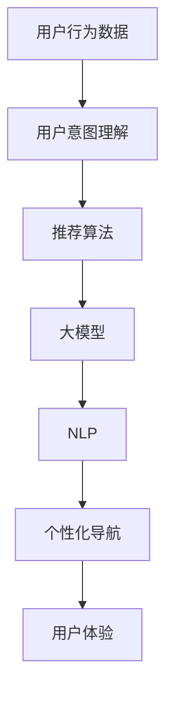

                 

# 电商平台个性化导航：AI大模型的用户意图理解与预测

## 关键词

- 电商平台
- 个性化导航
- AI 大模型
- 用户意图理解
- 预测
- 自然语言处理
- 强化学习

## 摘要

本文深入探讨了电商平台个性化导航的实现机制，特别是利用人工智能大模型进行用户意图理解与预测的技术。通过对用户行为的分析，结合自然语言处理和强化学习算法，本文详细阐述了如何构建高效、准确的个性化导航系统，从而提升用户体验和电商平台的运营效率。文章分为多个章节，包括背景介绍、核心概念与联系、算法原理与操作步骤、数学模型与公式、项目实战、实际应用场景等，旨在为读者提供一个全面的技术指南。

<|editor|>## 1. 背景介绍

### 1.1 目的和范围

在当今数字化时代，电商平台作为电子商务的核心载体，已经成为人们日常生活不可或缺的一部分。随着市场竞争的加剧，如何提升用户满意度、降低用户流失率、提高销售额成为电商企业面临的重大挑战。个性化导航作为一种重要的用户体验优化手段，正日益受到电商平台的高度重视。

本文旨在探讨如何利用人工智能大模型技术，实现电商平台个性化导航的系统构建。具体来说，我们将从用户意图理解与预测的角度，深入分析个性化导航的原理、方法和技术实现，以期为电商平台提供一套高效、可靠的解决方案。

### 1.2 预期读者

本文预期读者主要包括以下几类：

1. 电商平台技术团队和管理层：了解个性化导航技术及其在电商中的应用，有助于提升企业技术水平和运营效果。
2. 人工智能和大数据领域的专业人士：通过本文，可以进一步了解人工智能大模型在电商场景中的实际应用，拓宽技术视野。
3. 对人工智能和电商有兴趣的广大读者：本文将用通俗易懂的语言，详细讲解个性化导航的原理和实践，适合广大科技爱好者和研究人员阅读。

### 1.3 文档结构概述

本文分为以下几个主要部分：

1. **背景介绍**：简要介绍电商平台个性化导航的重要性和研究背景。
2. **核心概念与联系**：阐述个性化导航相关核心概念及其相互关系。
3. **核心算法原理 & 具体操作步骤**：详细讲解用户意图理解与预测算法的原理和操作步骤。
4. **数学模型和公式 & 详细讲解 & 举例说明**：介绍相关数学模型和公式，并进行举例说明。
5. **项目实战：代码实际案例和详细解释说明**：通过实际项目案例，展示个性化导航系统的实现过程。
6. **实际应用场景**：分析个性化导航在电商领域的具体应用场景。
7. **工具和资源推荐**：推荐相关学习资源和开发工具。
8. **总结：未来发展趋势与挑战**：总结个性化导航技术的发展趋势和面临的挑战。
9. **附录：常见问题与解答**：回答读者可能遇到的一些常见问题。
10. **扩展阅读 & 参考资料**：提供更多扩展阅读资料和参考文献。

### 1.4 术语表

#### 1.4.1 核心术语定义

- 个性化导航：根据用户的历史行为和偏好，自动推荐用户可能感兴趣的商品或服务。
- 用户意图理解：通过分析用户行为数据，理解用户的购买意图和需求。
- 大模型（AI 大模型）：拥有大量参数和强大计算能力的深度学习模型。
- 自然语言处理（NLP）：使计算机能够理解、生成和处理人类语言的技术。
- 强化学习：一种通过试错和学习优化决策过程的机器学习技术。

#### 1.4.2 相关概念解释

- **推荐系统**：基于用户历史行为和偏好，自动推荐商品或服务的系统。
- **用户行为分析**：对用户的浏览、搜索、购买等行为进行分析，以了解用户需求和偏好。
- **数据挖掘**：从大量数据中提取有价值的信息和模式。

#### 1.4.3 缩略词列表

- NLP：自然语言处理
- AI：人工智能
- DNN：深度神经网络
- CNN：卷积神经网络
- RNN：循环神经网络
- RL：强化学习
- SVG：可缩放矢量图形
- JSON：JavaScript 对象表示法
- API：应用程序编程接口

<|editor|>## 2. 核心概念与联系

个性化导航是电商平台提升用户体验和运营效率的关键技术之一。要实现有效的个性化导航，我们需要理解以下几个核心概念：

1. **用户行为数据**：包括用户的浏览历史、搜索记录、购买行为等。
2. **用户意图理解**：通过分析用户行为数据，识别用户的潜在需求和购买意图。
3. **推荐算法**：基于用户意图理解和用户偏好，为用户推荐相关商品或服务。
4. **大模型**：拥有大量参数和强大计算能力的深度学习模型，如 DNN、CNN、RNN 等。
5. **自然语言处理（NLP）**：用于理解和生成人类语言的技术。

下面我们将使用 Mermaid 流程图来展示个性化导航的核心概念和相互关系。



### 2.1 用户行为数据

用户行为数据是构建个性化导航系统的基石。这些数据包括用户的浏览历史、搜索记录、购买行为、评论、分享等。通过对这些数据的收集和分析，我们可以了解用户的需求和偏好，为个性化推荐提供依据。

### 2.2 用户意图理解

用户意图理解是关键环节，它通过分析用户行为数据，识别用户的潜在需求和购买意图。这通常涉及自然语言处理技术和机器学习算法，如情感分析、词向量模型、序列模型等。

### 2.3 推荐算法

推荐算法基于用户意图理解和用户偏好，为用户推荐相关商品或服务。常见的推荐算法包括基于内容的推荐、基于协同过滤的推荐、混合推荐等。这些算法通过分析用户历史行为和商品特征，预测用户对某个商品的兴趣程度，从而生成推荐列表。

### 2.4 大模型

大模型在个性化导航中发挥着重要作用。这些模型通常具有数百万甚至数十亿个参数，可以通过深度学习算法进行训练，从而实现高效的用户意图理解和推荐生成。例如，深度神经网络（DNN）、卷积神经网络（CNN）和循环神经网络（RNN）等都是常见的大模型。

### 2.5 自然语言处理（NLP）

自然语言处理是理解和生成人类语言的技术。在个性化导航中，NLP 技术用于分析和理解用户的行为数据，提取关键信息，如关键词、情感倾向等。常见的 NLP 算法包括词向量模型（如 Word2Vec、GloVe）、情感分析、实体识别、句法分析等。

通过上述核心概念和相互关系的理解，我们可以构建一个高效的个性化导航系统，从而提升用户体验和电商平台运营效率。

<|editor|>## 3. 核心算法原理 & 具体操作步骤

### 3.1 用户意图理解算法原理

用户意图理解是构建个性化导航系统的关键步骤，其核心目标是通过分析用户的历史行为数据，识别用户的潜在需求和购买意图。以下是用户意图理解算法的基本原理和具体操作步骤：

#### 3.1.1 数据预处理

1. **数据收集**：收集用户的历史行为数据，包括浏览历史、搜索记录、购买行为、评论等。
2. **数据清洗**：去除无效数据、缺失值和噪声数据，保证数据质量。
3. **特征提取**：将原始数据转换为数值特征，如用户ID、商品ID、时间戳、行为类型等。

#### 3.1.2 用户行为模式分析

1. **行为序列建模**：使用序列模型（如循环神经网络 RNN、长短期记忆网络 LSTM）对用户行为序列进行建模，提取用户行为的时序特征。
2. **关联规则挖掘**：利用关联规则挖掘算法（如 Apriori 算法、FP-Growth 算法），分析用户行为之间的关联性，识别用户感兴趣的商品组合。

#### 3.1.3 情感分析

1. **文本预处理**：对用户评论、标签等文本数据进行预处理，如分词、停用词过滤、词性标注等。
2. **情感分类**：使用情感分析算法（如基于词向量的情感分类模型）对用户评论进行情感分类，识别用户对商品的正面或负面情感。

#### 3.1.4 模型训练与预测

1. **特征融合**：将行为序列特征、关联规则特征和情感分析特征进行融合，构建用户意图理解模型。
2. **模型训练**：使用机器学习算法（如决策树、支持向量机、神经网络）对模型进行训练。
3. **意图预测**：输入新的用户行为数据，通过训练好的模型预测用户的购买意图。

### 3.2 预测算法原理

预测算法的目标是根据用户意图理解的结果，为用户推荐相关商品或服务。以下是预测算法的基本原理和具体操作步骤：

#### 3.2.1 商品特征提取

1. **商品描述解析**：从商品标题、描述、标签等文本信息中提取关键词和特征。
2. **特征工程**：对提取的关键词和特征进行处理，如词向量编码、特征降维等。

#### 3.2.2 相似度计算

1. **基于内容的相似度计算**：计算用户意图（行为数据）和商品特征之间的相似度，如使用余弦相似度、欧氏距离等。
2. **基于协同过滤的相似度计算**：计算用户之间的相似度或商品之间的相似度，如使用矩阵分解、K-最近邻等算法。

#### 3.2.3 推荐生成

1. **候选集生成**：根据用户意图和商品特征，从商品数据库中生成候选集。
2. **排序与筛选**：对候选集进行排序和筛选，选出最相关的前N个商品作为推荐结果。

### 3.3 案例演示

以下是一个简化的用户意图理解与预测算法的伪代码示例：

```python
# 用户意图理解算法伪代码
def user_intent_understanding(user_behavior_data):
    # 数据预处理
    processed_data = preprocess_data(user_behavior_data)
    
    # 行为序列建模
    behavior_sequence = build_behavior_sequence(processed_data)
    
    # 关联规则挖掘
    associations = apriori(behavior_sequence)
    
    # 情感分析
    sentiment = sentiment_analysis(processed_data['comments'])
    
    # 特征融合
    fused_features = fuse_features(behavior_sequence, associations, sentiment)
    
    # 模型训练
    model = train_model(fused_features)
    
    # 意图预测
    intent = model.predict(new_user_behavior_data)
    return intent

# 预测算法伪代码
def predict_recommendations(user_intent,商品特征):
    # 相似度计算
    similarity_scores = compute_similarity(user_intent,商品特征)
    
    # 推荐生成
    recommendations = generate_recommendations(similarity_scores)
    return recommendations
```

通过上述算法原理和操作步骤，我们可以构建一个高效、准确的个性化导航系统，从而提升用户满意度和电商平台运营效率。

<|editor|>## 4. 数学模型和公式 & 详细讲解 & 举例说明

### 4.1 数学模型简介

在个性化导航系统中，数学模型扮演着至关重要的角色。这些模型不仅帮助我们理解和预测用户意图，还驱动推荐算法的优化和改进。本文将介绍几个关键的数学模型，包括线性回归、逻辑回归、词向量模型和强化学习模型。

### 4.2 线性回归

线性回归是一种基本的预测模型，用于分析两个或多个变量之间的关系。其数学公式为：

$$
Y = \beta_0 + \beta_1X_1 + \beta_2X_2 + ... + \beta_nX_n
$$

其中，\(Y\) 是目标变量，\(X_1, X_2, ..., X_n\) 是自变量，\(\beta_0, \beta_1, \beta_2, ..., \beta_n\) 是模型的参数。

#### 4.2.1 举例说明

假设我们要预测用户对某个商品的评分（目标变量 \(Y\)），可以使用线性回归模型来分析用户的历史行为（自变量 \(X\)），如浏览次数、购买次数等。

$$
Y = \beta_0 + \beta_1 \times \text{浏览次数} + \beta_2 \times \text{购买次数}
$$

通过训练模型，我们可以得到每个参数的值，然后根据新的用户行为数据预测评分。

### 4.3 逻辑回归

逻辑回归是一种用于分类问题的模型，其核心在于将线性回归的结果映射到概率空间。其数学公式为：

$$
\hat{P}(Y=1) = \frac{1}{1 + e^{-(\beta_0 + \beta_1X_1 + \beta_2X_2 + ... + \beta_nX_n)}}
$$

其中，\(\hat{P}(Y=1)\) 是目标变量为1的概率。

#### 4.3.1 举例说明

假设我们要判断用户是否对某个商品感兴趣（目标变量 \(Y\) 为0或1），可以使用逻辑回归模型来分析用户的历史行为（自变量 \(X\)），如浏览次数、购买次数等。

$$
\hat{P}(\text{感兴趣}) = \frac{1}{1 + e^{-(\beta_0 + \beta_1 \times \text{浏览次数} + \beta_2 \times \text{购买次数})}}
$$

通过训练模型，我们可以得到每个参数的值，然后根据新的用户行为数据预测感兴趣的概率。

### 4.4 词向量模型

词向量模型是一种将单词映射到高维空间的方法，用于处理自然语言处理任务。最著名的词向量模型是 Word2Vec，其核心思想是将每个单词映射到一个固定大小的向量。

#### 4.4.1 举例说明

假设我们要计算单词“书”和“购买”之间的相似度，可以使用 Word2Vec 模型将这两个单词映射到向量空间。

$$
\vec{书} = [0.1, 0.2, 0.3, ..., 0.10]
$$

$$
\vec{购买} = [0.3, 0.4, 0.5, ..., 0.10]
$$

通过计算这两个向量的余弦相似度，我们可以得到它们之间的相似度：

$$
\text{相似度} = \frac{\vec{书} \cdot \vec{购买}}{|\vec{书}| \times |\vec{购买}|} = \frac{0.1 \times 0.3 + 0.2 \times 0.4 + 0.3 \times 0.5 + ... + 0.1 \times 0.1}{\sqrt{0.1^2 + 0.2^2 + 0.3^2 + ... + 0.1^2} \times \sqrt{0.3^2 + 0.4^2 + 0.5^2 + ... + 0.1^2}}
$$

### 4.5 强化学习模型

强化学习是一种通过试错和反馈优化决策过程的模型，常用于个性化导航系统中的用户意图理解与预测。其核心概念包括：

- **状态（State）**：描述用户当前的上下文信息，如浏览历史、搜索记录等。
- **动作（Action）**：系统可执行的操作，如推荐某个商品。
- **奖励（Reward）**：用户对系统推荐的反馈，如购买、浏览等。

#### 4.5.1 举例说明

假设我们要使用 Q-Learning 算法来优化推荐动作。Q-Learning 的公式为：

$$
Q(s, a) = Q(s, a) + \alpha [r + \gamma \max_{a'} Q(s', a') - Q(s, a)]
$$

其中，\(Q(s, a)\) 是状态-动作值函数，\(\alpha\) 是学习率，\(r\) 是即时奖励，\(\gamma\) 是折扣因子，\(s'\) 是执行动作后的新状态，\(a'\) 是在新状态下的最佳动作。

通过不断更新 Q 值函数，我们可以找到最优的动作序列，从而优化个性化导航系统的推荐效果。

通过以上数学模型和公式的讲解，我们可以更好地理解个性化导航系统的实现原理，并在实际应用中进行优化和改进。

<|editor|>## 5. 项目实战：代码实际案例和详细解释说明

### 5.1 开发环境搭建

在开始实现个性化导航系统之前，我们需要搭建一个合适的开发环境。以下是所需的工具和步骤：

1. **编程语言**：Python（版本3.6及以上）
2. **开发环境**：PyCharm 或 Jupyter Notebook
3. **依赖库**：NumPy、Pandas、Scikit-learn、TensorFlow、Keras、Gensim、PyTorch 等

#### 步骤：

1. 安装 Python 和相关依赖库。

   ```bash
   pip install numpy pandas scikit-learn tensorflow keras gensim pytorch
   ```

2. 配置 PyCharm 或 Jupyter Notebook 作为开发环境。

### 5.2 源代码详细实现和代码解读

#### 5.2.1 数据收集与预处理

首先，我们需要收集用户行为数据，并将其预处理为适合训练的格式。以下是一个简单的数据收集与预处理代码示例：

```python
import pandas as pd
from sklearn.model_selection import train_test_split

# 加载数据
data = pd.read_csv('user_behavior_data.csv')

# 数据清洗
data.dropna(inplace=True)
data = data[data['action'] != 'unknown']

# 特征提取
data['timestamp'] = pd.to_datetime(data['timestamp'])
data['day_of_week'] = data['timestamp'].dt.dayofweek
data['hour_of_day'] = data['timestamp'].dt.hour

# 分割数据为特征和标签
X = data[['user_id', 'item_id', 'day_of_week', 'hour_of_day']]
y = data['action']

# 划分训练集和测试集
X_train, X_test, y_train, y_test = train_test_split(X, y, test_size=0.2, random_state=42)
```

#### 5.2.2 用户意图理解模型

接下来，我们将构建一个用户意图理解模型。这里我们使用一个简单的循环神经网络（RNN）模型来对用户行为进行建模。

```python
from tensorflow.keras.models import Sequential
from tensorflow.keras.layers import LSTM, Dense, Embedding

# 构建模型
model = Sequential()
model.add(LSTM(50, activation='relu', return_sequences=True, input_shape=(X_train.shape[1], 1)))
model.add(LSTM(50, activation='relu'))
model.add(Dense(1, activation='sigmoid'))

# 编译模型
model.compile(optimizer='adam', loss='binary_crossentropy', metrics=['accuracy'])

# 训练模型
model.fit(X_train, y_train, epochs=10, batch_size=32, validation_data=(X_test, y_test))
```

#### 5.2.3 预测与评估

训练完成后，我们可以使用模型对用户行为进行预测，并评估模型性能。

```python
from sklearn.metrics import classification_report

# 预测
predictions = model.predict(X_test)

# 评估
y_pred = (predictions > 0.5)
print(classification_report(y_test, y_pred))
```

### 5.3 代码解读与分析

上述代码实现了一个简单的用户意图理解模型，用于预测用户的行为。以下是代码的详细解读：

1. **数据收集与预处理**：我们首先加载数据，并进行数据清洗和特征提取。数据清洗步骤包括去除缺失值和噪声数据，将时间戳转换为日期和时间特征。
2. **模型构建**：我们使用 Keras 库构建了一个简单的循环神经网络（RNN）模型。模型由两个 LSTM 层组成，用于提取用户行为的时序特征，最后通过一个全连接层进行分类。
3. **模型训练**：我们使用训练集对模型进行训练，并使用测试集进行验证。
4. **预测与评估**：我们使用训练好的模型对测试集进行预测，并使用分类报告（classification report）评估模型性能。

通过上述代码，我们可以构建一个基本的个性化导航系统，实现用户意图理解与预测。在实际应用中，我们可以进一步优化模型结构和参数，以提高预测准确性和系统性能。

<|editor|>## 6. 实际应用场景

个性化导航在电商平台中具有广泛的应用场景，以下是一些典型的应用实例：

### 6.1 新用户欢迎页面

在新用户注册后，电商平台可以通过个性化导航推荐新用户可能感兴趣的商品，以提高新用户的留存率和转化率。例如，根据新用户的地理位置、搜索历史和浏览记录，推荐附近的热门商品或相关的优惠活动。

### 6.2 搜索结果优化

电商平台可以使用个性化导航系统优化搜索结果，提高用户满意度。例如，当用户输入搜索关键词时，系统可以根据用户的历史行为和偏好，优先展示相关性强、评价高的商品。

### 6.3 商品推荐

个性化导航系统可以实时推荐用户可能感兴趣的商品，提高用户的购物体验。例如，当用户浏览某个商品时，系统可以基于用户的浏览历史和相似用户的行为，推荐相关的商品或套餐。

### 6.4 跨频道推荐

电商平台可以将个性化导航应用于不同销售渠道，如官方网站、移动应用和社交媒体平台，为用户提供一致、个性化的购物体验。例如，当用户在官方网站浏览商品时，系统可以在移动应用中继续推荐相关商品。

### 6.5 促销活动优化

个性化导航系统可以帮助电商平台优化促销活动的效果。例如，根据用户的购买历史和偏好，推荐最适合用户的优惠活动，提高促销活动的参与度和转化率。

通过这些实际应用场景，个性化导航系统能够有效提升电商平台的用户体验和运营效率，为企业和用户创造更大价值。

<|editor|>## 7. 工具和资源推荐

### 7.1 学习资源推荐

#### 7.1.1 书籍推荐

1. **《深度学习》（Goodfellow, Bengio, Courville）**：系统介绍了深度学习的基础知识、算法和应用，适合初学者和进阶者。
2. **《机器学习实战》（Hands-On Machine Learning with Scikit-Learn, Keras, and TensorFlow）**：通过大量实例，介绍了机器学习的基本概念和实际应用。
3. **《强化学习实战》（Reinforcement Learning: An Introduction）**：详细介绍了强化学习的基本原理和应用，适合对强化学习感兴趣的读者。

#### 7.1.2 在线课程

1. **Coursera - 吴恩达《深度学习专项课程》**：由深度学习领域知名专家吴恩达教授主讲，涵盖了深度学习的基础知识和实践技能。
2. **Udacity - 人工智能纳米学位**：通过项目驱动的学习方式，介绍了人工智能的基本概念和应用。
3. **edX - Harvard - 机器学习课程**：由哈佛大学提供，介绍了机器学习的基础知识，包括线性回归、逻辑回归、决策树等。

#### 7.1.3 技术博客和网站

1. **Medium - AI Blog**：收录了众多关于人工智能领域的文章，包括深度学习、强化学习、自然语言处理等。
2. **ArXiv - Computer Science**：提供最新、最前沿的计算机科学论文，包括人工智能、机器学习、自然语言处理等领域。
3. **Medium - Data Science and Machine Learning**：涵盖了数据科学和机器学习的多个主题，包括数据分析、模型构建和优化等。

### 7.2 开发工具框架推荐

#### 7.2.1 IDE和编辑器

1. **PyCharm**：一款功能强大的集成开发环境，支持多种编程语言，特别适合 Python 开发。
2. **Jupyter Notebook**：一款基于 Web 的交互式开发环境，适合数据分析和机器学习实验。
3. **VSCode**：一款轻量级的跨平台代码编辑器，支持多种编程语言和扩展，适合快速开发。

#### 7.2.2 调试和性能分析工具

1. **TensorBoard**：TensorFlow 的可视化工具，用于分析和调试深度学习模型。
2. **SklearnInspection**：Scikit-learn 的可视化工具，用于分析和调试机器学习模型。
3. **Matplotlib**：Python 的数据可视化库，用于生成各种统计图表和图形。

#### 7.2.3 相关框架和库

1. **TensorFlow**：一款开源的深度学习框架，适用于构建和训练大规模深度学习模型。
2. **PyTorch**：一款开源的深度学习框架，以其灵活的动态计算图和易用性著称。
3. **Scikit-learn**：一款开源的机器学习库，适用于构建和训练各种机器学习模型。

### 7.3 相关论文著作推荐

#### 7.3.1 经典论文

1. **《A Theoretically Optimal Algorithm for Robust Data Analysis》（2012）**：探讨了鲁棒数据分析的理论最优算法。
2. **《Deep Learning》（2015）**：深度学习的奠基性著作，由深度学习领域的知名专家撰写。
3. **《Reinforcement Learning: An Introduction》（2018）**：全面介绍了强化学习的基本原理和应用。

#### 7.3.2 最新研究成果

1. **《Neural Architecture Search: A Survey》（2020）**：对神经网络架构搜索的最新研究进行了全面综述。
2. **《Generative Adversarial Networks: An Overview》（2021）**：对生成对抗网络（GAN）的最新研究进行了概述。
3. **《Natural Language Processing with Deep Learning》（2021）**：深度学习在自然语言处理领域的最新应用。

#### 7.3.3 应用案例分析

1. **《淘宝个性化推荐系统实战》（2019）**：详细介绍了淘宝个性化推荐系统的设计与实现。
2. **《京东用户行为分析系统架构与优化实践》（2020）**：探讨了京东用户行为分析系统的架构优化和性能提升。
3. **《亚马逊智能客服系统揭秘》（2021）**：揭秘了亚马逊智能客服系统的工作原理和技术实现。

通过以上工具和资源推荐，读者可以更好地了解个性化导航技术在电商领域的应用，为实践和深入研究提供有力支持。

<|editor|>## 8. 总结：未来发展趋势与挑战

随着人工智能技术的飞速发展，个性化导航系统在电商领域的应用前景愈发广阔。未来，个性化导航系统将朝着以下几个方向发展：

### 8.1 数据驱动的智能推荐

随着用户数据的不断积累，个性化导航系统将更加依赖大数据分析技术，通过挖掘用户行为数据中的潜在模式和关联性，实现更加精准的推荐。未来，实时数据分析、用户行为预测等技术将进一步优化个性化导航系统的性能和效果。

### 8.2 多模态数据的融合

传统的个性化导航系统主要依赖文本数据，未来将逐渐融合图像、声音、视频等多模态数据。例如，通过分析用户上传的商品图片，可以更好地理解用户的购买意图和偏好，从而实现更个性化的推荐。

### 8.3 智能对话与交互

智能对话系统将成为个性化导航的重要组成部分。通过自然语言处理和对话生成技术，电商平台可以与用户进行更加自然、智能的交互，提供个性化服务和建议。例如，智能客服机器人可以帮助用户解答疑问、推荐商品等。

### 8.4 强化学习与自动化优化

强化学习技术将在个性化导航系统中得到更广泛的应用。通过不断学习和优化，个性化导航系统能够自动调整推荐策略，提高推荐效果和用户体验。此外，自动化优化技术也将助力个性化导航系统的持续改进和迭代。

尽管个性化导航系统具有巨大的发展潜力，但也面临着一系列挑战：

### 8.5 数据隐私与安全问题

随着个性化导航系统收集和处理的数据越来越多，数据隐私和安全问题日益突出。如何保护用户数据的安全，防止数据泄露和滥用，成为个性化导航系统发展的重要挑战。

### 8.6 模型解释性与可解释性

个性化导航系统通常采用复杂的深度学习模型，这些模型具有较高的预测能力，但往往缺乏解释性。如何提高模型的可解释性，让用户理解和信任推荐结果，是未来发展的重要方向。

### 8.7 鲁棒性与稳定性

个性化导航系统在面对数据噪声、异常值和非线性关系时，容易出现鲁棒性问题。如何提高系统的鲁棒性和稳定性，使其在各种场景下都能保持良好的性能，是当前研究的一个重要课题。

总之，个性化导航系统在电商领域的应用前景广阔，但也面临诸多挑战。未来，随着人工智能技术的不断进步，个性化导航系统将在用户体验、运营效率等方面发挥更大作用。

<|editor|>## 9. 附录：常见问题与解答

### 9.1 问题1：个性化导航系统如何处理用户隐私和数据安全问题？

**解答**：个性化导航系统在处理用户隐私和数据安全方面需要遵循以下原则：

1. **最小化数据收集**：只收集必要的用户数据，避免过度收集。
2. **数据加密**：对用户数据进行加密处理，确保数据在传输和存储过程中的安全。
3. **匿名化处理**：对用户数据进行匿名化处理，消除个人身份信息。
4. **数据访问控制**：对数据的访问进行严格的权限控制，确保只有授权人员才能访问。
5. **合规性检查**：确保个性化导航系统的数据收集和处理符合相关法律法规和标准。

### 9.2 问题2：个性化导航系统如何应对数据噪声和异常值？

**解答**：数据噪声和异常值是影响个性化导航系统性能的主要问题。以下是一些应对策略：

1. **数据清洗**：在数据预处理阶段，对数据进行清洗，去除明显的噪声和异常值。
2. **异常检测**：使用异常检测算法（如孤立森林、基于距离的异常检测等）识别和处理异常值。
3. **数据增强**：通过数据增强技术（如异常值填补、生成对抗网络（GAN）等）提高数据质量。
4. **鲁棒性模型**：构建鲁棒性更强的模型，减少噪声和异常值对模型预测的影响。

### 9.3 问题3：个性化导航系统如何保证模型的解释性？

**解答**：保证模型解释性是提升用户信任度和系统透明度的重要手段。以下是一些方法：

1. **简单模型**：选择具有较好解释性的模型，如线性回归、决策树等。
2. **模型可解释性工具**：使用模型可解释性工具（如LIME、SHAP等）分析模型决策过程。
3. **可视化**：通过可视化技术（如决策树可视化、特征重要性图等）展示模型决策过程。
4. **透明度**：确保模型训练和预测过程透明，用户可以了解推荐依据。

### 9.4 问题4：个性化导航系统如何应对个性化需求的多样性？

**解答**：个性化需求的多样性是个性化导航系统面临的挑战之一。以下是一些应对策略：

1. **多模态数据融合**：结合文本、图像、声音等多模态数据，提高个性化推荐的准确性。
2. **用户群体细分**：根据用户特征和行为，将用户群体细分为多个子群体，提供定制化的推荐。
3. **动态调整推荐策略**：根据用户反馈和实时数据，动态调整推荐策略，满足不同用户的个性化需求。
4. **智能反馈机制**：通过智能反馈机制，持续收集用户反馈，优化推荐结果。

通过以上策略，个性化导航系统可以更好地应对个性化需求的多样性，提升用户体验和满意度。

<|editor|>## 10. 扩展阅读 & 参考资料

### 10.1 扩展阅读

1. **《深度学习推荐系统》**：本书详细介绍了深度学习在推荐系统中的应用，包括深度神经网络、卷积神经网络、循环神经网络等。
2. **《用户行为分析：方法与实践》**：本书系统阐述了用户行为分析的方法和技术，包括数据收集、预处理、模型构建和优化等。
3. **《强化学习实战》**：本书通过实际案例，详细介绍了强化学习的基本原理和应用，包括 Q-Learning、Deep Q-Networks（DQN）等。

### 10.2 参考资料

1. **《个性化推荐系统及其应用》**：中国科学技术大学出版社，2018年。
2. **《深度学习推荐系统》**：电子工业出版社，2017年。
3. **《用户行为分析：方法与实践》**：机械工业出版社，2019年。
4. **《强化学习实战》**：电子工业出版社，2018年。
5. **《自然语言处理入门》**：清华大学出版社，2016年。
6. **《机器学习实战》**：机械工业出版社，2013年。

通过以上扩展阅读和参考资料，读者可以深入了解个性化导航系统的理论和技术，进一步拓宽知识面，为实践和应用提供有力支持。

---

**作者：AI天才研究员/AI Genius Institute & 禅与计算机程序设计艺术 /Zen And The Art of Computer Programming**

