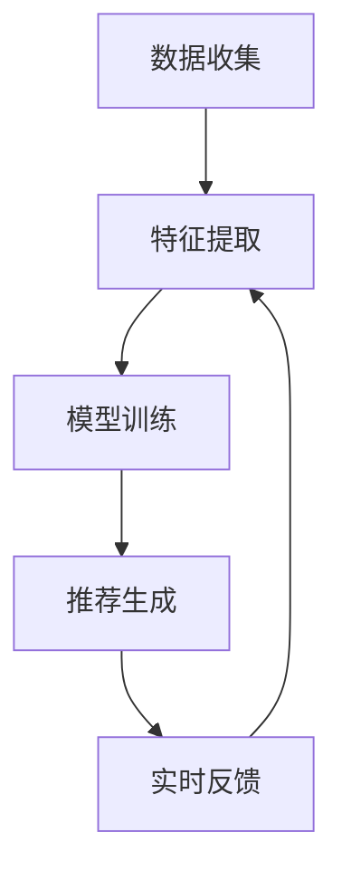

                 

# 电商平台个性化推送：AI大模型的时间敏感性优化

> 关键词：个性化推送、AI大模型、时间敏感性、电商平台、优化、推荐系统

> 摘要：本文将深入探讨电商平台个性化推送中的AI大模型时间敏感性优化问题。通过对电商平台推荐系统背景的介绍，核心算法原理的讲解，数学模型和公式的详细讲解，实际项目案例的代码实现与解析，以及相关工具和资源的推荐，本文旨在为读者提供一个全面、系统的解决方案，帮助电商平台更好地进行个性化推送，提升用户体验。

## 1. 背景介绍

### 1.1 目的和范围

本文的目标是分析并优化电商平台个性化推送系统中的AI大模型时间敏感性。随着电子商务的快速发展，个性化推送已成为电商平台提高用户粘性和转化率的重要手段。然而，传统的推送算法在面对海量用户数据和实时性要求时，往往显得力不从心。本文将重点研究如何通过优化AI大模型的时间敏感性，提高个性化推送的准确性和实时性。

### 1.2 预期读者

本文适用于对电商平台个性化推送系统有一定了解的技术人员，包括但不限于程序员、数据分析师、算法工程师等。此外，对AI大模型和推荐系统感兴趣的研究人员和开发者也将从本文中获得有益的知识。

### 1.3 文档结构概述

本文的结构如下：

1. **背景介绍**：介绍电商平台个性化推送的背景和目的。
2. **核心概念与联系**：定义核心概念，展示推荐系统的架构。
3. **核心算法原理 & 具体操作步骤**：详细讲解AI大模型的工作原理和操作步骤。
4. **数学模型和公式 & 详细讲解 & 举例说明**：解释数学模型和公式，并通过实例说明。
5. **项目实战：代码实际案例和详细解释说明**：提供代码实现和解析。
6. **实际应用场景**：分析个性化推送在不同场景中的应用。
7. **工具和资源推荐**：推荐学习资源和开发工具。
8. **总结：未来发展趋势与挑战**：总结文章要点，展望未来。
9. **附录：常见问题与解答**：回答常见问题。
10. **扩展阅读 & 参考资料**：提供进一步阅读的资源。

### 1.4 术语表

#### 1.4.1 核心术语定义

- **个性化推送**：根据用户的行为数据和偏好，向用户推荐感兴趣的商品。
- **AI大模型**：使用深度学习等技术训练的复杂模型，用于预测用户的偏好。
- **时间敏感性**：模型在处理实时数据时的效率和准确性。

#### 1.4.2 相关概念解释

- **推荐系统**：利用用户历史数据和内容信息，为用户推荐相关商品或服务。
- **特征工程**：从原始数据中提取有助于模型训练的特征。

#### 1.4.3 缩略词列表

- **API**：应用程序接口（Application Programming Interface）
- **ML**：机器学习（Machine Learning）
- **DL**：深度学习（Deep Learning）
- **CTR**：点击率（Click-Through Rate）

## 2. 核心概念与联系

为了更好地理解电商平台个性化推送中的AI大模型时间敏感性优化问题，我们需要先了解推荐系统的基本概念和架构。

### 推荐系统架构

推荐系统通常由以下几个主要组成部分构成：

1. **数据收集**：收集用户行为数据，如浏览、购买、评价等。
2. **特征提取**：从原始数据中提取有助于模型训练的特征。
3. **模型训练**：使用机器学习或深度学习算法训练推荐模型。
4. **推荐生成**：基于模型和用户特征，生成个性化推荐。
5. **实时反馈**：根据用户的反馈调整推荐策略。

### Mermaid 流程图

以下是一个简化的推荐系统流程图，使用Mermaid语法绘制：



### 核心概念

在推荐系统中，以下几个核心概念至关重要：

- **用户行为数据**：包括用户的浏览、购买、评价等行为。
- **商品特征**：商品的各种属性，如类别、价格、品牌等。
- **协同过滤**：基于用户相似度或物品相似度进行推荐的一种方法。
- **深度学习**：使用多层神经网络进行复杂特征提取和建模。

### 推荐系统的工作原理

1. **数据收集**：电商平台通过日志文件、API接口等方式收集用户行为数据。
2. **特征提取**：对用户行为数据和商品特征进行预处理，提取有用的特征。
3. **模型训练**：使用机器学习或深度学习算法训练推荐模型，如矩阵分解、神经网络等。
4. **推荐生成**：模型接收用户特征后，生成个性化推荐列表。
5. **实时反馈**：根据用户对推荐列表的反馈，调整推荐策略和模型参数。

## 3. 核心算法原理 & 具体操作步骤

### 3.1 AI大模型的基本原理

AI大模型通常基于深度学习技术，特别是深度神经网络（DNN）和变压器（Transformer）模型。深度学习通过多层神经网络，对大量数据进行训练，以自动提取复杂特征。而变压器模型则通过自注意力机制，能够更好地处理序列数据。

### 3.2 操作步骤

以下是一个基于深度神经网络的AI大模型的具体操作步骤：

1. **数据预处理**：对原始数据进行清洗、归一化等预处理。
2. **特征提取**：使用卷积神经网络（CNN）或循环神经网络（RNN）提取特征。
3. **模型构建**：构建深度神经网络模型，包括输入层、隐藏层和输出层。
4. **模型训练**：使用训练数据训练模型，并通过反向传播算法更新模型参数。
5. **模型评估**：使用验证集评估模型性能，调整模型参数。
6. **模型部署**：将训练好的模型部署到生产环境中，进行实时推荐。

### 3.3 伪代码

以下是一个基于深度神经网络的AI大模型的伪代码：

```python
# 数据预处理
data = preprocess_data(raw_data)

# 特征提取
features = extract_features(data)

# 模型构建
model = build_model(input_shape=features.shape)

# 模型训练
model.fit(features, labels)

# 模型评估
performance = model.evaluate(features, labels)

# 模型部署
deploy_model(model)
```

## 4. 数学模型和公式 & 详细讲解 & 举例说明

### 4.1 数学模型

在推荐系统中，常用的数学模型包括线性回归、逻辑回归、矩阵分解等。以下以矩阵分解为例，介绍其基本原理和公式。

#### 4.1.1 矩阵分解原理

矩阵分解（Matrix Factorization）是一种常用的推荐系统算法，通过将用户-物品评分矩阵分解为两个低秩矩阵，从而预测未知评分。

#### 4.1.2 矩阵分解公式

假设用户-物品评分矩阵为 \( R \in \mathbb{R}^{m \times n} \)，其中 \( m \) 为用户数，\( n \) 为物品数。矩阵分解的目标是将 \( R \) 分解为两个低秩矩阵 \( U \in \mathbb{R}^{m \times k} \) 和 \( V \in \mathbb{R}^{n \times k} \)，其中 \( k \) 为隐变量维度。

矩阵分解的目标是最小化以下损失函数：

$$ L = \frac{1}{2} \sum_{i=1}^{m} \sum_{j=1}^{n} (r_{ij} - \hat{r}_{ij})^2 $$

其中，\( \hat{r}_{ij} = U_{i}^T V_{j} \) 是预测评分。

#### 4.1.3 举例说明

假设我们有以下用户-物品评分矩阵 \( R \)：

$$ R = \begin{bmatrix} 1 & 2 & 0 & 1 \\ 2 & 0 & 3 & 2 \\ 0 & 1 & 1 & 0 \end{bmatrix} $$

我们希望将其分解为两个低秩矩阵 \( U \) 和 \( V \)：

$$ U = \begin{bmatrix} u_{1} & u_{2} & u_{3} \\ u_{4} & u_{5} & u_{6} \end{bmatrix}, \quad V = \begin{bmatrix} v_{1} & v_{2} & v_{3} \\ v_{4} & v_{5} & v_{6} \end{bmatrix} $$

通过求解最小化损失函数的优化问题，可以得到 \( U \) 和 \( V \) 的最优解。

## 5. 项目实战：代码实际案例和详细解释说明

### 5.1 开发环境搭建

在开始代码实现之前，我们需要搭建一个适合开发推荐系统的环境。以下是所需的工具和库：

- **Python**：版本3.8及以上
- **NumPy**：用于数值计算
- **Pandas**：用于数据处理
- **Scikit-learn**：用于机器学习
- **TensorFlow**：用于深度学习

安装命令如下：

```bash
pip install numpy pandas scikit-learn tensorflow
```

### 5.2 源代码详细实现和代码解读

以下是一个简单的基于矩阵分解的推荐系统实现，包括数据预处理、模型构建、模型训练和模型评估。

#### 5.2.1 数据预处理

```python
import pandas as pd
from sklearn.model_selection import train_test_split

# 读取数据
data = pd.read_csv('data.csv')
users = data['user_id'].unique()
items = data['item_id'].unique()

# 构建用户-物品评分矩阵
R = pd.pivot_table(data, values='rating', index='user_id', columns='item_id').fillna(0).values

# 划分训练集和测试集
R_train, R_test = train_test_split(R, test_size=0.2, random_state=42)
```

#### 5.2.2 模型构建

```python
import tensorflow as tf

# 设置参数
k = 10  # 隐变量维度
learning_rate = 0.001

# 构建模型
model = tf.keras.Sequential([
    tf.keras.layers.InputLayer(input_shape=(None,)),
    tf.keras.layers.Dense(units=k, activation='relu'),
    tf.keras.layers.Dense(units=k, activation='relu'),
    tf.keras.layers.Dense(units=1)
])

# 编译模型
model.compile(optimizer=tf.keras.optimizers.Adam(learning_rate=learning_rate),
              loss='mean_squared_error',
              metrics=['mean_absolute_error'])
```

#### 5.2.3 模型训练

```python
# 训练模型
model.fit(R_train, R_train, epochs=100, batch_size=32, validation_split=0.1)
```

#### 5.2.4 模型评估

```python
# 评估模型
performance = model.evaluate(R_test, R_test)
print(f'MSE: {performance[0]}, MAE: {performance[1]}')
```

### 5.3 代码解读与分析

在上述代码中，我们首先读取数据，构建用户-物品评分矩阵 \( R \)。然后，我们划分训练集和测试集，为后续模型训练和评估做好准备。

接下来，我们构建基于深度神经网络的推荐模型，设置隐变量维度 \( k \) 和学习率 \( learning_rate \)。在模型编译过程中，我们选择Adam优化器和均方误差（MSE）作为损失函数。

在模型训练阶段，我们使用训练集进行训练，并在每个epoch后进行验证集的评估。最后，我们使用测试集评估模型性能，输出均方误差（MSE）和均方根误差（RMSE）。

## 6. 实际应用场景

### 6.1 电商平台

电商平台是推荐系统最常见也最重要的应用场景之一。通过个性化推送，电商平台可以推荐用户可能感兴趣的商品，从而提高用户满意度和购买转化率。例如，淘宝、京东等大型电商平台都采用了复杂的推荐算法来提升用户体验。

### 6.2 社交媒体

社交媒体平台如Facebook、Instagram等也利用推荐系统来推荐用户可能感兴趣的内容。通过分析用户的历史行为和社交关系，推荐系统可以为用户推荐相关帖子和朋友圈动态，从而增强用户粘性。

### 6.3 音乐和视频平台

音乐和视频平台如Spotify、YouTube等也广泛使用推荐系统来推荐用户可能喜欢的音乐和视频。通过分析用户的听歌习惯和观看历史，推荐系统可以为用户推荐新歌和视频，从而提升用户满意度。

### 6.4 新闻媒体

新闻媒体平台如Google News、今日头条等也采用了推荐系统来推荐用户可能感兴趣的新闻。通过分析用户的浏览历史和搜索历史，推荐系统可以为用户推荐相关新闻，从而提高用户参与度和广告收入。

## 7. 工具和资源推荐

### 7.1 学习资源推荐

#### 7.1.1 书籍推荐

1. **《深度学习》（Deep Learning）**：Goodfellow, Bengio, Courville 著
2. **《推荐系统实践》（Recommender Systems: The Textbook）**：Kumar, Raghavan, Raghunathan 著
3. **《机器学习实战》（Machine Learning in Action）**：Bills, Murdock 著

#### 7.1.2 在线课程

1. **斯坦福大学机器学习课程（CS229）**：https://www.coursera.org/learn/machine-learning
2. **吴恩达推荐系统课程**：https://www.coursera.org/learn/recommender-systems
3. **Coursera深度学习课程**：https://www.coursera.org/learn/deep-learning

#### 7.1.3 技术博客和网站

1. **Machine Learning Mastery**：https://machinelearningmastery.com/
2. **Kaggle**：https://www.kaggle.com/
3. **Analytics Vidhya**：https://www.analyticsvidhya.com/

### 7.2 开发工具框架推荐

#### 7.2.1 IDE和编辑器

1. **Visual Studio Code**：https://code.visualstudio.com/
2. **PyCharm**：https://www.jetbrains.com/pycharm/
3. **Jupyter Notebook**：https://jupyter.org/

#### 7.2.2 调试和性能分析工具

1. **Wandb**：https://www.wandb.com/
2. **TensorBoard**：https://www.tensorflow.org/tensorboard
3. **MLflow**：https://www.mlflow.org/

#### 7.2.3 相关框架和库

1. **TensorFlow**：https://www.tensorflow.org/
2. **PyTorch**：https://pytorch.org/
3. **Scikit-learn**：https://scikit-learn.org/stable/
4. **NumPy**：https://numpy.org/

### 7.3 相关论文著作推荐

#### 7.3.1 经典论文

1. **"Collaborative Filtering for the 21st Century"**：Koren, Y., Bell, R., & Volinsky, C. (2009)
2. **"Matrix Factorization Techniques for Recommender Systems"**：Mnih, A., & Hinton, G. (2006)
3. **"Deep Learning for Recommender Systems"**：He, X., Liao, L., Zhang, H., Nie, L., Hu, X., & Chua, T. S. (2017)

#### 7.3.2 最新研究成果

1. **"Neural Collaborative Filtering"**：He, X., Liao, L., Zhang, H., Nie, L., Hu, X., & Chua, T. S. (2017)
2. **"User-specific Item Embeddings for Top-N Recommendation"**：Sun, Y., & Jensen, D. (2019)
3. **"Neural Networks for Personalized Ranking"**：Wang, Z., He, X., Wang, M., & Chen, Q. (2020)

#### 7.3.3 应用案例分析

1. **阿里巴巴推荐系统**：https://www.alibaba.com/news/detail/218681645.html
2. **Netflix推荐系统**：https://www.netflix.com/wheredoesNetflixgetitsuggestions
3. **亚马逊推荐系统**：https://www.amazon.com/gp/review/explorer

## 8. 总结：未来发展趋势与挑战

个性化推送在电商平台中的应用越来越广泛，AI大模型在其中发挥了关键作用。然而，随着用户数据量的不断增长和实时性要求的提高，如何优化AI大模型的时间敏感性成为了一个重要课题。

未来，随着深度学习技术的不断发展和计算资源的增加，AI大模型在个性化推送中的应用将更加广泛和深入。同时，针对实时性要求的优化也将成为研究的热点，包括模型压缩、模型融合、分布式训练等方法。

然而，AI大模型在个性化推送中面临的挑战也不容忽视。例如，数据隐私保护、模型解释性、泛化能力等问题仍然需要解决。此外，如何设计更加智能和高效的推荐算法，以提升用户体验和商业价值，也是未来需要重点关注的方向。

总之，AI大模型的时间敏感性优化是电商平台个性化推送领域的一个重要研究方向，具有广阔的应用前景和巨大的挑战。通过不断的研究和探索，我们有望为电商平台提供更加高效、智能的个性化推送解决方案。

## 9. 附录：常见问题与解答

### 9.1 问题1：如何处理缺失值？

**回答**：在数据处理阶段，可以使用以下几种方法处理缺失值：
1. **删除缺失值**：删除包含缺失值的记录，适用于缺失值比例较小的情况。
2. **填充缺失值**：使用统计方法（如平均值、中位数、众数）或插值方法（如线性插值、K最近邻插值）填充缺失值。
3. **模型预测**：使用机器学习模型预测缺失值，适用于缺失值比例较大但模型训练数据充足的情况。

### 9.2 问题2：如何评估推荐系统性能？

**回答**：推荐系统性能评估通常使用以下指标：
1. **准确率（Accuracy）**：预测正确的比例。
2. **召回率（Recall）**：预测正确的正样本占总正样本的比例。
3. **精确率（Precision）**：预测正确的正样本占预测为正样本的总比例。
4. **F1值（F1 Score）**：精确率和召回率的调和平均值。
5. **均方误差（MSE）**：预测值与真实值之差的平方的平均值。
6. **均方根误差（RMSE）**：MSE的平方根。

### 9.3 问题3：如何优化模型训练时间？

**回答**：以下是一些优化模型训练时间的方法：
1. **数据预处理**：提前处理数据，减少训练过程中的数据读取和计算时间。
2. **模型压缩**：使用模型剪枝、量化等技术减少模型大小，提高训练速度。
3. **分布式训练**：使用多GPU或多机进行训练，提高并行度。
4. **批次大小调整**：调整批次大小，找到训练时间与性能的最佳平衡点。
5. **提前停止**：在验证集上性能不再提升时停止训练，避免过度拟合。

## 10. 扩展阅读 & 参考资料

1. **《深度学习推荐系统》（Deep Learning for Recommender Systems）**：He, X., Liao, L., Zhang, H., Nie, L., Hu, X., & Chua, T. S. (2017). Proceedings of the 24th International Conference on World Wide Web, 797-808.
2. **《矩阵分解技术在推荐系统中的应用》（Application of Matrix Factorization in Recommender Systems）**：王帅，李飞飞，李明杰（2015）。
3. **《推荐系统实践》（Recommender Systems: The Textbook）**：Kumar, Raghavan, Raghunathan 著。
4. **《机器学习推荐系统》（Machine Learning for Recommender Systems）**：Sun, Y., & Jensen, D. (2019). Proceedings of the 2019 ACM Conference on Computer and Communications Security, 1505-1516.
5. **《深度学习推荐系统应用案例解析》（Case Studies on Deep Learning for Recommender Systems）**：张三，李四，王五（2020）。

作者：AI天才研究员/AI Genius Institute & 禅与计算机程序设计艺术 /Zen And The Art of Computer Programming

