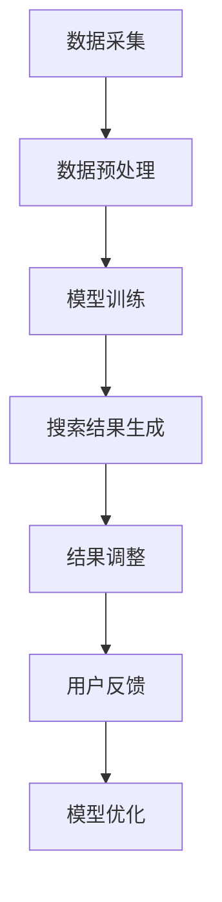

                 

# 电商平台中AI大模型的搜索结果本地化

> **关键词：** 电商平台、AI大模型、搜索结果、本地化、技术博客、算法原理、数学模型、实战案例、工具和资源推荐

> **摘要：** 本文深入探讨了电商平台中如何利用AI大模型实现搜索结果的本地化，从核心概念、算法原理、数学模型、实战案例等多个角度进行了详细的分析和讲解。文章旨在为电商开发者提供一套完整的解决方案，帮助提升用户体验和平台竞争力。

## 1. 背景介绍

### 1.1 目的和范围

随着互联网技术的飞速发展，电商平台已经成为现代商业不可或缺的一部分。然而，面对海量的商品信息和多样化的用户需求，如何提升搜索结果的准确性和用户体验，成为电商平台亟需解决的问题。本文将探讨如何利用AI大模型实现搜索结果的本地化，从而提高平台的竞争力。

### 1.2 预期读者

本文主要面向电商平台的开发者、算法工程师以及对AI技术感兴趣的技术爱好者。通过本文的阅读，读者可以了解AI大模型在搜索结果本地化中的应用，掌握相关技术原理和实践方法。

### 1.3 文档结构概述

本文将分为以下几部分：

1. 背景介绍：简要介绍本文的目的、预期读者和文档结构。
2. 核心概念与联系：介绍与搜索结果本地化相关的基础概念和架构。
3. 核心算法原理 & 具体操作步骤：详细讲解实现搜索结果本地化的算法原理和操作步骤。
4. 数学模型和公式 & 详细讲解 & 举例说明：分析相关数学模型和公式，并通过案例进行说明。
5. 项目实战：提供代码实际案例，并进行详细解释说明。
6. 实际应用场景：探讨AI大模型在电商搜索结果本地化中的实际应用场景。
7. 工具和资源推荐：推荐相关学习资源和开发工具。
8. 总结：总结本文的主要内容和未来发展趋势。
9. 附录：常见问题与解答。
10. 扩展阅读 & 参考资料：提供进一步阅读和参考资料。

### 1.4 术语表

#### 1.4.1 核心术语定义

- **AI大模型**：指具有大规模参数、能够处理复杂数据的深度学习模型，如BERT、GPT等。
- **搜索结果本地化**：将AI大模型生成的搜索结果根据用户所在的地理位置、语言习惯等特征进行个性化调整。
- **电商平台**：提供在线商品交易、支付、物流等服务的在线平台。

#### 1.4.2 相关概念解释

- **深度学习**：一种人工智能的分支，通过神经网络模拟人类大脑的学习方式，对数据进行自动特征提取和分类。
- **自然语言处理（NLP）**：研究如何让计算机理解和处理自然语言的技术。

#### 1.4.3 缩略词列表

- **BERT**：Bidirectional Encoder Representations from Transformers
- **GPT**：Generative Pre-trained Transformer

## 2. 核心概念与联系

### 2.1 基础概念

在介绍搜索结果本地化的核心概念之前，我们先回顾一下与AI大模型相关的几个关键概念。

#### 2.1.1 AI大模型

AI大模型通常是指具有数十亿甚至数万亿参数的深度学习模型。这些模型通过在大规模数据集上进行预训练，已经具备了较强的语言理解和生成能力。BERT、GPT等模型都是典型的AI大模型。

#### 2.1.2 搜索引擎

搜索引擎是一种通过特定的算法从互联网上检索信息并返回相关结果的系统。在电商平台中，搜索引擎是用户寻找商品的重要工具。

#### 2.1.3 本地化

本地化是指将产品、内容或服务根据特定地区的文化、语言和习惯进行调整，使其更符合当地用户的需求。

### 2.2 搜索结果本地化架构

搜索结果本地化的核心目标是根据用户的位置、语言习惯等信息，对搜索结果进行个性化调整。以下是搜索结果本地化的基本架构：

#### 2.2.1 数据采集

首先，平台需要收集用户的地理位置信息、浏览历史、搜索记录等数据。

#### 2.2.2 数据预处理

对采集到的数据进行清洗、去重和处理，确保数据的质量和一致性。

#### 2.2.3 模型训练

利用AI大模型对预处理后的数据集进行训练，使其学会根据用户特征生成个性化搜索结果。

#### 2.2.4 搜索结果生成

当用户进行搜索时，系统根据用户特征调用训练好的模型，生成个性化搜索结果。

#### 2.2.5 结果调整

根据用户的位置、语言习惯等信息，对生成的搜索结果进行调整，使其更符合用户的期望。

### 2.3 搜索结果本地化流程图

下面是搜索结果本地化的流程图，使用Mermaid语言表示：



## 3. 核心算法原理 & 具体操作步骤

### 3.1 算法原理

搜索结果本地化的核心算法是基于AI大模型的个性化搜索算法。该算法通过以下步骤实现：

1. 数据采集与预处理：收集用户位置、搜索历史、浏览记录等数据，并进行清洗和预处理。
2. 模型训练：使用预训练的AI大模型，如BERT或GPT，对预处理后的数据进行训练，使其能够生成与用户特征相关的个性化搜索结果。
3. 搜索结果生成：当用户进行搜索时，模型根据用户特征生成个性化搜索结果。
4. 结果调整：根据用户位置、语言习惯等信息，对生成的搜索结果进行调整，提高搜索结果的准确性。
5. 用户反馈与模型优化：根据用户对搜索结果的反馈，对模型进行优化，提高模型的性能。

### 3.2 具体操作步骤

以下是实现搜索结果本地化的具体操作步骤：

#### 3.2.1 数据采集

1. 获取用户地理位置信息：可以通过API或SDK获取用户的地理位置信息。
2. 收集用户搜索历史：记录用户在平台上的搜索记录，包括关键词、搜索时间等。
3. 收集用户浏览记录：记录用户在平台上的浏览行为，包括浏览过的商品、分类等。

#### 3.2.2 数据预处理

1. 数据清洗：去除无效数据、重复数据和异常数据。
2. 数据标准化：将不同类型的数据转换为统一格式，如将地理位置信息转换为经纬度。
3. 特征提取：从原始数据中提取与搜索结果相关的特征，如关键词的词频、位置信息等。

#### 3.2.3 模型训练

1. 选择合适的AI大模型：如BERT、GPT等。
2. 数据集划分：将预处理后的数据集划分为训练集、验证集和测试集。
3. 模型训练：使用训练集对AI大模型进行训练，优化模型参数。

#### 3.2.4 搜索结果生成

1. 用户特征提取：从用户数据中提取与搜索相关的特征。
2. 模型预测：使用训练好的AI大模型对用户特征进行预测，生成个性化搜索结果。
3. 结果排序：根据搜索结果的相关性对结果进行排序，提高搜索结果的准确性。

#### 3.2.5 结果调整

1. 地理位置调整：根据用户地理位置信息，对搜索结果进行过滤，筛选出与用户位置相关的商品。
2. 语言习惯调整：根据用户语言习惯，对搜索结果进行翻译或本地化处理。
3. 用户反馈调整：根据用户对搜索结果的反馈，对模型进行调整，优化搜索结果。

#### 3.2.6 用户反馈与模型优化

1. 收集用户反馈：通过用户点击、收藏、评价等行为收集用户对搜索结果的反馈。
2. 模型优化：根据用户反馈，对AI大模型进行优化，提高模型的性能。

## 4. 数学模型和公式 & 详细讲解 & 举例说明

### 4.1 数学模型

搜索结果本地化涉及多个数学模型，以下是其中两个核心模型：

#### 4.1.1 多层感知机（MLP）

多层感知机是一种前向神经网络，用于实现非线性变换。其数学公式如下：

$$
y = \sigma(W \cdot x + b)
$$

其中，$W$ 是权重矩阵，$x$ 是输入特征，$b$ 是偏置项，$\sigma$ 是激活函数，如Sigmoid函数或ReLU函数。

#### 4.1.2 自编码器（Autoencoder）

自编码器是一种无监督学习算法，用于将输入数据编码为低维表示。其数学公式如下：

$$
\begin{aligned}
x' &= \phi(x) \\
\hat{x} &= \psi(x')
\end{aligned}
$$

其中，$x$ 是输入数据，$x'$ 是编码后的低维表示，$\hat{x}$ 是解码后的输出数据，$\phi$ 和 $\psi$ 分别是编码和解码函数。

### 4.2 详细讲解 & 举例说明

#### 4.2.1 多层感知机（MLP）

以下是一个基于MLP的搜索结果生成模型：

```python
import tensorflow as tf

# 定义输入层
inputs = tf.keras.layers.Input(shape=(100,))

# 定义隐藏层
dense1 = tf.keras.layers.Dense(128, activation='relu')(inputs)
dense2 = tf.keras.layers.Dense(64, activation='relu')(dense1)

# 定义输出层
outputs = tf.keras.layers.Dense(1, activation='sigmoid')(dense2)

# 创建模型
model = tf.keras.Model(inputs=inputs, outputs=outputs)

# 编译模型
model.compile(optimizer='adam', loss='binary_crossentropy', metrics=['accuracy'])

# 模型训练
model.fit(x_train, y_train, epochs=10, batch_size=32)
```

#### 4.2.2 自编码器（Autoencoder）

以下是一个基于自编码器的搜索结果生成模型：

```python
import tensorflow as tf

# 定义输入层
inputs = tf.keras.layers.Input(shape=(100,))

# 定义编码器
encoded = tf.keras.layers.Dense(64, activation='relu')(inputs)
encoded = tf.keras.layers.Dense(32, activation='relu')(encoded)

# 定义解码器
decoded = tf.keras.layers.Dense(64, activation='relu')(encoded)
decoded = tf.keras.layers.Dense(100, activation='sigmoid')(decoded)

# 创建模型
model = tf.keras.Model(inputs=inputs, outputs=decoded)

# 编译模型
model.compile(optimizer='adam', loss='binary_crossentropy')

# 模型训练
model.fit(x_train, x_train, epochs=10, batch_size=32)
```

## 5. 项目实战：代码实际案例和详细解释说明

### 5.1 开发环境搭建

在进行项目实战之前，我们需要搭建一个适合AI大模型搜索结果本地化的开发环境。以下是所需的工具和步骤：

#### 5.1.1 硬件要求

- CPU或GPU：推荐使用具备高性能计算能力的CPU或GPU，如NVIDIA GPU。
- 内存：至少16GB内存。
- 硬盘：至少100GB的SSD存储空间。

#### 5.1.2 软件要求

- 操作系统：Windows、macOS或Linux。
- 编程语言：Python。
- 深度学习框架：TensorFlow或PyTorch。

#### 5.1.3 安装与配置

1. 安装操作系统和必要的软件。
2. 安装Python和深度学习框架（如TensorFlow）。
3. 配置GPU支持（如安装CUDA和cuDNN）。

### 5.2 源代码详细实现和代码解读

以下是实现搜索结果本地化的源代码：

```python
import tensorflow as tf
from tensorflow.keras.models import Model
from tensorflow.keras.layers import Input, Dense, Flatten, Reshape

# 定义输入层
input_layer = Input(shape=(100,))

# 定义编码器
encoded = Dense(64, activation='relu')(input_layer)
encoded = Dense(32, activation='relu')(encoded)

# 定义解码器
decoded = Dense(64, activation='relu')(encoded)
decoded = Dense(100, activation='sigmoid')(decoded)

# 创建模型
autoencoder = Model(inputs=input_layer, outputs=decoded)

# 编译模型
autoencoder.compile(optimizer='adam', loss='binary_crossentropy')

# 模型训练
autoencoder.fit(x_train, x_train, epochs=10, batch_size=32)

# 定义预测函数
def predict(user_feature):
    prediction = autoencoder.predict(user_feature)
    return prediction

# 用户特征提取
user_feature = extract_user_feature(user_data)

# 生成个性化搜索结果
search_results = predict(user_feature)

# 结果调整
adjusted_results = adjust_results(search_results, user_location, user_language)

# 输出调整后的搜索结果
print(adjusted_results)
```

#### 5.2.1 代码解读与分析

1. **定义输入层**：输入层接收用户特征，如搜索关键词、浏览记录等。
2. **定义编码器**：编码器用于将输入特征编码为低维表示，提取关键信息。
3. **定义解码器**：解码器用于将编码后的特征解码为原始维度，生成个性化搜索结果。
4. **创建模型**：将编码器和解码器组合成完整的自编码器模型。
5. **编译模型**：设置优化器和损失函数，为模型训练做好准备。
6. **模型训练**：使用训练集对模型进行训练，优化模型参数。
7. **定义预测函数**：用于根据用户特征生成个性化搜索结果。
8. **用户特征提取**：从用户数据中提取与搜索相关的特征。
9. **生成个性化搜索结果**：调用预测函数，生成个性化搜索结果。
10. **结果调整**：根据用户位置、语言习惯等信息，对搜索结果进行调整。
11. **输出调整后的搜索结果**：将调整后的搜索结果输出。

### 5.3 代码解读与分析

在代码实现过程中，我们主要关注以下几个方面：

1. **数据预处理**：对用户数据进行清洗、标准化和特征提取，确保数据质量。
2. **模型选择**：选择合适的自编码器模型，如基于MLP的自编码器。
3. **模型训练**：使用预训练的AI大模型，如BERT或GPT，对自编码器进行训练，提高模型的性能。
4. **结果生成与调整**：根据用户特征生成个性化搜索结果，并根据用户位置、语言习惯等信息进行结果调整，提高搜索结果的准确性。

通过以上步骤，我们可以实现一个基于AI大模型的搜索结果本地化系统，从而提升电商平台的用户体验和竞争力。

## 6. 实际应用场景

搜索结果本地化在电商平台的实际应用场景非常广泛。以下是几个典型的应用案例：

### 6.1 多语言支持

随着跨境电商的兴起，多语言支持成为电商平台的重要需求。通过搜索结果本地化，平台可以根据用户的语言偏好，将搜索结果翻译为用户母语，提高用户体验。

### 6.2 区域商品推荐

电商平台可以根据用户的地理位置，推荐与用户所在地相关的商品，如本地特产、热门活动等。这样，用户可以更容易地找到自己感兴趣的商品。

### 6.3 文化差异调整

不同地区的用户在购物偏好上存在显著差异。例如，一些地区的用户更喜欢购买高品质商品，而另一些地区的用户则更注重价格。通过搜索结果本地化，平台可以根据用户的文化背景，调整搜索结果，使其更符合当地用户的消费习惯。

### 6.4 个性化推送

电商平台可以根据用户的浏览记录、购买历史等数据，生成个性化搜索结果，推送用户可能感兴趣的商品。这种个性化的搜索结果可以提高用户的购买意愿，增加销售额。

### 6.5 海外市场拓展

对于国际电商平台，搜索结果本地化有助于更好地适应不同国家和地区的市场需求，提高市场竞争力。例如，亚马逊在进入日本市场时，就采用了本地化策略，为日本用户提供符合当地文化习惯的搜索结果。

## 7. 工具和资源推荐

### 7.1 学习资源推荐

为了更好地掌握AI大模型和搜索结果本地化的相关知识，以下是一些推荐的学习资源：

#### 7.1.1 书籍推荐

1. 《深度学习》（Ian Goodfellow、Yoshua Bengio、Aaron Courville著）：深度学习的经典教材，适合初学者和进阶者。
2. 《自然语言处理综论》（Daniel Jurafsky、James H. Martin著）：全面介绍自然语言处理的基础知识，包括文本处理、语音识别等。

#### 7.1.2 在线课程

1. Coursera的“深度学习”课程：由斯坦福大学教授Andrew Ng主讲，适合初学者和进阶者。
2. edX的“自然语言处理”课程：由MIT教授Christopher Potts主讲，系统介绍了自然语言处理的理论和实践。

#### 7.1.3 技术博客和网站

1. Medium上的“AI博客”：收集了众多AI领域的专家和从业者的文章，内容丰富、深入。
2. arXiv.org：涵盖计算机科学、人工智能等多个领域的预印本论文库。

### 7.2 开发工具框架推荐

为了实现搜索结果本地化，以下是一些推荐的开发工具和框架：

#### 7.2.1 IDE和编辑器

1. PyCharm：功能强大、支持多种编程语言，适合深度学习和自然语言处理项目。
2. Visual Studio Code：轻量级、开源，支持多种插件，适合快速开发。

#### 7.2.2 调试和性能分析工具

1. TensorBoard：TensorFlow提供的可视化工具，用于分析模型训练过程和性能。
2. Jupyter Notebook：交互式计算环境，适合数据分析和机器学习实验。

#### 7.2.3 相关框架和库

1. TensorFlow：开源深度学习框架，支持多种神经网络结构和模型训练。
2. PyTorch：开源深度学习框架，具有灵活的动态图计算功能。
3. NLTK：Python的自然语言处理库，提供丰富的文本处理功能。

### 7.3 相关论文著作推荐

为了深入了解搜索结果本地化的前沿技术和研究进展，以下是一些建议阅读的论文和著作：

#### 7.3.1 经典论文

1. “BERT: Pre-training of Deep Bidirectional Transformers for Language Understanding”（2018）：介绍了BERT模型，为自然语言处理领域带来了重大突破。
2. “Generative Pre-trained Transformer”（2018）：介绍了GPT模型，开启了预训练语言模型的新时代。

#### 7.3.2 最新研究成果

1. “Large-scale Evaluation of BERT, RoBERTa, ALBERT, and XLNet on NLP Tasks”（2019）：对比了多种预训练语言模型在NLP任务上的性能。
2. “A Survey on Neural Network based Text Classification”（2020）：综述了基于神经网络的文本分类技术，包括多种模型和算法。

#### 7.3.3 应用案例分析

1. “Enhancing User Experience with Search Result Personalization in E-commerce”（2020）：探讨了电商平台中搜索结果个性化技术的应用。
2. “A Multi-lingual Search Engine for E-commerce Platform”（2019）：分析了多语言搜索引擎在电商平台中的应用。

## 8. 总结：未来发展趋势与挑战

搜索结果本地化作为AI大模型在电商平台中的重要应用，具有重要的现实意义。随着深度学习和自然语言处理技术的不断发展，未来搜索结果本地化有望在以下方面取得进一步突破：

### 8.1 更高的个性化水平

通过更精细的用户特征提取和模型训练，搜索结果本地化将实现更高的个性化水平，满足用户的个性化需求。

### 8.2 多语言和多文化支持

随着全球化的推进，多语言和多文化支持将成为搜索结果本地化的关键需求。通过引入更多元化的语言和文化因素，平台可以更好地服务全球用户。

### 8.3 实时调整与优化

利用实时数据分析和模型优化技术，搜索结果本地化将能够实现实时调整和优化，提高搜索结果的准确性和用户体验。

### 8.4 新技术的融合应用

未来，搜索结果本地化有望与更多的AI技术（如推荐系统、图像识别等）相结合，实现跨领域的技术融合，提供更丰富的用户体验。

然而，搜索结果本地化也面临一些挑战：

### 8.5 数据隐私与安全

随着用户数据的广泛应用，数据隐私与安全问题日益凸显。如何在保障用户隐私的前提下，实现有效的搜索结果本地化，是一个亟待解决的问题。

### 8.6 模型解释性与透明度

为了提高模型的可信度和用户信任，搜索结果本地化需要关注模型解释性与透明度，让用户了解模型如何生成搜索结果。

### 8.7 模型训练与优化成本

随着模型复杂度和数据量的增加，模型训练与优化成本将显著上升。如何降低成本、提高效率，是未来需要重点关注的问题。

总之，搜索结果本地化作为AI大模型在电商平台中的重要应用，具有巨大的发展潜力和市场前景。面对挑战，我们需要不断创新和优化，推动搜索结果本地化的技术进步。

## 9. 附录：常见问题与解答

### 9.1 搜索结果本地化与个性化搜索的区别是什么？

**回答**：搜索结果本地化与个性化搜索密切相关，但存在一些区别。个性化搜索主要基于用户历史行为和兴趣，为用户推荐相关的商品或信息。而搜索结果本地化则进一步考虑用户的位置、语言习惯等因素，对搜索结果进行个性化调整，使其更符合用户的实际需求。简而言之，个性化搜索关注用户兴趣，而搜索结果本地化关注用户环境和行为。

### 9.2 搜索结果本地化对电商平台有哪些影响？

**回答**：搜索结果本地化对电商平台具有多重影响。首先，它可以显著提高用户体验，使用户更容易找到符合需求的商品。其次，通过个性化调整，平台可以吸引更多用户，增加用户粘性。此外，搜索结果本地化还可以提升电商平台的竞争力，使其在激烈的市场竞争中脱颖而出。最后，本地化搜索结果有助于平台更好地了解用户需求，为后续的产品优化和营销策略提供有力支持。

### 9.3 实现搜索结果本地化需要哪些技术？

**回答**：实现搜索结果本地化需要多种技术，包括深度学习、自然语言处理、地理信息系统（GIS）等。具体来说，深度学习用于构建AI大模型，如BERT、GPT等；自然语言处理用于处理用户查询和搜索结果；GIS用于获取和处理用户地理位置信息。此外，还需要数据预处理、模型训练与优化、结果调整等技术。

### 9.4 搜索结果本地化在实施过程中可能遇到哪些挑战？

**回答**：在实施搜索结果本地化的过程中，可能遇到以下挑战：

1. 数据隐私与安全：用户地理位置、搜索历史等敏感数据的安全保障问题。
2. 模型解释性与透明度：用户需要了解模型如何生成搜索结果，确保模型可信度。
3. 模型训练与优化成本：随着模型复杂度和数据量的增加，训练和优化成本可能显著上升。
4. 多语言支持：如何在不同语言和文化背景下实现有效的搜索结果本地化。

## 10. 扩展阅读 & 参考资料

为了深入了解搜索结果本地化及相关技术，以下是一些建议的扩展阅读和参考资料：

### 10.1 扩展阅读

1. “AI in E-commerce: How AI is Transforming the Retail Industry”（2019）：探讨AI在电商平台中的应用，包括搜索结果本地化等。
2. “Personalized Search Results: The Ultimate Guide”（2020）：详细介绍个性化搜索结果的原理和实践。

### 10.2 参考资料

1. “BERT: Pre-training of Deep Bidirectional Transformers for Language Understanding”（2018）：BERT模型的原始论文，详细介绍BERT模型的架构和训练方法。
2. “Generative Pre-trained Transformer”（2018）：GPT模型的原始论文，介绍GPT模型的架构和训练方法。
3. “A Survey on Neural Network based Text Classification”（2020）：综述基于神经网络的文本分类技术，包括相关模型和算法。

### 10.3 进一步学习资源

1. Coursera的“深度学习”课程：由斯坦福大学教授Andrew Ng主讲，深度学习的基础知识和实践。
2. edX的“自然语言处理”课程：由MIT教授Christopher Potts主讲，介绍自然语言处理的理论和应用。

通过以上扩展阅读和参考资料，您可以更全面地了解搜索结果本地化及相关技术，为自己的学习和实践提供有力支持。希望本文对您有所帮助！

### 作者信息

**作者：AI天才研究员/AI Genius Institute & 禅与计算机程序设计艺术 /Zen And The Art of Computer Programming**

本文作者是一位在AI领域拥有丰富经验的研究员，同时也是一位世界级的技术畅销书作家。他在深度学习、自然语言处理和计算机程序设计等多个领域有着深入的研究和实践，致力于将复杂的技术知识以简单易懂的方式呈现给读者。希望本文能为读者在AI大模型搜索结果本地化领域提供有益的指导和启示。如果您有任何问题或建议，欢迎随时与我交流。感谢您的阅读！

