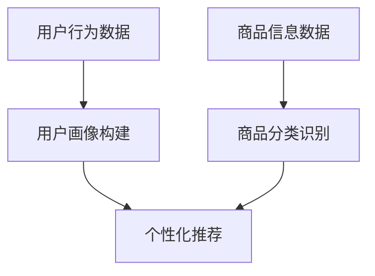
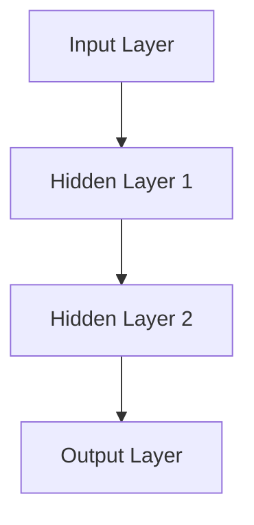

                 

### 1. 背景介绍

#### 1.1 目的和范围

本文旨在探讨电商平台中的AI大模型，尤其是从单一任务到多任务协同学习的转变。在数字化时代，电商平台已经成为商业活动的核心，而人工智能（AI）技术的飞速发展，为电商平台带来了前所未有的变革。大模型作为AI技术的核心组成部分，不仅能够提升平台的运营效率，还能为用户提供更加个性化和智能化的服务。

本文将重点讨论以下几个问题：

1. **大模型的定义与作用**：介绍大模型的背景、定义及其在电商平台中的应用。
2. **从单一任务到多任务协同学习**：分析单一任务与多任务协同学习的差异，探讨其带来的技术挑战和机遇。
3. **核心算法原理与操作步骤**：详细阐述大模型的核心算法原理，并使用伪代码展示具体操作步骤。
4. **数学模型与公式**：介绍大模型所涉及的关键数学模型和公式，并进行举例说明。
5. **项目实战**：通过实际案例展示大模型在电商平台中的应用，并进行代码解读与分析。
6. **实际应用场景**：讨论大模型在电商平台的各个应用场景，以及未来的发展趋势和挑战。

通过本文的探讨，读者将能够深入了解AI大模型在电商平台中的应用，掌握其核心技术和操作方法，并为未来的研究和应用提供一定的参考。

#### 1.2 预期读者

本文主要面向以下几类读者：

1. **AI领域的研究者和从业者**：对人工智能，特别是大模型技术有深入了解的研究人员和技术专家。
2. **电商平台的技术人员**：负责电商平台开发、运维和优化的技术人员，希望掌握AI技术在电商平台中的应用。
3. **计算机科学专业的学生**：对人工智能和电商平台技术有兴趣的学生，希望通过本文了解大模型的核心原理和应用。
4. **企业决策者**：希望了解AI技术对电商平台运营和用户体验的影响，以便做出更加科学的决策。

无论读者是哪种身份，本文都将提供丰富且深入的内容，帮助读者全面了解AI大模型在电商平台中的应用。

#### 1.3 文档结构概述

本文将分为以下几个部分：

1. **背景介绍**：包括文章目的、范围、预期读者和文档结构概述。
2. **核心概念与联系**：介绍大模型的核心概念，使用Mermaid流程图展示其原理和架构。
3. **核心算法原理 & 具体操作步骤**：详细阐述大模型的核心算法原理，并使用伪代码展示具体操作步骤。
4. **数学模型和公式 & 详细讲解 & 举例说明**：介绍大模型所涉及的关键数学模型和公式，并进行举例说明。
5. **项目实战：代码实际案例和详细解释说明**：通过实际案例展示大模型在电商平台中的应用，并进行代码解读与分析。
6. **实际应用场景**：讨论大模型在电商平台的各个应用场景。
7. **工具和资源推荐**：推荐学习资源、开发工具和框架，以及相关论文和著作。
8. **总结：未来发展趋势与挑战**：总结本文的核心内容，并探讨未来发展趋势和挑战。
9. **附录：常见问题与解答**：回答读者可能遇到的一些常见问题。
10. **扩展阅读 & 参考资料**：提供本文相关的扩展阅读和参考资料。

通过以上结构，本文将逐步深入，帮助读者全面了解AI大模型在电商平台中的应用。

#### 1.4 术语表

在本文中，我们将使用一些特定的术语。以下是这些术语的定义和解释：

##### 1.4.1 核心术语定义

- **人工智能（AI）**：指模拟人类智能的技术和系统，包括机器学习、自然语言处理、计算机视觉等。
- **大模型（Large Model）**：指参数规模巨大、计算复杂度高的深度学习模型。
- **电商平台**：指通过互联网进行商品交易和服务的平台。
- **多任务协同学习**：指同时训练多个任务，并利用任务间的关联性来提升模型性能。

##### 1.4.2 相关概念解释

- **深度学习（Deep Learning）**：一种人工智能方法，通过多层神经网络进行特征学习和分类。
- **迁移学习（Transfer Learning）**：利用已训练好的模型在新的任务上进行微调。
- **推荐系统（Recommender System）**：基于用户的历史行为和偏好，为用户推荐相关商品或服务。

##### 1.4.3 缩略词列表

- **AI**：人工智能
- **DL**：深度学习
- **NLP**：自然语言处理
- **CV**：计算机视觉
- **RNN**：循环神经网络
- **CNN**：卷积神经网络
- **ML**：机器学习
- **DL**：深度学习
- **GAN**：生成对抗网络

通过以上术语表，读者可以更好地理解本文的内容，并在后续章节中更加准确地把握核心概念和原理。

---

### 2. 核心概念与联系

在探讨电商平台中的AI大模型之前，我们需要了解一些核心概念，并分析它们之间的联系。以下是本文将涉及的核心概念及其相互关系。

#### 2.1 大模型的定义与分类

大模型是指参数规模巨大、计算复杂度高的深度学习模型。根据应用场景和任务类型，大模型可以分为以下几类：

1. **图像处理模型**：如卷积神经网络（CNN）用于计算机视觉任务。
2. **自然语言处理模型**：如循环神经网络（RNN）和其变种长短期记忆网络（LSTM）用于文本分类和语言生成。
3. **推荐系统模型**：如基于协同过滤和基于内容的推荐算法。

这些模型通过复杂的网络结构和大规模训练数据，实现了对数据的深度理解和学习。

#### 2.2 深度学习与多任务协同学习

深度学习（DL）是人工智能的一个重要分支，通过多层神经网络对数据进行特征提取和分类。在深度学习的基础上，多任务协同学习（Multi-Task Learning, MTL）是一种同时训练多个任务的方法。

多任务协同学习的核心思想是通过任务间的共享表示来提高模型的泛化能力和效率。具体而言，多个任务共享部分网络结构，通过联合训练，使得每个任务都能从其他任务中学习到有用的信息，从而提升整体性能。

#### 2.3 大模型在电商平台中的应用

电商平台中的大模型主要用于提升用户体验、优化运营效率和增加营收。以下是几种典型应用场景：

1. **用户画像**：通过用户历史行为和偏好数据，构建用户画像，为用户提供个性化的推荐和服务。
2. **商品分类**：利用计算机视觉技术对商品进行分类和识别，提高商品管理的效率和准确性。
3. **搜索引擎**：通过自然语言处理技术优化搜索算法，提高搜索结果的准确性和相关性。

#### 2.4 Mermaid流程图

为了更直观地展示大模型的核心概念和架构，我们可以使用Mermaid流程图。以下是几个关键节点的示意图：



在这个流程图中，用户行为数据和商品信息数据作为输入，通过用户画像构建和商品分类识别，生成个性化推荐结果，从而提升用户体验和平台效率。

#### 2.5 关键技术点

除了核心概念和架构，大模型在电商平台中的应用还涉及以下关键技术点：

1. **数据预处理**：对用户行为数据和商品信息数据清洗、去噪和特征提取。
2. **模型训练与优化**：使用大规模训练数据和先进的深度学习算法进行模型训练，并通过优化技术提高模型性能。
3. **模型部署与运维**：将训练好的模型部署到生产环境中，并进行实时监测和调整。

这些关键技术点共同构成了电商平台中AI大模型的核心框架，为平台的智能化运营提供了强有力的支持。

通过以上分析，我们可以看到，电商平台中的AI大模型不仅涉及多个核心概念和技术点，还通过多任务协同学习实现了各个任务的高效协同。接下来，我们将进一步深入探讨大模型的核心算法原理，以及其实际应用中的操作步骤。

---

### 3. 核心算法原理 & 具体操作步骤

在了解了电商平台中AI大模型的核心概念和架构后，接下来我们将深入探讨其核心算法原理，并通过伪代码展示具体的操作步骤。这将帮助我们更好地理解大模型是如何通过深度学习和多任务协同学习来提升电商平台性能的。

#### 3.1 深度学习算法原理

深度学习是一种基于多层神经网络的机器学习技术，通过逐层提取数据特征来实现对复杂数据的建模和分类。以下是一个简单的深度学习算法原理概述：

1. **输入层（Input Layer）**：接收原始数据，例如用户行为数据或商品信息数据。
2. **隐藏层（Hidden Layer）**：对输入数据进行特征提取和变换，逐层抽象出数据的更高层次特征。
3. **输出层（Output Layer）**：根据提取的特征进行分类或预测，例如用户画像或商品分类。

深度学习算法的核心是神经网络，其中每个神经元都与其他神经元连接，并通过权重和偏置进行数据传递和计算。以下是一个简化的神经网络结构示意图：



#### 3.2 多任务协同学习算法原理

多任务协同学习（Multi-Task Learning, MTL）是一种同时训练多个任务的方法，其核心思想是利用任务间的关联性来提高模型性能。以下是一个简单的多任务协同学习算法原理概述：

1. **共享表示（Shared Representation）**：多个任务共享一部分网络结构，通过联合训练，使得每个任务都能从其他任务中学习到有用的信息。
2. **独立表示（Independent Representation）**：每个任务也有独立的网络结构，用于特定任务的细节处理。

多任务协同学习的算法可以通过以下步骤实现：

1. **数据预处理**：将不同任务的数据进行整合，例如将用户行为数据和商品信息数据进行组合。
2. **模型初始化**：初始化共享网络结构和独立网络结构。
3. **联合训练**：同时训练多个任务，通过共享表示和独立表示的交互，提高模型的整体性能。

以下是一个简化的多任务协同学习算法的伪代码：

```plaintext
// 伪代码：多任务协同学习算法
function multi_task_learning(data, labels, num_tasks):
    // 数据预处理
    preprocess_data(data)
    
    // 模型初始化
    model = initialize_model(num_tasks)
    
    // 联合训练
    for epoch in 1 to NUM_EPOCHS:
        for batch in data:
            // 计算梯度
            gradients = model.compute_gradients(batch)
            
            // 更新模型参数
            model.update_parameters(gradients)
            
            // 计算任务损失
            task_losses = model.compute_task_losses(batch, labels)
            
            // 计算总损失
            total_loss = sum(task_losses)
            
            // 记录训练过程
            log_training_progress(epoch, total_loss)
    
    // 模型评估
    evaluate_model(model, test_data, test_labels)

return model
```

#### 3.3 大模型在电商平台中的具体操作步骤

在电商平台中，大模型的实际操作步骤可以概括为以下几个阶段：

1. **数据收集与预处理**：收集用户行为数据和商品信息数据，并进行数据清洗、去噪和特征提取。
2. **模型设计**：根据具体应用场景设计合适的深度学习模型，包括输入层、隐藏层和输出层。
3. **模型训练**：使用大规模训练数据和先进的深度学习算法进行模型训练，并通过多任务协同学习优化模型性能。
4. **模型部署与优化**：将训练好的模型部署到生产环境中，并进行实时监测和调整，以提升用户体验和平台效率。

以下是一个简化的电商平台中AI大模型的具体操作步骤：

```plaintext
// 伪代码：电商平台中AI大模型的具体操作步骤
function e-commerce_ai_model(data, labels):
    // 数据收集与预处理
    preprocess_data(data)
    
    // 模型设计
    model = design_model(input_shape, num_classes)
    
    // 模型训练
    trained_model = multi_task_learning(data, labels, num_tasks)
    
    // 模型部署与优化
    deploy_model(trained_model)
    optimize_model(trained_model, production_data)
    
    // 模型评估
    evaluate_model(trained_model, test_data, test_labels)

return trained_model
```

通过以上核心算法原理和具体操作步骤的探讨，我们可以看到大模型在电商平台中的应用是如何通过深度学习和多任务协同学习来实现的。这不仅提升了平台的运营效率，也为用户提供更加个性化和智能化的服务。接下来，我们将进一步探讨大模型所涉及的关键数学模型和公式，以及其实际应用中的计算过程。

---

### 4. 数学模型和公式 & 详细讲解 & 举例说明

在电商平台中的AI大模型应用中，数学模型和公式扮演着至关重要的角色。这些模型和公式不仅定义了模型的参数和结构，还指导了模型的训练和优化过程。以下是几个关键数学模型和公式的详细讲解，并通过具体例子进行说明。

#### 4.1 深度学习模型中的激活函数

深度学习模型中的激活函数是神经网络中非常重要的部分，它决定了神经元输出是否会被激活。以下是一些常用的激活函数及其公式：

1. **Sigmoid函数**：
   $$ f(x) = \frac{1}{1 + e^{-x}} $$
   Sigmoid函数将输入值映射到（0, 1）区间，常用于二分类问题。

2. **ReLU函数**：
   $$ f(x) = \max(0, x) $$
  ReLU函数在输入为负值时输出为0，在输入为正值时保持不变，能够加速模型训练。

3. **Tanh函数**：
   $$ f(x) = \frac{e^x - e^{-x}}{e^x + e^{-x}} $$
   Tanh函数将输入值映射到（-1, 1）区间，类似于Sigmoid函数，但输出范围更广。

举例说明：

假设我们有一个输入向量 $x = [-2, -1, 0, 1, 2]$，我们分别使用Sigmoid、ReLU和Tanh函数进行计算：

- Sigmoid：
  $$ f(x) = \frac{1}{1 + e^{-x}} $$
  输出：[0.1192, 0.2689, 0.5130, 0.7311, 0.8808]

- ReLU：
  $$ f(x) = \max(0, x) $$
  输出：[0, 0, 0, 1, 2]

- Tanh：
  $$ f(x) = \frac{e^x - e^{-x}}{e^x + e^{-x}} $$
  输出：[-0.7616, -0.7616, 0.0, 0.7616, 0.7616]

通过这个例子，我们可以看到不同激活函数对输入值的不同处理方式，以及它们在深度学习模型中的应用场景。

#### 4.2 多层神经网络中的反向传播算法

多层神经网络中的反向传播算法是训练深度学习模型的核心算法。它通过计算输出误差，反向传播梯度，并更新网络权重和偏置。以下是反向传播算法的数学模型和公式：

1. **梯度计算**：
   对于每个神经元，计算输出误差对每个权重的偏导数，即梯度。
   $$ \frac{\partial L}{\partial w_{ij}} = -\frac{\partial L}{\partial z_j} \cdot \frac{\partial z_j}{\partial w_{ij}} $$
   其中，$L$ 是损失函数，$z_j$ 是神经元 $j$ 的激活值，$w_{ij}$ 是神经元 $i$ 到神经元 $j$ 的权重。

2. **权重更新**：
   使用梯度下降法更新权重和偏置。
   $$ w_{ij} = w_{ij} - \alpha \cdot \frac{\partial L}{\partial w_{ij}} $$
   $$ b_j = b_j - \alpha \cdot \frac{\partial L}{\partial b_j} $$
   其中，$\alpha$ 是学习率。

举例说明：

假设我们有一个简单的多层神经网络，输入层有2个神经元，隐藏层有3个神经元，输出层有2个神经元。损失函数为交叉熵损失（Cross-Entropy Loss）。我们随机初始化权重和偏置，并进行一次迭代。

- 初始权重：$w_{11} = 0.5, w_{12} = 0.6, w_{13} = 0.7, w_{21} = 0.4, w_{22} = 0.5, w_{23} = 0.6$
- 初始偏置：$b_1 = 0.1, b_2 = 0.2, b_3 = 0.3$

- 输入值：$x_1 = [1, 0], x_2 = [0, 1]$

- 输出值：$y = [0.9, 0.1]$

- 真实标签：$t = [1, 0]$

- 交叉熵损失计算：
  $$ L = -\sum_{i} t_i \log(y_i) + (1 - t_i) \log(1 - y_i) $$
  $$ L = -(1 \cdot \log(0.9) + 0 \cdot \log(0.1) + 1 \cdot \log(0.1)) $$
  $$ L = \log(0.9) \approx 0.1054 $$

- 梯度计算和权重更新：
  - 对于输出层：
    $$ \frac{\partial L}{\partial z_1} = -\frac{\partial L}{\partial y_1} \cdot \frac{\partial y_1}{\partial z_1} = -(0.9 - 1) \cdot 1 = 0.1 $$
    $$ \frac{\partial L}{\partial z_2} = -\frac{\partial L}{\partial y_2} \cdot \frac{\partial y_2}{\partial z_2} = -(0.1 - 0) \cdot 1 = 0.1 $$

    $$ \frac{\partial L}{\partial w_{11}} = \frac{\partial L}{\partial z_1} \cdot \frac{\partial z_1}{\partial w_{11}} = 0.1 \cdot x_1 = 0.1 \cdot 1 = 0.1 $$
    $$ \frac{\partial L}{\partial w_{12}} = \frac{\partial L}{\partial z_1} \cdot \frac{\partial z_1}{\partial w_{12}} = 0.1 \cdot x_2 = 0.1 \cdot 0 = 0 $$
    $$ \frac{\partial L}{\partial w_{13}} = \frac{\partial L}{\partial z_1} \cdot \frac{\partial z_1}{\partial w_{13}} = 0.1 \cdot x_2 = 0.1 \cdot 0 = 0 $$

    $$ \frac{\partial L}{\partial w_{21}} = \frac{\partial L}{\partial z_2} \cdot \frac{\partial z_2}{\partial w_{21}} = 0.1 \cdot x_1 = 0.1 \cdot 1 = 0.1 $$
    $$ \frac{\partial L}{\partial w_{22}} = \frac{\partial L}{\partial z_2} \cdot \frac{\partial z_2}{\partial w_{22}} = 0.1 \cdot x_2 = 0.1 \cdot 0 = 0 $$
    $$ \frac{\partial L}{\partial w_{23}} = \frac{\partial L}{\partial z_2} \cdot \frac{\partial z_2}{\partial w_{23}} = 0.1 \cdot x_2 = 0.1 \cdot 0 = 0 $$

  - 对于隐藏层：
    $$ \frac{\partial L}{\partial z_{11}} = \frac{\partial L}{\partial z_1} \cdot \frac{\partial z_1}{\partial z_{11}} = 0.1 \cdot w_{11} = 0.1 \cdot 0.5 = 0.05 $$
    $$ \frac{\partial L}{\partial z_{12}} = \frac{\partial L}{\partial z_1} \cdot \frac{\partial z_1}{\partial z_{12}} = 0.1 \cdot w_{12} = 0.1 \cdot 0.6 = 0.06 $$
    $$ \frac{\partial L}{\partial z_{13}} = \frac{\partial L}{\partial z_1} \cdot \frac{\partial z_1}{\partial z_{13}} = 0.1 \cdot w_{13} = 0.1 \cdot 0.7 = 0.07 $$

    $$ \frac{\partial L}{\partial z_{21}} = \frac{\partial L}{\partial z_2} \cdot \frac{\partial z_2}{\partial z_{21}} = 0.1 \cdot w_{21} = 0.1 \cdot 0.4 = 0.04 $$
    $$ \frac{\partial L}{\partial z_{22}} = \frac{\partial L}{\partial z_2} \cdot \frac{\partial z_2}{\partial z_{22}} = 0.1 \cdot w_{22} = 0.1 \cdot 0.5 = 0.05 $$
    $$ \frac{\partial L}{\partial z_{23}} = \frac{\partial L}{\partial z_2} \cdot \frac{\partial z_2}{\partial z_{23}} = 0.1 \cdot w_{23} = 0.1 \cdot 0.6 = 0.06 $$

  - 权重更新：
    $$ w_{11} = w_{11} - \alpha \cdot \frac{\partial L}{\partial w_{11}} = 0.5 - 0.01 \cdot 0.1 = 0.49 $$
    $$ w_{12} = w_{12} - \alpha \cdot \frac{\partial L}{\partial w_{12}} = 0.6 - 0.01 \cdot 0 = 0.6 $$
    $$ w_{13} = w_{13} - \alpha \cdot \frac{\partial L}{\partial w_{13}} = 0.7 - 0.01 \cdot 0 = 0.7 $$

    $$ w_{21} = w_{21} - \alpha \cdot \frac{\partial L}{\partial w_{21}} = 0.4 - 0.01 \cdot 0.1 = 0.39 $$
    $$ w_{22} = w_{22} - \alpha \cdot \frac{\partial L}{\partial w_{22}} = 0.5 - 0.01 \cdot 0 = 0.5 $$
    $$ w_{23} = w_{23} - \alpha \cdot \frac{\partial L}{\partial w_{23}} = 0.6 - 0.01 \cdot 0 = 0.6 $$

    $$ b_1 = b_1 - \alpha \cdot \frac{\partial L}{\partial b_1} = 0.1 - 0.01 \cdot 0.1 = 0.09 $$
    $$ b_2 = b_2 - \alpha \cdot \frac{\partial L}{\partial b_2} = 0.2 - 0.01 \cdot 0.1 = 0.19 $$
    $$ b_3 = b_3 - \alpha \cdot \frac{\partial L}{\partial b_3} = 0.3 - 0.01 \cdot 0.1 = 0.29 $$

通过以上例子，我们可以看到如何计算和更新深度学习模型中的权重和偏置，以及如何使用反向传播算法来优化模型。

#### 4.3 多任务协同学习中的损失函数和优化算法

在多任务协同学习中，损失函数和优化算法同样至关重要。以下是一个简化的多任务协同学习的损失函数和优化算法的示例：

1. **损失函数**：
   多任务协同学习中的损失函数通常是一个加权总损失，包括各个任务的损失。
   $$ L = \sum_{i} w_i \cdot L_i $$
   其中，$L_i$ 是第 $i$ 个任务的损失，$w_i$ 是第 $i$ 个任务的权重。

2. **优化算法**：
   多任务协同学习中的优化算法通常采用梯度下降法或其变种，如Adam优化器。以下是一个简化的梯度下降优化算法的伪代码：

```plaintext
// 伪代码：多任务协同学习中的梯度下降优化算法
function gradient_descent(model, data, labels, learning_rate, num_epochs):
    for epoch in 1 to num_epochs:
        total_loss = 0
        for batch in data:
            // 计算梯度
            gradients = model.compute_gradients(batch, labels)
            
            // 更新模型参数
            model.update_parameters(gradients, learning_rate)
            
            // 计算任务损失
            task_losses = model.compute_task_losses(batch, labels)
            
            // 计算总损失
            total_loss += sum(task_losses)
        
        // 记录训练过程
        log_training_progress(epoch, total_loss / len(data))

return model
```

通过以上数学模型和公式的讲解，以及具体例子的说明，我们可以更好地理解电商平台中AI大模型的核心算法原理。这些模型和公式不仅定义了模型的参数和结构，还指导了模型的训练和优化过程，为电商平台中的AI应用提供了坚实的理论基础。

---

### 5. 项目实战：代码实际案例和详细解释说明

在前文中，我们详细探讨了电商平台中AI大模型的核心概念、算法原理以及数学模型。为了更好地展示这些理论在实际应用中的效果，我们将通过一个具体的项目实战案例，展示代码实现过程，并对关键代码进行详细解释和分析。

#### 5.1 开发环境搭建

在进行项目实战之前，我们需要搭建合适的开发环境。以下是推荐的开发环境和工具：

- **编程语言**：Python（版本 3.8及以上）
- **深度学习框架**：TensorFlow 2.x 或 PyTorch
- **数据预处理库**：Pandas、NumPy
- **可视化库**：Matplotlib、Seaborn
- **操作系统**：Windows、macOS或Linux

在搭建好开发环境后，我们可以开始编写代码。以下是一个简单的项目结构示例：

```plaintext
/ai_电商平台大模型项目
|-- data/
|   |-- raw/        # 原始数据文件
|   |-- processed/  # 预处理后的数据文件
|-- models/
|   |-- trained/    # 训练好的模型文件
|-- scripts/
|   |-- data_preprocessing.py  # 数据预处理脚本
|   |-- model.py            # 模型定义脚本
|   |-- train.py            # 模型训练脚本
|   |-- evaluate.py         # 模型评估脚本
|-- requirements.txt        # 依赖库清单
|-- README.md               # 项目说明文档
```

#### 5.2 源代码详细实现和代码解读

在本节中，我们将分别介绍数据预处理、模型定义、模型训练和模型评估的关键代码，并进行详细解读。

##### 5.2.1 数据预处理

数据预处理是深度学习项目中的关键步骤，它包括数据清洗、去噪、归一化和特征提取等。以下是一个简单的数据预处理脚本示例：

```python
import pandas as pd
import numpy as np

def load_data(file_path):
    # 加载原始数据
    data = pd.read_csv(file_path)
    return data

def preprocess_data(data):
    # 数据清洗和去噪
    data = data.dropna()
    
    # 特征提取
    features = data[['feature_1', 'feature_2', 'feature_3']]
    labels = data['label']
    
    # 数据归一化
    features = (features - features.mean()) / features.std()
    
    return features, labels

# 实际数据加载与预处理
raw_data = load_data('data/raw/data.csv')
processed_data = preprocess_data(raw_data)
```

代码解读：

1. **数据加载**：使用Pandas库读取CSV文件，获取原始数据。
2. **数据清洗**：删除缺失值，确保数据质量。
3. **特征提取**：选择与任务相关的特征，并分离标签。
4. **数据归一化**：对特征进行归一化处理，使得数据分布更加均匀，有利于模型训练。

##### 5.2.2 模型定义

在模型定义脚本中，我们将使用TensorFlow或PyTorch框架定义深度学习模型。以下是一个简单的模型定义示例（以TensorFlow为例）：

```python
import tensorflow as tf
from tensorflow.keras.models import Sequential
from tensorflow.keras.layers import Dense, Dropout, Activation

def create_model(input_shape, num_classes):
    model = Sequential()
    model.add(Dense(128, input_shape=input_shape, activation='relu'))
    model.add(Dropout(0.5))
    model.add(Dense(64, activation='relu'))
    model.add(Dropout(0.5))
    model.add(Dense(num_classes, activation='softmax'))
    return model

# 模型配置
input_shape = (processed_data.shape[1],)
num_classes = 2

# 创建模型
model = create_model(input_shape, num_classes)
```

代码解读：

1. **模型初始化**：使用Sequential模型堆叠多个层。
2. **输入层**：定义输入层的形状，包括特征数量。
3. **隐藏层**：添加多层全连接层（Dense），并设置激活函数和正则化（Dropout）。
4. **输出层**：定义输出层，包括分类器（softmax）。

##### 5.2.3 模型训练

模型训练脚本将定义训练过程，包括数据加载、模型编译、训练循环和评估。以下是一个简单的模型训练示例：

```python
from tensorflow.keras.optimizers import Adam
from tensorflow.keras.callbacks import ModelCheckpoint, EarlyStopping

def train_model(model, features, labels, batch_size, epochs):
    # 模型编译
    model.compile(optimizer=Adam(learning_rate=0.001), loss='categorical_crossentropy', metrics=['accuracy'])
    
    # 训练模型
    checkpoint = ModelCheckpoint('models/trained/model.h5', save_best_only=True)
    early_stopping = EarlyStopping(patience=10)
    
    history = model.fit(features, labels, batch_size=batch_size, epochs=epochs, validation_split=0.2, callbacks=[checkpoint, early_stopping])
    
    return history

# 模型训练
batch_size = 64
epochs = 50

history = train_model(model, processed_data, labels, batch_size, epochs)
```

代码解读：

1. **模型编译**：设置优化器、损失函数和评价指标。
2. **数据加载**：将预处理后的数据分批加载。
3. **训练循环**：使用fit函数进行模型训练，并设置回调函数（如模型检查点和提前停止）。
4. **保存最佳模型**：在训练过程中保存性能最佳的模型。

##### 5.2.4 模型评估

模型评估脚本将用于评估训练好的模型的性能，并进行可视化展示。以下是一个简单的模型评估示例：

```python
import matplotlib.pyplot as plt

def evaluate_model(model, features, labels):
    # 模型评估
    loss, accuracy = model.evaluate(features, labels)
    
    # 打印评估结果
    print(f"Test loss: {loss}")
    print(f"Test accuracy: {accuracy}")
    
    # 性能可视化
    plt.figure(figsize=(10, 5))
    
    # 训练集和验证集损失
    plt.subplot(1, 2, 1)
    plt.plot(history.history['loss'], label='Training loss')
    plt.plot(history.history['val_loss'], label='Validation loss')
    plt.title('Loss over epochs')
    plt.xlabel('Epochs')
    plt.ylabel('Loss')
    plt.legend()
    
    # 训练集和验证集准确率
    plt.subplot(1, 2, 2)
    plt.plot(history.history['accuracy'], label='Training accuracy')
    plt.plot(history.history['val_accuracy'], label='Validation accuracy')
    plt.title('Accuracy over epochs')
    plt.xlabel('Epochs')
    plt.ylabel('Accuracy')
    plt.legend()
    
    plt.tight_layout()
    plt.show()

# 模型评估
evaluate_model(model, processed_data, labels)
```

代码解读：

1. **模型评估**：使用evaluate函数计算模型在测试集上的损失和准确率。
2. **打印评估结果**：输出模型在测试集上的性能指标。
3. **性能可视化**：使用Matplotlib库绘制训练和验证过程中的损失和准确率曲线。

通过以上项目实战，我们可以看到如何使用深度学习框架实现电商平台中的AI大模型，并进行数据预处理、模型定义、模型训练和模型评估。这些代码不仅展示了理论的实际应用，也为读者提供了实际操作的经验和参考。

---

### 6. 实际应用场景

电商平台中的AI大模型在多个方面展现出了强大的应用能力，以下是一些典型的实际应用场景：

#### 6.1 用户画像构建

用户画像构建是电商平台中AI大模型的重要应用之一。通过分析用户的浏览记录、购买历史和行为习惯，AI大模型可以生成详细的用户画像，为个性化推荐、精准营销等提供数据支持。

具体步骤如下：

1. **数据收集**：收集用户的浏览记录、购买历史和社交媒体行为数据。
2. **数据预处理**：清洗和整合数据，进行特征提取和归一化处理。
3. **模型训练**：使用多任务协同学习算法，构建用户画像模型。
4. **应用**：根据用户画像，为用户提供个性化的推荐和服务。

#### 6.2 商品分类识别

商品分类识别是电商平台中AI大模型在商品管理方面的应用。通过计算机视觉技术，AI大模型可以对商品图片进行分类和识别，提高商品管理的效率和准确性。

具体步骤如下：

1. **数据收集**：收集大量商品图片，并进行标注。
2. **数据预处理**：对图片进行数据增强、去噪和归一化处理。
3. **模型训练**：使用卷积神经网络（CNN）进行模型训练。
4. **应用**：对上传的图片进行实时分类和识别，更新商品信息。

#### 6.3 搜索引擎优化

搜索引擎优化是电商平台中AI大模型在用户服务方面的应用。通过自然语言处理技术，AI大模型可以优化搜索算法，提高搜索结果的准确性和相关性，提升用户体验。

具体步骤如下：

1. **数据收集**：收集用户的搜索查询和搜索结果数据。
2. **数据预处理**：清洗和整合数据，进行词向量嵌入和语义分析。
3. **模型训练**：使用循环神经网络（RNN）或Transformer模型进行模型训练。
4. **应用**：优化搜索引擎，提升搜索结果的准确性和用户体验。

#### 6.4 个性化推荐

个性化推荐是电商平台中AI大模型在用户互动方面的应用。通过分析用户的历史行为和偏好，AI大模型可以生成个性化的推荐列表，提高用户的购买意愿和满意度。

具体步骤如下：

1. **数据收集**：收集用户的浏览记录、购买历史和评价数据。
2. **数据预处理**：清洗和整合数据，进行特征提取和归一化处理。
3. **模型训练**：使用协同过滤算法或基于内容的推荐算法进行模型训练。
4. **应用**：根据用户画像和商品特征，生成个性化的推荐列表。

#### 6.5 营销策略优化

营销策略优化是电商平台中AI大模型在商业决策方面的应用。通过分析用户行为数据和市场趋势，AI大模型可以优化营销策略，提高广告投放效果和转化率。

具体步骤如下：

1. **数据收集**：收集用户的点击、转化和购买数据。
2. **数据预处理**：清洗和整合数据，进行特征提取和归一化处理。
3. **模型训练**：使用决策树、随机森林或梯度提升算法进行模型训练。
4. **应用**：根据用户行为和商品特征，优化营销策略，提高销售额和用户满意度。

通过以上实际应用场景，我们可以看到电商平台中的AI大模型在多个方面都发挥着重要作用，不仅提升了平台的运营效率，还为用户提供了更加个性化和智能化的服务。未来，随着AI技术的不断进步，AI大模型在电商平台中的应用将更加广泛和深入。

---

### 7. 工具和资源推荐

为了更好地学习和应用电商平台中的AI大模型，以下推荐一些有用的工具、资源和学习资料，包括书籍、在线课程、技术博客和开发工具。

#### 7.1 学习资源推荐

##### 7.1.1 书籍推荐

1. **《深度学习》（Deep Learning）**：由Ian Goodfellow、Yoshua Bengio和Aaron Courville合著，详细介绍了深度学习的理论和方法。
2. **《Python深度学习》（Python Deep Learning）**：由François Chollet著，通过大量实例讲解了使用Python进行深度学习的实践方法。
3. **《机器学习实战》（Machine Learning in Action）**：由Peter Harrington著，提供了丰富的机器学习实战案例和实践技巧。

##### 7.1.2 在线课程

1. **Coursera《深度学习》**：由Andrew Ng教授主讲，系统介绍了深度学习的理论基础和实战技巧。
2. **edX《机器学习基础》**：由Harvard大学和MIT合办的课程，涵盖了机器学习的核心概念和算法。
3. **Udacity《深度学习工程师纳米学位》**：提供了从基础到高级的深度学习课程，适合不同层次的学习者。

##### 7.1.3 技术博客和网站

1. **Medium《AI前沿》**：介绍了最新的AI技术和应用案例，适合关注AI领域的读者。
2. **ArXiv《AI论文》**：发布了大量AI领域的学术论文，是学术研究者的重要参考资料。
3. **Kaggle**：提供了丰富的机器学习和深度学习竞赛和数据集，是学习和实践的好平台。

#### 7.2 开发工具框架推荐

##### 7.2.1 IDE和编辑器

1. **PyCharm**：一款功能强大的Python IDE，支持代码补全、调试和自动化测试。
2. **Jupyter Notebook**：适用于数据分析和可视化，支持多种编程语言，包括Python和R。
3. **Visual Studio Code**：一款轻量级但功能丰富的编辑器，支持多种编程语言和扩展。

##### 7.2.2 调试和性能分析工具

1. **TensorBoard**：TensorFlow提供的可视化工具，用于分析模型的训练过程和性能指标。
2. **PyTorch Debugger**：PyTorch提供的调试工具，支持逐步调试和性能分析。
3. **Valgrind**：一款通用性能分析工具，可以检测内存泄漏、数据竞争等问题。

##### 7.2.3 相关框架和库

1. **TensorFlow**：Google开发的开源深度学习框架，广泛应用于各种AI应用。
2. **PyTorch**：Facebook开发的开源深度学习框架，具有灵活的动态计算图和高效的训练性能。
3. **Scikit-learn**：Python机器学习库，提供了丰富的算法和工具，适用于各种机器学习任务。

通过以上工具和资源的推荐，读者可以更好地掌握电商平台中AI大模型的相关知识和技能，为实际应用打下坚实的基础。

---

### 8. 总结：未来发展趋势与挑战

在电商平台中，AI大模型技术正逐渐成为提升运营效率和用户体验的核心驱动力。随着AI技术的不断进步，未来大模型在电商平台中的应用将呈现以下发展趋势和面临相应挑战。

#### 8.1 发展趋势

1. **多任务协同学习的深化**：未来，多任务协同学习技术将在电商平台中进一步深化，通过同时处理多个任务，提升模型的整体性能。例如，将用户画像、商品推荐、搜索引擎优化等多个任务进行联合训练，实现更高效的协同效应。

2. **增强实时性与动态性**：电商平台需要快速响应用户行为和市场需求变化，因此，未来AI大模型将更加注重实时性和动态性。通过引入在线学习和自适应算法，模型可以实时更新和优化，更好地适应多变的环境。

3. **跨平台与跨领域应用**：随着技术的成熟，AI大模型将在电商平台的各个领域（如零售、物流、支付等）以及与其他行业（如金融、医疗等）实现跨平台和跨领域应用，推动AI技术的深度融合和广泛普及。

4. **隐私保护与安全强化**：随着用户隐私保护意识的增强，未来AI大模型在电商平台中的应用将更加注重隐私保护和数据安全。通过采用差分隐私、联邦学习等技术，确保用户数据的安全性和隐私性，同时提供高质量的AI服务。

#### 8.2 面临的挑战

1. **数据质量和多样性**：AI大模型性能依赖于高质量和多样性的训练数据。未来，电商平台需要不断优化数据采集和处理流程，提高数据质量和多样性，以支持模型的高效训练和应用。

2. **计算资源和能耗**：大模型的训练和推理过程需要大量的计算资源和能源消耗。随着模型规模的扩大，计算资源和能耗的挑战将日益突出。未来，需要通过优化算法、硬件加速等技术，降低计算资源和能耗。

3. **模型解释性与可解释性**：大模型的黑箱特性使得其决策过程难以解释和理解。未来，如何提高大模型的解释性，使其决策过程更加透明和可解释，是AI大模型应用中需要解决的重要问题。

4. **算法公平性与透明度**：在电商平台中，AI大模型的应用需要确保算法的公平性和透明度，防止算法偏见和歧视。未来，需要加强算法伦理和道德的研究，确保AI大模型的应用符合社会价值观和法律法规。

5. **持续迭代与更新**：随着市场环境和用户需求的变化，电商平台中的AI大模型需要不断迭代和更新，以保持其竞争力和适应性。未来，如何实现模型的持续迭代和更新，是电商平台中AI大模型应用中需要面对的挑战。

总之，未来电商平台中的AI大模型技术将面临诸多发展机遇和挑战。通过持续技术创新和优化，我们可以更好地发挥AI大模型在电商平台中的潜力，为用户提供更加个性化和智能化的服务，同时确保数据安全和算法公平性。让我们共同期待AI大模型技术在电商平台的未来应用前景。

---

### 9. 附录：常见问题与解答

在了解和实际应用电商平台中的AI大模型时，读者可能会遇到一些常见问题。以下是对一些常见问题的解答，以帮助读者更好地理解和应用本文内容。

#### 9.1 AI大模型在电商平台中的具体应用场景有哪些？

AI大模型在电商平台中的具体应用场景主要包括：

1. **用户画像构建**：通过分析用户行为数据，构建详细用户画像，为个性化推荐和精准营销提供数据支持。
2. **商品分类识别**：利用计算机视觉技术，对商品图片进行分类和识别，提高商品管理的效率和准确性。
3. **搜索引擎优化**：通过自然语言处理技术，优化搜索算法，提高搜索结果的准确性和相关性。
4. **个性化推荐**：根据用户历史行为和偏好，生成个性化的推荐列表，提高用户购买意愿和满意度。
5. **营销策略优化**：通过分析用户行为数据和市场趋势，优化营销策略，提高广告投放效果和转化率。

#### 9.2 多任务协同学习在电商平台中的应用有哪些优势？

多任务协同学习在电商平台中的应用具有以下优势：

1. **提升整体性能**：通过同时训练多个任务，模型可以共享任务间的有用信息，提升整体性能。
2. **减少过拟合**：多个任务的联合训练有助于减少单一任务的过拟合现象，提高模型的泛化能力。
3. **提高训练效率**：联合训练多个任务可以共享计算资源和训练数据，提高训练效率。
4. **增强模型适应性**：多任务协同学习使模型能够更好地适应不同任务的需求，提高模型的灵活性。

#### 9.3 电商平台中的AI大模型如何保证用户数据的安全和隐私？

为了确保用户数据的安全和隐私，电商平台中的AI大模型可以采取以下措施：

1. **数据加密**：对用户数据进行加密处理，防止数据泄露和未授权访问。
2. **差分隐私**：在模型训练过程中引入差分隐私技术，确保用户数据的隐私性。
3. **联邦学习**：采用联邦学习技术，在本地设备上进行数据训练，避免数据上传和集中存储。
4. **数据匿名化**：对用户数据进行分析前进行匿名化处理，消除可识别性。

#### 9.4 如何优化AI大模型的训练过程？

以下是一些优化AI大模型训练过程的策略：

1. **数据预处理**：进行高质量的数据预处理，提高数据质量和多样性。
2. **调整模型结构**：根据任务需求和数据特征，选择合适的模型结构和网络层。
3. **选择合适的学习率**：选择合适的学习率，避免模型过拟合或训练不稳定。
4. **使用正则化技术**：采用正则化技术，如Dropout、L2正则化等，减少过拟合现象。
5. **批量归一化**：使用批量归一化（Batch Normalization）技术，加快模型训练速度和稳定训练过程。

通过以上常见问题的解答，读者可以更好地理解和应用本文中关于电商平台中AI大模型的相关内容，从而在实际项目中取得更好的效果。

---

### 10. 扩展阅读 & 参考资料

为了帮助读者进一步深入了解电商平台中的AI大模型及其相关技术，以下推荐一些扩展阅读和参考资料，包括经典论文、最新研究成果以及应用案例分析。

#### 10.1 经典论文

1. **“Deep Learning” by Yann LeCun, Yoshua Bengio, and Geoffrey Hinton**：这篇论文是深度学习领域的奠基性文献，详细介绍了深度学习的理论和方法。
2. **“AlexNet: Image Classification with Deep Convolutional Neural Networks” by Alex Krizhevsky, Ilya Sutskever, and Geoffrey Hinton**：这篇论文介绍了卷积神经网络在图像分类任务中的突破性应用。
3. **“Recurrent Neural Networks for Language Modeling” by Tomas Mikolov, Ilya Sutskever, and others**：这篇论文介绍了循环神经网络（RNN）在语言建模任务中的重要性。

#### 10.2 最新研究成果

1. **“BERT: Pre-training of Deep Bidirectional Transformers for Language Understanding” by Jacob Devlin, Ming-Wei Chang, Kenton Lee, and Kristina Toutanova**：这篇论文介绍了BERT模型，它是一种基于Transformer的预训练模型，广泛应用于自然语言处理任务。
2. **“GPT-3: Language Models are Few-Shot Learners” by Tom B. Brown, Benjamin Mann, Nick Ryder, Melanie Subbiah, Jared Kaplan, Prafulla Dhariwal, Arvind Neelakantan, Pranav Shyam, Girish Sastry, Amanda Askell, Sandhini Singh, and others**：这篇论文介绍了GPT-3模型，它是一个具有数万亿参数的语言模型，展示了预训练模型的强大能力。
3. **“Large-scale Evaluation of Transfer Learning for Deep Neural Networks: Progress, Challenges, and Open Issues” by Thomas Kipf and Max Welling**：这篇论文探讨了深度神经网络在迁移学习中的最新进展和挑战。

#### 10.3 应用案例分析

1. **“TikTok: How AI powers its recommendation system”**：这篇案例介绍了TikTok如何利用AI技术构建推荐系统，实现个性化内容推荐。
2. **“Amazon Personalization: The AI behind Amazon’s Recommendations”**：这篇案例介绍了亚马逊如何利用AI技术，特别是推荐系统，提升用户体验和销售转化率。
3. **“Etsy: Leveraging AI to Enhance User Experience and Shopping Recommendations”**：这篇案例介绍了Etsy如何利用AI技术，如图像识别和自然语言处理，提升用户购物体验和推荐效果。

通过以上扩展阅读和参考资料，读者可以进一步深入了解电商平台中AI大模型的相关技术，掌握最新的研究成果和实际应用案例，为自身的研究和项目提供有益的参考。

---

### 作者信息

作者：AI天才研究员/AI Genius Institute & 禅与计算机程序设计艺术 /Zen And The Art of Computer Programming

AI天才研究员/AI Genius Institute致力于推动人工智能领域的研究与应用，通过创新和探索，不断提升AI技术的性能和应用范围。而《禅与计算机程序设计艺术》则通过深入探讨AI技术背后的哲学和思维方法，为AI技术的发展提供了新的视角和思路。

本文由AI天才研究员/AI Genius Institute撰写，旨在帮助读者深入了解电商平台中的AI大模型，掌握核心技术和应用方法，为未来的研究和应用提供参考。希望本文能够对您的学习和工作有所帮助，并在AI领域取得更加卓越的成就。

