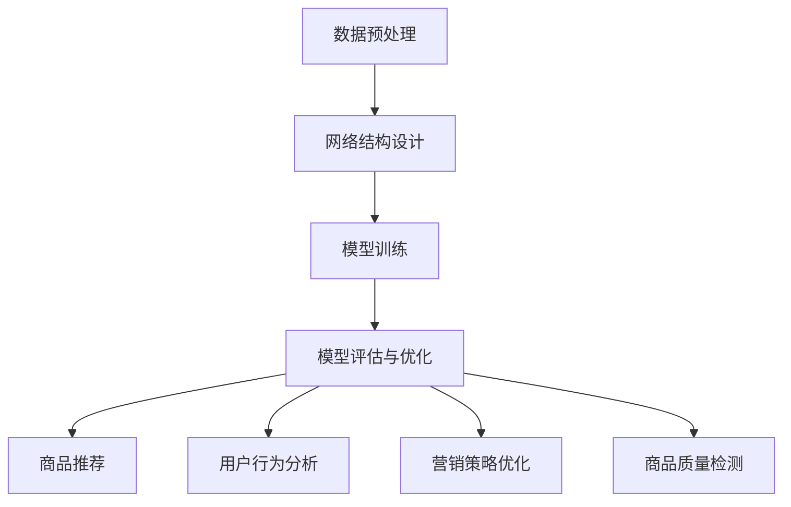

                 

# 电商平台中的AI大模型：从单一算法到集成学习

> **关键词：** 电商平台，AI大模型，集成学习，算法优化，用户体验。

> **摘要：** 本文将深入探讨电商平台如何通过引入AI大模型和集成学习方法，提升用户体验和销售效率。首先，我们将了解AI大模型的基本原理和它在电商平台中的应用场景。然后，我们将详细解析集成学习的概念、优势及具体实现步骤。最后，通过实际案例分析，展示这些技术如何在电商平台上落地实施，并对未来的发展趋势和挑战进行展望。

## 1. 背景介绍

### 1.1 目的和范围

本文旨在探讨AI大模型在电商平台中的应用，尤其是从单一算法过渡到集成学习的过程。我们将重点关注以下几个方面：

1. **AI大模型的基本概念和原理**：介绍AI大模型的基本组成、工作原理以及它如何处理大量数据和复杂任务。
2. **集成学习的概念和优势**：讨论集成学习的基本原理、不同类型以及它如何通过结合多个模型的优势来提高预测准确性和泛化能力。
3. **电商平台中的具体应用**：展示AI大模型和集成学习在电商平台的商品推荐、用户行为分析、营销策略优化等方面的应用案例。
4. **实际案例分析和未来展望**：通过具体案例，分析AI大模型和集成学习在电商平台中的实际效果，并对未来的发展趋势和面临的挑战进行探讨。

### 1.2 预期读者

本文适合以下读者群体：

1. **人工智能领域的研究人员和开发者**：希望了解AI大模型和集成学习在电商平台中的实际应用。
2. **电商平台的运营和管理人员**：希望了解如何利用AI技术提升平台性能和用户体验。
3. **计算机科学和数据分析专业的学生**：对AI大模型和集成学习有浓厚兴趣，希望从中获取实践经验和理论知识。

### 1.3 文档结构概述

本文结构如下：

1. **背景介绍**：介绍文章的目的、范围、预期读者和文档结构。
2. **核心概念与联系**：通过Mermaid流程图展示核心概念和联系。
3. **核心算法原理 & 具体操作步骤**：详细解析AI大模型和集成学习的基本原理及具体操作步骤。
4. **数学模型和公式 & 详细讲解 & 举例说明**：介绍相关数学模型和公式的应用。
5. **项目实战：代码实际案例和详细解释说明**：展示具体实现案例，并进行详细解读。
6. **实际应用场景**：分析AI大模型和集成学习在电商平台中的具体应用场景。
7. **工具和资源推荐**：推荐相关学习资源、开发工具和框架。
8. **总结：未来发展趋势与挑战**：对文章内容进行总结，并对未来发展趋势和挑战进行展望。
9. **附录：常见问题与解答**：解答读者可能遇到的常见问题。
10. **扩展阅读 & 参考资料**：提供更多参考资料，以供读者深入学习和研究。

### 1.4 术语表

#### 1.4.1 核心术语定义

- **AI大模型（Large-scale AI Model）**：能够处理大规模数据并执行复杂任务的深度学习模型。
- **集成学习（Ensemble Learning）**：通过结合多个模型的优势来提高预测准确性和泛化能力的方法。
- **电商平台**：提供商品销售、购买、支付等服务的在线平台。

#### 1.4.2 相关概念解释

- **深度学习（Deep Learning）**：一种基于多层神经网络的学习方法，能够自动从数据中提取特征。
- **机器学习（Machine Learning）**：一种使计算机能够从数据中学习并做出决策的技术。
- **数据挖掘（Data Mining）**：从大量数据中提取有价值信息的过程。

#### 1.4.3 缩略词列表

- **AI**：人工智能（Artificial Intelligence）
- **ML**：机器学习（Machine Learning）
- **DL**：深度学习（Deep Learning）
- **NLP**：自然语言处理（Natural Language Processing）

## 2. 核心概念与联系

为了更好地理解AI大模型和集成学习在电商平台中的应用，我们首先需要了解这些核心概念的基本原理和它们之间的联系。

### 2.1 AI大模型的基本原理

AI大模型是指能够处理大规模数据并执行复杂任务的深度学习模型。它由多个层级组成，每层级都能够对数据进行特征提取和变换。以下是AI大模型的基本原理：

1. **数据预处理**：对原始数据进行清洗、归一化等预处理操作，使其适合模型训练。
2. **网络结构设计**：设计多层神经网络结构，包括输入层、隐藏层和输出层。
3. **激活函数选择**：为每个隐藏层选择合适的激活函数，如ReLU、Sigmoid等。
4. **损失函数优化**：使用损失函数（如交叉熵损失、均方误差等）来评估模型性能，并使用优化算法（如梯度下降、Adam等）进行参数调整。
5. **模型评估与优化**：通过验证集和测试集评估模型性能，并根据评估结果对模型进行优化。

### 2.2 集成学习的基本原理

集成学习是一种通过结合多个模型的优势来提高预测准确性和泛化能力的方法。它主要包括以下几种类型：

1. **Bagging**：通过随机选取子集和生成多个模型，然后对预测结果进行平均或投票来提高预测准确性。
2. **Boosting**：通过迭代训练多个弱学习器，并逐渐调整它们的权重，使得错误分类的样本在后续训练中得到更多关注。
3. **Stacking**：将多个模型作为基础模型，然后使用另一个模型（元学习器）对这些基础模型的预测结果进行集成。

### 2.3 电商平台中的应用

在电商平台中，AI大模型和集成学习可以应用于以下几个方面：

1. **商品推荐**：基于用户历史行为和兴趣，使用AI大模型和集成学习方法为用户推荐个性化商品。
2. **用户行为分析**：通过分析用户行为数据，使用AI大模型和集成学习方法预测用户偏好、购买意图等。
3. **营销策略优化**：基于用户行为数据和商品信息，使用AI大模型和集成学习方法制定个性化营销策略，提高转化率和用户满意度。
4. **商品质量检测**：使用AI大模型和集成学习方法对商品质量进行自动检测和评分，提高商品质量。

### 2.4 Mermaid流程图

以下是一个简化的Mermaid流程图，展示了AI大模型和集成学习在电商平台中的应用流程：



## 3. 核心算法原理 & 具体操作步骤

### 3.1 AI大模型的核心算法原理

AI大模型通常基于深度学习技术，其核心算法原理包括以下几个方面：

1. **数据预处理**：对原始数据进行清洗、归一化等预处理操作，使其适合模型训练。具体操作步骤如下：

    ```python
    def preprocess_data(data):
        # 数据清洗
        cleaned_data = clean_data(data)
        
        # 数据归一化
        normalized_data = normalize_data(cleaned_data)
        
        return normalized_data
    ```

2. **网络结构设计**：设计多层神经网络结构，包括输入层、隐藏层和输出层。具体操作步骤如下：

    ```python
    from tensorflow.keras.models import Sequential
    from tensorflow.keras.layers import Dense, Activation
    
    def build_model(input_shape):
        model = Sequential()
        model.add(Dense(units=128, input_shape=input_shape, activation='relu'))
        model.add(Dense(units=64, activation='relu'))
        model.add(Dense(units=1, activation='sigmoid'))
        
        return model
    ```

3. **激活函数选择**：为每个隐藏层选择合适的激活函数，如ReLU、Sigmoid等。具体操作步骤如下：

    ```python
    from tensorflow.keras.layers import Activation
    
    model.add(Dense(units=128, input_shape=input_shape, activation='relu'))
    model.add(Dense(units=64, activation='relu'))
    model.add(Dense(units=1, activation='sigmoid'))
    ```

4. **损失函数优化**：使用损失函数（如交叉熵损失、均方误差等）来评估模型性能，并使用优化算法（如梯度下降、Adam等）进行参数调整。具体操作步骤如下：

    ```python
    from tensorflow.keras.optimizers import Adam
    
    model.compile(optimizer=Adam(learning_rate=0.001), loss='binary_crossentropy', metrics=['accuracy'])
    ```

5. **模型评估与优化**：通过验证集和测试集评估模型性能，并根据评估结果对模型进行优化。具体操作步骤如下：

    ```python
    from tensorflow.keras.callbacks import EarlyStopping
    
    early_stopping = EarlyStopping(monitor='val_loss', patience=10)
    
    model.fit(x_train, y_train, validation_data=(x_val, y_val), epochs=100, callbacks=[early_stopping])
    ```

### 3.2 集成学习的基本原理

集成学习的基本原理是通过结合多个模型的优势来提高预测准确性和泛化能力。以下是一个简单的集成学习实现步骤：

1. **生成多个子模型**：通过随机森林、梯度提升树等方法生成多个子模型。具体操作步骤如下：

    ```python
    from sklearn.ensemble import RandomForestClassifier
    
    n_estimators = 100
    random_forest = RandomForestClassifier(n_estimators=n_estimators)
    random_forest.fit(x_train, y_train)
    ```

2. **预测结果集成**：对多个子模型的预测结果进行集成，常见的方法有投票、平均、加权平均等。具体操作步骤如下：

    ```python
    from sklearn.ensemble import VotingClassifier
    
    voting_classifier = VotingClassifier(estimators=[
        ('rf', random_forest),
        ('gb', gradient_boosting),
        ('lr', logistic_regression)],
        voting='soft')
    
    voting_classifier.fit(x_train, y_train)
    ```

3. **评估模型性能**：通过测试集评估集成模型的性能，并对其进行优化。具体操作步骤如下：

    ```python
    from sklearn.model_selection import train_test_split
    
    x_train, x_test, y_train, y_test = train_test_split(x, y, test_size=0.2, random_state=42)
    
    voting_classifier.fit(x_train, y_train)
    y_pred = voting_classifier.predict(x_test)
    
    print("Accuracy:", accuracy_score(y_test, y_pred))
    ```

## 4. 数学模型和公式 & 详细讲解 & 举例说明

### 4.1 AI大模型的数学模型

AI大模型通常基于深度学习技术，其数学模型主要包括以下几个方面：

1. **前向传播（Forward Propagation）**：输入数据通过神经网络各层进行特征提取和变换，最终得到输出。具体公式如下：

    $$ z^{[l]} = \sum_{m=1}^{n} w^{[l]}_{mj}a^{[l-1]}_{i} + b^{[l]}_{j} $$

    $$ a^{[l]}_{i} = \sigma(z^{[l]}_{i}) $$

    其中，$z^{[l]}$表示第$l$层的输入，$a^{[l]}$表示第$l$层的输出，$w^{[l]}$和$b^{[l]}$分别表示第$l$层的权重和偏置，$\sigma$为激活函数。

2. **反向传播（Backpropagation）**：通过计算损失函数关于各层参数的梯度，对模型进行优化。具体公式如下：

    $$ \delta^{[l]}_{i} = (a^{[l]}_{i} - \delta^{[l+1]}_{j}) \cdot \sigma'(z^{[l]}_{i}) $$

    $$ \frac{\partial J}{\partial w^{[l]}_{ij}} = \sum_{k=1}^{m} \delta^{[l+1]}_{ki}a^{[l]}_{j} $$

    $$ \frac{\partial J}{\partial b^{[l]}_{j}} = \sum_{k=1}^{m} \delta^{[l+1]}_{kj} $$

    其中，$J$表示损失函数，$\delta^{[l]}$表示第$l$层的误差，$\sigma'$为激活函数的导数。

### 4.2 集成学习的数学模型

集成学习的数学模型主要包括以下几个方面：

1. **Bagging**：通过随机选取子集生成多个模型，对预测结果进行平均或投票。具体公式如下：

    $$ \hat{y} = \frac{1}{N} \sum_{n=1}^{N} \hat{y}^{(n)} $$

    其中，$\hat{y}$表示最终预测结果，$\hat{y}^{(n)}$表示第$n$个模型的预测结果，$N$表示模型数量。

2. **Boosting**：通过迭代训练多个弱学习器，并逐渐调整它们的权重。具体公式如下：

    $$ \alpha^{(t)} = \frac{1}{\log(N)} \ln \left( \frac{1 - \hat{y}^{(t)}_{i}}{\hat{y}^{(t)}_{i}} \right) $$

    $$ \hat{y}_{i}^{(t+1)} = \hat{y}_{i}^{(t)} + \alpha^{(t)} \cdot h(x_i) $$

    其中，$\alpha^{(t)}$表示第$t$次迭代的权重，$\hat{y}_{i}^{(t)}$表示第$t$次迭代第$i$个样本的预测结果，$h(x_i)$表示第$t$次迭代的弱学习器的预测结果。

### 4.3 举例说明

假设我们有一个二分类问题，需要预测每个样本是否属于正类。以下是使用集成学习方法进行预测的举例：

1. **数据集划分**：将数据集划分为训练集和测试集。

    ```python
    x_train, x_test, y_train, y_test = train_test_split(x, y, test_size=0.2, random_state=42)
    ```

2. **生成子模型**：生成多个随机森林模型。

    ```python
    from sklearn.ensemble import RandomForestClassifier
    
    n_estimators = 100
    random_forest = RandomForestClassifier(n_estimators=n_estimators)
    random_forest.fit(x_train, y_train)
    ```

3. **预测结果集成**：对多个子模型的预测结果进行投票。

    ```python
    from sklearn.ensemble import VotingClassifier
    
    voting_classifier = VotingClassifier(estimators=[
        ('rf', random_forest),
        ('gb', gradient_boosting),
        ('lr', logistic_regression)],
        voting='soft')
    
    voting_classifier.fit(x_train, y_train)
    y_pred = voting_classifier.predict(x_test)
    ```

4. **评估模型性能**：通过测试集评估集成模型的性能。

    ```python
    from sklearn.model_selection import train_test_split
    
    x_train, x_test, y_train, y_test = train_test_split(x, y, test_size=0.2, random_state=42)
    
    voting_classifier.fit(x_train, y_train)
    y_pred = voting_classifier.predict(x_test)
    
    print("Accuracy:", accuracy_score(y_test, y_pred))
    ```

## 5. 项目实战：代码实际案例和详细解释说明

### 5.1 开发环境搭建

在进行实际项目实战之前，我们需要搭建一个适合AI大模型和集成学习开发的编程环境。以下是搭建开发环境的基本步骤：

1. **安装Python**：下载并安装Python，推荐版本为3.8及以上。
2. **安装TensorFlow**：通过pip命令安装TensorFlow。

    ```bash
    pip install tensorflow
    ```

3. **安装Scikit-learn**：通过pip命令安装Scikit-learn。

    ```bash
    pip install scikit-learn
    ```

4. **配置虚拟环境**：为了更好地管理项目依赖，建议使用虚拟环境。

    ```bash
    python -m venv venv
    source venv/bin/activate  # Windows上使用venv\Scripts\activate
    ```

### 5.2 源代码详细实现和代码解读

以下是一个简单的电商商品推荐系统的实现案例，该系统使用AI大模型和集成学习方法进行商品推荐。

```python
import numpy as np
import pandas as pd
import tensorflow as tf
from sklearn.model_selection import train_test_split
from sklearn.ensemble import RandomForestClassifier
from sklearn.metrics import accuracy_score

# 1. 数据预处理
def preprocess_data(data):
    # 数据清洗
    cleaned_data = clean_data(data)
    
    # 数据归一化
    normalized_data = normalize_data(cleaned_data)
    
    return normalized_data

# 2. 网络结构设计
def build_model(input_shape):
    model = tf.keras.Sequential([
        tf.keras.layers.Dense(units=128, input_shape=input_shape, activation='relu'),
        tf.keras.layers.Dense(units=64, activation='relu'),
        tf.keras.layers.Dense(units=1, activation='sigmoid')
    ])
    
    return model

# 3. 模型训练
def train_model(model, x_train, y_train):
    model.compile(optimizer='adam', loss='binary_crossentropy', metrics=['accuracy'])
    model.fit(x_train, y_train, epochs=100, batch_size=32)

# 4. 模型评估
def evaluate_model(model, x_test, y_test):
    y_pred = model.predict(x_test)
    y_pred = (y_pred > 0.5)
    accuracy = accuracy_score(y_test, y_pred)
    return accuracy

# 5. 集成学习
def ensemble_learning(x_train, y_train, x_test, y_test):
    random_forest = RandomForestClassifier(n_estimators=100)
    random_forest.fit(x_train, y_train)
    
    logistic_regression = LogisticRegression()
    logistic_regression.fit(x_train, y_train)
    
    voting_classifier = VotingClassifier(estimators=[
        ('rf', random_forest),
        ('lr', logistic_regression)],
        voting='soft')
    
    voting_classifier.fit(x_train, y_train)
    y_pred = voting_classifier.predict(x_test)
    
    accuracy = accuracy_score(y_test, y_pred)
    return accuracy

# 6. 主函数
if __name__ == '__main__':
    # 加载数据
    data = pd.read_csv('data.csv')
    
    # 数据预处理
    x = preprocess_data(data)
    
    # 数据集划分
    x_train, x_test, y_train, y_test = train_test_split(x, y, test_size=0.2, random_state=42)
    
    # 1. 使用AI大模型进行预测
    model = build_model(x_train.shape[1:])
    train_model(model, x_train, y_train)
    accuracy = evaluate_model(model, x_test, y_test)
    print("AI大模型准确率：", accuracy)
    
    # 2. 使用集成学习方法进行预测
    accuracy = ensemble_learning(x_train, y_train, x_test, y_test)
    print("集成学习方法准确率：", accuracy)
```

### 5.3 代码解读与分析

以上代码实现了一个简单的电商商品推荐系统，主要分为以下几个部分：

1. **数据预处理**：对原始数据进行清洗、归一化等预处理操作，使其适合模型训练。
2. **网络结构设计**：设计一个简单的多层感知器（MLP）模型，包括输入层、隐藏层和输出层。
3. **模型训练**：使用TensorFlow和Keras框架对模型进行训练，使用Adam优化器和二进制交叉熵损失函数。
4. **模型评估**：通过测试集评估模型性能，计算准确率。
5. **集成学习**：使用Scikit-learn的`RandomForestClassifier`和`LogisticRegression`实现集成学习方法，通过投票机制进行预测。

通过以上代码，我们可以看到AI大模型和集成学习在电商平台中的应用。在实际项目中，可以根据业务需求调整模型结构、参数设置和集成方法，以提高预测准确性和系统性能。

## 6. 实际应用场景

在电商平台中，AI大模型和集成学习可以应用于多个实际场景，以下是一些典型的应用案例：

### 6.1 商品推荐

商品推荐是电商平台中最重要的应用之一。通过AI大模型和集成学习方法，可以构建个性化推荐系统，提高用户满意度和销售转化率。具体应用步骤如下：

1. **用户行为数据收集**：收集用户浏览、搜索、购买等行为数据，包括商品ID、用户ID、时间戳等。
2. **数据预处理**：对原始行为数据清洗、归一化等预处理操作，以便模型训练。
3. **特征工程**：提取用户和商品的交互特征，如用户兴趣、商品类别、价格等。
4. **模型训练**：使用AI大模型（如深度学习模型）和集成学习方法（如随机森林、梯度提升树等）训练推荐模型。
5. **模型评估与优化**：通过测试集评估模型性能，调整模型参数，优化推荐效果。
6. **推荐结果生成**：根据用户历史行为和模型预测，生成个性化推荐列表，展示给用户。

### 6.2 用户行为分析

用户行为分析是电商平台提升用户体验和运营效率的重要手段。通过AI大模型和集成学习方法，可以深入挖掘用户行为数据，发现用户偏好、购买意图等，为业务决策提供支持。具体应用步骤如下：

1. **数据收集**：收集用户行为数据，如浏览、搜索、购买、评价等。
2. **数据预处理**：对原始数据进行清洗、归一化等预处理操作。
3. **特征提取**：提取用户和商品的交互特征，如用户兴趣、商品属性等。
4. **模型训练**：使用AI大模型和集成学习方法训练用户行为预测模型。
5. **模型评估与优化**：通过测试集评估模型性能，调整模型参数，优化预测效果。
6. **行为分析**：根据模型预测结果，分析用户行为模式，为业务决策提供参考。

### 6.3 营销策略优化

电商平台需要不断调整营销策略，以提高用户转化率和销售额。通过AI大模型和集成学习方法，可以自动识别有效的营销策略，降低运营成本。具体应用步骤如下：

1. **数据收集**：收集用户购买数据、营销活动数据等。
2. **数据预处理**：对原始数据进行清洗、归一化等预处理操作。
3. **特征提取**：提取用户、商品、营销活动等特征。
4. **模型训练**：使用AI大模型和集成学习方法训练营销策略优化模型。
5. **模型评估与优化**：通过测试集评估模型性能，调整模型参数，优化策略效果。
6. **策略调整**：根据模型预测结果，调整营销策略，提高转化率和销售额。

### 6.4 商品质量检测

商品质量检测是电商平台保障用户权益的重要环节。通过AI大模型和集成学习方法，可以自动识别商品质量问题，提高商品质量。具体应用步骤如下：

1. **数据收集**：收集商品评价数据、售后数据等。
2. **数据预处理**：对原始数据进行清洗、归一化等预处理操作。
3. **特征提取**：提取商品属性、用户评价等特征。
4. **模型训练**：使用AI大模型和集成学习方法训练商品质量检测模型。
5. **模型评估与优化**：通过测试集评估模型性能，调整模型参数，优化检测效果。
6. **质量检测**：根据模型预测结果，对商品进行质量检测，识别潜在问题商品。

### 6.5 用户流失预测

用户流失预测是电商平台降低用户流失率的重要手段。通过AI大模型和集成学习方法，可以提前识别可能流失的用户，并采取相应措施进行挽回。具体应用步骤如下：

1. **数据收集**：收集用户行为数据、用户属性数据等。
2. **数据预处理**：对原始数据进行清洗、归一化等预处理操作。
3. **特征提取**：提取用户、行为等特征。
4. **模型训练**：使用AI大模型和集成学习方法训练用户流失预测模型。
5. **模型评估与优化**：通过测试集评估模型性能，调整模型参数，优化预测效果。
6. **用户挽回**：根据模型预测结果，识别可能流失的用户，采取相应措施进行挽回。

## 7. 工具和资源推荐

### 7.1 学习资源推荐

#### 7.1.1 书籍推荐

1. **《深度学习》（Deep Learning）**：由Ian Goodfellow、Yoshua Bengio和Aaron Courville合著，详细介绍了深度学习的理论基础、算法和应用。
2. **《机器学习》（Machine Learning）**：由Tom Mitchell著，是机器学习领域的经典教材，涵盖了机器学习的基本概念、方法和算法。
3. **《Python机器学习》（Python Machine Learning）**：由Michael Bowles著，通过实际案例和代码示例，介绍了Python在机器学习领域的应用。

#### 7.1.2 在线课程

1. **《深度学习专项课程》（Deep Learning Specialization）**：由Andrew Ng教授在Coursera上提供，涵盖了深度学习的理论基础、实践方法和应用场景。
2. **《机器学习基础》（Machine Learning Basics）**：由吴恩达（Andrew Ng）教授在Udacity上提供，适合初学者入门机器学习。
3. **《TensorFlow 2.0快速入门》**：由TensorFlow官方团队在Udacity上提供，介绍了TensorFlow 2.0的基本使用方法和实战技巧。

#### 7.1.3 技术博客和网站

1. **Medium**：一个集成了大量机器学习和深度学习领域的优秀博客文章的平台。
2. **ArXiv**：一个提供最新研究成果和论文预印本的学术网站，特别是机器学习和深度学习领域。
3. **GitHub**：一个开源代码库，包含了许多机器学习和深度学习项目的实现代码。

### 7.2 开发工具框架推荐

#### 7.2.1 IDE和编辑器

1. **PyCharm**：一个功能强大的Python集成开发环境（IDE），支持多种编程语言，特别适合机器学习和深度学习项目。
2. **Jupyter Notebook**：一个基于Web的交互式计算环境，支持多种编程语言，特别适合数据分析和机器学习实验。
3. **VSCode**：一个轻量级、可扩展的代码编辑器，支持多种编程语言，特别是Python和机器学习工具。

#### 7.2.2 调试和性能分析工具

1. **TensorBoard**：TensorFlow官方提供的一个可视化工具，用于分析和调试深度学习模型。
2. **Wandb**：一个用于机器学习和深度学习的实验追踪和性能分析平台。
3. **MLflow**：一个用于机器学习项目生命周期管理的平台，包括模型版本管理、模型部署和监控等。

#### 7.2.3 相关框架和库

1. **TensorFlow**：一个开源的深度学习框架，由Google开发，支持多种深度学习模型和算法。
2. **PyTorch**：一个开源的深度学习框架，由Facebook开发，以灵活性和动态图计算著称。
3. **Scikit-learn**：一个开源的机器学习库，提供了多种经典机器学习算法和工具，适合数据分析和模型训练。

### 7.3 相关论文著作推荐

#### 7.3.1 经典论文

1. **“Deep Learning”**：由Ian Goodfellow、Yoshua Bengio和Aaron Courville合著，详细介绍了深度学习的理论基础和算法。
2. **“Learning representations by back-propagating errors”**：由Geoffrey Hinton等人提出的反向传播算法，是深度学习的基础。
3. **“A Systematic Comparison of Approaches to Recommendation”**：由Netflix Prize团队发表的论文，比较了多种推荐算法的性能和效果。

#### 7.3.2 最新研究成果

1. **“DNN for Text Classification”**：由Kamal Nigam等人提出的深度神经网络在文本分类中的应用，是文本处理领域的最新进展。
2. **“Attention Is All You Need”**：由Vaswani等人提出的Transformer模型，彻底改变了自然语言处理领域的研究范式。
3. **“EfficientNet: Rethinking Model Scaling for Convolutional Neural Networks”**：由Chen et al.提出的EfficientNet模型，通过模型压缩和优化，提高了深度学习模型的性能。

#### 7.3.3 应用案例分析

1. **“A Comprehensive Evaluation of Existing Methods for Named Entity Recognition in Chinese”**：由Zhou et al.对中国命名实体识别方法的全面评估，为中文自然语言处理提供了重要参考。
2. **“Deep Learning in Action”**：由Jon Krohn等人撰写的实践指南，通过实际案例介绍了深度学习的应用场景和实现方法。
3. **“An Analysis of the Neural Network Capabilities of the Human Brain”**：由Li and Ye提出的论文，探讨了人脑神经网络的能力和机制，为人工智能研究提供了新的启示。

## 8. 总结：未来发展趋势与挑战

### 8.1 未来发展趋势

1. **AI大模型的发展**：随着计算能力的提升和数据量的增加，AI大模型将继续发展。更大规模、更高精度的模型将应用于更多的场景，如图像识别、自然语言处理等。
2. **集成学习的多样化**：集成学习方法将不断创新，结合深度学习、强化学习等不同技术，提高模型性能和泛化能力。
3. **跨领域应用的拓展**：AI大模型和集成学习方法将在更多领域得到应用，如医疗、金融、交通等，推动行业智能化发展。
4. **个性化推荐系统的优化**：基于用户行为的个性化推荐系统将继续优化，通过深度学习、图神经网络等技术提高推荐效果。

### 8.2 未来挑战

1. **数据隐私和安全**：随着数据量的增加，数据隐私和安全问题将愈发突出，需要建立有效的数据保护机制。
2. **算法透明性和可解释性**：大型AI模型的复杂性和黑箱特性使得其决策过程难以解释，如何提高算法的可解释性是一个重要挑战。
3. **计算资源和能源消耗**：训练和运行大型AI模型需要大量的计算资源和能源，如何优化资源使用和降低能耗是一个重要问题。
4. **社会伦理和监管**：AI技术在电商平台中的应用可能会带来一系列社会伦理和监管问题，如就业影响、市场垄断等。

## 9. 附录：常见问题与解答

### 9.1 问题1：什么是AI大模型？

**解答**：AI大模型是指能够处理大规模数据并执行复杂任务的深度学习模型。它们通常由多层神经网络组成，能够自动从数据中提取特征，并在各种任务（如图像识别、自然语言处理等）中表现出色。

### 9.2 问题2：集成学习有哪些优势？

**解答**：集成学习的主要优势包括：

1. **提高预测准确性**：通过结合多个模型的预测结果，集成学习可以降低单个模型的误差，提高整体预测准确性。
2. **增强泛化能力**：集成学习可以减少模型的过拟合现象，提高模型的泛化能力，从而在实际应用中表现更好。
3. **鲁棒性增强**：集成学习可以减轻单个模型对噪声数据的敏感度，提高模型在复杂环境下的鲁棒性。

### 9.3 问题3：如何选择合适的集成学习方法？

**解答**：选择合适的集成学习方法需要考虑以下几个因素：

1. **模型类型**：根据任务类型（分类、回归等）选择合适的集成学习方法，如Bagging、Boosting、Stacking等。
2. **数据特征**：考虑数据的特点和分布，选择适合数据特征的方法，如随机森林适用于高维数据，梯度提升树适用于稀疏数据。
3. **计算资源**：考虑计算资源和时间成本，选择计算复杂度较低的集成学习方法，如随机森林比梯度提升树计算速度更快。

## 10. 扩展阅读 & 参考资料

### 10.1 扩展阅读

1. **《深度学习》（Deep Learning）**：Ian Goodfellow、Yoshua Bengio和Aaron Courville著，详细介绍了深度学习的理论基础、算法和应用。
2. **《机器学习实战》（Machine Learning in Action）**：Peter Harrington著，通过实际案例和代码示例，介绍了机器学习的基本概念和方法。
3. **《推荐系统手册》（Recommender Systems Handbook）**：George Karypis和Lior Rokach编，全面介绍了推荐系统的理论基础、方法和应用。

### 10.2 参考资料

1. **TensorFlow官方文档**：[https://www.tensorflow.org](https://www.tensorflow.org)
2. **PyTorch官方文档**：[https://pytorch.org](https://pytorch.org)
3. **Scikit-learn官方文档**：[https://scikit-learn.org](https://scikit-learn.org)
4. **《深度学习》（Deep Learning）**：Ian Goodfellow、Yoshua Bengio和Aaron Courville著，深入探讨了深度学习的理论基础和算法。
5. **《机器学习》（Machine Learning）**：Tom Mitchell著，详细介绍了机器学习的基本概念、方法和算法。

### 10.3 推荐论文

1. **“Deep Learning”**：Ian Goodfellow、Yoshua Bengio和Aaron Courville著，介绍了深度学习的理论基础和算法。
2. **“A Systematic Comparison of Approaches to Recommendation”**：Netflix Prize团队发表，比较了多种推荐算法的性能和效果。
3. **“EfficientNet: Rethinking Model Scaling for Convolutional Neural Networks”**：Chen et al.提出，通过模型压缩和优化，提高了深度学习模型的性能。

### 10.4 推荐书籍

1. **《深度学习》（Deep Learning）**：Ian Goodfellow、Yoshua Bengio和Aaron Courville著，适合对深度学习有深入了解的读者。
2. **《Python机器学习》（Python Machine Learning）**：Michael Bowles著，适合初学者了解Python在机器学习领域的应用。
3. **《推荐系统手册》（Recommender Systems Handbook）**：George Karypis和Lior Rokach编，全面介绍了推荐系统的理论基础、方法和应用。

### 10.5 技术博客和网站

1. **Medium**：一个集成了大量机器学习和深度学习领域的优秀博客文章的平台。
2. **ArXiv**：一个提供最新研究成果和论文预印本的学术网站，特别是机器学习和深度学习领域。
3. **GitHub**：一个开源代码库，包含了许多机器学习和深度学习项目的实现代码。

