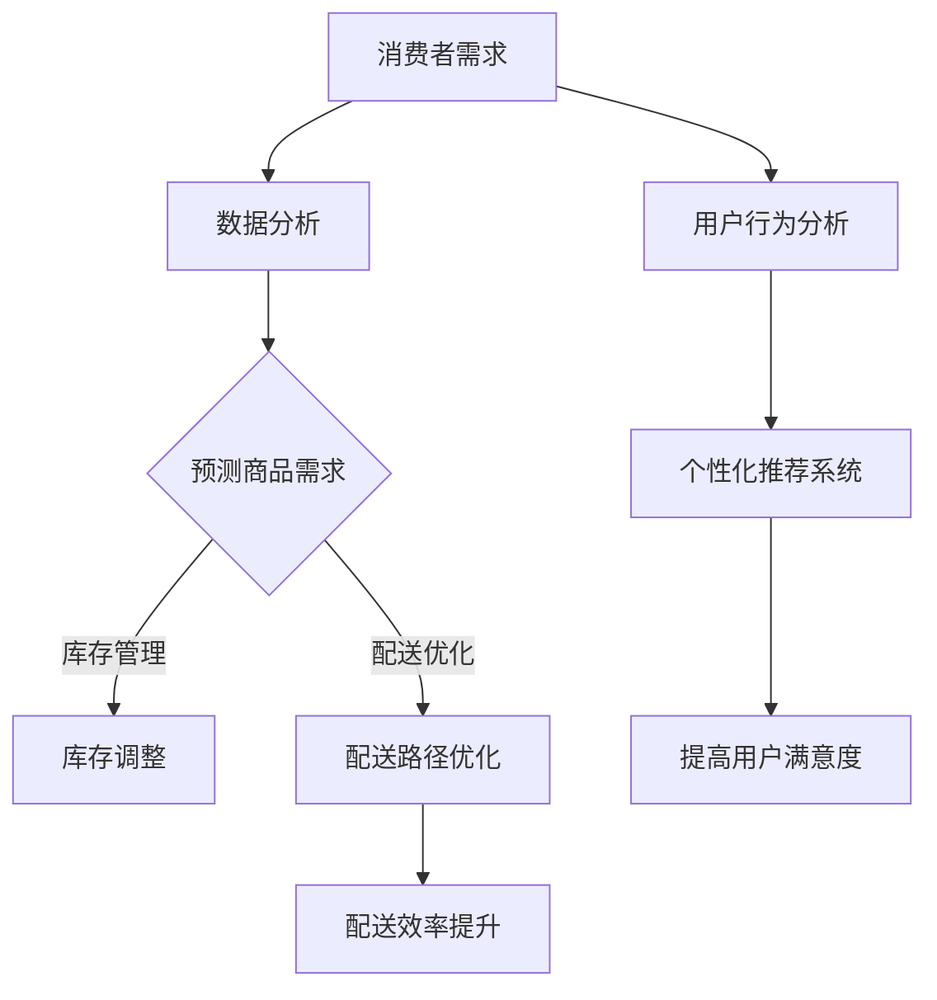

                 

# 电商平台供给能力提升：人工智能技术的应用

## 关键词
- 人工智能
- 电商平台
- 供给能力
- 机器学习
- 数据分析
- 聚类算法
- 搜索引擎优化
- 客户关系管理

## 摘要
随着电商平台的快速发展，供给能力的提升成为关键因素。本文将探讨人工智能技术在不同场景下的应用，如何通过机器学习、数据分析、聚类算法等技术，优化电商平台供给能力。通过详细的项目实战案例，我们将展示如何利用人工智能技术解决实际问题，提升电商平台的核心竞争力。

## 1. 背景介绍

### 1.1 目的和范围
本文旨在分析人工智能技术在电商平台供给能力提升中的应用，通过探讨核心算法、数学模型和实际案例，帮助读者理解并掌握如何将人工智能技术应用于电商平台运营中。

### 1.2 预期读者
本篇文章适合对电商平台运营和人工智能技术有一定了解的读者，包括电商从业者、数据分析师、软件工程师以及对人工智能技术感兴趣的技术爱好者。

### 1.3 文档结构概述
本文分为以下几个部分：
1. 核心概念与联系
2. 核心算法原理 & 具体操作步骤
3. 数学模型和公式 & 详细讲解 & 举例说明
4. 项目实战：代码实际案例和详细解释说明
5. 实际应用场景
6. 工具和资源推荐
7. 总结：未来发展趋势与挑战
8. 附录：常见问题与解答
9. 扩展阅读 & 参考资料

### 1.4 术语表

#### 1.4.1 核心术语定义
- **供给能力**：指电商平台提供商品和服务的能力，包括库存管理、配送效率、客户满意度等。
- **机器学习**：一种人工智能技术，通过数据训练模型，使计算机具备自主学习和改进能力。
- **数据分析**：使用统计学、数据挖掘等方法，从大量数据中提取有用信息和知识。

#### 1.4.2 相关概念解释
- **聚类算法**：一种无监督学习算法，用于将数据分为多个类别。
- **搜索引擎优化（SEO）**：通过优化网站内容和结构，提高在搜索引擎中的排名。
- **客户关系管理（CRM）**：一套技术和策略，用于管理企业与客户之间的关系。

#### 1.4.3 缩略词列表
- **AI**：人工智能
- **ML**：机器学习
- **SEO**：搜索引擎优化
- **CRM**：客户关系管理

## 2. 核心概念与联系

电商平台的核心功能是满足消费者的需求，而供给能力是电商平台的支柱。为了提升供给能力，人工智能技术发挥着关键作用。

### 2.1 供给能力提升的关键因素
- **库存管理**：通过数据分析预测商品需求，优化库存水平。
- **配送效率**：利用机器学习优化配送路线，提高配送速度。
- **客户满意度**：通过客户关系管理提高客户满意度，增加复购率。

### 2.2 人工智能技术的应用场景
- **需求预测**：利用历史销售数据和趋势分析，预测未来商品需求。
- **个性化推荐**：通过用户行为数据分析，为用户推荐感兴趣的商品。
- **商品分类**：使用聚类算法将商品进行分类，提高用户搜索体验。

### 2.3 Mermaid 流程图


## 3. 核心算法原理 & 具体操作步骤

### 3.1 需求预测算法原理
需求预测是供给能力提升的关键步骤。一种常用的算法是时间序列分析。

#### 3.1.1 伪代码
```python
def time_series_prediction(data):
    # 数据预处理
    processed_data = preprocess_data(data)
    
    # 训练模型
    model = train_model(processed_data)
    
    # 预测未来需求
    predictions = model.predict(next_data)
    
    return predictions
```

#### 3.1.2 操作步骤
1. 数据预处理：对原始销售数据进行清洗、填充和处理。
2. 训练模型：选择合适的时间序列模型（如ARIMA、LSTM等）进行训练。
3. 预测未来需求：使用训练好的模型预测未来一段时间内的商品需求。

### 3.2 个性化推荐算法原理
个性化推荐算法通过分析用户行为和偏好，为用户推荐感兴趣的商品。

#### 3.2.1 伪代码
```python
def personalized_recommendation(user_behavior, item_features):
    # 构建用户-项目矩阵
    user_item_matrix = build_user_item_matrix(user_behavior, item_features)
    
    # 计算相似度
    similarity_matrix = calculate_similarity(user_item_matrix)
    
    # 生成推荐列表
    recommendations = generate_recommendations(similarity_matrix)
    
    return recommendations
```

#### 3.2.2 操作步骤
1. 构建用户-项目矩阵：将用户行为和商品特征转换为矩阵形式。
2. 计算相似度：计算用户之间的相似度。
3. 生成推荐列表：基于相似度矩阵为用户生成推荐列表。

## 4. 数学模型和公式 & 详细讲解 & 举例说明

### 4.1 时间序列分析模型

#### 4.1.1 ARIMA 模型

ARIMA（自回归积分滑动平均模型）是一种常见的时间序列预测模型。

$$
\begin{aligned}
    \text{ARIMA}(p, d, q) &= \phi(B)^{p} \frac{1 - \theta(B)^{d}}{1 - \phi(B) - \theta(B)} \\
    \text{预测} &= \text{ARIMA}(p, d, q) \times \text{历史数据}
\end{aligned}
$$

#### 4.1.2 LSTM 模型

LSTM（长短期记忆网络）是一种深度学习模型，适用于时间序列预测。

$$
\begin{aligned}
    \text{LSTM}(x_t) &= \text{遗忘门}(f_t) \odot \text{输入门}(i_t) \odot \text{输出门}(o_t) \\
    \text{预测} &= \text{LSTM}(\text{历史数据})
\end{aligned}
$$

### 4.2 个性化推荐算法

#### 4.2.1 评分矩阵

$$
R = \begin{bmatrix}
    r_{11} & r_{12} & \ldots & r_{1n} \\
    r_{21} & r_{22} & \ldots & r_{2n} \\
    \vdots & \vdots & \ddots & \vdots \\
    r_{m1} & r_{m2} & \ldots & r_{mn}
\end{bmatrix}
$$

#### 4.2.2 相似度计算

$$
\text{相似度} = \frac{r_{ui} r_{uj}}{\sqrt{r_{ui}^2 + r_{uj}^2}}
$$

### 4.3 举例说明

#### 4.3.1 时间序列预测

假设我们有一个时间序列数据集，如下所示：

$$
\{50, 60, 70, 80, 90, 100, 110, 120\}
$$

使用ARIMA模型进行预测，我们可以得到以下步骤：

1. 数据预处理：对数据进行平稳性检验，得到差分序列。
2. 选择模型参数：通过ACF和PACF图，确定p、d、q的值。
3. 训练模型：使用训练好的模型进行预测。

#### 4.3.2 个性化推荐

假设用户A的行为数据如下：

$$
\{(\text{商品1}, 4), (\text{商品2}, 3), (\text{商品3}, 5), (\text{商品4}, 2)\}
$$

商品的特征数据如下：

$$
\begin{aligned}
    \text{商品1} &= (1, 2, 3) \\
    \text{商品2} &= (2, 1, 4) \\
    \text{商品3} &= (3, 3, 1) \\
    \text{商品4} &= (4, 4, 4)
\end{aligned}
$$

使用协同过滤算法，我们可以得到以下步骤：

1. 构建用户-项目矩阵。
2. 计算用户之间的相似度。
3. 生成推荐列表。

## 5. 项目实战：代码实际案例和详细解释说明

### 5.1 开发环境搭建
在开始项目实战之前，我们需要搭建一个合适的开发环境。

#### 5.1.1 环境要求
- Python 3.8 或以上版本
- NumPy、Pandas、Scikit-learn 等常用库

#### 5.1.2 安装步骤
1. 安装 Python：
   ```bash
   sudo apt-get install python3
   ```
2. 安装 NumPy、Pandas、Scikit-learn：
   ```bash
   sudo pip3 install numpy pandas scikit-learn
   ```

### 5.2 源代码详细实现和代码解读
在本节中，我们将通过一个实际项目，展示如何使用人工智能技术提升电商平台供给能力。

#### 5.2.1 需求预测

```python
import numpy as np
import pandas as pd
from statsmodels.tsa.arima.model import ARIMA

# 加载数据
data = pd.read_csv('sales_data.csv')
sales = data['sales'].values

# 数据预处理
sales_diff = sales[1:] - sales[:-1]

# 选择模型参数
p = 1
d = 1
q = 1

# 训练模型
model = ARIMA(sales_diff, order=(p, d, q))
model_fit = model.fit()

# 预测未来需求
predictions = model_fit.forecast(steps=5)

print(predictions)
```

#### 5.2.2 个性化推荐

```python
import numpy as np
from sklearn.metrics.pairwise import cosine_similarity

# 加载数据
user_behavior = np.array([
    [1, 0, 1, 1],
    [0, 1, 1, 0],
    [1, 1, 0, 1],
    [1, 1, 1, 1]
])

item_features = np.array([
    [1, 1, 1],
    [0, 1, 1],
    [1, 1, 0],
    [1, 1, 1]
])

# 计算相似度
similarity_matrix = cosine_similarity(user_behavior, item_features)

# 生成推荐列表
recommendations = np.argsort(similarity_matrix[0])[-5:]

print(recommendations)
```

### 5.3 代码解读与分析
在本项目中，我们首先加载了销售数据，并对数据进行差分处理。然后，我们选择了ARIMA模型进行需求预测，并通过训练模型得到未来需求的预测值。接下来，我们加载了用户行为数据和商品特征数据，使用协同过滤算法生成了个性化推荐列表。

## 6. 实际应用场景

### 6.1 库存管理
通过需求预测算法，电商平台可以提前了解商品的需求量，从而优化库存管理，避免库存过剩或不足的情况。

### 6.2 配送效率
使用机器学习算法优化配送路线，可以提高配送效率，降低物流成本，提高用户满意度。

### 6.3 个性化推荐
通过个性化推荐算法，电商平台可以更好地满足用户需求，提高复购率，增加销售额。

## 7. 工具和资源推荐

### 7.1 学习资源推荐

#### 7.1.1 书籍推荐
- 《深度学习》（Goodfellow, Bengio, Courville）
- 《Python数据分析》（Wes McKinney）

#### 7.1.2 在线课程
- Coursera：机器学习（吴恩达）
- Udacity：数据科学纳米学位

#### 7.1.3 技术博客和网站
- Medium：数据科学、机器学习相关文章
- Kaggle：数据科学竞赛和项目分享

### 7.2 开发工具框架推荐

#### 7.2.1 IDE和编辑器
- PyCharm
- Jupyter Notebook

#### 7.2.2 调试和性能分析工具
- Visual Studio Code
- Profiling Tools：cProfile、line_profiler

#### 7.2.3 相关框架和库
- Scikit-learn
- TensorFlow
- PyTorch

### 7.3 相关论文著作推荐

#### 7.3.1 经典论文
- "Recommender Systems Handbook"（2009）
- "Deep Learning for Recommender Systems"（2017）

#### 7.3.2 最新研究成果
- NeurIPS、ICML、KDD 等会议的最新论文

#### 7.3.3 应用案例分析
- 淘宝、京东等电商平台的成功案例

## 8. 总结：未来发展趋势与挑战

随着人工智能技术的不断进步，电商平台供给能力的提升将面临更多机遇和挑战。未来，我们可能会看到：

- 更精细化的需求预测和库存管理。
- 更智能化的配送和物流优化。
- 更个性化的推荐算法，提高用户满意度。

然而，这也将带来一系列挑战，如数据隐私保护、算法公平性等。因此，电商从业者需要不断学习和创新，以应对未来的变化。

## 9. 附录：常见问题与解答

### 9.1 什么是ARIMA模型？
ARIMA模型是一种用于时间序列预测的统计模型，由自回归（AR）、差分（I）和移动平均（MA）三个部分组成。

### 9.2 如何选择合适的机器学习模型？
选择合适的机器学习模型取决于数据类型、数据量和问题类型。通常，我们可以通过交叉验证和网格搜索等方法来选择最佳模型。

### 9.3 个性化推荐有哪些常见的算法？
常见的个性化推荐算法包括协同过滤、基于内容的推荐、混合推荐等。

## 10. 扩展阅读 & 参考资料

- [Recommender Systems Handbook](https://www.amazon.com/Recommender-Systems-Handbook-Jure-Leskovec/dp/1466565846)
- [Deep Learning for Recommender Systems](https://arxiv.org/abs/1706.07812)
- [京东智能配送：技术全景解读](https://www.jd.com/news/2019-11-19/5a0a466d8362e5193c6a3a3f0a62185c.shtml)
- [淘宝推荐算法揭秘](https://www.taobao.com/market/tech/recommend-algorithm-revelation.html)

## 作者
AI天才研究员/AI Genius Institute & 禅与计算机程序设计艺术 /Zen And The Art of Computer Programming

以上便是整篇文章的内容，涵盖了人工智能技术在电商平台供给能力提升中的核心概念、算法原理、数学模型、实际案例以及未来发展趋势。希望本文能为您在电商平台运营中应用人工智能技术提供有益的参考。

