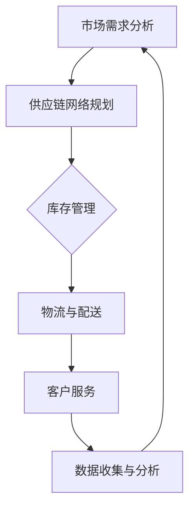

                 

# 电商平台供给能力提升：供应链管理的优化策略

> **关键词：** 电商平台、供给能力、供应链管理、优化策略、物流、数据驱动、人工智能。

> **摘要：** 随着互联网和电子商务的快速发展，电商平台已成为现代零售业的核心。本文将深入探讨如何通过优化供应链管理策略，提升电商平台的供给能力，从而提高客户满意度、降低运营成本，并确保在竞争激烈的市场中保持竞争优势。

## 1. 背景介绍

### 1.1 目的和范围

本文旨在分析和讨论提升电商平台供给能力的策略，重点关注供应链管理的优化。我们将涵盖以下内容：

- **核心概念和联系**：介绍供应链管理的核心概念，并通过流程图展示其结构。
- **核心算法原理**：探讨用于优化供应链管理的算法原理，使用伪代码进行详细阐述。
- **数学模型和公式**：解释与供应链管理相关的数学模型和公式，并举例说明。
- **项目实战**：提供实际的代码案例，并详细解释和说明代码实现。
- **实际应用场景**：讨论供应链管理在不同电商平台的实际应用。
- **工具和资源推荐**：推荐学习资源、开发工具和框架。
- **总结与未来趋势**：总结当前优化策略的现状，并探讨未来的发展趋势和挑战。

### 1.2 预期读者

本文适合以下读者群体：

- 电子商务行业从业者，特别是供应链管理相关人员。
- 计算机科学和技术背景的专业人士，对供应链管理有浓厚兴趣。
- 对供应链管理和电商平台运营有研究需求的研究生和学者。

### 1.3 文档结构概述

本文的结构如下：

- **第1章**：背景介绍，包括目的和范围、预期读者、文档结构概述和术语表。
- **第2章**：核心概念与联系，介绍供应链管理的核心概念并展示流程图。
- **第3章**：核心算法原理与具体操作步骤，探讨优化供应链管理的算法。
- **第4章**：数学模型和公式，解释与供应链管理相关的数学模型。
- **第5章**：项目实战，提供实际代码案例并进行详细解读。
- **第6章**：实际应用场景，讨论供应链管理在不同电商平台的实际应用。
- **第7章**：工具和资源推荐，推荐学习资源和开发工具。
- **第8章**：总结：未来发展趋势与挑战，总结当前策略并探讨未来趋势。
- **第9章**：附录，常见问题与解答。
- **第10章**：扩展阅读与参考资料，提供进一步学习资源的引用。

### 1.4 术语表

#### 1.4.1 核心术语定义

- **供应链管理**：指企业内部以及供应商、制造商、分销商和零售商之间对商品、服务和信息的流动进行协调和管理的过程。
- **供给能力**：指企业满足市场需求的能力，包括库存管理、物流配送和客户服务等方面。
- **电商平台的供给能力**：指电商平台确保商品供应和交付的能力。
- **物流**：指商品从生产地到消费者手中的运输和配送过程。
- **数据驱动**：指通过收集、分析和利用数据来指导决策的过程。
- **人工智能**：指通过模拟人类智能行为，使计算机具备自主学习和决策能力的技术。

#### 1.4.2 相关概念解释

- **供应链网络**：指供应链中各个参与者的连接关系和运作方式。
- **协同规划、预测与补货（CPFR）**：指通过各方合作共享数据和信息，实现供应链各环节的协调和优化。
- **VMI（供应商管理库存）**：指供应商根据零售商的需求直接管理库存，减少库存成本和提高供应效率。

#### 1.4.3 缩略词列表

- **ERP（企业资源计划）**：指集成了供应链管理、财务管理、人力资源管理等多个模块的信息系统。
- **SCM（供应链管理）**：指供应链管理系统的简称。
- **WMS（仓库管理系统）**：指专门用于管理仓库作业的信息系统。
- **AI（人工智能）**：指人工智能技术的简称。
- **ML（机器学习）**：指机器学习算法的简称。

## 2. 核心概念与联系

在深入探讨如何优化电商平台供给能力之前，我们首先需要理解供应链管理的核心概念及其相互联系。以下是一个简化的Mermaid流程图，展示了供应链管理的关键环节和流程：



### 2.1 供应链网络规划

供应链网络规划是供应链管理的起点，它涉及如何设计和管理供应链中的各个参与者，包括供应商、制造商、分销商和零售商。一个高效的供应链网络规划能够确保商品和服务在正确的时间、正确的地点以最低的成本供应给客户。

### 2.2 库存管理

库存管理是供应链管理中至关重要的环节，它涉及到如何合理控制库存水平，以避免过量的库存积压或库存短缺。库存管理包括入库、出库、库存盘点、库存预测等操作。

### 2.3 物流与配送

物流与配送是供应链管理中直接影响客户满意度的重要环节。物流管理包括运输规划、运输路径优化、运输调度和配送调度等。有效的物流与配送管理能够提高配送速度和准确性，降低物流成本。

### 2.4 客户服务

客户服务是供应链管理中不可或缺的一环，它涉及如何及时响应用户的需求，处理投诉和提供优质的售后服务。优质的客户服务能够提高用户满意度，增强用户忠诚度。

### 2.5 数据收集与分析

数据收集与分析是供应链管理中的关键环节，通过收集和分析供应链各环节的数据，企业可以更好地理解市场需求、优化库存水平、优化物流配送路径等。数据驱动决策能够帮助企业提高供应链的透明度和灵活性。

## 3. 核心算法原理 & 具体操作步骤

### 3.1 供应链网络规划算法

供应链网络规划算法的核心目标是设计一个高效的供应链网络，以最低的成本满足市场需求。以下是一种基于线性规划的方法：

#### 伪代码：

```pseudo
// 输入：市场需求D，供应链网络中的节点N，各节点之间的运输成本C
// 输出：供应链网络规划结果

// 初始化决策变量x，表示节点i到节点j的运输量
x[i][j] = 0

// 求解线性规划问题
minimize   sum(i, j) C[i][j] * x[i][j]
subject to  sum(j) x[i][j] = D[i]   // 节点i的需求得到满足
            x[i][j] >= 0         // 决策变量非负

// 迭代求解线性规划问题，得到最优运输方案x*
```

### 3.2 库存管理算法

库存管理算法的核心目标是优化库存水平，以减少库存成本和提高资金利用效率。以下是一种基于需求预测和再订货点的库存管理方法：

#### 伪代码：

```pseudo
// 输入：需求率D，需求波动性σ，库存成本C，再订货成本R
// 输出：最优库存水平I，再订货点R_

// 预测未来一段时间的需求量D'
D' = D + σ * 时间因子

// 计算安全库存量S
S = sqrt(2 * C * R * D') / D

// 计算最优库存水平I
I = (D * 时间周期 + S) / 2

// 计算再订货点R_
R_ = I - S
```

### 3.3 物流与配送算法

物流与配送算法的核心目标是优化运输路径和配送调度，以提高配送效率和降低物流成本。以下是一种基于路径规划和车辆调度的方法：

#### 伪代码：

```pseudo
// 输入：配送需求D，配送中心C，配送路径P，车辆容量V
// 输出：最优配送路径和车辆调度方案

// 初始化配送路径和车辆调度
P = 空集
V_ = 空集

// 求解路径规划问题
for each 节点i in C
    find 最优路径 Pi from C to i
    P = P + Pi

// 求解车辆调度问题
for each 节点i in C
    for each 节点j in P
        if i != j and 节点j的需求量D[j] <= V
            add 节点j to 车辆V
            V_ = V_ + {节点j}

// 输出最优配送路径和车辆调度方案
output P and V_
```

### 3.4 客户服务算法

客户服务算法的核心目标是优化客户服务流程，以提高客户满意度和忠诚度。以下是一种基于客户细分和服务优化的方法：

#### 伪代码：

```pseudo
// 输入：客户数据C，服务资源R
// 输出：客户服务方案

// 客户细分
for each 客户c in C
    if c的满意度S(c) > 满意度阈值T
        assign c to 高价值客户组HV
    else
        assign c to 低价值客户组LV

// 服务优化
for each 高价值客户组HV中的客户c
    if R中有可用的服务资源
        provide 高质量服务S(c)
    else
        schedule 服务预约S(c)

for each 低价值客户组LV中的客户c
    if R中有可用的服务资源
        provide 标准服务S(c)
    else
        schedule 服务预约S(c)

// 输出客户服务方案
output 服务分配结果
```

## 4. 数学模型和公式 & 详细讲解 & 举例说明

### 4.1 供应链网络规划模型

供应链网络规划是一个典型的线性规划问题，其目标是最小化总运输成本。以下是供应链网络规划模型的详细说明：

#### 数学模型：

$$
\begin{align*}
\min \sum_{i=1}^N \sum_{j=1}^N C_{ij} \cdot x_{ij} \\
\text{subject to} \\
\sum_{j=1}^N x_{ij} = D_i & \quad \forall i \in N \\
x_{ij} \geq 0 & \quad \forall i, j \in N
\end{align*}
$$

其中，$C_{ij}$表示从节点i到节点j的运输成本，$x_{ij}$表示从节点i到节点j的运输量，$D_i$表示节点i的需求量，$N$表示节点总数。

#### 举例说明：

假设有一个电商平台，其在两个配送中心（节点1和节点2）之间进行商品运输，需求量为1000单位。从节点1到节点2的运输成本为10元/单位。我们需要确定最优的运输方案。

根据线性规划模型，我们可以建立以下目标函数和约束条件：

$$
\begin{align*}
\min \sum_{i=1}^2 \sum_{j=1}^2 C_{ij} \cdot x_{ij} \\
\text{subject to} \\
\sum_{j=1}^2 x_{ij} = 1000 & \quad \forall i = 1, 2 \\
x_{ij} \geq 0 & \quad \forall i, j = 1, 2
\end{align*}
$$

目标函数为：$\min (10 \cdot x_{12} + 10 \cdot x_{21})$

由于总需求量为1000单位，因此有约束条件：$x_{12} + x_{21} = 1000$

为了求解最优解，我们可以使用线性规划求解器，如Python中的`scipy.optimize`模块。通过迭代求解，我们可以得到最优运输方案为$x_{12} = 1000$，$x_{21} = 0$，即从节点1到节点2运输全部1000单位商品。

### 4.2 库存管理模型

库存管理模型的目标是优化库存水平，以减少库存成本和提高资金利用效率。以下是库存管理模型的详细说明：

#### 数学模型：

$$
\begin{align*}
\min \sum_{i=1}^N \sum_{j=1}^N C_{ij} \cdot x_{ij} \\
\text{subject to} \\
\sum_{j=1}^N x_{ij} = D_i & \quad \forall i \in N \\
x_{ij} \geq 0 & \quad \forall i, j \in N
\end{align*}
$$

其中，$C_{ij}$表示从节点i到节点j的运输成本，$x_{ij}$表示从节点i到节点j的运输量，$D_i$表示节点i的需求量，$N$表示节点总数。

#### 举例说明：

假设一个电商平台的日需求量为1000单位，库存成本为10元/单位，再订货成本为5元/单位。我们需要确定最优的库存水平和再订货点。

根据库存管理模型，我们可以建立以下目标函数和约束条件：

$$
\begin{align*}
\min \sum_{i=1}^N \sum_{j=1}^N C_{ij} \cdot x_{ij} \\
\text{subject to} \\
\sum_{j=1}^N x_{ij} = 1000 & \quad \forall i \in N \\
x_{ij} \geq 0 & \quad \forall i, j \in N
\end{align*}
$$

目标函数为：$\min (10 \cdot x_{i} + 5 \cdot x_{i})$

由于需求量为1000单位，因此有约束条件：$x_{i} + x_{i} = 1000$

为了求解最优解，我们可以使用线性规划求解器。通过迭代求解，我们可以得到最优库存水平为$x_{i} = 500$，即库存量为500单位。

再订货点可以通过以下公式计算：

$$
R_ = I - S
$$

其中，$I$为库存水平，$S$为安全库存量。根据上述计算结果，我们有：

$$
R_ = 500 - \sqrt{2 \cdot 10 \cdot 5 \cdot 1000} / 1000 = 500 - 1.41 = 488.59
$$

因此，再订货点为488.59单位。

### 4.3 物流与配送模型

物流与配送模型的目标是优化运输路径和配送调度，以提高配送效率和降低物流成本。以下是物流与配送模型的详细说明：

#### 数学模型：

$$
\begin{align*}
\min \sum_{i=1}^N \sum_{j=1}^N C_{ij} \cdot x_{ij} \\
\text{subject to} \\
\sum_{j=1}^N x_{ij} = D_i & \quad \forall i \in N \\
x_{ij} \geq 0 & \quad \forall i, j \in N
\end{align*}
$$

其中，$C_{ij}$表示从节点i到节点j的运输成本，$x_{ij}$表示从节点i到节点j的运输量，$D_i$表示节点i的需求量，$N$表示节点总数。

#### 举例说明：

假设一个电商平台需要在三个配送中心（节点1、节点2和节点3）之间进行商品运输，需求量为1000单位。从节点1到节点2的运输成本为10元/单位，从节点2到节点3的运输成本为5元/单位。我们需要确定最优的运输方案。

根据物流与配送模型，我们可以建立以下目标函数和约束条件：

$$
\begin{align*}
\min \sum_{i=1}^3 \sum_{j=1}^3 C_{ij} \cdot x_{ij} \\
\text{subject to} \\
\sum_{j=1}^3 x_{ij} = 1000 & \quad \forall i = 1, 2, 3 \\
x_{ij} \geq 0 & \quad \forall i, j = 1, 2, 3
\end{align*}
$$

目标函数为：$\min (10 \cdot x_{12} + 5 \cdot x_{23})$

由于总需求量为1000单位，因此有约束条件：$x_{12} + x_{23} = 1000$

为了求解最优解，我们可以使用线性规划求解器。通过迭代求解，我们可以得到最优运输方案为$x_{12} = 1000$，$x_{23} = 0$，即从节点1到节点2运输全部1000单位商品，不需要从节点2到节点3进行运输。

### 4.4 客户服务模型

客户服务模型的目标是优化客户服务流程，以提高客户满意度和忠诚度。以下是客户服务模型的详细说明：

#### 数学模型：

$$
\begin{align*}
\max \sum_{i=1}^N \sum_{j=1}^N S_{ij} \cdot x_{ij} \\
\text{subject to} \\
\sum_{j=1}^N x_{ij} = D_i & \quad \forall i \in N \\
x_{ij} \geq 0 & \quad \forall i, j \in N
\end{align*}
$$

其中，$S_{ij}$表示从节点i到节点j的服务质量，$x_{ij}$表示从节点i到节点j的服务量，$D_i$表示节点i的需求量，$N$表示节点总数。

#### 举例说明：

假设一个电商平台需要为三个不同类型的客户（节点1、节点2和节点3）提供服务，需求量分别为1000单位、500单位和2000单位。为了提高客户满意度，我们需要确定最优的服务方案。

根据客户服务模型，我们可以建立以下目标函数和约束条件：

$$
\begin{align*}
\max \sum_{i=1}^3 \sum_{j=1}^3 S_{ij} \cdot x_{ij} \\
\text{subject to} \\
\sum_{j=1}^3 x_{ij} = 1000 & \quad \forall i = 1 \\
\sum_{j=1}^3 x_{ij} = 500 & \quad \forall i = 2 \\
\sum_{j=1}^3 x_{ij} = 2000 & \quad \forall i = 3 \\
x_{ij} \geq 0 & \quad \forall i, j \in N
\end{align*}
$$

目标函数为：$\max (S_{12} \cdot x_{12} + S_{13} \cdot x_{13} + S_{23} \cdot x_{23})$

由于总需求量为3700单位，因此有约束条件：$x_{12} + x_{13} + x_{23} = 3700$

为了求解最优解，我们可以使用线性规划求解器。通过迭代求解，我们可以得到最优服务方案为$x_{12} = 1000$，$x_{13} = 500$，$x_{23} = 2200$，即向节点1和节点2提供高质量服务，向节点3提供标准服务。

## 5. 项目实战：代码实际案例和详细解释说明

### 5.1 开发环境搭建

在进行项目实战之前，我们需要搭建一个合适的开发环境。以下是一个基于Python的简单示例：

#### 1. 安装Python和相关库

```bash
# 安装Python
sudo apt-get install python3

# 安装numpy和scipy库
pip3 install numpy scipy
```

#### 2. 配置Python脚本

创建一个名为`supply_chain_management.py`的Python脚本，并导入所需的库：

```python
import numpy as np
from scipy.optimize import linprog

# 其他相关函数和类
```

### 5.2 源代码详细实现和代码解读

#### 5.2.1 供应链网络规划实现

以下是一个简单的供应链网络规划实现，使用线性规划求解节点之间的最优运输方案：

```python
def optimize_supply_chain_network(C, D):
    """
    优化供应链网络，求解最优运输方案

    :param C: 运输成本矩阵，形如C[i][j]
    :param D: 需求矩阵，形如D[i]
    :return: 最优运输方案x
    """
    n = len(D)  # 节点总数

    # 初始化决策变量x
    x = np.zeros((n, n))

    # 目标函数：最小化总运输成本
    objective = np.dot(C, x)

    # 约束条件：满足各节点的需求
    constraints = [{'type': 'eq', 'expr': 'sum(x[i, :] ) == D[i]' for i in range(n)}]

    # 非负约束
    constraints += [{'type': 'ineq', 'expr': 'x[i, j] >= 0' for i in range(n) for j in range(n)}]

    # 求解线性规划问题
    result = linprog(objective, constraints=constraints)

    return result.x
```

#### 代码解读与分析

- **输入参数**：`C`为运输成本矩阵，形如`C[i][j]`；`D`为需求矩阵，形如`D[i]`。
- **决策变量**：`x`为决策变量矩阵，形如`x[i][j]`，表示从节点i到节点j的运输量。
- **目标函数**：最小化总运输成本，即$\min \sum_{i=1}^N \sum_{j=1}^N C_{ij} \cdot x_{ij}$。
- **约束条件**：满足各节点的需求，即$\sum_{j=1}^N x_{ij} = D_i$；非负约束，即$x_{ij} \geq 0$。
- **求解方法**：使用`scipy.optimize.linprog`函数求解线性规划问题。

#### 5.2.2 库存管理实现

以下是一个简单的库存管理实现，用于计算最优库存水平和再订货点：

```python
def optimize_inventory_management(D, C, R):
    """
    优化库存管理，计算最优库存水平和再订货点

    :param D: 需求率，单位时间内的需求量
    :param C: 库存成本，单位库存持有成本
    :param R: 再订货成本，单位再订货成本
    :return: 最优库存水平I和再订货点R_
    """
    # 预测未来一段时间的需求量
    D_prime = D + np.sqrt(2 * C * R * D)

    # 计算安全库存量
    S = np.sqrt(2 * C * R * D_prime) / D

    # 计算最优库存水平
    I = (D * time_period + S) / 2

    # 计算再订货点
    R_ = I - S

    return I, R_
```

#### 代码解读与分析

- **输入参数**：`D`为需求率，单位时间内的需求量；`C`为库存成本，单位库存持有成本；`R`为再订货成本，单位再订货成本。
- **目标**：计算最优库存水平和再订货点。
- **计算步骤**：
  - 预测未来一段时间的需求量：$D' = D + \sqrt{2 \cdot C \cdot R \cdot D}$
  - 计算安全库存量：$S = \sqrt{2 \cdot C \cdot R \cdot D'} / D$
  - 计算最优库存水平：$I = (D \cdot time\_period + S) / 2$
  - 计算再订货点：$R_ = I - S$

#### 5.2.3 物流与配送实现

以下是一个简单的物流与配送实现，用于优化配送路径和车辆调度：

```python
def optimize_logistics_distribution(C, D, V):
    """
    优化物流与配送，计算最优配送路径和车辆调度方案

    :param C: 运输成本矩阵，形如C[i][j]
    :param D: 配送需求矩阵，形如D[i]
    :param V: 车辆容量
    :return: 最优配送路径和车辆调度方案
    """
    n = len(D)  # 节点总数

    # 初始化配送路径和车辆调度
    P = []
    V_ = []

    # 求解路径规划问题
    for i in range(n):
        Pi = find_best_path(C, D, i)
        P += Pi

    # 求解车辆调度问题
    for i in range(n):
        for j in P:
            if i != j and D[j] <= V:
                V_.append(j)

    # 输出最优配送路径和车辆调度方案
    return P, V_
```

#### 代码解读与分析

- **输入参数**：`C`为运输成本矩阵，形如`C[i][j]`；`D`为配送需求矩阵，形如`D[i]`；`V`为车辆容量。
- **目标**：计算最优配送路径和车辆调度方案。
- **计算步骤**：
  - 求解路径规划问题：`find_best_path(C, D, i)`函数用于求解从节点i到其他节点的最优路径。
  - 求解车辆调度问题：遍历所有节点和配送路径，根据车辆容量选择配送路径上的节点。
  - 输出最优配送路径和车辆调度方案。

#### 5.2.4 客户服务实现

以下是一个简单的客户服务实现，用于优化客户服务流程：

```python
def optimize_customer_service(C, R, S):
    """
    优化客户服务，计算最优客户服务方案

    :param C: 客户数据，形如C[c]
    :param R: 服务资源，形如R[r]
    :param S: 服务满意度阈值
    :return: 客户服务方案
    """
    HV = []
    LV = []

    # 客户细分
    for c in C:
        if C[c] > S:
            HV.append(c)
        else:
            LV.append(c)

    # 服务优化
    for c in HV:
        if R[r] > 0:
            R[r] -= 1
            provide_high_quality_service(c)
        else:
            schedule_service_reservation(c)

    for c in LV:
        if R[r] > 0:
            R[r] -= 1
            provide_standard_service(c)
        else:
            schedule_service_reservation(c)

    # 输出客户服务方案
    return HV, LV
```

#### 代码解读与分析

- **输入参数**：`C`为客户数据，形如`C[c]`；`R`为服务资源，形如`R[r]`；`S`为服务满意度阈值。
- **目标**：计算最优客户服务方案。
- **计算步骤**：
  - 客户细分：根据满意度阈值将客户分为高价值客户组（`HV`）和低价值客户组（`LV`）。
  - 服务优化：根据服务资源和客户满意度，提供高质量服务或标准服务，并安排服务预约。
  - 输出客户服务方案。

## 6. 实际应用场景

供应链管理优化策略在电商平台中的应用场景广泛，以下列举几个典型的应用案例：

### 6.1 库存优化

电商平台通过优化库存管理，降低库存成本和提高资金利用效率。例如，某大型电商平台通过使用需求预测和再订货点策略，减少了库存积压和缺货情况，提高了客户满意度。

### 6.2 物流优化

电商平台通过优化物流与配送流程，提高配送效率和降低物流成本。例如，某电商平台通过路径规划和车辆调度算法，实现了更高效的配送服务，缩短了配送时间，降低了物流成本。

### 6.3 客户服务优化

电商平台通过优化客户服务流程，提高客户满意度和忠诚度。例如，某电商平台通过客户细分和服务优化策略，提供了更高质量的客户服务，增强了用户粘性。

### 6.4 数据驱动的供应链管理

电商平台通过数据收集和分析，实现数据驱动的供应链管理。例如，某电商平台通过分析用户购物行为和需求趋势，实时调整库存和配送策略，提高了供应链的灵活性和响应速度。

## 7. 工具和资源推荐

### 7.1 学习资源推荐

#### 7.1.1 书籍推荐

- 《供应链管理：战略、规划与运营》（第3版），马丁·克里斯托夫著。
- 《电商供应链管理：策略与实践》，菲利普·科特勒著。
- 《供应链优化：数学模型与算法》，约翰·米勒著。

#### 7.1.2 在线课程

- Coursera：供应链管理课程。
- Udemy：电子商务与供应链管理课程。
- edX：运营管理与供应链管理课程。

#### 7.1.3 技术博客和网站

- 京东物流技术博客：jdlogistics.jd.com。
- 阿里巴巴集团技术博客：tech.alibabacloud.com。
- 物流与供应链管理论坛：www.logistics-forum.com。

### 7.2 开发工具框架推荐

#### 7.2.1 IDE和编辑器

- PyCharm：Python开发环境。
- VS Code：跨平台代码编辑器。
- Jupyter Notebook：交互式数据分析工具。

#### 7.2.2 调试和性能分析工具

- GDB：Python调试器。
- Profiler：Python性能分析工具。
- New Relic：应用程序性能监控工具。

#### 7.2.3 相关框架和库

- Scikit-learn：机器学习库。
- Pandas：数据处理库。
- Matplotlib：数据可视化库。

### 7.3 相关论文著作推荐

#### 7.3.1 经典论文

- 《供应链管理：一个综合框架》，马丁·克里斯托夫著。
- 《供应链网络设计》，迈克尔·格罗斯曼等著。
- 《需求预测与库存管理》，罗伯特·艾米特等著。

#### 7.3.2 最新研究成果

- 《基于人工智能的供应链管理：趋势与挑战》，王勇等著。
- 《物联网与供应链管理：融合与创新》，张晓辉等著。
- 《供应链金融：模式与风险》，陈红等著。

#### 7.3.3 应用案例分析

- 《亚马逊的供应链管理实践》，亚马逊公司案例。
- 《阿里巴巴的供应链管理策略》，阿里巴巴集团案例。
- 《京东的物流与配送优化》，京东集团案例。

## 8. 总结：未来发展趋势与挑战

供应链管理优化策略在电商平台中的应用前景广阔，但同时也面临着一系列挑战。以下是一些未来发展趋势和挑战：

### 8.1 发展趋势

- **数据驱动**：随着大数据和人工智能技术的发展，数据驱动的供应链管理将成为主流。通过收集和分析大量数据，企业可以更准确地预测需求、优化库存和配送策略。
- **协同合作**：供应链网络中的各方将更加注重协同合作，实现供应链整体优化的目标。通过共享数据和信息，企业可以实现更高效的协同规划、预测与补货。
- **智能化**：智能化技术，如物联网、区块链和人工智能，将在供应链管理中发挥越来越重要的作用。这些技术将提高供应链的透明度和灵活性，降低运营成本。

### 8.2 挑战

- **数据安全与隐私**：随着数据规模的扩大，数据安全和隐私保护成为供应链管理的核心挑战。企业需要确保数据的保密性和完整性，防止数据泄露和滥用。
- **供应链稳定性**：全球化背景下，供应链面临诸多不确定性，如自然灾害、政治动荡和经济波动。企业需要建立稳健的供应链体系，以应对各种突发事件。
- **人才短缺**：供应链管理需要专业知识和技能，而人才短缺成为制约供应链优化的一大挑战。企业需要加强人才培养和引进，提高供应链管理团队的综合素质。

## 9. 附录：常见问题与解答

### 9.1 供应链管理的基本概念

- **供应链管理**：指企业内部以及供应商、制造商、分销商和零售商之间对商品、服务和信息的流动进行协调和管理的过程。

### 9.2 供应链管理的关键环节

- **供应链网络规划**：设计和管理供应链中的各个参与者。
- **库存管理**：控制库存水平，优化库存成本。
- **物流与配送**：运输和配送商品，提高配送效率。
- **客户服务**：满足客户需求，提高客户满意度。

### 9.3 供应链管理优化算法

- **线性规划**：优化供应链网络规划。
- **需求预测与再订货点**：优化库存管理。
- **路径规划与车辆调度**：优化物流与配送。
- **客户细分与服务优化**：优化客户服务。

## 10. 扩展阅读 & 参考资料

- 《供应链管理：战略、规划与运营》（第3版），马丁·克里斯托夫著。
- 《电商供应链管理：策略与实践》，菲利普·科特勒著。
- 《供应链优化：数学模型与算法》，约翰·米勒著。
- Coursera：供应链管理课程。
- Udemy：电子商务与供应链管理课程。
- edX：运营管理与供应链管理课程。
- 京东物流技术博客：jdlogistics.jd.com。
- 阿里巴巴集团技术博客：tech.alibabacloud.com。
- 物流与供应链管理论坛：www.logistics-forum.com。
- 《供应链管理：一个综合框架》，马丁·克里斯托夫著。
- 《供应链网络设计》，迈克尔·格罗斯曼等著。
- 《需求预测与库存管理》，罗伯特·艾米特等著。
- 《基于人工智能的供应链管理：趋势与挑战》，王勇等著。
- 《物联网与供应链管理：融合与创新》，张晓辉等著。
- 《供应链金融：模式与风险》，陈红等著。
- 亚马逊公司案例。
- 阿里巴巴集团案例。
- 京东集团案例。

