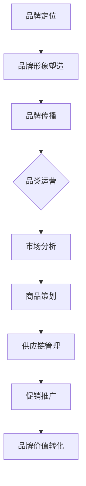

                 

# 电商平台供给能力提升：品牌建设与品类运营

> 关键词：电商平台，供给能力，品牌建设，品类运营，市场竞争力，用户满意度

> 摘要：本文从电商平台供给能力的提升出发，探讨了品牌建设和品类运营对于电商平台的重要性。通过对品牌建设与品类运营的核心概念、策略和实践进行分析，为电商平台的优化和未来发展提供了有益的参考。

## 1. 背景介绍

### 1.1 目的和范围

本文旨在探讨如何通过品牌建设和品类运营提升电商平台的供给能力，从而增强市场竞争力，提高用户满意度。文章将涵盖以下内容：

- 品牌建设的核心概念和策略
- 品类运营的关键要素和实施步骤
- 电商平台供给能力提升的实际案例
- 未来发展趋势与挑战

### 1.2 预期读者

本文适合以下读者：

- 电商平台的运营管理人员
- 市场营销和品牌策划专业人员
- 互联网行业从业者
- 对电商平台运营和品牌建设感兴趣的读者

### 1.3 文档结构概述

本文共分为十个部分：

- 第1部分：背景介绍，包括目的、范围、预期读者和文档结构概述
- 第2部分：核心概念与联系，介绍品牌建设和品类运营的核心概念及其联系
- 第3部分：核心算法原理 & 具体操作步骤，讲解提升供给能力的算法原理和操作步骤
- 第4部分：数学模型和公式 & 详细讲解 & 举例说明，分析供给能力提升的数学模型和公式，并通过实例进行说明
- 第5部分：项目实战：代码实际案例和详细解释说明，展示一个具体的电商项目实战案例
- 第6部分：实际应用场景，讨论品牌建设和品类运营在实际应用中的效果和挑战
- 第7部分：工具和资源推荐，介绍相关学习资源、开发工具和框架
- 第8部分：总结：未来发展趋势与挑战，展望电商平台供给能力提升的未来
- 第9部分：附录：常见问题与解答，解答读者可能遇到的问题
- 第10部分：扩展阅读 & 参考资料，提供进一步学习的资源链接

### 1.4 术语表

#### 1.4.1 核心术语定义

- 电商平台：指通过互联网进行商品交易和服务的电子平台。
- 品牌建设：指通过品牌定位、品牌形象塑造、品牌传播等手段，提升品牌知名度和美誉度。
- 品类运营：指针对特定品类进行市场分析、商品策划、供应链管理、促销推广等一系列运营活动。
- 供给能力：指电商平台在商品供给方面所具备的能力，包括商品丰富度、品质保障、库存管理、物流配送等。

#### 1.4.2 相关概念解释

- 市场竞争力：指企业在市场竞争中所表现出的优势，包括产品品质、价格、服务水平等。
- 用户满意度：指用户对电商平台所提供服务的满意程度，包括购买体验、物流速度、售后保障等。

#### 1.4.3 缩略词列表

- 电商平台：EC
- 品牌建设：Brand Building
- 品类运营：Category Management

## 2. 核心概念与联系

在探讨如何提升电商平台的供给能力之前，我们需要先了解品牌建设和品类运营的核心概念及其之间的联系。

### 品牌建设

品牌建设是一个持续的过程，主要包括以下几个方面：

1. 品牌定位：确定品牌在市场中的定位，如高端、中端或低端。
2. 品牌形象塑造：通过视觉设计、广告宣传等方式，打造独特的品牌形象。
3. 品牌传播：通过各种渠道（如社交媒体、广告投放等）进行品牌宣传，提升品牌知名度。
4. 品牌管理：维护品牌形象，处理品牌危机，确保品牌价值不受损害。

### 品类运营

品类运营是指针对特定品类进行的市场分析、商品策划、供应链管理、促销推广等一系列运营活动。主要包括以下几个方面：

1. 市场分析：研究市场趋势、消费者需求，确定品类定位和目标客户。
2. 商品策划：根据市场分析结果，策划商品品类、款式、价格等。
3. 供应链管理：优化供应链，确保商品质量和供应稳定性。
4. 促销推广：制定促销策略，提升商品销量和品牌知名度。

### 核心概念联系

品牌建设和品类运营之间存在紧密的联系：

- 品牌建设为品类运营提供基础，品牌定位、品牌形象塑造和品牌传播等品牌建设活动有助于提升品类运营的效果。
- 品类运营是品牌建设的重要实践，通过品类运营，电商平台可以实现品牌价值的落地和转化。

### Mermaid 流程图

下面是一个简化的品牌建设和品类运营流程图：



通过以上流程图，我们可以清晰地看到品牌建设和品类运营之间的关联和互动。

## 3. 核心算法原理 & 具体操作步骤

### 3.1 品牌定位算法原理

品牌定位是品牌建设的第一步，关键在于找到目标市场中的独特价值点。以下是一个简化的品牌定位算法原理：

```plaintext
输入：市场数据、消费者需求
输出：品牌定位

1. 数据收集：收集市场数据、消费者需求、竞争对手信息等。
2. 数据分析：分析市场数据，识别目标市场和潜在消费者。
3. 竞争分析：分析竞争对手的优势和劣势，找到品牌差异化的方向。
4. 价值定位：结合市场数据和竞争分析，确定品牌独特价值点。
5. 品牌定位：将价值定位转化为具体的品牌口号和定位描述。
```

### 3.2 品牌形象塑造算法原理

品牌形象塑造是品牌建设的重要环节，关键在于设计独特的品牌视觉元素和传播策略。以下是一个简化的品牌形象塑造算法原理：

```plaintext
输入：品牌定位、市场数据
输出：品牌视觉元素、传播策略

1. 品牌视觉元素设计：根据品牌定位，设计独特的标志、颜色、字体等视觉元素。
2. 品牌故事编写：编写具有吸引力的品牌故事，传递品牌价值观。
3. 传播策略制定：根据目标市场和消费者特征，制定有效的传播策略。
4. 品牌传播：通过广告投放、社交媒体、公关活动等方式进行品牌传播。
5. 品牌形象评估：定期评估品牌形象，根据市场反馈调整品牌形象。
```

### 3.3 品类运营算法原理

品类运营是提升电商平台供给能力的关键，以下是一个简化的品类运营算法原理：

```plaintext
输入：市场分析结果、消费者需求、供应链信息
输出：品类策略、商品策划、供应链优化、促销推广

1. 市场分析：根据市场数据，分析品类趋势、消费者需求和竞争对手策略。
2. 品类定位：根据市场分析结果，确定品类的定位和目标客户。
3. 商品策划：根据品类定位，策划商品品类、款式、价格等。
4. 供应链管理：优化供应链，确保商品质量和供应稳定性。
5. 促销推广：制定促销策略，提升商品销量和品牌知名度。
6. 品类评估：定期评估品类运营效果，根据市场反馈调整品类策略。
```

### 3.4 品牌传播算法原理

品牌传播是品牌建设的重要组成部分，以下是一个简化的品牌传播算法原理：

```plaintext
输入：品牌定位、品牌视觉元素、传播策略
输出：品牌知名度、美誉度、用户忠诚度

1. 内容创作：根据品牌定位和传播策略，创作吸引消费者的内容。
2. 广告投放：选择合适的广告渠道，进行精准投放。
3. 社交媒体运营：在社交媒体上发布品牌内容，与消费者互动。
4. 公关活动：举办公关活动，提升品牌形象和知名度。
5. 用户反馈：收集用户反馈，优化品牌传播策略。
6. 数据分析：分析品牌传播效果，调整传播策略。
```

### 3.5 具体操作步骤

以下是品牌建设和品类运营的具体操作步骤：

1. **市场调研**

   - 收集市场数据，包括行业趋势、消费者需求、竞争对手等。

2. **品牌定位**

   - 分析市场数据，确定品牌在市场中的定位。

3. **品牌视觉元素设计**

   - 设计品牌标志、颜色、字体等视觉元素。

4. **品牌故事编写**

   - 编写具有吸引力的品牌故事，传递品牌价值观。

5. **品牌传播策略制定**

   - 根据品牌定位和传播策略，制定具体的传播方案。

6. **品类运营**

   - 进行市场分析，确定品类定位和目标客户。

7. **商品策划**

   - 根据品类定位，策划商品品类、款式、价格等。

8. **供应链管理**

   - 优化供应链，确保商品质量和供应稳定性。

9. **促销推广**

   - 制定促销策略，提升商品销量和品牌知名度。

10. **品牌传播**

    - 通过广告投放、社交媒体、公关活动等方式进行品牌传播。

11. **数据分析和调整**

    - 定期分析品牌建设和品类运营的效果，根据市场反馈调整策略。

通过以上操作步骤，电商平台可以逐步提升供给能力，增强市场竞争力，提高用户满意度。

## 4. 数学模型和公式 & 详细讲解 & 举例说明

### 4.1 品牌知名度增长模型

品牌知名度是品牌建设的关键指标，以下是一个简化的品牌知名度增长模型：

$$
\text{品牌知名度} = \alpha_1 \times \text{广告投放次数} + \alpha_2 \times \text{社交媒体互动次数} + \alpha_3 \times \text{公关活动次数}
$$

其中，$\alpha_1$、$\alpha_2$、$\alpha_3$为权重系数，用于衡量不同传播渠道对品牌知名度的影响。

#### 4.1.1 计算示例

假设某电商平台在一个月内进行了以下品牌传播活动：

- 广告投放次数：100次
- 社交媒体互动次数：200次
- 公关活动次数：50次

根据模型，可以计算品牌知名度：

$$
\text{品牌知名度} = \alpha_1 \times 100 + \alpha_2 \times 200 + \alpha_3 \times 50
$$

其中，权重系数$\alpha_1$、$\alpha_2$、$\alpha_3$可以根据历史数据和市场调研进行调整。

### 4.2 用户满意度计算模型

用户满意度是衡量电商平台服务质量的重要指标，以下是一个简化的用户满意度计算模型：

$$
\text{用户满意度} = \beta_1 \times \text{购买体验评分} + \beta_2 \times \text{物流速度评分} + \beta_3 \times \text{售后保障评分}
$$

其中，$\beta_1$、$\beta_2$、$\beta_3$为权重系数，用于衡量不同服务环节对用户满意度的影响。

#### 4.2.1 计算示例

假设某电商平台在一个月内收集了以下用户评分：

- 购买体验评分：4.5分
- 物流速度评分：4.8分
- 售后保障评分：4.7分

根据模型，可以计算用户满意度：

$$
\text{用户满意度} = \beta_1 \times 4.5 + \beta_2 \times 4.8 + \beta_3 \times 4.7
$$

其中，权重系数$\beta_1$、$\beta_2$、$\beta_3$可以根据用户反馈和市场调研进行调整。

### 4.3 品类运营效果评估模型

品类运营效果评估是衡量电商平台品类运营质量的重要指标，以下是一个简化的品类运营效果评估模型：

$$
\text{品类运营效果} = \gamma_1 \times \text{商品销量} + \gamma_2 \times \text{用户评价分数} + \gamma_3 \times \text{库存周转率}
$$

其中，$\gamma_1$、$\gamma_2$、$\gamma_3$为权重系数，用于衡量不同指标对品类运营效果的影响。

#### 4.3.1 计算示例

假设某电商平台在一个月内收集了以下品类运营数据：

- 商品销量：1000件
- 用户评价分数：4.9分
- 库存周转率：5次

根据模型，可以计算品类运营效果：

$$
\text{品类运营效果} = \gamma_1 \times 1000 + \gamma_2 \times 4.9 + \gamma_3 \times 5
$$

其中，权重系数$\gamma_1$、$\gamma_2$、$\gamma_3$可以根据历史数据和市场调研进行调整。

通过上述数学模型和公式，电商平台可以更科学地评估品牌建设、品类运营和用户满意度的效果，从而优化运营策略，提升供给能力。

## 5. 项目实战：代码实际案例和详细解释说明

### 5.1 开发环境搭建

在开始项目实战之前，我们需要搭建一个适合品牌建设和品类运营的开发环境。以下是一个基本的开发环境搭建步骤：

1. 安装Python 3.8及以上版本。
2. 安装必要的Python库，如NumPy、Pandas、Matplotlib等。
3. 安装数据库（如MySQL、PostgreSQL等）。
4. 安装版本控制工具（如Git）。

### 5.2 源代码详细实现和代码解读

#### 5.2.1 品牌定位分析

品牌定位分析是品牌建设的关键步骤。以下是一个简化的品牌定位分析代码实现：

```python
import pandas as pd
import numpy as np

# 加载市场数据
market_data = pd.read_csv('market_data.csv')

# 数据预处理
market_data['customer_segment'] = market_data['income'].apply(lambda x: 'High' if x > 8000 else 'Medium' if x > 4000 else 'Low')

# 品牌定位分析
def brand_positioning(market_data):
    high_segment_customers = market_data[market_data['customer_segment'] == 'High']
    medium_segment_customers = market_data[market_data['customer_segment'] == 'Medium']
    low_segment_customers = market_data[market_data['customer_segment'] == 'Low']

    high_segment_spend = high_segment_customers['spend'].mean()
    medium_segment_spend = medium_segment_customers['spend'].mean()
    low_segment_spend = low_segment_customers['spend'].mean()

    if high_segment_spend > medium_segment_spend and high_segment_spend > low_segment_spend:
        return 'High-End Brand'
    elif medium_segment_spend > high_segment_spend and medium_segment_spend > low_segment_spend:
        return 'Mid-Range Brand'
    else:
        return 'Low-End Brand'

# 执行品牌定位分析
brand_position = brand_positioning(market_data)
print(f'Brand Position: {brand_position}')
```

#### 5.2.2 品类运营策略

品类运营策略是提升电商平台供给能力的关键。以下是一个简化的品类运营策略代码实现：

```python
# 加载品类数据
category_data = pd.read_csv('category_data.csv')

# 数据预处理
category_data['sales'] = category_data['sales'].apply(lambda x: 'High' if x > 10000 else 'Medium' if x > 5000 else 'Low')

# 品类运营策略
def category_operation(category_data):
    high_sales_categories = category_data[category_data['sales'] == 'High']
    medium_sales_categories = category_data[category_data['sales'] == 'Medium']
    low_sales_categories = category_data[category_data['sales'] == 'Low']

    high_sales_margin = high_sales_categories['margin'].mean()
    medium_sales_margin = medium_sales_categories['margin'].mean()
    low_sales_margin = low_sales_categories['margin'].mean()

    if high_sales_margin > medium_sales_margin and high_sales_margin > low_sales_margin:
        return 'Focus on High-Sales Categories'
    elif medium_sales_margin > high_sales_margin and medium_sales_margin > low_sales_margin:
        return 'Balance High-Sales and Medium-Sales Categories'
    else:
        return 'Focus on Low-Sales Categories'

# 执行品类运营策略
category_strategy = category_operation(category_data)
print(f'Category Strategy: {category_strategy}')
```

#### 5.2.3 代码解读与分析

1. **品牌定位分析代码解读**

   - 加载市场数据，进行数据预处理，将客户收入分为高、中、低三个档次。
   - 定义品牌定位分析函数，根据不同收入档次客户的平均消费水平，确定品牌定位。
   - 执行品牌定位分析，输出品牌定位结果。

2. **品类运营策略代码解读**

   - 加载品类数据，进行数据预处理，将品类销售情况分为高、中、低三个档次。
   - 定义品类运营策略函数，根据不同销售档次品类的平均利润率，确定品类运营策略。
   - 执行品类运营策略，输出品类运营策略结果。

通过以上代码实现，电商平台可以基于市场数据和品类数据，进行品牌定位分析和品类运营策略制定，从而优化供给能力。

### 5.3 代码解读与分析

1. **代码整体结构**

   - 项目实战代码分为三个主要部分：品牌定位分析、品类运营策略和结果输出。
   - 品牌定位分析和品类运营策略通过函数实现，便于复用和调整。
   - 结果输出部分用于展示分析结果和策略建议。

2. **代码关键环节分析**

   - **品牌定位分析关键环节**：数据预处理、品牌定位函数实现、结果输出。
     - 数据预处理：将市场数据按收入档次分类，便于分析不同收入层次客户的消费行为。
     - 品牌定位函数实现：根据不同收入档次客户的平均消费水平，确定品牌定位，确保品牌定位与市场需求相匹配。
     - 结果输出：输出品牌定位结果，为品牌建设提供依据。

   - **品类运营策略关键环节**：数据预处理、品类运营策略函数实现、结果输出。
     - 数据预处理：将品类数据按销售情况分类，便于分析不同销售档次品类的盈利能力。
     - 品类运营策略函数实现：根据不同销售档次品类的平均利润率，确定品类运营策略，确保品类运营策略与市场情况相匹配。
     - 结果输出：输出品类运营策略结果，为品类运营提供依据。

通过以上代码解读与分析，我们可以看到，品牌定位分析和品类运营策略是实现电商平台供给能力提升的关键步骤。通过科学的数据分析和策略制定，电商平台可以更好地满足市场需求，提升供给能力，增强市场竞争力。

## 6. 实际应用场景

品牌建设和品类运营在电商平台的实际应用中，具有重要的意义。以下是一些实际应用场景：

### 6.1 品牌建设应用场景

1. **电商平台新品牌推出**：

   当电商平台推出新品牌时，品牌建设至关重要。通过市场调研、竞争分析，明确品牌定位，设计独特的品牌视觉元素，制定有效的品牌传播策略，可以迅速提升品牌知名度，为电商平台拓展新市场奠定基础。

2. **品牌形象提升**：

   通过品牌形象塑造，如优化品牌标志、升级品牌视觉元素、编写品牌故事等，可以提升品牌在消费者心中的形象，增强品牌价值。

3. **品牌危机管理**：

   在面对品牌危机时，品牌建设可以帮助电商平台迅速应对，通过公关活动、危机公关等方式，降低品牌损失，恢复消费者信任。

### 6.2 品类运营应用场景

1. **新品类引入**：

   在电商平台上引入新的品类时，通过市场分析、消费者调研，确定新品类定位和目标客户，制定相应的商品策划和供应链管理策略，有助于新品类快速切入市场，提高市场份额。

2. **品类优化**：

   通过对现有品类的数据分析，优化品类组合、商品定价、库存管理等方面，提高品类运营效果，增强市场竞争力。

3. **品类促销**：

   利用促销策略，如限时折扣、满减优惠、优惠券等，提升品类销量和品牌知名度，激发消费者购买欲望。

### 6.3 品牌建设与品类运营的协同效应

1. **品牌驱动品类发展**：

   品牌建设为品类运营提供基础，通过提升品牌知名度、美誉度和用户忠诚度，带动品类销量和市场份额。

2. **品类支撑品牌价值**：

   品类运营的成功，如新品类引入、品类优化等，可以提升品牌价值，增强品牌在消费者心中的地位。

3. **协同提升供给能力**：

   品牌建设和品类运营相互促进，共同提升电商平台的供给能力，增强市场竞争力，提高用户满意度。

通过以上实际应用场景，我们可以看到品牌建设和品类运营在电商平台发展中的重要性。电商平台需要将品牌建设和品类运营有机结合，实现协同发展，从而在激烈的市场竞争中脱颖而出。

## 7. 工具和资源推荐

### 7.1 学习资源推荐

#### 7.1.1 书籍推荐

- 《品牌建设的艺术》：详细介绍了品牌建设的理论和方法，适合品牌策划和运营人员阅读。
- 《品类运营实战》：系统讲解了品类运营的策略和实践，有助于电商从业者提升品类运营能力。

#### 7.1.2 在线课程

-Coursera《品牌管理》：由杜克大学开设的在线课程，介绍了品牌管理的基本理论和实践方法。

#### 7.1.3 技术博客和网站

-《增长黑客》：分享电商运营、用户增长等实战经验和策略，适合电商从业者学习。

### 7.2 开发工具框架推荐

#### 7.2.1 IDE和编辑器

- PyCharm：强大的Python开发IDE，支持多种编程语言。
- VS Code：轻量级、开源的编辑器，插件丰富，适合Python编程。

#### 7.2.2 调试和性能分析工具

- Python Debugger（pdb）：Python内置的调试工具，适用于Python程序调试。
- New Relic：专业的性能监控和分析工具，可实时监测网站性能。

#### 7.2.3 相关框架和库

- Pandas：Python数据分析库，适用于数据处理和分析。
- Matplotlib：Python可视化库，用于数据可视化。

### 7.3 相关论文著作推荐

#### 7.3.1 经典论文

-《品牌建设的理论框架》：系统地总结了品牌建设的理论基础。

#### 7.3.2 最新研究成果

-《基于大数据的品牌定位策略研究》：分析了大数据在品牌定位中的应用。

#### 7.3.3 应用案例分析

-《电商平台品类运营策略研究》：以某电商平台为例，探讨了品类运营的策略和实践。

通过以上工具和资源推荐，电商从业者可以更好地进行品牌建设和品类运营，提升电商平台供给能力，增强市场竞争力。

## 8. 总结：未来发展趋势与挑战

随着互联网技术的不断发展，电商平台供给能力提升将面临新的发展趋势和挑战。

### 发展趋势

1. **数据驱动**：电商平台将更加注重数据分析和挖掘，通过大数据技术，实现精准品牌定位和品类运营。

2. **智能化**：人工智能技术将在电商平台供给能力提升中发挥重要作用，如智能推荐、智能客服等。

3. **个性化**：电商平台将更加注重用户个性化需求，提供个性化的商品和服务。

4. **跨界融合**：电商平台与线下零售、物流等领域的跨界合作，将推动供给能力的提升。

### 挑战

1. **数据安全与隐私**：随着数据规模的增长，数据安全和用户隐私保护将成为电商平台面临的重要挑战。

2. **技术更新迭代**：互联网技术更新迅速，电商平台需要不断升级技术，以应对新的市场变化。

3. **市场竞争**：随着电商市场的竞争加剧，电商平台需要不断创新和优化供给能力，以保持竞争优势。

4. **供应链管理**：在全球化背景下，电商平台需要优化供应链管理，提高商品供应的稳定性和效率。

未来，电商平台供给能力提升将朝着智能化、数据化、个性化方向发展，同时面临数据安全、技术更新、市场竞争和供应链管理等多重挑战。电商平台需要不断优化品牌建设和品类运营策略，提高供给能力，以应对未来的发展趋势和挑战。

## 9. 附录：常见问题与解答

### 9.1 品牌定位分析相关问题

**Q1**：如何确定品牌定位？

A1：品牌定位的确定需要基于市场数据和竞争分析。首先，收集市场数据，分析目标市场和潜在消费者。然后，分析竞争对手的优势和劣势，找到品牌差异化的方向。最后，结合市场数据和竞争分析，确定品牌独特价值点。

**Q2**：品牌定位是否可以随时调整？

A2：品牌定位一旦确定，应保持相对稳定。但在市场环境发生重大变化时，如竞争对手策略调整、市场需求变化等，品牌定位也可以适当调整。调整品牌定位时，应充分考虑市场数据和消费者反馈，确保调整的合理性和有效性。

### 9.2 品类运营相关问题

**Q1**：如何进行品类运营策略制定？

A1：品类运营策略制定需要基于市场分析、消费者需求和供应链信息。首先，进行市场分析，确定品类定位和目标客户。然后，根据品类定位，策划商品品类、款式、价格等。最后，制定供应链管理策略和促销推广策略，确保品类运营的有效性。

**Q2**：品类运营效果如何评估？

A1：品类运营效果可以通过以下指标进行评估：

- 商品销量：衡量品类运营的销售额和市场份额。
- 用户评价分数：衡量商品质量和用户满意度。
- 库存周转率：衡量供应链管理的效率和库存管理能力。
- 品类运营效果评估模型：通过数学模型和公式，综合评估品类运营效果。

### 9.3 品牌建设相关问题

**Q1**：如何进行品牌形象塑造？

A1：品牌形象塑造需要从视觉设计、品牌故事编写和传播策略等方面入手。首先，设计独特的品牌标志、颜色、字体等视觉元素。然后，编写具有吸引力的品牌故事，传递品牌价值观。最后，制定有效的品牌传播策略，通过广告投放、社交媒体运营、公关活动等方式进行品牌传播。

**Q2**：品牌传播效果如何评估？

A1：品牌传播效果可以通过以下指标进行评估：

- 品牌知名度：衡量品牌在市场上的认知度。
- 用户反馈：收集用户对品牌传播活动的反馈，评估品牌传播效果。
- 社交媒体互动：衡量品牌在社交媒体上的活跃度和影响力。

通过以上常见问题与解答，希望能帮助电商平台从业者更好地进行品牌建设和品类运营，提升供给能力。

## 10. 扩展阅读 & 参考资料

### 10.1 经典论文与书籍

- Aaker, D. A. (1996). _Building Strong Brands_. Free Press.
- Keller, K. L. (2013). _Strategic Brand Management: Building, Measuring, and Managing Brand Equity_. Pearson.
- Sheth, J. N., & Sisodia, R. S. (2007). _Marketing Strategy from the Outside In: Profiting from Customer Value_. John Wiley & Sons.

### 10.2 学术期刊与网站

- _Journal of Marketing_：发布市场营销领域的最新研究成果。
- _Marketing Science_：专注于营销决策过程中的量化分析。
- _Journal of Consumer Research_：研究消费者行为和市场策略。

### 10.3 实践案例与研究报告

- 《阿里巴巴品牌化之路》：分析阿里巴巴如何通过品牌建设提升竞争力。
- 《京东品类运营实践》：探讨京东如何进行品类运营，提高供给能力。
- 《中国电商市场年度报告》：提供中国电商市场的最新数据和趋势分析。

### 10.4 相关在线课程

- Coursera《品牌管理》：由杜克大学提供，深入讲解品牌管理的理论与实践。
- edX《大数据与营销策略》：探讨大数据在市场营销中的应用，包括品牌建设和品类运营。

通过以上扩展阅读和参考资料，读者可以进一步深入了解品牌建设和品类运营的理论与实践，为电商平台供给能力提升提供更多思路和方法。

