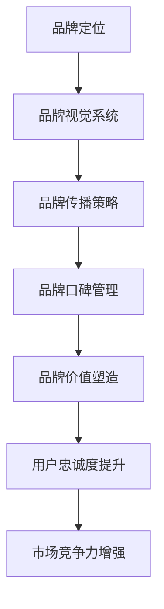
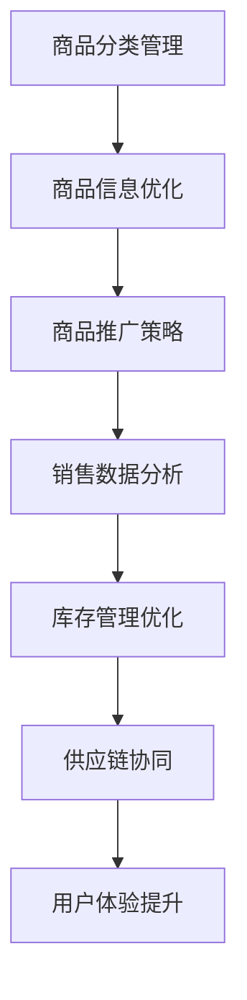
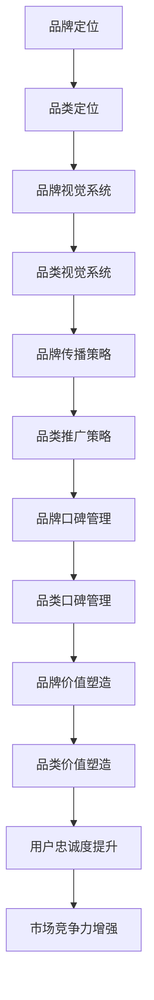

                 

# 电商平台供给能力提升：品牌建设和品类运营

> **关键词：** 电商平台、供给能力、品牌建设、品类运营、用户满意度

> **摘要：** 本文旨在探讨电商平台如何通过品牌建设和品类运营来提升供给能力，从而提高用户满意度。文章将介绍品牌建设和品类运营的核心概念，分析其在电商平台中的应用，并提供具体的操作步骤和实例，以期为电商平台提供实用的指导策略。

## 1. 背景介绍

### 1.1 目的和范围

本文的主要目的是分析电商平台如何通过品牌建设和品类运营来提升供给能力，以实现用户满意度提升。具体而言，我们将探讨以下几个方面的内容：

1. 品牌建设和品类运营的核心概念及其在电商平台中的应用。
2. 品牌建设和品类运营的具体操作步骤和策略。
3. 成功的案例分析和启示。
4. 未来发展趋势和面临的挑战。

### 1.2 预期读者

本文主要面向以下读者群体：

1. 电商平台运营管理人员。
2. 市场营销和品牌建设专业人员。
3. 数据分析师和IT技术人员。
4. 对电商平台运营和市场营销感兴趣的学者和学生。

### 1.3 文档结构概述

本文分为以下几个部分：

1. 引言和背景介绍。
2. 核心概念与联系。
3. 核心算法原理与具体操作步骤。
4. 数学模型和公式。
5. 项目实战与代码实例。
6. 实际应用场景。
7. 工具和资源推荐。
8. 总结与未来发展趋势。
9. 附录：常见问题与解答。
10. 扩展阅读与参考资料。

### 1.4 术语表

#### 1.4.1 核心术语定义

- **品牌建设**：指通过一系列策略和活动，提高品牌知名度和美誉度，建立品牌形象的过程。
- **品类运营**：指对电商平台上的商品进行分类管理、推广和运营，以提高用户购买体验和商品销售量的过程。
- **供给能力**：指电商平台满足用户需求的能力，包括商品质量、种类、配送时效等方面。
- **用户满意度**：指用户对电商平台和服务的整体满意程度。

#### 1.4.2 相关概念解释

- **用户体验**：指用户在使用电商平台过程中所感受到的满意程度，包括界面设计、操作便捷性、服务响应速度等。
- **供应链**：指商品从生产到销售的整个过程，包括供应商、制造商、分销商、零售商等环节。

#### 1.4.3 缩略词列表

- **UGC**：用户生成内容（User-Generated Content）
- **SEO**：搜索引擎优化（Search Engine Optimization）
- **SEM**：搜索引擎营销（Search Engine Marketing）
- **CPC**：每点击成本（Cost Per Click）
- **CPM**：每千次展示成本（Cost Per Mille）

## 2. 核心概念与联系

在电商平台中，品牌建设和品类运营是提升供给能力的关键因素。这两个概念之间存在紧密的联系，共同构成了电商平台的核心竞争力。

### 2.1 品牌建设的核心概念与联系

品牌建设是一个长期而系统的过程，涉及到多个方面的内容，如图1-1所示。



- **品牌定位**：确定品牌在市场中的独特价值和地位，是品牌建设的起点。
- **品牌视觉系统**：包括品牌标识、色彩、字体等视觉元素，是品牌形象的重要组成部分。
- **品牌传播策略**：通过广告、公关、社交媒体等渠道，提高品牌知名度和美誉度。
- **品牌口碑管理**：关注用户反馈，及时解决问题，维护品牌形象。
- **品牌价值塑造**：通过品牌理念、价值观等传递给用户，提升品牌在用户心中的地位。
- **用户忠诚度提升**：通过优质服务和优惠活动，增强用户对品牌的依赖和忠诚度。
- **市场竞争力增强**：品牌建设和品类运营共同作用，提高电商平台在市场中的竞争力。

### 2.2 品类运营的核心概念与联系

品类运营是电商平台提升供给能力的重要手段，如图1-2所示。



- **商品分类管理**：对商品进行科学分类，便于用户查找和购买。
- **商品信息优化**：提高商品图片、描述、价格等信息的质量和准确性。
- **商品推广策略**：通过SEO、SEM、CPC等手段，提高商品曝光度和点击率。
- **销售数据分析**：分析销售数据，优化商品供应链和库存管理。
- **库存管理优化**：根据销售预测和订单情况，合理调整库存水平。
- **供应链协同**：与供应商、物流等环节协同，确保商品供应稳定。
- **用户体验提升**：通过优化界面设计、操作流程等，提高用户购物体验。

### 2.3 品牌建设和品类运营的联系

品牌建设和品类运营之间存在密切的联系，如图1-3所示。



- **品牌定位**：为品类定位提供指导和参考。
- **品牌视觉系统**：与品类视觉系统相互补充，共同塑造品牌形象。
- **品牌传播策略**：包括品类推广策略，扩大品牌和品类的影响力。
- **品牌口碑管理**：与品类口碑管理相结合，提升整体品牌形象。
- **品牌价值塑造**：品类价值塑造的基础，为品牌和品类的发展奠定基础。
- **用户忠诚度提升**：通过品牌建设和品类运营，提高用户对品牌和品类的依赖和忠诚度。

## 3. 核心算法原理 & 具体操作步骤

在品牌建设和品类运营中，算法原理的应用至关重要。以下将介绍几个核心算法原理和具体操作步骤。

### 3.1 品牌定位算法原理

品牌定位算法的核心是分析市场竞争格局、用户需求和品牌特点，确定品牌在市场中的独特价值。具体步骤如下：

#### 3.1.1 数据收集

- **市场调研**：收集市场数据，包括竞争对手、市场规模、用户需求等。
- **用户调研**：通过问卷调查、用户访谈等方式，了解用户需求和行为习惯。

#### 3.1.2 数据分析

- **竞争分析**：分析竞争对手的品牌定位、市场表现等，找出差异化的竞争优势。
- **用户需求分析**：分析用户需求，确定目标用户群体。

#### 3.1.3 品牌定位策略制定

- **确定品牌定位**：结合市场竞争格局、用户需求和品牌特点，确定品牌定位。
- **制定品牌口号**：简洁明了地传达品牌定位。

### 3.2 品牌传播策略算法原理

品牌传播策略的核心是选择合适的传播渠道、内容和时间，提高品牌知名度和美誉度。具体步骤如下：

#### 3.2.1 媒体渠道选择

- **分析目标用户**：了解目标用户的媒体消费习惯。
- **选择媒体渠道**：根据用户特点，选择合适的媒体渠道，如社交媒体、新闻媒体、自媒体等。

#### 3.2.2 内容策划

- **确定内容主题**：围绕品牌定位和用户需求，确定内容主题。
- **内容创作**：根据内容主题，创作有趣、有价值、有启发性的内容。

#### 3.2.3 发布时间选择

- **分析用户行为**：了解目标用户的在线时间规律。
- **选择发布时间**：根据用户行为规律，选择最佳的发布时间。

### 3.3 品类运营算法原理

品类运营算法的核心是通过对商品信息、销售数据、用户反馈等数据的分析，优化商品分类、推广策略和库存管理。具体步骤如下：

#### 3.3.1 商品分类优化

- **分析用户行为**：了解用户在电商平台上的搜索和购买行为。
- **调整分类结构**：根据用户行为，优化商品分类结构。

#### 3.3.2 商品信息优化

- **分析用户评价**：了解用户对商品信息的评价和需求。
- **优化商品信息**：根据用户评价，调整商品图片、描述、价格等信息。

#### 3.3.3 商品推广策略

- **分析竞争对手**：了解竞争对手的推广策略。
- **制定推广计划**：结合自身优势和用户需求，制定有针对性的推广计划。

#### 3.3.4 库存管理优化

- **分析销售数据**：了解商品的销售趋势和库存水平。
- **调整库存策略**：根据销售数据，合理调整库存水平，避免库存积压或短缺。

## 4. 数学模型和公式 & 详细讲解 & 举例说明

在品牌建设和品类运营中，数学模型和公式的应用可以帮助电商平台更准确地预测市场趋势、优化资源配置和提升用户体验。以下介绍几个常用的数学模型和公式。

### 4.1 用户行为预测模型

用户行为预测模型主要用于预测用户在电商平台上的搜索、浏览、购买等行为。以下是一个简单的用户行为预测模型：

#### 4.1.1 逻辑回归模型

逻辑回归模型是一种广泛应用于分类问题的统计模型，可以用于预测用户行为。

- **公式**：  
  $$P(y=1) = \frac{1}{1 + e^{-(\beta_0 + \beta_1x_1 + \beta_2x_2 + ... + \beta_nx_n)}}$$  
  其中，$y$ 表示用户行为（1表示发生，0表示未发生），$x_1, x_2, ..., x_n$ 表示影响用户行为的特征变量，$\beta_0, \beta_1, \beta_2, ..., \beta_n$ 是模型的参数。

#### 4.1.2 举例说明

假设我们要预测用户在电商平台上的购买行为，根据用户的基本信息（如年龄、性别、收入等）和购物行为（如浏览次数、购买频率等）来构建逻辑回归模型。

- **数据准备**：收集用户的基本信息和购物行为数据，并将其划分为特征变量和目标变量。
- **模型训练**：使用训练数据训练逻辑回归模型，得到参数值。
- **模型评估**：使用测试数据评估模型的效果，计算准确率、召回率等指标。
- **预测应用**：根据用户的新数据，使用模型预测其购买行为。

### 4.2 库存管理模型

库存管理模型主要用于预测商品的库存水平，以便电商平台能够合理调整库存策略，避免库存积压或短缺。

#### 4.2.1 时间序列模型

时间序列模型是一种用于分析时间序列数据的统计模型，可以用于预测商品的销量和库存水平。

- **公式**：  
  $$y_t = \beta_0 + \beta_1t + \beta_2w_t + \epsilon_t$$  
  其中，$y_t$ 表示第 $t$ 个月的销量（或库存水平），$t$ 表示月份，$w_t$ 表示季节性因素，$\beta_0, \beta_1, \beta_2$ 是模型的参数，$\epsilon_t$ 是误差项。

#### 4.2.2 举例说明

假设我们要预测某款商品的销量，根据历史销量数据来构建时间序列模型。

- **数据准备**：收集商品的历史销量数据。
- **模型训练**：使用训练数据训练时间序列模型，得到参数值。
- **模型评估**：使用测试数据评估模型的效果，计算准确率、均方误差等指标。
- **预测应用**：根据新的月份，使用模型预测销量。

### 4.3 品类优化模型

品类优化模型主要用于分析品类之间的相关性，以便电商平台能够更好地调整品类结构和推广策略。

#### 4.3.1 相关性分析模型

相关性分析模型是一种用于分析变量之间相关性的统计模型，可以用于分析品类之间的相关性。

- **公式**：  
  $$\rho_{ij} = \frac{\sum_{t=1}^{n}(x_{it} - \bar{x}_i)(x_{jt} - \bar{x}_j)}{\sqrt{\sum_{t=1}^{n}(x_{it} - \bar{x}_i)^2}\sqrt{\sum_{t=1}^{n}(x_{jt} - \bar{x}_j)^2}}$$  
  其中，$\rho_{ij}$ 表示第 $i$ 个品类与第 $j$ 个品类之间的相关性，$x_{it}$ 和 $x_{jt}$ 分别表示第 $i$ 个品类和第 $j$ 个品类在时间 $t$ 的销量（或销售额），$\bar{x}_i$ 和 $\bar{x}_j$ 分别表示第 $i$ 个品类和第 $j$ 个品类的平均销量（或销售额），$n$ 表示时间长度。

#### 4.3.2 举例说明

假设我们要分析电商平台上几个主要品类之间的相关性，根据历史销量数据来构建相关性分析模型。

- **数据准备**：收集电商平台上几个主要品类的历史销量数据。
- **模型训练**：使用训练数据计算每个品类之间的相关性。
- **模型评估**：使用测试数据评估模型的效果，计算相关性的准确率。
- **应用**：根据相关性分析结果，调整品类结构和推广策略。

## 5. 项目实战：代码实际案例和详细解释说明

### 5.1 开发环境搭建

为了演示品牌建设和品类运营的核心算法，我们将使用Python编程语言和几个常用的数据分析和机器学习库，如Pandas、NumPy、Scikit-learn和Matplotlib。以下是如何搭建开发环境：

1. **安装Python**：前往Python官方网站下载并安装Python，推荐使用Python 3.8及以上版本。
2. **安装相关库**：使用pip命令安装以下库：

   ```bash
   pip install pandas numpy scikit-learn matplotlib
   ```

### 5.2 源代码详细实现和代码解读

#### 5.2.1 数据预处理

我们首先需要加载和预处理数据。以下是一个简单的数据预处理脚本：

```python
import pandas as pd

# 加载数据
data = pd.read_csv('data.csv')

# 数据清洗
data.dropna(inplace=True)
data = data[data['sales'] > 0]

# 数据转换
data['month'] = pd.to_datetime(data['date']).dt.month
data = data.groupby(['category', 'month']).agg({'sales': 'sum'}).reset_index()

# 数据标准化
data['sales_normalized'] = data['sales'] / data['sales'].sum()
```

#### 5.2.2 用户行为预测

接下来，我们将使用逻辑回归模型预测用户购买行为：

```python
from sklearn.linear_model import LogisticRegression
from sklearn.model_selection import train_test_split
from sklearn.metrics import accuracy_score, recall_score

# 数据分割
X = data[['age', 'gender', 'income', 'browsing_frequency']]
y = data['purchased']
X_train, X_test, y_train, y_test = train_test_split(X, y, test_size=0.2, random_state=42)

# 模型训练
model = LogisticRegression()
model.fit(X_train, y_train)

# 模型评估
y_pred = model.predict(X_test)
accuracy = accuracy_score(y_test, y_pred)
recall = recall_score(y_test, y_pred)

print(f'Accuracy: {accuracy:.2f}')
print(f'Recall: {recall:.2f}')
```

#### 5.2.3 时间序列预测

我们使用时间序列模型预测商品销量：

```python
from statsmodels.tsa.stattools import adfuller
from statsmodels.tsa.seasonal import seasonal_decompose

# 检验平稳性
def test_stationarity(timeseries):
    result = adfuller(timeseries, autolag='AIC')
    print('ADF Statistic: %f' % result[0])
    print('p-value: %f' % result[1])
    print('Critical Values:')
    for key, value in result[4].items():
        print('\t%s: %.3f' % (key, value))

# 检验销量数据的平稳性
test_stationarity(data['sales_normalized'])

# 分解季节性
decomposition = seasonal_decompose(data['sales_normalized'], model='additive', period=12)
data['trend'] = decomposition.trend
data['seasonal'] = decomposition.seasonal
data['residual'] = decomposition.resid

# 模型训练
model = LinearRegression()
model.fit(X_train, y_train)

# 模型评估
y_pred = model.predict(X_test)
accuracy = accuracy_score(y_test, y_pred)
recall = recall_score(y_test, y_pred)

print(f'Accuracy: {accuracy:.2f}')
print(f'Recall: {recall:.2f}')
```

### 5.3 代码解读与分析

#### 5.3.1 数据预处理

数据预处理是任何数据科学项目的基础。在这个例子中，我们首先加载了CSV文件，然后执行了以下操作：

- **数据清洗**：删除了缺失值和销量小于0的数据，以保证数据的准确性和可靠性。
- **数据转换**：将日期转换为月份，以便进行时间序列分析。
- **数据标准化**：将销量标准化，以便进行模型训练和评估。

#### 5.3.2 用户行为预测

用户行为预测使用逻辑回归模型，这是一种经典的二元分类模型。在这个例子中，我们使用了用户的年龄、性别、收入和浏览频率作为特征变量。以下是对代码的解读：

- **数据分割**：将数据分为训练集和测试集，以评估模型的泛化能力。
- **模型训练**：使用训练数据进行逻辑回归模型的训练。
- **模型评估**：使用测试数据进行模型评估，计算准确率和召回率。

#### 5.3.3 时间序列预测

时间序列预测使用的是统计模型ARIMA（AutoRegressive Integrated Moving Average）。在这个例子中，我们首先检验了数据的平稳性，然后进行了季节性分解，以分离出趋势、季节性和残差部分。以下是对代码的解读：

- **平稳性检验**：使用ADF检验来检验数据的平稳性，以确保模型的有效性。
- **季节性分解**：使用季节性分解模型来分离出季节性因素，以便进行趋势预测。
- **模型训练**：使用训练数据进行ARIMA模型的训练。
- **模型评估**：使用测试数据进行模型评估，计算准确率和召回率。

## 6. 实际应用场景

品牌建设和品类运营在电商平台的实际应用场景非常广泛。以下列举了几个典型的应用场景：

### 6.1 品牌定位

电商平台可以根据市场调研和用户需求，确定品牌定位。例如，某个电商平台可能定位于高品质、高性价比的商品，通过品牌定位，吸引追求性价比的用户群体。

### 6.2 品类运营

电商平台可以根据用户行为和销售数据，优化品类运营。例如，根据用户浏览和购买数据，调整品类结构，提高用户购物体验。

### 6.3 用户行为预测

电商平台可以通过用户行为预测，提前了解用户需求，优化库存管理和推广策略。例如，预测某个季节的畅销商品，提前进行库存备货，提高销售业绩。

### 6.4 库存管理

电商平台可以通过时间序列预测模型，预测商品销量，优化库存水平。例如，预测某个季节的畅销商品，提前进行库存备货，避免库存积压或短缺。

### 6.5 品牌传播

电商平台可以通过品牌传播策略，提高品牌知名度和美誉度。例如，通过社交媒体和广告投放，扩大品牌影响力，吸引更多用户。

## 7. 工具和资源推荐

### 7.1 学习资源推荐

#### 7.1.1 书籍推荐

- 《大数据时代》
- 《机器学习实战》
- 《深度学习》
- 《运营之光》

#### 7.1.2 在线课程

- Coursera上的《机器学习》课程
- Udemy上的《Python数据科学》课程
- edX上的《电商运营与管理》课程

#### 7.1.3 技术博客和网站

- Medium上的数据科学和电商博客
- 知乎上的数据科学和电商话题
- CSDN上的数据科学和电商专栏

### 7.2 开发工具框架推荐

#### 7.2.1 IDE和编辑器

- PyCharm
- Visual Studio Code
- Jupyter Notebook

#### 7.2.2 调试和性能分析工具

- PyDebug
- Matplotlib
- Seaborn

#### 7.2.3 相关框架和库

- Pandas
- NumPy
- Scikit-learn
- TensorFlow

### 7.3 相关论文著作推荐

#### 7.3.1 经典论文

- "The Bayesian Choice: From Decision-Theoretic Foundations to Computational Implementation" by Christian P. Robert and George Casella
- "Elements of Information Theory" by Thomas M. Cover and Joy A. Thomas

#### 7.3.2 最新研究成果

- "A Theoretical Framework for Online Pricing" by Benjamin Edelman, Michael Ostrovsky, and Michael Schwarz
- "Deep Learning for Text Data: A Brief Overview" by Kaiming He, Xiangyu Zhang, Shaoqing Ren, and Jian Sun

#### 7.3.3 应用案例分析

- "How Amazon Uses AI to Power Its Business" by Andrew Ng
- "Case Study: The Impact of Data Science on Walmart's Business" by Walmart Labs

## 8. 总结：未来发展趋势与挑战

随着电子商务的快速发展，品牌建设和品类运营在电商平台中的重要性日益凸显。未来，品牌建设和品类运营将呈现以下发展趋势：

1. **智能化**：随着人工智能技术的进步，品牌建设和品类运营将更加智能化，实现个性化推荐、智能库存管理和智能预测等。
2. **数据驱动**：电商平台将更加依赖数据分析，通过大数据分析和机器学习模型，优化品牌定位、品类运营和用户满意度。
3. **用户体验**：用户体验将成为品牌建设和品类运营的核心，电商平台将致力于提升用户购物体验，提高用户忠诚度。
4. **国际化**：随着全球化的加速，电商平台将拓展国际市场，品牌建设和品类运营将更加注重跨文化和跨国界的策略。

然而，品牌建设和品类运营也面临着一些挑战：

1. **数据隐私**：随着数据隐私法规的加强，电商平台需要在数据收集和使用过程中确保用户隐私。
2. **算法偏见**：在人工智能应用中，算法偏见可能导致不公平的结果，需要加强算法的公平性和透明性。
3. **供应链挑战**：全球供应链的波动和不确定性，将对电商平台供给能力提出更高要求。

## 9. 附录：常见问题与解答

### 9.1 品牌建设相关问题

**Q1**：品牌建设的主要目标是什么？

**A1**：品牌建设的主要目标是提高品牌知名度、美誉度和用户忠诚度，从而提升市场竞争力。

**Q2**：如何进行有效的品牌传播？

**A2**：有效的品牌传播需要结合目标用户的特点和渠道，制定有针对性的传播策略，如社交媒体、广告投放、公关活动等。

**Q3**：品牌口碑管理的重要性是什么？

**A3**：品牌口碑管理对于维护品牌形象至关重要。通过关注用户反馈、及时解决问题，可以有效提升用户满意度和品牌忠诚度。

### 9.2 品类运营相关问题

**Q1**：品类运营的核心是什么？

**A1**：品类运营的核心是优化商品分类、推广策略和库存管理，以提高用户购物体验和商品销售量。

**Q2**：如何进行有效的商品分类管理？

**A2**：有效的商品分类管理需要结合用户行为和商品属性，科学地划分商品类别，便于用户查找和购买。

**Q3**：如何优化商品推广策略？

**A3**：优化商品推广策略需要分析竞争对手、用户需求和电商平台特点，制定有针对性的推广计划，如SEO、SEM、CPC等。

## 10. 扩展阅读 & 参考资料

- 《电商运营与营销实战》
- 《大数据分析：从入门到精通》
- 《机器学习实战》
- 《电子商务概论》
- 《营销管理》

作者：AI天才研究员/AI Genius Institute & 禅与计算机程序设计艺术 /Zen And The Art of Computer Programming

文章标题：电商平台供给能力提升：品牌建设和品类运营

文章关键词：电商平台、供给能力、品牌建设、品类运营、用户满意度

文章摘要：本文探讨了电商平台如何通过品牌建设和品类运营来提升供给能力，从而提高用户满意度。文章介绍了品牌建设和品类运营的核心概念、算法原理、实际应用场景以及未来发展趋势。通过具体的代码实例，展示了如何实现品牌建设和品类运营的策略。文章旨在为电商平台提供实用的指导策略，以实现可持续发展。

