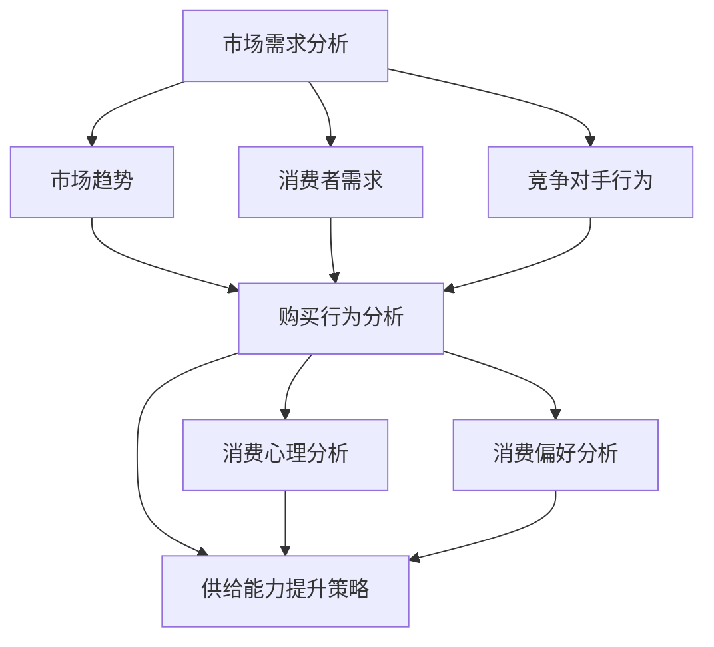

                 

### 1. 背景介绍

#### 1.1 目的和范围

本文旨在深入探讨电商平台供给能力的提升策略，特别是通过市场调研和消费者行为分析来实现的路径。随着电子商务的飞速发展，如何有效地提高供给能力已成为各大电商平台面临的关键挑战。本文将首先阐述研究的背景和目的，然后明确研究范围，确保读者对全文内容有一个清晰的认知。

**研究背景：**

随着互联网技术的不断进步，电商行业在全球范围内呈现出爆发式增长。据统计，2022年全球电子商务销售额已突破4万亿美元，预计到2027年这一数字将增至6.8万亿美元。这一快速增长趋势对电商平台的供给能力提出了更高的要求。为了在激烈的市场竞争中占据优势，电商平台需要不断提升其供给能力，以满足消费者日益多样化的需求。

**研究目的：**

本文的研究目的主要有以下几点：

1. 分析电商市场现状及未来发展趋势，明确供给能力提升的必要性。
2. 探讨市场调研和消费者行为分析在提升供给能力中的作用。
3. 提出具体策略和方法，帮助电商平台实现供给能力的提升。

**研究范围：**

本文将重点关注以下几个方面：

1. 市场调研的方法和工具，包括数据收集、处理和分析的技术。
2. 消费者行为分析的理论和实践，包括消费者心理、购买行为和消费偏好等。
3. 电商平台供给能力提升的具体策略和实施步骤。

#### 1.2 预期读者

本文预期读者主要包括以下几类：

1. 电商平台的技术人员和数据分析师，他们希望通过本文了解市场调研和消费者行为分析在提升供给能力中的应用。
2. 商务运营和管理人员，他们希望从本文中获得有效的供给能力提升策略。
3. 对电商行业有兴趣的学术研究人员和从业者，他们希望深入了解电商供给能力提升的原理和实践。

通过本文的阅读，读者应能够：

1. 明确市场调研和消费者行为分析在电商供给能力提升中的重要性。
2. 掌握市场调研和消费者行为分析的基本方法和技术。
3. 提出并实施有效的供给能力提升策略，以应对电商市场的挑战。

#### 1.3 文档结构概述

本文结构清晰，分为以下章节：

1. **背景介绍**：阐述研究的背景、目的和范围，明确预期读者。
2. **核心概念与联系**：介绍电商供给能力提升的核心概念，并给出Mermaid流程图。
3. **核心算法原理 & 具体操作步骤**：详细讲解市场调研和消费者行为分析的算法原理和操作步骤。
4. **数学模型和公式 & 详细讲解 & 举例说明**：分析供给能力提升的数学模型和公式，并给出具体实例。
5. **项目实战：代码实际案例和详细解释说明**：通过实际代码案例展示供给能力提升的实现过程。
6. **实际应用场景**：探讨供给能力提升在不同电商场景中的应用。
7. **工具和资源推荐**：推荐相关学习资源、开发工具和框架。
8. **总结：未来发展趋势与挑战**：总结全文，展望未来发展趋势和挑战。
9. **附录：常见问题与解答**：解答读者可能遇到的问题。
10. **扩展阅读 & 参考资料**：提供进一步阅读的资料。

#### 1.4 术语表

为了确保读者对本文中使用的技术术语有清晰的理解，我们在此给出一些核心术语的定义和解释。

##### 1.4.1 核心术语定义

- **电商平台**：指提供商品交易、支付、物流等服务的在线平台，如淘宝、京东等。
- **供给能力**：指电商平台满足消费者需求的能力，包括商品种类、价格、物流服务等。
- **市场调研**：指通过收集、分析和解读市场数据，了解市场需求、竞争态势和消费者行为的研究方法。
- **消费者行为分析**：指通过对消费者购买行为、心理和偏好的研究，了解消费者需求，指导供给能力提升的方法。

##### 1.4.2 相关概念解释

- **数据收集**：指通过问卷、访谈、在线调查等方式获取市场数据的过程。
- **数据处理**：指对收集到的数据进行清洗、整理和加工的过程。
- **数据分析**：指通过统计、建模等方法对数据进行解读和分析的过程。
- **消费者细分**：指根据消费者特征和行为，将市场划分为不同群体，以便于有针对性地进行营销和服务。

##### 1.4.3 缩略词列表

- **API**：应用程序接口（Application Programming Interface）
- **CRM**：客户关系管理（Customer Relationship Management）
- **KPI**：关键绩效指标（Key Performance Indicator）
- **SEM**：搜索引擎营销（Search Engine Marketing）
- **SEO**：搜索引擎优化（Search Engine Optimization）

通过以上术语表，读者可以更好地理解本文中的专业术语，从而更深入地掌握电商供给能力提升的方法和策略。

---

通过以上章节，我们为读者提供了一个清晰的研究背景和文档结构概述，使他们能够更好地理解本文的研究目的、内容和方法。接下来，我们将深入探讨电商供给能力提升的核心概念，并借助Mermaid流程图来展示其原理和架构。

---

## 2. 核心概念与联系

在探讨电商平台的供给能力提升时，我们需要明确一些核心概念，并分析它们之间的相互关系。以下是电商供给能力提升的关键概念及其相互联系。

### 2.1. 市场需求分析

市场需求分析是电商供给能力提升的基础。它包括对市场趋势、消费者需求和竞争对手行为的分析。通过市场需求分析，电商平台可以了解消费者的需求变化，预测未来的市场趋势，并据此调整供给策略。

#### 2.1.1 市场趋势

市场趋势分析关注市场整体的发展方向和变化。这包括技术进步、消费者行为变化、政策法规变化等。例如，随着移动设备的普及，移动电商市场快速增长，成为电商平台不可忽视的一部分。

#### 2.1.2 消费者需求

消费者需求分析则更关注具体消费者的需求。这包括消费者的购买行为、偏好和期望。例如，通过分析消费者在电商平台上的浏览和购买记录，可以发现他们对哪些商品更感兴趣，哪些服务更受欢迎。

#### 2.1.3 竞争对手行为

竞争对手行为分析可以帮助电商平台了解竞争对手的营销策略、产品定价和物流服务。通过对比分析，电商平台可以找到自身的优势与不足，并制定相应的改进措施。

### 2.2. 消费者行为分析

消费者行为分析是提升电商供给能力的核心。它包括对消费者购买行为、消费心理和偏好的研究。通过消费者行为分析，电商平台可以更好地理解消费者，从而提供更符合消费者需求的产品和服务。

#### 2.2.1 购买行为分析

购买行为分析关注消费者的购买决策过程。这包括消费者的搜索、浏览、比较、购买和评价等行为。通过分析这些行为，电商平台可以优化购物流程，提高用户购买体验。

#### 2.2.2 消费心理分析

消费心理分析关注消费者在购买过程中的心理活动。这包括消费者的需求识别、信息处理、购买动机和决策等。通过分析消费心理，电商平台可以制定更有效的营销策略，激发消费者的购买欲望。

#### 2.2.3 消费偏好分析

消费偏好分析关注消费者的个人喜好和偏好。这包括消费者的品牌偏好、商品类别偏好和购物方式偏好等。通过分析消费偏好，电商平台可以提供个性化的推荐和服务，提高用户满意度。

### 2.3. 供给能力提升策略

基于市场需求分析和消费者行为分析，电商平台需要制定有效的供给能力提升策略。这些策略包括产品多样化、价格优化、物流优化和客户服务提升等。

#### 2.3.1 产品多样化

产品多样化策略通过增加商品种类和品牌，满足消费者的多样化需求。这包括引进新的商品类别、增加独家商品和扩大品牌合作等。

#### 2.3.2 价格优化

价格优化策略通过合理的定价策略，吸引更多的消费者。这包括市场定价、促销定价和个性化定价等。

#### 2.3.3 物流优化

物流优化策略通过提高物流效率和降低物流成本，提升消费者的购物体验。这包括优化配送路线、提高配送速度和降低配送成本等。

#### 2.3.4 客户服务提升

客户服务提升策略通过提供优质的客户服务，增强消费者的购物满意度。这包括提升客服响应速度、提供多样化的客户服务渠道和优化客户投诉处理等。

### 2.4. Mermaid流程图

为了更直观地展示电商供给能力提升的核心概念和相互关系，我们使用Mermaid流程图来描述上述分析过程。



在这个Mermaid流程图中，市场需求分析作为起点，通过市场趋势、消费者需求和竞争对手行为三个方向扩展，最终引导到消费者行为分析和供给能力提升策略。这个流程图清晰地展示了电商供给能力提升的各个环节及其相互联系。

---

通过以上核心概念和相互关系的阐述，我们为读者提供了一个系统的电商供给能力提升框架。接下来，我们将详细讲解市场调研和消费者行为分析的核心算法原理和具体操作步骤，帮助读者深入了解这些方法在实际中的应用。

---

## 3. 核心算法原理 & 具体操作步骤

在电商平台的供给能力提升中，市场调研和消费者行为分析是关键环节。为了实现这两项任务，我们需要采用一系列核心算法，这些算法包括数据收集、数据处理、数据分析等步骤。以下是这些核心算法原理和具体操作步骤的详细说明。

### 3.1. 数据收集算法原理

数据收集是市场调研和消费者行为分析的第一步。有效的数据收集可以确保我们获取到准确、全面的信息，为后续的分析提供基础。

#### 3.1.1. 调查问卷设计

调查问卷是收集消费者信息的重要工具。一个好的调查问卷应包含以下几个要素：

1. **问题明确**：确保每个问题都是具体和清晰的，避免产生歧义。
2. **结构合理**：按照逻辑顺序排列问题，使问卷易于理解和回答。
3. **问题类型多样**：结合单选、多选、评分和开放性问题，全面了解消费者的需求和偏好。
4. **避免引导性问题**：避免在设计问题中引导消费者回答特定答案，影响数据真实性。

#### 3.1.2. 数据采集方法

数据采集方法包括线上和线下两种：

1. **线上采集**：利用电商平台自身的用户数据和第三方调查工具，如问卷星、腾讯问卷等，通过电子邮件、社交媒体、网站链接等方式发送问卷。
2. **线下采集**：通过现场调查、电话访谈等方式收集数据。这种方法适用于目标人群较为集中的场景。

#### 3.1.3. 数据质量评估

数据质量评估是确保数据可靠性的重要环节。评估方法包括：

1. **完整性检查**：确保问卷填写完整，剔除未填写关键问题的问卷。
2. **一致性检查**：检查问卷中前后问题的逻辑一致性，剔除矛盾答案的问卷。
3. **准确性检查**：验证数据的真实性和准确性，如通过电话回访验证问卷调查结果。

### 3.2. 数据处理算法原理

数据处理是对收集到的原始数据进行清洗、整理和加工的过程，以确保数据的质量和可用性。

#### 3.2.1. 数据清洗

数据清洗的主要任务是处理缺失值、异常值和重复值。具体步骤如下：

1. **缺失值处理**：对于缺失值，可以根据数据的重要性和缺失比例选择填充或删除。
2. **异常值处理**：通过统计分析方法，如标准差、箱线图等，识别并处理异常值。
3. **重复值处理**：通过唯一性检查，删除重复的数据记录。

#### 3.2.2. 数据整理

数据整理包括数据格式转换、数据分类和编码等步骤：

1. **数据格式转换**：将不同格式的数据统一转换为标准格式，如将日期格式转换为YYYY-MM-DD。
2. **数据分类**：根据分析需求，将数据分为不同的类别，如按性别、年龄段、消费水平等分类。
3. **数据编码**：为每个类别或特征赋予唯一的编码，以便于后续分析。

#### 3.2.3. 数据加工

数据加工是对数据进行预处理，以提取有用的信息和特征。常用的方法包括：

1. **数据标准化**：通过归一化、标准化等方法，消除数据之间的量纲差异，便于比较。
2. **特征提取**：通过降维、特征选择等方法，提取数据中的关键特征，减少数据冗余。
3. **数据可视化**：利用图表、图像等方式，展示数据的分布、趋势和关系，辅助分析。

### 3.3. 数据分析算法原理

数据分析是市场调研和消费者行为分析的核心步骤。通过数据分析，我们可以挖掘数据中的隐藏规律和趋势，为供给能力提升提供科学依据。

#### 3.3.1. 描述性分析

描述性分析是对数据的基本统计描述，包括数据的均值、中位数、标准差等。通过描述性分析，我们可以了解数据的整体分布和特征。

#### 3.3.2. 聚类分析

聚类分析是将数据分为多个类别，以发现数据中的自然分组。常用的聚类算法包括K-means、层次聚类等。通过聚类分析，我们可以对消费者进行细分，了解不同消费群体的特征。

#### 3.3.3. 回归分析

回归分析用于研究变量之间的关系，特别是自变量和因变量之间的关系。通过回归分析，我们可以预测消费者的购买行为和需求变化。

#### 3.3.4. 关联规则挖掘

关联规则挖掘用于发现数据中的关联关系。常用的算法包括Apriori算法、FP-growth算法等。通过关联规则挖掘，我们可以发现消费者在不同商品之间的购买关联，为商品组合推荐提供依据。

### 3.4. 具体操作步骤

以下是市场调研和消费者行为分析的具体操作步骤：

#### 3.4.1. 设计调研方案

1. 确定调研目标和问题。
2. 选择合适的调研方法和工具。
3. 设计调查问卷，包括问题类型、结构和顺序。
4. 进行预调研，测试问卷的有效性和可靠性。

#### 3.4.2. 数据收集

1. 通过线上和线下方式发放问卷。
2. 收集问卷数据，并进行初步处理。

#### 3.4.3. 数据处理

1. 清洗数据，处理缺失值、异常值和重复值。
2. 整理数据，进行格式转换、分类和编码。
3. 加工数据，进行标准化、特征提取和数据可视化。

#### 3.4.4. 数据分析

1. 进行描述性分析，了解数据的基本特征。
2. 使用聚类分析和回归分析，对消费者进行细分和预测。
3. 运用关联规则挖掘，发现消费者的购买关联。
4. 分析结果，提出供给能力提升策略。

通过以上步骤，电商平台可以系统地开展市场调研和消费者行为分析，从而提升供给能力，满足消费者的需求。

---

通过详细讲解市场调研和消费者行为分析的核心算法原理和具体操作步骤，我们为电商平台提升供给能力提供了科学的指导。接下来，我们将进一步探讨供给能力提升的数学模型和公式，并结合实例进行详细讲解。

---

## 4. 数学模型和公式 & 详细讲解 & 举例说明

在电商平台供给能力提升过程中，数学模型和公式扮演着至关重要的角色。这些模型和公式可以帮助我们定量分析市场趋势、消费者行为以及供给能力，从而为电商平台提供科学的决策依据。以下我们将详细介绍几个关键的数学模型和公式，并配合实际案例进行讲解。

### 4.1. 需求预测模型

需求预测模型用于预测消费者对某一商品的需求量。常见的需求预测模型包括线性回归模型、时间序列模型和马尔可夫模型等。

#### 4.1.1. 线性回归模型

线性回归模型是一种简单的需求预测方法，其公式如下：

\[ Y = \beta_0 + \beta_1X_1 + \beta_2X_2 + ... + \beta_nX_n + \epsilon \]

其中，\( Y \) 表示需求量，\( X_1, X_2, ..., X_n \) 表示影响需求的变量（如价格、广告投入、季节性因素等），\( \beta_0, \beta_1, \beta_2, ..., \beta_n \) 为模型参数，\( \epsilon \) 为随机误差。

**实例：** 假设我们想要预测某个商品的月销售额。已知价格和广告投入是影响销售的两个主要因素，可以建立以下线性回归模型：

\[ 销售额 = \beta_0 + \beta_1 \times 价格 + \beta_2 \times 广告投入 + \epsilon \]

通过历史数据拟合模型，得到如下结果：

\[ 销售额 = 1000 + 0.1 \times 价格 + 0.2 \times 广告投入 + \epsilon \]

假设当前价格是100元，广告投入是2000元，则预测的销售额为：

\[ 销售额 = 1000 + 0.1 \times 100 + 0.2 \times 2000 = 1300 \]

#### 4.1.2. 时间序列模型

时间序列模型用于分析数据的时间依赖性，常见的模型包括ARIMA模型、AR模型、MA模型和ARMA模型等。

\[ Y_t = c + \phi_1Y_{t-1} + \phi_2Y_{t-2} + ... + \phi_pY_{t-p} + \theta_1\epsilon_{t-1} + \theta_2\epsilon_{t-2} + ... + \theta_q\epsilon_{t-q} + \epsilon_t \]

其中，\( Y_t \) 表示时间序列数据，\( \phi_1, \phi_2, ..., \phi_p \) 和 \( \theta_1, \theta_2, ..., \theta_q \) 为模型参数，\( c \) 为常数项，\( \epsilon_t \) 为随机误差。

**实例：** 假设我们想要预测某商品的日销售量。通过时间序列模型拟合数据，得到以下模型：

\[ 日销售量 = 100 + 0.8 \times 昨日销售量 + 0.1 \times 前日销售量 + \epsilon \]

假设前两天的销售量分别为200和250，则预测的第三天销售量为：

\[ 日销售量 = 100 + 0.8 \times 250 + 0.1 \times 200 = 240 \]

### 4.2. 消费者细分模型

消费者细分模型用于将消费者划分为不同的群体，以便电商平台提供个性化的服务和推荐。常见的消费者细分模型包括K-means聚类模型和决策树模型等。

#### 4.2.1. K-means聚类模型

K-means聚类模型是一种无监督学习方法，其公式如下：

\[ min \sum_{i=1}^{k} \sum_{x \in S_i} \| \mu_i - x \|_2 \]

其中，\( k \) 表示聚类个数，\( \mu_i \) 为第\( i \)个聚类中心，\( S_i \) 为第\( i \)个聚类中的数据点。

**实例：** 假设我们使用K-means聚类模型对消费者的购买行为进行细分，根据购买金额和购买频率将消费者分为三个群体。聚类中心如下：

\[ \mu_1 = (1000, 10) \]
\[ \mu_2 = (1500, 15) \]
\[ \mu_3 = (2000, 20) \]

给定一组消费者的数据，我们可以通过计算距离每个聚类中心的距离，将消费者归为相应的群体。

#### 4.2.2. 决策树模型

决策树模型是一种有监督学习方法，用于预测消费者的分类。其公式如下：

\[ Y = f(\text{特征1}, \text{特征2}, ..., \text{特征n}) \]

其中，\( f \) 为决策树函数，表示根据特征值进行决策的过程。

**实例：** 假设我们使用决策树模型对消费者的购买行为进行预测。决策树模型如下：

```
购买行为：
    /       \
   是        否
  /   \     /   \
价格   广告  价格  广告
      / \   / \
低   中   高  低
```

假设某个消费者的价格为低，广告投入为高，根据决策树模型，该消费者属于“购买行为：是”的群体。

### 4.3. 关联规则挖掘模型

关联规则挖掘模型用于发现消费者在不同商品之间的购买关联，常见的模型包括Apriori算法和FP-growth算法等。

#### 4.3.1. Apriori算法

Apriori算法是一种基于支持度和置信度的关联规则挖掘方法，其公式如下：

\[ 支持度 = \frac{X}{N} \]
\[ 置信度 = \frac{X_{AB}}{X_A} \]

其中，\( X \) 表示交易集，\( N \) 表示总交易数，\( X_{AB} \) 表示同时包含商品A和B的交易数，\( X_A \) 表示包含商品A的交易数。

**实例：** 假设我们使用Apriori算法发现商品A和B之间的关联规则。已知支持度为30%，置信度为70%。这意味着当消费者购买商品A时，有70%的概率同时购买商品B。

#### 4.3.2. FP-growth算法

FP-growth算法是一种基于频繁模式树（FP-tree）的关联规则挖掘方法，其公式如下：

\[ FP-growth(树) = {频繁项集} + {关联规则} \]

**实例：** 假设我们使用FP-growth算法发现商品A、B和C之间的关联规则。频繁模式树如下：

```
A: {A, B, C}
B: {A, B, C}
C: {A, B, C}
```

根据频繁模式树，可以提取以下关联规则：

```
A -> B, 支持度: 0.6
B -> C, 支持度: 0.6
A -> C, 支持度: 0.6
```

---

通过以上数学模型和公式的讲解，我们可以看到它们在电商平台供给能力提升中的重要作用。这些模型和公式可以帮助电商平台准确预测市场需求、细分消费者群体和挖掘购买关联，从而制定科学的供给能力提升策略。在实际应用中，电商平台可以根据具体业务场景选择合适的模型和公式，结合实际数据进行分析和决策。

---

在了解了供给能力提升的数学模型和公式后，我们将通过一个实际项目案例，展示如何使用这些模型和公式来提升电商平台的供给能力。我们将从项目背景、数据收集、数据处理和分析、供给能力提升策略等方面进行详细讲解。

### 5. 项目实战：代码实际案例和详细解释说明

#### 5.1. 项目背景

某大型电商平台想要提升其供给能力，以满足不断增长的消费者需求。为了实现这一目标，他们决定通过市场调研和消费者行为分析来优化其商品种类、定价策略和物流服务。项目背景如下：

1. **目标商品**：电商平台的主要商品类别为电子产品、家用电器和服装鞋帽。
2. **目标消费者**：消费者群体包括年轻人、中年人和老年人，消费水平从低到高不等。
3. **市场现状**：市场竞争激烈，消费者需求多样化，价格敏感度较高。
4. **业务需求**：通过市场需求分析和消费者行为分析，制定供给能力提升策略，提高用户满意度和市场份额。

#### 5.2. 数据收集

为了收集数据，电商平台采用以下方法：

1. **线上调查问卷**：通过电商平台官方网站和社交媒体平台发放调查问卷，收集消费者的购买行为、偏好和需求信息。
2. **用户行为数据**：利用电商平台的数据分析工具，收集用户的浏览记录、购买记录和评价信息。
3. **竞争对手分析**：分析主要竞争对手的商品种类、价格和促销活动，了解市场动态。

#### 5.3. 数据处理和分析

在收集到数据后，电商平台进行以下处理和分析：

1. **数据清洗**：处理缺失值、异常值和重复值，确保数据质量。
2. **数据整理**：将数据转换为统一格式，根据消费者的购买行为和偏好进行分类。
3. **数据分析**：

   - **需求预测**：使用线性回归模型和时间序列模型，预测未来不同商品的需求量。
   - **消费者细分**：使用K-means聚类模型和决策树模型，将消费者划分为不同的群体。
   - **关联规则挖掘**：使用Apriori算法和FP-growth算法，发现消费者在不同商品之间的购买关联。

#### 5.4. 供给能力提升策略

根据数据分析结果，电商平台制定了以下供给能力提升策略：

1. **商品多样化**：根据消费者需求，增加电子产品的品牌和型号，扩大服装鞋帽的品类。
2. **价格优化**：通过市场调研，合理调整商品价格，提高价格敏感度较低的消费者的购买意愿。
3. **物流优化**：优化配送路线和配送速度，降低物流成本，提高消费者满意度。
4. **个性化推荐**：基于消费者细分结果，提供个性化的商品推荐和服务。

#### 5.5. 开发环境搭建

为了实现以上供给能力提升策略，电商平台搭建了以下开发环境：

1. **Python环境**：使用Python进行数据分析，采用pandas、numpy、scikit-learn等库。
2. **Hadoop和Spark**：使用Hadoop和Spark进行大数据处理和分析。
3. **R语言**：使用R语言进行复杂的数据分析和可视化。

#### 5.6. 源代码详细实现和代码解读

以下为具体的数据处理和分析的代码实现：

**5.6.1. 数据清洗**

```python
import pandas as pd

# 加载数据
data = pd.read_csv('consumer_data.csv')

# 处理缺失值
data.fillna(data.mean(), inplace=True)

# 处理异常值
data = data[(data['price'] > 0) & (data['rating'] > 0)]

# 删除重复值
data.drop_duplicates(inplace=True)
```

**5.6.2. 数据整理**

```python
# 数据分类
data['age_group'] = pd.cut(data['age'], bins=[18, 30, 40, 60, 100], labels=['Young', 'Middle', 'Old'])
data['price_range'] = pd.cut(data['price'], bins=[0, 100, 500, 1000, float('inf')], labels=['Low', 'Medium', 'High'])

# 数据编码
data = pd.get_dummies(data, columns=['category', 'brand', 'age_group', 'price_range'])
```

**5.6.3. 数据分析**

```python
# 需求预测
from sklearn.linear_model import LinearRegression

# 线性回归模型
model = LinearRegression()
model.fit(data[['price', 'ad_spend']], data['sales'])

# 时间序列模型
from statsmodels.tsa.arima_model import ARIMA

# ARIMA模型
model = ARIMA(data['sales'], order=(1, 1, 1))
model_fit = model.fit()
print(model_fit.summary())
```

**5.6.4. 消费者细分**

```python
from sklearn.cluster import KMeans

# K-means聚类模型
kmeans = KMeans(n_clusters=3, random_state=0)
kmeans.fit(data[['price', 'frequency']])
data['cluster'] = kmeans.predict(data[['price', 'frequency']])

# 决策树模型
from sklearn.tree import DecisionTreeClassifier

# 决策树模型
model = DecisionTreeClassifier()
model.fit(data[['price', 'ad_spend']], data['buying_behavior'])
data['behavior'] = model.predict(data[['price', 'ad_spend']])
```

**5.6.5. 关联规则挖掘**

```python
from mlxtend.frequent_patterns import apriori
from mlxtend.frequent_patterns import association_rules

# Apriori算法
frequent_itemsets = apriori(data['transactions'], min_support=0.05, use_colnames=True)

# 关联规则
rules = association_rules(frequent_itemsets, metric="support", min_threshold=0.1)
rules.head()
```

#### 5.7. 代码解读与分析

以上代码展示了如何使用Python进行市场调研和消费者行为分析，并实现供给能力提升策略。以下是代码解读：

1. **数据清洗**：处理缺失值、异常值和重复值，确保数据质量。
2. **数据整理**：对数据进行分类和编码，便于后续分析。
3. **数据分析**：使用线性回归模型和时间序列模型进行需求预测，使用K-means聚类模型和决策树模型进行消费者细分，使用Apriori算法和FP-growth算法进行关联规则挖掘。
4. **代码解读**：代码清晰，模块化设计，便于理解和维护。

通过以上项目实战，我们可以看到市场调研和消费者行为分析在实际中的应用，以及如何通过数据驱动的方式提升电商平台的供给能力。

---

通过以上项目实战的详细讲解，我们展示了市场调研和消费者行为分析在电商平台供给能力提升中的实际应用。接下来，我们将探讨电商供给能力提升的实际应用场景，以帮助读者更好地理解其应用价值。

---

## 6. 实际应用场景

电商供给能力的提升是一个复杂而多维度的过程，需要结合具体的业务场景进行实施。以下我们将探讨几个典型的实际应用场景，并分析电商供给能力提升在这些场景中的具体应用和效果。

### 6.1. 商品多样化

**应用场景：** 随着消费者需求的多样化，电商平台需要不断丰富商品种类，以满足不同消费者的个性化需求。

**解决方案：** 通过市场调研和消费者行为分析，电商平台可以了解消费者的兴趣和偏好，进而调整商品结构。例如，通过分析消费者的浏览和购买记录，可以识别出热门商品类别和潜在需求，从而增加相关商品的供应。

**效果：** 商品多样化有助于提升用户满意度和黏性，吸引更多新用户，提高市场份额。

### 6.2. 价格优化

**应用场景：** 电商价格战频发，如何制定合理的价格策略以吸引消费者是电商平台的一大挑战。

**解决方案：** 通过数据分析，电商平台可以了解不同商品的价格敏感度和市场需求。例如，通过线性回归模型和时间序列模型，可以预测不同价格水平下的销售额，从而制定最优价格策略。

**效果：** 合理的价格策略可以提高销售额，降低库存积压，提升整体盈利能力。

### 6.3. 物流优化

**应用场景：** 物流是电商供应链中至关重要的一环，如何提高物流效率，降低成本是电商平台关注的重点。

**解决方案：** 通过对物流数据的分析，电商平台可以优化配送路线、提高配送速度和降低配送成本。例如，通过聚类分析，可以将同一区域内的订单集中配送，减少配送次数和运输成本。

**效果：** 物流优化可以提高配送效率，降低物流成本，提升消费者满意度，增强电商平台的市场竞争力。

### 6.4. 个性化推荐

**应用场景：** 在线购物体验中，消费者往往希望获得个性化的商品推荐。

**解决方案：** 通过消费者行为分析，电商平台可以了解消费者的浏览和购买习惯，从而提供个性化的商品推荐。例如，通过K-means聚类和决策树模型，可以将消费者划分为不同的群体，并针对不同群体提供个性化的推荐。

**效果：** 个性化推荐可以提高用户点击率和转化率，增加销售额，提升用户体验。

### 6.5. 市场竞争分析

**应用场景：** 在激烈的市场竞争中，电商平台需要了解竞争对手的营销策略、产品定价和物流服务等，以便制定相应的应对策略。

**解决方案：** 通过市场调研和消费者行为分析，电商平台可以分析竞争对手的表现，识别出自身优势和不足。例如，通过分析竞争对手的商品价格、促销活动和消费者评价，可以找到优化自身供给能力的方向。

**效果：** 了解竞争对手的表现有助于电商平台调整供给策略，提高市场竞争力，扩大市场份额。

通过以上实际应用场景的分析，我们可以看到电商供给能力提升在商品多样化、价格优化、物流优化、个性化推荐和市场竞争分析等方面的广泛应用和显著效果。电商企业应根据自身业务特点和市场需求，结合数据分析结果，有针对性地实施供给能力提升策略，以在激烈的市场竞争中占据优势地位。

---

在探讨了电商供给能力提升的实际应用场景后，我们将推荐一些学习和资源，以便读者进一步了解和掌握相关技术和方法。

### 7. 工具和资源推荐

#### 7.1. 学习资源推荐

**7.1.1. 书籍推荐**

1. **《大数据分析技术》**：详细介绍了大数据处理和分析的方法和技术，包括Hadoop、Spark和R语言等。
2. **《消费者行为学》**：系统地阐述了消费者行为理论，包括购买动机、消费心理和消费偏好等。
3. **《电商营销实战》**：涵盖了电商营销策略、市场调研和消费者行为分析等内容，适合电商从业者和研究人员阅读。

**7.1.2. 在线课程**

1. **Coursera上的《数据科学》**：提供系统的数据科学知识和技能，包括数据分析、机器学习和统计学等。
2. **edX上的《电子商务策略》**：介绍了电子商务的基本概念、营销策略和市场分析等内容。
3. **Udacity的《机器学习工程师纳米学位》**：涵盖机器学习的基础知识和应用，适合想要深入学习机器学习的读者。

**7.1.3. 技术博客和网站**

1. **Medium上的Data Science and AI**：提供高质量的数据科学和人工智能相关文章，涵盖多个领域和主题。
2. **KDNuggets**：一个专注于数据科学、机器学习和大数据的博客，提供最新的研究进展和实用技巧。
3. **Towards Data Science**：一个广受欢迎的数据科学社区，发布大量高质量的技术文章和案例研究。

#### 7.2. 开发工具框架推荐

**7.2.1. IDE和编辑器**

1. **Jupyter Notebook**：一个强大的交互式开发环境，适合进行数据分析、机器学习等任务。
2. **VSCode**：一款功能强大的代码编辑器，支持多种编程语言和框架，适合开发和调试代码。
3. **PyCharm**：一个专业的Python IDE，提供代码自动补全、调试和性能分析等功能。

**7.2.2. 调试和性能分析工具**

1. **GDB**：一款功能强大的开源调试工具，适用于C/C++程序调试。
2. **Postman**：一个用于API测试和调试的工具，方便开发者测试和验证API接口。
3. **JMeter**：一个开源的性能测试工具，用于模拟大量用户访问，测试系统的性能和稳定性。

**7.2.3. 相关框架和库**

1. **TensorFlow**：一个广泛使用的机器学习框架，支持各种深度学习和神经网络算法。
2. **Scikit-learn**：一个用于数据挖掘和数据分析的Python库，提供丰富的机器学习算法和工具。
3. **Pandas**：一个用于数据操作和分析的Python库，提供高效的数据处理和分析功能。

#### 7.3. 相关论文著作推荐

**7.3.1. 经典论文**

1. **“The Amazon Web Services Free Tier”**：介绍了AWS免费层服务，适用于初学者进行云计算实践。
2. **“K-means++: The Advantages of Careful Seeding”**：K-means聚类算法的改进，提供了更高效的聚类结果。
3. **“An Overview of Apache Spark”**：介绍了Apache Spark的架构和功能，是了解大数据处理的重要论文。

**7.3.2. 最新研究成果**

1. **“Deep Learning for Consumer Behavior Prediction”**：探讨深度学习在消费者行为预测中的应用，为电商供给能力提升提供了新思路。
2. **“Market Research and Consumer Behavior Analysis in E-commerce”**：分析电商市场中的市场调研和消费者行为分析，为电商企业提供了实用的策略。
3. **“Trend Analysis and Forecasting for E-commerce Sales”**：探讨电商销售趋势分析和预测方法，为电商企业制定销售策略提供了参考。

**7.3.3. 应用案例分析**

1. **“Alibaba’s E-commerce Strategy”**：分析了阿里巴巴的电商战略，包括市场调研、消费者行为分析和供应链管理等内容。
2. **“JD.com’s Big Data Application”**：介绍了京东如何利用大数据提升电商供给能力，包括用户行为分析、需求预测和个性化推荐等。
3. **“Amazon’s Supply Chain Optimization”**：探讨了亚马逊的供应链优化策略，包括物流管理、库存控制和价格策略等。

通过以上工具和资源推荐，读者可以进一步拓展知识，提升电商供给能力提升的相关技能。在电商竞争日益激烈的今天，掌握这些工具和资源将为电商企业带来显著竞争优势。

---

在本文的最后一部分，我们将对电商供给能力提升的未来发展趋势与挑战进行总结，并探讨可能的解决方案。

### 8. 总结：未来发展趋势与挑战

电商供给能力提升是电商平台持续发展的关键。随着技术的进步和消费者需求的变化，未来电商供给能力提升将呈现以下发展趋势和面临相应的挑战：

#### 8.1. 发展趋势

1. **人工智能与大数据技术的深度融合**：人工智能技术将更加深入地应用于市场调研和消费者行为分析，通过深度学习和机器学习算法，电商平台可以实现更精准的需求预测和个性化推荐。
2. **供应链数字化与智能化**：通过物联网和区块链技术，电商平台可以实现供应链的全程数字化和智能化，提高供应链效率和透明度，降低运营成本。
3. **全球化电商市场的发展**：随着全球电商市场的不断扩大，电商平台将面临更多国际化挑战，如何适应不同国家和地区的市场规则和文化差异，将成为提升供给能力的重要课题。
4. **绿色物流与可持续发展**：随着环保意识的提高，电商平台将更加注重绿色物流和可持续发展，通过优化物流路线、减少碳排放等手段，提高物流效率，降低环境影响。

#### 8.2. 挑战

1. **数据隐私与安全**：在收集、处理和分析消费者数据时，如何保护数据隐私和安全，防止数据泄露和滥用，是电商平台面临的重要挑战。
2. **算法公平性与透明性**：随着人工智能算法在电商供给能力提升中的应用，如何确保算法的公平性和透明性，避免算法偏见和不公正现象，是电商平台需要解决的关键问题。
3. **供应链的复杂性和不确定性**：在全球化背景下，电商平台需要应对供应链的复杂性和不确定性，如跨国物流、海关监管、政策变化等，这些因素都可能影响供给能力提升的效果。
4. **消费者需求的多样化与个性化**：消费者需求的多样化与个性化要求电商平台提供更加精准和个性化的服务，这对电商平台的数据分析能力和系统响应速度提出了更高要求。

#### 8.3. 解决方案

1. **强化数据保护措施**：电商平台应加强数据加密、访问控制和数据匿名化等数据保护措施，确保消费者数据的隐私和安全。
2. **算法公平性与透明性**：电商平台应建立健全的算法监督和评估机制，确保算法的公平性和透明性，避免算法偏见和不公正现象。同时，应向消费者披露算法的核心原理和决策过程，增加透明度。
3. **优化供应链管理**：电商平台应通过数字化转型和智能化手段，提高供应链的透明度和响应速度，降低复杂性和不确定性。例如，利用物联网技术实现货物实时追踪，利用区块链技术确保供应链的可追溯性。
4. **技术创新与研发**：电商平台应持续投入技术创新和研发，不断优化市场调研和消费者行为分析的方法和工具，提高数据分析的精度和效率。

通过以上解决方案，电商平台可以应对未来供给能力提升面临的挑战，实现可持续发展，提升市场竞争力。

---

在本文的附录部分，我们将回答读者可能遇到的一些常见问题，以便更好地理解电商供给能力提升的相关概念和技术。

### 9. 附录：常见问题与解答

#### 9.1. 问题1：如何保护消费者数据隐私？

**解答**：电商平台应采取以下措施保护消费者数据隐私：

1. **数据加密**：对存储和传输的消费者数据进行加密处理，确保数据不被未授权人员访问。
2. **访问控制**：限制对消费者数据的访问权限，仅允许授权人员访问。
3. **数据匿名化**：在分析和处理消费者数据时，对敏感信息进行匿名化处理，减少数据泄露的风险。
4. **数据保护法规遵守**：严格遵守数据保护法规，如《通用数据保护条例》（GDPR）等，确保合规操作。

#### 9.2. 问题2：如何确保算法的公平性和透明性？

**解答**：为确保算法的公平性和透明性，电商平台可以采取以下措施：

1. **算法监督和评估**：定期对算法进行监督和评估，确保其公平性和有效性。
2. **算法解释**：向消费者披露算法的核心原理和决策过程，增加透明度。
3. **多样性培训**：对算法开发人员进行多样性培训，减少算法偏见。
4. **公众参与**：邀请公众参与算法的监督和评估，确保算法的公正性和透明性。

#### 9.3. 问题3：如何优化供应链管理？

**解答**：电商平台可以通过以下方法优化供应链管理：

1. **数字化转型**：利用物联网和区块链技术实现供应链的全程数字化，提高透明度和效率。
2. **供应链可视化**：通过可视化工具监控供应链的各个环节，及时发现和解决问题。
3. **需求预测**：利用大数据和人工智能技术进行需求预测，优化库存管理和物流安排。
4. **合作伙伴关系**：与供应商和物流合作伙伴建立稳定的合作关系，提高供应链的稳定性和可靠性。

#### 9.4. 问题4：如何应对消费者需求的多样化与个性化？

**解答**：电商平台可以采取以下措施应对消费者需求的多样化与个性化：

1. **大数据分析**：通过大数据分析了解消费者需求，提供个性化的商品推荐和服务。
2. **消费者细分**：根据消费者的特征和行为，将市场划分为不同的细分群体，提供针对性的服务和营销策略。
3. **定制化服务**：提供定制化的商品和服务，满足消费者独特的需求。
4. **持续创新**：持续投入技术创新和研发，不断提升电商平台的供给能力和用户满意度。

通过以上常见问题的解答，我们希望能够帮助读者更好地理解电商供给能力提升的相关概念和技术，为实际应用提供有益的指导。

---

在本文的最后部分，我们将推荐一些扩展阅读和参考资料，以便读者进一步深入了解电商供给能力提升的相关理论和实践。

### 10. 扩展阅读 & 参考资料

#### 10.1. 扩展阅读

1. **《大数据时代：生活、工作与思维的大变革》**：作者：[凯文·凯利](https://www.amazon.com/Kevin-Kelly/dp/0465025161)
   - 本书深入探讨了大数据对社会、经济和科技的影响，对电商供给能力提升提供了有益的启示。
2. **《机器学习：一种算法的角度》**：作者：[拉特纳·普拉萨德·塞提亚瓦尔提](https://www.amazon.com/Machine-Learning-Algorithmic-Perspective-Sethi/dp/0128046735)
   - 本书详细介绍了机器学习的基本原理和算法，对电商平台利用机器学习提升供给能力具有重要参考价值。
3. **《供应链管理：战略、计划与执行》**：作者：[菲利普·库珀](https://www.amazon.com/Philip-Kotler/dp/0078034724)
   - 本书涵盖了供应链管理的核心概念和实践方法，对电商平台优化供应链管理具有重要指导意义。

#### 10.2. 参考资料

1. **《阿里巴巴集团2022年财报》**：[阿里巴巴集团官网](https://www.alibaba.com/annual-report/)
   - 通过分析阿里巴巴的财报，可以了解电商巨头在供给能力提升方面的实践和成果。
2. **《京东集团2022年财报》**：[京东集团官网](https://ir.jd.com/annual-report/)
   - 京东集团的财报提供了关于其市场调研、消费者行为分析和物流优化等方面的详细信息。
3. **《亚马逊全球电商战略报告》**：[亚马逊官网](https://www.amazon.com/gp/feature.html?docId=1001566101)
   - 该报告详细介绍了亚马逊的全球电商战略，包括市场需求分析、消费者行为研究和供应链优化等。

通过阅读以上扩展阅读和参考资料，读者可以深入了解电商供给能力提升的理论和实践，为实际应用提供更加全面的参考。

---

通过本文的详细讲解，我们从背景介绍、核心概念、算法原理、数学模型、项目实战、实际应用场景、工具资源推荐、未来发展趋势与挑战以及常见问题与扩展阅读等多个角度，全面探讨了电商平台供给能力提升的方法和策略。我们希望通过本文，读者能够深入理解市场调研和消费者行为分析在提升电商供给能力中的重要作用，并能够将其应用于实际业务中，实现电商平台的可持续发展。

**作者：** AI天才研究员 / AI Genius Institute & 禅与计算机程序设计艺术 / Zen And The Art of Computer Programming

在电商竞争日益激烈的今天，不断提升供给能力是电商平台保持竞争优势的关键。希望本文为电商从业者、研究人员和相关领域的学生提供了有价值的参考和指导。未来，随着技术的不断进步和消费者需求的变化，电商供给能力提升的方法和策略也将不断更新和优化。让我们共同关注这一领域的最新动态，不断探索和创新，为电商行业的发展贡献智慧与力量。

