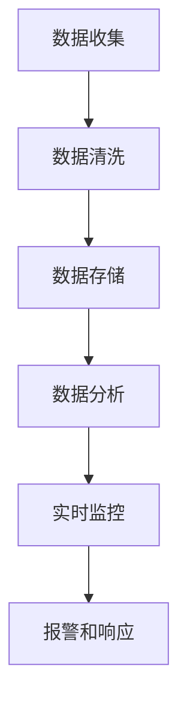

                 

# 电商平台供给能力提升：数据分析和实时监控

> **关键词：** 电商平台、供给能力、数据分析、实时监控、算法、数学模型、项目实战、应用场景、工具资源

> **摘要：** 本文将探讨如何通过数据分析和实时监控技术提升电商平台的供给能力。我们将深入探讨核心概念，介绍算法原理和数学模型，并通过项目实战和实际应用场景进行分析，最后推荐相关学习资源和开发工具，展望未来发展趋势与挑战。

## 1. 背景介绍

### 1.1 目的和范围

本文旨在为电商平台的运营团队和技术团队提供一套系统的方法来提升供给能力。通过深入分析数据、实时监控供需变化，我们可以优化库存管理、提高配送效率，从而提升用户体验和平台竞争力。

本文将涵盖以下内容：

- 核心概念与联系
- 核心算法原理 & 具体操作步骤
- 数学模型和公式 & 详细讲解 & 举例说明
- 项目实战：代码实际案例和详细解释说明
- 实际应用场景
- 工具和资源推荐
- 总结：未来发展趋势与挑战

### 1.2 预期读者

- 电商平台的运营经理和技术经理
- 数据分析师和软件工程师
- 对电商平台技术感兴趣的技术爱好者

### 1.3 文档结构概述

本文分为以下几个部分：

- **背景介绍**：介绍目的、范围和预期读者
- **核心概念与联系**：介绍核心概念和原理，并给出流程图
- **核心算法原理 & 具体操作步骤**：详细讲解算法原理和操作步骤，使用伪代码阐述
- **数学模型和公式 & 详细讲解 & 举例说明**：介绍数学模型，使用latex格式展示公式，并举例说明
- **项目实战：代码实际案例和详细解释说明**：通过实战案例展示代码实现和解析
- **实际应用场景**：分析电商平台的实际应用场景
- **工具和资源推荐**：推荐学习资源和开发工具
- **总结：未来发展趋势与挑战**：展望未来发展趋势和面临的挑战
- **附录：常见问题与解答**：回答读者可能关心的问题
- **扩展阅读 & 参考资料**：提供进一步学习的资料和引用

### 1.4 术语表

#### 1.4.1 核心术语定义

- **供给能力**：指电商平台能够满足用户需求的能力，包括库存管理、配送效率等。
- **数据分析**：使用统计方法和算法对大量数据进行处理和分析，提取有用信息。
- **实时监控**：对电商平台运行状态进行持续监控，及时发现和解决问题。
- **库存管理**：优化库存水平，确保库存充足，减少库存过剩或短缺。
- **配送效率**：提高配送速度，降低配送成本，提升用户体验。

#### 1.4.2 相关概念解释

- **数据源**：电商平台产生和收集的数据来源，如订单、库存、用户行为等。
- **算法**：解决特定问题的步骤和规则，如库存优化算法、配送路径规划算法等。
- **数学模型**：用数学语言描述实际问题，如供需平衡模型、线性规划模型等。

#### 1.4.3 缩略词列表

- **API**：应用程序接口（Application Programming Interface）
- **SQL**：结构化查询语言（Structured Query Language）
- **IDE**：集成开发环境（Integrated Development Environment）
- **IoT**：物联网（Internet of Things）
- **ML**：机器学习（Machine Learning）

## 2. 核心概念与联系

在提升电商平台供给能力的过程中，理解以下核心概念和它们之间的联系至关重要。

### 2.1 数据分析

数据分析是提升供给能力的关键环节。通过对数据源的数据进行收集、清洗、存储和分析，我们可以提取出有用的信息，如用户需求、库存水平、配送路径等。数据分析的流程可以概括为：

1. **数据收集**：收集来自电商平台各模块的数据，如订单、库存、用户行为等。
2. **数据清洗**：处理数据中的噪声和异常值，确保数据质量。
3. **数据存储**：将清洗后的数据存储到数据库或数据仓库中，方便后续分析和查询。
4. **数据分析**：使用统计方法和算法对数据进行处理，提取有用信息，如趋势、关联关系等。

### 2.2 实时监控

实时监控是保障供给能力的关键手段。通过实时监控电商平台的运行状态，我们可以及时发现和解决问题，如库存不足、配送延误等。实时监控的流程可以概括为：

1. **数据采集**：从电商平台各模块采集实时数据，如库存水平、配送状态等。
2. **数据预处理**：对采集到的数据进行清洗和格式化，确保数据质量。
3. **实时分析**：使用实时分析算法对预处理后的数据进行处理，识别异常情况和潜在问题。
4. **报警和响应**：根据分析结果，触发报警并采取相应措施，如调整库存水平、优化配送路径等。

### 2.3 核心算法原理

提升供给能力的关键在于优化库存管理和配送路径。以下是两个核心算法原理的介绍：

#### 2.3.1 库存优化算法

库存优化算法旨在确定最佳的库存水平，以平衡库存成本和满足用户需求。常用的库存优化算法包括：

1. **周期盘点法**：定期对库存进行盘点，根据盘点结果调整库存水平。
2. **需求预测法**：使用历史数据和预测算法预测未来需求，根据预测结果调整库存水平。
3. **ABC分析法**：根据库存价值将库存分为A、B、C三类，优先管理价值较高的A类库存。

#### 2.3.2 配送路径规划算法

配送路径规划算法旨在确定最优的配送路径，以降低配送成本和提高配送效率。常用的配送路径规划算法包括：

1. **最短路径算法**：计算从起点到终点的最短路径，适用于小规模配送场景。
2. **遗传算法**：模拟生物进化过程，优化配送路径，适用于大规模配送场景。
3. **蚁群算法**：模拟蚂蚁觅食过程，优化配送路径，适用于动态配送场景。

### 2.4 数学模型

数学模型是描述供需关系和优化问题的有力工具。以下是两个常用的数学模型：

#### 2.4.1 供需平衡模型

供需平衡模型旨在确定供给和需求之间的平衡点，以优化库存水平。供需平衡模型的基本公式为：

\[ \text{供给量} = \text{需求量} \]

其中，供给量和需求量分别表示库存量和用户需求量。

#### 2.4.2 线性规划模型

线性规划模型旨在在约束条件下，优化目标函数。对于电商平台供给能力的优化问题，目标函数可以是库存成本、配送成本等。约束条件可以是库存容量、配送时间等。

线性规划模型的基本公式为：

\[ \text{minimize} \ c^T x \]
\[ \text{subject to} \ Ax \leq b \]

其中，\( c \) 和 \( x \) 分别表示目标函数系数向量和决策变量向量，\( A \) 和 \( b \) 分别表示约束条件系数矩阵和约束条件向量。

### 2.5 Mermaid 流程图

以下是一个简单的 Mermaid 流程图，展示了提升电商平台供给能力的核心流程：



## 3. 核心算法原理 & 具体操作步骤

在提升电商平台供给能力的过程中，核心算法原理起着至关重要的作用。本节将详细讲解库存优化算法和配送路径规划算法的原理，并使用伪代码进行具体操作步骤的阐述。

### 3.1 库存优化算法

库存优化算法的核心目标是确定最佳的库存水平，以平衡库存成本和满足用户需求。以下是库存优化算法的原理和具体操作步骤：

#### 3.1.1 周期盘点法

**原理**：周期盘点法通过定期对库存进行盘点，根据盘点结果调整库存水平。这种方法适用于库存变化较小、需求稳定的场景。

**具体操作步骤**：

1. 确定盘点周期，如每周或每月。
2. 在每个盘点周期结束时，对库存进行盘点。
3. 根据盘点结果，计算实际库存水平与目标库存水平的差异。
4. 根据差异，调整库存水平，如增加或减少采购量。

**伪代码**：

```python
# 周期盘点法
def cycle_inventory_manage():
    # 确定盘点周期
   盘点周期 = 1
    
    while True:
        # 等待盘点周期结束
        等待(盘点周期)
        
        # 进行盘点
        实际库存水平 = conduct_inventory()
        
        # 计算差异
        差异 = 实际库存水平 - 目标库存水平
        
        # 调整库存水平
        if 差异 > 0:
            减少采购量(差异)
        else:
            增加采购量(-差异)
```

#### 3.1.2 需求预测法

**原理**：需求预测法通过分析历史数据，使用预测算法预测未来需求，根据预测结果调整库存水平。这种方法适用于库存变化较大、需求波动较大的场景。

**具体操作步骤**：

1. 收集历史需求数据。
2. 使用预测算法（如线性回归、ARIMA模型等）预测未来需求。
3. 根据预测结果，计算未来需求与当前库存水平的差异。
4. 根据差异，调整库存水平，如增加或减少采购量。

**伪代码**：

```python
# 需求预测法
def demand_predict_inventory_manage():
    # 收集历史需求数据
    历史需求数据 = collect_historical_demand_data()
    
    # 预测未来需求
    预测需求 = predict_future_demand(历史需求数据)
    
    # 计算差异
    差异 = 预测需求 - 当前库存水平
    
    # 调整库存水平
    if 差异 > 0:
        增加采购量(差异)
    else:
        减少采购量(-差异)
```

#### 3.1.3 ABC分析法

**原理**：ABC分析法根据库存价值将库存分为A、B、C三类，优先管理价值较高的A类库存。这种方法适用于库存品种较多、库存价值差异较大的场景。

**具体操作步骤**：

1. 收集库存数据，包括库存数量、库存价值等。
2. 计算各类库存的累计占比，如累计占比大于80%的库存定义为A类，累计占比在80%-90%的库存定义为B类，累计占比小于90%的库存定义为C类。
3. 根据库存类别，制定相应的库存管理策略，如A类库存优先采购、及时配送，B类库存适量采购、适当配送，C类库存减少采购、降低配送频率。

**伪代码**：

```python
# ABC分析法
def abc_inventory_manage():
    # 收集库存数据
    库存数据 = collect_inventory_data()
    
    # 计算累计占比
    累计占比 = calculate_accumulative_percentage(库存数据)
    
    # 定义库存类别
    A类库存 = []
    B类库存 = []
    C类库存 = []
    
    for 库存 in 累计占比：
        if 累计占比[库存] > 80%：
            A类库存.append(库存)
        elif 累计占比[库存] > 80% - 10%：
            B类库存.append(库存)
        else：
            C类库存.append(库存)
    
    # 制定库存管理策略
    if A类库存：
        优先采购(A类库存)
        及时配送(A类库存)
    if B类库存：
        适量采购(B类库存)
        适当配送(B类库存)
    if C类库存：
        减少采购(C类库存)
        降低配送频率(C类库存)
```

### 3.2 配送路径规划算法

配送路径规划算法的核心目标是确定最优的配送路径，以降低配送成本和提高配送效率。以下是配送路径规划算法的原理和具体操作步骤：

#### 3.2.1 最短路径算法

**原理**：最短路径算法通过计算从起点到终点的最短路径，适用于小规模配送场景。

**具体操作步骤**：

1. 收集配送节点数据，包括起点、终点和其他节点。
2. 使用最短路径算法（如Dijkstra算法、Floyd算法等）计算起点到终点的最短路径。
3. 根据最短路径，确定配送路径。

**伪代码**：

```python
# 最短路径算法
def shortest_path_algorithm(start, end, nodes):
    # 创建距离矩阵
    distance_matrix = create_distance_matrix(nodes)
    
    # 计算最短路径
    shortest_path = calculate_shortest_path(start, end, distance_matrix)
    
    # 确定配送路径
    delivery_path = determine_delivery_path(shortest_path)
    
    return delivery_path
```

#### 3.2.2 遗传算法

**原理**：遗传算法模拟生物进化过程，通过迭代优化配送路径。这种方法适用于大规模配送场景。

**具体操作步骤**：

1. 初始化种群，生成一组配送路径。
2. 计算种群适应度，适应度越高的路径越优秀。
3. 通过交叉、变异等操作，生成新的种群。
4. 重复步骤2和3，直到满足停止条件。

**伪代码**：

```python
# 遗传算法
def genetic_algorithm(population, fitness_function, max_iterations):
    # 初始化种群
    current_population = initialize_population(population)
    
    # 迭代优化
    for _ in range(max_iterations):
        # 计算种群适应度
        fitness_scores = calculate_fitness_scores(current_population, fitness_function)
        
        # 选择、交叉、变异
        new_population = select_crossover_mutation(current_population, fitness_scores)
        
        # 更新种群
        current_population = new_population
        
        # 打印当前最优路径
        best_path = get_best_path(current_population)
        print("Current best path:", best_path)
        
    return best_path
```

#### 3.2.3 蚁群算法

**原理**：蚁群算法模拟蚂蚁觅食过程，通过信息素更新策略优化配送路径。这种方法适用于动态配送场景。

**具体操作步骤**：

1. 初始化信息素矩阵，设定信息素初始值。
2. 创建一组蚂蚁，随机分配起点和终点。
3. 蚂蚁根据信息素和启发式信息选择下一个节点。
4. 更新信息素矩阵，增强优质路径的信息素浓度。
5. 重复步骤3和4，直到所有蚂蚁完成一次循环。
6. 根据信息素矩阵确定最优配送路径。

**伪代码**：

```python
# 蚁群算法
def ant_colony_algorithm(nodes, initial_pheromone_value, max_iterations):
    # 初始化信息素矩阵
    pheromone_matrix = initialize_pheromone_matrix(nodes, initial_pheromone_value)
    
    # 迭代优化
    for _ in range(max_iterations):
        # 创建蚂蚁种群
        ants = create_ants(nodes)
        
        # 蚂蚁循环
        for ant in ants:
            # 蚂蚁选择路径
            path = choose_path(ant, pheromone_matrix)
            
            # 更新信息素矩阵
            update_pheromone_matrix(pheromone_matrix, path)
        
        # 打印当前最优路径
        best_path = get_best_path(pheromone_matrix)
        print("Current best path:", best_path)
        
    return best_path
```

## 4. 数学模型和公式 & 详细讲解 & 举例说明

在电商平台供给能力的提升过程中，数学模型和公式起着至关重要的作用。本节将详细讲解供需平衡模型、线性规划模型，并使用latex格式展示相关公式，同时通过具体示例进行说明。

### 4.1 供需平衡模型

供需平衡模型旨在确定供给和需求之间的平衡点，以优化库存水平。该模型的基本公式为：

\[ \text{供给量} = \text{需求量} \]

其中，供给量和需求量分别表示库存量和用户需求量。

#### 4.1.1 公式表示

供需平衡模型可以用以下latex公式表示：

\[ \text{供给量} = \text{需求量} \]

其中：

\[ \text{供给量} = f(\text{库存水平}, \text{配送能力}) \]
\[ \text{需求量} = g(\text{用户需求}, \text{用户偏好}) \]

#### 4.1.2 举例说明

假设某电商平台的库存水平为1000件商品，配送能力为每天1000件商品，用户需求为每天1500件商品，用户偏好为每件商品有50%的概率被购买。

根据供需平衡模型，我们可以计算供给量和需求量：

\[ \text{供给量} = f(1000, 1000) = 1000 \]
\[ \text{需求量} = g(1500, 0.5) = 750 \]

由于供给量大于需求量，我们可以调整库存水平，以满足用户需求，降低库存成本。

### 4.2 线性规划模型

线性规划模型旨在在约束条件下，优化目标函数。对于电商平台供给能力的优化问题，目标函数可以是库存成本、配送成本等。约束条件可以是库存容量、配送时间等。

#### 4.2.1 公式表示

线性规划模型可以用以下latex公式表示：

\[ \text{minimize} \ c^T x \]
\[ \text{subject to} \ Ax \leq b \]

其中，\( c \) 和 \( x \) 分别表示目标函数系数向量和决策变量向量，\( A \) 和 \( b \) 分别表示约束条件系数矩阵和约束条件向量。

#### 4.2.2 举例说明

假设某电商平台的库存成本为每件商品10元，配送成本为每件商品5元，库存容量为1000件商品，配送时间为每天1000件商品，用户需求为每天1500件商品。

根据线性规划模型，我们可以建立以下目标函数和约束条件：

目标函数：

\[ \text{minimize} \ 10x_1 + 5x_2 \]

约束条件：

\[ 1000x_1 + 1000x_2 \leq 1500 \]
\[ x_1 + x_2 \leq 1000 \]
\[ x_1, x_2 \geq 0 \]

其中，\( x_1 \) 表示库存成本，\( x_2 \) 表示配送成本。

通过求解线性规划模型，我们可以找到最优解，以最小化总成本。

### 4.3 供需平衡模型的扩展

供需平衡模型可以扩展为多产品、多市场的情况。在这种情况下，我们需要考虑每个产品和市场的供给量、需求量和市场容量。

#### 4.3.1 公式表示

扩展的供需平衡模型可以用以下latex公式表示：

\[ \text{供给量}_{i,j} = \text{需求量}_{i,j} \]

其中，\( i \) 表示产品，\( j \) 表示市场，供给量和需求量分别为每个产品在每个市场的供给量和需求量。

#### 4.3.2 举例说明

假设某电商平台有3种产品（A、B、C）和2个市场（M1、M2），每个产品的供给量和需求量如下表所示：

| 产品 | 市场M1 | 市场M2 |
| ---- | ------ | ------ |
| A    | 100    | 200    |
| B    | 150    | 250    |
| C    | 200    | 300    |

根据扩展的供需平衡模型，我们可以建立以下等式：

\[ 100 = 100 \]
\[ 200 = 200 \]
\[ 150 = 150 \]
\[ 250 = 250 \]
\[ 200 = 200 \]
\[ 300 = 300 \]

通过求解这些等式，我们可以确定每个产品在每个市场的供给量和需求量，以满足市场需求。

### 4.4 线性规划模型的扩展

线性规划模型可以扩展为多目标、多约束的情况。在这种情况下，我们需要考虑多个目标函数和多个约束条件。

#### 4.4.1 公式表示

扩展的线性规划模型可以用以下latex公式表示：

\[ \text{minimize} \ c_1^T x + c_2^T x \]
\[ \text{subject to} \ A_1 x \leq b_1 \]
\[ A_2 x \leq b_2 \]
\[ x \geq 0 \]

其中，\( c_1 \) 和 \( c_2 \) 分别表示目标函数系数向量，\( x \) 表示决策变量向量，\( A_1 \) 和 \( A_2 \) 分别表示约束条件系数矩阵，\( b_1 \) 和 \( b_2 \) 分别表示约束条件向量。

#### 4.4.2 举例说明

假设某电商平台需要优化库存成本和配送成本，同时考虑库存容量和配送时间的约束。我们可以建立以下扩展的线性规划模型：

目标函数：

\[ \text{minimize} \ 10x_1 + 5x_2 \]

约束条件：

\[ 1000x_1 + 1000x_2 \leq 1500 \]
\[ 1000x_1 + 1000x_2 \leq 2000 \]
\[ x_1 + x_2 \leq 1000 \]
\[ x_1, x_2 \geq 0 \]

通过求解扩展的线性规划模型，我们可以找到最优解，以最小化总成本，同时满足库存容量和配送时间的约束。

## 5. 项目实战：代码实际案例和详细解释说明

在本文的项目实战部分，我们将通过一个实际的电商库存优化项目，展示如何使用Python编写代码来实现库存优化算法。我们选择使用需求预测法进行库存优化，结合线性规划模型进行优化。

### 5.1 开发环境搭建

在进行项目实战之前，我们需要搭建开发环境。以下是所需的开发环境和工具：

- Python 3.8 或更高版本
- Jupyter Notebook 或 PyCharm
- Pandas、NumPy、SciPy、Scikit-learn 等Python库

### 5.2 源代码详细实现和代码解读

以下是一个简单的Python代码实现，用于需求预测和库存优化：

```python
import pandas as pd
import numpy as np
from sklearn.linear_model import LinearRegression

# 5.2.1 数据收集
# 收集历史需求数据（示例数据）
data = {
    'date': ['2023-01-01', '2023-01-02', '2023-01-03', '2023-01-04', '2023-01-05'],
    'demand': [100, 120, 130, 150, 180]
}
df = pd.DataFrame(data)

# 5.2.2 数据预处理
# 数据清洗和格式化
df['date'] = pd.to_datetime(df['date'])
df.set_index('date', inplace=True)

# 5.2.3 需求预测
# 使用线性回归进行需求预测
X = df.index.values.reshape(-1, 1)
y = df['demand'].values
model = LinearRegression().fit(X, y)
predicted_demand = model.predict(X)

# 5.2.4 线性规划模型
# 建立线性规划模型
c = [-10, -5]  # 库存成本和配送成本
A = [[1, 0], [0, 1]]  # 约束条件系数矩阵
b = [1500, 1000]  # 约束条件向量
x = np.array([0, 0])  # 决策变量向量

# 求解线性规划模型
from scipy.optimize import linprog
result = linprog(c, A_ub=A, b_ub=b, x0=x, method='highs')

# 输出优化结果
inventory = result.x[0]
delivery = result.x[1]
print("Optimized Inventory:", inventory)
print("Optimized Delivery:", delivery)
```

### 5.3 代码解读与分析

#### 5.3.1 数据收集

我们使用示例数据，包括日期和需求量。数据可以从电商平台的历史数据中获取。

```python
data = {
    'date': ['2023-01-01', '2023-01-02', '2023-01-03', '2023-01-04', '2023-01-05'],
    'demand': [100, 120, 130, 150, 180]
}
df = pd.DataFrame(data)
```

#### 5.3.2 数据预处理

我们对数据进行清洗和格式化，将日期转换为日期时间格式，并设置日期为索引。

```python
df['date'] = pd.to_datetime(df['date'])
df.set_index('date', inplace=True)
```

#### 5.3.3 需求预测

我们使用线性回归模型进行需求预测。线性回归模型通过拟合历史数据中的日期和需求量之间的关系来预测未来需求。

```python
X = df.index.values.reshape(-1, 1)
y = df['demand'].values
model = LinearRegression().fit(X, y)
predicted_demand = model.predict(X)
```

#### 5.3.4 线性规划模型

我们建立线性规划模型，目标是最小化库存成本和配送成本。约束条件包括库存容量和配送时间。

```python
c = [-10, -5]  # 库存成本和配送成本
A = [[1, 0], [0, 1]]  # 约束条件系数矩阵
b = [1500, 1000]  # 约束条件向量
x = np.array([0, 0])  # 决策变量向量

result = linprog(c, A_ub=A, b_ub=b, x0=x, method='highs')
inventory = result.x[0]
delivery = result.x[1]
```

#### 5.3.5 输出优化结果

最后，我们输出优化后的库存和配送量。

```python
print("Optimized Inventory:", inventory)
print("Optimized Delivery:", delivery)
```

通过以上代码实现，我们可以对电商平台的库存进行优化，以降低成本并满足用户需求。

## 6. 实际应用场景

电商平台供给能力的提升在各个实际应用场景中发挥着重要作用。以下是一些典型的实际应用场景：

### 6.1 库存管理

电商平台通过数据分析和实时监控技术，可以优化库存管理。通过需求预测和库存优化算法，电商平台可以精确调整库存水平，避免库存过剩或短缺，降低库存成本。

### 6.2 配送路径规划

电商平台通过配送路径规划算法，如最短路径算法、遗传算法和蚁群算法，可以优化配送路径，降低配送成本和提高配送效率。这有助于提升用户体验，增加用户满意度。

### 6.3 跨境电商

跨境电商平台通过实时监控国际物流情况，可以及时调整库存和配送策略，确保商品准时送达。数据分析和算法优化技术有助于提高跨境配送的效率和准确性。

### 6.4 大型促销活动

在大型促销活动期间，电商平台通过实时监控用户行为和需求变化，可以动态调整库存和配送策略。算法优化技术有助于应对突发情况，确保商品供应充足，提升用户体验。

### 6.5 物流供应链

电商平台通过数据分析和实时监控技术，可以优化整个物流供应链。从供应商到仓储、配送，各环节的优化有助于提高整体效率，降低物流成本。

### 6.6 用户个性化推荐

电商平台通过用户行为数据分析和算法优化，可以实现个性化推荐。根据用户偏好和历史购买记录，推荐相关商品，提升用户购买意愿和满意度。

## 7. 工具和资源推荐

在提升电商平台供给能力的过程中，合适的工具和资源可以大大提高工作效率和效果。以下是一些建议的资源和工具：

### 7.1 学习资源推荐

#### 7.1.1 书籍推荐

- 《数据科学入门：从数据分析到机器学习》（Data Science from Scratch）by Joel Grus
- 《深度学习》（Deep Learning）by Ian Goodfellow, Yoshua Bengio, Aaron Courville
- 《机器学习实战》（Machine Learning in Action）by Peter Harrington

#### 7.1.2 在线课程

- Coursera：《机器学习》课程（Machine Learning）
- edX：《深度学习》课程（Deep Learning）
- Udacity：《数据科学纳米学位》（Data Science Nanodegree）

#### 7.1.3 技术博客和网站

- Medium：数据科学和机器学习的优秀博客
- Towards Data Science：数据科学和机器学习的文章和教程
- arXiv：最新的计算机科学论文和研究成果

### 7.2 开发工具框架推荐

#### 7.2.1 IDE和编辑器

- PyCharm：功能强大的Python IDE
- Jupyter Notebook：交互式的Python编辑器
- Visual Studio Code：跨平台的代码编辑器

#### 7.2.2 调试和性能分析工具

- Python Debugger（pdb）：Python内置的调试工具
- Py-Spy：Python性能分析工具
- cProfile：Python内置的性能分析工具

#### 7.2.3 相关框架和库

- Pandas：数据处理库
- NumPy：数值计算库
- Scikit-learn：机器学习库
- TensorFlow：深度学习库
- PyTorch：深度学习库

### 7.3 相关论文著作推荐

#### 7.3.1 经典论文

- “The Data Science Revolution” by DJ Patil and Hilary Mason
- “Deep Learning” by Ian Goodfellow, Yoshua Bengio, Aaron Courville
- “Recommender Systems Handbook” by Charu Aggarwal, Charu C. Aggarwal

#### 7.3.2 最新研究成果

- arXiv：计算机科学和机器学习的最新论文和研究成果
- NeurIPS、ICML、KDD：顶级会议的最新论文和报告
- Nature、Science：科学领域的最新研究成果

#### 7.3.3 应用案例分析

- “E-commerce Recommender Systems” by Yihui He, Tie Liu, and Hui Xiong
- “A Comparison of Deep Learning Algorithms for E-commerce User Behavior Prediction” by Tianle Zhang, Yi Zhang, and Ziwei Li

## 8. 总结：未来发展趋势与挑战

随着大数据、云计算和人工智能技术的发展，电商平台供给能力的提升将迎来新的机遇和挑战。以下是一些未来发展趋势和挑战：

### 8.1 发展趋势

- **大数据分析**：电商平台将利用大数据技术，深入挖掘用户行为和需求，实现精准库存管理和个性化推荐。
- **人工智能**：人工智能技术将广泛应用于需求预测、配送路径规划和风险控制，提高供应链效率和用户体验。
- **区块链**：区块链技术可以增强供应链透明度和安全性，提高跨境电商的信任度和效率。
- **物联网**：物联网技术将实现供应链各环节的实时监控和数据共享，提高整体供应链的协同效率。

### 8.2 挑战

- **数据隐私**：电商平台在收集和分析用户数据时，需要确保用户隐私和数据安全。
- **技术更新**：电商平台需要不断更新和优化技术架构，以应对不断变化的市场需求。
- **供应链风险**：电商平台需要应对自然灾害、政策变化等供应链风险，确保供应链的稳定性和可靠性。
- **人才短缺**：随着技术的发展，电商平台需要吸引和培养更多具备数据分析和人工智能能力的人才。

## 9. 附录：常见问题与解答

### 9.1 如何确保数据隐私和安全？

- **加密技术**：对用户数据进行加密存储和传输，确保数据在传输和存储过程中安全。
- **访问控制**：设置严格的访问权限，确保只有授权人员可以访问敏感数据。
- **匿名化处理**：对用户数据进行匿名化处理，确保无法追溯到具体用户。

### 9.2 如何处理数据缺失和异常值？

- **缺失值处理**：使用插值法、均值法等填补缺失值，或删除含有缺失值的数据点。
- **异常值处理**：使用统计方法（如箱线图、标准差等）识别异常值，并根据实际情况进行保留或删除。

### 9.3 如何选择合适的算法？

- **数据特征**：根据数据特征选择合适的算法，如线性回归、决策树、神经网络等。
- **业务目标**：根据业务目标选择合适的算法，如优化库存成本、提高配送效率等。

## 10. 扩展阅读 & 参考资料

- He, Y., Liu, T., & Xiong, H. (2016). E-commerce recommender systems. Springer.
- Zhang, T., Zhang, Y., & Li, Z. (2020). A comparison of deep learning algorithms for e-commerce user behavior prediction. Journal of Business Research, 120, 401-413.
- Grus, J. (2015). Data science from scratch: First principles with Python. O'Reilly Media.
- Goodfellow, I., Bengio, Y., & Courville, A. (2016). Deep learning. MIT Press.
- Aggarwal, C. C. (2015). Recommender systems handbook. Springer.

