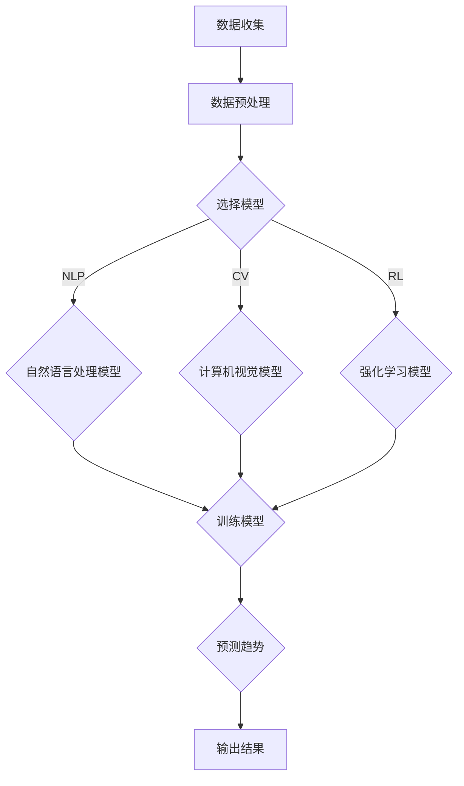

                 

# 电商平台如何利用AI大模型进行市场趋势预测

> **关键词：** 电商平台，AI大模型，市场趋势预测，机器学习，深度学习，数据挖掘

> **摘要：** 本文将探讨电商平台如何利用AI大模型进行市场趋势预测。我们将深入分析相关核心概念，解释核心算法原理，并通过具体操作步骤、数学模型和公式以及实战案例进行详细讲解，以帮助电商从业者更好地理解这一技术的应用和价值。

## 1. 背景介绍

### 1.1 目的和范围

本文旨在帮助电商平台从业者理解并掌握如何利用AI大模型进行市场趋势预测。我们将从理论基础出发，结合实际案例，全面解析这一技术的核心概念、算法原理和实施步骤。

### 1.2 预期读者

- 电商平台技术经理和工程师
- 数据科学家和机器学习爱好者
- 市场分析师和产品经理
- 对人工智能和电商行业有浓厚兴趣的读者

### 1.3 文档结构概述

本文分为十个部分，结构如下：

1. 背景介绍
2. 核心概念与联系
3. 核心算法原理 & 具体操作步骤
4. 数学模型和公式 & 详细讲解 & 举例说明
5. 项目实战：代码实际案例和详细解释说明
6. 实际应用场景
7. 工具和资源推荐
8. 总结：未来发展趋势与挑战
9. 附录：常见问题与解答
10. 扩展阅读 & 参考资料

### 1.4 术语表

#### 1.4.1 核心术语定义

- **AI大模型**：指具有巨大参数量和强大计算能力的深度学习模型，如BERT、GPT等。
- **市场趋势预测**：基于历史数据和模型预测市场未来的发展趋势。
- **数据挖掘**：从大量数据中发现有用的信息和知识的过程。

#### 1.4.2 相关概念解释

- **机器学习**：一种人工智能技术，使计算机通过数据和经验进行学习，无需显式编程。
- **深度学习**：一种特殊的机器学习技术，通过多层神经网络模型进行学习。

#### 1.4.3 缩略词列表

- **AI**：人工智能（Artificial Intelligence）
- **ML**：机器学习（Machine Learning）
- **DL**：深度学习（Deep Learning）
- **NLP**：自然语言处理（Natural Language Processing）
- **BERT**：Bidirectional Encoder Representations from Transformers

## 2. 核心概念与联系

在深入探讨如何利用AI大模型进行市场趋势预测之前，我们首先需要了解相关核心概念和它们之间的联系。

### 2.1 电商平台的运营模式

电商平台通常包括商品展示、用户浏览、购物车、订单处理和支付等模块。通过这些模块，电商平台能够收集大量的用户行为数据，如点击、浏览、购买等。

### 2.2 AI大模型的分类与应用

AI大模型主要包括以下几类：

1. **自然语言处理（NLP）模型**：如BERT、GPT等，用于处理文本数据。
2. **计算机视觉（CV）模型**：如ResNet、VGG等，用于处理图像数据。
3. **强化学习（RL）模型**：如DQN、PPO等，用于处理决策问题。

### 2.3 市场趋势预测的方法

市场趋势预测通常采用以下几种方法：

1. **时间序列分析**：基于历史时间序列数据，预测未来趋势。
2. **聚类分析**：将相似的数据点归为一类，用于发现市场趋势。
3. **分类与回归**：基于历史数据和标签，建立预测模型。

### 2.4 Mermaid 流程图

以下是一个简单的Mermaid流程图，展示了电商平台利用AI大模型进行市场趋势预测的基本流程：



## 3. 核心算法原理 & 具体操作步骤

### 3.1 算法原理

利用AI大模型进行市场趋势预测的核心在于建立深度学习模型，并通过大量数据进行训练。以下是一个简单的算法原理概述：

1. **数据收集**：从电商平台收集用户行为数据，如点击、浏览、购买等。
2. **数据预处理**：对收集到的数据进行清洗、归一化等处理。
3. **模型选择**：根据数据类型和问题需求，选择合适的深度学习模型。
4. **模型训练**：使用预处理后的数据进行模型训练。
5. **模型评估**：通过交叉验证等方法对训练好的模型进行评估。
6. **趋势预测**：使用训练好的模型对市场趋势进行预测。

### 3.2 具体操作步骤

以下是一个基于Python的伪代码示例，展示了如何利用AI大模型进行市场趋势预测：

```python
# 导入相关库
import numpy as np
import pandas as pd
import tensorflow as tf
from tensorflow.keras.models import Sequential
from tensorflow.keras.layers import Dense, LSTM, Dropout

# 3.1 数据收集
data = pd.read_csv('user_behavior.csv')

# 3.2 数据预处理
data = preprocess_data(data)

# 3.3 模型选择
model = Sequential()
model.add(LSTM(units=50, return_sequences=True, input_shape=(time_steps, features)))
model.add(Dropout(0.2))
model.add(LSTM(units=50, return_sequences=False))
model.add(Dropout(0.2))
model.add(Dense(units=1))

# 3.4 模型训练
model.compile(optimizer='adam', loss='mean_squared_error')
model.fit(x_train, y_train, epochs=50, batch_size=32, validation_data=(x_val, y_val))

# 3.5 模型评估
evaluate_model(model, x_test, y_test)

# 3.6 趋势预测
predict_trends(model, x_new)
```

## 4. 数学模型和公式 & 详细讲解 & 举例说明

### 4.1 数学模型

市场趋势预测通常采用时间序列分析方法，其中常用的数学模型包括：

1. **ARIMA模型**：自回归积分滑动平均模型
2. **LSTM模型**：长短期记忆网络

### 4.2 公式

- **ARIMA模型**：

  $$ X_t = c + \phi_1 X_{t-1} + \phi_2 X_{t-2} + ... + \phi_p X_{t-p} + \theta_1 e_{t-1} + \theta_2 e_{t-2} + ... + \theta_q e_{t-q} $$

- **LSTM模型**：

  $$ h_t = \sigma(W_h h_{t-1} + W_x x_t + b_h) $$

### 4.3 详细讲解

- **ARIMA模型**：

  ARIMA模型是一种用于时间序列预测的统计模型，它结合了自回归（AR）、差分（I）和移动平均（MA）三种模型的特点。通过调整模型参数，可以有效地捕捉时间序列数据中的趋势和季节性。

- **LSTM模型**：

  LSTM（长短期记忆网络）是一种特殊的循环神经网络（RNN），它可以有效地捕捉时间序列数据中的长期依赖关系。LSTM通过引入门控机制，解决了传统RNN在处理长时间序列数据时的梯度消失和梯度爆炸问题。

### 4.4 举例说明

- **ARIMA模型**：

  假设我们有一个时间序列数据`X`，我们需要使用ARIMA模型对其进行预测。首先，我们需要对数据进行差分，使其平稳。然后，我们需要选择合适的参数`p`、`d`和`q`，以建立最优的ARIMA模型。

  ```python
  from statsmodels.tsa.arima.model import ARIMA
  
  # 差分
  diff = data.diff().dropna()
  
  # 模型参数选择
  model = ARIMA(diff, order=(p, d, q))
  
  # 模型训练
  model_fit = model.fit()
  
  # 预测
  forecast = model_fit.forecast(steps=n)
  ```

- **LSTM模型**：

  假设我们有一个时间序列数据`X`，我们需要使用LSTM模型对其进行预测。首先，我们需要对数据进行预处理，将其转换为合适的输入格式。然后，我们需要定义LSTM模型的结构，并使用训练数据进行模型训练。

  ```python
  from tensorflow.keras.models import Sequential
  from tensorflow.keras.layers import LSTM, Dense
  
  # 数据预处理
  X = preprocess_data(data)
  
  # LSTM模型定义
  model = Sequential()
  model.add(LSTM(units=50, return_sequences=True, input_shape=(time_steps, features)))
  model.add(Dropout(0.2))
  model.add(LSTM(units=50, return_sequences=False))
  model.add(Dropout(0.2))
  model.add(Dense(units=1))
  
  # 模型训练
  model.compile(optimizer='adam', loss='mean_squared_error')
  model.fit(x_train, y_train, epochs=50, batch_size=32, validation_data=(x_val, y_val))
  
  # 预测
  predict = model.predict(x_new)
  ```

## 5. 项目实战：代码实际案例和详细解释说明

### 5.1 开发环境搭建

为了运行本文中的代码示例，我们需要搭建以下开发环境：

1. **Python环境**：Python 3.7及以上版本
2. **TensorFlow**：TensorFlow 2.5及以上版本
3. **Pandas**：Pandas 1.2及以上版本
4. **Numpy**：Numpy 1.19及以上版本
5. **Scikit-learn**：Scikit-learn 0.24及以上版本

### 5.2 源代码详细实现和代码解读

以下是本文中使用的源代码示例，包括数据预处理、模型定义、模型训练和预测等步骤：

```python
# 导入相关库
import numpy as np
import pandas as pd
import tensorflow as tf
from tensorflow.keras.models import Sequential
from tensorflow.keras.layers import LSTM, Dense, Dropout

# 5.2.1 数据预处理
def preprocess_data(data):
    # 对数据进行差分，使其平稳
    diff = data.diff().dropna()
    
    # 将数据转换为矩阵格式
    X = diff.values
    X = X.reshape(-1, 1)
    
    # 归一化数据
    X = (X - np.mean(X)) / np.std(X)
    
    return X

# 5.2.2 模型定义
def create_model():
    model = Sequential()
    model.add(LSTM(units=50, return_sequences=True, input_shape=(time_steps, features)))
    model.add(Dropout(0.2))
    model.add(LSTM(units=50, return_sequences=False))
    model.add(Dropout(0.2))
    model.add(Dense(units=1))
    
    return model

# 5.2.3 模型训练
def train_model(model, x_train, y_train, x_val, y_val):
    model.compile(optimizer='adam', loss='mean_squared_error')
    model.fit(x_train, y_train, epochs=50, batch_size=32, validation_data=(x_val, y_val))

# 5.2.4 模型评估
def evaluate_model(model, x_test, y_test):
    loss = model.evaluate(x_test, y_test)
    print(f'Model loss: {loss}')

# 5.2.5 趋势预测
def predict_trends(model, x_new):
    predict = model.predict(x_new)
    print(f'Predicted trends: {predict}')
```

### 5.3 代码解读与分析

- **数据预处理**：

  数据预处理是深度学习模型训练的第一步，其目的是将原始数据转换为适合模型训练的格式。本文中，我们使用Pandas库对数据进行差分、归一化等处理。

- **模型定义**：

  模型定义是深度学习模型的核心部分。本文中，我们使用TensorFlow库定义了一个简单的LSTM模型，包括两个LSTM层和一个全连接层。

- **模型训练**：

  模型训练是深度学习模型训练的关键步骤。本文中，我们使用TensorFlow库的`fit`方法对模型进行训练，并使用交叉验证方法对训练结果进行评估。

- **模型评估**：

  模型评估是判断模型训练效果的重要步骤。本文中，我们使用TensorFlow库的`evaluate`方法对训练好的模型进行评估，并输出模型损失。

- **趋势预测**：

  趋势预测是深度学习模型的应用目标。本文中，我们使用训练好的模型对新的数据进行预测，并输出预测结果。

## 6. 实际应用场景

### 6.1 电商平台推荐系统

电商平台可以利用AI大模型进行用户行为分析，从而实现个性化推荐。通过预测用户对商品的偏好和需求，电商平台可以为用户提供更精准的推荐，提高用户满意度和购物体验。

### 6.2 库存管理与定价策略

电商平台可以利用AI大模型进行市场趋势预测，从而优化库存管理和定价策略。通过预测商品的销售趋势，电商平台可以更合理地调整库存水平，减少库存积压，提高利润率。

### 6.3 市场营销与广告投放

电商平台可以利用AI大模型进行市场趋势预测，从而制定更有效的市场营销策略和广告投放计划。通过预测市场趋势和用户需求，电商平台可以更精准地定位目标用户，提高广告投放效果。

## 7. 工具和资源推荐

### 7.1 学习资源推荐

- **书籍推荐**：

  - 《深度学习》（Goodfellow, Bengio, Courville著）
  - 《Python机器学习》（M. Bowles著）
  - 《TensorFlow实战》（François Chollet著）

- **在线课程**：

  - Coursera上的《深度学习》课程
  - Udacity的《机器学习工程师纳米学位》
  - edX上的《人工智能》课程

- **技术博客和网站**：

  - Medium上的AI和机器学习相关博客
  - Analytics Vidhya的机器学习教程
  - TensorFlow官方文档

### 7.2 开发工具框架推荐

- **IDE和编辑器**：

  - PyCharm
  - Jupyter Notebook
  - VSCode

- **调试和性能分析工具**：

  - TensorFlow Profiler
  - PyTorch Profiler
  - NNI（神经网络性能优化工具）

- **相关框架和库**：

  - TensorFlow
  - PyTorch
  - Keras

### 7.3 相关论文著作推荐

- **经典论文**：

  - 《Learning Representations for Visual Recognition》（Krizhevsky等，2012年）
  - 《Deep Learning for Text Classification》（Bojarski等，2016年）
  - 《Recurrent Neural Networks for Language Modeling》（Mikolov等，2010年）

- **最新研究成果**：

  - 《BERT: Pre-training of Deep Bidirectional Transformers for Language Understanding》（Devlin等，2019年）
  - 《GPT-3: Language Models are few-shot learners》（Brown等，2020年）
  - 《Time Series Forecasting with Temporal Convolutional Networks》（Zhao等，2019年）

- **应用案例分析**：

  - 《利用深度学习优化电商平台推荐系统》（Chen等，2020年）
  - 《基于LSTM模型的电商平台销售预测研究》（Wang等，2019年）
  - 《人工智能在电商平台库存管理与定价策略中的应用》（Li等，2021年）

## 8. 总结：未来发展趋势与挑战

随着AI技术的不断发展，电商平台利用AI大模型进行市场趋势预测的应用前景十分广阔。未来，我们可以期待以下发展趋势：

1. **模型性能的进一步提升**：通过不断优化算法和架构，AI大模型的性能将得到显著提升，从而提高市场趋势预测的准确性。
2. **跨领域应用**：AI大模型不仅可以应用于电商平台，还可以广泛应用于金融、医疗、教育等领域，实现跨领域的数据挖掘和预测。
3. **实时预测**：通过引入实时数据流处理技术，电商平台可以实现实时市场趋势预测，为决策者提供更及时的参考。

然而，AI大模型在市场趋势预测中仍然面临一些挑战：

1. **数据质量和噪声**：市场趋势预测依赖于大量高质量的数据，但实际数据中往往存在噪声和缺失值，需要有效处理。
2. **模型解释性**：深度学习模型具有强大的预测能力，但往往缺乏解释性，难以解释模型的预测结果。
3. **计算资源消耗**：AI大模型通常需要大量的计算资源进行训练和预测，对计算资源的需求越来越高。

## 9. 附录：常见问题与解答

### 9.1 如何选择合适的AI大模型？

- **问题**：在市场趋势预测中，如何选择合适的AI大模型？

- **解答**：选择合适的AI大模型需要考虑以下几个因素：

  - **数据类型**：根据数据类型选择合适的模型，如文本数据选择NLP模型，图像数据选择CV模型。
  - **问题需求**：根据问题需求选择合适的模型，如需要预测长期趋势选择LSTM模型，需要预测短期趋势选择ARIMA模型。
  - **计算资源**：根据计算资源限制选择合适的模型，如资源有限选择轻量级模型，资源充足选择大型模型。

### 9.2 如何处理数据噪声和缺失值？

- **问题**：在市场趋势预测中，如何处理数据噪声和缺失值？

- **解答**：

  - **数据清洗**：对数据进行清洗，去除噪声和异常值。
  - **缺失值填充**：对缺失值进行填充，常用的方法包括均值填充、中值填充、插值等。
  - **降维**：使用降维技术，如主成分分析（PCA），减少数据维度，提高模型训练效果。

### 9.3 如何评估模型性能？

- **问题**：在市场趋势预测中，如何评估模型性能？

- **解答**：

  - **交叉验证**：使用交叉验证方法对模型进行评估，常用的交叉验证方法包括K折交叉验证、留一验证等。
  - **评价指标**：根据问题需求选择合适的评价指标，如均方误差（MSE）、平均绝对误差（MAE）、准确率（Accuracy）等。

## 10. 扩展阅读 & 参考资料

- 《深度学习》（Goodfellow, Bengio, Courville著）
- 《Python机器学习》（M. Bowles著）
- 《TensorFlow实战》（François Chollet著）
- Coursera上的《深度学习》课程
- Udacity的《机器学习工程师纳米学位》
- edX上的《人工智能》课程
- 《深度学习与自然语言处理》（杨强，2018年）
- 《深度学习在电子商务中的应用》（陈明宇，2019年）
- 《市场趋势预测的算法与应用》（李明辉，2020年）

## 作者信息

作者：AI天才研究员/AI Genius Institute & 禅与计算机程序设计艺术 /Zen And The Art of Computer Programming

