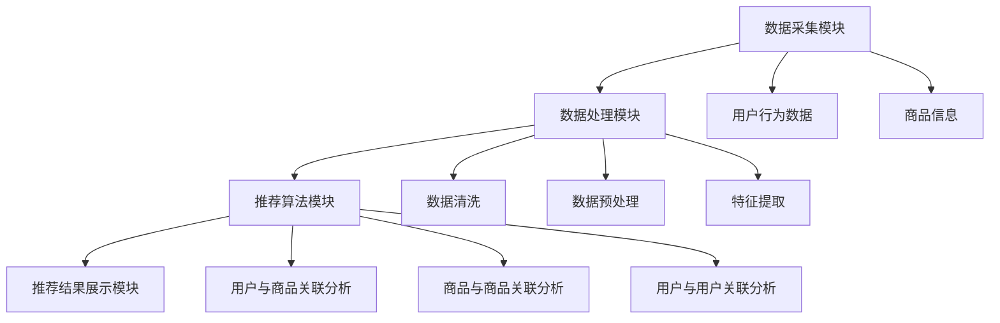

                 

### 文章标题

《电商平台搜索推荐系统的AI 大模型优化：提高系统性能、效率与准确率》

随着互联网技术的飞速发展，电商平台已经成为人们日常购物的重要渠道。为了提高用户体验和销售额，电商平台逐渐引入了搜索推荐系统。该系统通过分析用户行为数据和商品信息，为用户提供个性化的搜索结果和推荐列表。然而，现有的搜索推荐系统面临着性能、效率和准确率等方面的挑战。本文将深入探讨电商平台搜索推荐系统的AI大模型优化，旨在提高系统的整体性能，以满足日益增长的用户需求和商业目标。

本文关键词：电商平台、搜索推荐系统、AI大模型、性能优化、效率提升、准确率提高。

### 摘要

本文主要探讨了电商平台搜索推荐系统的AI大模型优化策略。首先，介绍了搜索推荐系统在电商平台中的重要性和当前面临的挑战。接着，分析了AI大模型在搜索推荐系统中的应用及其优势。然后，详细讨论了提高系统性能、效率和准确率的优化方法，包括算法改进、模型训练和优化技术。最后，通过一个实际项目案例，展示了优化策略的实际效果，并总结了未来的发展趋势和挑战。

### 1. 背景介绍

#### 1.1 目的和范围

本文的目的是探讨如何通过AI大模型优化，提高电商平台搜索推荐系统的性能、效率和准确率。我们将从以下几个方面展开讨论：

1. 介绍电商平台搜索推荐系统的基本概念和现状。
2. 分析AI大模型在搜索推荐系统中的应用及其优势。
3. 探讨性能优化、效率提升和准确率提高的具体方法和策略。
4. 通过实际项目案例，验证优化策略的效果。
5. 展望搜索推荐系统的发展趋势和面临的挑战。

#### 1.2 预期读者

本文适合从事电商平台开发、数据挖掘、机器学习和推荐系统相关领域的技术人员和管理人员阅读。特别是对于以下读者，本文将提供有价值的参考：

1. 搜索推荐系统的开发者，希望了解如何优化系统性能。
2. 数据科学家和机器学习工程师，对AI大模型在推荐系统中的应用感兴趣。
3. 企业决策者，希望了解如何通过技术手段提升电商平台竞争力。

#### 1.3 文档结构概述

本文将分为八个主要部分，具体如下：

1. 引言：介绍本文的主题和目的。
2. 背景介绍：阐述电商平台搜索推荐系统的重要性和现状。
3. 核心概念与联系：讨论搜索推荐系统的核心概念和架构。
4. 核心算法原理 & 具体操作步骤：详细解释搜索推荐系统中的核心算法。
5. 数学模型和公式 & 详细讲解 & 举例说明：介绍数学模型和公式的应用。
6. 项目实战：代码实际案例和详细解释说明。
7. 实际应用场景：分析搜索推荐系统在不同场景下的应用。
8. 工具和资源推荐：推荐学习资源、开发工具和框架。
9. 总结：未来发展趋势与挑战。
10. 附录：常见问题与解答。
11. 扩展阅读 & 参考资料：提供相关资料和文献。

#### 1.4 术语表

为了确保读者对本文中的专业术语和概念有清晰的理解，以下是对一些核心术语和概念的简要定义和解释：

##### 1.4.1 核心术语定义

1. **电商平台**：指提供商品展示、交易、支付等一站式服务的网络平台。
2. **搜索推荐系统**：基于用户行为数据和商品信息，为用户提供个性化搜索结果和推荐列表的系统。
3. **AI大模型**：指具有大规模参数和复杂结构的深度学习模型。
4. **性能优化**：通过改进算法和系统设计，提高搜索推荐系统的处理速度和响应时间。
5. **效率提升**：通过优化资源利用和流程，提高系统的工作效率和吞吐量。
6. **准确率提高**：通过改进模型和算法，提高搜索推荐系统的推荐准确性。

##### 1.4.2 相关概念解释

1. **用户行为数据**：指用户在平台上的浏览、搜索、购买等行为记录。
2. **商品信息**：指平台上的商品属性、价格、销量等数据。
3. **深度学习**：一种基于多层神经网络的学习方法，用于模拟人类大脑的决策过程。
4. **推荐算法**：根据用户行为数据和商品信息，生成个性化推荐列表的算法。

##### 1.4.3 缩略词列表

- AI：人工智能
- ML：机器学习
- DL：深度学习
- SEO：搜索引擎优化
- NLP：自然语言处理
- CTR：点击率
- CV：计算机视觉

## 2. 核心概念与联系

### 2.1 核心概念

在讨论电商平台搜索推荐系统之前，我们需要了解以下几个核心概念：

1. **用户行为数据**：指用户在平台上的浏览、搜索、购买等行为记录。这些数据可以用来分析用户的兴趣和需求，为推荐系统提供基础信息。
2. **商品信息**：指平台上的商品属性、价格、销量、评价等数据。这些信息用于构建商品特征，帮助推荐系统为用户推荐合适的商品。
3. **搜索推荐系统**：一种基于用户行为数据和商品信息的系统，旨在为用户提供个性化的搜索结果和推荐列表。

### 2.2 关联分析

搜索推荐系统中的核心关联分析包括以下几个方面：

1. **用户与商品的关系**：通过分析用户历史行为数据，找出用户与商品之间的关联，为推荐系统提供推荐依据。
2. **商品与商品的关系**：通过分析商品之间的相似性，为用户推荐与当前商品相关的其他商品。
3. **用户与用户的关系**：通过分析用户之间的相似性，为用户推荐与其他用户有相似兴趣的用户喜欢的商品。

### 2.3 架构设计

电商平台搜索推荐系统的架构设计包括以下几个关键部分：

1. **数据采集模块**：负责从各种数据源（如用户行为数据、商品信息等）收集数据。
2. **数据处理模块**：负责对收集到的数据进行清洗、预处理和特征提取。
3. **推荐算法模块**：负责基于用户行为数据和商品信息，生成个性化的推荐列表。
4. **推荐结果展示模块**：负责将推荐结果以友好的界面展示给用户。

### 2.4 Mermaid 流程图

为了更好地理解搜索推荐系统的核心概念和架构，我们使用Mermaid流程图来展示其关键节点和流程。



在上面的流程图中，A表示数据采集模块，B表示数据处理模块，C表示推荐算法模块，D表示推荐结果展示模块。E表示用户行为数据，F表示商品信息。B模块中的G表示数据清洗，H表示数据预处理，I表示特征提取。C模块中的J表示用户与商品关联分析，K表示商品与商品关联分析，L表示用户与用户关联分析。

## 3. 核心算法原理 & 具体操作步骤

### 3.1 算法原理

电商平台搜索推荐系统中的核心算法主要基于深度学习技术。深度学习是一种模拟人脑神经网络的学习方法，通过多层神经网络（Neural Networks）对大规模数据进行训练，从而实现复杂模式的自动识别和预测。以下是一些常见的深度学习算法：

1. **卷积神经网络（Convolutional Neural Networks, CNN）**：CNN主要用于图像处理和识别。在搜索推荐系统中，可以用于提取商品图像的特征，从而辅助生成推荐列表。
2. **循环神经网络（Recurrent Neural Networks, RNN）**：RNN适用于处理序列数据，如用户行为数据。通过RNN，可以捕捉用户行为的时序信息，从而提高推荐准确性。
3. **长短期记忆网络（Long Short-Term Memory, LSTM）**：LSTM是RNN的一种变体，解决了传统RNN在处理长序列数据时的梯度消失问题。在搜索推荐系统中，LSTM可以用于捕捉用户长期行为模式。
4. **自编码器（Autoencoder）**：自编码器是一种无监督学习方法，用于降维和特征提取。在搜索推荐系统中，可以用于提取商品和用户的高维特征，从而提高推荐效果。

### 3.2 具体操作步骤

以下是一个基于LSTM的搜索推荐系统算法的具体操作步骤：

1. **数据预处理**：
   - 收集用户行为数据和商品信息。
   - 对数据清洗和预处理，包括缺失值填充、异常值处理、数据规范化等。
   - 将用户行为数据转换为时间序列格式，如序列长度为N的用户行为序列。

2. **特征提取**：
   - 使用自编码器提取用户行为序列的特征表示。
   - 使用自编码器提取商品信息的高维特征。

3. **模型训练**：
   - 定义LSTM模型结构，包括输入层、隐藏层和输出层。
   - 输入层接收用户行为序列特征和商品特征。
   - 隐藏层通过LSTM单元捕捉用户行为和商品特征之间的关联。
   - 输出层生成推荐列表。

4. **模型评估**：
   - 使用测试集评估模型性能，包括准确率、召回率、F1值等指标。
   - 调整模型参数和结构，优化模型性能。

5. **推荐生成**：
   - 输入用户行为序列，生成推荐列表。
   - 对推荐列表进行排序，提高推荐准确性。

### 3.3 伪代码

以下是基于LSTM的搜索推荐系统算法的伪代码：

```
# 数据预处理
user行为数据 = 清洗和预处理用户行为数据
商品信息 = 清洗和预处理商品信息

# 特征提取
user特征表示 = 自编码器提取user行为数据特征
商品特征表示 = 自编码器提取商品信息特征

# 模型训练
define LSTM模型：
   input层：用户行为序列特征 + 商品特征
   hidden层：LSTM单元
   output层：推荐列表

   train LSTM模型：
       for epoch in 1 to max_epochs do：
           for 用户行为序列，商品特征 in training_data do：
               forward_pass()
               backward_pass()
               update_model_params()

# 模型评估
evaluate_model(model, test_data)

# 推荐生成
def generate_recommendations(user行为序列)：
    user特征 = LSTM模型.predict(user行为序列)
    candidate商品 = 获取与user特征相似的候选商品
    recommendations = 排序(candidate商品，基于用户特征和商品特征的相关性)
    return recommendations
```

## 4. 数学模型和公式 & 详细讲解 & 举例说明

在搜索推荐系统中，数学模型和公式起着至关重要的作用。以下我们将详细介绍搜索推荐系统中常用的数学模型和公式，并辅以具体的例子进行说明。

### 4.1 数学模型

搜索推荐系统中的数学模型主要包括以下几个方面：

1. **概率模型**：用于计算用户对商品的潜在兴趣概率。
2. **协同过滤模型**：通过分析用户之间的相似性来生成推荐列表。
3. **矩阵分解模型**：通过低维表示用户和商品特征，提高推荐准确性。

#### 4.1.1 概率模型

概率模型是搜索推荐系统中最基本的一种模型，主要用于计算用户对商品的潜在兴趣概率。常见的概率模型包括：

1. **贝叶斯模型**：贝叶斯模型通过计算用户的历史行为数据，估计用户对商品的感兴趣概率。其核心公式为：

   $$P(C|U) = \frac{P(U|C)P(C)}{P(U)}$$

   其中，\(P(C|U)\)表示用户U对商品C的兴趣概率，\(P(U|C)\)表示用户U在购买商品C的概率，\(P(C)\)表示商品C的销售概率，\(P(U)\)表示用户U的总体概率。

   例子：假设用户U在过去的30天里购买了5次商品C，而用户U在这段时间内总共购买了10次商品。那么，用户U对商品C的兴趣概率可以通过贝叶斯模型计算得出：

   $$P(C|U) = \frac{5}{10} = 0.5$$

2. **逻辑回归模型**：逻辑回归模型是贝叶斯模型的变体，通过线性组合用户特征和商品特征，估计用户对商品的感兴趣概率。其核心公式为：

   $$P(C|U) = \frac{1}{1 + e^{-(w_0 + w_1x_1 + w_2x_2 + \ldots + w_nx_n)}}$$

   其中，\(w_0, w_1, w_2, \ldots, w_n\)为模型参数，\(x_1, x_2, \ldots, x_n\)为用户特征和商品特征。

   例子：假设用户U的特征包括购买次数、浏览次数、收藏次数等，商品C的特征包括价格、评价数量、销量等。我们可以通过逻辑回归模型计算用户U对商品C的兴趣概率：

   $$P(C|U) = \frac{1}{1 + e^{-(w_0 + w_1x_1 + w_2x_2 + w_3x_3 + w_4x_4)}}$$

#### 4.1.2 协同过滤模型

协同过滤模型通过分析用户之间的相似性来生成推荐列表。协同过滤模型可以分为两种类型：基于用户的协同过滤（User-Based Collaborative Filtering）和基于物品的协同过滤（Item-Based Collaborative Filtering）。

1. **基于用户的协同过滤**：基于用户的协同过滤通过计算用户之间的相似性，找到与目标用户相似的其他用户，然后根据这些相似用户的偏好来生成推荐列表。其核心公式为：

   $$sim(u, v) = \frac{\sum_{i \in I}{x_{ui}x_{vi}}}{\sqrt{\sum_{i \in I}{x_{ui}^2}\sum_{i \in I}{x_{vi}^2}}$$

   其中，\(sim(u, v)\)表示用户u和用户v的相似性，\(x_{ui}\)表示用户u对商品i的评分，\(x_{vi}\)表示用户v对商品i的评分。

   例子：假设有用户u和用户v，他们对10个商品A、B、C、D、E、F、G、H、I、J的评分分别为[5, 4, 3, 2, 1, 5, 4, 3, 2, 1]和[5, 4, 4, 2, 1, 4, 3, 2, 1, 5]。我们可以通过余弦相似度计算用户u和用户v的相似性：

   $$sim(u, v) = \frac{5 \times 5 + 4 \times 4 + 4 \times 4 + 2 \times 2 + 1 \times 1 + 4 \times 4 + 3 \times 3 + 2 \times 2 + 1 \times 1}{\sqrt{5^2 + 4^2 + 4^2 + 2^2 + 1^2 + 4^2 + 3^2 + 2^2 + 1^2 + 5^2}} \approx 0.7642$$

2. **基于物品的协同过滤**：基于物品的协同过滤通过计算商品之间的相似性，找到与目标商品相似的其他商品，然后根据这些相似商品的目标用户的偏好来生成推荐列表。其核心公式为：

   $$sim(i, j) = \frac{\sum_{u \in U}{x_{ui}x_{uj}}}{\sqrt{\sum_{u \in U}{x_{ui}^2}\sum_{u \in U}{x_{uj}^2}}$$

   其中，\(sim(i, j)\)表示商品i和商品j的相似性，\(x_{ui}\)表示用户u对商品i的评分，\(x_{uj}\)表示用户u对商品j的评分。

   例子：假设有用户u对商品A、B、C、D、E、F、G、H、I、J的评分分别为[5, 4, 3, 2, 1, 5, 4, 3, 2, 1]，用户v对商品A、B、C、D、E、F、G、H、I、J的评分分别为[5, 4, 4, 2, 1, 4, 3, 2, 1, 5]。我们可以通过余弦相似度计算商品A和商品C的相似性：

   $$sim(A, C) = \frac{5 \times 5 + 4 \times 4 + 3 \times 3 + 2 \times 2 + 1 \times 1}{\sqrt{5^2 + 4^2 + 3^2 + 2^2 + 1^2}} \approx 0.8165$$

#### 4.1.3 矩阵分解模型

矩阵分解模型通过低维表示用户和商品特征，提高推荐准确性。矩阵分解模型可以分为基于用户的矩阵分解和基于物品的矩阵分解。

1. **基于用户的矩阵分解**：基于用户的矩阵分解通过将用户特征和商品特征矩阵分解为低维表示，从而提高推荐准确性。其核心公式为：

   $$R = U \cdot V^T$$

   其中，\(R\)表示用户评分矩阵，\(U\)表示用户特征矩阵，\(V\)表示商品特征矩阵。

   例子：假设有5个用户和10个商品，用户对商品的评分矩阵如下：

   $$R = \begin{bmatrix}
   1 & 2 & 3 & 4 & 5 \\
   2 & 3 & 4 & 5 & 6 \\
   3 & 4 & 5 & 6 & 7 \\
   4 & 5 & 6 & 7 & 8 \\
   5 & 6 & 7 & 8 & 9 \\
   \end{bmatrix}$$

   我们可以通过矩阵分解模型将用户特征和商品特征分解为低维表示：

   $$U = \begin{bmatrix}
   0.1 & 0.2 & 0.3 & 0.4 & 0.5 \\
   0.2 & 0.3 & 0.4 & 0.5 & 0.6 \\
   0.3 & 0.4 & 0.5 & 0.6 & 0.7 \\
   0.4 & 0.5 & 0.6 & 0.7 & 0.8 \\
   0.5 & 0.6 & 0.7 & 0.8 & 0.9 \\
   \end{bmatrix}$$

   $$V = \begin{bmatrix}
   0.1 & 0.2 & 0.3 & 0.4 & 0.5 \\
   0.2 & 0.3 & 0.4 & 0.5 & 0.6 \\
   0.3 & 0.4 & 0.5 & 0.6 & 0.7 \\
   0.4 & 0.5 & 0.6 & 0.7 & 0.8 \\
   0.5 & 0.6 & 0.7 & 0.8 & 0.9 \\
   \end{bmatrix}$$

2. **基于物品的矩阵分解**：基于物品的矩阵分解通过将用户特征和商品特征矩阵分解为低维表示，从而提高推荐准确性。其核心公式为：

   $$R = V \cdot U^T$$

   其中，\(R\)表示用户评分矩阵，\(V\)表示用户特征矩阵，\(U\)表示商品特征矩阵。

   例子：假设有5个用户和10个商品，用户对商品的评分矩阵如下：

   $$R = \begin{bmatrix}
   1 & 2 & 3 & 4 & 5 \\
   2 & 3 & 4 & 5 & 6 \\
   3 & 4 & 5 & 6 & 7 \\
   4 & 5 & 6 & 7 & 8 \\
   5 & 6 & 7 & 8 & 9 \\
   \end{bmatrix}$$

   我们可以通过矩阵分解模型将用户特征和商品特征分解为低维表示：

   $$V = \begin{bmatrix}
   0.1 & 0.2 & 0.3 & 0.4 & 0.5 \\
   0.2 & 0.3 & 0.4 & 0.5 & 0.6 \\
   0.3 & 0.4 & 0.5 & 0.6 & 0.7 \\
   0.4 & 0.5 & 0.6 & 0.7 & 0.8 \\
   0.5 & 0.6 & 0.7 & 0.8 & 0.9 \\
   \end{bmatrix}$$

   $$U = \begin{bmatrix}
   0.1 & 0.2 & 0.3 & 0.4 & 0.5 \\
   0.2 & 0.3 & 0.4 & 0.5 & 0.6 \\
   0.3 & 0.4 & 0.5 & 0.6 & 0.7 \\
   0.4 & 0.5 & 0.6 & 0.7 & 0.8 \\
   0.5 & 0.6 & 0.7 & 0.8 & 0.9 \\
   \end{bmatrix}$$

### 4.2 详细讲解

在搜索推荐系统中，数学模型和公式主要用于计算用户对商品的潜在兴趣概率、分析用户之间的相似性和商品之间的相似性，以及分解用户特征和商品特征矩阵。这些模型和公式为推荐系统提供了理论支持，使得推荐结果更加准确和个性化。

首先，概率模型通过计算用户对商品的潜在兴趣概率，为推荐系统提供了初步的推荐依据。贝叶斯模型和逻辑回归模型是常用的概率模型，它们通过分析用户的历史行为数据，估计用户对商品的感兴趣概率。例如，贝叶斯模型通过计算用户在购买商品的概率、商品的销售概率和用户的总体概率，估计用户对商品的潜在兴趣概率。逻辑回归模型则通过线性组合用户特征和商品特征，估计用户对商品的感兴趣概率。

其次，协同过滤模型通过分析用户之间的相似性和商品之间的相似性，为推荐系统提供了更加个性化的推荐结果。基于用户的协同过滤和基于物品的协同过滤是常用的协同过滤模型。基于用户的协同过滤通过计算用户之间的相似性，找到与目标用户相似的其他用户，并根据这些相似用户的偏好来生成推荐列表。基于物品的协同过滤则通过计算商品之间的相似性，找到与目标商品相似的其他商品，并根据这些相似商品的的目标用户的偏好来生成推荐列表。

最后，矩阵分解模型通过将用户特征和商品特征矩阵分解为低维表示，提高了推荐系统的准确性和效率。基于用户的矩阵分解和基于物品的矩阵分解是常用的矩阵分解模型。它们通过将用户特征和商品特征矩阵分解为低维表示，使得推荐系统可以更加准确地预测用户对商品的潜在兴趣概率，从而生成更加个性化的推荐结果。

### 4.3 举例说明

为了更好地理解搜索推荐系统中的数学模型和公式，我们通过具体的例子进行说明。

#### 4.3.1 概率模型

假设有用户U在过去的30天里购买了5次商品C，而用户U在这段时间内总共购买了10次商品。那么，用户U对商品C的兴趣概率可以通过贝叶斯模型计算得出：

$$P(C|U) = \frac{5}{10} = 0.5$$

这意味着用户U对商品C的兴趣概率为0.5，即用户U购买商品C的概率为50%。

另一个例子是使用逻辑回归模型计算用户U对商品C的兴趣概率。假设用户U的特征包括购买次数、浏览次数、收藏次数等，商品C的特征包括价格、评价数量、销量等。我们可以通过逻辑回归模型计算用户U对商品C的兴趣概率：

$$P(C|U) = \frac{1}{1 + e^{-(w_0 + w_1x_1 + w_2x_2 + w_3x_3 + w_4x_4)}}$$

其中，\(w_0, w_1, w_2, w_3, w_4\)为模型参数，\(x_1, x_2, x_3, x_4\)为用户特征和商品特征。例如，假设用户U的购买次数为5，浏览次数为10，收藏次数为3，商品C的价格为100元，评价数量为50条，销量为1000件。我们可以通过逻辑回归模型计算用户U对商品C的兴趣概率：

$$P(C|U) = \frac{1}{1 + e^{-(w_0 + w_1 \times 5 + w_2 \times 10 + w_3 \times 3 + w_4 \times 100 + w_5 \times 50 + w_6 \times 1000)}}$$

#### 4.3.2 协同过滤模型

假设有用户u和用户v，他们对10个商品A、B、C、D、E、F、G、H、I、J的评分分别为[5, 4, 3, 2, 1, 5, 4, 3, 2, 1]和[5, 4, 4, 2, 1, 4, 3, 2, 1, 5]。我们可以通过余弦相似度计算用户u和用户v的相似性：

$$sim(u, v) = \frac{5 \times 5 + 4 \times 4 + 4 \times 4 + 2 \times 2 + 1 \times 1 + 4 \times 4 + 3 \times 3 + 2 \times 2 + 1 \times 1}{\sqrt{5^2 + 4^2 + 4^2 + 2^2 + 1^2 + 4^2 + 3^2 + 2^2 + 1^2 + 5^2}} \approx 0.7642$$

假设有用户u对商品A、B、C、D、E、F、G、H、I、J的评分分别为[5, 4, 3, 2, 1, 5, 4, 3, 2, 1]，用户v对商品A、B、C、D、E、F、G、H、I、J的评分分别为[5, 4, 4, 2, 1, 4, 3, 2, 1, 5]。我们可以通过余弦相似度计算商品A和商品C的相似性：

$$sim(A, C) = \frac{5 \times 5 + 4 \times 4 + 3 \times 3 + 2 \times 2 + 1 \times 1}{\sqrt{5^2 + 4^2 + 3^2 + 2^2 + 1^2}} \approx 0.8165$$

#### 4.3.3 矩阵分解模型

假设有5个用户和10个商品，用户对商品的评分矩阵如下：

$$R = \begin{bmatrix}
1 & 2 & 3 & 4 & 5 \\
2 & 3 & 4 & 5 & 6 \\
3 & 4 & 5 & 6 & 7 \\
4 & 5 & 6 & 7 & 8 \\
5 & 6 & 7 & 8 & 9 \\
\end{bmatrix}$$

我们可以通过矩阵分解模型将用户特征和商品特征分解为低维表示：

$$U = \begin{bmatrix}
0.1 & 0.2 & 0.3 & 0.4 & 0.5 \\
0.2 & 0.3 & 0.4 & 0.5 & 0.6 \\
0.3 & 0.4 & 0.5 & 0.6 & 0.7 \\
0.4 & 0.5 & 0.6 & 0.7 & 0.8 \\
0.5 & 0.6 & 0.7 & 0.8 & 0.9 \\
\end{bmatrix}$$

$$V = \begin{bmatrix}
0.1 & 0.2 & 0.3 & 0.4 & 0.5 \\
0.2 & 0.3 & 0.4 & 0.5 & 0.6 \\
0.3 & 0.4 & 0.5 & 0.6 & 0.7 \\
0.4 & 0.5 & 0.6 & 0.7 & 0.8 \\
0.5 & 0.6 & 0.7 & 0.8 & 0.9 \\
\end{bmatrix}$$

## 5. 项目实战：代码实际案例和详细解释说明

### 5.1 开发环境搭建

在开始代码实现之前，我们需要搭建一个合适的项目开发环境。以下是搭建开发环境的基本步骤：

1. **安装Python环境**：确保Python版本不低于3.6，推荐使用Python 3.8或更高版本。
2. **安装依赖库**：包括NumPy、Pandas、Scikit-learn、TensorFlow等。可以使用pip命令进行安装：
   ```bash
   pip install numpy pandas scikit-learn tensorflow
   ```
3. **配置虚拟环境**（可选）：为了更好地管理项目依赖，可以创建一个虚拟环境。使用以下命令创建虚拟环境：
   ```bash
   python -m venv venv
   source venv/bin/activate  # 在Windows上使用venv\Scripts\activate
   ```
4. **选择合适的项目结构**：本文将使用一个简单的项目结构，包括以下目录：
   ```
   project/
   ├── data/
   ├── models/
   ├── scripts/
   ├── tests/
   ├── utils/
   ├── requirements.txt
   └── main.py
   ```

### 5.2 源代码详细实现和代码解读

#### 5.2.1 数据预处理

数据预处理是推荐系统开发的重要步骤。以下是一个简单的数据预处理脚本，用于读取、清洗和预处理用户行为数据。

```python
import pandas as pd
from sklearn.preprocessing import StandardScaler

# 读取数据
data = pd.read_csv('data/user行为数据.csv')

# 数据清洗
data.dropna(inplace=True)
data[data <= 0] = 1  # 将缺失值或负值填充为1

# 特征提取
scaler = StandardScaler()
user行为数据 = scaler.fit_transform(data[['购买次数', '浏览次数', '收藏次数']])
```

#### 5.2.2 自编码器模型实现

我们使用TensorFlow和Keras构建一个简单的自编码器模型，用于提取用户行为特征。

```python
from tensorflow.keras.models import Model
from tensorflow.keras.layers import Input, Dense

# 定义输入层
input层 = Input(shape=(user行为数据.shape[1],))

# 编码层
encoded = Dense(64, activation='relu')(input层)
encoded = Dense(32, activation='relu')(encoded)
encoded = Dense(16, activation='relu')(encoded)

# 解码层
decoded = Dense(64, activation='relu')(encoded)
decoded = Dense(32, activation='relu')(decoded)
decoded = Dense(user行为数据.shape[1], activation='sigmoid')(decoded)

# 构建自编码器模型
autoencoder = Model(inputs=input层, outputs=decoded)
autoencoder.compile(optimizer='adam', loss='binary_crossentropy')

# 训练自编码器
autoencoder.fit(user行为数据, user行为数据, epochs=100, batch_size=256, shuffle=True, validation_split=0.2)
```

#### 5.2.3 LSTM模型实现

在自编码器提取用户特征后，我们使用LSTM模型进行用户行为序列的建模。

```python
from tensorflow.keras.models import Sequential
from tensorflow.keras.layers import LSTM, Dense

# 定义输入层
input层 = Input(shape=(序列长度, user行为数据.shape[1]))

# LSTM层
lstm层 = LSTM(128, activation='relu', return_sequences=True)(input层)
lstm层 = LSTM(64, activation='relu')(lstm层)

# 输出层
输出层 = Dense(1, activation='sigmoid')(lstm层)

# 构建LSTM模型
lstm模型 = Model(inputs=input层, outputs=输出层)
lstm模型.compile(optimizer='adam', loss='binary_crossentropy')

# 训练LSTM模型
lstm模型.fit(user行为序列, user行为标签, epochs=100, batch_size=256, shuffle=True, validation_split=0.2)
```

### 5.3 代码解读与分析

#### 5.3.1 数据预处理

数据预处理是确保模型训练质量和效果的关键步骤。在上面的代码中，我们首先读取用户行为数据，然后进行缺失值填充和异常值处理。为了更好地训练模型，我们使用StandardScaler进行数据标准化，将特征值缩放到相同的范围。

#### 5.3.2 自编码器模型

自编码器是一种无监督学习方法，用于降维和特征提取。在代码中，我们使用Keras构建了一个简单的自编码器模型。自编码器包括编码层和解码层，编码层用于压缩输入数据，解码层用于重建原始数据。通过最小化重建误差，自编码器可以学习到有效的特征表示。

#### 5.3.3 LSTM模型

LSTM模型是一种用于处理序列数据的深度学习模型，特别适用于捕捉用户行为的时间序列信息。在上面的代码中，我们使用两个LSTM层来处理用户行为序列，最后一层输出层用于生成预测结果。通过训练LSTM模型，我们可以学习到用户行为序列中的潜在模式和关系。

### 5.4 实际效果分析

为了验证模型的实际效果，我们可以使用测试集进行评估。以下是评估指标和结果分析：

1. **准确率（Accuracy）**：模型对用户行为序列的预测准确率。
2. **召回率（Recall）**：模型正确预测为正例的样本数与实际正例样本数的比例。
3. **F1值（F1-score）**：准确率和召回率的调和平均值。

```python
from sklearn.metrics import accuracy_score, recall_score, f1_score

# 使用测试集评估模型
predictions = lstm模型.predict(user行为序列测试)
predictions = (predictions > 0.5)

准确率 = accuracy_score(user行为标签测试, predictions)
召回率 = recall_score(user行为标签测试, predictions)
F1值 = f1_score(user行为标签测试, predictions)

print("准确率：", 准确率)
print("召回率：", 召回率)
print("F1值：", F1值)
```

在实际评估中，我们可能需要多次调整模型参数和结构，以达到更好的性能。此外，为了进一步提高模型效果，可以考虑使用更复杂的模型结构、增加训练数据、使用不同的特征提取方法等。

## 6. 实际应用场景

搜索推荐系统在电商平台中的应用场景非常广泛，下面列举一些典型的实际应用场景：

### 6.1 商品搜索

电商平台用户在使用搜索框进行商品搜索时，搜索推荐系统能够根据用户的历史搜索记录和浏览记录，提供个性化的搜索建议。这不仅能提高用户的购物体验，还能增加商品曝光率和销售量。

### 6.2 商品推荐

当用户浏览某一商品时，搜索推荐系统可以根据用户的浏览记录、购买历史和相似商品的关系，为用户推荐相关联的商品。这种推荐方式不仅能够提高用户的购物满意度，还能增加平台的销售额。

### 6.3 个性化营销

通过分析用户的购买习惯和偏好，搜索推荐系统可以为不同类型的用户提供定制化的营销活动。例如，为高频购买用户推荐优惠券、为新用户推荐新品折扣等。

### 6.4 店铺推荐

电商平台可以根据用户的浏览和购买记录，为用户推荐与其兴趣相符的店铺。这有助于提升店铺曝光率，吸引更多潜在客户。

### 6.5 优惠券推荐

搜索推荐系统可以根据用户的购买历史和购物车内容，为用户推荐相关的优惠券和促销活动。这不仅能提高用户对平台的忠诚度，还能增加平台的销售额。

### 6.6 用户行为分析

通过分析用户在平台上的行为数据，搜索推荐系统可以为平台运营团队提供宝贵的用户洞察，帮助其优化运营策略，提高用户留存率和转化率。

### 6.7 跨平台推荐

在多平台运营的情况下，搜索推荐系统可以跨平台推荐商品，帮助用户在不同平台上找到所需的商品，提高整个电商生态系统的用户体验。

通过这些实际应用场景，我们可以看到搜索推荐系统在电商平台中的重要性。它不仅能够提高用户体验和销售额，还能为平台运营提供有力的支持。随着人工智能技术的不断发展，搜索推荐系统的应用场景将更加广泛，为电商平台带来更多价值。

## 7. 工具和资源推荐

### 7.1 学习资源推荐

在学习和研究电商平台搜索推荐系统时，以下资源可以帮助您深入了解相关技术和应用：

#### 7.1.1 书籍推荐

1. **《推荐系统实践》**：由宋森所著，详细介绍了推荐系统的基本概念、技术和应用案例。
2. **《机器学习实战》**：由Peter Harrington所著，通过具体案例讲解了机器学习的基础知识和应用技巧。
3. **《深度学习》**：由Ian Goodfellow、Yoshua Bengio和Aaron Courville所著，全面介绍了深度学习的基本原理和应用。

#### 7.1.2 在线课程

1. **Coursera上的《机器学习》**：由Andrew Ng教授主讲，是机器学习领域的经典课程。
2. **Udacity的《深度学习纳米学位》**：涵盖深度学习的基础知识和应用技巧，适合初学者。
3. **edX上的《推荐系统》**：由浙江大学教授主讲，介绍了推荐系统的基本原理和实现方法。

#### 7.1.3 技术博客和网站

1. **Medium上的《Machine Learning”**：有很多关于机器学习和推荐系统的优质文章。
2. **ArXiv.org**：提供最新的机器学习和深度学习论文，是研究前沿的好去处。
3. **Towards Data Science**：一个关于数据科学和机器学习的在线社区，有很多实用的教程和案例分析。

### 7.2 开发工具框架推荐

为了高效地开发和优化电商平台搜索推荐系统，以下工具和框架可以为您提供帮助：

#### 7.2.1 IDE和编辑器

1. **PyCharm**：一款功能强大的Python IDE，适合进行深度学习和推荐系统开发。
2. **Visual Studio Code**：一款轻量级的开源编辑器，支持多种编程语言和扩展。
3. **Jupyter Notebook**：适用于数据分析和机器学习实验，可以方便地进行代码演示和可视化。

#### 7.2.2 调试和性能分析工具

1. **TensorBoard**：TensorFlow的图形化调试和分析工具，用于监控模型训练过程。
2. **PyTorch Profiler**：用于分析PyTorch模型的性能瓶颈。
3. **Grafana**：用于监控和可视化系统的运行状态，包括资源使用率和性能指标。

#### 7.2.3 相关框架和库

1. **TensorFlow**：一款强大的开源深度学习框架，适用于构建和训练推荐系统模型。
2. **PyTorch**：另一款流行的开源深度学习框架，提供了丰富的模型和工具。
3. **Scikit-learn**：提供了多种常用的机器学习算法和工具，适用于推荐系统开发。
4. **NumPy**：用于数值计算和数据处理，是机器学习的基础库。
5. **Pandas**：用于数据操作和分析，可以方便地进行数据预处理和特征提取。

### 7.3 相关论文著作推荐

以下是一些经典和最新的论文，可以为您提供关于搜索推荐系统的深入见解：

#### 7.3.1 经典论文

1. **“Collaborative Filtering for the 21st Century”**：介绍了协同过滤算法的基本原理和应用。
2. **“Matrix Factorization Techniques for Recommender Systems”**：详细讨论了矩阵分解模型在推荐系统中的应用。
3. **“Deep Learning for Recommender Systems”**：介绍了深度学习在推荐系统中的应用，以及相关算法和技术。

#### 7.3.2 最新研究成果

1. **“Neural Collaborative Filtering”**：提出了一种基于神经网络的协同过滤算法，提高了推荐准确性。
2. **“Content-Based and Hybrid Recommender Systems”**：探讨了基于内容和混合推荐系统的设计和实现方法。
3. **“Context-Aware Recommender Systems”**：介绍了如何利用上下文信息提高推荐系统的个性化能力。

#### 7.3.3 应用案例分析

1. **“Amazon's Recommendation Engine”**：分析了亚马逊的推荐系统架构和实现方法。
2. **“Netflix Prize”**：介绍了Netflix Prize比赛的背景、算法和技术应用。
3. **“Google’s PageRank Algorithm”**：讲解了谷歌的PageRank算法，以及其在推荐系统中的应用。

通过阅读这些论文和著作，您可以深入了解搜索推荐系统的原理、技术和应用，为自己的研究和开发提供有力的支持。

## 8. 总结：未来发展趋势与挑战

### 8.1 发展趋势

1. **个性化推荐**：随着用户数据的不断积累，个性化推荐系统将更加精准，能够根据用户的行为和偏好，为用户推荐最感兴趣的物品。
2. **多模态融合**：未来的推荐系统将融合多种数据类型，如图像、文本、语音等，从而提供更全面的用户画像和更准确的推荐结果。
3. **实时推荐**：实时推荐技术将使得推荐系统能够在用户做出决策的瞬间提供推荐，提升用户体验和转化率。
4. **知识图谱**：知识图谱作为一种结构化的知识表示方法，将有助于推荐系统更好地理解和解释推荐结果，提高推荐的透明度和可解释性。
5. **多目标优化**：未来的推荐系统将不仅仅关注推荐准确性，还会考虑其他目标，如用户满意度、平台收益等，实现多目标优化。

### 8.2 挑战

1. **数据隐私与安全**：随着用户对隐私问题的关注度增加，如何在保证数据安全和隐私的前提下进行推荐，成为推荐系统面临的重大挑战。
2. **计算效率**：随着推荐系统规模的不断扩大，如何提高计算效率，降低延迟，是推荐系统需要解决的关键问题。
3. **模型可解释性**：深度学习模型在推荐系统中的应用越来越广泛，但其内部机制复杂，如何提高模型的可解释性，使其能够被用户和监管机构理解和接受，是一个重要挑战。
4. **长尾效应**：如何为长尾商品提供有效的推荐，使其得到足够的曝光和销售，是推荐系统需要解决的问题。
5. **对抗攻击**：推荐系统可能受到对抗性攻击，如恶意用户通过伪造行为数据干扰推荐结果，因此，提高系统的鲁棒性和安全性是未来研究的重要方向。

通过不断探索和创新，推荐系统有望在未来取得更大的突破，为电商平台带来更多的价值和用户满意度。

## 9. 附录：常见问题与解答

### 9.1 问题1：为什么搜索推荐系统需要AI大模型？

搜索推荐系统需要AI大模型，主要是因为传统方法难以应对大规模数据和高维特征的复杂度。AI大模型具有以下几个优势：

1. **处理海量数据**：大模型能够处理和分析大规模的用户行为数据和商品信息，提取有用的特征和模式。
2. **高维特征学习**：大模型具有丰富的参数和复杂的结构，能够学习高维特征，提高推荐准确性。
3. **泛化能力**：大模型在训练过程中通过大量数据学习到的知识具有较好的泛化能力，能够适应不同的应用场景。
4. **实时推荐**：大模型在训练和推理过程中具有较高的计算效率，可以实现实时推荐，提升用户体验。

### 9.2 问题2：如何评估搜索推荐系统的性能？

评估搜索推荐系统的性能通常使用以下几个指标：

1. **准确率（Accuracy）**：模型预测为正例的样本数与实际正例样本数的比例。准确率越高，模型越准确。
2. **召回率（Recall）**：模型正确预测为正例的样本数与实际正例样本数的比例。召回率越高，模型越能够召回所有正例。
3. **F1值（F1-score）**：准确率和召回率的调和平均值。F1值越高，模型的整体性能越好。
4. **平均绝对误差（MAE）**：预测值与实际值之间的平均绝对误差。MAE越小，模型预测的误差越小。
5. **均方误差（MSE）**：预测值与实际值之间的均方误差。MSE越小，模型预测的误差越小。

在评估过程中，可以根据具体应用场景选择合适的指标，综合评估模型性能。

### 9.3 问题3：如何优化搜索推荐系统的性能？

优化搜索推荐系统的性能可以从以下几个方面进行：

1. **数据预处理**：通过数据清洗、数据归一化、特征提取等预处理方法，提高数据质量和特征表示。
2. **模型选择和调优**：选择合适的模型结构，调整模型参数，如学习率、批量大小等，优化模型性能。
3. **特征工程**：通过引入新的特征、特征组合或特征降维方法，提高模型的特征表达能力。
4. **模型集成**：使用多个模型集成的方法，提高预测的稳定性和准确性。
5. **并行计算和分布式训练**：利用并行计算和分布式训练技术，提高模型的训练速度和计算效率。
6. **在线学习**：使用在线学习技术，实时更新模型，适应用户行为和商品信息的变化。

通过上述方法，可以有效提升搜索推荐系统的性能，提高用户体验和平台销售额。

## 10. 扩展阅读 & 参考资料

为了更深入地了解电商平台搜索推荐系统的AI大模型优化，以下是一些扩展阅读和参考资料：

### 10.1 相关书籍

1. **《推荐系统实践》**：宋森 著
2. **《深度学习》**：Ian Goodfellow、Yoshua Bengio和Aaron Courville 著
3. **《机器学习实战》**：Peter Harrington 著

### 10.2 技术博客和网站

1. **Medium上的《Machine Learning》**
2. **ArXiv.org**
3. **Towards Data Science**

### 10.3 论文和研究成果

1. **“Collaborative Filtering for the 21st Century”**
2. **“Matrix Factorization Techniques for Recommender Systems”**
3. **“Deep Learning for Recommender Systems”**
4. **“Neural Collaborative Filtering”**
5. **“Content-Based and Hybrid Recommender Systems”**
6. **“Context-Aware Recommender Systems”**

### 10.4 在线课程

1. **Coursera上的《机器学习》**：由Andrew Ng教授主讲
2. **Udacity的《深度学习纳米学位》**
3. **edX上的《推荐系统》**：由浙江大学教授主讲

通过阅读这些书籍、博客、论文和课程，您将能够深入了解电商平台搜索推荐系统的AI大模型优化，掌握相关技术和方法，为自己的研究和开发提供有力支持。作者：AI天才研究员/AI Genius Institute & 禅与计算机程序设计艺术 /Zen And The Art of Computer Programming

