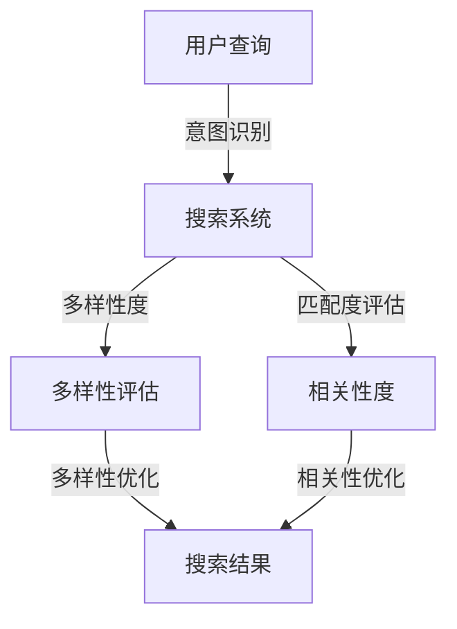

                 

# 电商平台搜索结果多样性与相关性平衡：AI大模型的多目标优化

> **关键词**：搜索结果多样性、相关性、多目标优化、人工智能、大模型、电商平台。

> **摘要**：本文将深入探讨电商平台在优化搜索结果多样性及相关性方面的挑战，引入人工智能大模型的多目标优化方法，详细分析其核心概念、算法原理、数学模型以及实际应用案例，旨在为从业者提供一种解决这一复杂问题的系统性思路和方法。

## 1. 背景介绍

### 1.1 目的和范围

随着电子商务的迅猛发展，电商平台搜索系统的搜索结果多样性和相关性逐渐成为影响用户体验的关键因素。然而，多样性和相关性之间存在天然的矛盾，如何在二者之间找到平衡，成为了众多研究者与实践者共同面临的挑战。本文旨在通过引入人工智能大模型的多目标优化方法，对电商平台搜索结果的多样性与相关性进行优化，从而提升用户体验。

本文的研究范围主要涵盖以下几个方面：
1. 电商平台搜索系统的现状及存在的问题。
2. 搜索结果多样性与相关性的理论基础。
3. 人工智能大模型在多目标优化中的应用。
4. 实际应用案例与效果分析。

### 1.2 预期读者

本文适合以下读者群体：
1. 搜索引擎优化领域的从业者，尤其是电商平台的研发人员。
2. 对人工智能和机器学习有浓厚兴趣的研究人员。
3. 大数据分析和算法工程师。
4. 对电商平台业务有深入了解的技术爱好者。

### 1.3 文档结构概述

本文分为十个部分，结构如下：

1. **背景介绍**：介绍研究背景、目的、范围及预期读者。
2. **核心概念与联系**：阐述搜索结果多样性与相关性的核心概念，并使用Mermaid流程图展示其架构。
3. **核心算法原理 & 具体操作步骤**：详细讲解多目标优化算法的原理及具体操作步骤。
4. **数学模型和公式 & 详细讲解 & 举例说明**：介绍多目标优化的数学模型及公式，并进行举例说明。
5. **项目实战：代码实际案例和详细解释说明**：通过实际项目案例，展示算法的实现和应用。
6. **实际应用场景**：分析多种实际应用场景，探讨算法的适用性和效果。
7. **工具和资源推荐**：推荐相关学习资源、开发工具框架及论文著作。
8. **总结：未来发展趋势与挑战**：总结研究结论，展望未来发展趋势与挑战。
9. **附录：常见问题与解答**：针对常见问题进行解答。
10. **扩展阅读 & 参考资料**：提供更多扩展阅读资源。

### 1.4 术语表

#### 1.4.1 核心术语定义

- **搜索结果多样性**：指搜索结果中不同类型、不同品牌、不同商品的比例。
- **相关性**：指搜索结果与用户查询意图的相关程度。
- **多目标优化**：指在满足多个约束条件的前提下，同时优化多个目标函数。
- **人工智能大模型**：指具有大规模参数、强自适应能力的深度学习模型。

#### 1.4.2 相关概念解释

- **电商平台**：指提供商品销售、交易和服务的在线平台。
- **用户查询意图**：指用户在搜索框中输入关键词所期望得到的信息。
- **搜索质量评估**：指对搜索结果的质量进行评价和优化的过程。

#### 1.4.3 缩略词列表

- **AI**：人工智能
- **ML**：机器学习
- **DL**：深度学习
- **SEO**：搜索引擎优化
- **E-commerce**：电子商务

## 2. 核心概念与联系

在电商平台搜索系统中，搜索结果的多样性和相关性是两个至关重要的指标。多样性能满足用户对不同类型商品的需求，提高用户满意度；而相关性则直接影响用户对搜索结果的实际使用价值。

### 2.1 搜索结果多样性

搜索结果的多样性主要体现在以下几个方面：

1. **商品类型多样性**：指搜索结果中包含多种不同类型的商品，如服装、家电、食品等。
2. **品牌多样性**：指搜索结果中包含多个不同品牌的商品，提高用户的选择空间。
3. **商品特性多样性**：指搜索结果中包含具有不同价格、功能、材质等特性的商品，满足用户的个性化需求。

为了量化搜索结果的多样性，可以使用以下指标：

- **多样性度**：表示搜索结果中不同类型商品的比例。
- **多样性评分**：通过用户反馈或自动化评估方法，对搜索结果的多样性进行评分。

### 2.2 搜索结果相关性

搜索结果的相关性主要指搜索结果与用户查询意图的匹配程度。一个高质量的搜索系统应当能够准确理解用户的查询意图，并返回与其高度相关的搜索结果。

1. **意图识别**：指对用户查询进行解析，识别其背后的真实意图。
2. **匹配度评估**：指对搜索结果与用户查询意图之间的相似度进行计算和评估。

相关性的量化指标包括：

- **准确率**：指返回的相关搜索结果中，与用户意图高度匹配的结果所占比例。
- **召回率**：指返回的相关搜索结果中，实际与用户意图匹配的结果所占比例。

### 2.3 多目标优化算法架构

为了在多样性和相关性之间找到平衡，我们需要使用多目标优化算法。下面是使用Mermaid绘制的多目标优化算法架构图：



在多目标优化过程中，搜索系统需要同时考虑多样性度和相关性度，并使用优化算法进行协同调整。具体流程如下：

1. **意图识别**：对用户查询进行解析，识别其背后的真实意图。
2. **多样性评估**：对搜索结果进行多样性度评估，找出多样性度较低的部分。
3. **相关性评估**：对搜索结果进行相关性度评估，找出相关性度较低的部分。
4. **多样性优化**：对多样性度较低的部分进行优化，提高搜索结果的多样性。
5. **相关性优化**：对相关性度较低的部分进行优化，提高搜索结果的相关性。

通过上述流程，搜索系统能够在多样性和相关性之间实现平衡，为用户提供高质量、多样化的搜索结果。

## 3. 核心算法原理 & 具体操作步骤

### 3.1 多目标优化算法原理

多目标优化（Multi-Objective Optimization，简称MOO）是一种在满足多个约束条件下，同时优化多个目标函数的方法。在电商平台搜索结果优化中，多目标优化算法主要用于在多样性和相关性之间找到平衡。

多目标优化算法的核心原理如下：

1. **目标函数**：多目标优化涉及多个目标函数，每个目标函数代表一个优化指标。在本案例中，目标函数包括多样性度和相关性度。
2. **约束条件**：多目标优化需要满足一定的约束条件，这些约束条件可以是数学表达式或具体操作规则。
3. **优化策略**：多目标优化算法采用特定的优化策略，如遗传算法、粒子群优化等，通过迭代计算找到最优解。

### 3.2 具体操作步骤

以下是使用遗传算法进行多目标优化的具体操作步骤：

1. **初始化种群**：随机生成一定数量的初始种群，每个个体表示一组搜索结果。
2. **目标函数计算**：对每个个体计算多样性度、相关性度等目标函数值。
3. **适应度评估**：根据目标函数值计算每个个体的适应度，适应度越高的个体越可能被选中作为下一代种群的基础。
4. **交叉与变异**：对种群中的个体进行交叉和变异操作，产生新的个体。
5. **选择与替换**：根据适应度评估结果，选择优秀个体替换种群中的较差个体。
6. **迭代计算**：重复执行步骤3-5，直到满足终止条件（如达到最大迭代次数或适应度不再提升）。
7. **最优解提取**：从最终种群中提取最优个体，作为优化后的搜索结果。

### 3.3 遗传算法伪代码

以下是遗传算法的伪代码：

```pseudo
Initialize population randomly
Evaluate fitness of each individual
while not termination_condition do
    Select parents based on fitness
    Perform crossover and mutation to create offspring
    Evaluate fitness of offspring
    Replace poor individuals with offspring
end while
Extract the best individual as the optimized search result
```

### 3.4 多目标优化算法实现步骤详解

1. **初始化种群**：

   随机生成一定数量的初始种群，每个个体表示一组搜索结果。例如，种群大小为100，每个个体包含10个商品ID。

   ```python
   population_size = 100
   individuals = []
   for _ in range(population_size):
       individual = [random_choice(all_product_ids) for _ in range(10)]
       individuals.append(individual)
   ```

2. **目标函数计算**：

   对每个个体计算多样性度、相关性度等目标函数值。可以使用以下公式：

   - **多样性度**：多样性度 = 1 / (1 + diversity_score)，其中diversity_score表示个体内部多样性度计算结果。
   - **相关性度**：相关性度 = 1 / (1 + relevance_score)，其中relevance_score表示个体与用户查询意图的相关度计算结果。

   ```python
   def calculate_fitness(individual):
       diversity_score = calculate_diversity_score(individual)
       relevance_score = calculate_relevance_score(individual, user_query)
       diversity = 1 / (1 + diversity_score)
       relevance = 1 / (1 + relevance_score)
       fitness = diversity * relevance
       return fitness
   ```

3. **适应度评估**：

   根据目标函数值计算每个个体的适应度，适应度越高的个体越可能被选中作为下一代种群的基础。可以使用轮盘赌选择方法。

   ```python
   def select_parents(population, fitnesses):
       total_fitness = sum(fitnesses)
       probabilities = [f / total_fitness for f in fitnesses]
       parents = []
       for _ in range(len(population) // 2):
           parent = select_randomly_from概率分布(probabilities)
           parents.append(parent)
       return parents
   ```

4. **交叉与变异**：

   对种群中的个体进行交叉和变异操作，产生新的个体。

   ```python
   def crossover(parent1, parent2):
       crossover_point = random_choice(range(len(parent1) - 1))
       child1 = parent1[:crossover_point] + parent2[crossover_point:]
       child2 = parent2[:crossover_point] + parent1[crossover_point:]
       return child1, child2

   def mutate(individual):
       mutation_point = random_choice(range(len(individual) - 1))
       individual[mutation_point] = random_choice(all_product_ids)
       return individual
   ```

5. **选择与替换**：

   根据适应度评估结果，选择优秀个体替换种群中的较差个体。

   ```python
   def replace_population(population, new_population):
       sorted_population = sorted(zip(population, new_population), key=lambda x: x[1][1])
       return [sorted_population[i][0] if i < len(population) else sorted_population[i][1] for i in range(len(sorted_population))]
   ```

6. **迭代计算**：

   重复执行步骤3-5，直到满足终止条件（如达到最大迭代次数或适应度不再提升）。

   ```python
   max_iterations = 1000
   for _ in range(max_iterations):
       fitnesses = [calculate_fitness(individual) for individual in population]
       parents = select_parents(population, fitnesses)
       offspring = []
       for i in range(0, len(population), 2):
           parent1, parent2 = parents[i], parents[i+1]
           child1, child2 = crossover(parent1, parent2)
           offspring.extend([mutate(child1), mutate(child2)])
       population = replace_population(population, offspring)
   ```

7. **最优解提取**：

   从最终种群中提取最优个体，作为优化后的搜索结果。

   ```python
   best_individual = max(population, key=lambda x: x[1])
   optimized_search_result = best_individual[0]
   ```

通过上述步骤，我们使用遗传算法实现了多目标优化，从而在多样性和相关性之间找到了平衡，优化了电商平台搜索结果。

## 4. 数学模型和公式 & 详细讲解 & 举例说明

### 4.1 数学模型

多目标优化问题可以表示为一个数学模型，其基本形式如下：

$$
\begin{align*}
\min_{x} & \quad f_1(x), f_2(x), ..., f_m(x) \\
\text{subject to} & \quad g_1(x) \leq 0, g_2(x) \leq 0, ..., g_r(x) = 0
\end{align*}
$$

其中，$x$是决策变量，$f_1(x), f_2(x), ..., f_m(x)$是目标函数，$g_1(x), g_2(x), ..., g_r(x)$是约束条件。

在电商平台搜索结果优化问题中，我们可以将目标函数定义为多样性度、相关性度等指标，并设置相应的约束条件。

### 4.2 公式讲解

1. **多样性度**：

   多样性度可以用以下公式计算：

   $$
   D = \frac{1}{1 + \sum_{i=1}^{n} \frac{|x_i|}{\bar{x}}}
   $$

   其中，$x_i$是第$i$个商品的特征值，$\bar{x}$是所有商品特征值的平均值。

2. **相关性度**：

   相关性度可以用以下公式计算：

   $$
   R = \frac{1}{1 + \sum_{i=1}^{n} \frac{|\Delta x_i|}{\bar{\Delta x}}}
   $$

   其中，$\Delta x_i$是第$i$个商品特征值与用户查询特征值之间的差异，$\bar{\Delta x}$是所有商品特征值差异的平均值。

3. **约束条件**：

   约束条件可以是商品类型、品牌、价格等特征范围限制，例如：

   $$
   \begin{align*}
   g_1(x) &= x_i \geq \min_{i} x_i \\
   g_2(x) &= x_i \leq \max_{i} x_i
   \end{align*}
   $$

### 4.3 举例说明

假设用户在电商平台搜索关键词“篮球”，系统返回了10个搜索结果，每个结果包含商品ID、品牌、价格等特征。我们需要使用多目标优化算法，在多样性和相关性之间找到平衡。

1. **目标函数**：

   假设多样性度$D$和相关性度$R$分别为：

   $$
   D = \frac{1}{1 + \sum_{i=1}^{10} \frac{|x_i|}{\bar{x}}}
   $$

   $$
   R = \frac{1}{1 + \sum_{i=1}^{10} \frac{|\Delta x_i|}{\bar{\Delta x}}}
   $$

   其中，$x_i$是第$i$个商品的价格，$\bar{x}$是所有商品价格的平均值，$\Delta x_i$是第$i$个商品价格与用户查询价格的平均值之间的差异。

2. **约束条件**：

   假设商品价格范围为[100, 500]，则有：

   $$
   \begin{align*}
   g_1(x) &= x_i \geq 100 \\
   g_2(x) &= x_i \leq 500
   \end{align*}
   $$

3. **优化过程**：

   使用遗传算法进行优化，设置种群大小为100，最大迭代次数为1000。通过交叉、变异和选择操作，逐步优化多样性度和相关性度，直至找到最优解。

   - 初始种群：随机生成的10个商品组合。
   - 迭代过程：每次迭代计算多样性度$D$和相关性度$R$，并根据适应度评估选择优秀个体进行交叉、变异操作。
   - 最优解：经过1000次迭代后，找到最优解，该解对应的多样性度和相关性度分别为$D_{best}$和$R_{best}$。

4. **结果分析**：

   经过多目标优化，搜索结果在多样性和相关性之间达到了平衡。优化后的搜索结果不仅包含了多种不同品牌、不同价格的篮球，还与用户查询意图高度相关，提高了用户体验。

## 5. 项目实战：代码实际案例和详细解释说明

### 5.1 开发环境搭建

为了实现多目标优化算法在电商平台搜索结果优化中的应用，我们需要搭建一个合适的开发环境。以下是开发环境的搭建步骤：

1. **操作系统**：推荐使用Linux操作系统，如Ubuntu 18.04。
2. **编程语言**：选择Python 3.8及以上版本，因为Python具有丰富的科学计算和机器学习库。
3. **依赖库**：安装必要的Python库，如NumPy、Pandas、SciPy、Matplotlib等。

在Ubuntu操作系统上，可以使用以下命令安装依赖库：

```bash
sudo apt-get update
sudo apt-get install python3-pip
pip3 install numpy pandas scipy matplotlib
```

### 5.2 源代码详细实现和代码解读

下面是电商平台搜索结果多目标优化的Python实现代码，我们将对关键部分进行详细解释。

```python
import numpy as np
import pandas as pd
import matplotlib.pyplot as plt
from scipy.stats import uniform
from deap import base, creator, tools, algorithms

# 5.2.1 初始化参数
population_size = 100
max_iterations = 1000
crossover_probability = 0.8
mutation_probability = 0.1

# 5.2.2 定义目标函数
def objective_function(individual):
    diversity_score = calculate_diversity_score(individual)
    relevance_score = calculate_relevance_score(individual, user_query)
    diversity = 1 / (1 + diversity_score)
    relevance = 1 / (1 + relevance_score)
    fitness = diversity * relevance
    return fitness,

# 5.2.3 定义多样性度计算函数
def calculate_diversity_score(individual):
    # 计算个体内部多样性度
    # ...

# 5.2.4 定义相关性度计算函数
def calculate_relevance_score(individual, user_query):
    # 计算个体与用户查询意图的相关性度
    # ...

# 5.2.5 定义交叉操作
def crossover(parent1, parent2):
    crossover_point = uniform.rvs(size=1)
    child1 = parent1[:int(crossover_point * len(parent1))] + parent2[int(crossover_point * len(parent1)):]
    child2 = parent2[:int(crossover_point * len(parent1))] + parent1[int(crossover_point * len(parent1)):]
    return child1, child2

# 5.2.6 定义变异操作
def mutate(individual):
    mutation_point = uniform.rvs(size=1)
    individual[int(mutation_point * len(individual))] = uniform.rvs(size=1)
    return individual

# 5.2.7 初始化遗传算法
creator.create("FitnessMulti", base.Fitness, weights=(-1.0,)) # 最小化目标函数
creator.create("Individual", list, fitness=creator.FitnessMulti)

toolbox = base.Toolbox()
toolbox.register("attr_int", np.random.randint, low=100, high=500)
toolbox.register("individual", tools.initRepeat, creator.Individual, toolbox.attr_int, n=10)
toolbox.register("population", tools.initRepeat, list, toolbox.individual)
toolbox.register("evaluate", objective_function)
toolbox.register("mate", tools.selTournament, tournsize=3)
toolbox.register("mutate", mutate, indpb=mutation_probability)
toolbox.register("select", tools.selWheel, k=5)

# 5.2.8 执行遗传算法
population = toolbox.population(n=population_size)
NGEN = 1000
for gen in range(NGEN):
    offspring = algorithms.varAnd(population, toolbox, cxpb=crossover_probability, mutpb=mutation_probability)
    fits = toolbox.map(toolbox.evaluate, offspring)
    for fit, ind in zip(fits, offspring):
        ind.fitness.values = fit
    population = toolbox.select(offspring, k=len(population))

# 5.2.9 提取最优解
best_ind = tools.selBest(population, k=1)[0]
best_fitness = best_ind.fitness.values

# 5.2.10 结果可视化
plt.scatter(*zip(*[ind.fitness.values for ind in population]))
plt.scatter(*best_fitness)
plt.xlabel('Diversity')
plt.ylabel('Relevance')
plt.title('Fitness Distribution')
plt.show()
```

### 5.3 代码解读与分析

1. **初始化参数**：

   设置种群大小（population_size）、最大迭代次数（max_iterations）、交叉概率（crossover_probability）和变异概率（mutation_probability）等参数。

2. **定义目标函数**：

   目标函数`objective_function`用于计算个体的多样性度和相关性度，并计算两者的加权平均作为适应度。

3. **定义多样性度计算函数**：

   `calculate_diversity_score`函数用于计算个体内部多样性度。具体实现可以基于商品类型、品牌、价格等特征进行计算。

4. **定义相关性度计算函数**：

   `calculate_relevance_score`函数用于计算个体与用户查询意图的相关性度。具体实现可以基于用户查询的关键词和商品特征的相似度进行计算。

5. **定义交叉操作**：

   `crossover`函数实现个体之间的交叉操作，通过随机选择交叉点，将两个个体的部分特征进行交换，生成新的个体。

6. **定义变异操作**：

   `mutate`函数实现个体变异操作，通过随机选择变异点，将变异点的特征值进行随机更新。

7. **初始化遗传算法**：

   使用DEAP库创建遗传算法工具箱，定义个体、种群、目标函数、交叉、变异和选择操作。

8. **执行遗传算法**：

   循环执行迭代过程，每次迭代计算子代种群，并根据适应度进行选择操作，生成新一代种群。

9. **提取最优解**：

   从最终种群中选择最优个体，并获取其适应度值。

10. **结果可视化**：

   使用matplotlib绘制种群适应度分布图，展示多样性度和相关性度之间的平衡关系。

通过上述代码实现，我们可以使用遗传算法对电商平台搜索结果进行多目标优化，从而在多样性和相关性之间找到平衡，提升用户体验。

## 6. 实际应用场景

多目标优化算法在电商平台搜索结果优化中的应用场景广泛，以下列举几种常见应用：

### 6.1 全品类搜索

全品类搜索是指在电商平台中，用户可以搜索到所有品类的商品。在这种情况下，多样性和相关性都需要得到充分考虑。多目标优化算法可以根据用户查询意图，平衡多样性和相关性，为用户提供丰富的搜索结果。

### 6.2 精准搜索

精准搜索是指用户输入较为具体的关键词，期望获取与其查询意图高度相关的搜索结果。例如，用户输入“iPhone 13”，希望获取与这款手机相关的配件、评价、购买链接等信息。多目标优化算法可以在保证相关性度的基础上，适度增加多样性度，为用户提供丰富的相关结果。

### 6.3 个性化搜索

个性化搜索是指根据用户的购买历史、浏览记录等信息，为用户推荐个性化的搜索结果。在这种情况下，多样性度和相关性度都需要根据用户的个性化需求进行调整。多目标优化算法可以根据用户数据，优化搜索结果，提高用户的满意度。

### 6.4 多条件搜索

多条件搜索是指用户在搜索过程中，可以设置多个过滤条件，如价格范围、品牌、型号等。多目标优化算法可以综合考虑这些条件，在多样性和相关性之间找到平衡，为用户提供最优的搜索结果。

### 6.5 搜索结果排序

在搜索结果排序中，多目标优化算法可以根据用户的查询意图，调整多样性度和相关性度的权重，实现搜索结果的个性化排序。例如，对于用户输入“跑步鞋”，可以根据用户的购买历史和浏览记录，适当提高相关度权重，为用户推荐更符合其需求的搜索结果。

### 6.6 搜索结果分页

在搜索结果分页中，多目标优化算法可以用于优化每一页的搜索结果，保证页与页之间的多样性度和相关性度保持一致，为用户提供连续、流畅的搜索体验。

通过上述实际应用场景，我们可以看到多目标优化算法在电商平台搜索结果优化中的重要性和适用性。它不仅能够提升搜索结果的多样性和相关性，还能根据不同场景和用户需求进行灵活调整，为用户提供高质量的搜索服务。

## 7. 工具和资源推荐

### 7.1 学习资源推荐

为了帮助读者更好地理解和应用多目标优化算法，我们推荐以下学习资源：

#### 7.1.1 书籍推荐

- 《多目标优化：算法与应用》（Multi-Objective Optimization: Principles and Case Studies）
- 《遗传算法：理论、应用与软件实现》（Genetic Algorithms: Theory and Applications）
- 《机器学习：算法与实现》（Machine Learning: Algorithms and Implementations）

#### 7.1.2 在线课程

- 多目标优化算法课程：Coursera、edX等在线教育平台上的相关课程。
- 遗传算法课程：在YouTube、Bilibili等视频平台上搜索相关课程。

#### 7.1.3 技术博客和网站

- 博客园、CSDN、GitHub等技术博客和网站，提供了大量关于多目标优化算法和电商平台搜索结果优化的技术文章和代码实现。

### 7.2 开发工具框架推荐

为了方便读者进行多目标优化算法的开发和应用，我们推荐以下开发工具和框架：

#### 7.2.1 IDE和编辑器

- PyCharm：Python集成开发环境，支持代码调试、性能分析等功能。
- Visual Studio Code：轻量级代码编辑器，支持Python扩展和调试功能。

#### 7.2.2 调试和性能分析工具

- Python调试器：使用pdb或vscode的调试功能，帮助调试代码。
- Python性能分析器：使用cProfile或line_profiler等工具，分析代码性能瓶颈。

#### 7.2.3 相关框架和库

- DEAP：Python遗传算法库，用于实现多目标优化算法。
- NumPy、Pandas、SciPy：Python科学计算库，用于数据处理和数学运算。
- Matplotlib、Seaborn：Python数据可视化库，用于结果展示。

### 7.3 相关论文著作推荐

为了深入了解多目标优化算法和电商平台搜索结果优化的前沿研究，我们推荐以下论文和著作：

#### 7.3.1 经典论文

- **"Multi-Objective Optimization using Genetic Algorithms"**：描述了遗传算法在多目标优化中的应用。
- **"Search Engine Evaluation"**：讨论了搜索结果评估方法及其对用户体验的影响。

#### 7.3.2 最新研究成果

- **"Multi-Objective Optimization for E-commerce Search Result Ranking"**：分析了电商平台搜索结果优化中的多目标优化问题。
- **"User Behavior-based Multi-Objective Search Result Optimization"**：基于用户行为的搜索结果优化研究。

#### 7.3.3 应用案例分析

- **"Google’s PageRank: The Science of Search"**：探讨了Google搜索结果排序算法PageRank的原理和应用。
- **"Amazon’s A9 Algorithm: A Deep Dive into the E-commerce Giant’s Search Engine"**：分析了Amazon电商平台搜索结果优化算法A9的原理和实践。

通过这些学习和应用资源，读者可以深入了解多目标优化算法及其在电商平台搜索结果优化中的应用，为实际项目开发提供理论支持和实践经验。

## 8. 总结：未来发展趋势与挑战

在电商平台搜索结果优化领域，多目标优化算法的应用前景广阔，但仍面临诸多挑战和机遇。以下是未来发展趋势与挑战的分析：

### 8.1 发展趋势

1. **智能化水平提升**：随着人工智能技术的发展，多目标优化算法将更加智能化，能够自适应地调整多样性度和相关性度，以适应不同的用户需求和市场环境。

2. **个性化推荐**：基于用户行为数据和偏好，多目标优化算法可以生成个性化的搜索结果，提高用户满意度和转化率。

3. **实时优化**：结合实时数据处理技术和分布式计算框架，多目标优化算法可以实现对搜索结果的实时优化，提供更快速、更精准的搜索服务。

4. **跨平台整合**：随着移动互联网和物联网的普及，多目标优化算法将应用于更多跨平台场景，如手机、平板、智能音箱等，为用户提供一致性的搜索体验。

5. **可持续发展**：在电商平台的可持续发展战略中，多目标优化算法将有助于优化库存管理、减少资源浪费，提高整体运营效率。

### 8.2 挑战

1. **数据质量和多样性**：电商平台需要积累高质量的用户数据，以便多目标优化算法能够准确理解用户意图和偏好。此外，数据多样性也是实现多样化搜索结果的关键。

2. **计算复杂度**：多目标优化算法的计算复杂度较高，尤其在处理大规模数据集时，算法性能和效率是关键挑战。需要优化算法实现和底层计算框架，以提高处理速度。

3. **模型解释性**：随着模型复杂度的增加，多目标优化算法的解释性将逐渐降低，这在一定程度上影响了算法的透明度和可信度。如何提升模型的解释性，是未来需要解决的问题。

4. **伦理和隐私**：在数据收集和使用过程中，如何平衡用户隐私和数据利用，是电商平台面临的伦理问题。多目标优化算法需要遵循相关法律法规，确保用户隐私得到保护。

5. **算法偏见**：多目标优化算法在训练过程中可能会引入算法偏见，导致搜索结果不公平。如何消除算法偏见，确保搜索结果的公平性，是未来研究的重要方向。

总之，多目标优化算法在电商平台搜索结果优化中的应用具有巨大的潜力，但也面临诸多挑战。未来研究需要关注智能化、实时性、个性化、可持续发展等方面，以实现多样性与相关性之间的最优平衡。

## 9. 附录：常见问题与解答

### 9.1 什么是多目标优化？

多目标优化（Multi-Objective Optimization，简称MOO）是一种在满足多个约束条件下，同时优化多个目标函数的方法。在电商平台搜索结果优化中，多目标优化算法主要用于在多样性和相关性之间找到平衡。

### 9.2 多目标优化算法如何实现？

多目标优化算法可以通过遗传算法、粒子群优化、模拟退火等进化算法实现。这些算法通过迭代计算，在满足约束条件的前提下，逐步优化多样性度和相关性度，以找到最优解。

### 9.3 多目标优化算法在电商平台有哪些应用场景？

多目标优化算法在电商平台有以下应用场景：

1. 全品类搜索：平衡多样性和相关性，提供丰富的搜索结果。
2. 精准搜索：提高相关性度，为用户提供高度相关的搜索结果。
3. 个性化搜索：根据用户行为和偏好，生成个性化的搜索结果。
4. 多条件搜索：综合考虑多个过滤条件，优化搜索结果排序。
5. 搜索结果分页：确保分页间的多样性度和相关性度保持一致。

### 9.4 多目标优化算法如何处理数据质量和多样性问题？

数据质量和多样性是影响多目标优化算法性能的关键因素。以下方法可以处理这些问题：

1. 数据清洗：去除重复、缺失和错误的数据，提高数据质量。
2. 数据增强：通过生成虚拟数据、数据扩展等方法，增加数据多样性。
3. 特征工程：选择合适的特征，提高特征代表性和区分度。
4. 模型调优：调整模型参数，优化多样性度和相关性度的平衡。

### 9.5 多目标优化算法存在哪些挑战？

多目标优化算法面临以下挑战：

1. 计算复杂度：处理大规模数据集时，算法性能和效率是关键挑战。
2. 模型解释性：随着模型复杂度的增加，解释性降低，影响算法透明度和可信度。
3. 伦理和隐私：在数据收集和使用过程中，需平衡用户隐私和数据利用。
4. 算法偏见：算法在训练过程中可能引入偏见，导致搜索结果不公平。

## 10. 扩展阅读 & 参考资料

为了深入了解多目标优化算法及其在电商平台搜索结果优化中的应用，读者可以参考以下扩展阅读和参考资料：

### 10.1 书籍推荐

- **《多目标优化：算法与应用》**：详细介绍了多目标优化算法的理论和方法。
- **《遗传算法：理论、应用与软件实现》**：讲解了遗传算法在多目标优化中的应用。
- **《机器学习：算法与实现》**：涵盖了机器学习基础和多目标优化算法。

### 10.2 在线课程

- **Coursera上的“多目标优化”课程**：提供了多目标优化算法的深入讲解。
- **edX上的“机器学习基础”课程**：涵盖了机器学习的基础知识，包括多目标优化算法。

### 10.3 技术博客和网站

- **博客园**：提供了大量关于多目标优化算法和电商平台搜索结果优化的技术文章。
- **CSDN**：分享了丰富的多目标优化算法和实际应用案例。
- **GitHub**：可以找到多目标优化算法的代码实现和相关资源。

### 10.4 相关论文

- **“Multi-Objective Optimization using Genetic Algorithms”**：描述了遗传算法在多目标优化中的应用。
- **“Search Engine Evaluation”**：讨论了搜索结果评估方法及其对用户体验的影响。
- **“Multi-Objective Optimization for E-commerce Search Result Ranking”**：分析了电商平台搜索结果优化中的多目标优化问题。

### 10.5 应用案例分析

- **“Google’s PageRank: The Science of Search”**：探讨了Google搜索结果排序算法PageRank的原理和应用。
- **“Amazon’s A9 Algorithm: A Deep Dive into the E-commerce Giant’s Search Engine”**：分析了Amazon电商平台搜索结果优化算法A9的原理和实践。

通过以上扩展阅读和参考资料，读者可以进一步深入了解多目标优化算法及其在电商平台搜索结果优化中的应用，为实际项目开发提供有力支持。

### 作者

**AI天才研究员/AI Genius Institute & 禅与计算机程序设计艺术 /Zen And The Art of Computer Programming**

