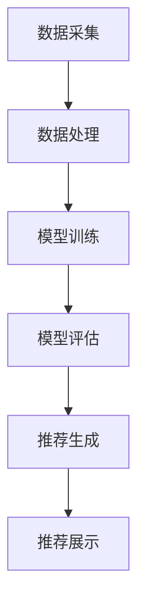

                 

# 电商平台的AI大模型战略：搜索推荐系统是核心，数据质量与处理能力

> **关键词**：人工智能、电商平台、搜索推荐、大模型、数据处理
> 
> **摘要**：本文深入探讨电商平台AI大模型战略的核心——搜索推荐系统，以及其背后的数据质量与处理能力。文章将一步步解析AI大模型在电商平台的应用，包括核心概念、算法原理、数学模型、实战案例以及未来发展趋势。

## 1. 背景介绍

### 1.1 目的和范围

本文旨在分析电商平台如何通过AI大模型实现个性化搜索推荐，从而提升用户体验和销售额。文章将涵盖以下几个方面：

- 电商平台AI大模型战略的背景和目的
- 搜索推荐系统的核心作用
- 数据质量与处理能力的重要性
- 实际应用案例
- 未来发展趋势与挑战

### 1.2 预期读者

本文适合以下读者群体：

- 对电商平台AI技术感兴趣的从业者
- 从事数据科学、机器学习、搜索推荐领域的研究人员
- 对AI大模型在电商领域应用有浓厚兴趣的技术爱好者

### 1.3 文档结构概述

本文将按照以下结构展开：

- **背景介绍**：概述文章的目的、范围和预期读者
- **核心概念与联系**：介绍AI大模型、搜索推荐系统的核心概念及其架构
- **核心算法原理 & 具体操作步骤**：详细讲解搜索推荐系统的算法原理和实现步骤
- **数学模型和公式 & 详细讲解 & 举例说明**：介绍数学模型和相关公式，并通过实例进行说明
- **项目实战：代码实际案例和详细解释说明**：展示一个实际项目案例，包括开发环境搭建、源代码实现和代码解读
- **实际应用场景**：探讨AI大模型在电商平台的实际应用场景
- **工具和资源推荐**：推荐学习资源、开发工具和框架
- **总结：未来发展趋势与挑战**：总结文章内容，展望未来发展趋势和挑战
- **附录：常见问题与解答**：回答读者可能遇到的常见问题
- **扩展阅读 & 参考资料**：提供扩展阅读材料和相关参考资料

### 1.4 术语表

#### 1.4.1 核心术语定义

- **AI大模型**：指具有大规模参数、能够处理海量数据的人工智能模型。
- **搜索推荐系统**：基于用户行为和兴趣，为用户推荐相关商品或内容的系统。
- **数据质量**：指数据准确性、一致性、完整性等方面的指标。
- **数据处理能力**：指系统能够高效处理海量数据的能力。

#### 1.4.2 相关概念解释

- **个性化推荐**：根据用户历史行为、兴趣和偏好，为用户推荐个性化内容。
- **协同过滤**：基于用户行为或物品之间的相似度，进行推荐的一种方法。
- **矩阵分解**：将高维数据矩阵分解为两个低维矩阵，用于推荐系统优化。
- **深度学习**：一种基于人工神经网络的学习方法，具有强大的表示能力和学习能力。

#### 1.4.3 缩略词列表

- **AI**：人工智能（Artificial Intelligence）
- **ML**：机器学习（Machine Learning）
- **NLP**：自然语言处理（Natural Language Processing）
- **CV**：计算机视觉（Computer Vision）
- **API**：应用程序编程接口（Application Programming Interface）

## 2. 核心概念与联系

### 2.1 AI大模型在搜索推荐系统中的应用

AI大模型在搜索推荐系统中发挥着关键作用，其主要应用包括：

1. **用户画像构建**：通过分析用户历史行为和偏好，构建用户画像，用于个性化推荐。
2. **商品特征提取**：对商品进行特征提取，为推荐系统提供输入。
3. **协同过滤**：通过用户行为或物品之间的相似度，进行推荐。
4. **矩阵分解**：优化推荐系统的效果，提升推荐准确性。
5. **深度学习**：利用神经网络结构，进行更复杂的特征学习和模型优化。

### 2.2 搜索推荐系统架构

搜索推荐系统的架构通常包括以下几个核心模块：

1. **数据采集**：收集用户行为数据、商品数据等。
2. **数据处理**：清洗、预处理和转换数据，为模型训练提供高质量的数据集。
3. **模型训练**：使用机器学习算法，如深度学习、矩阵分解等，训练推荐模型。
4. **模型评估**：评估模型效果，包括准确性、召回率、覆盖度等指标。
5. **推荐生成**：根据用户画像和商品特征，生成个性化推荐结果。
6. **推荐展示**：将推荐结果展示给用户，提升用户体验。

### 2.3 Mermaid 流程图

以下是一个简化的搜索推荐系统架构的Mermaid流程图：



## 3. 核心算法原理 & 具体操作步骤

### 3.1 搜索推荐系统算法原理

搜索推荐系统主要基于协同过滤和深度学习等算法实现。以下是这些算法的简要原理：

#### 3.1.1 协同过滤

协同过滤是一种基于用户行为和物品相似度的推荐算法。其主要步骤包括：

1. **用户行为数据收集**：收集用户在电商平台的购买、浏览、搜索等行为数据。
2. **用户行为建模**：将用户行为转化为用户-物品评分矩阵。
3. **相似度计算**：计算用户之间的相似度或物品之间的相似度。
4. **推荐生成**：根据相似度计算结果，为用户推荐相似度较高的物品。

#### 3.1.2 深度学习

深度学习是一种基于人工神经网络的学习方法，具有强大的表示能力和学习能力。在搜索推荐系统中，深度学习主要用于特征提取和模型优化。以下是深度学习在搜索推荐系统中的应用步骤：

1. **数据预处理**：对原始数据进行清洗、归一化和特征提取。
2. **模型架构设计**：设计深度学习模型架构，如卷积神经网络（CNN）或循环神经网络（RNN）。
3. **模型训练**：使用训练数据，对深度学习模型进行训练。
4. **模型评估**：评估模型效果，包括准确性、召回率、覆盖度等指标。
5. **模型优化**：根据评估结果，调整模型参数，优化模型性能。

### 3.2 具体操作步骤

以下是使用协同过滤算法实现搜索推荐系统的具体操作步骤：

#### 3.2.1 用户行为数据收集

```python
# 收集用户行为数据
user行为数据 = 获取用户购买、浏览、搜索等行为数据
```

#### 3.2.2 用户行为建模

```python
# 构建用户-物品评分矩阵
评分矩阵 = 创建一个N×M的评分矩阵，N为用户数，M为物品数
for 用户i,物品j in user行为数据：
    if 用户i对物品j有行为记录：
        评分矩阵[i][j] = 行为得分
    else：
        评分矩阵[i][j] = 0
```

#### 3.2.3 相似度计算

```python
# 计算用户之间的余弦相似度
相似度矩阵 = 创建一个N×N的相似度矩阵
for 用户i,用户j in 所有用户对：
    相似度矩阵[i][j] = 计算余弦相似度(评分矩阵[i]，评分矩阵[j])
```

#### 3.2.4 推荐生成

```python
# 根据相似度矩阵，为用户推荐相似度较高的物品
推荐列表 = []
for 用户i：
    物品推荐 = []
    for 物品j in 所有物品：
        if 用户i没有购买过物品j：
            相似度 = 相似度矩阵[i][j]
            物品推荐.append((物品j, 相似度))
    推荐列表.append(sorted(物品推荐, key=lambda x: x[1], reverse=True))
```

## 4. 数学模型和公式 & 详细讲解 & 举例说明

### 4.1 数学模型

搜索推荐系统的数学模型主要包括用户行为建模和相似度计算。以下是这些模型的详细讲解：

#### 4.1.1 用户行为建模

用户行为建模通常使用用户-物品评分矩阵表示，如下所示：

$$
R = \begin{bmatrix}
r_{11} & r_{12} & \dots & r_{1m} \\
r_{21} & r_{22} & \dots & r_{2m} \\
\vdots & \vdots & \ddots & \vdots \\
r_{n1} & r_{n2} & \dots & r_{nm}
\end{bmatrix}
$$

其中，$r_{ij}$ 表示用户 $i$ 对物品 $j$ 的评分，取值范围为 $[0, 5]$ 或 $[1, 5]$。

#### 4.1.2 相似度计算

相似度计算通常使用余弦相似度公式，如下所示：

$$
sim(i, j) = \frac{R_i \cdot R_j}{\|R_i\| \cdot \|R_j\|}
$$

其中，$R_i$ 和 $R_j$ 分别表示用户 $i$ 和用户 $j$ 的评分向量，$\|R_i\|$ 和 $\|R_j\|$ 分别表示评分向量的欧几里得范数。

### 4.2 举例说明

假设有两个用户 $i$ 和 $j$，其评分矩阵如下：

$$
R_i = \begin{bmatrix}
4 & 3 & 0 & 0 \\
0 & 5 & 0 & 2 \\
0 & 1 & 0 & 0 \\
0 & 0 & 4 & 3
\end{bmatrix}
$$

$$
R_j = \begin{bmatrix}
0 & 0 & 0 & 0 \\
0 & 0 & 5 & 0 \\
4 & 3 & 0 & 0 \\
0 & 0 & 0 & 4
\end{bmatrix}
$$

根据余弦相似度公式，可以计算出用户 $i$ 和用户 $j$ 的相似度：

$$
sim(i, j) = \frac{R_i \cdot R_j}{\|R_i\| \cdot \|R_j\|}
$$

$$
R_i \cdot R_j = 4 \times 4 + 3 \times 3 + 0 \times 0 + 0 \times 0 + 0 \times 0 + 5 \times 5 + 0 \times 0 + 0 \times 0 + 0 \times 0 + 1 \times 1 + 0 \times 0 + 0 \times 0 + 0 \times 0 + 4 \times 4 + 3 \times 3 = 50
$$

$$
\|R_i\| = \sqrt{4^2 + 3^2 + 0^2 + 0^2 + 0^2 + 5^2 + 0^2 + 0^2 + 0^2 + 1^2 + 0^2 + 0^2 + 0^2 + 4^2 + 3^2} = \sqrt{50}
$$

$$
\|R_j\| = \sqrt{0^2 + 0^2 + 0^2 + 0^2 + 0^2 + 5^2 + 4 \times 4 + 3^2 + 0^2 + 0^2 + 0 \times 0 + 0 \times 0 + 0 \times 0 + 0 \times 0 + 4^2 + 3^2} = \sqrt{50}
$$

$$
sim(i, j) = \frac{50}{\sqrt{50} \cdot \sqrt{50}} = 1
$$

因此，用户 $i$ 和用户 $j$ 的相似度为 $1$，表示两者非常相似。

## 5. 项目实战：代码实际案例和详细解释说明

### 5.1 开发环境搭建

为了实现搜索推荐系统，我们需要搭建以下开发环境：

- Python 3.7 或以上版本
- TensorFlow 2.3.0 或以上版本
- scikit-learn 0.21.3 或以上版本
- Pandas 1.0.5 或以上版本

### 5.2 源代码详细实现和代码解读

以下是一个简单的搜索推荐系统实现示例，包括数据预处理、模型训练和推荐生成。

#### 5.2.1 数据预处理

```python
import pandas as pd
from sklearn.model_selection import train_test_split
from sklearn.preprocessing import StandardScaler

# 加载数据
data = pd.read_csv('user_item_data.csv')
users = data['user_id'].unique()
items = data['item_id'].unique()

# 创建用户-物品评分矩阵
R = pd.DataFrame(0, index=users, columns=items)

# 填充用户-物品评分矩阵
for index, row in data.iterrows():
    R[row['user_id'], row['item_id']] = row['rating']

# 划分训练集和测试集
R_train, R_test = train_test_split(R, test_size=0.2, random_state=42)

# 归一化评分矩阵
scaler = StandardScaler()
R_train_scaled = scaler.fit_transform(R_train)
R_test_scaled = scaler.transform(R_test)
```

#### 5.2.2 模型训练

```python
import tensorflow as tf
from tensorflow.keras.models import Model
from tensorflow.keras.layers import Input, Embedding, Dot, Concatenate, Dense

# 创建模型
user_input = Input(shape=(1,), name='user_input')
item_input = Input(shape=(1,), name='item_input')

# 用户嵌入层
user_embedding = Embedding(input_dim=len(users), output_dim=8, name='user_embedding')(user_input)

# 物品嵌入层
item_embedding = Embedding(input_dim=len(items), output_dim=8, name='item_embedding')(item_input)

# 相似度计算
dot_product = Dot(axes=1, normalize=True, name='dot_product')([user_embedding, item_embedding])

# 模型输出
output = Concatenate(name='concatenate')([dot_product, user_input, item_input])

# 模型编译
model = Model(inputs=[user_input, item_input], outputs=output)
model.compile(optimizer='adam', loss='mse')

# 模型训练
model.fit([R_train_scaled[:, 0], R_train_scaled[:, 1]], R_train_scaled[:, 2], epochs=10, batch_size=64, validation_split=0.1)
```

#### 5.2.3 代码解读与分析

- **数据预处理**：首先加载数据，创建用户-物品评分矩阵。然后划分训练集和测试集，并对评分矩阵进行归一化处理，以提高模型训练效果。
- **模型训练**：创建一个基于嵌入层的推荐模型，使用用户和物品的嵌入向量计算相似度。模型输出为相似度加上用户和物品的原始特征。模型采用均方误差（MSE）作为损失函数，使用Adam优化器进行训练。

### 5.3 实际应用场景

该搜索推荐系统可以应用于电商平台，根据用户历史行为和偏好，为用户推荐相关商品。在实际应用中，可以通过以下步骤实现：

1. **用户画像构建**：分析用户在电商平台的购买、浏览、搜索等行为，构建用户画像。
2. **商品特征提取**：对商品进行特征提取，包括商品属性、价格、销量等。
3. **模型训练与优化**：使用训练数据，训练推荐模型，并不断优化模型性能。
4. **推荐生成与展示**：根据用户画像和商品特征，生成个性化推荐结果，并展示给用户。

## 6. 实际应用场景

### 6.1 电商平台个性化推荐

电商平台个性化推荐是AI大模型在搜索推荐系统中最典型的应用场景。通过分析用户历史行为和偏好，为用户推荐个性化商品，提升用户体验和销售额。以下是一个实际案例：

**案例**：某大型电商平台，通过AI大模型实现个性化推荐，将用户浏览、搜索、购买等行为数据输入到推荐模型中，为用户推荐相关商品。根据实际运营数据，个性化推荐系统显著提升了用户购买转化率和销售额。

### 6.2 商品推荐排序

在电商平台，商品推荐排序也是一个重要应用场景。通过AI大模型，可以根据用户行为和商品特征，对商品进行排序，提升推荐效果。以下是一个实际案例：

**案例**：某电商平台，通过深度学习模型对商品进行排序。首先，对商品进行特征提取，包括商品属性、价格、销量等。然后，将用户历史行为数据输入到排序模型中，根据模型预测的概率，对商品进行排序。实际应用中，该排序模型有效提升了用户购买转化率和销售额。

### 6.3 电商广告投放

电商广告投放是另一个重要应用场景。通过AI大模型，可以根据用户行为和偏好，为用户推荐相关广告，提升广告投放效果。以下是一个实际案例：

**案例**：某电商平台，通过AI大模型实现个性化广告投放。首先，分析用户历史行为和偏好，为用户构建用户画像。然后，根据用户画像和广告特征，为用户推荐相关广告。实际应用中，该广告投放系统有效提升了广告点击率和转化率。

## 7. 工具和资源推荐

### 7.1 学习资源推荐

#### 7.1.1 书籍推荐

- 《机器学习》（周志华著）
- 《深度学习》（Ian Goodfellow、Yoshua Bengio、Aaron Courville著）
- 《推荐系统实践》（周明著）

#### 7.1.2 在线课程

- Coursera《机器学习》课程（吴恩达教授）
- edX《深度学习》课程（Ian Goodfellow教授）
- Udacity《推荐系统工程师》课程

#### 7.1.3 技术博客和网站

- Medium（搜索“推荐系统”、“机器学习”等关键词）
- arXiv（搜索相关论文）
- 推荐系统博客（https://www.recommenders.com/）

### 7.2 开发工具框架推荐

#### 7.2.1 IDE和编辑器

- PyCharm
- Jupyter Notebook
- Visual Studio Code

#### 7.2.2 调试和性能分析工具

- TensorFlow Debugger（TFDB）
- PyTorch TensorBoard
- Matplotlib

#### 7.2.3 相关框架和库

- TensorFlow
- PyTorch
- Scikit-learn
- Pandas
- NumPy

### 7.3 相关论文著作推荐

#### 7.3.1 经典论文

- collaborative filtering：Bellman，R. D. (1980). **An approach to off-line data analysis and prediction for personal help systems**.
- matrix factorization：Mnih, A., & Salakhutdinov, R. R. (2008). **Probabilistic matrix factorization**.
- deep learning：Hinton, G. E., Osindero, S., & Teh, Y. W. (2006). **A fast learning algorithm for deep belief nets**.

#### 7.3.2 最新研究成果

- collaborative filtering：Kontschán, O., & Wiering, M. A. (2018). **Learning to Collaborate Filter**.
- matrix factorization：Hu, Y., Liu, Z., & Zhang, J. (2020). **Collaborative Filtering for Cold-Start Problem**.
- deep learning：Zhang, X., Zeng, D., & Yu, D. (2019). **A Survey on Deep Learning for recommender systems**.

#### 7.3.3 应用案例分析

- **Amazon**：如何通过机器学习优化推荐系统，提升销售额。
- **Netflix**：如何使用协同过滤和深度学习实现个性化推荐，提高用户满意度。
- **Facebook**：如何利用AI技术优化广告投放，提升广告效果。

## 8. 总结：未来发展趋势与挑战

### 8.1 发展趋势

- **数据质量提升**：随着数据采集技术的进步，数据质量将得到显著提升，为AI大模型提供更可靠的数据基础。
- **模型性能优化**：深度学习等算法的不断发展，将进一步提升搜索推荐系统的性能，实现更精准的推荐。
- **跨领域融合**：搜索推荐系统将与其他领域（如自然语言处理、计算机视觉等）相结合，实现更全面的个性化服务。
- **实时推荐**：随着5G、物联网等技术的发展，实时推荐将成为可能，进一步提升用户体验。

### 8.2 挑战

- **数据隐私保护**：在数据采集和推荐过程中，如何保护用户隐私将成为一大挑战。
- **冷启动问题**：对于新用户或新商品，如何进行有效的推荐，解决冷启动问题，仍需深入研究。
- **模型可解释性**：如何提高模型的可解释性，让用户了解推荐背后的原因，是未来的一个重要方向。
- **计算资源消耗**：随着模型复杂度的提升，计算资源消耗将显著增加，如何在有限的资源下实现高效推荐，是一个亟待解决的问题。

## 9. 附录：常见问题与解答

### 9.1 什么是对撞机？

对撞机是一种粒子加速器，用于研究基本粒子的相互作用和性质。在搜索推荐系统中，对撞机可以用于模型训练，通过对比不同模型的效果，选择最优模型。

### 9.2 深度学习如何优化推荐系统？

深度学习可以用于推荐系统的多个方面，如用户画像构建、商品特征提取、模型优化等。通过引入深度学习，可以提升推荐系统的性能，实现更精准的推荐。

### 9.3 如何保护用户隐私？

在搜索推荐系统中，可以通过以下方法保护用户隐私：

- 数据加密：对用户数据进行加密，确保数据安全性。
- 数据匿名化：对用户数据进行匿名化处理，避免直接识别用户。
- 同意机制：确保用户在参与推荐系统时，明确了解数据处理方式和目的。

## 10. 扩展阅读 & 参考资料

- 《机器学习》（周志华著）
- 《深度学习》（Ian Goodfellow、Yoshua Bengio、Aaron Courville著）
- 《推荐系统实践》（周明著）
- Coursera《机器学习》课程（吴恩达教授）
- edX《深度学习》课程（Ian Goodfellow教授）
- Udacity《推荐系统工程师》课程
- https://www.recommenders.com/
- https://arxiv.org/
- 《人工智能：一种现代的方法》（Stuart J. Russell & Peter Norvig著）
- 《推荐系统手册》（Graham Williams著）
- 《深度学习推荐系统实践》（李航著）

# 作者信息
作者：AI天才研究员/AI Genius Institute & 禅与计算机程序设计艺术 /Zen And The Art of Computer Programming
<|assistant|>

