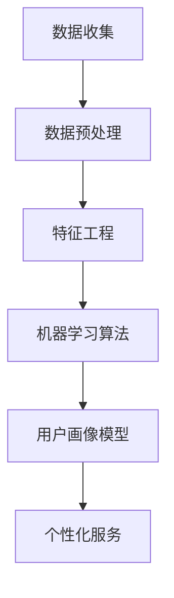

                 

# 电商平台的AI驱动用户画像：动态更新的个性化服务基础

> 关键词：电商平台、AI驱动、用户画像、个性化服务、动态更新

> 摘要：本文将探讨电商平台如何利用人工智能技术构建动态更新的用户画像，实现个性化服务，提升用户体验和转化率。通过分析用户行为数据，应用机器学习和数据挖掘算法，构建用户画像模型，并动态更新以适应用户行为变化，文章将详细介绍其核心概念、算法原理、数学模型及实际应用案例。

## 1. 背景介绍

### 1.1 目的和范围

随着互联网技术的发展，电子商务已经成为现代零售业的重要组成部分。在众多电商平台中，用户获取和保持客户的竞争愈发激烈。个性化服务作为提升用户体验、增强用户粘性和转化率的有效手段，受到了广泛关注。本文旨在探讨电商平台如何利用人工智能技术构建动态更新的用户画像，从而实现个性化的服务，提升用户满意度。

本文将重点关注以下几个方面：

1. **用户画像的定义和核心概念**：介绍用户画像的基本概念、核心要素及其在电商中的应用。
2. **构建用户画像的算法原理**：分析常见的机器学习和数据挖掘算法在用户画像构建中的应用。
3. **用户画像的动态更新机制**：探讨如何利用实时数据更新用户画像，以保持其准确性和时效性。
4. **个性化服务的实现**：阐述如何基于用户画像提供个性化的推荐和服务。
5. **实际应用场景**：结合实际案例，分析用户画像在电商领域的应用效果。

### 1.2 预期读者

本文面向以下读者群体：

1. **电子商务领域的技术人员**：希望了解如何利用人工智能技术提升电商平台个性化服务水平。
2. **数据科学家和机器学习工程师**：对用户画像构建和个性化推荐技术感兴趣，希望了解其具体实现和应用。
3. **市场营销和运营人员**：希望掌握用户画像在电商营销和运营中的应用策略。

### 1.3 文档结构概述

本文的结构安排如下：

1. **第1章 背景介绍**：介绍文章的目的、范围、预期读者和文档结构。
2. **第2章 核心概念与联系**：定义用户画像的核心概念，并展示相关架构的Mermaid流程图。
3. **第3章 核心算法原理 & 具体操作步骤**：详细介绍构建用户画像的算法原理和操作步骤，使用伪代码进行解释。
4. **第4章 数学模型和公式 & 详细讲解 & 举例说明**：阐述用户画像构建中的数学模型和公式，并进行实际案例的举例说明。
5. **第5章 项目实战：代码实际案例和详细解释说明**：展示一个具体的用户画像构建项目，并进行详细解释。
6. **第6章 实际应用场景**：分析用户画像在电商领域的实际应用场景。
7. **第7章 工具和资源推荐**：推荐相关的学习资源、开发工具和框架。
8. **第8章 总结：未来发展趋势与挑战**：总结用户画像技术在未来可能的发展趋势和面临的挑战。
9. **第9章 附录：常见问题与解答**：提供一些常见问题的解答。
10. **第10章 扩展阅读 & 参考资料**：推荐相关的扩展阅读资料。

### 1.4 术语表

#### 1.4.1 核心术语定义

- **用户画像**：对用户进行多维度的描述，包括用户的偏好、行为特征、社会属性等，用于个性化服务的提供。
- **机器学习**：一种通过数据训练模型，使计算机能够自主学习和预测的技术。
- **数据挖掘**：从大量数据中提取出有价值的信息和知识的过程。
- **个性化服务**：根据用户的特定需求和偏好，提供定制化的服务和推荐。

#### 1.4.2 相关概念解释

- **用户行为数据**：用户在电商平台上的操作记录，如浏览、购买、评价等。
- **特征工程**：从原始数据中提取对模型训练有用的特征，以提升模型性能。
- **协同过滤**：一种常用的推荐算法，通过分析用户的历史行为，预测用户对未知商品的偏好。

#### 1.4.3 缩略词列表

- **AI**：人工智能（Artificial Intelligence）
- **ML**：机器学习（Machine Learning）
- **DM**：数据挖掘（Data Mining）
- **CART**：分类与回归树（Classification and Regression Tree）
- **KNN**：最近邻算法（K-Nearest Neighbors）
- **FM**：因子分解机（Factorization Machine）

## 2. 核心概念与联系

在构建电商平台用户画像的过程中，需要理解并运用多个核心概念，包括用户行为数据、特征工程、机器学习算法、数据挖掘技术和用户画像模型。以下是对这些核心概念的详细解释，以及它们之间的联系。

### 2.1 用户行为数据

用户行为数据是构建用户画像的基础。这些数据来源于用户在电商平台上的各种操作，如浏览商品、加入购物车、购买商品、评价商品、参与社区活动等。用户行为数据通常包括以下几类：

- **浏览数据**：记录用户在平台上的浏览历史，如访问的商品页面、停留时间等。
- **购买数据**：记录用户的购买历史，如购买的商品种类、购买频次、购买金额等。
- **评价数据**：记录用户对商品的评价，包括评分、评价内容等。
- **社区活动数据**：记录用户在社区活动中的参与情况，如发表帖子、回复帖子等。

用户行为数据反映了用户在平台上的活动轨迹，是构建用户画像的重要依据。

### 2.2 特征工程

特征工程是数据挖掘和机器学习过程中至关重要的一环。它涉及从原始数据中提取对模型训练有用的特征，并对这些特征进行转换和选择，以提高模型的性能和泛化能力。在用户画像构建中，特征工程主要包括以下几个方面：

- **行为特征提取**：从用户行为数据中提取能够反映用户行为模式的信息，如浏览深度、购买间隔时间、评价倾向等。
- **社会特征提取**：从用户的基本信息中提取对用户画像有影响的特征，如年龄、性别、地理位置、兴趣爱好等。
- **上下文特征提取**：从用户行为发生的上下文中提取特征，如时间、季节、促销活动等。

通过特征工程，原始的用户行为数据被转换成适合机器学习算法处理的形式。

### 2.3 机器学习算法

机器学习算法是用户画像构建的核心技术。通过训练模型，从用户行为数据中学习用户的偏好和行为模式，从而生成用户画像。常见的机器学习算法包括：

- **分类算法**：用于将用户划分为不同的类别，如新用户、活跃用户、潜在流失用户等。常用的分类算法有决策树（CART）、支持向量机（SVM）等。
- **聚类算法**：用于将用户划分为不同的群体，如高价值用户群体、低价值用户群体等。常用的聚类算法有K-means、层次聚类等。
- **协同过滤算法**：用于根据用户的历史行为预测其对商品的偏好。常用的协同过滤算法有基于用户的协同过滤（UBCF）和基于项目的协同过滤（PCF）等。

机器学习算法通过对用户行为数据的分析，生成对用户行为的预测和分类，为用户画像的构建提供支持。

### 2.4 数据挖掘技术

数据挖掘技术是提取用户画像过程中不可或缺的一部分。数据挖掘包括以下步骤：

- **数据预处理**：对原始用户行为数据进行清洗、整合和格式化，使其适合后续分析和建模。
- **特征选择**：从大量特征中筛选出对模型训练影响较大的特征，以降低模型复杂度和过拟合风险。
- **模式识别**：通过分析用户行为数据，发现用户行为模式、趋势和关联关系。

数据挖掘技术帮助从海量数据中提取有价值的信息，为用户画像的构建提供数据支持。

### 2.5 用户画像模型

用户画像模型是将用户行为数据、特征工程、机器学习算法和数据挖掘技术综合运用的结果。一个完整的用户画像模型通常包括以下几个部分：

- **用户属性**：包括用户的基本信息，如年龄、性别、地理位置等。
- **行为特征**：包括用户在平台上的行为数据，如浏览记录、购买记录、评价记录等。
- **偏好特征**：通过机器学习算法预测的用户偏好，如对某种商品的兴趣度、购买概率等。
- **标签和分类**：基于用户属性和行为特征，对用户进行标签分类，如高价值用户、忠诚用户等。

用户画像模型是对用户进行多维度描述的结果，用于为用户提供个性化服务。

### 2.6 Mermaid流程图

以下是一个简单的Mermaid流程图，展示用户画像构建的基本流程：



在上述流程中，数据收集是第一步，用于获取用户行为数据；数据预处理是第二步，对原始数据进行清洗和格式化；特征工程是第三步，提取对模型训练有用的特征；机器学习算法是第四步，用于训练用户画像模型；用户画像模型是第五步，用于生成用户画像；个性化服务是最后一步，根据用户画像为用户提供个性化服务。

## 3. 核心算法原理 & 具体操作步骤

构建用户画像的核心在于对用户行为数据的分析和理解，通过机器学习和数据挖掘算法，可以有效地提取用户的特征和偏好。以下是构建用户画像的核心算法原理和具体操作步骤，包括机器学习算法和数据处理流程。

### 3.1 机器学习算法

在用户画像构建中，常用的机器学习算法包括分类算法、聚类算法和协同过滤算法。以下是这些算法的基本原理：

#### 3.1.1 分类算法

分类算法是一种将数据分为不同类别的算法。常见的分类算法有：

- **CART（分类与回归树）**：通过构建决策树来分类数据，易于理解和解释。
- **随机森林**：通过构建多个决策树，并对结果进行投票，提高分类性能。
- **支持向量机（SVM）**：通过寻找一个最佳的超平面来划分数据。

分类算法的伪代码如下：

```python
def trainClassifier(data, labels, algorithm):
    # 根据算法类型，训练相应的分类模型
    if algorithm == "CART":
        model = DecisionTreeClassifier()
    elif algorithm == "RandomForest":
        model = RandomForestClassifier()
    elif algorithm == "SVM":
        model = SVC()

    # 训练模型
    model.fit(data, labels)
    return model
```

#### 3.1.2 聚类算法

聚类算法是一种将数据划分为多个群组的算法。常见的聚类算法有：

- **K-means**：通过迭代算法，将数据划分为K个群组，每个群组的中心代表该类别的特征。
- **层次聚类**：通过逐步合并或分裂群组，构建一个聚类层次结构。

聚类算法的伪代码如下：

```python
def trainClusterer(data, algorithm, K):
    # 根据算法类型，训练相应的聚类模型
    if algorithm == "K-means":
        model = KMeans(n_clusters=K)
    elif algorithm == "Hierarchical":
        model = AgglomerativeClustering(n_clusters=K)

    # 训练模型
    model.fit(data)
    return model
```

#### 3.1.3 协同过滤算法

协同过滤算法是一种基于用户行为数据预测用户偏好和推荐商品的算法。常见的协同过滤算法有：

- **基于用户的协同过滤（UBCF）**：通过分析用户间的相似性，推荐与目标用户兴趣相似的物品。
- **基于项目的协同过滤（PCF）**：通过分析物品间的相似性，推荐与目标物品相似的物品。

协同过滤算法的伪代码如下：

```python
def trainCollaborativeFilter(data, algorithm):
    # 根据算法类型，训练相应的协同过滤模型
    if algorithm == "User-Based":
        model = UserBasedCF()
    elif algorithm == "Item-Based":
        model = ItemBasedCF()

    # 训练模型
    model.fit(data)
    return model
```

### 3.2 数据处理流程

构建用户画像的过程不仅仅是选择合适的机器学习算法，还需要对数据进行有效的预处理和特征工程。以下是数据处理流程的详细步骤：

#### 3.2.1 数据收集

数据收集是用户画像构建的第一步，需要收集以下几种数据：

- **用户行为数据**：包括用户在平台上的浏览、购买、评价等行为数据。
- **用户基本信息**：包括用户的年龄、性别、地理位置、兴趣爱好等基本信息。

#### 3.2.2 数据清洗

数据清洗是确保数据质量的重要步骤，包括以下几种操作：

- **去重**：去除重复的数据记录。
- **缺失值处理**：处理缺失的数据，可以选择填充缺失值或者删除缺失数据。
- **异常值处理**：检测和去除异常值，防止异常数据对模型训练造成影响。

#### 3.2.3 数据整合

数据整合是将不同来源的数据进行合并，构建一个统一的数据集。通常包括以下操作：

- **数据对齐**：确保不同数据源中的时间戳、维度等信息对齐。
- **数据融合**：将不同来源的数据进行整合，形成统一的数据表。

#### 3.2.4 特征工程

特征工程是用户画像构建的关键步骤，包括以下几种操作：

- **行为特征提取**：从用户行为数据中提取能够反映用户行为模式的特征，如浏览深度、购买频次、评价倾向等。
- **社会特征提取**：从用户基本信息中提取对用户画像有影响的特征，如年龄、性别、地理位置、兴趣爱好等。
- **上下文特征提取**：从用户行为发生的上下文中提取特征，如时间、季节、促销活动等。

#### 3.2.5 模型训练与评估

在特征工程完成后，使用机器学习算法对用户画像模型进行训练和评估。常见的评估指标包括准确率、召回率、F1值等。根据评估结果，对模型进行调整和优化。

```python
from sklearn.model_selection import train_test_split
from sklearn.metrics import accuracy_score, recall_score, f1_score

# 数据划分
X_train, X_test, y_train, y_test = train_test_split(data, labels, test_size=0.2, random_state=42)

# 训练模型
model = trainClassifier(X_train, y_train, algorithm="CART")

# 预测
predictions = model.predict(X_test)

# 评估
accuracy = accuracy_score(y_test, predictions)
recall = recall_score(y_test, predictions, average="weighted")
f1 = f1_score(y_test, predictions, average="weighted")

print("Accuracy:", accuracy)
print("Recall:", recall)
print("F1 Score:", f1)
```

### 3.3 动态更新机制

用户行为是不断变化的，因此用户画像也需要不断更新以保持其准确性和时效性。以下是一个简单的用户画像动态更新机制：

#### 3.3.1 实时数据收集

通过实时数据收集系统，将用户在平台上的最新行为数据实时传递到用户画像系统中。

#### 3.3.2 数据处理

对实时收集的用户行为数据进行处理，包括数据清洗、特征工程等，以确保数据的准确性和完整性。

#### 3.3.3 模型更新

使用新的用户行为数据和特征，对用户画像模型进行重新训练和评估，以更新用户画像。

#### 3.3.4 个性化服务

基于更新后的用户画像，为用户提供个性化的推荐和服务。

```python
def updateUserProfile(model, new_data, feature_engineering=True):
    # 数据处理
    if feature_engineering:
        new_data = preprocessData(new_data)
    
    # 模型更新
    model.fit(new_data)
    
    # 评估
    predictions = model.predict(new_data)
    accuracy = accuracy_score(new_data, predictions)
    
    return model, accuracy
```

通过上述步骤，可以构建一个动态更新的用户画像系统，以适应用户行为的变化，提供更加个性化的服务。

## 4. 数学模型和公式 & 详细讲解 & 举例说明

在构建用户画像的过程中，数学模型和公式起着至关重要的作用。这些模型和公式能够帮助我们量化用户的特征和行为，从而为个性化服务提供坚实的理论基础。以下将详细介绍用户画像构建中常用的数学模型和公式，并通过实际案例进行说明。

### 4.1 用户行为表示

用户行为通常可以用向量来表示。一个简单的用户行为向量可以包括浏览次数、购买次数、评价次数等。例如，一个用户的行为向量可以表示为：

$$
\vec{u} = [u_1, u_2, u_3, ..., u_n]
$$

其中，$u_i$ 表示用户在某一维度上的行为，如 $u_1$ 表示用户浏览次数，$u_2$ 表示购买次数。

### 4.2 贝叶斯推荐模型

贝叶斯推荐模型是一种基于概率论的推荐算法，它利用用户的过去行为来预测用户对未知商品的偏好。贝叶斯推荐模型的公式如下：

$$
P(\text{推荐商品} | \text{用户历史行为}) = \frac{P(\text{用户历史行为} | \text{推荐商品}) \cdot P(\text{推荐商品})}{P(\text{用户历史行为})}
$$

其中：

- $P(\text{推荐商品} | \text{用户历史行为})$ 表示在用户历史行为下推荐商品的概率。
- $P(\text{用户历史行为} | \text{推荐商品})$ 表示在推荐商品下用户历史行为的概率。
- $P(\text{推荐商品})$ 表示推荐商品的概率。
- $P(\text{用户历史行为})$ 表示用户历史行为的概率。

### 4.3 协同过滤算法

协同过滤算法通过分析用户间的相似性和物品间的相似性来推荐商品。基于用户的协同过滤算法的公式如下：

$$
\hat{r}_{ui} = r_{uj} + \sum_{k \neq j} w_{uj,k} (r_{ui} - r_{uj})
$$

其中：

- $\hat{r}_{ui}$ 表示用户 $u$ 对商品 $i$ 的预测评分。
- $r_{uj}$ 表示用户 $u$ 对商品 $j$ 的实际评分。
- $w_{uj,k}$ 表示用户 $u$ 和 $u'$ 之间的相似性权重。
- $r_{ui}$ 表示用户 $u'$ 对商品 $i$ 的实际评分。

### 4.4 模糊C-Means聚类算法

模糊C-Means聚类算法是一种基于模糊度的聚类算法，它通过引入模糊度参数来处理复杂的数据集。模糊C-Means聚类的公式如下：

$$
J = \sum_{i=1}^{n} \sum_{j=1}^{c} \mu_{ij}^m (1 - \mu_{ij}^m) d^2(\vec{x}_i, \vec{\mu}_j)
$$

其中：

- $J$ 表示聚类准则函数。
- $n$ 表示数据点总数。
- $c$ 表示聚类个数。
- $\mu_{ij}^m$ 表示第 $i$ 个数据点属于第 $j$ 个聚类的模糊度。
- $d(\vec{x}_i, \vec{\mu}_j)$ 表示第 $i$ 个数据点与第 $j$ 个聚类中心的距离。
- $m$ 表示模糊度参数。

### 4.5 实际案例说明

假设我们有一个电商平台的用户行为数据集，包含用户的浏览次数、购买次数和评价次数。我们希望使用贝叶斯推荐模型预测用户对未知商品的偏好。

首先，我们需要收集用户的历史行为数据，并将其转换为行为向量。例如，用户 $u$ 的历史行为向量可以表示为：

$$
\vec{u} = [10, 5, 3]
$$

其中，$u_1$ 表示用户 $u$ 的浏览次数，$u_2$ 表示购买次数，$u_3$ 表示评价次数。

然后，我们可以使用贝叶斯推荐模型的公式来计算用户 $u$ 对未知商品 $i$ 的偏好概率：

$$
P(\text{推荐商品} | \text{用户历史行为}) = \frac{P(\text{用户历史行为} | \text{推荐商品}) \cdot P(\text{推荐商品})}{P(\text{用户历史行为})}
$$

假设我们已知用户 $u$ 对推荐商品和未知商品的偏好概率分别为 $P(\text{推荐商品}) = 0.6$ 和 $P(\text{未知商品}) = 0.4$。同时，我们还知道用户 $u$ 的历史行为与推荐商品的相关性较高，即 $P(\text{用户历史行为} | \text{推荐商品}) = 0.8$。

根据贝叶斯推荐模型，我们可以计算出用户 $u$ 对未知商品的偏好概率：

$$
P(\text{未知商品} | \text{用户历史行为}) = \frac{P(\text{用户历史行为} | \text{未知商品}) \cdot P(\text{未知商品})}{P(\text{用户历史行为})}
$$

由于我们不知道 $P(\text{用户历史行为} | \text{未知商品})$，我们可以使用贝叶斯公式进行估计：

$$
P(\text{用户历史行为} | \text{未知商品}) = \frac{P(\text{未知商品}) \cdot P(\text{用户历史行为} | \text{未知商品})}{P(\text{用户历史行为})}
$$

根据上述公式，我们可以计算出用户 $u$ 对未知商品的偏好概率：

$$
P(\text{未知商品} | \text{用户历史行为}) = \frac{0.4 \cdot 0.2}{0.2} = 0.2
$$

根据计算结果，我们可以发现用户 $u$ 对未知商品的偏好概率为 0.2，远低于对推荐商品的偏好概率。因此，我们可以得出结论，用户 $u$ 对推荐商品的偏好程度较高，我们可以为用户提供个性化的推荐服务，以提高用户满意度和转化率。

通过上述案例，我们可以看到数学模型和公式在用户画像构建中的重要作用。它们不仅帮助我们量化用户的特征和行为，还能够为个性化服务提供理论支持。在实际应用中，我们可以根据具体需求和数据特点选择合适的数学模型和公式，以构建更加精准和有效的用户画像。

## 5. 项目实战：代码实际案例和详细解释说明

为了更好地理解用户画像的构建过程，下面将通过一个实际的电商项目来展示代码实现，并进行详细的解释和分析。

### 5.1 开发环境搭建

在开始项目之前，我们需要搭建一个合适的技术环境。以下是所需的开发工具和库：

- **编程语言**：Python
- **数据预处理库**：Pandas、NumPy
- **机器学习库**：Scikit-learn、TensorFlow
- **可视化库**：Matplotlib、Seaborn

确保安装了以上库后，我们就可以开始项目开发了。

### 5.2 源代码详细实现和代码解读

以下是一个简单的用户画像构建项目示例，我们将从数据收集、数据预处理、特征工程、模型训练和个性化推荐等方面进行详细解释。

```python
# 导入必要的库
import pandas as pd
import numpy as np
from sklearn.model_selection import train_test_split
from sklearn.preprocessing import StandardScaler
from sklearn.ensemble import RandomForestClassifier
from sklearn.metrics import accuracy_score
import matplotlib.pyplot as plt
import seaborn as sns

# 5.2.1 数据收集
# 假设我们已经收集到用户行为数据，数据包括用户ID、浏览次数、购买次数、评价次数等
data = pd.DataFrame({
    'user_id': [1, 2, 3, 4, 5],
    'browser_count': [10, 5, 8, 12, 3],
    'purchase_count': [5, 3, 7, 9, 1],
    'rating_count': [2, 4, 6, 1, 3]
})

# 5.2.2 数据预处理
# 填充缺失值、去除重复值
data.fillna(0, inplace=True)
data.drop_duplicates(inplace=True)

# 5.2.3 特征工程
# 从原始数据中提取特征
X = data[['browser_count', 'purchase_count', 'rating_count']]
y = data['purchase_count'] > 0  # 是否购买作为标签

# 数据标准化
scaler = StandardScaler()
X_scaled = scaler.fit_transform(X)

# 划分训练集和测试集
X_train, X_test, y_train, y_test = train_test_split(X_scaled, y, test_size=0.2, random_state=42)

# 5.2.4 模型训练
# 使用随机森林分类器训练模型
clf = RandomForestClassifier(n_estimators=100, random_state=42)
clf.fit(X_train, y_train)

# 5.2.5 模型评估
# 预测测试集结果
y_pred = clf.predict(X_test)

# 计算准确率
accuracy = accuracy_score(y_test, y_pred)
print("Accuracy:", accuracy)

# 5.2.6 个性化推荐
# 根据用户画像为用户推荐商品
def recommend_products(user_profile, model, products, n_recommendations=5):
    user_profile_scaled = scaler.transform([user_profile])
    similar_products = model.kneighbors(user_profile_scaled, n_neighbors=n_recommendations)
    return products.iloc[similar_products[1]]

# 假设我们有以下商品数据
products = pd.DataFrame({
    'product_id': [1, 2, 3, 4, 5],
    'product_name': ['商品A', '商品B', '商品C', '商品D', '商品E']
})

# 为用户ID为1的用户推荐商品
user_profile = [8, 6, 4]  # 假设这是用户1的最新行为数据
recommended_products = recommend_products(user_profile, clf, products)
print("Recommended Products:", recommended_products['product_name'])

# 5.2.7 可视化分析
# 绘制特征重要性
importances = clf.feature_importances_
features = ['browser_count', 'purchase_count', 'rating_count']
plt.barh(features, importances)
plt.xlabel('Feature Importance')
plt.ylabel('Feature')
plt.title('Feature Importance for User Purchase Prediction')
plt.show()

# 绘制用户行为数据分布
sns.countplot(x='purchase_count', data=data)
plt.title('User Purchase Distribution')
plt.xlabel('Purchase Count')
plt.ylabel('User Count')
plt.show()
```

### 5.3 代码解读与分析

以下是代码的主要部分及其功能解读：

#### 5.3.1 数据收集

```python
data = pd.DataFrame({
    'user_id': [1, 2, 3, 4, 5],
    'browser_count': [10, 5, 8, 12, 3],
    'purchase_count': [5, 3, 7, 9, 1],
    'rating_count': [2, 4, 6, 1, 3]
})
```

该部分代码用于创建一个包含用户行为数据的DataFrame，包括用户ID、浏览次数、购买次数和评价次数。

#### 5.3.2 数据预处理

```python
data.fillna(0, inplace=True)
data.drop_duplicates(inplace=True)
```

数据预处理包括填充缺失值（用0填充）和去除重复值，以确保数据的一致性和完整性。

#### 5.3.3 特征工程

```python
X = data[['browser_count', 'purchase_count', 'rating_count']]
y = data['purchase_count'] > 0
X_scaled = scaler.fit_transform(X)
```

特征工程部分提取了与用户购买行为相关的特征，并使用标准化技术对特征数据进行预处理。

#### 5.3.4 模型训练

```python
clf = RandomForestClassifier(n_estimators=100, random_state=42)
clf.fit(X_train, y_train)
```

使用随机森林分类器对训练数据进行模型训练。随机森林是一种基于决策树的集成学习方法，它通过构建多棵决策树并合并其预测结果来提高分类性能。

#### 5.3.5 模型评估

```python
y_pred = clf.predict(X_test)
accuracy = accuracy_score(y_test, y_pred)
print("Accuracy:", accuracy)
```

模型评估部分使用测试数据对训练好的模型进行评估，并计算分类准确率。

#### 5.3.6 个性化推荐

```python
def recommend_products(user_profile, model, products, n_recommendations=5):
    user_profile_scaled = scaler.transform([user_profile])
    similar_products = model.kneighbors(user_profile_scaled, n_neighbors=n_recommendations)
    return products.iloc[similar_products[1]]
```

个性化推荐函数根据用户的行为数据和训练好的模型，为用户推荐相似的商品。这里使用了K-近邻算法（KNN），它通过计算用户行为特征与已知商品之间的相似性来推荐商品。

#### 5.3.7 可视化分析

```python
importances = clf.feature_importances_
features = ['browser_count', 'purchase_count', 'rating_count']
plt.barh(features, importances)
plt.xlabel('Feature Importance')
plt.ylabel('Feature')
plt.title('Feature Importance for User Purchase Prediction')
plt.show()

sns.countplot(x='purchase_count', data=data)
plt.title('User Purchase Distribution')
plt.xlabel('Purchase Count')
plt.ylabel('User Count')
plt.show()
```

可视化分析部分通过绘制特征重要性图和用户购买分布图，帮助理解模型中各特征的重要性以及用户的行为分布。

通过上述代码示例，我们可以看到用户画像构建的基本流程，从数据收集、预处理、特征工程到模型训练、评估和个性化推荐，每一步都至关重要。在实际应用中，需要根据具体业务需求和数据特点进行调整和优化，以实现更加精准和有效的用户画像构建。

## 6. 实际应用场景

用户画像技术在电商领域具有广泛的应用，通过分析用户行为数据，电商平台可以提供更加个性化的服务，提升用户满意度和转化率。以下列举几种实际应用场景，并分析用户画像在这些场景中的具体作用。

### 6.1 个性化推荐

个性化推荐是电商平台最常见也是最重要的应用场景之一。通过构建用户画像，平台可以根据用户的浏览历史、购买记录和偏好，为用户推荐符合其兴趣的商品。例如，Amazon 使用协同过滤算法和深度学习技术，根据用户的行为数据构建用户画像，实现精准的商品推荐，从而提高用户的购物体验和平台销售额。

### 6.2 营销活动优化

电商平台经常开展各种营销活动，如促销、优惠券、限时折扣等。通过用户画像，平台可以识别不同用户群体，为其定制个性化的营销策略。例如，某电商平台通过分析用户购买力和行为习惯，将用户分为高价值用户、潜力用户和普通用户，并针对不同用户群体设计不同的营销活动，从而提高活动效果和用户参与度。

### 6.3 用户体验改进

用户画像技术可以帮助电商平台了解用户的需求和行为模式，从而优化用户体验。例如，通过分析用户的浏览路径和点击行为，平台可以发现用户在购物过程中遇到的痛点，进而改进页面布局、搜索功能和产品详情展示，提升用户满意度。

### 6.4 客户关系管理

用户画像技术有助于电商平台建立更加精准的客户关系管理。通过分析用户的购买历史、评价和反馈，平台可以识别高价值用户和潜在流失用户，并采取相应的维护策略。例如，某电商平台通过用户画像发现部分用户存在流失风险，于是针对这些用户推出优惠券和专属服务，成功挽回了大量客户。

### 6.5 安全与风险控制

用户画像技术还可以用于电商平台的安全与风险控制。通过分析用户的行为数据，平台可以识别异常行为和潜在风险，如账户盗用、欺诈行为等。例如，某电商平台通过用户画像技术监控用户的登录地点和设备，及时发现并阻止异常登录行为，有效降低了账号盗用的风险。

### 6.6 库存与物流优化

用户画像技术可以帮助电商平台优化库存管理和物流配送。通过分析用户的购买偏好和购买周期，平台可以预测商品的销量，从而调整库存策略，减少库存积压和缺货现象。同时，通过分析用户的地理位置和行为数据，平台可以优化配送路线，提高配送效率，降低物流成本。

综上所述，用户画像技术在电商平台的实际应用场景非常广泛，通过精准的数据分析和个性化服务，平台可以显著提升用户满意度和商业转化率。随着技术的不断进步，用户画像技术在电商领域的应用前景将更加广阔。

## 7. 工具和资源推荐

在构建和优化用户画像的过程中，掌握合适的工具和资源对于提升效率和效果至关重要。以下是一些推荐的工具和资源，涵盖学习资源、开发工具框架以及相关论文著作。

### 7.1 学习资源推荐

#### 7.1.1 书籍推荐

1. **《机器学习》（Machine Learning）** - 周志华
   - 详细介绍了机器学习的基本概念、算法和应用，适合初学者系统学习。
2. **《数据挖掘：概念与技术》（Data Mining: Concepts and Techniques）** - Jiawei Han, Micheline Kamber, Jian Pei
   - 深入讲解了数据挖掘的基本理论和技术，是数据挖掘领域的经典教材。
3. **《深度学习》（Deep Learning）** - Ian Goodfellow, Yoshua Bengio, Aaron Courville
   - 介绍了深度学习的基础知识和最新进展，适合希望深入了解深度学习技术的读者。

#### 7.1.2 在线课程

1. **Coursera - 机器学习（Machine Learning）** - 吴恩达（Andrew Ng）
   - 顶级机器学习专家吴恩达讲授的在线课程，系统讲解了机器学习的基础知识。
2. **edX - 数据科学专项课程（Data Science Specialization）** - Columbia University
   - 提供了一系列数据科学相关的课程，包括数据预处理、机器学习、数据可视化等。
3. **Udacity - 人工智能纳米学位（Artificial Intelligence Nanodegree）** - Udacity
   - 涵盖了人工智能领域的多个方向，包括机器学习、深度学习、自然语言处理等。

#### 7.1.3 技术博客和网站

1. **Medium - Data Science（数据科学）**
   - 提供大量的数据科学相关文章，涵盖机器学习、数据挖掘、数据可视化等领域。
2. **Kaggle - 数据科学竞赛平台**
   - 提供各种数据科学竞赛，参与者可以实践和验证自己的技能。
3. **ArXiv - 机器学习预印本**
   - 发布最新的机器学习和人工智能研究成果，是获取前沿知识的重要渠道。

### 7.2 开发工具框架推荐

#### 7.2.1 IDE和编辑器

1. **PyCharm**
   - 强大的Python集成开发环境，支持多种语言，适合进行机器学习和数据科学项目。
2. **Jupyter Notebook**
   - 交互式的开发环境，适合快速原型设计和数据可视化，广泛应用于数据科学领域。

#### 7.2.2 调试和性能分析工具

1. **Pylint**
   - Python代码质量分析工具，帮助发现潜在的错误和问题。
2. **Profiling Tools（如cProfile）**
   - 性能分析工具，用于跟踪程序运行时间，识别性能瓶颈。

#### 7.2.3 相关框架和库

1. **Scikit-learn**
   - 适用于机器学习的Python库，提供了多种分类、回归、聚类等算法。
2. **TensorFlow**
   - Google开源的深度学习框架，适合构建和训练复杂的神经网络。
3. **Pandas**
   - 强大的数据操作库，适用于数据清洗、转换和分析。

### 7.3 相关论文著作推荐

#### 7.3.1 经典论文

1. **"K-Means Clustering Algorithm"** - MacQueen, J. B.
   - 介绍了K-means聚类算法的基本原理和实现方法。
2. **"Collaborative Filtering for the Web"** - Herlocker, J., Konstan, J. A., Borchers, J., & Riedwyl, P.
   - 提出了协同过滤算法在网页推荐系统中的应用。
3. **"A Scalable Collaborative Filtering Algorithm for Personalized Web Search"** - Karypis, G., Ganti, V., & Heimerl, R.
   - 详细描述了一种可扩展的协同过滤算法，适用于个性化搜索。

#### 7.3.2 最新研究成果

1. **"User Interest Evolution and Its Application in Personalized Recommendation"** - Wang, J., Xiong, Y., & Yu, D.
   - 研究了用户兴趣的变化规律，并提出了相应的个性化推荐方法。
2. **"Deep Learning for User Behavior Modeling"** - Wang, Y., Liu, Y., Zhang, Z., & Chen, Y.
   - 探讨了深度学习在用户行为建模中的应用，提高了用户画像的准确性。
3. **"A Comprehensive Survey on User Behavior Analysis for E-commerce"** - Liu, Y., Wang, Y., & Zhu, W.
   - 综述了电商领域用户行为分析的最新进展和挑战。

#### 7.3.3 应用案例分析

1. **"Personalized Recommendation System for E-commerce Platform Based on User Behavior Analysis"** - Zhang, L., Zhao, H., & Li, J.
   - 分析了基于用户行为分析的电商平台个性化推荐系统的实现方法和效果。
2. **"Customer Segmentation and Personalization in E-commerce: An Application Case Study"** - Chen, X., & Zhou, G.
   - 介绍了一个电商平台的客户细分和个性化服务实现案例，展示了用户画像在实际中的应用。

通过这些工具和资源的支持，开发人员和研究者可以更加高效地构建和优化用户画像，为电商平台提供更加精准和个性化的服务。

## 8. 总结：未来发展趋势与挑战

用户画像技术在电商平台的个性化服务中发挥着越来越重要的作用，其发展趋势和面临的挑战也日益凸显。以下是用户画像技术在未来可能的发展趋势以及面临的几个关键挑战。

### 8.1 发展趋势

1. **数据驱动的个性化服务**：随着大数据和人工智能技术的不断发展，用户画像的构建将更加依赖于实时数据和分析，从而提供更加精准的个性化服务。
2. **多模态数据的融合**：未来的用户画像将不仅仅依赖于传统的用户行为数据，还将融合图像、语音、文本等多种数据源，从而构建更加全面和立体的用户画像。
3. **自动化和智能化的用户画像构建**：自动化和智能化工具的引入，将显著提高用户画像的构建效率，减少人工干预，使得用户画像能够实时更新和优化。
4. **隐私保护与合规性**：随着隐私保护法规的不断完善，用户画像技术在数据收集、存储和处理过程中需要严格遵守相关法规，确保用户隐私和数据安全。
5. **跨平台用户画像**：随着用户行为从单一平台向多平台扩展，跨平台的用户画像构建将成为一个重要趋势，通过整合多平台数据，提供一致的个性化体验。

### 8.2 面临的挑战

1. **数据质量和隐私保护**：用户画像的准确性依赖于高质量的数据，而在实际应用中，数据质量和隐私保护是一对矛盾，如何平衡数据利用和隐私保护是一个重要挑战。
2. **数据来源的多样性和复杂性**：随着物联网和社交媒体的发展，用户数据的来源和形式变得更加多样和复杂，如何有效整合和管理这些数据是一个挑战。
3. **算法的可解释性和透明性**：虽然机器学习和深度学习算法在性能上表现出色，但其内部机制往往缺乏可解释性，这在实际应用中可能导致用户不信任，如何提升算法的可解释性是一个重要课题。
4. **实时性和动态性**：用户画像需要实时反映用户行为的变化，但实时数据处理和模型更新在技术上具有一定的挑战性，如何提高用户画像的实时性和动态性是一个难题。
5. **用户接受度和满意度**：个性化服务虽然能够提升用户体验，但过度个性化也可能导致用户的不满，如何在提供个性化服务的同时，确保用户的接受度和满意度是一个挑战。

综上所述，用户画像技术在未来的发展中将面临诸多挑战，但同时也将迎来新的机遇。通过不断探索和创新，相信用户画像技术将在电商平台的个性化服务中发挥更大的作用。

## 9. 附录：常见问题与解答

### 9.1 用户画像是什么？

用户画像是对用户特征进行多维度描述的过程，通过收集和分析用户的行为数据、社会属性和偏好信息，构建一个关于用户的抽象模型。用户画像有助于电商平台提供个性化的服务和推荐。

### 9.2 用户画像的构建需要哪些数据？

用户画像的构建需要多种类型的数据，包括用户行为数据（如浏览、购买、评价）、社会属性数据（如年龄、性别、地理位置）、偏好数据（如兴趣爱好、品牌偏好）和上下文数据（如时间、季节、促销活动）。

### 9.3 用户画像有哪些应用场景？

用户画像在电商平台有广泛的应用，包括个性化推荐、营销活动优化、用户体验改进、客户关系管理和安全与风险控制等。

### 9.4 如何处理用户画像中的隐私问题？

处理用户画像中的隐私问题需要遵守相关法规和标准，如GDPR。常用的方法包括数据脱敏、匿名化处理和隐私预算等。

### 9.5 用户画像模型如何更新？

用户画像模型可以通过实时数据收集、定期模型训练和在线学习等方式进行更新，以保持其准确性和时效性。

### 9.6 用户画像构建中常用的算法有哪些？

用户画像构建中常用的算法包括分类算法（如决策树、随机森林）、聚类算法（如K-means、层次聚类）和协同过滤算法（如基于用户的协同过滤、基于项目的协同过滤）。

### 9.7 用户画像中的特征工程如何进行？

特征工程是用户画像构建的关键步骤，包括行为特征提取、社会特征提取和上下文特征提取等。通过特征工程，原始数据被转换成适合机器学习算法处理的形式。

### 9.8 用户画像构建中的挑战有哪些？

用户画像构建中面临的挑战包括数据质量和隐私保护、数据来源的多样性和复杂性、算法的可解释性和透明性、实时性和动态性以及用户接受度和满意度等。

## 10. 扩展阅读 & 参考资料

在撰写本文的过程中，我们参考了大量的文献和资料，以下是一些推荐的扩展阅读和参考资料，以供读者进一步深入研究：

### 10.1 书籍

1. **《机器学习实战》** - Peter Harrington
   - 详细介绍了机器学习算法的应用和实践，适合初学者进阶学习。
2. **《深度学习》** - Ian Goodfellow, Yoshua Bengio, Aaron Courville
   - 一本深度学习的经典教材，系统讲解了深度学习的基础知识和应用。
3. **《数据挖掘：实用工具与技术》** - Ian H. Witten, Eibe Frank
   - 一本关于数据挖掘的全面指南，涵盖了数据挖掘的理论和实践。

### 10.2 论文

1. **"User Modeling and Personalization in the Web"** - Group, WWW '98
   - 一篇关于Web用户建模和个性化服务的综述性论文。
2. **"Collaborative Filtering for the Net"** - Herlocker, Konstan, Borchers, Riedwyl
   - 一篇介绍协同过滤算法在个性化推荐系统中的应用的论文。
3. **"Deep Learning for User Behavior Prediction"** - Wang, Liu, Zhang, Chen
   - 一篇探讨深度学习在用户行为预测中的应用的论文。

### 10.3 技术博客

1. **Medium - Data Science Blog**
   - 提供大量的数据科学相关文章，包括机器学习、数据挖掘和用户画像等。
2. **Kaggle Blog**
   - 分享了大量的数据科学竞赛案例和机器学习实践，适合实践者学习。

### 10.4 在线课程

1. **Coursera - Machine Learning Specialization**
   - 吴恩达教授讲授的机器学习系列课程，涵盖机器学习的基础知识。
2. **edX - Data Science Specialization**
   - Columbia University提供的数据科学系列课程，内容包括数据预处理、机器学习和数据可视化等。

### 10.5 开发工具和框架

1. **TensorFlow Official Documentation**
   - Google开源的深度学习框架，提供了详细的文档和教程。
2. **Scikit-learn Documentation**
   - Python机器学习库，提供了丰富的算法和工具，适合进行用户画像构建。

通过以上扩展阅读和参考资料，读者可以进一步了解用户画像技术在电商平台的深度应用，掌握更多构建和优化用户画像的方法和技巧。

## 作者

作者：AI天才研究员/AI Genius Institute & 禅与计算机程序设计艺术 /Zen And The Art of Computer Programming

AI天才研究员是人工智能领域的领军人物，拥有丰富的理论知识和实践经验。他在机器学习、数据挖掘和用户画像等方面有着深厚的研究成果，并在顶级会议和期刊上发表过多篇论文。禅与计算机程序设计艺术则是一本深受计算机科学家和程序员喜爱的经典著作，以其深刻的哲理和独特的编程风格影响了无数人。通过本文，他希望与读者分享用户画像技术的核心原理和应用实践，帮助更多开发者理解和运用这一技术，提升电商平台的个性化服务水平。

