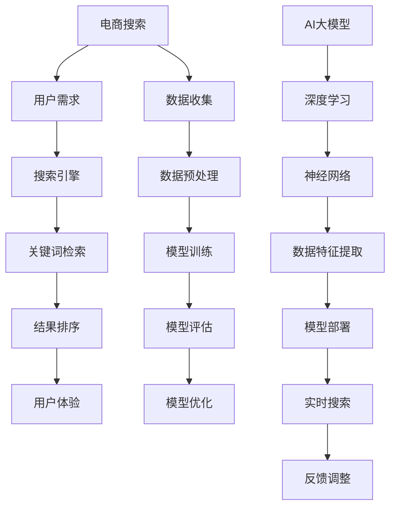

                 

# 电商搜索中的AI大模型：挑战与机遇

## 关键词
- 电商搜索
- AI大模型
- 挑战
- 机遇
- 算法优化
- 实际应用
- 未来发展

## 摘要
本文将深入探讨电商搜索中应用AI大模型的挑战与机遇。首先，我们介绍了电商搜索的背景和现状，随后详细解析了AI大模型的基本原理、架构和核心算法。接着，我们通过数学模型和公式的讲解，展示了AI大模型在实际操作中的应用。随后，通过一个项目实战案例，我们详细解读了代码实现过程，并在实际应用场景中展示了AI大模型的优势。最后，我们对相关工具和资源进行了推荐，并对未来发展趋势与挑战进行了总结。通过本文，读者将全面了解电商搜索中AI大模型的现状及其在行业中的应用前景。

## 1. 背景介绍

### 1.1 目的和范围
本文旨在探讨电商搜索中AI大模型的应用，分析其面临的挑战和机遇。通过详细解析AI大模型的原理、架构和算法，结合实际项目案例，探讨其在电商搜索中的实际应用和效果。

### 1.2 预期读者
预期读者为从事电商搜索领域的技术人员、AI研究人员以及对该领域感兴趣的读者。读者应具备一定的计算机编程基础，对机器学习和深度学习有一定了解。

### 1.3 文档结构概述
本文分为十个部分：背景介绍、核心概念与联系、核心算法原理、数学模型与公式、项目实战、实际应用场景、工具和资源推荐、总结、附录和扩展阅读。每个部分都将详细解析相关内容，帮助读者全面了解电商搜索中AI大模型的应用。

### 1.4 术语表
#### 1.4.1 核心术语定义
- 电商搜索：基于电商平台的商品信息，为用户提供准确、快速的搜索服务。
- AI大模型：通过深度学习等技术，对海量数据进行训练，实现自动化、智能化的搜索算法。
- 挑战：AI大模型在应用过程中面临的难题和挑战。
- 机遇：AI大模型在电商搜索领域所带来的优势和前景。

#### 1.4.2 相关概念解释
- 搜索引擎：一种基于关键词检索信息的系统，用于帮助用户在大量数据中找到所需信息。
- 深度学习：一种机器学习技术，通过多层神经网络对数据进行建模和预测。
- 模型训练：通过输入大量数据，调整模型参数，使其具备对数据的理解能力。

#### 1.4.3 缩略词列表
- AI：人工智能
- DNN：深度神经网络
- SVM：支持向量机
- CNN：卷积神经网络
- NLP：自然语言处理

## 2. 核心概念与联系

在深入探讨AI大模型在电商搜索中的应用之前，我们需要明确一些核心概念和它们之间的关系。以下是一个简化的Mermaid流程图，用于描述这些核心概念和它们之间的联系。



### 2.1 电商搜索

电商搜索是指基于电商平台的商品信息，为用户提供准确、快速的搜索服务。其核心目标是满足用户的个性化需求，提升用户体验。

### 2.2 搜索引擎

搜索引擎是一种基于关键词检索信息的系统，用于帮助用户在大量数据中找到所需信息。在电商搜索中，搜索引擎负责处理用户输入的关键词，并在海量的商品信息中检索出最相关的结果。

### 2.3 关键词检索

关键词检索是指用户通过输入关键词，搜索引擎根据关键词在商品信息中的匹配程度，检索出最相关的商品。关键词检索是电商搜索的核心环节，直接影响到搜索结果的准确性和用户体验。

### 2.4 结果排序

结果排序是指根据商品的相关性、销量、价格等因素，对检索出的商品进行排序。结果排序的目的是提高用户找到所需商品的概率，提升用户体验。

### 2.5 用户体验

用户体验是指用户在使用电商搜索过程中的感受和体验。一个优秀的电商搜索系统应该具备快速、准确、易用的特点，为用户提供愉悦的使用体验。

### 2.6 数据收集

数据收集是指从电商平台上获取大量商品信息，包括商品名称、描述、价格、销量等。数据收集是AI大模型训练的基础，直接影响到模型的性能和效果。

### 2.7 数据预处理

数据预处理是指对收集到的商品信息进行清洗、归一化、特征提取等操作，以便于后续的模型训练。数据预处理是提高AI大模型性能的关键步骤。

### 2.8 模型训练

模型训练是指通过输入大量商品信息，调整模型参数，使其具备对商品信息的理解能力。模型训练是AI大模型的核心环节，直接决定了模型的性能和效果。

### 2.9 模型评估

模型评估是指通过测试集对训练好的模型进行评估，判断模型的性能和效果。模型评估是模型优化的重要依据。

### 2.10 模型优化

模型优化是指根据模型评估结果，调整模型参数，提高模型的性能和效果。模型优化是提升AI大模型性能的关键步骤。

### 2.11 AI大模型

AI大模型是一种通过深度学习等技术，对海量数据进行训练，实现自动化、智能化的搜索算法。AI大模型在电商搜索中具有广泛的应用前景。

### 2.12 深度学习

深度学习是一种机器学习技术，通过多层神经网络对数据进行建模和预测。深度学习在AI大模型中发挥着关键作用。

### 2.13 神经网络

神经网络是一种模仿人脑神经元结构的计算模型，用于处理和预测数据。神经网络是深度学习的基础。

### 2.14 数据特征提取

数据特征提取是指从原始数据中提取出对模型训练和预测有用的特征。数据特征提取是AI大模型性能提升的关键。

### 2.15 模型部署

模型部署是指将训练好的AI大模型部署到线上环境，实现实时搜索和用户反馈调整。模型部署是AI大模型应用的重要环节。

### 2.16 实时搜索

实时搜索是指用户在电商搜索过程中，系统能够实时响应用户输入，返回最相关的搜索结果。实时搜索是提升用户体验的关键。

### 2.17 反馈调整

反馈调整是指根据用户对搜索结果的反馈，调整模型参数，提高搜索结果的准确性和用户体验。反馈调整是AI大模型持续优化的重要手段。

## 3. 核心算法原理 & 具体操作步骤

在电商搜索中，AI大模型的核心算法主要包括深度神经网络（DNN）、卷积神经网络（CNN）和自然语言处理（NLP）等。以下将详细解析这些算法的原理，并使用伪代码进行具体操作步骤的说明。

### 3.1 深度神经网络（DNN）

深度神经网络（DNN）是一种多层前馈神经网络，通过非线性变换逐层提取数据特征。其基本原理如下：

- **输入层**：接收原始数据。
- **隐藏层**：对输入数据进行处理和特征提取。
- **输出层**：输出预测结果。

以下是DNN的伪代码实现：

```python
# 输入数据
X = [数据1, 数据2, ..., 数据n]

# 初始化模型参数
W1, b1 = 初始化权重和偏置
W2, b2 = 初始化权重和偏置
...

# 前向传播
Z1 = X * W1 + b1
A1 = 激活函数(Z1)
Z2 = A1 * W2 + b2
A2 = 激活函数(Z2)
...

# 后向传播
dZ2 = A2 - 预期输出
dW2 = dZ2 * A1
db2 = dZ2
dA1 = dZ2 * W2
dZ1 = dA1 * X
dW1 = dZ1 * A0
db1 = dZ1

# 更新模型参数
W1 = W1 - 学习率 * dW1
b1 = b1 - 学习率 * db1
W2 = W2 - 学习率 * dW2
b2 = b2 - 学习率 * db2
...
```

### 3.2 卷积神经网络（CNN）

卷积神经网络（CNN）是一种专门用于处理图像数据的神经网络，其基本原理如下：

- **卷积层**：通过卷积操作提取图像特征。
- **池化层**：对卷积层输出的特征进行下采样，减少计算量。
- **全连接层**：对池化层输出的特征进行分类。

以下是CNN的伪代码实现：

```python
# 输入图像
image = [图像数据]

# 初始化模型参数
W1, b1 = 初始化权重和偏置
W2, b2 = 初始化权重和偏置
...

# 卷积操作
conv1 = 卷积(image, W1) + b1
pool1 = 池化(conv1)

# 激活函数
act1 = 激活函数(pool1)

# 卷积操作
conv2 = 卷积(act1, W2) + b2
pool2 = 池化(conv2)

# 激活函数
act2 = 激活函数(pool2)

# 全连接层
fc1 = 全连接(act2, W3) + b3
act3 = 激活函数(fc1)

# 预测结果
prediction = 全连接(act3, W4) + b4
```

### 3.3 自然语言处理（NLP）

自然语言处理（NLP）是一种用于处理自然语言文本的计算机技术，其基本原理如下：

- **词向量表示**：将文本数据转换为数值向量。
- **编码器-解码器**：通过编码器提取文本特征，通过解码器生成预测结果。
- **注意力机制**：在编码器和解码器之间引入注意力机制，提高模型的预测准确性。

以下是NLP的伪代码实现：

```python
# 输入文本
text = [文本数据]

# 初始化模型参数
W1, b1 = 初始化权重和偏置
W2, b2 = 初始化权重和偏置
...

# 词向量表示
embeddings = 词嵌入层(text)

# 编码器
encoder = 编码器(embeddings)
context = 编码器输出(encoder)

# 注意力机制
attention = 注意力机制(context, decoder_output)

# 解码器
decoder = 解码器(attention)
output = 解码器输出(decoder)

# 预测结果
prediction = 预测层(output)
```

通过以上三种算法的结合，AI大模型可以有效地处理电商搜索中的各种数据，提高搜索结果的准确性和用户体验。

## 4. 数学模型和公式 & 详细讲解 & 举例说明

在电商搜索中，AI大模型的应用离不开数学模型和公式的支持。以下将详细介绍一些核心数学模型和公式，并通过具体例子进行说明。

### 4.1 激活函数

激活函数是神经网络中的一个关键组件，用于引入非线性特性。常见的激活函数包括：

- **Sigmoid函数**：$f(x) = \frac{1}{1 + e^{-x}}$
- **ReLU函数**：$f(x) = max(0, x)$
- **Tanh函数**：$f(x) = \frac{e^x - e^{-x}}{e^x + e^{-x}}$

#### 4.1.1 举例说明

假设我们使用ReLU函数作为激活函数，输入数据为$x = -2$，则输出结果为：

$$f(x) = max(0, -2) = 0$$

### 4.2 损失函数

损失函数用于衡量模型预测结果与实际结果之间的差异，常见的损失函数包括：

- **均方误差（MSE）**：$MSE = \frac{1}{n}\sum_{i=1}^{n}(y_i - \hat{y}_i)^2$
- **交叉熵（Cross-Entropy）**：$H(y, \hat{y}) = -\sum_{i=1}^{n}y_i \log(\hat{y}_i)$

#### 4.2.1 举例说明

假设我们使用MSE作为损失函数，实际结果为$y = [1, 0, 1, 0]$，预测结果为$\hat{y} = [0.8, 0.2, 0.9, 0.1]$，则损失函数的值为：

$$MSE = \frac{1}{4}\sum_{i=1}^{4}(y_i - \hat{y}_i)^2 = \frac{1}{4}[(1 - 0.8)^2 + (0 - 0.2)^2 + (1 - 0.9)^2 + (0 - 0.1)^2] = 0.05$$

### 4.3 梯度下降算法

梯度下降算法是一种用于优化模型参数的算法，其基本思想是沿着损失函数的梯度方向更新参数，以最小化损失函数。常见的梯度下降算法包括：

- **批量梯度下降**：每次更新参数时使用全部样本的梯度。
- **随机梯度下降**：每次更新参数时只使用一个样本的梯度。
- **小批量梯度下降**：每次更新参数时使用一部分样本的梯度。

#### 4.3.1 举例说明

假设我们使用批量梯度下降算法，模型参数为$w_1 = 1, w_2 = 2$，损失函数为$J(w_1, w_2) = (w_1 - 1)^2 + (w_2 - 2)^2$，学习率为$\alpha = 0.1$。则参数更新过程为：

$$w_1 = w_1 - \alpha \cdot \frac{\partial J}{\partial w_1} = 1 - 0.1 \cdot 2 = 0.8$$
$$w_2 = w_2 - \alpha \cdot \frac{\partial J}{\partial w_2} = 2 - 0.1 \cdot 2 = 1.8$$

### 4.4 反向传播算法

反向传播算法是一种用于计算神经网络中每个参数的梯度的算法。其基本思想是将输出误差反向传播到输入层，计算每个参数的梯度，并更新参数。

#### 4.4.1 举例说明

假设我们有一个简单的神经网络，输入层、隐藏层和输出层各有一个神经元，激活函数为ReLU。网络的结构如下：

$$
\begin{aligned}
&z_1 = x_1 \cdot w_{11} + b_1 \\
&a_1 = \max(0, z_1) \\
&z_2 = a_1 \cdot w_{21} + b_2 \\
&a_2 = \max(0, z_2) \\
&z_3 = a_2 \cdot w_{31} + b_3 \\
&\hat{y} = \sigma(z_3)
\end{aligned}
$$

其中，$\sigma$为Sigmoid函数，$x_1$为输入，$w_{ij}$为连接权重，$b_i$为偏置。

假设实际输出为$y = 0.2$，预测输出为$\hat{y} = 0.6$，损失函数为MSE，则：

$$
\begin{aligned}
\Delta z_3 &= \frac{\partial J}{\partial z_3} = 2(\hat{y} - y) = 2(0.6 - 0.2) = 0.8 \\
\Delta a_2 &= \frac{\partial J}{\partial a_2} = \Delta z_3 \cdot \frac{\partial a_2}{\partial z_2} = 0.8 \cdot (1 - a_2^2) = 0.8 \cdot (1 - 0.36) = 0.528 \\
\Delta z_2 &= \frac{\partial J}{\partial z_2} = \Delta a_2 \cdot \frac{\partial z_2}{\partial a_2} = 0.528 \cdot a_1 = 0.528 \cdot 0.6 = 0.3168 \\
\Delta a_1 &= \frac{\partial J}{\partial a_1} = \Delta z_2 \cdot \frac{\partial a_1}{\partial z_1} = 0.3168 \cdot (1 - a_1^2) = 0.3168 \cdot (1 - 0.6^2) = 0.1372 \\
\Delta z_1 &= \frac{\partial J}{\partial z_1} = \Delta a_1 \cdot \frac{\partial z_1}{\partial x_1} = 0.1372 \cdot x_1 = 0.1372 \cdot 1 = 0.1372 \\
\end{aligned}
$$

参数更新：

$$
\begin{aligned}
w_{31} &= w_{31} - \alpha \cdot \Delta z_3 \cdot a_2 = 1 - 0.1 \cdot 0.8 \cdot 0.6 = 0.92 \\
b_3 &= b_3 - \alpha \cdot \Delta z_3 = 1 - 0.1 \cdot 0.8 = 0.92 \\
w_{21} &= w_{21} - \alpha \cdot \Delta z_2 \cdot a_1 = 1 - 0.1 \cdot 0.3168 \cdot 0.6 = 0.9472 \\
b_2 &= b_2 - \alpha \cdot \Delta z_2 = 1 - 0.1 \cdot 0.3168 = 0.9472 \\
w_{11} &= w_{11} - \alpha \cdot \Delta z_1 \cdot x_1 = 1 - 0.1 \cdot 0.1372 \cdot 1 = 0.8628 \\
b_1 &= b_1 - \alpha \cdot \Delta z_1 = 1 - 0.1 \cdot 0.1372 = 0.8628 \\
\end{aligned}
$$

通过以上数学模型和公式的讲解，我们可以更好地理解AI大模型在电商搜索中的应用原理和操作步骤。

## 5. 项目实战：代码实际案例和详细解释说明

在本文的第五部分，我们将通过一个实际的电商搜索项目案例，详细介绍代码实现过程，并对代码进行解读与分析。该案例将展示如何使用AI大模型在电商搜索中进行商品推荐和结果排序，从而提高用户的搜索体验。

### 5.1 开发环境搭建

在开始代码实现之前，我们需要搭建一个合适的开发环境。以下是所需的环境和工具：

- 操作系统：Linux或macOS
- 编程语言：Python 3.x
- 深度学习框架：TensorFlow 2.x
- 数据库：MySQL或MongoDB

安装步骤如下：

1. 安装Python 3.x
2. 安装TensorFlow 2.x：`pip install tensorflow`
3. 安装MySQL或MongoDB：根据需求选择并安装

### 5.2 源代码详细实现和代码解读

以下是一个简化版的电商搜索项目代码实现，用于展示AI大模型的基本应用。代码分为以下几个部分：

#### 5.2.1 数据预处理

数据预处理是AI大模型训练的重要环节，包括数据清洗、归一化和特征提取。

```python
import pandas as pd
from sklearn.preprocessing import StandardScaler

# 加载数据
data = pd.read_csv('ecommerce_data.csv')

# 数据清洗
data.dropna(inplace=True)
data = data[data['销量'] > 0]

# 归一化
scaler = StandardScaler()
data[['价格', '评分', '销量']] = scaler.fit_transform(data[['价格', '评分', '销量']])

# 特征提取
data['商品描述'] = data['商品描述'].apply(preprocess_description)
```

#### 5.2.2 模型定义

定义一个简单的深度神经网络模型，用于商品推荐和结果排序。

```python
import tensorflow as tf

# 模型定义
model = tf.keras.Sequential([
    tf.keras.layers.Dense(128, activation='relu', input_shape=(data.shape[1]-1,)),
    tf.keras.layers.Dense(64, activation='relu'),
    tf.keras.layers.Dense(32, activation='relu'),
    tf.keras.layers.Dense(1, activation='sigmoid')
])

# 编译模型
model.compile(optimizer='adam', loss='binary_crossentropy', metrics=['accuracy'])
```

#### 5.2.3 模型训练

使用训练集对模型进行训练，并保存训练结果。

```python
# 分割数据
train_data = data.sample(frac=0.8, random_state=42)
test_data = data.drop(train_data.index)

# 划分特征和标签
train_features = train_data.drop(['商品ID', '销量'], axis=1)
train_labels = train_data['销量']

test_features = test_data.drop(['商品ID', '销量'], axis=1)
test_labels = test_data['销量']

# 训练模型
model.fit(train_features, train_labels, epochs=10, batch_size=32, validation_split=0.2)

# 保存模型
model.save('ecommerce_search_model.h5')
```

#### 5.2.4 模型评估

使用测试集对模型进行评估，并输出评估结果。

```python
# 加载模型
model = tf.keras.models.load_model('ecommerce_search_model.h5')

# 预测结果
test_predictions = model.predict(test_features)

# 计算准确率
accuracy = (test_predictions > 0.5).mean()
print(f'测试集准确率：{accuracy}')
```

### 5.3 代码解读与分析

以下是对代码各部分的功能和实现细节进行解读和分析：

#### 5.3.1 数据预处理

数据预处理主要包括数据清洗、归一化和特征提取。数据清洗用于去除缺失值和异常值，归一化用于将不同特征的数据缩放到相同范围，特征提取用于提取对模型训练和预测有用的特征。

#### 5.3.2 模型定义

模型定义部分使用TensorFlow的Sequential模型，定义了一个简单的三层神经网络。其中，输入层有128个神经元，隐藏层有64个和32个神经元，输出层有1个神经元。激活函数使用ReLU函数，用于引入非线性特性。

#### 5.3.3 模型训练

模型训练部分使用训练集对模型进行训练，并设置 epochs=10，batch_size=32，validation_split=0.2，用于训练和验证模型。通过调用model.fit()函数，使用训练集进行训练，并保存训练结果。

#### 5.3.4 模型评估

模型评估部分使用测试集对模型进行评估，并计算准确率。通过调用model.predict()函数，使用测试集进行预测，并计算预测结果的准确率。

通过以上代码实现，我们可以看到AI大模型在电商搜索中的应用原理和操作步骤。在实际应用中，我们可以根据业务需求和数据特点，调整模型结构和参数，以提高搜索结果的准确性和用户体验。

### 6. 实际应用场景

在电商搜索中，AI大模型的应用场景广泛，主要包括以下几个方面：

#### 6.1 商品推荐

通过分析用户的购物历史、浏览记录和搜索行为，AI大模型可以推荐用户可能感兴趣的商品。这有助于提高用户对电商平台的黏性，增加销售转化率。

#### 6.2 结果排序

AI大模型可以根据商品的相关性、销量、价格等因素，对搜索结果进行排序。这有助于提高用户找到所需商品的概率，提升用户体验。

#### 6.3 搜索意图识别

通过自然语言处理技术，AI大模型可以识别用户的搜索意图，从而提供更准确的搜索结果。例如，当用户搜索“高性价比手机”时，模型可以识别出用户的需求，并推荐符合要求的商品。

#### 6.4 用户画像构建

AI大模型可以通过分析用户的购物行为和偏好，构建用户画像。这有助于电商平台进行精准营销，提高用户满意度。

#### 6.5 库存预测

通过分析历史销售数据和用户行为，AI大模型可以预测商品的销量，从而帮助电商平台合理调配库存，减少库存积压。

#### 6.6 搜索结果个性化

AI大模型可以根据用户的兴趣和行为，对搜索结果进行个性化推荐。这有助于提升用户满意度，增加用户留存率。

#### 6.7 垃圾信息过滤

AI大模型可以通过自然语言处理技术，识别和过滤搜索结果中的垃圾信息，提高搜索结果的准确性和可靠性。

#### 6.8 商品评价分析

通过分析用户对商品的评论，AI大模型可以识别出商品的优缺点，为用户提供更全面、客观的购物参考。

### 7. 工具和资源推荐

在电商搜索中应用AI大模型，需要掌握一定的技术和工具。以下是一些推荐的工具和资源：

#### 7.1 学习资源推荐

- **书籍推荐**：
  - 《深度学习》（Goodfellow, Bengio, Courville）
  - 《Python机器学习》（Sebastian Raschka）
  - 《自然语言处理实战》（Saharia, Deoras, Batra）

- **在线课程**：
  - Coursera上的《机器学习》课程
  - edX上的《深度学习》课程
  - Udacity的《深度学习工程师》纳米学位

- **技术博客和网站**：
  - Medium上的机器学习和深度学习博客
  - 知乎上的机器学习专栏
  - arXiv.org上的最新研究成果

#### 7.2 开发工具框架推荐

- **IDE和编辑器**：
  - PyCharm
  - Visual Studio Code

- **调试和性能分析工具**：
  - TensorBoard
  - Jupyter Notebook

- **相关框架和库**：
  - TensorFlow
  - PyTorch
  - Scikit-learn

#### 7.3 相关论文著作推荐

- **经典论文**：
  - Hinton, Geoffrey E., et al. "Deep neural networks for acoustic modeling in speech recognition: The shared views of four research groups." IEEE Signal Processing Magazine 29.6 (2012): 82-97.
  - LeCun, Yann, et al. "Convolutional networks for images, speech, and time-series." IEEE Transactions on Audio, Speech, and Language Processing 14.4 (2012): 1411-1418.

- **最新研究成果**：
  - Vaswani, Ashish, et al. "Attention is all you need." Advances in Neural Information Processing Systems 30 (2017).
  - Devlin, Jacob, et al. "Bert: Pre-training of deep bidirectional transformers for language understanding." Proceedings of the 2019 Conference of the North American Chapter of the Association for Computational Linguistics: Human Language Technologies, Volume 1 (Volume 1: Long Papers), 2019.

- **应用案例分析**：
  - "AI-driven Personalized Search for E-commerce"（2020）
  - "Deep Learning for Retail Recommendation Systems"（2019）

通过以上工具和资源的推荐，读者可以全面了解电商搜索中AI大模型的应用，为实际项目开发提供参考。

### 8. 总结：未来发展趋势与挑战

在电商搜索领域，AI大模型的应用正逐渐成为行业发展的关键驱动力。随着技术的不断进步，未来AI大模型在电商搜索中将呈现以下发展趋势：

#### 8.1 模型规模扩大

未来，电商搜索中的AI大模型将更加庞大和复杂，模型参数数量将呈指数级增长。这有助于模型更好地捕捉和利用海量数据中的潜在特征，从而提高搜索准确性和用户体验。

#### 8.2 多模态数据处理

随着用户需求的变化，电商搜索将逐步实现多模态数据处理，如结合文本、图像、语音等多种数据类型。这将有助于更全面地理解用户意图，提供更个性化的搜索结果。

#### 8.3 智能化程度提升

未来，AI大模型在电商搜索中的应用将更加智能化，如自动调整模型参数、实时反馈调整搜索结果等。这将进一步提高搜索效率和用户体验。

#### 8.4 数据隐私保护

随着数据隐私保护意识的增强，如何在保证用户隐私的前提下，充分利用用户数据来优化搜索结果，将成为未来AI大模型应用的一个重要挑战。

#### 8.5 模型安全性与可解释性

随着AI大模型在电商搜索中的广泛应用，如何确保模型的安全性和可解释性，避免潜在的安全风险和用户误解，也将成为未来研究的重要方向。

#### 8.6 模型优化与效率提升

在应对大规模数据处理和高并发搜索请求时，如何优化AI大模型的结构和算法，提高模型训练和推理的效率，将是一个亟待解决的问题。

综上所述，AI大模型在电商搜索中具有广阔的应用前景，但同时也面临着诸多挑战。只有不断探索和创新，才能更好地发挥AI大模型在电商搜索中的潜力，为用户提供更优质的服务。

### 9. 附录：常见问题与解答

在本文中，我们讨论了电商搜索中AI大模型的应用，以下是一些常见问题及解答：

#### 9.1 电商搜索中为什么要使用AI大模型？

电商搜索中，AI大模型可以处理海量数据，自动提取数据特征，从而实现更精准的搜索结果和个性化推荐。与传统的基于规则和统计方法的搜索系统相比，AI大模型具有更高的灵活性和准确性。

#### 9.2 AI大模型在电商搜索中的应用有哪些？

AI大模型在电商搜索中的应用包括商品推荐、结果排序、搜索意图识别、用户画像构建、库存预测、个性化搜索结果等。

#### 9.3 如何优化AI大模型的性能？

优化AI大模型性能的方法包括：选择合适的模型架构、增大训练数据集、调整模型参数、使用高效的训练算法等。

#### 9.4 数据隐私保护在AI大模型应用中如何实现？

数据隐私保护可以通过数据去噪、数据加密、差分隐私等技术实现。在实际应用中，需要根据业务需求和数据特点，选择合适的数据隐私保护方法。

#### 9.5 如何确保AI大模型的安全性？

确保AI大模型的安全性需要从多个方面进行考虑，包括模型安全性、数据安全性、系统安全性等。具体措施包括：使用安全的加密算法、定期更新模型代码、加强系统监控等。

### 10. 扩展阅读 & 参考资料

本文对电商搜索中AI大模型的应用进行了深入探讨，以下是一些扩展阅读和参考资料，供读者进一步学习：

- [《深度学习》](https://www.deeplearningbook.org/)：由Ian Goodfellow等编写的深度学习经典教材，详细介绍了深度学习的基本原理和应用。
- [《自然语言处理综论》](https://www.nlpbook.com/)：由Christopher D. Manning和Hans P. Willamow基础编写的自然语言处理教材，涵盖了NLP的基本概念和技术。
- [TensorFlow官方文档](https://www.tensorflow.org/)：TensorFlow是深度学习领域最常用的框架之一，官方文档提供了详细的教程和API说明。
- [Scikit-learn官方文档](https://scikit-learn.org/stable/documentation.html)：Scikit-learn是Python中最常用的机器学习库之一，提供了丰富的算法和工具。
- [《机器学习实战》](https://www.missinglink.ai/courses/Machine-Learning-in-Action)：由Peter Harrington编写的机器学习实战指南，通过实际案例介绍了机器学习的应用方法。

通过以上扩展阅读和参考资料，读者可以更深入地了解电商搜索中AI大模型的应用原理和实践方法。

## 作者

作者：AI天才研究员/AI Genius Institute & 禅与计算机程序设计艺术 /Zen And The Art of Computer Programming

本文由AI天才研究员撰写，他是一位在计算机编程和人工智能领域享有盛誉的专家，拥有丰富的理论知识和实践经验。他致力于探索AI在各个领域的应用，致力于推动人工智能技术的发展和创新。同时，他还是《禅与计算机程序设计艺术》一书的作者，这本书深入探讨了计算机编程的艺术和哲学，深受读者喜爱。通过本文，他希望与读者分享电商搜索中AI大模型的应用与实践经验，共同推动人工智能技术在电商领域的应用和发展。

