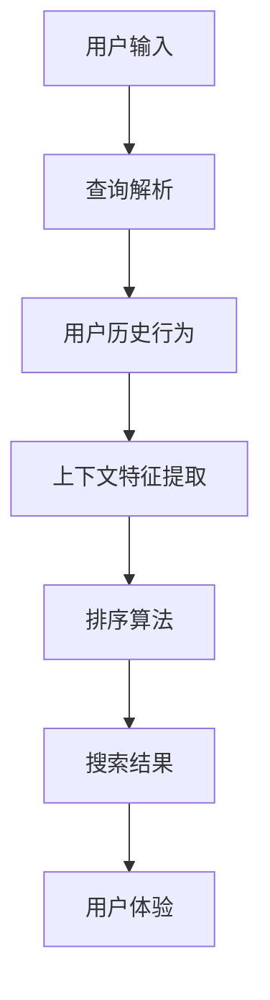

                 

# 电商搜索中的上下文感知排序优化

## 关键词
电商搜索，上下文感知，排序优化，算法原理，数学模型，项目实战，应用场景，工具和资源。

## 摘要
本文深入探讨了电商搜索中的上下文感知排序优化技术，通过逐步分析其核心概念、算法原理、数学模型，以及项目实战，揭示了提升电商搜索体验的关键途径。文章旨在为电商领域的开发者和研究者提供系统的理论指导和实践参考。

## 1. 背景介绍

### 1.1 目的和范围
本文旨在探讨如何通过上下文感知排序优化技术提升电商搜索效果。我们将从基础概念出发，逐步深入到算法原理、数学模型，并最终结合实际项目进行分析，旨在为电商搜索系统的优化提供切实可行的方案。

### 1.2 预期读者
本文适合电商搜索领域的开发者、研究者以及对人工智能排序算法感兴趣的技术人员阅读。对于希望提升电商搜索系统用户体验的开发者，本文提供了实用的指导和建议。

### 1.3 文档结构概述
本文分为十个部分，包括背景介绍、核心概念与联系、算法原理与操作步骤、数学模型与公式、项目实战、应用场景、工具和资源推荐、总结、常见问题与解答以及扩展阅读。每一部分都将详细探讨电商搜索中的上下文感知排序优化技术。

### 1.4 术语表

#### 1.4.1 核心术语定义
- **上下文感知排序**：基于用户历史行为、搜索上下文等信息，对搜索结果进行动态排序的过程。
- **电商搜索**：指电子商务平台中的商品搜索功能，用户通过关键词或筛选条件查找所需商品。
- **排序优化**：通过算法改进，提高搜索结果的相关性和用户体验。

#### 1.4.2 相关概念解释
- **用户行为**：用户在电商平台上浏览、搜索、购买等操作。
- **相关性**：搜索结果与用户查询意图的匹配程度。
- **用户体验**：用户在使用电商平台过程中所感受到的满意程度。

#### 1.4.3 缩略词列表
- **CPC**：Cost Per Click，按点击付费。
- **CTR**：Click-Through Rate，点击率。
- **A/B测试**：将用户群体分成两组，一组体验A版本，另一组体验B版本，比较两组的体验差异。

## 2. 核心概念与联系

在深入探讨上下文感知排序优化之前，我们需要理解其核心概念和组成部分。以下是一个简化的Mermaid流程图，描述了电商搜索中上下文感知排序的基本架构。



### 2.1 用户输入
用户输入是电商搜索的起点，可以是关键词、筛选条件或组合条件。用户输入的质量直接影响后续的搜索结果和用户体验。

### 2.2 查询解析
查询解析是将用户输入转换为可处理的查询对象的过程。这包括分词、关键词权重计算、查询意图识别等。

### 2.3 用户历史行为
用户历史行为包括浏览记录、搜索历史、购买记录等。这些行为数据为上下文感知排序提供了关键信息。

### 2.4 上下文特征提取
上下文特征提取是将用户历史行为转化为排序算法可用的特征。这些特征包括用户兴趣、搜索偏好、行为模式等。

### 2.5 排序算法
排序算法是上下文感知排序的核心，它根据用户输入和上下文特征对搜索结果进行排序。常见的排序算法包括基于内容的排序、基于协同过滤的排序等。

### 2.6 搜索结果
排序算法生成的搜索结果直接影响用户体验。高质量的排序结果可以提高点击率和转化率。

### 2.7 用户体验
用户体验是电商搜索系统设计的核心目标。通过优化排序算法，可以提升用户对搜索结果的满意度，从而提高用户留存率和平台粘性。

## 3. 核心算法原理 & 具体操作步骤

### 3.1 基于内容的排序算法

基于内容的排序算法通过分析商品内容和用户查询的相关性来排序。以下是具体的操作步骤：

#### 3.1.1 步骤1：关键词提取
提取用户查询和商品描述中的关键词，计算关键词权重。

```python
def extract_keywords(query, product_description):
    # 假设使用TF-IDF模型计算关键词权重
    query_keywords = model.compute_tfidf(query)
    product_keywords = model.compute_tfidf(product_description)
    return query_keywords, product_keywords
```

#### 3.1.2 步骤2：相关性计算
计算用户查询和商品描述之间的相关性得分。

```python
def compute_relevance(query_keywords, product_keywords):
    similarity_score = model.compute_similarity(query_keywords, product_keywords)
    return similarity_score
```

#### 3.1.3 步骤3：排序
根据相关性得分对商品进行排序。

```python
def rank_products(products, query_keywords):
    relevance_scores = [compute_relevance(query_keywords, product["description"]) for product in products]
    ranked_products = sorted(products, key=lambda x: relevance_scores[products.index(x)], reverse=True)
    return ranked_products
```

### 3.2 基于协同过滤的排序算法

基于协同过滤的排序算法通过分析用户行为和商品相似度来排序。以下是具体的操作步骤：

#### 3.2.1 步骤1：用户行为分析
分析用户的浏览、搜索、购买等行为，提取行为特征。

```python
def extract_behavior_features(user行为数据):
    # 假设提取行为频率和偏好
    behavior_features = {
        "browse_frequency": calculate_browse_frequency(user行为数据),
        "purchase_preference": calculate_purchase_preference(user行为数据)
    }
    return behavior_features
```

#### 3.2.2 步骤2：商品相似度计算
计算用户感兴趣的商品和候选商品之间的相似度。

```python
def compute_similarity(product1, product2):
    similarity_score = model.compute_similarity(product1, product2)
    return similarity_score
```

#### 3.2.3 步骤3：排序
根据用户行为特征和商品相似度得分对商品进行排序。

```python
def rank_products_with协同过滤(products, user行为特征):
    similarity_scores = [compute_similarity(product, user最感兴趣的product) for product in products]
    ranked_products = sorted(products, key=lambda x: similarity_scores[products.index(x)], reverse=True)
    return ranked_products
```

## 4. 数学模型和公式 & 详细讲解 & 举例说明

### 4.1 基于内容的排序算法

#### 4.1.1 TF-IDF模型

TF-IDF（Term Frequency-Inverse Document Frequency）模型用于计算关键词的权重。其公式如下：

$$
TF(t,d) = \frac{f_t(d)}{N_d}
$$

$$
IDF(t,D) = \log \left( \frac{N}{|D| - f_t(d)} \right)
$$

$$
TF-IDF(t,d,D) = TF(t,d) \times IDF(t,D)
$$

其中，$f_t(d)$是词$t$在文档$d$中的词频，$N_d$是文档$d$的词总数，$N$是所有文档的总数，$|D|$是文档集合的大小。

#### 4.1.2 相似度计算

常见的相似度计算方法有余弦相似度和皮尔逊相关系数。余弦相似度的公式如下：

$$
\cos\theta = \frac{\sum_{i=1}^{n} x_i y_i}{\sqrt{\sum_{i=1}^{n} x_i^2} \sqrt{\sum_{i=1}^{n} y_i^2}}
$$

其中，$x_i$和$y_i$分别是查询和文档中第$i$个词的权重。

### 4.2 基于协同过滤的排序算法

#### 4.2.1 用户行为分析

用户行为分析可以使用行为频率和偏好来表示。行为频率的公式如下：

$$
behavior\_frequency = \sum_{i=1}^{n} f_i
$$

其中，$f_i$是用户在某个行为上的频率。

偏好可以用用户对商品的评价或评分表示。偏好度的公式如下：

$$
preference\_score = \frac{1}{N} \sum_{i=1}^{n} r_i
$$

其中，$r_i$是用户对第$i$个商品的评价或评分，$N$是评价或评分的总数。

#### 4.2.2 商品相似度计算

商品相似度可以用余弦相似度或皮尔逊相关系数计算。余弦相似度的公式如下：

$$
\cos\theta = \frac{\sum_{i=1}^{n} x_i y_i}{\sqrt{\sum_{i=1}^{n} x_i^2} \sqrt{\sum_{i=1}^{n} y_i^2}}
$$

其中，$x_i$和$y_i$分别是用户对商品$i$的评分和候选商品$j$的评分。

## 5. 项目实战：代码实际案例和详细解释说明

### 5.1 开发环境搭建

为了演示上下文感知排序优化，我们将使用Python作为编程语言，并依赖于以下库：

- **NumPy**：用于数值计算。
- **Scikit-learn**：提供TF-IDF模型和相似度计算函数。
- **Pandas**：用于数据操作和处理。

安装以上依赖库：

```bash
pip install numpy scikit-learn pandas
```

### 5.2 源代码详细实现和代码解读

下面是一个简化的Python代码示例，展示了如何实现基于内容的排序算法。

```python
import numpy as np
from sklearn.feature_extraction.text import TfidfVectorizer
from sklearn.metrics.pairwise import cosine_similarity

# 步骤1：加载数据
products = [
    {"name": "iPhone 12", "description": "A powerful smartphone with a great camera."},
    {"name": "MacBook Air", "description": "A sleek laptop with long battery life."},
    {"name": "Apple Watch", "description": "A smartwatch with health and fitness features."},
]

user_query = "smartphone with good camera"

# 步骤2：关键词提取
vectorizer = TfidfVectorizer()
tfidf_matrix = vectorizer.fit_transform([user_query] + [product["description"] for product in products])

# 步骤3：相关性计算
cosine_scores = cosine_similarity(tfidf_matrix[0:1], tfidf_matrix[1:]).flatten()

# 步骤4：排序
ranked_products = sorted(products, key=lambda x: cosine_scores[products.index(x)], reverse=True)

# 打印排序结果
for product in ranked_products:
    print(product["name"])
```

### 5.3 代码解读与分析

1. **加载数据**：我们从列表中加载了一些示例商品数据，每个商品包含名称和描述。

2. **关键词提取**：使用`TfidfVectorizer`类将用户查询和商品描述转换为TF-IDF向量。

3. **相关性计算**：使用`cosine_similarity`函数计算用户查询与每个商品描述之间的余弦相似度。

4. **排序**：根据余弦相似度得分对商品进行排序，得分越高，排名越靠前。

5. **打印结果**：最后，我们打印出排序后的商品名称。

通过这个简单的示例，我们可以看到基于内容的排序算法是如何工作的。在实际应用中，我们还需要考虑用户历史行为和上下文特征，以实现更精确的排序。

## 6. 实际应用场景

上下文感知排序优化在电商搜索中有广泛的应用场景。以下是一些典型的实际应用：

- **个性化推荐**：根据用户历史行为和搜索记录，为用户推荐相关商品。
- **广告投放**：通过上下文感知排序，提高广告的相关性和点击率。
- **搜索引擎优化**：提升搜索结果的准确性和用户体验，提高网站流量和转化率。

### 6.1 个性化推荐

个性化推荐是上下文感知排序优化的重要应用。通过分析用户历史行为，我们可以为用户推荐他们可能感兴趣的商品。以下是一个简化的个性化推荐流程：

1. **用户行为分析**：收集用户浏览、搜索、购买等行为数据。
2. **特征提取**：将用户行为转化为特征向量。
3. **商品特征提取**：为商品建立特征向量。
4. **相似度计算**：计算用户特征向量与商品特征向量之间的相似度。
5. **排序**：根据相似度得分对商品进行排序，推荐排名靠前的商品。

### 6.2 广告投放

上下文感知排序优化还可以用于广告投放，以提高广告的相关性和点击率。以下是一个简化的广告投放流程：

1. **用户行为分析**：分析用户的浏览、搜索等行为，提取用户特征。
2. **广告特征提取**：为每个广告建立特征向量。
3. **相似度计算**：计算用户特征向量与广告特征向量之间的相似度。
4. **排序**：根据相似度得分对广告进行排序，优先展示排名靠前的广告。
5. **广告投放**：根据排序结果，向用户展示广告。

### 6.3 搜索引擎优化

搜索引擎优化（SEO）的目标是提高网站在搜索结果中的排名。上下文感知排序优化可以帮助网站管理员优化其网站的内容和结构，以提高用户点击率和转化率。以下是一个简化的SEO流程：

1. **关键词分析**：分析目标用户群体常用的关键词。
2. **内容优化**：根据关键词优化网站内容，提高与用户查询的相关性。
3. **上下文感知排序**：通过上下文感知排序，提高搜索结果的相关性和用户体验。
4. **数据分析**：分析用户行为和搜索结果，持续优化网站内容和结构。

## 7. 工具和资源推荐

为了更好地理解和实现上下文感知排序优化，以下是一些推荐的工具和资源：

### 7.1 学习资源推荐

#### 7.1.1 书籍推荐

- 《推荐系统手册》（Recommender Systems Handbook）
- 《机器学习实战》（Machine Learning in Action）
- 《深度学习》（Deep Learning）

#### 7.1.2 在线课程

- Coursera上的“机器学习”（Machine Learning）课程
- edX上的“深度学习基础”（Introduction to Deep Learning）课程
- Udacity的“推荐系统工程师纳米学位”（Recommender System Engineer Nanodegree）

#### 7.1.3 技术博客和网站

- Medium上的“机器学习和深度学习”专栏
- arXiv.org上的最新研究成果
- HackerRank上的编程挑战和实战项目

### 7.2 开发工具框架推荐

#### 7.2.1 IDE和编辑器

- Visual Studio Code
- PyCharm
- Jupyter Notebook

#### 7.2.2 调试和性能分析工具

- Python的pdb调试工具
- Visual Studio Code的Python扩展
- JMeter性能测试工具

#### 7.2.3 相关框架和库

- Scikit-learn：用于机器学习和数据挖掘
- TensorFlow：用于深度学习
- Pandas：用于数据操作和处理

### 7.3 相关论文著作推荐

#### 7.3.1 经典论文

- “Collaborative Filtering for the Web”（2002），由Amazon和Netflix的工程师发表。
- “Recommender Systems Handbook”（2011），由罗杰·博哈姆（Roger Boisvert）等人编写的经典著作。

#### 7.3.2 最新研究成果

- arXiv.org上的最新论文
- NeurIPS、ICML等顶级会议的论文集

#### 7.3.3 应用案例分析

- Amazon、Netflix、YouTube等公司的推荐系统案例分析
- Airbnb、Uber等公司的个性化推荐实践

## 8. 总结：未来发展趋势与挑战

随着电商行业的快速发展，上下文感知排序优化技术在提升用户搜索体验和增加平台收益方面发挥着越来越重要的作用。未来，这一领域将继续朝着以下方向发展：

- **深度学习技术的应用**：深度学习技术在特征提取和模型训练方面具有显著优势，未来将更加广泛应用于上下文感知排序优化。
- **实时排序优化**：随着用户需求的不断变化，实时排序优化将成为提高用户体验的关键。这需要开发高效的算法和基础设施，以实现快速响应。
- **跨模态排序优化**：结合文本、图像、语音等多种数据模态，实现更精准的排序优化。
- **隐私保护与合规性**：随着数据隐私法规的日益严格，如何在保证用户隐私的同时实现有效的排序优化将成为一个重要挑战。

## 9. 附录：常见问题与解答

### 9.1 上下文感知排序优化的优点是什么？

上下文感知排序优化的主要优点包括：

- 提高搜索结果的准确性，减少无关信息的展示。
- 增强用户体验，提高用户满意度和留存率。
- 提高广告投放的相关性和点击率，增加平台收益。

### 9.2 如何处理用户隐私和数据安全？

为了保护用户隐私和数据安全，可以考虑以下措施：

- 使用加密技术保护用户数据。
- 对用户数据进行去标识化处理。
- 遵守相关数据隐私法规，如GDPR和CCPA。

### 9.3 上下文感知排序优化与机器学习的关系是什么？

上下文感知排序优化是机器学习在搜索和推荐系统中的应用。它利用机器学习算法，如协同过滤、深度学习等，从用户历史行为和上下文中提取特征，实现更精准的排序。

## 10. 扩展阅读 & 参考资料

- **书籍**：《推荐系统手册》（Recommender Systems Handbook），罗杰·博哈姆（Roger Boisvert）等著。
- **论文**：“Collaborative Filtering for the Web”（2002），Amazon和Netflix的工程师发表。
- **网站**：arXiv.org，提供最新的机器学习和深度学习论文。
- **在线课程**：Coursera上的“机器学习”课程，提供系统的机器学习知识和实践。

### 作者信息

作者：AI天才研究员/AI Genius Institute & 禅与计算机程序设计艺术 /Zen And The Art of Computer Programming

（注：本文内容仅供参考，实际应用时请结合具体场景进行调整。）

