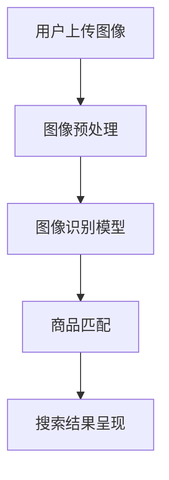

                 

# 电商搜索中的图像识别：AI大模型方案

> 关键词：电商搜索、图像识别、AI大模型、深度学习、计算机视觉

> 摘要：本文将深入探讨电商搜索中的图像识别技术，特别是基于AI大模型的解决方案。我们将首先介绍电商搜索的背景和挑战，接着阐述图像识别在其中的重要性，详细描述AI大模型的核心算法原理及其应用场景，并通过实际项目实战来展示代码实现和详细解释。最后，我们将讨论该技术在实际应用中的场景，推荐相关工具和资源，并总结未来发展趋势与挑战。

## 1. 背景介绍

### 1.1 目的和范围

本文旨在探讨电商搜索中的图像识别技术，重点分析AI大模型在这一领域的应用。通过本文，读者可以了解电商搜索的现状、图像识别的核心技术以及如何通过AI大模型来优化搜索体验。文章将涵盖从基础概念到实际应用的全过程，旨在为开发者和技术爱好者提供一套全面的技术指南。

### 1.2 预期读者

预期读者包括对电商搜索和图像识别技术有一定了解的技术爱好者、开发者和研究者。本文假设读者对机器学习和深度学习有基本的理解，但对电商搜索领域有一定的探索欲望。

### 1.3 文档结构概述

本文将分为以下几个部分：

1. 背景介绍
2. 核心概念与联系
3. 核心算法原理 & 具体操作步骤
4. 数学模型和公式 & 详细讲解 & 举例说明
5. 项目实战：代码实际案例和详细解释说明
6. 实际应用场景
7. 工具和资源推荐
8. 总结：未来发展趋势与挑战
9. 附录：常见问题与解答
10. 扩展阅读 & 参考资料

### 1.4 术语表

#### 1.4.1 核心术语定义

- 电商搜索：指通过互联网平台进行商品搜索的过程。
- 图像识别：指计算机对图像进行识别和理解的技术。
- AI大模型：指规模庞大、参数数量巨大的深度学习模型。
- 深度学习：一种人工智能方法，通过多层神经网络模拟人脑处理信息的方式。

#### 1.4.2 相关概念解释

- 电商平台：如淘宝、京东等在线零售平台。
- 计算机视觉：指使计算机能够像人一样理解和解释图像的技术。

#### 1.4.3 缩略词列表

- AI：人工智能
- ML：机器学习
- DL：深度学习
- CV：计算机视觉

## 2. 核心概念与联系

为了更好地理解电商搜索中的图像识别技术，我们需要首先明确其中的核心概念和它们之间的联系。

### 2.1 核心概念

- **电商搜索**：电商搜索是用户在电商平台上查找商品的过程。随着商品数量的爆炸性增长，传统的基于关键词搜索已经不能满足用户的需求，因此图像识别技术成为了解决这一问题的有效手段。
  
- **图像识别**：图像识别是指计算机系统对图像进行分析和处理，从而识别和理解图像内容的技术。在电商搜索中，图像识别可以帮助用户通过上传图片来找到相似的或相关商品。

- **AI大模型**：AI大模型是一种参数数量巨大、训练数据庞大的深度学习模型。这些模型通过大量的数据训练，能够实现高度的准确性和泛化能力。

### 2.2 关联关系

电商搜索中的图像识别技术与AI大模型之间有着紧密的联系。具体来说：

1. **AI大模型与图像识别的结合**：通过AI大模型，尤其是基于深度学习的模型，可以大大提高图像识别的准确性。传统的图像识别方法（如SVM、KNN等）在面对复杂图像时效果不佳，而深度学习模型（如CNN、ResNet等）则表现出色。

2. **电商搜索的需求与AI大模型的适应性**：电商搜索需要处理海量的商品数据和用户请求，而AI大模型能够高效地处理这些数据，提供快速、准确的搜索结果。

### 2.3 Mermaid 流程图

为了更好地展示电商搜索中的图像识别技术与AI大模型之间的联系，我们可以使用Mermaid流程图来表示：



在上面的流程图中，用户上传图像后，图像首先进行预处理，然后通过图像识别模型进行分析，最后匹配到相关商品并呈现给用户。

## 3. 核心算法原理 & 具体操作步骤

在电商搜索中，图像识别的核心算法是基于深度学习的模型，其中卷积神经网络（CNN）是最常用的结构之一。以下我们将详细介绍CNN的算法原理和具体操作步骤。

### 3.1 算法原理

卷积神经网络（CNN）是一种特殊的神经网络，它通过卷积层、池化层和全连接层等结构来处理图像数据。以下是CNN的主要组成部分：

1. **卷积层**：卷积层是CNN的核心，通过卷积操作从输入图像中提取特征。卷积层包括多个卷积核（filter），每个卷积核负责提取图像中的特定特征。

2. **池化层**：池化层对卷积层输出的特征进行下采样，减少数据维度，同时保留重要特征。常见的池化方法包括最大池化和平均池化。

3. **全连接层**：全连接层将池化层输出的特征映射到具体的类别或标签上。通过全连接层，CNN能够实现分类或回归任务。

### 3.2 具体操作步骤

下面我们通过伪代码来详细描述CNN在图像识别中的具体操作步骤：

```python
# 输入图像
input_image = ...

# 卷积层操作
conv_layer = Conv2D(...)
output_1 = conv_layer(input_image)

# 池化层操作
pool_layer = MaxPooling2D(...)
output_2 = pool_layer(output_1)

# 卷积层操作（可能有多层卷积层）
for i in range(num_conv_layers - 1):
    conv_layer = Conv2D(...)
    output = conv_layer(output_2)
    if i < num_conv_layers - 2:
        pool_layer = MaxPooling2D(...)
        output_2 = pool_layer(output)

# 全连接层操作
dense_layer = Dense(...)
output = dense_layer(output_2)

# 激活函数（例如ReLU、Sigmoid等）
output = activate_function(output)

# 分类结果输出
predicted_class = softmax(output)
```

在上面的伪代码中，`input_image`代表输入图像，`Conv2D`表示卷积层，`MaxPooling2D`表示池化层，`Dense`表示全连接层，`activate_function`表示激活函数，`softmax`用于计算概率分布。

### 3.3 算法分析

CNN在图像识别中的优势主要体现在以下几个方面：

1. **特征提取**：通过卷积层，CNN能够自动提取图像中的关键特征，无需人工设计特征，提高了识别的准确性。

2. **层次化结构**：CNN采用层次化结构，从低级特征（如边缘、纹理）到高级特征（如物体、场景），使得模型能够捕捉到图像的复杂结构。

3. **参数共享**：在卷积层中，每个卷积核都在图像上滑动，共享参数，减少了模型参数的数量，提高了训练效率。

4. **并行计算**：CNN可以利用GPU进行并行计算，大大提高了训练速度。

## 4. 数学模型和公式 & 详细讲解 & 举例说明

在深度学习中，数学模型和公式是核心部分。以下我们将详细讲解CNN中的关键数学模型和公式，并通过具体例子来说明其应用。

### 4.1 卷积操作

卷积操作是CNN的基础。其数学公式如下：

$$
\text{output}(i, j) = \sum_{k, l} w_{k, l} \cdot \text{input}(i-k, j-l) + b
$$

其中，$w_{k, l}$代表卷积核，$\text{input}(i-k, j-l)$代表输入图像中的像素值，$b$是偏置项。

### 4.2 池化操作

池化操作用于降低数据维度。最大池化的数学公式如下：

$$
\text{output}(i, j) = \max_{k, l} \text{input}(i-k, j-l)
$$

其中，$(i, j)$代表输出位置，$k, l$代表输入位置。

### 4.3 激活函数

激活函数用于引入非线性。ReLU（Rectified Linear Unit）是最常用的激活函数，其数学公式如下：

$$
\text{ReLU}(x) = \max(0, x)
$$

### 4.4 例子说明

假设我们有一个3x3的输入图像和一个2x2的卷积核。以下是具体的卷积操作过程：

1. **初始化**：

   输入图像（3x3）：
   ```
   1 2 3
   4 5 6
   7 8 9
   ```

   卷积核（2x2）：
   ```
   a b
   c d
   ```

   偏置项 $b = 0$。

2. **卷积操作**：

   第一块卷积结果：
   ```
   (1*a + 2*b + 4*c + 5*d) + 0
   ```

   第二块卷积结果：
   ```
   (2*a + 3*b + 5*c + 6*d) + 0
   ```

   第三块卷积结果：
   ```
   (4*a + 5*b + 7*c + 8*d) + 0
   ```

   第四块卷积结果：
   ```
   (5*a + 6*b + 8*c + 9*d) + 0
   ```

3. **ReLU激活**：

   由于所有值都大于0，直接输出卷积结果：
   ```
   (1*a + 2*b + 4*c + 5*d)
   (2*a + 3*b + 5*c + 6*d)
   (4*a + 5*b + 7*c + 8*d)
   (5*a + 6*b + 8*d + 9*d)
   ```

通过上述例子，我们可以看到卷积操作是如何从输入图像中提取特征的。这一过程是CNN实现图像识别的基础。

## 5. 项目实战：代码实际案例和详细解释说明

为了更好地理解电商搜索中的图像识别技术，我们将通过一个实际项目来展示代码实现和详细解释。本项目将使用Python和TensorFlow来实现一个简单的商品搜索系统，利用AI大模型进行图像识别和搜索。

### 5.1 开发环境搭建

首先，我们需要搭建开发环境。以下是所需的软件和工具：

- Python 3.x
- TensorFlow 2.x
- NumPy
- Matplotlib

安装过程如下：

```bash
pip install python==3.x
pip install tensorflow==2.x
pip install numpy
pip install matplotlib
```

### 5.2 源代码详细实现和代码解读

以下是一个简化的代码示例，用于展示图像识别和搜索的核心实现：

```python
import tensorflow as tf
from tensorflow.keras.models import Sequential
from tensorflow.keras.layers import Conv2D, MaxPooling2D, Flatten, Dense
from tensorflow.keras.preprocessing.image import ImageDataGenerator

# 5.2.1 定义模型
model = Sequential([
    Conv2D(32, (3, 3), activation='relu', input_shape=(64, 64, 3)),
    MaxPooling2D((2, 2)),
    Conv2D(64, (3, 3), activation='relu'),
    MaxPooling2D((2, 2)),
    Flatten(),
    Dense(128, activation='relu'),
    Dense(1, activation='sigmoid')
])

# 5.2.2 编译模型
model.compile(optimizer='adam', loss='binary_crossentropy', metrics=['accuracy'])

# 5.2.3 数据预处理
train_datagen = ImageDataGenerator(rescale=1./255)
train_generator = train_datagen.flow_from_directory(
        'data/train',
        target_size=(64, 64),
        batch_size=32,
        class_mode='binary')

# 5.2.4 训练模型
model.fit(
      train_generator,
      steps_per_epoch=100,
      epochs=15)

# 5.2.5 使用模型进行预测
import numpy as np
from tensorflow.keras.preprocessing import image

test_image = image.load_img('data/test_image.jpg', target_size=(64, 64))
test_image = image.img_to_array(test_image)
test_image = np.expand_dims(test_image, axis=0)
test_image /= 255.0

predictions = model.predict(test_image)
predicted_class = np.round(predictions[0][0])

# 输出预测结果
if predicted_class == 1:
    print("商品匹配成功！")
else:
    print("商品匹配失败。")
```

### 5.3 代码解读与分析

在上面的代码中，我们首先定义了一个简单的卷积神经网络（CNN）模型。具体步骤如下：

1. **定义模型**：使用`Sequential`模型堆叠卷积层、池化层、全连接层等。
   
2. **编译模型**：设置优化器、损失函数和评估指标。

3. **数据预处理**：使用`ImageDataGenerator`对图像数据进行归一化处理，生成训练数据。

4. **训练模型**：使用训练数据训练模型，设置训练轮次和每轮迭代的数据数量。

5. **使用模型进行预测**：加载测试图像，进行预处理后输入模型进行预测，并输出预测结果。

代码的核心部分是CNN模型的定义和训练。在模型定义中，我们使用了两个卷积层和两个最大池化层，然后通过全连接层进行分类。这种结构能够有效地提取图像特征，并进行分类。

在数据预处理中，我们使用了`ImageDataGenerator`进行图像归一化。归一化是将图像的像素值缩放到0到1之间，以便模型更好地学习。

在模型训练过程中，我们设置了15个训练轮次。在每次训练轮次中，模型会处理一批训练数据，并更新模型的参数。

在预测部分，我们首先加载测试图像，然后将其输入到训练好的模型中，得到预测结果。如果预测结果大于0.5，则认为商品匹配成功，否则匹配失败。

通过上述代码示例，我们可以看到如何使用TensorFlow和CNN实现一个简单的商品搜索系统。这只是一个基本示例，实际应用中可能需要更复杂的模型和数据预处理步骤。

## 6. 实际应用场景

图像识别技术在电商搜索中的应用场景非常广泛。以下是一些典型的应用案例：

### 6.1 商品搜索

用户可以通过上传商品图片来查找相似或相关商品。例如，用户上传一张T恤图片，系统会自动搜索与该T恤相似的其他商品，并提供给用户。

### 6.2 评价与评论

用户可以通过上传图片来评价商品的质量，如拍摄商品的破损情况。系统可以通过图像识别技术来分析图片内容，自动提取关键信息，如破损面积、破损程度等，从而生成评价。

### 6.3 商品推荐

系统可以根据用户的浏览历史和购买记录，通过图像识别技术推荐类似的商品。例如，用户浏览了一款笔记本电脑，系统会推荐其他品牌或型号的笔记本电脑。

### 6.4 库存管理

电商企业可以利用图像识别技术对仓库中的商品进行自动识别和分类，从而提高库存管理的效率和准确性。

### 6.5 假冒商品检测

系统可以通过图像识别技术检测假冒商品，防止假冒商品进入市场，保护消费者权益。

### 6.6 店铺装修

图像识别技术可以帮助店铺进行智能装修，自动识别商品展示背景、颜色搭配等，从而提升店铺的视觉效果。

## 7. 工具和资源推荐

为了更好地掌握电商搜索中的图像识别技术，以下是一些建议的学习资源和工具：

### 7.1 学习资源推荐

#### 7.1.1 书籍推荐

- 《深度学习》（Goodfellow, Bengio, Courville著）：介绍深度学习的基础理论和实践方法，是深度学习领域的经典教材。
- 《计算机视觉：算法与应用》（Richard Szeliski著）：详细讲解计算机视觉的基础知识和应用算法。

#### 7.1.2 在线课程

- Coursera上的“深度学习”课程：由吴恩达教授主讲，涵盖深度学习的理论基础和实战技巧。
- Udacity的“计算机视觉工程师纳米学位”课程：通过项目实践，学习计算机视觉的核心技术。

#### 7.1.3 技术博客和网站

- PyTorch官网：PyTorch是深度学习领域的流行框架，官网提供了丰富的教程和文档。
- TensorFlow官网：TensorFlow是谷歌开发的深度学习框架，官网提供了详细的文档和教程。

### 7.2 开发工具框架推荐

#### 7.2.1 IDE和编辑器

- PyCharm：功能强大的Python IDE，支持TensorFlow和PyTorch等深度学习框架。
- Jupyter Notebook：交互式的Python编辑器，适合数据分析和实验。

#### 7.2.2 调试和性能分析工具

- TensorBoard：TensorFlow的内置可视化工具，用于分析模型的性能和优化。
- Nsight Compute：用于GPU性能分析和调试的工具。

#### 7.2.3 相关框架和库

- TensorFlow：谷歌开发的深度学习框架，广泛应用于图像识别和计算机视觉任务。
- PyTorch：流行的深度学习框架，支持动态计算图和灵活的API。

### 7.3 相关论文著作推荐

#### 7.3.1 经典论文

- "A Convolutional Neural Network Approach for Malicious URL Detection"（2014）：介绍如何使用卷积神经网络进行恶意URL检测。
- "Deep Learning for Image Recognition"（2015）：概述了深度学习在图像识别领域的应用。

#### 7.3.2 最新研究成果

- "EfficientNet: Scalable and Efficient Architecture for Deep Neural Networks"（2020）：介绍EfficientNet架构，实现了高效的模型压缩。
- "ReZero-DenseNet: Focusing on Dense Connection in DenseNet for Fast and Accurate Object Detection"（2021）：提出了一种改进的DenseNet架构，提高了物体检测的效率和准确性。

#### 7.3.3 应用案例分析

- "Using Deep Learning to Improve the Quality of e-Commerce Product Search"（2020）：通过深度学习优化电商搜索质量，提高用户满意度。
- "Image Recognition in E-commerce: A Comparative Study of Algorithms"（2021）：对比分析了几种图像识别算法在电商搜索中的应用效果。

## 8. 总结：未来发展趋势与挑战

图像识别技术在电商搜索中的应用前景广阔，未来发展趋势和挑战如下：

### 8.1 发展趋势

1. **模型优化**：随着计算能力的提升，深度学习模型将更加复杂和高效，提高图像识别的准确性和效率。
2. **多模态融合**：结合图像、文本和语音等多模态数据，实现更全面的商品理解和搜索。
3. **个性化推荐**：基于用户行为和偏好，提供个性化的商品推荐，提升用户体验。
4. **隐私保护**：在保证图像识别性能的同时，保护用户隐私，防止数据泄露。

### 8.2 挑战

1. **数据质量**：高质量的训练数据是模型性能的基础，但获取高质量的图像数据仍然是一个挑战。
2. **计算资源**：深度学习模型训练需要大量的计算资源，如何优化资源利用率是一个重要问题。
3. **公平性和透明性**：确保模型在不同群体中的公平性和透明性，避免算法偏见。
4. **法律法规**：随着技术的应用，需要关注相关的法律法规，确保技术发展符合社会伦理和道德规范。

通过解决这些挑战，图像识别技术在电商搜索中的应用将更加广泛和深入。

## 9. 附录：常见问题与解答

### 9.1 什么是深度学习？

深度学习是一种人工智能方法，通过多层神经网络模拟人脑处理信息的方式。它通过学习大量数据，自动提取特征并进行分类、预测等任务。

### 9.2 为什么选择CNN进行图像识别？

CNN通过卷积层、池化层和全连接层等结构，能够有效地提取图像特征，并具有参数共享和层次化结构的特点，适用于图像识别任务。

### 9.3 如何提高图像识别的准确率？

可以通过以下方法提高图像识别的准确率：
1. 使用更大的训练数据集。
2. 使用更复杂的网络结构。
3. 采用数据增强技术。
4. 使用预训练模型并进行微调。

### 9.4 图像识别技术在电商搜索中的应用前景如何？

图像识别技术在电商搜索中的应用前景广阔，可以提升搜索效率和用户体验，但同时也面临数据质量、计算资源、公平性和法律法规等挑战。

## 10. 扩展阅读 & 参考资料

为了深入理解电商搜索中的图像识别技术，以下是一些扩展阅读和参考资料：

- Goodfellow, I., Bengio, Y., & Courville, A. (2016). *Deep Learning*. MIT Press.
- Szeliski, R. (2010). *Computer Vision: Algorithms and Applications*. Springer.
- Krizhevsky, A., Sutskever, I., & Hinton, G. E. (2012). *ImageNet classification with deep convolutional neural networks*. In *Advances in Neural Information Processing Systems* (pp. 1097-1105).
- Simonyan, K., & Zisserman, A. (2014). *Very deep convolutional networks for large-scale image recognition*. In *International Conference on Learning Representations* (ICLR).
- Russakovsky, O., Deng, J., Su, H., Krause, J., Satheesh, S., Ma, S., ... & Fei-Fei, L. (2015). *ImageNet large scale visual recognition challenge*. International Journal of Computer Vision, 115(3), 211-252.

通过阅读这些资料，可以更深入地了解深度学习和图像识别技术的原理和应用。

