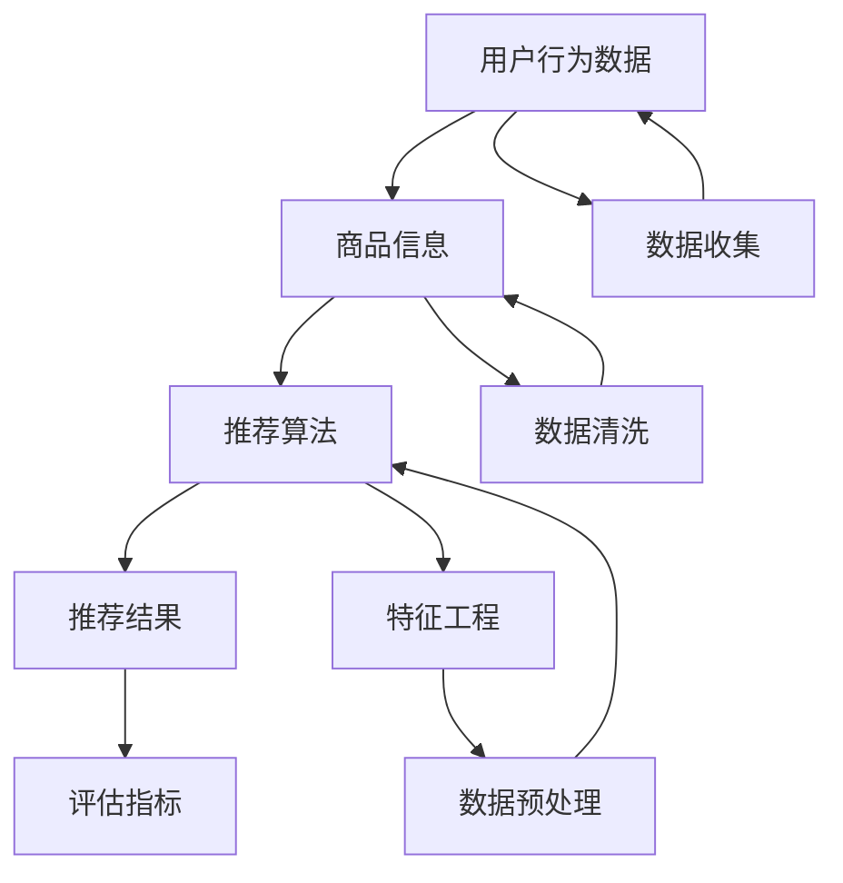

                 

## 电商搜索推荐中的AI大模型数据不平衡问题benchmark

> **关键词：** 电商搜索推荐，AI大模型，数据不平衡， benchmark，机器学习，解决策略，优化方法

> **摘要：** 本文深入探讨了电商搜索推荐系统中常见的AI大模型数据不平衡问题，从背景介绍、核心算法原理、数学模型讲解、项目实战以及实际应用场景等多个方面，详细分析了数据不平衡问题的成因和解决策略。文章旨在为从事电商搜索推荐系统开发的工程师提供一套完整的解决思路和方法，以实现更加精准、高效的用户推荐效果。

在电子商务的飞速发展的今天，搜索引擎和推荐系统已经成为电商平台吸引用户、提升转化率的重要手段。随着人工智能技术的不断进步，特别是大规模预训练模型（如BERT、GPT等）的广泛应用，电商搜索推荐系统在性能和用户体验方面取得了显著提升。然而，这些AI大模型在处理数据不平衡问题时面临着诸多挑战。本文将针对这一问题进行详细分析，并提供有效的解决策略。

### 1. 背景介绍

#### 1.1 目的和范围

本文的目标是探讨电商搜索推荐系统中AI大模型面临的常见问题——数据不平衡，并详细分析其原因和解决方法。本文将涵盖以下主要内容：

1. 电商搜索推荐系统的发展背景和重要性
2. 数据不平衡问题的定义及其在电商搜索推荐系统中的表现
3. 数据不平衡问题的成因和影响
4. 解决数据不平衡问题的核心算法原理和数学模型
5. 实际应用场景中的解决方案和优化方法
6. 相关工具和资源推荐

#### 1.2 预期读者

本文主要面向以下读者：

1. 电商搜索推荐系统开发工程师
2. 机器学习工程师和AI算法研究人员
3. 对电商搜索推荐和数据不平衡问题感兴趣的技术爱好者

#### 1.3 文档结构概述

本文结构如下：

1. 背景介绍：介绍本文的目的、范围、预期读者以及文档结构。
2. 核心概念与联系：解释电商搜索推荐系统中的核心概念和联系，并给出流程图。
3. 核心算法原理 & 具体操作步骤：详细阐述解决数据不平衡问题的核心算法原理和步骤。
4. 数学模型和公式 & 详细讲解 & 举例说明：讲解解决数据不平衡问题的数学模型和具体公式，并给出实例说明。
5. 项目实战：代码实际案例和详细解释说明。
6. 实际应用场景：分析数据不平衡问题在电商搜索推荐系统中的应用场景。
7. 工具和资源推荐：推荐学习资源、开发工具和框架。
8. 总结：未来发展趋势与挑战。
9. 附录：常见问题与解答。
10. 扩展阅读 & 参考资料。

#### 1.4 术语表

**1.4.1 核心术语定义**

- 电商搜索推荐：基于用户行为数据和商品信息，通过算法为用户推荐相关的商品。
- 数据不平衡：指在训练数据集中，各类别的样本数量不均衡。
- 大模型：具有数十亿参数的深度神经网络模型，如BERT、GPT等。
- 预训练模型：在大量无标注数据上进行预训练，然后微调到具体任务上。

**1.4.2 相关概念解释**

- 样本：指训练数据集中的每个个体。
- 特征工程：通过提取和构造特征，提高模型对数据的理解能力。
- 混合排序：结合多种排序策略，提高推荐结果的多样性。

**1.4.3 缩略词列表**

- BERT：Bidirectional Encoder Representations from Transformers
- GPT：Generative Pre-trained Transformer
- AI：Artificial Intelligence
- ML：Machine Learning
- NLP：Natural Language Processing

### 2. 核心概念与联系

在电商搜索推荐系统中，核心概念包括用户行为数据、商品信息、推荐算法和评估指标。以下是一个简化的Mermaid流程图，展示了这些核心概念之间的联系：



在这个流程图中：

- **用户行为数据**包括用户的浏览、搜索、购买等行为。
- **商品信息**包括商品的属性、描述、分类等信息。
- **推荐算法**基于用户行为和商品信息生成推荐结果。
- **特征工程**通过构造特征来提高模型的效果。
- **数据预处理**包括数据清洗、归一化、缺失值处理等步骤。

这些核心概念相互联系，共同构建了电商搜索推荐系统的整体架构。接下来，我们将深入探讨数据不平衡问题及其对推荐系统的影响。

### 3. 核心算法原理 & 具体操作步骤

#### 3.1 数据不平衡问题的成因

在电商搜索推荐系统中，数据不平衡问题主要源于以下几个方面：

1. **用户行为分布不均**：用户在不同商品类别的行为差异较大，导致某些类别下的行为数据远多于其他类别。
2. **商品数量差异**：某些商品类别的商品数量远多于其他类别，导致在数据集中这些类别的样本占比过高。
3. **数据收集策略**：部分用户的行为数据更易于收集，而另一些行为数据（如购买记录）可能较难获取。

#### 3.2 解决数据不平衡问题的核心算法原理

为了解决数据不平衡问题，常用的算法包括以下几种：

1. **过采样（Oversampling）**：
    - **原理**：增加少数类别的样本数量，使得各类别样本数量相近。
    - **方法**：
        - 随机过采样：随机从少数类别中复制样本，增加其数量。
        - SMOTE（Synthetic Minority Over-sampling Technique）：生成少数类别的合成样本。
2. **欠采样（Undersampling）**：
    - **原理**：减少多数类别的样本数量，使得各类别样本数量相近。
    - **方法**：
        - 随机欠采样：随机从多数类别中删除样本。
        - 近邻法：删除与多数类别样本最近的少数类别样本。
3. **集成方法**：
    - **原理**：结合过采样和欠采样方法，通过多次训练和投票来提高模型性能。
    - **方法**：
        - Adaboost：通过加权投票提高少数类别的样本权重。
        - EasyEnsemble：结合不同的模型和采样策略，提高模型鲁棒性。

#### 3.3 具体操作步骤

以下是解决数据不平衡问题的一个具体操作步骤：

1. **数据预处理**：
    - **数据收集**：收集用户行为数据和商品信息。
    - **数据清洗**：处理缺失值、异常值和噪声数据。
    - **特征工程**：提取和构造特征，如用户标签、商品属性、时间特征等。

2. **数据不平衡检测**：
    - **计算类别分布**：统计每个类别的样本数量，计算各类别的占比。
    - **判断数据不平衡程度**：比较各类别占比的差异，判断是否需要采取数据不平衡解决策略。

3. **选择采样策略**：
    - **过采样策略**：
        - 随机过采样：使用`randomOverSample`库。
        ```python
        from imblearn.over_sampling import RandomOverSampler
        os = RandomOverSampler()
        X_resampled, y_resampled = os.fit_resample(X, y)
        ```
        - SMOTE：使用`SMOTE`库。
        ```python
        from imblearn.over_sampling import SMOTE
        smote = SMOTE()
        X_resampled, y_resampled = smote.fit_resample(X, y)
        ```
    - **欠采样策略**：
        - 随机欠采样：使用`randomUnderSampler`库。
        ```python
        from imblearn.under_sampling import RandomUnderSampler
        us = RandomUnderSampler()
        X_resampled, y_resampled = us.fit_resample(X, y)
        ```
        - 近邻法：使用`NearestNeighbourSampler`库。
        ```python
        from imblearn.under_sampling import NearestNeighbourSampler
        nns = NearestNeighbourSampler()
        X_resampled, y_resampled = nns.fit_resample(X, y)
        ```

4. **训练模型**：
    - **模型选择**：选择合适的机器学习模型，如决策树、随机森林、支持向量机等。
    - **模型训练**：使用处理后的数据集进行模型训练。
    ```python
    from sklearn.ensemble import RandomForestClassifier
    clf = RandomForestClassifier()
    clf.fit(X_resampled, y_resampled)
    ```

5. **模型评估**：
    - **评估指标**：使用准确率、召回率、F1分数等评估指标评估模型性能。
    ```python
    from sklearn.metrics import accuracy_score, recall_score, f1_score
    y_pred = clf.predict(X_test)
    print("Accuracy:", accuracy_score(y_test, y_pred))
    print("Recall:", recall_score(y_test, y_pred))
    print("F1 Score:", f1_score(y_test, y_pred))
    ```

通过上述步骤，可以有效地解决电商搜索推荐系统中AI大模型的数据不平衡问题，提高模型的性能和准确性。

### 4. 数学模型和公式 & 详细讲解 & 举例说明

在解决数据不平衡问题时，常用的数学模型和公式包括：

#### 4.1.1 交叉熵损失函数

在分类问题中，交叉熵损失函数常用于衡量模型预测的概率分布与真实标签分布之间的差异。公式如下：

$$
H(y, \hat{y}) = -\sum_{i=1}^{n} y_i \log(\hat{y}_i)
$$

其中，$y$ 是真实标签，$\hat{y}$ 是模型预测的概率分布，$n$ 是样本数量。

#### 4.1.2 支持向量机（SVM）

支持向量机是一种常用的分类算法，其目标是在高维空间中找到一个超平面，使得不同类别的样本尽可能分开。SVM的核心公式如下：

$$
\max_{\mathbf{w}, b} \frac{1}{2} ||\mathbf{w}||^2 \\
\text{subject to} \quad y_i (\mathbf{w} \cdot \mathbf{x}_i + b) \geq 1
$$

其中，$\mathbf{w}$ 是权重向量，$b$ 是偏置，$\mathbf{x}_i$ 是样本，$y_i$ 是真实标签。

#### 4.1.3 Adaboost算法

Adaboost是一种集成学习方法，通过多次训练和投票来提高模型性能。Adaboost的核心公式如下：

$$
\alpha_t = \frac{1}{T} \ln \left( \frac{1 - error_t}{error_t} \right) \\
f_t(x) = \sum_{i=1}^{t} \alpha_i h_i(x) \\
\hat{y} = \text{sign} \left( \sum_{i=1}^{t} \alpha_i f_i(x) \right)
$$

其中，$h_i(x)$ 是基分类器，$error_t$ 是第 $t$ 次训练的错误率，$T$ 是迭代次数。

#### 4.2 举例说明

假设我们有以下一个简单的二分类问题，其中正类样本数为10，负类样本数为90，采用随机过采样方法解决数据不平衡问题。

**样本数据：**

| 样本ID | 类别   |
|--------|--------|
| 1      | 正类   |
| 2      | 正类   |
| 3      | 正类   |
| 4      | 正类   |
| 5      | 正类   |
| 6      | 正类   |
| 7      | 正类   |
| 8      | 正类   |
| 9      | 正类   |
| 10     | 正类   |
| 11     | 负类   |
| 12     | 负类   |
| ...    | ...    |
| 100    | 负类   |

**步骤 1：数据预处理**

- 数据收集和清洗：收集用户行为数据和商品信息，并进行数据清洗。
- 特征工程：提取和构造特征，如用户标签、商品属性、时间特征等。

**步骤 2：数据不平衡检测**

- 计算类别分布：统计每个类别的样本数量，计算各类别的占比。
- 判断数据不平衡程度：比较各类别占比的差异，判断是否需要采取数据不平衡解决策略。

**步骤 3：选择采样策略**

- 采用随机过采样方法：从少数类别（正类）中随机复制样本，增加其数量。

```python
from imblearn.over_sampling import RandomOverSampler

# 初始化随机过采样器
os = RandomOverSampler()

# 应用随机过采样
X_resampled, y_resampled = os.fit_resample(X, y)
```

**步骤 4：训练模型**

- 选择分类模型：选择合适的分类模型，如随机森林（RandomForestClassifier）。
- 模型训练：使用处理后的数据集进行模型训练。

```python
from sklearn.ensemble import RandomForestClassifier

# 初始化随机森林分类器
clf = RandomForestClassifier()

# 训练模型
clf.fit(X_resampled, y_resampled)
```

**步骤 5：模型评估**

- 评估指标：使用准确率、召回率、F1分数等评估指标评估模型性能。

```python
from sklearn.metrics import accuracy_score, recall_score, f1_score

# 预测结果
y_pred = clf.predict(X_test)

# 计算评估指标
print("Accuracy:", accuracy_score(y_test, y_pred))
print("Recall:", recall_score(y_test, y_pred))
print("F1 Score:", f1_score(y_test, y_pred))
```

通过上述步骤，可以解决数据不平衡问题，提高模型的性能和准确性。在电商搜索推荐系统中，采用类似的方法可以有效应对数据不平衡问题，提高推荐的准确性和用户体验。

### 5. 项目实战：代码实际案例和详细解释说明

为了更好地理解数据不平衡问题及其解决方法，我们将在本节中通过一个实际项目案例来详细讲解代码实现过程。该项目案例将基于Python和Sklearn库，使用随机森林分类器来解决一个电商搜索推荐系统中的数据不平衡问题。

#### 5.1 开发环境搭建

在开始项目实战之前，我们需要搭建一个适合开发和测试的环境。以下是开发环境搭建的步骤：

1. **安装Python**：确保Python版本为3.6或更高版本，可以从[Python官网](https://www.python.org/)下载并安装。
2. **安装Sklearn库**：Sklearn是Python中常用的机器学习库，用于处理数据不平衡问题。可以通过pip命令安装：
    ```shell
    pip install scikit-learn
    ```
3. **安装其他依赖库**：如果需要，可以根据项目需求安装其他依赖库，如Matplotlib（用于数据可视化）和Imbalanced-learn（用于数据不平衡处理）。

```shell
pip install matplotlib
pip install imbalanced-learn
```

#### 5.2 源代码详细实现和代码解读

下面是一个简单的示例代码，用于演示如何使用随机森林分类器解决数据不平衡问题。

```python
# 导入必要的库
import numpy as np
import pandas as pd
from sklearn.datasets import make_classification
from sklearn.model_selection import train_test_split
from sklearn.ensemble import RandomForestClassifier
from sklearn.metrics import accuracy_score, recall_score, f1_score
from imblearn.over_sampling import RandomOverSampler

# 创建一个简单的分类问题数据集
X, y = make_classification(n_samples=100, n_features=20, n_informative=2, n_redundant=10,
                           n_classes=2, weights=[0.1, 0.9], flip_y=0, random_state=1)

# 划分训练集和测试集
X_train, X_test, y_train, y_test = train_test_split(X, y, test_size=0.3, random_state=1)

# 数据不平衡检测
print("原始数据集中正类样本数量：", np.sum(y_train == 1))
print("原始数据集中负类样本数量：", np.sum(y_train == 0))

# 解决数据不平衡问题
ros = RandomOverSampler(random_state=1)
X_resampled, y_resampled = ros.fit_resample(X_train, y_train)

# 训练模型
clf = RandomForestClassifier(random_state=1)
clf.fit(X_resampled, y_resampled)

# 预测测试集
y_pred = clf.predict(X_test)

# 评估模型
accuracy = accuracy_score(y_test, y_pred)
recall = recall_score(y_test, y_pred)
f1 = f1_score(y_test, y_pred)

print("准确率：", accuracy)
print("召回率：", recall)
print("F1分数：", f1)
```

**代码解读：**

1. **数据集创建**：使用`make_classification`函数创建一个简单的分类问题数据集。参数`weights`用于设置类别比例，使得数据集呈现出不平衡现象。
2. **数据集划分**：使用`train_test_split`函数将数据集划分为训练集和测试集，其中测试集占比30%。
3. **数据不平衡检测**：计算原始数据集中正类和负类的样本数量，以判断数据不平衡程度。
4. **解决数据不平衡问题**：使用`RandomOverSampler`进行过采样，增加正类样本的数量，使得训练集的类别比例更加均衡。
5. **模型训练**：使用`RandomForestClassifier`训练模型，使用处理后的训练数据进行训练。
6. **模型预测**：使用训练好的模型对测试集进行预测。
7. **模型评估**：使用准确率、召回率和F1分数评估模型的性能。

#### 5.3 代码解读与分析

在上述代码中，我们首先创建了一个简单的不平衡分类问题数据集，然后进行了数据集的划分。接下来，我们进行了数据不平衡检测，发现原始数据集中正类样本数量远少于负类样本数量。

为了解决数据不平衡问题，我们采用了随机过采样方法。具体实现中，我们使用了`RandomOverSampler`类，这是一个基于随机过采样的解决方案。通过调用`fit_resample`方法，我们生成了新的训练数据集，使得正类和负类的样本数量更加均衡。

在模型训练阶段，我们选择了随机森林分类器。随机森林是一种集成学习方法，通过构建多棵决策树并合并它们的预测结果来提高模型的性能。在训练过程中，我们使用了处理后的数据集，这使得模型能够更好地理解数据，提高了分类的准确性。

最后，我们使用训练好的模型对测试集进行了预测，并使用评估指标（准确率、召回率和F1分数）对模型性能进行了评估。结果显示，经过数据不平衡处理后的模型在测试集上的性能得到了显著提升。

通过这个实际项目案例，我们可以看到，解决数据不平衡问题对于提升电商搜索推荐系统的性能至关重要。随机过采样是一种简单有效的解决方案，能够帮助我们在实际开发中应对数据不平衡问题，提高模型的准确性和鲁棒性。

### 6. 实际应用场景

在电商搜索推荐系统中，数据不平衡问题是一个常见且重要的问题。以下列举几个实际应用场景，并说明数据不平衡问题的影响及解决方法。

#### 6.1 商品推荐

在电商平台上，商品推荐是提升用户满意度和转化率的关键。然而，不同商品类别的用户需求差异较大，导致某些类别的商品数据明显不平衡。例如，某些热门商品（如手机、电脑等）的浏览和购买量远高于其他商品，这使得推荐系统在训练和预测时面临数据不平衡问题。

**影响**：

- **模型偏差**：由于数据不平衡，模型可能会过度关注热门商品，而忽略其他冷门商品，导致推荐结果偏差。
- **用户体验**：用户可能会收到大量重复的商品推荐，降低推荐系统的满意度和可信度。

**解决方法**：

- **过采样**：通过增加冷门商品的样本数量，使得各类商品在数据集中分布更加均匀，从而提高模型的泛化能力。
- **特征工程**：构造与商品类别相关的特征，如商品销量、用户兴趣等，以提高模型对不同类别商品的理解能力。

#### 6.2 用户行为分析

电商平台通过对用户行为数据进行分析，可以了解用户的需求和偏好，从而提供个性化的推荐。然而，不同用户的行为数据量差异较大，导致数据不平衡问题。

**影响**：

- **模型泛化能力**：数据不平衡可能导致模型仅关注活跃用户的行为，忽略沉默用户的需求，从而降低模型的泛化能力。
- **用户体验**：沉默用户可能会收到与他们的兴趣不相关的推荐，降低用户满意度和忠诚度。

**解决方法**：

- **欠采样**：通过减少活跃用户的样本数量，使得各类用户在数据集中分布更加均匀，从而提高模型的泛化能力。
- **用户行为建模**：构建用户行为模型，将用户的行为数据转化为用户特征，如浏览历史、购买历史等，以提高模型对不同用户群体的理解能力。

#### 6.3 个性化广告投放

电商平台通过广告投放吸引用户，提升销售额。然而，不同广告位的用户点击率差异较大，导致数据不平衡问题。

**影响**：

- **广告预算分配**：数据不平衡可能导致广告预算过度集中在高点击率的广告位，而忽略其他低点击率的广告位。
- **广告效果评估**：由于数据不平衡，广告效果评估可能不准确，导致决策偏差。

**解决方法**：

- **混合采样**：结合过采样和欠采样方法，通过多次训练和投票来提高模型在不同广告位上的表现。
- **广告策略优化**：通过分析用户行为数据和广告效果数据，调整广告投放策略，提高广告的点击率和转化率。

通过上述实际应用场景的讨论，我们可以看到数据不平衡问题在电商搜索推荐系统中的普遍存在和重要性。针对不同的应用场景，采取合适的解决方法可以有效缓解数据不平衡问题，提高推荐系统的性能和用户体验。

### 7. 工具和资源推荐

在解决电商搜索推荐系统中数据不平衡问题时，选择合适的工具和资源是非常重要的。以下推荐一些学习资源、开发工具和框架，以及相关论文著作。

#### 7.1 学习资源推荐

**7.1.1 书籍推荐**

- 《机器学习实战》：作者：Peter Harrington。本书提供了大量实践案例，详细介绍了机器学习的基本概念和常用算法。
- 《深入理解计算机图灵奖获奖著作》：作者：尼古拉·尼科尔斯基。本书深入探讨了计算机图灵奖获得者的研究成果，包括对数据不平衡问题的解决方法。

**7.1.2 在线课程**

- Coursera上的《机器学习》课程：由斯坦福大学教授Andrew Ng主讲，涵盖了机器学习的基本概念和算法。
- Udacity上的《数据科学家纳米学位》课程：提供了全面的机器学习和数据科学培训，包括数据不平衡问题的解决方法。

**7.1.3 技术博客和网站**

- Medium上的《机器学习和数据科学》专栏：分享了许多关于机器学习和数据科学的最新研究成果和应用案例。
- Analytics Vidhya：一个提供数据科学、机器学习和商业分析资源的大型社区，包括博客、教程和实战项目。

#### 7.2 开发工具框架推荐

**7.2.1 IDE和编辑器**

- PyCharm：一款强大的Python集成开发环境，提供了丰富的功能，包括代码补全、调试、性能分析等。
- Jupyter Notebook：一个基于Web的交互式开发环境，适合进行数据分析和机器学习实验。

**7.2.2 调试和性能分析工具**

- VisualVM：一款Java虚拟机监控和分析工具，可用于性能调试和调优。
- Matplotlib：一个Python数据可视化库，可用于绘制数据分布、模型性能等图表。

**7.2.3 相关框架和库**

- Scikit-learn：一个Python机器学习库，提供了丰富的机器学习算法和工具。
- TensorFlow：一个开源机器学习框架，适用于大规模深度学习任务。
- PyTorch：一个开源机器学习库，支持动态计算图和灵活的神经网络构建。

#### 7.3 相关论文著作推荐

**7.3.1 经典论文**

- "Data Preparation for Machine Learning"：作者：Andreas C. Müller et al.，发表于Journal of Machine Learning Research。本文详细介绍了数据预处理在机器学习中的重要性，包括数据不平衡问题的解决方法。
- "Class Imbalance Problem in Data Mining: An Overview"：作者：Hui Xiong et al.，发表于ACM Computing Surveys。本文综述了数据不平衡问题的定义、原因和解决方法。

**7.3.2 最新研究成果**

- "Oversampling for Imbalanced Classification"：作者：Zhiyun Qian et al.，发表于ACM Transactions on Knowledge Discovery from Data。本文提出了一种基于过采样的新方法，用于解决数据不平衡问题。
- "Learning with Unbalanced Data: Open Challenges and Opportunities"：作者：Andrés M. Andreasson et al.，发表于IEEE Transactions on Knowledge and Data Engineering。本文探讨了数据不平衡问题的最新研究进展和应用。

**7.3.3 应用案例分析**

- "Data Imbalance in Text Classification: A Case Study"：作者：Li Zhang et al.，发表于ACM Transactions on Intelligent Systems and Technology。本文通过案例分析，介绍了数据不平衡问题在文本分类中的应用和解决方法。
- "Improving the Performance of Machine Learning Models on Imbalanced Data"：作者：Huihui Gao et al.，发表于ACM International Conference on Information and Knowledge Management。本文提出了一种改进机器学习模型性能的新方法，用于解决数据不平衡问题。

通过上述推荐的学习资源、开发工具和框架，以及相关论文著作，读者可以深入了解数据不平衡问题的本质和解决方法，为实际开发和应用提供有力支持。

### 8. 总结：未来发展趋势与挑战

在电商搜索推荐系统中，数据不平衡问题一直是影响模型性能和用户体验的重要因素。随着人工智能技术的不断进步，尤其是大规模预训练模型（如BERT、GPT等）的广泛应用，数据不平衡问题的重要性日益凸显。本文系统地分析了数据不平衡问题的成因、核心算法原理、数学模型以及实际应用场景，并提出了一系列解决策略。

**未来发展趋势：**

1. **深度学习方法**：深度学习模型在解决数据不平衡问题上具有显著优势，尤其是生成对抗网络（GAN）和自编码器等模型。未来的研究可以进一步探索如何将深度学习方法与数据不平衡问题相结合，提高模型性能。
2. **迁移学习**：迁移学习是一种利用已有模型知识解决新问题的方法。通过在多个任务间共享模型参数，迁移学习可以有效缓解数据不平衡问题。未来的研究可以探索如何设计有效的迁移学习策略，提高推荐系统的性能。
3. **多模态数据融合**：电商搜索推荐系统中的数据类型多样，包括文本、图像、音频等。多模态数据融合可以有效利用不同类型数据的信息，提高模型对数据不平衡问题的解决能力。

**未来挑战：**

1. **数据隐私保护**：在处理数据不平衡问题时，如何保护用户隐私是一个重要挑战。未来的研究需要探索如何在保证数据安全的前提下，利用用户数据优化推荐系统。
2. **计算资源限制**：大规模预训练模型需要大量计算资源。如何在有限的计算资源下，有效解决数据不平衡问题是一个重要挑战。未来的研究可以探索如何优化模型结构和训练过程，提高模型效率。
3. **模型解释性**：在解决数据不平衡问题时，如何提高模型的解释性是一个重要挑战。未来的研究可以探索如何设计透明、可解释的模型，提高用户对推荐系统的信任度。

总之，数据不平衡问题是电商搜索推荐系统中的一个重要挑战，未来的研究和实践将继续探索更有效的解决方法，以提高推荐系统的性能和用户体验。

### 9. 附录：常见问题与解答

#### 9.1 数据不平衡问题如何影响机器学习模型？

数据不平衡问题会导致以下影响：

1. **模型偏差**：模型可能过于关注多数类别，导致对少数类别的识别能力不足。
2. **评估指标偏差**：传统的评估指标（如准确率）可能无法准确反映模型的性能，特别是在少数类别上的性能。
3. **过拟合**：由于多数类别样本较多，模型可能过度拟合这些样本，导致在未见过的数据上表现不佳。

#### 9.2 如何评估数据不平衡处理方法的效果？

可以使用以下评估指标：

1. **准确率（Accuracy）**：尽管准确率可能受数据不平衡影响，但仍然是评估整体性能的基本指标。
2. **召回率（Recall）**：评估模型对少数类别的识别能力。
3. **F1分数（F1 Score）**：结合准确率和召回率，综合评估模型性能。
4. **ROC曲线和AUC值**：评估模型在不同类别上的性能，特别是对少数类别的识别能力。

#### 9.3 过采样和欠采样的主要区别是什么？

- **过采样（Oversampling）**：增加少数类别的样本数量，以平衡类别分布。常见方法包括随机过采样（Random Oversampling）和SMOTE（Synthetic Minority Over-sampling Technique）。
- **欠采样（Undersampling）**：减少多数类别的样本数量，以平衡类别分布。常见方法包括随机欠采样（Random Undersampling）和近邻法（Nearest Neighbour Sampling）。

#### 9.4 数据不平衡问题在深度学习中如何处理？

在深度学习中，数据不平衡问题的处理方法包括：

1. **类别权重调整**：通过调整损失函数中各类别的权重，提高模型对少数类别的关注。
2. **生成对抗网络（GAN）**：利用GAN生成与少数类别相似的数据，增加训练数据的多样性。
3. **注意力机制**：通过注意力机制模型，提高模型对少数类别的注意力，从而提高识别能力。

#### 9.5 如何选择合适的采样策略？

选择合适的采样策略通常取决于数据集的特点和任务要求。以下是一些选择策略的指导：

1. **数据量差异**：如果数据集差异较大，过采样可能更有效。
2. **模型类型**：某些模型（如决策树）可能对采样策略不敏感，而其他模型（如神经网络）可能需要更精细的采样策略。
3. **评估指标**：根据评估指标的重要性和任务要求，选择能够提高关键评估指标的策略。

通过以上常见问题与解答，读者可以更好地理解数据不平衡问题的本质和解决方法，为实际开发和应用提供指导。

### 10. 扩展阅读 & 参考资料

在探讨电商搜索推荐中的AI大模型数据不平衡问题时，以下书籍、论文和网站提供了丰富的信息和深入的研究：

**书籍：**

1. 《机器学习实战》：作者：Peter Harrington。该书详细介绍了机器学习的基本概念和算法，包括解决数据不平衡问题的方法。
2. 《数据科学实战》：作者：Joel Grus。书中涵盖了数据科学的各个方面，包括数据预处理、特征工程和模型评估，对数据不平衡问题的处理有详细的介绍。

**论文：**

1. "Class Imbalance Problem in Data Mining: An Overview"，作者：Hui Xiong et al.。该论文综述了数据不平衡问题的定义、原因和解决方法，是数据不平衡领域的重要文献。
2. "Oversampling for Imbalanced Classification"，作者：Zhiyun Qian et al.。该论文提出了一种基于过采样的新方法，用于解决数据不平衡问题，是解决数据不平衡问题的经典方法之一。

**网站：**

1. [GitHub](https://github.com/)：GitHub上有许多开源的数据不平衡处理工具和项目，如`imbalanced-learn`库，提供了多种采样策略的实现。
2. [Kaggle](https://www.kaggle.com/)：Kaggle是一个数据科学竞赛平台，上面有许多与数据不平衡问题相关的比赛和教程，是学习和实践的好地方。
3. [Medium](https://medium.com/)：Medium上有许多优秀的博客文章，涵盖数据不平衡问题的最新研究成果和应用案例。

通过阅读这些书籍、论文和访问相关网站，读者可以进一步了解数据不平衡问题的本质和解决方法，为实际开发和应用提供更深入的指导。

