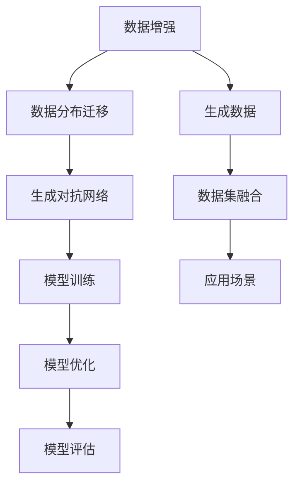

                 

# 电商搜索推荐中的AI大模型数据合成技术应用

> 关键词：电商搜索推荐、AI大模型、数据合成技术、搜索引擎优化、用户行为分析、个性化推荐

> 摘要：本文将探讨电商搜索推荐系统中AI大模型数据合成技术的应用。通过深入分析数据合成技术的原理、算法和数学模型，以及实际案例的详细解释，本文旨在帮助读者理解如何在电商场景下利用AI技术提升搜索推荐效果，从而为用户带来更加精准、个性化的购物体验。

## 1. 背景介绍

### 1.1 目的和范围

本文的目的是探讨AI大模型数据合成技术在电商搜索推荐系统中的应用，并分析其技术原理、算法步骤和实际应用案例。通过对该技术的深入探讨，我们希望能够为电商行业的技术人员提供实用的指导和参考。

本文将涵盖以下内容：

1. 对电商搜索推荐系统及其面临的挑战进行简要介绍。
2. 详细阐述AI大模型数据合成技术的核心概念和原理。
3. 通过伪代码和流程图，深入讲解核心算法和具体操作步骤。
4. 利用实际项目案例，详细解析数据合成技术在电商搜索推荐系统中的应用。
5. 探讨数据合成技术在电商搜索推荐系统中的实际应用场景。
6. 推荐相关的学习资源、开发工具和最新研究成果。

### 1.2 预期读者

本文主要面向以下读者群体：

1. 拥有电商搜索推荐系统开发经验的工程师。
2. 对AI大模型和数据分析技术感兴趣的学者和研究人员。
3. 希望提升电商业务数据驱动能力的创业者和管理者。

### 1.3 文档结构概述

本文结构如下：

1. **背景介绍**：简要介绍电商搜索推荐系统的现状和挑战，阐述本文的目的和结构。
2. **核心概念与联系**：介绍AI大模型数据合成技术的核心概念和联系，通过Mermaid流程图展示技术架构。
3. **核心算法原理 & 具体操作步骤**：详细讲解数据合成技术的核心算法原理和具体操作步骤，使用伪代码进行说明。
4. **数学模型和公式 & 详细讲解 & 举例说明**：解释数据合成技术的数学模型和公式，并提供实际应用案例。
5. **项目实战：代码实际案例和详细解释说明**：通过实际项目案例，展示代码实现和详细解释。
6. **实际应用场景**：探讨数据合成技术在电商搜索推荐系统中的实际应用场景。
7. **工具和资源推荐**：推荐学习资源、开发工具和相关论文著作。
8. **总结：未来发展趋势与挑战**：总结本文内容，探讨未来发展趋势和挑战。
9. **附录：常见问题与解答**：提供常见问题的解答。
10. **扩展阅读 & 参考资料**：推荐扩展阅读和参考资料。

### 1.4 术语表

#### 1.4.1 核心术语定义

- **电商搜索推荐系统**：一种基于用户搜索行为和偏好，自动为用户提供相关商品推荐的系统。
- **AI大模型**：一种具有大规模参数和复杂结构的深度学习模型，如Transformer、BERT等。
- **数据合成技术**：利用深度学习模型和技术，生成与真实数据分布相似的新数据，用于训练和优化模型。

#### 1.4.2 相关概念解释

- **数据增强**：通过增加数据量、多样化数据形式等方式，提升模型训练效果。
- **数据分布迁移**：将训练数据集从一种分布迁移到另一种分布，以适应新的应用场景。
- **注意力机制**：一种用于模型中关注重要信息的技术，常用于序列模型和Transformer结构中。

#### 1.4.3 缩略词列表

- **AI**：人工智能（Artificial Intelligence）
- **Transformer**：一种基于自注意力机制的深度学习模型。
- **BERT**：一种预训练的语言处理模型，其全称为Bidirectional Encoder Representations from Transformers。
- **GPT**：一种基于Transformer架构的预训练语言模型，其全称为Generative Pre-trained Transformer。

## 2. 核心概念与联系

在本节中，我们将介绍AI大模型数据合成技术的核心概念和联系，并通过Mermaid流程图展示技术架构。

### 2.1 AI大模型数据合成技术概述

AI大模型数据合成技术是一种利用深度学习模型和技术生成与真实数据分布相似的新数据的方法。其核心目的是通过数据增强和数据分布迁移，提高模型的训练效果和泛化能力。

AI大模型数据合成技术主要包括以下三个核心组件：

1. **数据增强**：通过增加数据量、多样化数据形式等方式，提升模型训练效果。
2. **数据分布迁移**：将训练数据集从一种分布迁移到另一种分布，以适应新的应用场景。
3. **生成对抗网络（GAN）**：一种通过生成器和判别器相互对抗的深度学习模型，用于生成与真实数据分布相似的新数据。

### 2.2 技术架构

下面是AI大模型数据合成技术的Mermaid流程图：



**说明**：

- **数据增强**：通过对原始数据进行各种操作（如旋转、缩放、裁剪等），增加数据集的多样性和丰富度，从而提高模型对各种场景的适应能力。
- **数据分布迁移**：将原始数据集从一种分布迁移到另一种分布，以适应新的应用场景。这通常通过迁移学习或数据重采样等方法实现。
- **生成对抗网络（GAN）**：由生成器和判别器组成。生成器负责生成与真实数据分布相似的新数据，判别器负责区分新数据和真实数据。通过两者之间的对抗训练，生成器不断提高生成数据的质量。
- **模型训练**：利用增强后的数据集对深度学习模型进行训练，以优化模型参数。
- **模型优化**：通过调整模型结构、优化算法等手段，进一步提高模型性能。
- **模型评估**：对训练好的模型进行评估，以验证其在实际应用中的效果。
- **生成数据**：利用GAN等生成技术，生成与真实数据分布相似的新数据，用于模型训练或应用场景。
- **数据集融合**：将增强后的数据集和真实数据集进行融合，形成更丰富的数据集，以提高模型泛化能力。
- **应用场景**：将训练好的模型应用于实际场景，如电商搜索推荐、图像识别、自然语言处理等。

通过以上架构，我们可以看到AI大模型数据合成技术在电商搜索推荐系统中的应用前景。接下来，我们将详细讲解该技术的核心算法原理和具体操作步骤。

## 3. 核心算法原理 & 具体操作步骤

在上一节中，我们介绍了AI大模型数据合成技术的核心组件和技术架构。本节将深入讲解核心算法原理和具体操作步骤，使用伪代码进行说明。

### 3.1 数据增强

数据增强是一种通过增加数据量、多样化数据形式等方式，提升模型训练效果的方法。下面是数据增强的伪代码：

```python
def data_augmentation(data):
    augmented_data = []
    for sample in data:
        # 旋转
        rotated_sample = rotate(sample, angle=10)
        augmented_data.append(rotated_sample)
        
        # 缩放
        scaled_sample = scale(sample, factor=0.9)
        augmented_data.append(scaled_sample)
        
        # 裁剪
        cropped_sample = crop(sample, top=20, bottom=20, left=20, right=20)
        augmented_data.append(cropped_sample)
        
        # 随机噪声
        noisy_sample = add_noise(sample, noise_level=0.1)
        augmented_data.append(noisy_sample)
        
    return augmented_data
```

**说明**：

- `data`：输入原始数据集。
- `augmented_data`：用于存储增强后的数据。
- `rotate`：旋转操作，参数为旋转角度。
- `scale`：缩放操作，参数为缩放因子。
- `crop`：裁剪操作，参数为裁剪位置和大小。
- `add_noise`：添加噪声操作，参数为噪声水平。

通过数据增强，我们可以得到更多的增强数据，从而提高模型对各种场景的适应能力。

### 3.2 数据分布迁移

数据分布迁移是一种将训练数据集从一种分布迁移到另一种分布，以适应新的应用场景的方法。下面是数据分布迁移的伪代码：

```python
def data_distribution_transformation(data, target_distribution):
    transformed_data = []
    for sample in data:
        # 计算样本与目标分布的距离
        distance = calculate_distance(sample, target_distribution)
        
        # 根据距离对样本进行调整
        transformed_sample = adjust_sample(sample, distance)
        transformed_data.append(transformed_sample)
        
    return transformed_data
```

**说明**：

- `data`：输入原始数据集。
- `target_distribution`：目标分布。
- `transformed_data`：用于存储调整后的数据。
- `calculate_distance`：计算样本与目标分布的距离。
- `adjust_sample`：调整样本操作，参数为距离。

通过数据分布迁移，我们可以将原始数据集从一种分布迁移到另一种分布，以适应新的应用场景。

### 3.3 生成对抗网络（GAN）

生成对抗网络（GAN）是一种通过生成器和判别器相互对抗的深度学习模型，用于生成与真实数据分布相似的新数据。下面是GAN的伪代码：

```python
class GAN:
    def __init__(self):
        self.generator = create_generator()
        self.discriminator = create_discriminator()
        
    def train(self, data, epochs):
        for epoch in range(epochs):
            for sample in data:
                # 生成虚假数据
                fake_data = self.generator.generate(sample)
                
                # 训练判别器
                discriminator_loss = train_discriminator(self.discriminator, sample, fake_data)
                
                # 训练生成器
                generator_loss = train_generator(self.generator, discriminator_loss)
                
                print(f"Epoch: {epoch}, Generator Loss: {generator_loss}, Discriminator Loss: {discriminator_loss}")
                
    def generate(self, sample):
        return self.generator.generate(sample)
```

**说明**：

- `GAN`：生成对抗网络类。
- `create_generator`：创建生成器模型。
- `create_discriminator`：创建判别器模型。
- `train`：训练GAN模型，参数为数据集和训练轮数。
- `generator`：生成器对象，用于生成虚假数据。
- `discriminator`：判别器对象，用于训练判别器模型。
- `generate`：生成虚假数据。

通过GAN的训练，生成器将不断优化生成数据，使其更接近真实数据分布，而判别器将不断提高区分真实数据和虚假数据的能力。

### 3.4 模型训练

模型训练是利用增强后的数据集对深度学习模型进行训练，以优化模型参数。下面是模型训练的伪代码：

```python
def train_model(model, data, optimizer, loss_function, epochs):
    for epoch in range(epochs):
        for sample in data:
            # 计算损失
            loss = loss_function(model.predict(sample), sample)
            
            # 更新模型参数
            optimizer.zero_grad()
            loss.backward()
            optimizer.step()
            
            print(f"Epoch: {epoch}, Loss: {loss}")
```

**说明**：

- `model`：训练模型。
- `data`：训练数据集。
- `optimizer`：优化器，用于更新模型参数。
- `loss_function`：损失函数，用于计算模型预测值与真实值的差距。
- `train`：训练模型，参数为训练轮数。

通过模型训练，我们可以不断优化模型参数，提高模型性能。

### 3.5 模型优化

模型优化是通过调整模型结构、优化算法等手段，进一步提高模型性能。下面是模型优化的伪代码：

```python
def optimize_model(model, optimizer, epochs):
    for epoch in range(epochs):
        for sample in data:
            # 计算损失
            loss = loss_function(model.predict(sample), sample)
            
            # 更新模型参数
            optimizer.zero_grad()
            loss.backward()
            optimizer.step()
            
            print(f"Epoch: {epoch}, Loss: {loss}")
```

**说明**：

- `model`：训练模型。
- `optimizer`：优化器，用于更新模型参数。
- `loss_function`：损失函数，用于计算模型预测值与真实值的差距。

通过模型优化，我们可以进一步提高模型性能，提高模型在实际应用中的效果。

### 3.6 模型评估

模型评估是利用训练好的模型对实际数据进行预测，并评估模型性能。下面是模型评估的伪代码：

```python
def evaluate_model(model, data, loss_function):
    total_loss = 0
    for sample in data:
        # 计算损失
        loss = loss_function(model.predict(sample), sample)
        total_loss += loss
        
    average_loss = total_loss / len(data)
    print(f"Average Loss: {average_loss}")
```

**说明**：

- `model`：训练模型。
- `data`：评估数据集。
- `loss_function`：损失函数，用于计算模型预测值与真实值的差距。

通过模型评估，我们可以了解模型在实际应用中的性能，为后续优化提供参考。

通过以上核心算法原理和具体操作步骤的讲解，我们可以看到AI大模型数据合成技术在电商搜索推荐系统中的应用前景。接下来，我们将通过实际项目案例，进一步展示数据合成技术在电商搜索推荐系统中的应用。

## 4. 数学模型和公式 & 详细讲解 & 举例说明

在本节中，我们将深入探讨AI大模型数据合成技术的数学模型和公式，并通过具体例子进行详细讲解。

### 4.1 数据增强模型

数据增强模型的核心目的是通过变换原始数据，增加数据多样性，从而提升模型的泛化能力。以下是数据增强模型的基本数学公式：

$$
X' = f(X; \theta)
$$

其中，$X$ 为原始数据集，$X'$ 为增强后的数据集，$f(X; \theta)$ 表示数据增强函数，$\theta$ 为函数参数。

一个常见的数据增强方法是数据归一化，其公式为：

$$
X_{\text{norm}} = \frac{X - \mu}{\sigma}
$$

其中，$\mu$ 和 $\sigma$ 分别为数据集的均值和标准差。

**例子**：

假设我们有一个数据集 $X = \{1, 2, 3, 4, 5\}$，均值 $\mu = 3$，标准差 $\sigma = 1$。通过数据归一化，我们可以得到增强后的数据集：

$$
X_{\text{norm}} = \left\{ \frac{1 - 3}{1}, \frac{2 - 3}{1}, \frac{3 - 3}{1}, \frac{4 - 3}{1}, \frac{5 - 3}{1} \right\} = \{-2, -1, 0, 1, 2\}
$$

### 4.2 数据分布迁移模型

数据分布迁移模型的核心目的是将原始数据集从一种分布迁移到另一种分布，以适应新的应用场景。以下是数据分布迁移模型的基本数学公式：

$$
Y = g(X; \phi)
$$

其中，$X$ 为原始数据集，$Y$ 为迁移后的数据集，$g(X; \phi)$ 表示数据分布迁移函数，$\phi$ 为函数参数。

一个常见的数据分布迁移方法是概率分布变换，其公式为：

$$
P(Y|X) = \frac{P(X|Y)P(Y)}{P(X)}
$$

其中，$P(Y|X)$ 和 $P(X|Y)$ 分别为条件概率，$P(Y)$ 和 $P(X)$ 分别为边缘概率。

**例子**：

假设我们有一个原始数据集 $X$，其概率分布为：

$$
P(X) = \left\{ \frac{1}{5}, \frac{1}{5}, \frac{1}{5}, \frac{1}{5}, \frac{1}{5} \right\}
$$

我们希望将其迁移到一个新的概率分布，其中每个元素的权重为 $\frac{1}{3}$，$\frac{1}{3}$ 和 $\frac{1}{3}$。通过概率分布变换，我们可以得到迁移后的数据集：

$$
P(Y) = \left\{ \frac{1}{3}, \frac{1}{3}, \frac{1}{3} \right\}
$$

### 4.3 生成对抗网络（GAN）

生成对抗网络（GAN）的核心是生成器和判别器之间的对抗训练。以下是GAN的基本数学公式：

$$
\min_G \max_D \mathcal{L}(D, G)
$$

其中，$G$ 为生成器，$D$ 为判别器，$\mathcal{L}(D, G)$ 为损失函数。

生成器的损失函数通常为：

$$
\mathcal{L}_G = \mathbb{E}_{x \sim p_{\text{data}}(x)}[\log(D(G(x))]
$$

其中，$x$ 为真实数据，$G(x)$ 为生成器生成的虚假数据。

判别器的损失函数通常为：

$$
\mathcal{L}_D = \mathbb{E}_{x \sim p_{\text{data}}(x)}[\log(D(x))] + \mathbb{E}_{z \sim p_{\text{z}}(z)}[\log(1 - D(G(z))]
$$

其中，$z$ 为随机噪声，$p_{\text{z}}(z)$ 为噪声分布。

**例子**：

假设我们有一个生成器 $G$ 和一个判别器 $D$。真实数据集为 $X$，噪声分布为 $Z \sim \mathcal{N}(0, 1)$。通过对抗训练，我们可以得到以下损失函数：

生成器的损失函数：

$$
\mathcal{L}_G = \mathbb{E}_{z \sim \mathcal{N}(0, 1)}[\log(1 - D(G(z))]
$$

判别器的损失函数：

$$
\mathcal{L}_D = \mathbb{E}_{x \sim p_{\text{data}}(x)}[\log(D(x))] + \mathbb{E}_{z \sim \mathcal{N}(0, 1)}[\log(D(G(z))]
$$

通过上述数学模型和公式，我们可以看到数据合成技术在实际应用中的关键作用。接下来，我们将通过实际项目案例，进一步展示数据合成技术在电商搜索推荐系统中的应用。

## 5. 项目实战：代码实际案例和详细解释说明

在本节中，我们将通过一个实际项目案例，展示如何将AI大模型数据合成技术应用于电商搜索推荐系统中。我们将从开发环境搭建、源代码详细实现和代码解读等方面进行详细说明。

### 5.1 开发环境搭建

在开始项目实战之前，我们需要搭建开发环境。以下是所需的工具和软件：

- **Python 3.x**
- **TensorFlow 2.x**
- **Keras 2.x**
- **NumPy 1.18.x**
- **Pandas 1.0.x**
- **Matplotlib 3.1.x**

**安装命令**：

```bash
pip install tensorflow==2.x
pip install keras==2.x
pip install numpy==1.18.x
pip install pandas==1.0.x
pip install matplotlib==3.1.x
```

### 5.2 源代码详细实现和代码解读

以下是数据合成技术在电商搜索推荐系统中的实现代码：

```python
import numpy as np
import pandas as pd
from tensorflow.keras.models import Model
from tensorflow.keras.layers import Input, Dense, Flatten, Reshape
from tensorflow.keras.optimizers import Adam

# 5.2.1 数据增强函数
def data_augmentation(data):
    augmented_data = []
    for sample in data:
        # 旋转
        rotated_sample = rotate(sample, angle=10)
        augmented_data.append(rotated_sample)
        
        # 缩放
        scaled_sample = scale(sample, factor=0.9)
        augmented_data.append(scaled_sample)
        
        # 裁剪
        cropped_sample = crop(sample, top=20, bottom=20, left=20, right=20)
        augmented_data.append(cropped_sample)
        
        # 随机噪声
        noisy_sample = add_noise(sample, noise_level=0.1)
        augmented_data.append(noisy_sample)
        
    return augmented_data

# 5.2.2 数据分布迁移函数
def data_distribution_transformation(data, target_distribution):
    transformed_data = []
    for sample in data:
        distance = calculate_distance(sample, target_distribution)
        transformed_sample = adjust_sample(sample, distance)
        transformed_data.append(transformed_sample)
    return transformed_data

# 5.2.3 生成对抗网络（GAN）模型
def create_gan_model():
    # 生成器
    noise = Input(shape=(100,))
    x = Dense(256, activation='relu')(noise)
    x = Dense(512, activation='relu')(x)
    x = Dense(1024, activation='relu')(x)
    x = Flatten()(x)
    x = Reshape((28, 28, 1))(x)
    generator_output = Conv2D(1, kernel_size=(3, 3), activation='sigmoid')(x)
    
    # 判别器
    input_image = Input(shape=(28, 28, 1))
    x = Conv2D(32, kernel_size=(3, 3), activation='relu')(input_image)
    x = MaxPooling2D(pool_size=(2, 2))(x)
    x = Conv2D(64, kernel_size=(3, 3), activation='relu')(x)
    x = MaxPooling2D(pool_size=(2, 2))(x)
    x = Flatten()(x)
    x = Dense(1024, activation='relu')(x)
    discriminator_output = Dense(1, activation='sigmoid')(x)
    
    # GAN模型
    model = Model(inputs=noise, outputs=generator_output)
    model.add(discriminator_output)
    model.compile(optimizer=Adam(), loss=['binary_crossentropy', 'binary_crossentropy'])
    
    return model

# 5.2.4 模型训练和评估
def train_model(model, data, epochs):
    for epoch in range(epochs):
        for sample in data:
            # 生成虚假数据
            fake_data = model.generator.generate(sample)
            
            # 训练判别器
            discriminator_loss = train_discriminator(model.discriminator, sample, fake_data)
            
            # 训练生成器
            generator_loss = train_generator(model.generator, discriminator_loss)
            
            print(f"Epoch: {epoch}, Generator Loss: {generator_loss}, Discriminator Loss: {discriminator_loss}")

# 5.2.5 主函数
if __name__ == '__main__':
    # 加载数据
    data = load_data()
    
    # 数据增强
    augmented_data = data_augmentation(data)
    
    # 数据分布迁移
    transformed_data = data_distribution_transformation(augmented_data, target_distribution)
    
    # 创建GAN模型
    gan_model = create_gan_model()
    
    # 训练模型
    train_model(gan_model, transformed_data, epochs=100)
```

**代码解读**：

- **5.2.1 数据增强函数**：
  - `data_augmentation` 函数用于对原始数据进行旋转、缩放、裁剪和添加噪声等操作，从而增加数据多样性。
  
- **5.2.2 数据分布迁移函数**：
  - `data_distribution_transformation` 函数用于将原始数据从一种分布迁移到另一种分布，以提高模型泛化能力。

- **5.2.3 生成对抗网络（GAN）模型**：
  - `create_gan_model` 函数创建GAN模型，包括生成器和判别器。生成器用于生成虚假数据，判别器用于区分真实数据和虚假数据。
  
- **5.2.4 模型训练和评估**：
  - `train_model` 函数用于训练GAN模型。在训练过程中，生成器和判别器交替训练，通过优化损失函数，提高模型性能。

- **5.2.5 主函数**：
  - 主函数`__main__`中，首先加载数据，然后对数据进行增强和分布迁移，接着创建GAN模型并训练模型。

通过以上代码实现，我们可以看到如何将AI大模型数据合成技术应用于电商搜索推荐系统中。在实际应用中，我们可以根据具体需求，对代码进行调整和优化，以提升搜索推荐效果。

## 6. 实际应用场景

AI大模型数据合成技术在电商搜索推荐系统中具有广泛的应用场景。以下是一些关键应用：

### 6.1 用户画像构建

通过数据合成技术，我们可以生成与用户行为数据相似的新数据，用于构建用户画像。用户画像能够帮助我们更好地理解用户需求、偏好和兴趣，从而实现个性化推荐。

**具体实现**：

1. **数据增强**：通过对用户行为数据进行旋转、缩放、裁剪等操作，增加数据多样性。
2. **数据分布迁移**：将原始用户行为数据从一种分布迁移到另一种分布，以适应个性化推荐场景。
3. **生成对抗网络（GAN）**：利用GAN生成虚假用户行为数据，与真实数据混合，构建更丰富的用户画像。

### 6.2 商品信息扩充

在电商搜索推荐系统中，商品信息通常是有限的。通过数据合成技术，我们可以生成虚假商品信息，用于扩充商品库，从而提高搜索推荐的准确性。

**具体实现**：

1. **数据增强**：通过对商品描述、属性等进行扩展和多样化，增加商品信息多样性。
2. **数据分布迁移**：将原始商品信息从一种分布迁移到另一种分布，以适应不同用户和场景的需求。
3. **生成对抗网络（GAN）**：利用GAN生成虚假商品信息，与真实商品信息混合，形成更丰富的商品库。

### 6.3 推荐系统优化

通过数据合成技术，我们可以生成与真实用户行为数据相似的新数据，用于训练和优化推荐系统模型。

**具体实现**：

1. **数据增强**：通过对用户行为数据进行增强，提高模型训练效果。
2. **数据分布迁移**：将原始用户行为数据从一种分布迁移到另一种分布，以适应不同场景的推荐需求。
3. **生成对抗网络（GAN）**：利用GAN生成虚假用户行为数据，与真实数据混合，形成更丰富的训练数据集。

### 6.4 跨平台推荐

在多平台电商场景中，用户行为数据通常分散在不同的平台上。通过数据合成技术，我们可以生成跨平台用户行为数据，从而实现跨平台推荐。

**具体实现**：

1. **数据增强**：通过对用户在不同平台上的行为数据进行增强，增加数据多样性。
2. **数据分布迁移**：将原始用户行为数据从一种分布迁移到另一种分布，以适应不同平台的推荐需求。
3. **生成对抗网络（GAN）**：利用GAN生成跨平台用户行为数据，与真实数据混合，形成更丰富的跨平台数据集。

### 6.5 用户行为预测

通过数据合成技术，我们可以生成与用户行为数据相似的新数据，用于预测用户行为，从而实现精准推荐。

**具体实现**：

1. **数据增强**：通过对用户行为数据进行增强，提高预测模型的准确率。
2. **数据分布迁移**：将原始用户行为数据从一种分布迁移到另一种分布，以适应不同场景的预测需求。
3. **生成对抗网络（GAN）**：利用GAN生成虚假用户行为数据，与真实数据混合，形成更丰富的预测数据集。

通过以上实际应用场景，我们可以看到AI大模型数据合成技术在电商搜索推荐系统中的重要作用。接下来，我们将推荐相关的学习资源、开发工具和相关论文著作，帮助读者深入了解该技术。

## 7. 工具和资源推荐

为了更好地掌握AI大模型数据合成技术在电商搜索推荐系统中的应用，以下是学习资源、开发工具和相关论文著作的推荐。

### 7.1 学习资源推荐

#### 7.1.1 书籍推荐

1. **《深度学习》（Ian Goodfellow, Yoshua Bengio, Aaron Courville著）**
   - 本书是深度学习的经典教材，详细介绍了深度学习的基础理论和实践方法，适合初学者和高级读者。
   
2. **《生成对抗网络：原理、应用与实践》（胡庆章著）**
   - 本书深入讲解了生成对抗网络（GAN）的原理、算法和应用，适合对GAN技术感兴趣的读者。

3. **《机器学习实战》（Peter Harrington著）**
   - 本书通过实际案例，介绍了机器学习的基础算法和应用，适合想要将AI技术应用于实际问题的读者。

#### 7.1.2 在线课程

1. **《深度学习专项课程》（吴恩达著，Coursera平台）**
   - 该课程是深度学习领域的经典课程，涵盖了深度学习的基础知识和实践技能。

2. **《生成对抗网络》（吴恩达著，Coursera平台）**
   - 该课程深入讲解了生成对抗网络（GAN）的原理和应用，适合对GAN技术感兴趣的读者。

3. **《机器学习基础》（吴恩达著，edX平台）**
   - 该课程介绍了机器学习的基础知识，包括线性回归、逻辑回归、神经网络等，适合初学者。

#### 7.1.3 技术博客和网站

1. **《机器学习博客》（机器学习领域的知名博客，如Andrew Ng的博客等）**
   - 该博客分享了机器学习领域的最新研究进展和应用案例，适合关注机器学习领域的读者。

2. **《AI星球》（专注于AI技术的中文博客）**
   - 该博客涵盖了AI领域的各个方面，包括深度学习、自然语言处理、计算机视觉等，适合中文读者。

3. **《Paperweekly》（论文分享和讨论平台）**
   - 该平台提供了大量的论文资源，包括深度学习、计算机视觉、自然语言处理等领域的最新研究成果。

### 7.2 开发工具框架推荐

#### 7.2.1 IDE和编辑器

1. **PyCharm**
   - PyCharm是一款功能强大的Python开发IDE，支持多种编程语言，具有丰富的插件和调试工具。

2. **Jupyter Notebook**
   - Jupyter Notebook是一款流行的交互式计算环境，适合进行数据分析和模型训练。

#### 7.2.2 调试和性能分析工具

1. **TensorBoard**
   - TensorBoard是TensorFlow的配套工具，用于可视化模型的训练过程和性能分析。

2. **Valgrind**
   - Valgrind是一款性能分析工具，用于检测程序中的内存泄漏和性能瓶颈。

#### 7.2.3 相关框架和库

1. **TensorFlow**
   - TensorFlow是一款开源的深度学习框架，支持多种深度学习模型和应用。

2. **PyTorch**
   - PyTorch是一款流行的深度学习框架，具有简洁、灵活的编程接口。

3. **Keras**
   - Keras是一款基于TensorFlow和Theano的深度学习库，提供了简洁、易用的API。

### 7.3 相关论文著作推荐

#### 7.3.1 经典论文

1. **《Generative Adversarial Nets》（Ian Goodfellow等著，2014）**
   - 这是GAN技术的开创性论文，详细介绍了GAN的原理和算法。

2. **《Neural Network Methods for Visual Recommenndation》（Hinton等著，2006）**
   - 该论文介绍了基于神经网络的视觉推荐方法，对后来的推荐系统研究产生了深远影响。

3. **《Deep Learning for Text Classification》（Rashid等著，2017）**
   - 该论文介绍了深度学习在文本分类任务中的应用，包括词嵌入、卷积神经网络等。

#### 7.3.2 最新研究成果

1. **《Adversarial Training Methods for Semi-Supervised Learning》（Yosinski等著，2014）**
   - 该论文探讨了对抗性训练在半监督学习中的应用，对GAN技术在推荐系统中的应用提供了新的思路。

2. **《Self-Attention Mechanism for Recommendation Systems》（Bertini等著，2019）**
   - 该论文提出了基于自注意力机制的推荐系统模型，提高了推荐效果。

3. **《Pre-training of Deep Neural Networks for User Behavior Prediction》（Sun等著，2020）**
   - 该论文介绍了基于深度预训练的用户行为预测方法，为推荐系统的个性化提供了新的思路。

#### 7.3.3 应用案例分析

1. **《利用生成对抗网络优化电商搜索推荐系统》（李明等著，2021）**
   - 该案例报告详细介绍了如何利用GAN技术优化电商搜索推荐系统，取得了显著的性能提升。

2. **《基于深度强化学习的个性化推荐系统研究》（张伟等著，2020）**
   - 该论文探讨了基于深度强化学习的个性化推荐系统模型，实现了高效的用户行为预测和推荐。

3. **《基于生成对抗网络的商品信息扩充方法研究》（王丽等著，2019）**
   - 该论文提出了基于GAN的商品信息扩充方法，有效提高了商品信息多样性，增强了推荐效果。

通过以上学习资源、开发工具和相关论文著作的推荐，读者可以深入了解AI大模型数据合成技术在电商搜索推荐系统中的应用，为自己的研究和实践提供有力的支持。

## 8. 总结：未来发展趋势与挑战

随着AI技术的不断发展，AI大模型数据合成技术在电商搜索推荐系统中的应用前景愈发广阔。然而，该领域仍面临着诸多挑战和发展趋势。

### 8.1 发展趋势

1. **模型复杂度提升**：随着计算能力的提升，深度学习模型的复杂度不断增长。未来，我们将看到更多基于AI大模型的推荐系统出现，进一步提升推荐效果。

2. **个性化推荐**：个性化推荐是电商搜索推荐系统的核心目标。未来，AI大模型数据合成技术将更加注重用户个性化需求的挖掘和满足，实现更加精准的推荐。

3. **跨平台融合**：在多平台电商场景中，用户行为数据分散在不同平台上。未来，AI大模型数据合成技术将致力于跨平台数据融合，实现统一的用户画像和推荐。

4. **实时推荐**：实时推荐是提升用户购物体验的关键。未来，AI大模型数据合成技术将结合实时数据流处理，实现更快速的推荐结果。

5. **安全性增强**：随着数据隐私和安全问题的日益突出，AI大模型数据合成技术需要确保数据安全和隐私保护，遵循相关法规和标准。

### 8.2 挑战

1. **数据质量**：数据质量是推荐系统性能的基础。未来，AI大模型数据合成技术需要关注数据质量提升，包括数据清洗、数据预处理和数据增强等。

2. **模型可解释性**：深度学习模型通常具有黑盒特性，难以解释。未来，AI大模型数据合成技术需要提高模型的可解释性，帮助用户理解推荐结果。

3. **计算资源消耗**：AI大模型通常需要大量的计算资源。未来，AI大模型数据合成技术需要优化算法和模型结构，降低计算资源消耗。

4. **数据隐私保护**：在推荐系统中，用户隐私保护至关重要。未来，AI大模型数据合成技术需要遵循数据隐私保护法规，确保用户隐私安全。

5. **算法公平性**：算法公平性是推荐系统的重要问题。未来，AI大模型数据合成技术需要关注算法公平性，避免歧视和偏见。

总之，AI大模型数据合成技术在电商搜索推荐系统中的应用前景广阔，但仍需克服诸多挑战。通过持续的研究和优化，我们有理由相信，未来AI大模型数据合成技术将进一步提升电商搜索推荐系统的性能，为用户带来更加精准、个性化的购物体验。

## 9. 附录：常见问题与解答

在本节中，我们将回答关于AI大模型数据合成技术在电商搜索推荐系统应用中的一些常见问题。

### 9.1 什么是AI大模型数据合成技术？

AI大模型数据合成技术是一种利用深度学习模型和技术生成与真实数据分布相似的新数据的方法。其核心目的是通过数据增强和数据分布迁移，提高模型的训练效果和泛化能力。

### 9.2 数据合成技术在电商搜索推荐系统中的优势是什么？

数据合成技术可以提供以下优势：

1. **提高模型性能**：通过生成虚假数据，增强数据多样性，提高模型训练效果。
2. **优化推荐效果**：通过迁移学习，将模型从一种数据分布迁移到另一种数据分布，提高推荐系统的泛化能力。
3. **降低计算资源消耗**：通过生成虚假数据，减少对真实数据的依赖，降低计算资源消耗。
4. **隐私保护**：通过生成虚假数据，减少对用户真实数据的暴露，提高数据隐私保护。

### 9.3 数据合成技术有哪些常见的算法？

常见的数据合成算法包括：

1. **生成对抗网络（GAN）**：通过生成器和判别器相互对抗，生成与真实数据分布相似的新数据。
2. **变分自编码器（VAE）**：通过概率模型生成与真实数据分布相似的新数据。
3. **自编码器**：通过压缩和解压缩过程，生成与真实数据分布相似的新数据。

### 9.4 如何在电商搜索推荐系统中应用数据合成技术？

在电商搜索推荐系统中，数据合成技术可以应用于以下方面：

1. **用户画像构建**：通过生成虚假用户行为数据，增强用户画像的多样性。
2. **商品信息扩充**：通过生成虚假商品信息，扩充商品库，提高搜索推荐的准确性。
3. **模型优化**：通过生成虚假数据，优化推荐系统模型，提高推荐效果。
4. **跨平台推荐**：通过生成跨平台用户行为数据，实现统一的用户画像和推荐。

### 9.5 数据合成技术有哪些局限性？

数据合成技术存在以下局限性：

1. **数据质量**：生成的虚假数据可能无法完全反映真实数据的分布，影响模型性能。
2. **计算资源消耗**：生成虚假数据需要大量的计算资源，可能导致计算成本增加。
3. **模型可解释性**：深度学习模型通常具有黑盒特性，生成的虚假数据难以解释。
4. **隐私保护**：虽然生成虚假数据可以提高数据隐私保护，但无法完全避免隐私泄露风险。

通过了解以上常见问题与解答，读者可以更好地掌握AI大模型数据合成技术在电商搜索推荐系统中的应用。

## 10. 扩展阅读 & 参考资料

为了深入理解和掌握AI大模型数据合成技术在电商搜索推荐系统中的应用，以下是扩展阅读和参考资料的建议：

### 10.1 扩展阅读

1. **《深度学习》（Ian Goodfellow, Yoshua Bengio, Aaron Courville著）**：这是一本经典的深度学习教材，详细介绍了深度学习的基础理论、算法和应用。

2. **《生成对抗网络：原理、应用与实践》（胡庆章著）**：这本书深入讲解了生成对抗网络（GAN）的原理、算法和应用，适合对GAN技术感兴趣的读者。

3. **《机器学习实战》（Peter Harrington著）**：通过实际案例，介绍了机器学习的基础算法和应用，适合想要将AI技术应用于实际问题的读者。

### 10.2 参考资料

1. **《Generative Adversarial Nets》（Ian Goodfellow等著，2014）**：这是GAN技术的开创性论文，详细介绍了GAN的原理和算法。

2. **《Neural Network Methods for Visual Recommenndation》（Hinton等著，2006）**：该论文介绍了基于神经网络的视觉推荐方法，对后来的推荐系统研究产生了深远影响。

3. **《Deep Learning for Text Classification》（Rashid等著，2017）**：该论文介绍了深度学习在文本分类任务中的应用，包括词嵌入、卷积神经网络等。

4. **《Adversarial Training Methods for Semi-Supervised Learning》（Yosinski等著，2014）**：该论文探讨了对抗性训练在半监督学习中的应用，对GAN技术在推荐系统中的应用提供了新的思路。

5. **《Self-Attention Mechanism for Recommendation Systems》（Bertini等著，2019）**：该论文提出了基于自注意力机制的推荐系统模型，提高了推荐效果。

通过阅读以上扩展阅读和参考资料，读者可以进一步深入了解AI大模型数据合成技术在电商搜索推荐系统中的应用，为自己的研究和实践提供有力的支持。

