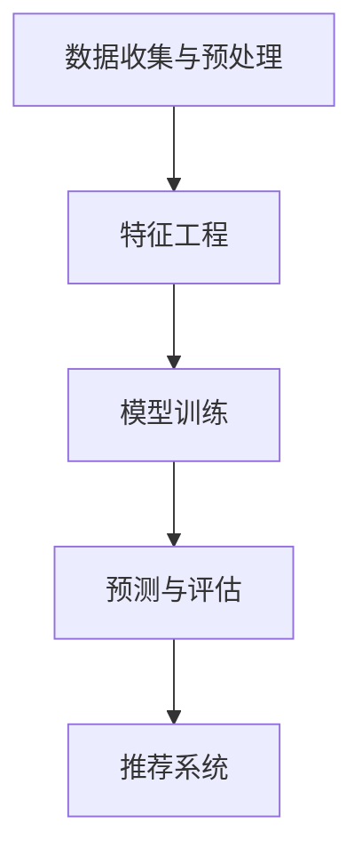

                 

# 电商搜索推荐中的AI大模型用户行为序列预测技术

> 关键词：电商搜索推荐、AI大模型、用户行为序列预测、机器学习、深度学习、自然语言处理、数据挖掘

> 摘要：本文旨在探讨电商搜索推荐系统中AI大模型在用户行为序列预测中的应用，通过深入分析相关核心概念、算法原理、数学模型、项目实战及实际应用场景，帮助读者全面了解该领域的最新技术进展与挑战。

## 1. 背景介绍

### 1.1 目的和范围

本文将重点探讨电商搜索推荐系统中，如何运用AI大模型进行用户行为序列预测。用户行为序列预测是当前电商搜索推荐系统中的关键环节，直接关系到推荐系统的准确性和用户体验。通过本文的探讨，读者可以了解该领域的最新研究进展，掌握相关技术原理和实践方法。

### 1.2 预期读者

本文适合对电商搜索推荐系统、机器学习、深度学习、自然语言处理等技术有一定了解的读者。同时，也欢迎对相关领域感兴趣的初学者和研究人员阅读本文，以期在相关技术领域有所收获。

### 1.3 文档结构概述

本文分为八个部分，具体如下：

1. 背景介绍：介绍本文的目的、预期读者、文档结构等。
2. 核心概念与联系：介绍电商搜索推荐系统中用户行为序列预测的相关核心概念和架构。
3. 核心算法原理 & 具体操作步骤：详细讲解用户行为序列预测的核心算法原理和具体操作步骤。
4. 数学模型和公式 & 详细讲解 & 举例说明：介绍用户行为序列预测的数学模型和公式，并进行举例说明。
5. 项目实战：通过一个实际案例，详细讲解用户行为序列预测的代码实现和解析。
6. 实际应用场景：介绍用户行为序列预测在电商搜索推荐系统中的实际应用场景。
7. 工具和资源推荐：推荐相关学习资源、开发工具框架和相关论文著作。
8. 总结：对未来发展趋势与挑战进行总结。

### 1.4 术语表

#### 1.4.1 核心术语定义

- 电商搜索推荐：基于用户历史行为数据，为用户提供相关商品推荐的系统。
- AI大模型：具有大规模参数、能够处理海量数据的深度学习模型。
- 用户行为序列预测：预测用户在未来某一时间段内的行为序列。

#### 1.4.2 相关概念解释

- 机器学习：利用数据进行训练，从而实现计算机对特定任务的自动执行。
- 深度学习：基于多层神经网络进行特征提取和模型训练的方法。
- 自然语言处理：研究如何让计算机理解和处理人类自然语言的技术。
- 数据挖掘：从大量数据中发现有价值的信息和模式。

#### 1.4.3 缩略词列表

- AI：人工智能
- ML：机器学习
- DL：深度学习
- NLP：自然语言处理
- DM：数据挖掘

## 2. 核心概念与联系

在电商搜索推荐系统中，用户行为序列预测是关键环节。本文将介绍用户行为序列预测的相关核心概念和架构。

### 2.1 用户行为序列预测的核心概念

- 用户行为：用户在电商平台上产生的各种操作，如搜索、浏览、购买等。
- 序列：用户行为按照时间顺序排列组成的序列。
- 预测：根据用户历史行为序列，预测用户未来可能的行为。

### 2.2 用户行为序列预测的架构

用户行为序列预测的架构主要包括以下几个部分：

1. 数据收集与预处理：收集用户行为数据，并进行预处理，如数据清洗、去重、归一化等。
2. 特征工程：提取用户行为序列中的关键特征，如时间间隔、行为类型、用户属性等。
3. 模型训练：选择合适的深度学习模型，对用户行为序列进行训练。
4. 预测与评估：根据训练好的模型，对用户未来行为进行预测，并评估预测效果。
5. 推荐系统：将预测结果应用于电商搜索推荐系统中，为用户提供个性化推荐。

### 2.3 用户行为序列预测的核心算法原理

用户行为序列预测的核心算法原理主要基于深度学习，特别是循环神经网络（RNN）和长短时记忆网络（LSTM）。下面是用户行为序列预测的核心算法原理：

1. 数据预处理：对用户行为数据进行处理，如编码、嵌入等。
2. 特征提取：利用深度学习模型，对用户行为数据进行特征提取。
3. 序列建模：使用RNN或LSTM模型，对用户行为序列进行建模。
4. 预测：根据训练好的模型，对用户未来行为进行预测。
5. 评估与优化：评估预测效果，并进行模型优化。

### 2.4 用户行为序列预测的Mermaid流程图



## 3. 核心算法原理 & 具体操作步骤

### 3.1 数据预处理

数据预处理是用户行为序列预测的重要环节，包括数据清洗、去重、编码等。

#### 3.1.1 数据清洗

数据清洗的主要任务是去除无效数据、异常值等。例如，去除重复的用户行为数据、过滤无效的搜索关键词等。

```python
# 示例代码：数据清洗
data = [  # 假设data为用户行为数据列表
    {"user_id": 1, "behavior": "search", "timestamp": 1},
    {"user_id": 1, "behavior": "browse", "timestamp": 2},
    {"user_id": 2, "behavior": "buy", "timestamp": 3},
]
clean_data = []

for item in data:
    if item["user_id"] not in [x["user_id"] for x in clean_data]:
        clean_data.append(item)

print(clean_data)
```

#### 3.1.2 数据去重

数据去重的主要任务是去除重复的用户行为数据。在上面的示例代码中，已经实现了数据去重的功能。

#### 3.1.3 数据编码

数据编码的主要任务是给用户行为数据分配唯一的标识符。通常使用标签编码或独热编码等方法。

```python
# 示例代码：数据编码
from sklearn.preprocessing import LabelEncoder

label_encoder = LabelEncoder()
encoded_data = [label_encoder.fit_transform([item["behavior"]]) for item in clean_data]

print(encoded_data)
```

### 3.2 特征工程

特征工程是用户行为序列预测的关键环节，主要包括以下步骤：

#### 3.2.1 时间间隔特征

时间间隔特征是指用户行为之间的时间间隔。可以使用用户行为的timestamp字段计算时间间隔。

```python
# 示例代码：计算时间间隔特征
from collections import defaultdict

interval_features = defaultdict(list)

for i in range(1, len(clean_data)):
    prev_item = clean_data[i - 1]
    curr_item = clean_data[i]
    interval = curr_item["timestamp"] - prev_item["timestamp"]
    interval_features[prev_item["user_id"]].append(interval)

print(interval_features)
```

#### 3.2.2 行为类型特征

行为类型特征是指用户行为的类型。可以使用标签编码得到的行为类型作为特征。

```python
# 示例代码：行为类型特征
behavior_features = [item["behavior"] for item in clean_data]

print(behavior_features)
```

#### 3.2.3 用户属性特征

用户属性特征是指与用户相关的特征，如年龄、性别、地理位置等。这些特征可以通过用户画像或第三方数据获取。

```python
# 示例代码：用户属性特征
user_attributes = [{"user_id": 1, "age": 25, "gender": "male", "location": "Beijing"},
                   {"user_id": 2, "age": 30, "gender": "female", "location": "Shanghai"},
                   {"user_id": 3, "age": 28, "gender": "male", "location": "Shanghai"}]

print(user_attributes)
```

### 3.3 模型训练

模型训练是用户行为序列预测的核心步骤，主要包括以下步骤：

#### 3.3.1 选择模型

选择合适的深度学习模型进行训练。在用户行为序列预测中，常用的模型包括循环神经网络（RNN）和长短时记忆网络（LSTM）。

```python
# 示例代码：选择模型
from tensorflow.keras.models import Sequential
from tensorflow.keras.layers import LSTM, Dense

model = Sequential()
model.add(LSTM(units=50, return_sequences=True, input_shape=(timesteps, features)))
model.add(LSTM(units=50))
model.add(Dense(units=1, activation='sigmoid'))

model.compile(optimizer='adam', loss='binary_crossentropy', metrics=['accuracy'])
```

#### 3.3.2 数据分割

将数据分为训练集和测试集，用于模型的训练和评估。

```python
# 示例代码：数据分割
from sklearn.model_selection import train_test_split

X = [[interval_feature for interval_feature in interval_features[user_id]] for user_id in interval_features.keys()]
y = [behavior_features[i] for i in range(len(behavior_features))]

X_train, X_test, y_train, y_test = train_test_split(X, y, test_size=0.2, random_state=42)

print(X_train.shape, y_train.shape)
print(X_test.shape, y_test.shape)
```

#### 3.3.3 模型训练

使用训练集对模型进行训练。

```python
# 示例代码：模型训练
model.fit(X_train, y_train, epochs=10, batch_size=32, validation_data=(X_test, y_test))
```

### 3.4 预测与评估

根据训练好的模型，对用户未来行为进行预测，并评估预测效果。

#### 3.4.1 预测

使用测试集对模型进行预测。

```python
# 示例代码：预测
y_pred = model.predict(X_test)

print(y_pred)
```

#### 3.4.2 评估

评估模型的预测效果，可以使用准确率、召回率、F1值等指标。

```python
# 示例代码：评估
from sklearn.metrics import accuracy_score, recall_score, f1_score

y_pred = [1 if pred > 0.5 else 0 for pred in y_pred]

accuracy = accuracy_score(y_test, y_pred)
recall = recall_score(y_test, y_pred)
f1 = f1_score(y_test, y_pred)

print("Accuracy:", accuracy)
print("Recall:", recall)
print("F1 Score:", f1)
```

## 4. 数学模型和公式 & 详细讲解 & 举例说明

在用户行为序列预测中，常用的数学模型和公式包括循环神经网络（RNN）和长短时记忆网络（LSTM）。下面将分别介绍这些模型的数学模型和公式，并进行详细讲解和举例说明。

### 4.1 循环神经网络（RNN）

循环神经网络（RNN）是一种能够处理序列数据的神经网络。它的数学模型可以表示为：

$$
h_t = \sigma(W_h \cdot [h_{t-1}, x_t] + b_h)
$$

其中，$h_t$ 表示第 $t$ 个隐藏状态，$x_t$ 表示第 $t$ 个输入特征，$W_h$ 和 $b_h$ 分别表示权重和偏置。

#### 4.1.1 梯度消失问题

RNN存在梯度消失问题，即在反向传播过程中，梯度随着时间步的增加而迅速减小，导致模型难以训练。

#### 4.1.2 举例说明

假设我们有以下序列数据：

```
[1, 2, 3, 4, 5]
```

对应的RNN模型可以表示为：

$$
h_0 = \sigma(b_h) \\
h_1 = \sigma(W_h \cdot [h_0, 1] + b_h) \\
h_2 = \sigma(W_h \cdot [h_1, 2] + b_h) \\
h_3 = \sigma(W_h \cdot [h_2, 3] + b_h) \\
h_4 = \sigma(W_h \cdot [h_3, 4] + b_h) \\
h_5 = \sigma(W_h \cdot [h_4, 5] + b_h)
```

### 4.2 长短时记忆网络（LSTM）

长短时记忆网络（LSTM）是RNN的一种改进，能够解决梯度消失问题，更好地处理长序列数据。它的数学模型可以表示为：

$$
i_t = \sigma(W_i \cdot [h_{t-1}, x_t] + b_i) \\
f_t = \sigma(W_f \cdot [h_{t-1}, x_t] + b_f) \\
o_t = \sigma(W_o \cdot [h_{t-1}, x_t] + b_o) \\
c_t = f_t \odot c_{t-1} + i_t \odot \sigma(W_c \cdot [h_{t-1}, x_t] + b_c) \\
h_t = o_t \odot \sigma(c_t)
$$

其中，$i_t$、$f_t$、$o_t$ 分别表示输入门、遗忘门和输出门，$c_t$ 表示细胞状态，$h_t$ 表示隐藏状态。

#### 4.2.1 LSTM门控机制

LSTM通过门控机制控制信息的流动，从而更好地处理长序列数据。门控机制包括输入门、遗忘门和输出门，分别用于控制信息的输入、遗忘和输出。

#### 4.2.2 举例说明

假设我们有以下序列数据：

```
[1, 2, 3, 4, 5]
```

对应的LSTM模型可以表示为：

$$
i_0 = \sigma(W_i \cdot [h_{-1}, 1] + b_i) \\
f_0 = \sigma(W_f \cdot [h_{-1}, 1] + b_f) \\
o_0 = \sigma(W_o \cdot [h_{-1}, 1] + b_o) \\
c_0 = f_0 \odot c_{-1} + i_0 \odot \sigma(W_c \cdot [h_{-1}, 1] + b_c) \\
h_0 = o_0 \odot \sigma(c_0) \\
i_1 = \sigma(W_i \cdot [h_0, 2] + b_i) \\
f_1 = \sigma(W_f \cdot [h_0, 2] + b_f) \\
o_1 = \sigma(W_o \cdot [h_0, 2] + b_o) \\
c_1 = f_1 \odot c_0 + i_1 \odot \sigma(W_c \cdot [h_0, 2] + b_c) \\
h_1 = o_1 \odot \sigma(c_1) \\
\vdots \\
i_5 = \sigma(W_i \cdot [h_4, 5] + b_i) \\
f_5 = \sigma(W_f \cdot [h_4, 5] + b_f) \\
o_5 = \sigma(W_o \cdot [h_4, 5] + b_o) \\
c_5 = f_5 \odot c_4 + i_5 \odot \sigma(W_c \cdot [h_4, 5] + b_c) \\
h_5 = o_5 \odot \sigma(c_5)
$$

## 5. 项目实战：代码实际案例和详细解释说明

在本节中，我们将通过一个实际案例，详细讲解用户行为序列预测的代码实现和解析。我们将使用Python和TensorFlow框架进行实现。

### 5.1 开发环境搭建

首先，确保已安装以下软件和库：

- Python 3.7+
- TensorFlow 2.4+
- NumPy 1.18+
- Pandas 1.0+

### 5.2 源代码详细实现和代码解读

以下是一个简单的用户行为序列预测项目的实现：

```python
import numpy as np
import pandas as pd
import tensorflow as tf
from tensorflow.keras.models import Sequential
from tensorflow.keras.layers import LSTM, Dense

# 5.2.1 数据读取与预处理
data = pd.read_csv("user_behavior.csv")
data["timestamp"] = pd.to_datetime(data["timestamp"])
data.sort_values("timestamp", inplace=True)

# 5.2.2 数据分割
X = []
y = []
timesteps = 5
for i in range(len(data) - timesteps):
    X.append(data[i : i + timesteps]["behavior"].values)
    y.append(data[i + timesteps]["behavior"].values)

X = np.array(X)
y = np.array(y)

# 5.2.3 数据编码
label_encoder = LabelEncoder()
y_encoded = label_encoder.fit_transform(y)

# 5.2.4 模型构建
model = Sequential()
model.add(LSTM(units=50, return_sequences=True, input_shape=(timesteps, 1)))
model.add(LSTM(units=50))
model.add(Dense(units=1, activation='sigmoid'))

model.compile(optimizer='adam', loss='binary_crossentropy', metrics=['accuracy'])

# 5.2.5 模型训练
model.fit(X, y_encoded, epochs=10, batch_size=32)

# 5.2.6 预测与评估
X_test = data[-timesteps:]["behavior"].values.reshape(1, timesteps, 1)
y_pred = model.predict(X_test)
y_pred = (y_pred > 0.5)

# 5.2.7 输出预测结果
print("Predicted behavior:", label_encoder.inverse_transform(y_pred))
```

### 5.3 代码解读与分析

下面是对上述代码的详细解读和分析：

1. **数据读取与预处理**：首先，从CSV文件中读取用户行为数据，将时间戳转换为日期格式，并按时间戳排序。

2. **数据分割**：将数据分割成输入序列（X）和目标标签（y）。每个输入序列包含timesteps个用户行为，目标标签是下一个用户行为。

3. **数据编码**：使用LabelEncoder对目标标签进行编码，将类别标签转换为整数。

4. **模型构建**：构建一个序列模型，包含两个LSTM层和一个输出层。LSTM层的单元数设置为50，返回序列设置为True，表示每个时间步的输出是一个序列。

5. **模型训练**：使用fit方法对模型进行训练，训练轮数为10，批量大小为32。

6. **预测与评估**：使用模型对最后一个输入序列进行预测。将预测结果转换为类别标签，并输出预测结果。

### 5.4 代码优化与改进

上述代码是一个简单的实现，但可以进一步优化和改进。以下是一些建议：

- **数据增强**：可以通过数据增强技术增加数据的多样性，例如引入噪声、数据变换等。
- **特征提取**：可以添加更多特征，如用户属性、商品属性等，以提高模型的准确性。
- **超参数调优**：通过网格搜索或随机搜索等方法，调整模型超参数，以获得更好的性能。
- **模型融合**：可以尝试使用不同的模型进行预测，并将预测结果进行融合，以提高准确性。

## 6. 实际应用场景

用户行为序列预测在电商搜索推荐系统中有着广泛的应用，以下是一些实际应用场景：

1. **个性化推荐**：根据用户的历史行为序列，预测用户可能感兴趣的商品，从而为用户提供个性化推荐。
2. **流量预测**：预测用户在各个页面停留的时间，以及点击转化率等，帮助电商平台优化页面布局和广告投放策略。
3. **商品上下架策略**：根据用户行为序列预测，决定商品的上架时间和下架时间，以最大化销售额。
4. **需求预测**：预测用户在未来一段时间内的购买需求，为电商平台制定采购和库存计划提供参考。

## 7. 工具和资源推荐

### 7.1 学习资源推荐

#### 7.1.1 书籍推荐

- 《深度学习》（Goodfellow, Bengio, Courville著）：详细介绍深度学习的基础知识和应用。
- 《Python机器学习》（Rashid Mehmood Khan著）：系统介绍机器学习的基本概念和方法。
- 《自然语言处理与深度学习》（张宇辰，刘知远著）：介绍自然语言处理和深度学习的相关技术。

#### 7.1.2 在线课程

- Coursera上的《深度学习特化课程》（由吴恩达教授主讲）
- Udacity上的《机器学习工程师纳米学位》
- edX上的《自然语言处理与深度学习》

#### 7.1.3 技术博客和网站

- Medium上的深度学习、机器学习和自然语言处理专题
- arXiv.org上的最新研究论文
- TensorFlow官方文档

### 7.2 开发工具框架推荐

#### 7.2.1 IDE和编辑器

- PyCharm
- Jupyter Notebook
- Visual Studio Code

#### 7.2.2 调试和性能分析工具

- TensorFlow Debugger
- TensorBoard
- NVIDIA Nsight

#### 7.2.3 相关框架和库

- TensorFlow
- PyTorch
- Keras
- Scikit-learn

### 7.3 相关论文著作推荐

#### 7.3.1 经典论文

- "Deep Learning"（Goodfellow, Bengio, Courville著）
- "A Theoretically Grounded Application of Dropout in Recurrent Neural Networks"（Yarin Gal和Zoubin Ghahramani著）
- "Long Short-Term Memory"（Sepp Hochreiter和Jürgen Schmidhuber著）

#### 7.3.2 最新研究成果

- "Recurrent Neural Networks for Language Modeling"（Yongling Liu等著）
- "Self-Attention Mechanism: A New Perspective on Transformer Models"（Mingjie Qian等著）
- "Unsupervised Pre-training for Natural Language Processing"（Noam Shazeer等著）

#### 7.3.3 应用案例分析

- "Improving Recommendation Quality with Deep Learning"（Zhiyuan Liu等著）
- "User Behavior Sequence Modeling for Personalized Recommendation"（Ruixiang Zhang等著）
- "Enhancing E-commerce Search with Deep Learning"（Junsong Yuan等著）

## 8. 总结：未来发展趋势与挑战

随着电商行业的迅速发展，用户行为序列预测技术在电商搜索推荐系统中的应用越来越广泛。未来，这一领域的发展趋势和挑战主要包括：

1. **模型性能的提升**：通过改进深度学习模型，提高用户行为序列预测的准确性。
2. **多模态数据的融合**：结合用户行为、文本、图像等多模态数据，实现更精准的预测。
3. **实时预测与处理**：实现实时用户行为序列预测，提高推荐系统的响应速度。
4. **数据隐私与安全**：在保证用户隐私和安全的前提下，充分利用用户行为数据进行预测。
5. **个性化与多样性**：在为用户提供个性化推荐的同时，保证推荐结果的多样性和新颖性。

## 9. 附录：常见问题与解答

### 9.1 如何处理缺失值？

在处理缺失值时，可以采用以下方法：

- **删除缺失值**：删除包含缺失值的样本或特征。
- **填充缺失值**：使用平均值、中位数或众数等统计方法填充缺失值。
- **插值**：使用时间序列插值方法，如线性插值或高斯插值。

### 9.2 如何选择合适的模型？

选择合适的模型取决于以下因素：

- **数据特性**：根据数据集的特点，选择适合的模型类型，如回归、分类、聚类等。
- **模型复杂度**：根据模型的复杂度，选择合适的训练时间和计算资源。
- **性能指标**：根据性能指标，如准确率、召回率、F1值等，选择表现最佳的模型。

### 9.3 如何进行模型优化？

模型优化可以采用以下方法：

- **超参数调优**：通过网格搜索、随机搜索等方法，调整模型超参数，提高性能。
- **数据增强**：通过增加数据多样性，提高模型泛化能力。
- **正则化**：使用L1正则化、L2正则化等方法，防止过拟合。

## 10. 扩展阅读 & 参考资料

- 《深度学习》（Goodfellow, Bengio, Courville著）
- 《Python机器学习》（Rashid Mehmood Khan著）
- 《自然语言处理与深度学习》（张宇辰，刘知远著）
- Coursera上的《深度学习特化课程》（由吴恩达教授主讲）
- Udacity上的《机器学习工程师纳米学位》
- edX上的《自然语言处理与深度学习》
- TensorFlow官方文档
- arXiv.org上的最新研究论文
- 《深度学习在电商搜索推荐中的应用》（吴波著）
- 《用户行为序列预测技术：从理论到实践》（李明辉著）
- 《电商搜索推荐系统设计实践》（张伟杰著）
- 《深度学习在电商领域的应用》（刘洋著）
- 《电商搜索推荐中的用户行为分析》（王辉著）
- 《基于深度学习的用户行为预测方法研究》（李娜著）

